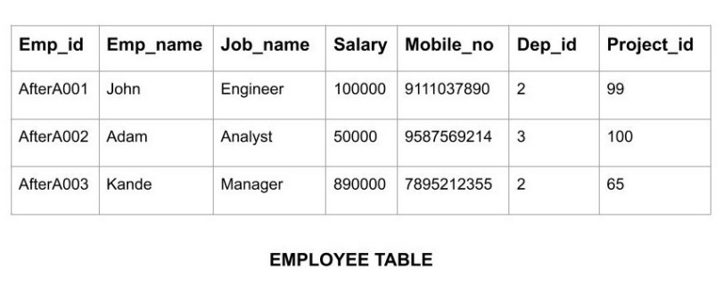
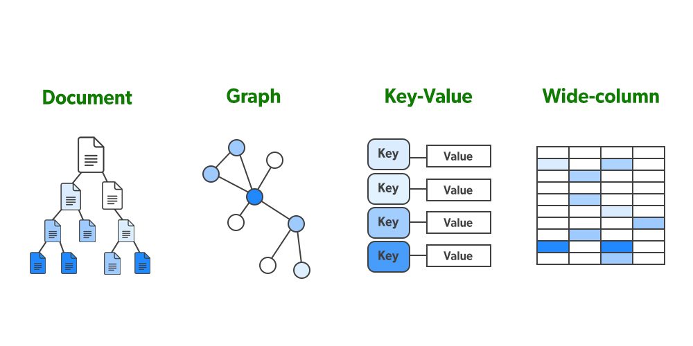
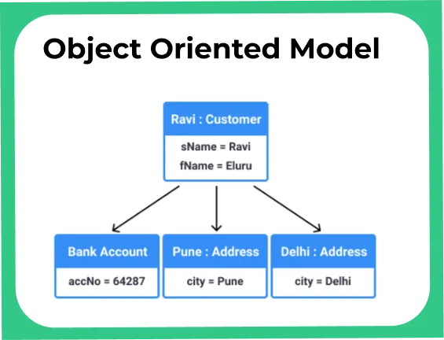
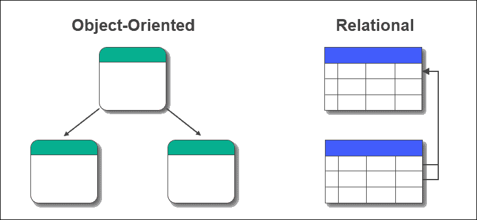
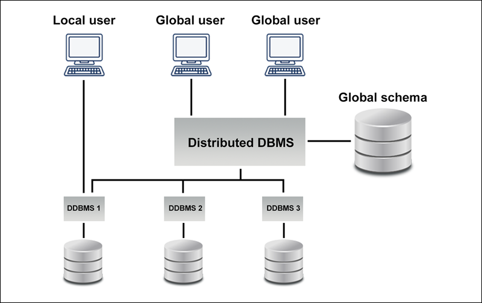
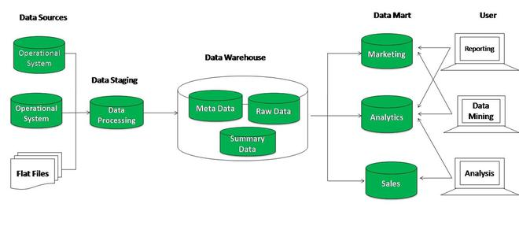
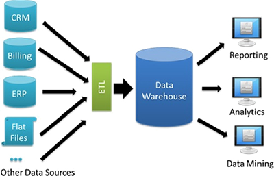
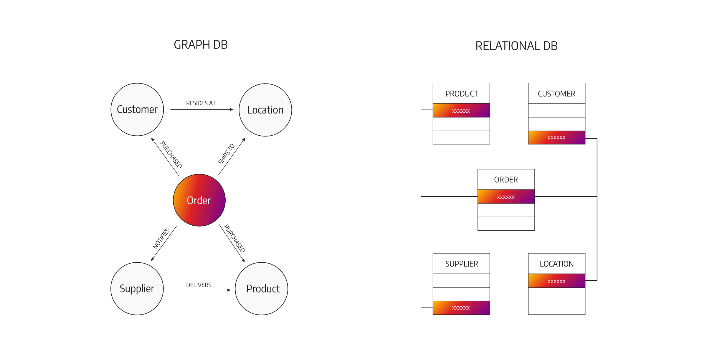
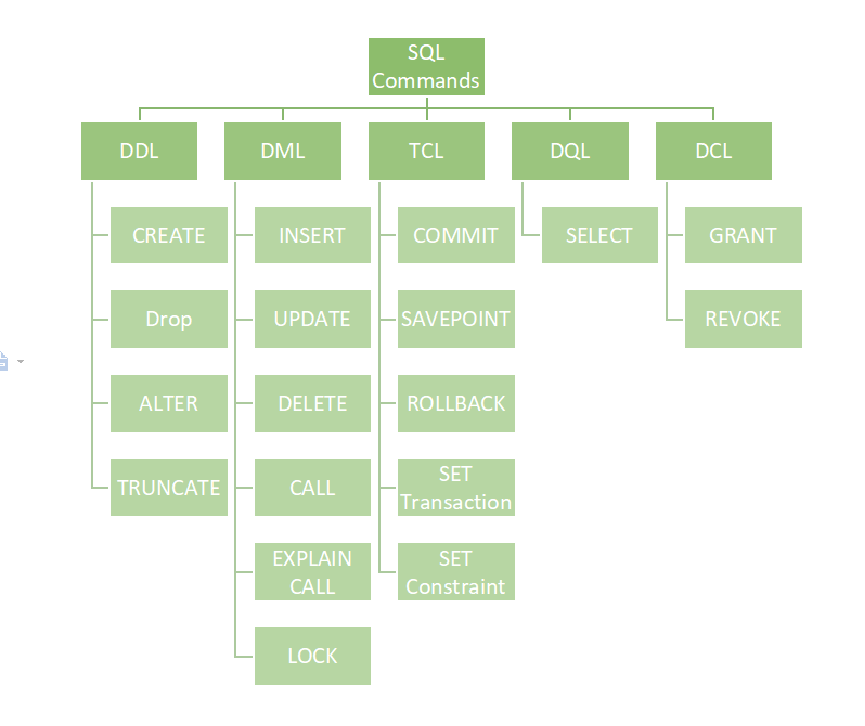
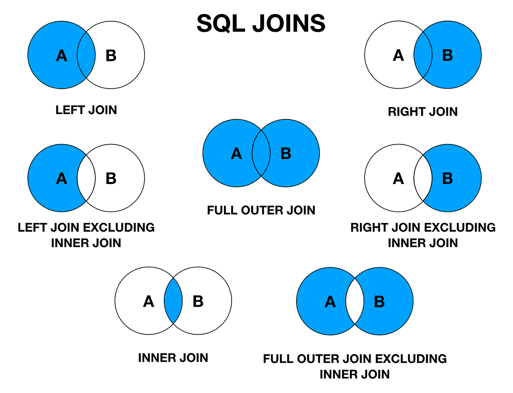

# Unit-2 

## SQL

**Introduction to Database**

Introduction to Database, Retrieve Data using the SQL SELECT Statement, Learn to Restrict and Sort Data, Usage of Single-Row Functions to Customize Output, Invoke Conversion Functions and Conditional Expressions, Aggregate Data Using the Group Functions

**DML, DDL, Joins**

Display Data from Multiple Tables Using Joins, Use Sub-Queries to Solve Queries, The SET Operators, Data Manipulation Statements, Use of DDL Statements to Create and Manage Tables, Other Schema Objects, Control User Access, Management of Schema Objects, Manage Objects with Data Dictionary Views Manipulate Large Data Sets

---
---
---

# **Introduction to Database**:

A **database** is an organized collection of structured data that is stored and accessed electronically. Databases allow users to store, retrieve, manage, and manipulate data efficiently. They are used in various applications, ranging from websites, enterprise systems, and mobile applications to research, e-commerce, and more.

---

### **Key Concepts in Databases**:

1. **Data**:
   - Data represents raw facts and figures without any context. Examples include numbers, names, and values.
   - In databases, data is stored in a structured format so that it can be retrieved and processed easily.

2. **Database Management System (DBMS)**:
   - A **DBMS** is software that allows users to interact with a database to perform tasks such as creating, reading, updating, and deleting data.
   - It provides a systematic way to manage databases and ensures efficient storage and retrieval of data.
   - Popular DBMS software includes:
     - **Relational DBMS (RDBMS)**: MySQL, Oracle, PostgreSQL, Microsoft SQL Server.
     - **Non-Relational (NoSQL) DBMS**: MongoDB, Cassandra, Redis.

3. **Types of Databases**:

   - **Relational Database**: Data is stored in tables (rows and columns), and relationships between tables are established through keys. SQL (Structured Query Language) is used to query the database. Examples: MySQL, PostgreSQL, SQL Server.
   - **NoSQL Database**: Designed to handle large-scale data in various formats (document, key-value, graph). Examples: MongoDB, Cassandra, Redis.
   - **Hierarchical Database**: Data is organized in a tree-like structure where each record has a single parent and multiple children.
   - **Network Database**: A more complex database model where multiple parent-child relationships are allowed.
   - **Object-Oriented Database**: Data is stored in the form of objects, similar to object-oriented programming. Example: ObjectDB.

---

### **Relational Database Concepts**:

1. **Table**:
   - A table is a collection of rows and columns where data is stored.
   - Each row in a table represents a single record, and each column represents a field (attribute) of that record.

2. **Schema**:
   - A **schema** defines the structure of a database, including tables, fields, data types, relationships, and constraints.
   - It serves as a blueprint for how the data is organized.

3. **Primary Key**:
   - A **primary key** is a unique identifier for a record in a table. It ensures that no two records have the same key, which allows data to be uniquely identified.

4. **Foreign Key**:
   - A **foreign key** is a field in one table that refers to the primary key of another table. This establishes a relationship between the two tables.

5. **SQL (Structured Query Language)**:
   - **SQL** is the standard language used to interact with relational databases. It allows users to create, read, update, and delete data.
   - Key SQL commands:
     - `SELECT`: Retrieve data from a table.
     - `INSERT`: Add new data to a table.
     - `UPDATE`: Modify existing data in a table.
     - `DELETE`: Remove data from a table.
     - `CREATE`: Create a new table or database.
     - `DROP`: Delete an existing table or database.

---

### **Normalization**:

**Normalization** is a process used to organize data within a database to reduce redundancy and improve data integrity. There are multiple normal forms (NF), with the most common being:

1. **First Normal Form (1NF)**:
   - Ensures that each field contains only atomic (indivisible) values, and each record is unique.

2. **Second Normal Form (2NF)**:
   - Ensures that the database is in 1NF and that all non-primary key attributes are fully dependent on the primary key.

3. **Third Normal Form (3NF)**:
   - Ensures that the database is in 2NF and that there are no transitive dependencies (a non-key attribute depends on another non-key attribute).

---

### **Indexes**:

An **index** is a data structure that improves the speed of data retrieval operations on a table. It allows faster searches, especially when dealing with large datasets. However, indexes can slow down data insertion, deletion, and updates, as the index needs to be updated along with the table.

---

### **ACID Properties**:

In database transactions, the **ACID** properties ensure that data remains consistent and reliable:

1. **Atomicity**: Ensures that each transaction is all-or-nothing. If one part of the transaction fails, the entire transaction fails.
2. **Consistency**: Ensures that a transaction takes the database from one valid state to another.
3. **Isolation**: Ensures that multiple transactions occur independently without interference.
4. **Durability**: Ensures that once a transaction is committed, it is permanent, even in the event of a system crash.

---

### **Types of Database Relationships**:

1. **One-to-One (1:1)**:
   - Each record in one table is related to one and only one record in another table.
   - Example: A table of employees and a table of employee details where each employee has exactly one detail entry.

2. **One-to-Many (1:N)**:
   - A single record in one table can be related to multiple records in another table.
   - Example: A customer can place many orders, but each order is placed by a single customer.

3. **Many-to-Many (M:N)**:
   - Multiple records in one table can relate to multiple records in another table.
   - Example: A student can enroll in many courses, and each course can have many students enrolled. This relationship is often handled by a junction table.

---

### **Database Integrity and Constraints**:

1. **Constraints**:
   - Constraints are rules applied to fields in a table to ensure data integrity.
   - Common constraints include:
     - **NOT NULL**: Ensures that a field cannot be left empty.
     - **UNIQUE**: Ensures that all values in a field are unique.
     - **CHECK**: Ensures that data entered into a field meets a specified condition.
     - **DEFAULT**: Provides a default value for a field if no value is specified.
     - **FOREIGN KEY**: Ensures that a field in one table matches a value in another table.

2. **Data Integrity**:
   - **Data integrity** ensures the accuracy and consistency of data over its lifecycle. It is maintained through various database constraints, normalization, and proper design.

---

### **Database Security**:

Database security is essential to protect sensitive information from unauthorized access or malicious activities. Some common security techniques include:

1. **Authentication**: Ensures that only authorized users can access the database.
2. **Authorization**: Assigns specific permissions to users based on their roles.
3. **Encryption**: Encrypts data at rest (in the database) and in transit (between users and the database).
4. **Backup and Recovery**: Ensures that data can be restored in case of accidental loss or corruption.

---

### **Popular DBMS Software**:

1. **MySQL**:
   - Open-source relational database management system.
   - Widely used in web applications and for smaller to medium-sized projects.

2. **Oracle**:
   - A commercial RDBMS with powerful features and scalability, used in enterprise environments.

3. **PostgreSQL**:
   - Open-source object-relational database system known for its standards compliance and advanced features.

4. **MongoDB**:
   - A NoSQL database that stores data in a document-oriented format (usually JSON or BSON).
   - Ideal for handling unstructured or semi-structured data.

5. **Microsoft SQL Server**:
   - A commercial RDBMS from Microsoft, designed for enterprise-level applications.

---

### **Cloud Databases**:

Many modern databases are hosted on cloud platforms, providing scalability, cost-efficiency, and ease of management. Cloud databases are offered as managed services by cloud providers:

1. **Amazon RDS** (Relational Database Service)
2. **Google Cloud SQL**
3. **Microsoft Azure SQL Database**
4. **Amazon DynamoDB** (NoSQL database)
5. **Firebase** (NoSQL database)

Cloud databases allow users to scale their database usage based on demand and provide features like automated backups, security, and global availability.

---
---
---

# **Structured Query Language (SQL)**

**Structured Query Language (SQL)** is a powerful and standardized language designed to manage and interact with relational databases. SQL is the backbone of relational database systems, allowing users to retrieve, insert, update, and delete data efficiently. It also provides the tools needed to create and modify database structures, control access to the database, and manage database transactions.

SQL is used across industries where data management is critical, such as finance, healthcare, retail, and software development. It plays an essential role in the backend of applications, supporting data-driven decision-making and ensuring that complex datasets can be handled efficiently.

---

### **Features of SQL**:

1. **Declarative Nature**: SQL allows users to specify *what* data they want without worrying about how it is retrieved. This makes SQL easy to use and understand.

2. **High-level Querying**: SQL is designed to retrieve large amounts of data efficiently. It allows complex queries with conditions, grouping, and sorting to fetch specific data from relational databases.

3. **Database Management**: SQL enables users to manage and modify database schemas, including creating, altering, and deleting tables, indexes, and constraints.

4. **Data Manipulation**: SQL supports data operations like insertion, updating, and deletion. It helps modify the records in a database quickly and accurately.

5. **Relational Database Interaction**: SQL is the language used to interact with relational databases, which store data in tables. These tables can have relationships with one another, allowing complex data queries.

6. **ACID Properties**: SQL ensures **ACID** (Atomicity, Consistency, Isolation, Durability) properties for transactions, ensuring the reliability and consistency of data in the event of failures or crashes.

7. **Security**: SQL offers robust mechanisms for data security. Administrators can assign different permissions to users, ensuring that only authorized individuals can access, modify, or delete data.

---

### **History of SQL**:

- **1970**: The development of SQL can be traced back to IBM in the early 1970s. The concept of relational databases was introduced by **Edgar F. Codd** in his seminal paper titled "A Relational Model of Data for Large Shared Data Banks." This laid the foundation for SQL.
  
- **1974**: **Donald D. Chamberlin** and **Raymond F. Boyce**, two IBM researchers, began developing a language called SEQUEL (Structured English Query Language) to interact with relational databases. SEQUEL eventually evolved into SQL.

- **1979**: The first commercial SQL-based product, **Oracle Version 2**, was released by Relational Software, Inc. (now Oracle Corporation).

- **1986**: SQL was standardized by the **American National Standards Institute (ANSI)** as the official language for relational databases, making it easier for different databases to interact with each other using SQL.

- **1990s to Present**: SQL became the most widely used language for managing relational databases. Major databases like **MySQL**, **PostgreSQL**, **Microsoft SQL Server**, and **Oracle** fully adopted SQL as their primary interface.

---

### **Applications of SQL**:

SQL is essential for a wide range of applications across industries, including:

1. **Web and Application Development**:
   - SQL is commonly used in the backend of web applications to store, retrieve, and manage data. For example, a user registering on a website will have their details stored in a SQL database.

2. **Data Analysis and Business Intelligence**:
   - Analysts use SQL to query databases, summarize, and analyze data for making data-driven decisions. SQL helps extract data from databases for business intelligence purposes.

3. **Data Warehousing**:
   - SQL is used in **data warehouses** where massive amounts of data are stored for analytics purposes. SQL queries aggregate and summarize large datasets, making them ready for analysis and reporting.

4. **E-commerce**:
   - SQL is the backbone of e-commerce websites. It helps manage customer data, product inventories, orders, and transaction records.

5. **Finance and Banking**:
   - Banks and financial institutions rely on SQL for maintaining customer information, transaction details, accounts, loans, and various financial products. SQL ensures secure and reliable transactions.

6. **Healthcare**:
   - Healthcare systems use SQL databases to store patient information, manage appointments, maintain health records, and process insurance claims efficiently.

7. **Education**:
   - In educational systems, SQL manages student data, course information, grading systems, and scheduling.

---

### **Advantages of SQL**:

1. **Efficient Querying**: SQL can retrieve data from large datasets quickly using optimized querying methods.
  
2. **Flexibility**: SQL can handle complex queries involving multiple conditions, joins, grouping, and aggregation, making it very flexible.

3. **Portability**: SQL is supported by most database systems like MySQL, PostgreSQL, Oracle, and SQL Server, allowing it to be portable across platforms.

4. **Data Integrity and Security**: SQL provides constraints and user privileges that maintain data accuracy and ensure secure access to sensitive information.

5. **Easy to Learn**: SQL’s syntax is relatively simple, making it an easy language for beginners to learn and apply.

---

### **Disadvantages of SQL**:

1. **Vendor-Specific Implementations**:
   - Despite being standardized, SQL implementations can vary slightly between different database vendors (e.g., MySQL vs. Oracle), causing compatibility issues when migrating databases.

2. **Limited Procedural Capabilities**:
   - SQL is not a fully procedural language. While procedural extensions like PL/SQL (Oracle) and T-SQL (Microsoft SQL Server) exist, SQL itself lacks advanced programming constructs such as loops and conditions found in other languages.

3. **Scalability**:
   - SQL databases may face challenges when scaling horizontally, particularly with very large datasets spread across distributed environments. NoSQL databases are often preferred for such cases.

4. **Complex Queries**:
   - For very complex datasets or conditions, SQL queries can become difficult to understand and maintain, especially as the database grows.

5. **Cost**:
   - Some commercial RDBMS platforms, like Oracle or Microsoft SQL Server, are expensive, making them less accessible to smaller businesses.

---

### **Types of SQL Commands**:

SQL is divided into various categories based on the type of operation being performed:

1. **Data Definition Language (DDL)**:
   - Commands used to define and manage the database structure.
   - Examples: 
     - `CREATE` – Create a new table, index, or database.
     - `ALTER` – Modify an existing database object like a table or index.
     - `DROP` – Delete a table, index, or database.
   
   ```sql
   CREATE TABLE employees (
       employee_id INT PRIMARY KEY,
       first_name VARCHAR(50),
       last_name VARCHAR(50),
       department VARCHAR(100)
   );
   ```

2. **Data Manipulation Language (DML)**:
   - Commands that allow users to manipulate data stored in the database.
   - Examples:
     - `SELECT` – Retrieve data from tables.
     - `INSERT` – Insert new records into tables.
     - `UPDATE` – Modify existing data.
     - `DELETE` – Remove records from tables.

   ```sql
   SELECT first_name, last_name FROM employees WHERE department = 'Sales';
   ```

3. **Data Control Language (DCL)**:
   - Commands that control access to the data in the database.
   - Examples:
     - `GRANT` – Give a user access to the database or specific operations.
     - `REVOKE` – Remove user access permissions.

   ```sql
   GRANT SELECT, INSERT ON employees TO 'username';
   ```

4. **Transaction Control Language (TCL)**:
   - Commands that manage transactions in the database.
   - Examples:
     - `COMMIT` – Save changes made during a transaction.
     - `ROLLBACK` – Undo changes made during a transaction.
     - `SAVEPOINT` – Set a point within a transaction to which a rollback can occur.

   ```sql
   BEGIN TRANSACTION;
   UPDATE employees SET department = 'HR' WHERE employee_id = 101;
   COMMIT;
   ```

---
---

# **Structured Query Language (SQL) (Hinglish)**

**Structured Query Language (SQL)** ek powerful aur standardized language hai jo relational databases ko manage aur interact karne ke liye use hoti hai. SQL ke through users data ko retrieve (nikalna), insert (daalna), update (sudharna) aur delete (hatana) kar sakte hain. Ye database structures ko create aur modify karne, database access ko control karne, aur transactions ko manage karne ke tools bhi provide karta hai.

SQL har jagah use hota hai jahan data management important hai, jaise finance, healthcare, retail, aur software development. Ye applications ke backend ka essential part hota hai jo data-driven decisions ko support karta hai aur complex datasets ko efficiently handle karta hai.

---

### **SQL ke Features**:

1. **Declarative Nature**: SQL users ko sirf yeh specify karne deta hai ke *kya* data chahiye, bina yeh sochne ke kaise retrieve kiya jayega. Is wajah se SQL use karna kaafi aasan hota hai.

2. **High-level Querying**: SQL large amounts of data ko efficiently retrieve karta hai. Complex queries ko conditions, grouping, aur sorting ke saath handle kar sakta hai taaki specific data ko relational databases se nikala ja sake.

3. **Database Management**: SQL users ko database schemas manage aur modify karne deta hai, jaise tables, indexes aur constraints ko create, alter, aur delete karna.

4. **Data Manipulation**: SQL data operations ko support karta hai jaise insertion, updating, aur deletion, jisse records ko jaldi aur accurately modify kiya ja sakta hai.

5. **Relational Database Interaction**: SQL relational databases ke saath interact karta hai, jo data ko tables mein store karti hain. In tables ke beech relations ho sakti hain jo complex queries ko possible banati hain.

6. **ACID Properties**: SQL **ACID** properties ko ensure karta hai (Atomicity, Consistency, Isolation, Durability), jo ki transactions ko reliable aur consistent banati hain, chahe koi failure ho ya crash.

7. **Security**: SQL data security ke liye strong mechanisms provide karta hai. Administrators alag-alag users ko different permissions assign kar sakte hain taaki sirf authorized log hi data ko access, modify ya delete kar sakein.

---

### **SQL ka Itihaas**:

- **1970**: SQL ka development IBM mein early 1970s mein shuru hua tha. Relational databases ka concept **Edgar F. Codd** ne introduce kiya tha apne paper "A Relational Model of Data for Large Shared Data Banks" mein.

- **1974**: **Donald D. Chamberlin** aur **Raymond F. Boyce**, IBM ke researchers, ne ek language develop karna shuru ki jo SEQUEL (Structured English Query Language) kehlai. Yeh baad mein SQL bana.

- **1979**: Pehla commercial SQL-based product **Oracle Version 2** launch hua by Relational Software, Inc. (ab Oracle Corporation).

- **1986**: SQL ko **ANSI** (American National Standards Institute) ne standardize kiya, jo relational databases ke liye official language ban gaya.

- **1990s se Ab Tak**: SQL duniya bhar mein sabse zyada use hone wala relational database language ban gaya hai, aur major databases jaise **MySQL**, **PostgreSQL**, **Microsoft SQL Server**, aur **Oracle** SQL ko apna primary interface banaye hue hain.

---

### **SQL ke Applications**:

SQL kai industries mein use hota hai, jaise:

1. **Web aur Application Development**:
   - Web applications ke backend mein SQL use hota hai data ko store, retrieve aur manage karne ke liye. Jaise kisi user ka registration website pe SQL database mein save hota hai.

2. **Data Analysis aur Business Intelligence**:
   - Analysts SQL ka use karke databases ko query karte hain aur data ko analyze karte hain taaki business decisions liye ja sakein.

3. **Data Warehousing**:
   - **Data warehouses** mein SQL ka use hota hai jahan massive data store kiya jaata hai for analytics purposes.

4. **E-commerce**:
   - E-commerce websites ke backend mein SQL hota hai jo customer data, product inventories, orders aur transactions ko manage karta hai.

5. **Finance aur Banking**:
   - Banks SQL use karte hain customer information, transactions, accounts aur loans ko maintain karne ke liye.

6. **Healthcare**:
   - Healthcare systems SQL databases use karte hain patient information, appointments aur medical records manage karne ke liye.

7. **Education**:
   - Educational systems SQL ko student data, course information aur grading ke liye use karte hain.

---

### **SQL ke Fayde**:

1. **Efficient Querying**: SQL bade datasets ko jaldi aur efficiently query karta hai.
  
2. **Flexibility**: SQL complex queries ko handle kar sakta hai, jo multiple conditions, joins aur grouping ke saath ho sakti hain.

3. **Portability**: SQL ko MySQL, PostgreSQL, Oracle aur SQL Server jaise databases support karte hain, jisse yeh har platform pe portable hota hai.

4. **Data Integrity aur Security**: SQL constraints aur user privileges deta hai jo data ki accuracy ko ensure karta hai aur unauthorized access ko rokta hai.

5. **Aasaan Seekhna**: SQL ki syntax simple hai, jisse beginners ke liye seekhna easy hota hai.

---

### **SQL ke Nuksaan**:

1. **Vendor-Specific Implementations**:
   - SQL standardized hone ke bawajood, alag-alag database vendors (e.g., MySQL aur Oracle) mein thoda variation hota hai, jo compatibility issues create kar sakta hai.

2. **Limited Procedural Capabilities**:
   - SQL ek fully procedural language nahi hai. Isme advanced programming constructs jaise loops aur conditions ki kami hai, jo doosri programming languages mein hote hain.

3. **Scalability**:
   - SQL databases ko horizontal scaling mein dikkat hoti hai, khaaskar jab baat very large distributed datasets ki ho.

4. **Complex Queries**:
   - Agar datasets ya conditions complex ho jayein, to SQL queries difficult aur maintain karna challenging ho sakta hai.

5. **Cost**:
   - Kuch commercial RDBMS platforms, jaise Oracle ya Microsoft SQL Server, expensive hote hain jo chhoti businesses ke liye accessible nahi hote.

---

### **SQL ke Types**:

SQL ko alag-alag categories mein divide kiya gaya hai operations ke basis pe:

1. **Data Definition Language (DDL)**:
   - Yeh commands database structure ko define aur manage karne ke liye hoti hain.
   - Examples: 
     - `CREATE` – New table ya database create karna.
     - `ALTER` – Existing object ko modify karna.
     - `DROP` – Table ya database delete karna.
   
   ```sql
   CREATE TABLE employees (
       employee_id INT PRIMARY KEY,
       first_name VARCHAR(50),
       last_name VARCHAR(50),
       department VARCHAR(100)
   );
   ```

2. **Data Manipulation Language (DML)**:
   - Data ko manipulate karne ke liye commands use hoti hain.
   - Examples:
     - `SELECT` – Data retrieve karna.
     - `INSERT` – Data insert karna.
     - `UPDATE` – Data update karna.
     - `DELETE` – Data delete karna.

   ```sql
   SELECT first_name, last_name FROM employees WHERE department = 'Sales';
   ```

3. **Data Control Language (DCL)**:
   - Data ko control karne ke commands hoti hain.
   - Examples:
     - `GRANT` – Kisi user ko database access dena.
     - `REVOKE` – User se access permissions ko hataana.

   ```sql
   GRANT SELECT, INSERT ON employees TO 'username';
   ```

4. **Transaction Control Language (TCL)**:
   - Transactions ko manage karne ke commands hoti hain.
   - Examples:
     - `COMMIT` – Transaction ko save karna.
     - `ROLLBACK` – Transaction ko undo karna.
     - `SAVEPOINT` – Ek point set karna jahan rollback ho sake.

   ```sql
   BEGIN TRANSACTION;
   UPDATE employees SET department = 'HR' WHERE employee_id = 101;
   COMMIT;
   ```

---
---
---

## **Difference between Database and Spreadsheet** 

---

**Database vs Spreadsheet** – Both serve the primary purpose of storing data, but their use cases and functionalities are different. Let’s understand the differences between the two:

### **1. Data Structure**:
- **Database**: Stores data in a structured format with multiple tables that are relational. Each table consists of rows (records) and columns (fields), and relationships exist between the tables.
- **Spreadsheet**: Data is stored in rows and columns, but a spreadsheet has a flat structure. It lacks advanced capabilities for relations or linking.

### **2. Data Size**:
- **Database**: Designed to handle large-scale data efficiently. It can manage multiple tables and can store millions or billions of records.
- **Spreadsheet**: More suitable for small to medium-sized datasets. It may slow down or hit limits when dealing with large data sets.

### **3. Complexity Handling**:
- **Database**: Supports complex data relationships, transactions, and multiple users simultaneously. It uses a powerful querying language like **SQL** to execute complex queries easily.
- **Spreadsheet**: Used for simpler calculations and basic analysis. Tools like formulas, pivot tables, and charts are available in Excel, but it cannot handle complex data relationships.

### **4. Data Integrity and Validation**:
- **Database**: Rules and constraints (such as primary keys and foreign keys) can be applied to maintain data integrity, ensuring that the data is accurate and consistent.
- **Spreadsheet**: Has basic data validation features, but it does not support advanced data integrity constraints.

### **5. Multi-User Access**:
- **Database**: Provides access to multiple users at the same time and manages concurrent transactions. User roles and permissions can be set.
- **Spreadsheet**: Typically designed for single-user or limited multi-user environments. For collaboration, cloud-based tools like Google Sheets are used, but issues may arise with concurrent editing.

### **6. Security**:
- **Database**: Comes with advanced security features such as encryption, user roles, access control, and audit trails, which protect highly sensitive data.
- **Spreadsheet**: Has limited security options like password protection but is not as robust as a database.

### **7. Data Querying**:
- **Database**: Uses languages like **SQL** to retrieve data, allowing for complex and efficient queries.
- **Spreadsheet**: Offers basic search, filters, and pivot tables for data querying, but it is sufficient only for simple analysis.

### **8. Automation and Programming**:
- **Database**: Can integrate with programming languages (such as Python, Java, PHP) and supports automated processes.
- **Spreadsheet**: Supports basic scripting through **VBA** (Excel) or **Google Apps Script** (Google Sheets) but is limited for advanced automation.

### **9. Scalability**:
- **Database**: A scalable solution for large-scale data applications. It can efficiently manage large data warehouses or distributed databases.
- **Spreadsheet**: Can become slow with increased data size and provides limited performance.

### **10. Backup and Recovery**:
- **Database**: Comes with advanced backup and recovery features that can restore data in case of crashes or corruption.
- **Spreadsheet**: Requires manual effort or cloud storage for backup, which is limited compared to databases.


| **Feature**              | **Database**                                             | **Spreadsheet**                                  |
|--------------------------|----------------------------------------------------------|--------------------------------------------------|
| **Data Structure**        | Structured format with tables and relationships          | Flat structure with rows and columns             |
| **Data Size**             | Can handle large-scale data (millions of records)         | Suitable for small to medium-sized datasets      |
| **Complexity Handling**   | Handles complex relationships and queries with SQL       | Limited to simple calculations and analysis      |
| **Data Integrity**        | Maintains data integrity with rules (primary key, etc.)   | Basic data validation; no complex constraints    |
| **Multi-User Access**     | Supports multiple users and transactions simultaneously  | Limited multi-user collaboration                 |
| **Security**              | Advanced security (encryption, user roles, etc.)         | Basic security (password protection)             |
| **Data Querying**         | Uses SQL for complex data retrieval                      | Basic filtering, search, and pivot tables        |
| **Automation**            | Supports programming languages for automation            | Limited scripting (VBA or Google Apps Script)    |
| **Scalability**           | Highly scalable for large applications                   | Limited scalability for growing data             |
| **Backup & Recovery**     | Advanced backup and recovery options                     | Basic backup options (manual or cloud-based)     |

---
---


**Database vs Spreadsheet(Hinglish)** – In dono ka basic kaam data ko store karna hai, lekin inka use aur functionality alag hoti hai. Yaha par hum in dono ke beech ke differences ko samajhte hain:

### **1. Data Structure**:
- **Database**: Ek structured format mein data ko store karta hai, jisme multiple tables hote hain jo relational form mein hote hain. Har table mein rows (records) aur columns (fields) hote hain, aur tables ke beech relations hoti hain.
- **Spreadsheet**: Rows aur columns mein data ko store karta hai, lekin spreadsheet ek flat structure hota hai. Relation ya linking ki koi advanced capability nahi hoti.

### **2. Data Size**:
- **Database**: Large-scale data ko handle karne ke liye bana hota hai. Multiple tables aur lakhs ya crores ke records ko efficiently manage kar sakta hai.
- **Spreadsheet**: Chhote aur medium-sized datasets ke liye zyada suitable hota hai. Large data sets ke saath slow ho sakta hai ya limit par aa sakta hai.

### **3. Complexity Handling**:
- **Database**: Complex data relationships, transactions aur multiple users ko simultaneously support karta hai. Isme **SQL** jaisi powerful querying language hoti hai jisse complex queries ko easily execute kiya ja sakta hai.
- **Spreadsheet**: Simpler calculations aur basic analysis ke liye use hota hai. Excel mein formulas, pivot tables, aur charts available hote hain, lekin complex data relationships ko handle nahi karta.

### **4. Data Integrity and Validation**:
- **Database**: Data integrity maintain karne ke liye rules aur constraints (jaise primary key, foreign key) lagaye ja sakte hain. Yeh ensure karta hai ki data accurate aur consistent rahe.
- **Spreadsheet**: Basic data validation ke features hote hain, lekin advanced data integrity constraints ka support nahi hota.

### **5. Multi-User Access**:
- **Database**: Multiple users ko same time par access provide karta hai, aur concurrent transactions ko manage karta hai. Isme user roles aur permissions set kiye ja sakte hain.
- **Spreadsheet**: Typically single-user ya limited multi-user environment ke liye hota hai. Collaboration ke liye cloud-based tools ka use karna padta hai, jaise Google Sheets, lekin concurrent editing ke issues ho sakte hain.

### **6. Security**:
- **Database**: Advanced security features hote hain jaise encryption, user roles, access control, aur audit trails, jo highly sensitive data ko protect karte hain.
- **Spreadsheet**: Limited security options hote hain, jaise password protection, lekin itna robust nahi hota jitna ek database.

### **7. Data Querying**:
- **Database**: Data ko retrieve karne ke liye **SQL** jaisi languages use hoti hain, jo complex aur efficient queries ko run kar sakti hain.
- **Spreadsheet**: Data querying ke liye basic search, filters, aur pivot tables ka use kiya ja sakta hai, lekin yeh simple analysis ke liye hi sufficient hota hai.

### **8. Automation and Programming**:
- **Database**: Databases programming languages ke saath integrate kiye ja sakte hain (jaise Python, Java, PHP) aur automated processes ko support karte hain.
- **Spreadsheet**: Basic scripting ke liye **VBA** (Excel) ya **Google Apps Script** (Google Sheets) ka support hota hai, lekin advanced automation ke liye limited hota hai.

### **9. Scalability**:
- **Database**: Large-scale data applications ke liye scalable solution hota hai. Bahut bade data warehouses ya distributed databases bhi efficiently manage kar sakte hain.
- **Spreadsheet**: Data size badhne par spreadsheet slow ho sakta hai aur limited performance deta hai.

### **10. Backup and Recovery**:
- **Database**: Advanced backup aur recovery features ke saath aata hai, jo crash hone par ya data corruption hone par data restore kar sakta hai.
- **Spreadsheet**: Backup ke liye manual effort ya cloud storage ka use karna padta hai, jo databases ke comparison mein limited hota hai.

---
---
---

# **Types of database** 
1. Relational databases
2. NoSQL databases 
3. Object-oriented databases 
4. Distributed databases 
5. Data warehouses 
6. Graph databases 
7. OLTP databases
8. Open source databases 
9. Cloud databases
10. Multimodel database 
11. Document/JSON database 
12. Self-driving databases


Let's expand each section of the **Relational Databases** overview with more in-depth information, examples, and context.

---

## **Relational Databases**

#### **1. Definition:**
Relational databases organize data into structured tables that allow for easy access, management, and modification. Each table, often referred to as a relation, comprises rows and columns, where:

- **Rows (Records)**: Each row in a table corresponds to a single entry or record of the data entity it represents. For example, in a table of customers, each row would contain details about one specific customer.
  
- **Columns (Attributes)**: Each column represents a specific attribute or property of the data entity. For example, a customer table may include columns like CustomerID, Name, Email, and PhoneNumber.

The power of relational databases comes from their ability to relate tables to each other through keys, allowing for complex queries and data manipulation while ensuring data integrity.

#### **2. Architecture:**
The architecture of relational databases can be broken down into several key components:

- **Tables**: The primary structure used to store data. Each table has a unique name and a defined schema, which describes the table's structure, including column names, data types, and constraints.

- **Primary Key**: A unique identifier for each record in a table. For example, in a customer table, the CustomerID could be the primary key, ensuring that no two customers can have the same ID.

- **Foreign Key**: A field in one table that links to the primary key of another table. For example, an Orders table may include a CustomerID foreign key that references the CustomerID primary key in the Customers table. This relationship establishes a link between customers and their orders.

- **Relationships**: Tables can have various types of relationships, including:
  - **One-to-One**: A record in one table is linked to one record in another table (e.g., a person has one passport).
  - **One-to-Many**: A record in one table can relate to multiple records in another (e.g., a customer can place multiple orders).
  - **Many-to-Many**: Records in one table can relate to multiple records in another (e.g., students and courses). This is often implemented using a junction table.

#### **3. Key Features:**
- **Structured Data**: Relational databases require a predefined schema, meaning the structure must be defined before data can be entered. This enforces data integrity and helps prevent anomalies.

- **Normalization**: A process used to minimize data redundancy and ensure data integrity by organizing tables and relationships. For example, instead of storing customer information repeatedly in every order, a separate Customers table is created and linked to the Orders table through a foreign key.

- **ACID Transactions**: This is crucial for maintaining the integrity of data, especially in multi-user environments:
  - **Atomicity**: Ensures that all operations within a transaction are completed successfully or none at all. For example, transferring money from one bank account to another should either complete fully or not happen at all.
  - **Consistency**: Ensures that any transaction will bring the database from one valid state to another. For example, an order cannot exist in the database without a corresponding customer.
  - **Isolation**: Ensures that concurrent transactions do not affect each other's execution. For instance, if two users are trying to update the same record, isolation prevents interference.
  - **Durability**: Guarantees that once a transaction is committed, it remains so, even in the event of a system failure. For example, once a payment is confirmed, it should be saved to the database permanently.

- **SQL (Structured Query Language)**: The standard language for interacting with relational databases. SQL allows users to create, read, update, and delete data, as well as define schemas. Examples include:
  - `SELECT * FROM Customers;` retrieves all records from the Customers table.
  - `INSERT INTO Orders (OrderID, CustomerID, OrderDate) VALUES (1, 101, '2024-10-08');` adds a new record to the Orders table.

#### **4. Advantages:**
- **Data Integrity**: The use of primary and foreign keys, along with constraints like NOT NULL and UNIQUE, ensures that the data remains accurate and consistent. For instance, if a customer record is deleted, all associated orders can be automatically deleted or handled through cascading rules.

- **Complex Queries**: SQL provides powerful querying capabilities, enabling users to perform joins across multiple tables. For example, you can retrieve a list of all orders along with customer names using a join query:
  ```sql
  SELECT Customers.Name, Orders.OrderDate
  FROM Customers
  JOIN Orders ON Customers.CustomerID = Orders.CustomerID;
  ```

- **Scalability**: Relational databases can be scaled vertically by adding more resources (CPU, memory) to the server. Additionally, some modern RDBMS systems, like PostgreSQL, offer horizontal scaling capabilities through sharding.

- **Mature Ecosystem**: A large number of tools and libraries are available for relational databases, providing support for backup, performance tuning, and data migration, which can significantly enhance productivity and efficiency.

#### **5. Disadvantages:**
- **Rigid Schema**: Changes to the database schema can be difficult and may require data migration. For example, adding a new column to a large table might necessitate downtime, data backup, and careful planning to avoid data loss.

- **Scaling Limitations**: While vertical scaling can increase performance, it has limits. Horizontal scaling is not as straightforward due to the need to manage relationships across multiple servers, which can lead to increased complexity.

- **Performance**: As data volume grows, queries may slow down, especially if they are not optimized. Indexing can help improve performance but requires careful planning and maintenance.

#### **6. Use Cases:**
- **Financial Systems**: These systems, such as banking applications, require strict adherence to ACID properties to ensure transactions are accurately processed and recorded.

- **E-Commerce Platforms**: Relational databases are ideal for managing product inventories, customer information, and transactional data, ensuring that relationships between tables (such as customers and orders) are maintained.

- **Content Management Systems (CMS)**: Many CMS platforms use relational databases to store articles, user profiles, and other content types, allowing for structured querying and management.

- **Human Resource Management Systems (HRMS)**: These systems track employee data, payroll, and benefits, leveraging the relational model to maintain relationships between employees, departments, and roles.

- **Customer Relationship Management (CRM)**: CRMs manage customer interactions, sales, and data analysis, relying on the relational model to track complex relationships and histories.

#### **7. Popular Relational Database Management Systems (RDBMS):**
- **MySQL**:
  - **Description**: An open-source RDBMS widely used for web applications due to its speed, reliability, and ease of use. MySQL is particularly popular in LAMP (Linux, Apache, MySQL, PHP) stack applications.
  - **Use Case**: Often used in content management systems like WordPress and e-commerce platforms such as Magento.

- **PostgreSQL**:
  - **Description**: A powerful open-source RDBMS known for its advanced features, including support for complex queries and data types, making it highly extensible.
  - **Use Case**: Frequently used in applications requiring complex data processing, such as financial systems and data analytics applications.

- **Oracle Database**:
  - **Description**: A commercial RDBMS that offers high performance, scalability, and advanced features like partitioning, clustering, and multi-version concurrency control.
  - **Use Case**: Commonly found in large enterprise applications, ERP systems, and data warehousing solutions where high availability and reliability are critical.

- **Microsoft SQL Server**:
  - **Description**: A relational database management system developed by Microsoft, known for its deep integration with Microsoft tools and services.
  - **Use Case**: Widely used in enterprise applications, particularly in organizations that utilize the Microsoft ecosystem for business operations.

- **SQLite**:
  - **Description**: A lightweight, file-based RDBMS that is serverless and self-contained, making it easy to deploy and manage.
  - **Use Case**: Ideal for mobile applications, desktop applications, and small-scale projects where a full RDBMS may be overkill.

#### **8. Example Schema:**


## **Relational Databases(Hinglish)**

#### **1. Definition:**
Relational databases data ko structured tables mein organize karte hain, jisse data ko easily access, manage, aur modify kiya ja sakta hai. Har table, jise relation kehte hain, rows aur columns se banta hai:

- **Rows (Records)**: Table ki har row ek specific entry ya record ko represent karti hai. Jaise, agar customer ki table hai, to har row ek specific customer ki details rakhti hai.
  
- **Columns (Attributes)**: Har column data entity ki specific attribute ya property ko represent karta hai. Jaise, customer table mein columns ho sakte hain jaise CustomerID, Name, Email, aur PhoneNumber.

Relational databases ki power yeh hai ki yeh tables ko keys ke through ek dusre se relate karte hain, jisse complex queries aur data manipulation kiya ja sakta hai, jabki data integrity bhi maintain hoti hai.

#### **2. Architecture:**
Relational databases ki architecture ko kuch key components mein breakdown kiya ja sakta hai:

- **Tables**: Ye primary structure hai data store karne ke liye. Har table ka unique name hota hai aur ek defined schema hota hai, jo table ki structure ko describe karta hai, including column names, data types, aur constraints.

- **Primary Key**: Ye har record ka unique identifier hota hai table mein. Jaise, customer table mein CustomerID primary key ho sakta hai, jo ensure karta hai ki do customers ka same ID nahi ho sakta.

- **Foreign Key**: Ye ek table ka field hai jo doosre table ke primary key ko link karta hai. Jaise, Orders table mein CustomerID foreign key ho sakta hai jo Customers table ke CustomerID primary key ko reference karta hai. Is relationship se customers aur unke orders ke beech link establish hota hai.

- **Relationships**: Tables ke beech alag-alag types ke relationships hote hain, jaise:
  - **One-to-One**: Ek table ka record doosre table ke ek record se linked hota hai (jaise, ek insaan ka ek passport hota hai).
  - **One-to-Many**: Ek table ka record multiple records se relate kar sakta hai (jaise, ek customer multiple orders de sakta hai).
  - **Many-to-Many**: Ek table ke records multiple records se relate kar sakte hain (jaise, students aur courses). Ye aksar junction table ke through implement hota hai.

#### **3. Key Features:**
- **Structured Data**: Relational databases ko predefined schema ki zaroorat hoti hai, matlab structure ko define karna hota hai pehle se pehle. Isse data integrity enforce hoti hai aur anomalies prevent hoti hain.

- **Normalization**: Ye process data redundancy ko minimize karne aur data integrity ensure karne ke liye hota hai. Jaise, har order mein customer information repeat karne ke bajaye, ek separate Customers table banaya jata hai jo Orders table ke sath foreign key ke through linked hota hai.

- **ACID Transactions**: Ye data ki integrity maintain karne ke liye bahut zaroori hai, khaas taur par multi-user environments mein:
  - **Atomicity**: Ensure karta hai ki transaction ke andar saari operations successfully complete hon ya bilkul nahi. Jaise, agar ek bank account se doosre account mein paise transfer ho rahe hain, to ya to poora transfer hoga ya nahi.
  - **Consistency**: Ensure karta hai ki koi bhi transaction database ko ek valid state se doosri valid state mein le jaayega. Jaise, ek order database mein nahi ho sakta agar uska corresponding customer nahi hai.
  - **Isolation**: Ensure karta hai ki concurrent transactions ek dusre ke execution ko affect nahi karein. Jaise, agar do users same record ko update kar rahe hain, to isolation interference ko prevent karta hai.
  - **Durability**: Guarantee karta hai ki jab transaction commit ho jata hai, to wo permanent rahega, chahe system failure ho. Jaise, jab payment confirm hoti hai, to wo database mein permanently save honi chahiye.

- **SQL (Structured Query Language)**: Ye relational databases ke sath interact karne ke liye standard language hai. SQL users ko data create, read, update, aur delete karne ki suvidha deti hai, saath hi schemas ko define karne ki bhi. Examples hain:
  - `SELECT * FROM Customers;` jo Customers table se saare records ko retrieve karta hai.
  - `INSERT INTO Orders (OrderID, CustomerID, OrderDate) VALUES (1, 101, '2024-10-08');` jo Orders table mein ek naya record add karta hai.

#### **4. Advantages:**
- **Data Integrity**: Primary aur foreign keys ka use, saath hi constraints jaise NOT NULL aur UNIQUE, ensure karta hai ki data accurate aur consistent rahe. Jaise, agar ek customer record delete hota hai, to associated orders ko bhi automatically delete ya cascading rules ke through handle kiya ja sakta hai.

- **Complex Queries**: SQL powerful querying capabilities provide karta hai, jisse users multiple tables par join kar sakte hain. Jaise, aap orders ke saath customer names ki list retrieve kar sakte hain using a join query:
  ```sql
  SELECT Customers.Name, Orders.OrderDate
  FROM Customers
  JOIN Orders ON Customers.CustomerID = Orders.CustomerID;
  ```

- **Scalability**: Relational databases ko vertically scale kiya ja sakta hai by adding more resources (CPU, memory) to the server. Kuch modern RDBMS systems, jaise PostgreSQL, horizontal scaling capabilities bhi offer karte hain through sharding.

- **Mature Ecosystem**: Relational databases ke liye bohot saare tools aur libraries available hain, jo backup, performance tuning, aur data migration jaise tasks ko support karte hain, jisse productivity aur efficiency enhance hoti hai.

#### **5. Disadvantages:**
- **Rigid Schema**: Database schema mein changes karna mushkil ho sakta hai aur isse data migration ki zaroorat pad sakti hai. Jaise, ek large table mein naya column add karne se downtime, data backup, aur careful planning ki zaroorat hoti hai.

- **Scaling Limitations**: Jabki vertical scaling performance ko increase kar sakta hai, iski bhi limits hain. Horizontal scaling itna straightforward nahi hota kyunki multiple servers ke beech relationships ko manage karna padta hai, jo complexity badha sakta hai.

- **Performance**: Jaise-jaise data volume badhta hai, queries slow ho sakti hain, khaas taur par agar wo optimized nahi hain. Indexing performance improve karne mein help kar sakta hai, lekin iski careful planning aur maintenance ki zaroorat hoti hai.

#### **6. Use Cases:**
- **Financial Systems**: Ye systems, jaise banking applications, ACID properties ka strict adherence chahte hain taaki transactions accurately process aur record ho sakein.

- **E-Commerce Platforms**: Relational databases products inventories, customer information, aur transactional data ko manage karne ke liye ideal hote hain, jisse tables ke beech relationships maintain hote hain (jaise customers aur orders).

- **Content Management Systems (CMS)**: Kai CMS platforms relational databases ka use articles, user profiles, aur other content types store karne ke liye karte hain, jisse structured querying aur management possible hota hai.

- **Human Resource Management Systems (HRMS)**: Ye systems employee data, payroll, aur benefits ko track karte hain, relational model ko use karke employees, departments, aur roles ke beech relationships maintain karte hain.

- **Customer Relationship Management (CRM)**: CRMs customer interactions, sales, aur data analysis ko manage karte hain, relational model ko use karke complex relationships aur histories ko track karte hain.

#### **7. Popular Relational Database Management Systems (RDBMS):**
- **MySQL**:
  - **Description**: Ye ek open-source RDBMS hai jo web applications mein widely use hota hai due to its speed, reliability, aur ease of use. MySQL LAMP (Linux, Apache, MySQL, PHP) stack applications mein popular hai.
  - **Use Case**: Ye aksar content management systems jaise WordPress aur e-commerce platforms jaise Magento mein use hota hai.

- **PostgreSQL**:
  - **Description**: Ye ek powerful open-source RDBMS hai jo advanced features jaise complex queries aur data types ko support karta hai, ise highly extensible banata hai.
  - **Use Case**: Ye applications mein frequent use hota hai jo complex data processing require karte hain, jaise financial systems aur data analytics applications.

- **Oracle Database**:
  - **Description**: Ye ek commercial RDBMS hai jo high performance, scalability, aur advanced features jaise partitioning, clustering, aur multi-version concurrency control offer karta hai.
  - **Use Case**: Ye commonly large enterprise applications, ERP systems, aur data warehousing solutions mein use hota hai jahan high availability aur reliability critical hote hain.

- **Microsoft SQL Server**:
  - **Description**: Ye Microsoft dwara develop kiya gaya relational database management system hai, jo Microsoft tools aur services ke sath deep integration ke liye jaana jaata hai.
  - **Use Case**: Ye enterprise applications mein widely used hota hai, khaas taur par organizations mein jo Microsoft ecosystem ka use karte hain business operations ke liye.

- **SQLite**:
  - **Description**: Ye ek lightweight, file-based RDBMS hai jo embedded applications ke liye ideal hai. Ye setup aur configuration ki zaroorat nahi padti, jisse ye simple aur fast hota hai.
  - **Use Case**: Ye mobile applications (jaise Android aur iOS) aur small-scale web applications mein use hota hai, jahan complex database management ki zaroorat nahi hoti.
---
---

## **NoSQL Databases**



#### 1. Definition:
NoSQL databases are a class of databases designed to handle unstructured or semi-structured data that doesn’t fit well into the traditional relational model. They provide flexibility in data storage and allow for more dynamic data structures, enabling applications to scale easily across distributed systems.

#### 2. Types of NoSQL Databases:
NoSQL databases can be classified into several categories based on their data models:

- **Document Stores**: Store data as documents (usually in JSON, BSON, or XML format). Each document can have a different structure. Examples include MongoDB and CouchDB.  
  - **Use Case**: Content management systems, where each article or piece of content can have varied attributes.

- **Key-Value Stores**: Data is stored as a collection of key-value pairs. Each key is unique, and the value can be anything from a simple data type to a complex object. Examples include Redis and DynamoDB.  
  - **Use Case**: Caching systems where quick retrieval of data is essential, like session management.

- **Column-Family Stores**: Data is stored in columns rather than rows, allowing for efficient storage and retrieval of large volumes of data. Each column family can contain a different set of columns. Examples include Apache Cassandra and HBase.  
  - **Use Case**: Time-series data storage, like monitoring data or IoT sensor data, where reads and writes are frequent.

- **Graph Databases**: Designed to handle highly interconnected data using graph structures (nodes, edges, and properties). Examples include Neo4j and ArangoDB.  
  - **Use Case**: Social networks, where relationships between users (friends, followers) are important.

#### 3. Key Features:
- **Schema Flexibility**: Unlike relational databases, NoSQL databases do not require a fixed schema. This flexibility allows developers to evolve the database structure over time without significant changes to the existing data.

- **Horizontal Scalability**: NoSQL databases are designed to scale out by adding more servers to distribute the load rather than scaling up (adding resources to a single server). This characteristic is essential for handling large volumes of data and high traffic.

- **High Performance**: Many NoSQL databases provide high read and write speeds, which is especially beneficial for applications with large datasets or requiring quick responses.

- **Eventual Consistency**: Unlike the strict ACID properties of relational databases, NoSQL databases often favor eventual consistency, meaning that data may not be immediately consistent across all nodes but will converge to a consistent state over time.

#### 4. Advantages:
- **Scalability**: NoSQL databases can easily scale horizontally, making them suitable for applications with rapid growth and unpredictable workloads.

- **Flexibility**: The ability to store various data types and structures without a predefined schema allows for easier data modeling and integration of new data sources.

- **Performance**: Optimized for specific access patterns, NoSQL databases can provide faster query performance for certain use cases, such as large-scale analytics.

- **Distributed Architecture**: Many NoSQL databases are designed to operate in distributed environments, enhancing data availability and fault tolerance.

#### 5. Disadvantages:
- **Limited Querying Capabilities**: NoSQL databases may not support complex querying as efficiently as relational databases, which can limit their use in certain applications.

- **Eventual Consistency Issues**: The eventual consistency model can lead to temporary inconsistencies, which might not be acceptable for applications that require immediate consistency.

- **Less Mature Ecosystem**: Compared to relational databases, NoSQL databases may have a less mature ecosystem with fewer tools and resources for management, monitoring, and optimization.

- **Learning Curve**: Developers familiar with relational databases may find it challenging to adapt to the different paradigms and concepts of NoSQL databases.

#### 6. Use Cases:
- **Big Data Applications**: NoSQL databases are commonly used in big data scenarios where massive volumes of data are generated, such as social media platforms, recommendation engines, and real-time analytics.

- **Content Management**: Document stores are particularly well-suited for content management systems where the structure of the content can vary significantly.

- **Mobile Applications**: NoSQL databases can handle the dynamic nature of mobile apps, which often require frequent updates and changes to data structures.

- **IoT Applications**: With the massive data generated by IoT devices, NoSQL databases like time-series databases can efficiently store and analyze sensor data.

- **Social Networks**: Graph databases excel in managing interconnected data, making them ideal for applications that focus on relationships between users.

#### 7. Popular NoSQL Databases:
- **MongoDB**: A widely-used document-oriented database that stores data in flexible JSON-like documents. It's known for its scalability and ease of use.
  
- **Cassandra**: A distributed column-family store designed for high availability and scalability, especially suited for handling large volumes of data across multiple servers.

- **Redis**: An in-memory key-value store known for its speed and efficiency. It’s commonly used for caching and real-time analytics.

- **Neo4j**: A leading graph database that provides powerful querying capabilities for traversing relationships between data points, making it ideal for applications requiring relationship management.

- **DynamoDB**: Amazon's fully managed key-value and document database that offers seamless scalability and high availability, often used in serverless architectures.


## NoSQL Databases(Hinglish)

#### 1. Definition:
NoSQL databases ek aisi class hain jo unstructured ya semi-structured data ko handle karne ke liye design ki gayi hain, jo traditional relational model me achhe se fit nahi hoti. Yeh flexibility deti hain data storage me aur zyada dynamic data structures ko allow karti hain, jis se applications ko easily scale kiya ja sakta hai across distributed systems.

#### 2. Types of NoSQL Databases:
NoSQL databases ko unke data models ke aadhar par kai categories me classify kiya ja sakta hai:

- **Document Stores**: Data ko documents (usually JSON, BSON, ya XML format me) ke roop me store karte hain. Har document alag structure ka ho sakta hai. Examples hain MongoDB aur CouchDB.  
  - **Use Case**: Content management systems, jahan har article ya content piece ke alag attributes ho sakte hain.

- **Key-Value Stores**: Data ko key-value pairs ke roop me store karte hain. Har key unique hoti hai, aur value kisi bhi type ki ho sakti hai, simple data type se lekar complex object tak. Examples hain Redis aur DynamoDB.  
  - **Use Case**: Caching systems, jahan quick data retrieval zaroori hota hai, jaise session management.

- **Column-Family Stores**: Data ko rows ke bajaye columns me store karte hain, jo large volumes of data ko efficiently store aur retrieve karne ki allow karta hai. Har column family alag columns ka set rakh sakta hai. Examples hain Apache Cassandra aur HBase.  
  - **Use Case**: Time-series data storage, jaise monitoring data ya IoT sensor data, jahan reads aur writes frequent hoti hain.

- **Graph Databases**: Yeh highly interconnected data ko graph structures (nodes, edges, aur properties) ka use karke handle karte hain. Examples hain Neo4j aur ArangoDB.  
  - **Use Case**: Social networks, jahan users ke beech relationships (friends, followers) important hote hain.

#### 3. Key Features:
- **Schema Flexibility**: Relational databases ke mukable, NoSQL databases fixed schema ki zaroorat nahi hoti. Yeh flexibility developers ko database structure ko evolve karne me madad karti hai bina existing data ko significant changes kiye.

- **Horizontal Scalability**: NoSQL databases horizontally scale karne ke liye design kiye gaye hain, jisse additional servers add karke load distribute kiya ja sakta hai, na ki ek hi server par resources add karke. Yeh characteristic large volumes of data aur high traffic handle karne ke liye zaroori hai.

- **High Performance**: Kai NoSQL databases high read aur write speeds provide karte hain, jo large datasets ya quick responses wale applications ke liye beneficial hai.

- **Eventual Consistency**: Relational databases ki strict ACID properties ke mukable, NoSQL databases aksar eventual consistency ko tarjeeh dete hain, jiska matlab hai ki data sabhi nodes par turant consistent nahi hota, par samay ke saath consistent state me aa jata hai.

#### 4. Advantages:
- **Scalability**: NoSQL databases easily scale horizontally kar sakti hain, jo rapid growth aur unpredictable workloads wale applications ke liye suitable hai.

- **Flexibility**: Alag data types aur structures ko store karne ki ability bina predefined schema ke data modeling aur naye data sources ko integrate karne me asaani deti hai.

- **Performance**: Specific access patterns ke liye optimized, NoSQL databases kuch use cases ke liye faster query performance provide kar sakti hain, jaise large-scale analytics.

- **Distributed Architecture**: Kai NoSQL databases distributed environments me operate karne ke liye design kiye gaye hain, jo data availability aur fault tolerance ko enhance karte hain.

#### 5. Disadvantages:
- **Limited Querying Capabilities**: NoSQL databases complex querying ko utni efficiently support nahi karte jitna relational databases, jo kuch applications me unki use ko limit kar sakta hai.

- **Eventual Consistency Issues**: Eventual consistency model temporary inconsistencies ko lead kar sakta hai, jo kuch applications ke liye acceptable nahi hota jahan immediate consistency zaroori hai.

- **Less Mature Ecosystem**: Relational databases ke comparison me, NoSQL databases ka ecosystem kam mature ho sakta hai, jisme management, monitoring, aur optimization ke liye tools aur resources ki kami ho sakti hai.

- **Learning Curve**: Jo developers relational databases se parichit hain unke liye NoSQL databases ke different paradigms aur concepts ko samajhna mushkil ho sakta hai.

#### 6. Use Cases:
- **Big Data Applications**: NoSQL databases big data scenarios me commonly use hoti hain jahan massive volumes of data generate hote hain, jaise social media platforms, recommendation engines, aur real-time analytics.

- **Content Management**: Document stores content management systems ke liye particularly suitable hain jahan content ka structure significantly vary kar sakta hai.

- **Mobile Applications**: NoSQL databases mobile apps ke dynamic nature ko handle kar sakti hain, jo frequent updates aur changes to data structures ki zaroorat hoti hai.

- **IoT Applications**: IoT devices se generate hone wale massive data ko store aur analyze karne ke liye NoSQL databases, jaise time-series databases, efficiently kaam kar sakti hain.

- **Social Networks**: Graph databases interconnected data ko manage karne me excel karte hain, jo relationship management wale applications ke liye ideal hain.

#### 7. Popular NoSQL Databases:
- **MongoDB**: Ek widely-used document-oriented database hai jo data ko flexible JSON-like documents me store karta hai. Yeh apni scalability aur ease of use ke liye jaana jaata hai.

- **Cassandra**: Ek distributed column-family store hai jo high availability aur scalability ke liye design kiya gaya hai, khaas taur par large volumes of data ko multiple servers me handle karne ke liye.

- **Redis**: Ek in-memory key-value store hai jo apni speed aur efficiency ke liye jaana jaata hai. Yeh caching aur real-time analytics ke liye commonly use hota hai.

- **Neo4j**: Ek leading graph database hai jo relationships ke beech traversing ke liye powerful querying capabilities provide karta hai, jo relationship management ke liye ideal hai.

- **DynamoDB**: Amazon ka fully managed key-value aur document database hai jo seamless scalability aur high availability offer karta hai, aksar serverless architectures me use hota hai.

---
---
## Object-Oriented Databases (OODB)

 

#### 1. Definition:
Object-oriented databases (OODB) are designed to handle data in a way that is closely aligned with object-oriented programming (OOP) principles. In OODB, data is represented as objects, similar to how it is structured in programming languages like Java, C++, and Python. This allows for more complex data types and relationships, facilitating better integration between data and the application.

#### 2. Key Features:
- **Object Representation**: Data is stored as objects, which encapsulate both data (attributes) and behaviors (methods). This representation closely mirrors the way data is handled in object-oriented programming languages.

- **Classes and Inheritance**: OODBs support the concept of classes and inheritance, allowing objects to inherit properties and behaviors from parent classes. This promotes reusability and reduces redundancy.

- **Complex Data Types**: OODBs can handle complex data types such as multimedia, spatial data, and other non-traditional data formats, making them suitable for applications requiring rich data representations.

- **Relationships**: OODBs support relationships between objects, allowing for more natural modeling of real-world scenarios. Relationships can be one-to-one, one-to-many, or many-to-many.

- **Persistence**: Objects in an OODB can be persisted, meaning they can be stored and retrieved from a database without losing their state or behavior.

- **Querying**: OODBs use object query languages (like OQL) that allow for complex querying of object data, often leveraging the inherent structure of the objects and their relationships.

#### 3. Advantages:
- **Alignment with OOP**: Since OODBs are based on object-oriented principles, they provide a more seamless integration with object-oriented programming languages, making it easier for developers to work with data.

- **Complex Data Handling**: OODBs can manage complex data types more efficiently than traditional relational databases, making them ideal for applications that require rich data representations.

- **Data and Behavior Integration**: Objects in an OODB encapsulate both data and behavior, allowing for a more intuitive representation of real-world entities and their interactions.

- **Reusability**: Through inheritance, developers can create new classes based on existing ones, promoting code reuse and simplifying maintenance.

- **Reduced Impedance Mismatch**: OODBs minimize the impedance mismatch between the application and the database, reducing the overhead associated with data conversion and manipulation.

#### 4. Disadvantages:
- **Complexity**: Object-oriented databases can be more complex to design and implement compared to relational databases, particularly for developers who are not familiar with object-oriented concepts.

- **Limited Standardization**: There is less standardization in object-oriented databases compared to SQL for relational databases, which can lead to compatibility issues between different OODB systems.

- **Performance**: In some cases, OODBs may have slower performance for certain operations, especially when dealing with simple data retrieval that would be faster in a relational database.

- **Learning Curve**: Developers may face a steeper learning curve when transitioning from relational databases to object-oriented databases due to the differences in data modeling and querying techniques.

#### 5. Use Cases:
- **CAD/CAM Applications**: Object-oriented databases are well-suited for computer-aided design (CAD) and computer-aided manufacturing (CAM) applications, where complex objects and relationships need to be modeled.

- **Multimedia Databases**: Applications that handle multimedia data (images, audio, video) can benefit from the ability of OODBs to manage complex data types effectively.

- **Geographic Information Systems (GIS)**: OODBs can model geographic data and spatial relationships, making them suitable for GIS applications that require rich data representations.

- **E-commerce Applications**: Object-oriented databases can efficiently manage complex relationships between products, customers, orders, and other entities in e-commerce systems.

- **Telecommunications**: In telecommunications applications, OODBs can model the relationships and interactions between various network components and users.

#### 6. Popular Object-Oriented Databases:
- **db4o**: An open-source object database for Java and .NET applications, providing high performance and ease of use.

- **ObjectDB**: A high-performance object database for Java applications that allows developers to work directly with objects without needing to translate them into relational schemas.

- **Versant Object Database**: An OODB that offers strong support for complex data types and high-performance querying capabilities.

- **GemStone/S**: An object database for Smalltalk that provides advanced features for developing object-oriented applications.

- **MongoDB**: Although primarily a document store, MongoDB can also be considered an object-oriented database due to its support for complex data types and structures.

## Object-Oriented Databases (OODB)(Hinglish)

#### 1. Definition:
Object-oriented databases (OODB) aise databases hain jo data ko aise handle karte hain jo object-oriented programming (OOP) principles ke sath closely aligned hota hai. OODB me data ko objects ke roop me represent kiya jata hai, jo programming languages jaise Java, C++, aur Python me hota hai. Isse complex data types aur relationships ko handle karna aasan hota hai, jo data aur application ke beech better integration ko facilitate karta hai.

#### 2. Key Features:
- **Object Representation**: Data ko objects ke roop me store kiya jata hai, jo data (attributes) aur behaviors (methods) dono ko encapsulate karte hain. Ye representation object-oriented programming languages me data ko handle karne ke tarike se closely mirror karta hai.

- **Classes and Inheritance**: OODBs classes aur inheritance ka concept support karte hain, jisse objects properties aur behaviors apne parent classes se inherit kar sakte hain. Ye reusability ko promote karta hai aur redundancy ko reduce karta hai.

- **Complex Data Types**: OODBs complex data types jaise multimedia, spatial data, aur other non-traditional data formats ko handle kar sakte hain, jisse ye applications ke liye suitable hote hain jo rich data representations ki zaroorat hoti hai.

- **Relationships**: OODBs objects ke beech relationships support karte hain, jisse real-world scenarios ko naturally model kiya ja sakta hai. Relationships one-to-one, one-to-many, ya many-to-many ho sakte hain.

- **Persistence**: OODB me objects ko persist kiya ja sakta hai, matlab inhe store aur retrieve kiya ja sakta hai bina inke state ya behavior ko lose kiye.

- **Querying**: OODBs object query languages (jaise OQL) use karte hain jo object data ke complex querying ko allow karte hain, aksar objects aur unke relationships ki inherent structure ka fayda uthate hue.

#### 3. Advantages:
- **Alignment with OOP**: OODBs OOP principles par based hote hain, isliye ye object-oriented programming languages ke sath better integration provide karte hain, jisse developers ke liye data ke sath kaam karna aasan hota hai.

- **Complex Data Handling**: OODBs complex data types ko traditional relational databases se zyada efficiently manage kar sakte hain, jisse ye rich data representations ki zaroorat wale applications ke liye ideal hote hain.

- **Data and Behavior Integration**: OODB me objects data aur behavior dono ko encapsulate karte hain, jisse real-world entities aur unki interactions ka intuitive representation milta hai.

- **Reusability**: Inheritance ke through, developers naye classes create kar sakte hain jo existing classes par based hote hain, jisse code reuse aur maintenance simplify hota hai.

- **Reduced Impedance Mismatch**: OODBs application aur database ke beech impedance mismatch ko minimize karte hain, jisse data conversion aur manipulation se associated overhead reduce hota hai.

#### 4. Disadvantages:
- **Complexity**: Object-oriented databases ka design aur implementation traditional databases ke mukable zyada complex ho sakta hai, khaas kar un developers ke liye jo object-oriented concepts se parichit nahi hain.

- **Limited Standardization**: Object-oriented databases me relational databases ke mukable kam standardization hoti hai, jo alag OODB systems ke beech compatibility issues create kar sakti hai.

- **Performance**: Kuch cases me, OODBs kuch operations ke liye slower performance de sakte hain, khaas kar jab simple data retrieval ki baat aati hai jo relational database me faster hota hai.

- **Learning Curve**: Developers ko relational databases se object-oriented databases me transition karne par zyada seekhne ki zaroorat ho sakti hai, kyunki data modeling aur querying techniques me differences hote hain.

#### 5. Use Cases:
- **CAD/CAM Applications**: Object-oriented databases computer-aided design (CAD) aur computer-aided manufacturing (CAM) applications ke liye well-suited hote hain, jahan complex objects aur relationships ko model karna hota hai.

- **Multimedia Databases**: Applications jo multimedia data (images, audio, video) handle karte hain, unhe OODBs ki capability ka fayda milta hai jo complex data types ko effectively manage karte hain.

- **Geographic Information Systems (GIS)**: OODBs geographic data aur spatial relationships ko model kar sakte hain, isliye ye GIS applications ke liye suitable hote hain jo rich data representations ki zaroorat hoti hai.

- **E-commerce Applications**: Object-oriented databases efficiently products, customers, orders, aur other entities ke beech complex relationships ko manage kar sakte hain.

- **Telecommunications**: Telecommunications applications me, OODBs various network components aur users ke beech relationships aur interactions ko model kar sakte hain.

#### 6. Popular Object-Oriented Databases:
- **db4o**: Java aur .NET applications ke liye ek open-source object database, jo high performance aur ease of use provide karta hai.

- **ObjectDB**: Java applications ke liye ek high-performance object database, jo developers ko objects ke sath direct kaam karne ki suvidha deta hai bina inhe relational schemas me convert kiye.

- **Versant Object Database**: Ek OODB jo complex data types aur high-performance querying capabilities ke liye strong support offer karta hai.

- **GemStone/S**: Smalltalk ke liye ek object database, jo object-oriented applications develop karne ke liye advanced features provide karta hai.

- **MongoDB**: Halanki primarily ek document store hai, MongoDB ko bhi object-oriented database mana ja sakta hai kyunki ye complex data types aur structures ko support karta hai.

---
---

## Distributed Databases

#### 1. Definition:
A distributed database is a collection of multiple, interconnected databases that are spread across different physical locations but function as a single logical database. In a distributed database system, data is stored in multiple sites, which can be on the same network or geographically separated. These databases communicate and synchronize data with each other to provide a unified database management experience.

#### 2. Key Features:
- **Data Distribution**: Data is distributed across multiple locations, which can include multiple servers, data centers, or cloud environments. This allows for better resource utilization and scalability.

- **Transparency**: Users can access the distributed database as if it were a single database. The distribution of data is transparent to the user, meaning they do not need to know where the data is physically stored.

- **Replication**: Data can be replicated across different nodes to enhance reliability and availability. If one node fails, another can still provide access to the data.

- **Scalability**: Distributed databases can easily scale by adding more nodes to the system. This allows organizations to handle increasing amounts of data and user requests without major reconfiguration.

- **Concurrency Control**: Distributed databases manage concurrent access to data through various mechanisms to ensure data consistency and integrity, even when multiple users are accessing the database simultaneously.

#### 3. Advantages:
- **Improved Performance**: By distributing data across multiple nodes, the load can be balanced, which improves the overall performance and response time of the system.

- **High Availability**: Distributed databases can provide high availability since data can be accessed from multiple nodes. If one node fails, users can still access the data from another node.

- **Geographical Distribution**: Organizations can place data closer to users in different geographical locations, reducing latency and improving response times for global applications.

- **Fault Tolerance**: With data replication and distribution, the system can recover from failures more easily, as other nodes can continue to provide access to the data.

- **Scalability**: Distributed databases can grow with the organization by simply adding more nodes, making it easier to accommodate increased workloads.

#### 4. Disadvantages:
- **Complexity**: Managing a distributed database system can be more complex than a centralized system. It requires careful planning and management of data distribution, replication, and synchronization.

- **Data Consistency**: Maintaining data consistency across distributed nodes can be challenging, especially in the face of network failures or partitioning.

- **Latency**: While data can be accessed from multiple locations, network latency can affect performance if nodes are located far apart or if there are network issues.

- **Cost**: Implementing and maintaining a distributed database system can be more expensive than a centralized database due to the need for additional hardware, software, and expertise.

- **Security Concerns**: Distributed databases may pose additional security challenges since data is stored across multiple locations, making it harder to enforce security measures uniformly.

#### 5. Use Cases:
- **Cloud Computing**: Many cloud-based applications utilize distributed databases to provide scalable and reliable data storage across multiple geographic regions.

- **Social Media**: Social media platforms often require distributed databases to handle large volumes of user-generated content and ensure quick access for users worldwide.

- **E-commerce**: E-commerce platforms use distributed databases to manage product inventories, customer data, and transaction records across multiple locations.

- **IoT Applications**: Internet of Things (IoT) applications often generate vast amounts of data that need to be processed and stored in a distributed manner to ensure real-time access and analysis.

- **Big Data Analytics**: Distributed databases are essential for big data analytics, where large datasets need to be processed across multiple nodes for faster analysis and insights.

#### 6. Popular Distributed Database Systems:
- **Apache Cassandra**: A highly scalable and distributed NoSQL database designed to handle large amounts of data across many commodity servers.

- **Google Bigtable**: A distributed storage system for managing structured data that is designed to scale to petabytes of data across thousands of machines.

- **Amazon DynamoDB**: A fully managed NoSQL database service that provides fast and predictable performance with seamless scalability.

- **MongoDB**: While primarily known as a document store, MongoDB also supports distributed data architecture, allowing for sharding and replication across multiple servers.

- **CockroachDB**: A distributed SQL database designed for cloud applications, offering horizontal scalability and strong consistency.

## Distributed Databases(Hinglish)

#### 1. Definition:
A distributed database ek aisa collection hai jismein kai interconnected databases hain jo alag-alag physical locations par bikhre hue hain, lekin ye ek single logical database ki tarah kaam karte hain. Is distributed database system mein, data kai sites par store hota hai, jo ek hi network par ya geographically separated ho sakta hai. Ye databases ek dusre ke saath communicate karte hain aur data ko synchronize karte hain taaki ek unified database management experience diya ja sake.

#### 2. Key Features:
- **Data Distribution**: Data multiple locations par distribute hota hai, jo multiple servers, data centers, ya cloud environments ko include kar sakta hai. Isse better resource utilization aur scalability milti hai.

- **Transparency**: Users distributed database ko ek single database ki tarah access kar sakte hain. Data ka distribution user ke liye transparent hota hai, matlab unhe ye nahi pata hota ki data physically kahan store hai.

- **Replication**: Data alag-alag nodes par replicate kiya ja sakta hai taaki reliability aur availability enhance ho sake. Agar ek node fail ho jata hai, to dusri node ab bhi data tak access provide kar sakti hai.

- **Scalability**: Distributed databases easily scale ho sakte hain by adding more nodes to the system. Isse organizations badhte hue data aur user requests ko bina kisi major reconfiguration ke handle kar sakti hain.

- **Concurrency Control**: Distributed databases concurrent access ko manage karte hain taaki data consistency aur integrity maintain ho sake, chahe multiple users database ko saath mein access kar rahe ho.

#### 3. Advantages:
- **Improved Performance**: Data ko multiple nodes par distribute karke load ko balance kiya ja sakta hai, jo overall performance aur response time ko improve karta hai.

- **High Availability**: Distributed databases high availability provide karte hain kyunki data ko multiple nodes se access kiya ja sakta hai. Agar ek node fail hota hai, to users dusre node se data access kar sakte hain.

- **Geographical Distribution**: Organizations data ko alag-alag geographical locations par users ke kareeb rakh sakti hain, jisse latency reduce hoti hai aur global applications ke liye response times improve hote hain.

- **Fault Tolerance**: Data replication aur distribution ke saath, system failures se recover karna aasaan hota hai, kyunki dusre nodes data tak access dena continue kar sakte hain.

- **Scalability**: Distributed databases organizations ke saath grow kar sakte hain sirf nodes add karke, jo increased workloads ko accommodate karna aasaan banata hai.

#### 4. Disadvantages:
- **Complexity**: Distributed database system ko manage karna centralized system se zyada complex ho sakta hai. Iske liye careful planning aur data distribution, replication, aur synchronization ka management zaroori hai.

- **Data Consistency**: Distributed nodes par data consistency maintain karna challenging ho sakta hai, khaaskar network failures ya partitioning ke waqt.

- **Latency**: Jabki data multiple locations se access kiya ja sakta hai, network latency performance ko affect kar sakti hai agar nodes door hain ya network issues hain.

- **Cost**: Distributed database system ko implement aur maintain karna centralized database se zyada mehenga ho sakta hai kyunki isme additional hardware, software, aur expertise ki zaroorat hoti hai.

- **Security Concerns**: Distributed databases mein additional security challenges ho sakte hain kyunki data multiple locations par store hota hai, jo security measures ko uniformly enforce karna mushkil banata hai.

#### 5. Use Cases:
- **Cloud Computing**: Kai cloud-based applications distributed databases ka use karte hain taaki multiple geographic regions mein scalable aur reliable data storage provide kiya ja sake.

- **Social Media**: Social media platforms ko large volumes of user-generated content ko handle karne aur users ke liye quick access ensure karne ke liye distributed databases ki zaroorat hoti hai.

- **E-commerce**: E-commerce platforms distributed databases ka use karte hain taaki product inventories, customer data, aur transaction records ko multiple locations par manage kiya ja sake.

- **IoT Applications**: Internet of Things (IoT) applications aksar vast amounts of data generate karte hain jinko distributed manner mein process aur store karne ki zaroorat hoti hai taaki real-time access aur analysis kiya ja sake.

- **Big Data Analytics**: Distributed databases big data analytics ke liye essential hain, jahan large datasets ko multiple nodes par process karna fast analysis aur insights ke liye zaroori hai.

#### 6. Popular Distributed Database Systems:
- **Apache Cassandra**: Ek highly scalable aur distributed NoSQL database jo large amounts of data ko kai commodity servers par handle karne ke liye design kiya gaya hai.

- **Google Bigtable**: Ek distributed storage system structured data ko manage karne ke liye hai jo petabytes of data ko hazaron machines par scale karne ke liye design kiya gaya hai.

- **Amazon DynamoDB**: Ek fully managed NoSQL database service jo fast aur predictable performance ke saath seamless scalability provide karta hai.

- **MongoDB**: Jabki ye primarily ek document store ke liye jana jata hai, MongoDB distributed data architecture ko bhi support karta hai, jo sharding aur replication ko multiple servers par allow karta hai.

- **CockroachDB**: Ek distributed SQL database jo cloud applications ke liye design kiya gaya hai, jo horizontal scalability aur strong consistency offer karta hai.

---
---

## Data Warehouses
 
#### 1. Definition:
A **data warehouse** is a centralized repository that stores large volumes of structured and semi-structured data from multiple sources. It is designed to facilitate reporting and analysis by consolidating data from various operational systems. Data warehouses are optimized for query performance and are used for business intelligence, reporting, and data analytics.

#### 2. Key Features:
- **Centralized Data Repository**: Data from different sources, such as databases, transactional systems, and external data sources, is integrated into a single repository for easy access and analysis.

- **Data Integration**: Data warehouses integrate data from diverse sources, transforming it into a consistent format that can be analyzed. This process often includes data cleaning and validation.

- **Historical Data Storage**: Data warehouses store historical data, allowing organizations to analyze trends over time. Unlike operational databases, which typically contain current data, data warehouses maintain a history of changes.

- **Optimized for Read Access**: Data warehouses are designed for high-performance querying, making it easy for users to run complex queries and generate reports quickly.

- **Support for Analytical Processing**: Data warehouses support Online Analytical Processing (OLAP), which allows users to perform multidimensional analysis of business data.

#### 3. Advantages:
- **Improved Decision Making**: By consolidating data from various sources, data warehouses provide a comprehensive view of the business, aiding in informed decision-making.

- **Faster Query Performance**: Data warehouses are optimized for read operations, allowing for quicker query responses and report generation.

- **Historical Insights**: The storage of historical data enables organizations to identify trends, patterns, and changes over time, leading to better forecasting and strategic planning.

- **Data Consistency**: Data warehouses ensure data consistency by integrating data from various sources and standardizing it, which reduces discrepancies and improves data quality.

- **Enhanced Business Intelligence**: Data warehouses support business intelligence tools and applications, enabling users to gain insights from data through dashboards, reports, and visualizations.

#### 4. Disadvantages:
- **High Implementation Costs**: Setting up a data warehouse can be expensive due to the costs associated with hardware, software, and skilled personnel.

- **Complex ETL Processes**: Extract, Transform, Load (ETL) processes required to populate a data warehouse can be complex and time-consuming.

- **Data Latency**: Data warehouses may not provide real-time data access, as data is usually updated at scheduled intervals, leading to potential delays in accessing the most current information.

- **Maintenance Overhead**: Maintaining a data warehouse requires ongoing efforts in data integration, cleaning, and performance optimization.

- **Limited Flexibility**: Once the data warehouse is designed and implemented, making changes to the structure or data sources can be challenging and may require significant effort.

#### 5. Use Cases:
- **Business Intelligence**: Organizations use data warehouses to support business intelligence initiatives, allowing users to analyze data and generate insights.

- **Reporting and Analysis**: Data warehouses are commonly used for generating reports and performing complex analyses on business data.

- **Market Analysis**: Companies can analyze historical market data to identify trends, customer preferences, and competitive dynamics.

- **Financial Analysis**: Organizations use data warehouses for financial reporting and analysis, including budgeting, forecasting, and performance evaluation.

- **Customer Relationship Management (CRM)**: Data warehouses support CRM systems by integrating customer data from various sources to enhance customer insights and engagement.

#### 6. Popular Data Warehouse Solutions:
- **Amazon Redshift**: A fully managed, petabyte-scale data warehouse service in the cloud, designed for fast query performance.

- **Google BigQuery**: A serverless data warehouse that allows for fast SQL queries using the processing power of Google’s infrastructure.

- **Snowflake**: A cloud-based data warehouse platform that provides a unique architecture for data storage, processing, and analytic solutions.

- **Microsoft Azure Synapse Analytics**: An analytics service that combines big data and data warehousing capabilities to analyze data from various sources.

- **IBM Db2 Warehouse**: A data warehouse designed for analytics and business intelligence, offering high performance and scalability.

## Data Warehouses(Hinglish)

#### 1. Definition:
**Data warehouse** ek centralized repository hai jo kai sources se structured aur semi-structured data ko store karta hai. Yeh reporting aur analysis ke liye design kiya gaya hai, jisse multiple operational systems se data ko consolidate karke ek hi jagah par rakhne ki suvidha milti hai. Data warehouses query performance ke liye optimized hote hain aur business intelligence, reporting, aur data analytics ke liye use hote hain.

#### 2. Key Features:
- **Centralized Data Repository**: Alag-alag sources, jaise databases, transactional systems, aur external data sources se data ko integrate karke ek single repository mein rakhte hain, jisse analysis aur access asan ho jata hai.

- **Data Integration**: Data warehouses alag sources se data ko integrate karte hain aur ise ek consistent format mein transform karte hain, jisme data cleaning aur validation shamil hota hai.

- **Historical Data Storage**: Data warehouses historical data store karte hain, jisse organizations time ke sath trends ko analyze kar sakte hain. Operational databases mein generally sirf current data hota hai, lekin data warehouses mein changes ka history rakha jata hai.

- **Optimized for Read Access**: Data warehouses read operations ke liye design kiye gaye hain, jisse complex queries aur reports ka generation tezi se hota hai.

- **Support for Analytical Processing**: Data warehouses Online Analytical Processing (OLAP) ko support karte hain, jo users ko business data ka multidimensional analysis karne ki suvidha dete hain.

#### 3. Advantages:
- **Improved Decision Making**: Alag sources se data ko consolidate karke data warehouses ek comprehensive view dete hain, jo informed decision-making mein madadgar hota hai.

- **Faster Query Performance**: Data warehouses read operations ke liye optimized hote hain, jisse queries ka response time aur reports ka generation tezi se hota hai.

- **Historical Insights**: Historical data ko store karke organizations trends, patterns, aur changes ko identify kar sakti hain, jo better forecasting aur strategic planning mein help karta hai.

- **Data Consistency**: Data warehouses data consistency ensure karte hain, jisse alag sources se data integrate karke discrepancies aur data quality improve hoti hai.

- **Enhanced Business Intelligence**: Data warehouses business intelligence tools aur applications ko support karte hain, jisse users dashboards, reports, aur visualizations ke through data se insights le sakte hain.

#### 4. Disadvantages:
- **High Implementation Costs**: Data warehouse ka setup karna mehenga pad sakta hai, kyunki ismein hardware, software, aur skilled personnel ki zaroorat hoti hai.

- **Complex ETL Processes**: Extract, Transform, Load (ETL) processes jo data warehouse ko populate karne ke liye required hote hain, wo complex aur time-consuming hote hain.

- **Data Latency**: Data warehouses real-time data access nahi provide kar sakte, kyunki data aksar scheduled intervals par update hota hai, jisse current information tak pahunchne mein delay hota hai.

- **Maintenance Overhead**: Data warehouse ko maintain karne ke liye ongoing efforts ki zaroorat hoti hai, jaise data integration, cleaning, aur performance optimization.

- **Limited Flexibility**: Ek baar data warehouse design aur implement ho jata hai, toh usmein changes karna mushkil hota hai aur ismein significant effort ki zaroorat ho sakti hai.

#### 5. Use Cases:
- **Business Intelligence**: Organizations data warehouses ko business intelligence initiatives ke liye use karti hain, jisse users data ko analyze kar sakte hain aur insights le sakte hain.

- **Reporting and Analysis**: Data warehouses ko reporting aur complex analysis ke liye use kiya jata hai.

- **Market Analysis**: Companies historical market data ko analyze karke trends, customer preferences, aur competitive dynamics ko identify kar sakti hain.

- **Financial Analysis**: Organizations financial reporting aur analysis ke liye data warehouses ka use karti hain, jisme budgeting, forecasting, aur performance evaluation shamil hote hain.

- **Customer Relationship Management (CRM)**: Data warehouses CRM systems ko support karte hain, jisse customer data ko alag sources se integrate karke insights aur engagement ko enhance kiya ja sake.

#### 6. Popular Data Warehouse Solutions:
- **Amazon Redshift**: Ek fully managed, petabyte-scale data warehouse service jo cloud mein hai, aur fast query performance ke liye design kiya gaya hai.

- **Google BigQuery**: Ek serverless data warehouse jo fast SQL queries ko allow karta hai, Google ke infrastructure ki processing power ka istemal karke.

- **Snowflake**: Ek cloud-based data warehouse platform jo data storage, processing, aur analytic solutions ke liye unique architecture provide karta hai.

- **Microsoft Azure Synapse Analytics**: Ek analytics service jo big data aur data warehousing capabilities ko combine karti hai, jisse alag sources se data analyze kiya ja sake.

- **IBM Db2 Warehouse**: Ek data warehouse jo analytics aur business intelligence ke liye design kiya gaya hai, jo high performance aur scalability offer karta hai.

---
---

## Graph Databases

#### 1. Definition:
A **graph database** is a type of NoSQL database that uses graph structures to represent and store data. It consists of nodes, edges, and properties. Nodes represent entities (such as people, places, or things), edges represent the relationships between those entities, and properties store additional information about nodes and edges. This structure allows for efficient and intuitive data modeling, especially when dealing with complex relationships.

#### 2. Key Features:
- **Graph Structure**: Data is stored as a graph, with nodes representing entities and edges representing relationships, making it easy to traverse connections between data points.

- **Flexible Schema**: Graph databases are schema-less, meaning you can easily add new types of nodes or relationships without impacting existing data structures.

- **ACID Transactions**: Many graph databases support ACID (Atomicity, Consistency, Isolation, Durability) transactions, ensuring data integrity and reliability during read and write operations.

- **Built-in Relationships**: Relationships between nodes are first-class citizens in graph databases, allowing for efficient querying and traversal of interconnected data.

- **Traversal Optimization**: Graph databases are optimized for traversing relationships, making them ideal for queries that involve deep and complex connections.

#### 3. Advantages:
- **Intuitive Data Modeling**: Graph databases allow for a more natural representation of data relationships, which can be easier to understand and work with than traditional relational models.

- **High Performance**: They excel at handling complex queries and traversals, especially in cases involving many-to-many relationships, which can be slow in traditional databases.

- **Real-time Analytics**: Graph databases can provide real-time insights into data relationships, making them suitable for applications that require quick data retrieval and analysis.

- **Scalability**: Many graph databases can scale horizontally, allowing organizations to handle increasing volumes of data and connections seamlessly.

- **Better Query Flexibility**: Graph databases allow for more flexible querying options, enabling users to easily explore and manipulate interconnected data.

#### 4. Disadvantages:
- **Complexity in Queries**: While graph queries can be powerful, they may require a different mindset compared to SQL queries, which could pose a learning curve for users familiar with relational databases.

- **Limited Adoption**: Graph databases are less widely adopted than traditional relational databases, which may result in fewer resources, community support, and expertise available.

- **Performance on Simple Queries**: For simple queries or structured data that doesn’t involve complex relationships, graph databases might not perform as efficiently as traditional relational databases.

- **Data Volume Handling**: While they scale well for relationships, very large datasets can still pose challenges in terms of storage and performance, depending on the implementation.

#### 5. Use Cases:
- **Social Networks**: Graph databases are ideal for modeling social relationships, enabling applications to analyze connections between users, friends, followers, and interactions.

- **Recommendation Engines**: They can be used to create personalized recommendations based on user behavior and preferences by analyzing relationships between users and products.

- **Fraud Detection**: Graph databases can help in detecting fraudulent activities by analyzing connections and patterns in transaction data.

- **Knowledge Graphs**: Organizations use graph databases to build knowledge graphs that represent relationships between concepts, entities, and data.

- **Network and IT Operations**: They can be used to model IT infrastructure, enabling organizations to manage and analyze complex network relationships and dependencies.

#### 6. Popular Graph Database Solutions:
- **Neo4j**: One of the most popular graph databases, Neo4j provides a rich set of features for storing and querying graph data, along with a powerful query language called Cypher.

- **Amazon Neptune**: A fully managed graph database service by Amazon Web Services (AWS) that supports both property graph and RDF graph models.

- **OrientDB**: A multi-model database that supports graph, document, and object data models, allowing for flexible data storage and querying.

- **ArangoDB**: A multi-model database that combines the capabilities of a document store, key-value store, and graph database, offering flexibility and performance.

- **TigerGraph**: A scalable graph database designed for real-time analytics and deep link analysis, providing high performance for large-scale graph processing.

## Graph Databases (Hinglish)

#### 1. Definition:
**Graph database** ek tarah ka NoSQL database hai jo data ko graph structure mein store karta hai. Ismein nodes, edges, aur properties hoti hain. Nodes entities (jaise ki log, jagah, ya cheezen) ko represent karte hain, edges un entities ke beech ki relationships ko represent karte hain, aur properties nodes aur edges ke baare mein additional information store karti hain. Ye structure complex relationships ko efficiently aur intuitively model karne mein madad karta hai.

#### 2. Key Features:
- **Graph Structure**: Data graph ke roop mein store hota hai, jahan nodes entities hain aur edges relationships hain, jo data points ke beech connections ko traverse karna asaan banata hai.

- **Flexible Schema**: Graph databases schema-less hote hain, matlab aap bina existing data structures ko impact kiye naye types ke nodes ya relationships aasani se add kar sakte hain.

- **ACID Transactions**: Kai graph databases ACID (Atomicity, Consistency, Isolation, Durability) transactions ko support karte hain, jo read aur write operations ke dauran data integrity aur reliability ensure karte hain.

- **Built-in Relationships**: Nodes ke beech ki relationships graph databases mein first-class citizens hain, jo interconnected data ko efficiently query aur traverse karne ki suvidha dete hain.

- **Traversal Optimization**: Graph databases relationships ko traverse karne ke liye optimized hote hain, jo unhe complex queries ke liye ideal banata hai.

#### 3. Advantages:
- **Intuitive Data Modeling**: Graph databases data relationships ka natural representation dete hain, jo traditional relational models se samajhna aur kaam karna aasaan hota hai.

- **High Performance**: Ye complex queries aur traversals ko handle karne mein excel karte hain, khas taur par many-to-many relationships wale cases mein, jo traditional databases mein slow ho sakte hain.

- **Real-time Analytics**: Graph databases real-time insights provide karte hain data relationships par, jo unhe applications ke liye suitable banata hai jahan quick data retrieval aur analysis zaroori hota hai.

- **Scalability**: Kai graph databases horizontally scale ho sakte hain, jo organizations ko data aur connections ke volume mein badhne par aasani se handle karne ki suvidha dete hain.

- **Better Query Flexibility**: Graph databases zyada flexible querying options allow karte hain, jisse users interconnected data ko aasani se explore aur manipulate kar sakte hain.

#### 4. Disadvantages:
- **Complexity in Queries**: Jabki graph queries powerful hote hain, unhe SQL queries ki tarah samajhna thoda challenging ho sakta hai, jo SQL se familiar users ke liye learning curve create kar sakta hai.

- **Limited Adoption**: Graph databases traditional relational databases ki tarah widely adopted nahi hain, jisse resources, community support, aur expertise ki kami ho sakti hai.

- **Performance on Simple Queries**: Simple queries ya structured data ke liye jo complex relationships nahi involve karti, graph databases traditional relational databases se efficiently perform nahi kar sakte.

- **Data Volume Handling**: Jabki ye relationships ke liye achhe se scale karte hain, bahut large datasets abhi bhi storage aur performance ke terms mein challenges pose kar sakte hain, implementation par depend karta hai.

#### 5. Use Cases:
- **Social Networks**: Graph databases social relationships ko model karne ke liye ideal hain, jo applications ko users, friends, followers, aur interactions ke beech connections analyze karne ki suvidha dete hain.

- **Recommendation Engines**: Ye user behavior aur preferences ke aadhar par personalized recommendations create karne mein madad karte hain, data relationships ko analyze karke.

- **Fraud Detection**: Graph databases fraudulent activities detect karne mein madad karte hain, transaction data mein connections aur patterns ko analyze karke.

- **Knowledge Graphs**: Organizations knowledge graphs banane ke liye graph databases ka istemal karte hain, jo concepts, entities, aur data ke beech relationships ko represent karte hain.

- **Network and IT Operations**: Ye IT infrastructure ko model karne ke liye bhi use hote hain, jisse organizations complex network relationships aur dependencies ko manage aur analyze kar sakte hain.

#### 6. Popular Graph Database Solutions:
- **Neo4j**: Ye sabse popular graph databases mein se ek hai, jo graph data store aur query karne ke liye rich features provide karta hai, aur iske paas Cypher naam ka powerful query language hai.

- **Amazon Neptune**: Ye Amazon Web Services (AWS) ka fully managed graph database service hai jo property graph aur RDF graph models dono ko support karta hai.

- **OrientDB**: Ye ek multi-model database hai jo graph, document, aur object data models ko support karta hai, jo flexible data storage aur querying ki suvidha deta hai.

- **ArangoDB**: Ye ek multi-model database hai jo document store, key-value store, aur graph database ki capabilities ko combine karta hai, flexibility aur performance provide karta hai.

- **TigerGraph**: Ye ek scalable graph database hai jo real-time analytics aur deep link analysis ke liye design kiya gaya hai, jo large-scale graph processing ke liye high performance deta hai.

## Graph Databases (Hinglish)

#### 1. Definition:
**Graph database** ek tarah ka NoSQL database hai jo data ko graph structure mein store karta hai. Ismein nodes, edges, aur properties hoti hain. Nodes entities (jaise ki log, jagah, ya cheezen) ko represent karte hain, edges un entities ke beech ki relationships ko represent karte hain, aur properties nodes aur edges ke baare mein additional information store karti hain. Ye structure complex relationships ko efficiently aur intuitively model karne mein madad karta hai.

#### 2. Key Features:
- **Graph Structure**: Data graph ke roop mein store hota hai, jahan nodes entities hain aur edges relationships hain, jo data points ke beech connections ko traverse karna asaan banata hai.

- **Flexible Schema**: Graph databases schema-less hote hain, matlab aap bina existing data structures ko impact kiye naye types ke nodes ya relationships aasani se add kar sakte hain.

- **ACID Transactions**: Kai graph databases ACID (Atomicity, Consistency, Isolation, Durability) transactions ko support karte hain, jo read aur write operations ke dauran data integrity aur reliability ensure karte hain.

- **Built-in Relationships**: Nodes ke beech ki relationships graph databases mein first-class citizens hain, jo interconnected data ko efficiently query aur traverse karne ki suvidha dete hain.

- **Traversal Optimization**: Graph databases relationships ko traverse karne ke liye optimized hote hain, jo unhe complex queries ke liye ideal banata hai.

#### 3. Advantages:
- **Intuitive Data Modeling**: Graph databases data relationships ka natural representation dete hain, jo traditional relational models se samajhna aur kaam karna aasaan hota hai.

- **High Performance**: Ye complex queries aur traversals ko handle karne mein excel karte hain, khas taur par many-to-many relationships wale cases mein, jo traditional databases mein slow ho sakte hain.

- **Real-time Analytics**: Graph databases real-time insights provide karte hain data relationships par, jo unhe applications ke liye suitable banata hai jahan quick data retrieval aur analysis zaroori hota hai.

- **Scalability**: Kai graph databases horizontally scale ho sakte hain, jo organizations ko data aur connections ke volume mein badhne par aasani se handle karne ki suvidha dete hain.

- **Better Query Flexibility**: Graph databases zyada flexible querying options allow karte hain, jisse users interconnected data ko aasani se explore aur manipulate kar sakte hain.

#### 4. Disadvantages:
- **Complexity in Queries**: Jabki graph queries powerful hote hain, unhe SQL queries ki tarah samajhna thoda challenging ho sakta hai, jo SQL se familiar users ke liye learning curve create kar sakta hai.

- **Limited Adoption**: Graph databases traditional relational databases ki tarah widely adopted nahi hain, jisse resources, community support, aur expertise ki kami ho sakti hai.

- **Performance on Simple Queries**: Simple queries ya structured data ke liye jo complex relationships nahi involve karti, graph databases traditional relational databases se efficiently perform nahi kar sakte.

- **Data Volume Handling**: Jabki ye relationships ke liye achhe se scale karte hain, bahut large datasets abhi bhi storage aur performance ke terms mein challenges pose kar sakte hain, implementation par depend karta hai.

#### 5. Use Cases:
- **Social Networks**: Graph databases social relationships ko model karne ke liye ideal hain, jo applications ko users, friends, followers, aur interactions ke beech connections analyze karne ki suvidha dete hain.

- **Recommendation Engines**: Ye user behavior aur preferences ke aadhar par personalized recommendations create karne mein madad karte hain, data relationships ko analyze karke.

- **Fraud Detection**: Graph databases fraudulent activities detect karne mein madad karte hain, transaction data mein connections aur patterns ko analyze karke.

- **Knowledge Graphs**: Organizations knowledge graphs banane ke liye graph databases ka istemal karte hain, jo concepts, entities, aur data ke beech relationships ko represent karte hain.

- **Network and IT Operations**: Ye IT infrastructure ko model karne ke liye bhi use hote hain, jisse organizations complex network relationships aur dependencies ko manage aur analyze kar sakte hain.

#### 6. Popular Graph Database Solutions:
- **Neo4j**: Ye sabse popular graph databases mein se ek hai, jo graph data store aur query karne ke liye rich features provide karta hai, aur iske paas Cypher naam ka powerful query language hai.

- **Amazon Neptune**: Ye Amazon Web Services (AWS) ka fully managed graph database service hai jo property graph aur RDF graph models dono ko support karta hai.

- **OrientDB**: Ye ek multi-model database hai jo graph, document, aur object data models ko support karta hai, jo flexible data storage aur querying ki suvidha deta hai.

- **ArangoDB**: Ye ek multi-model database hai jo document store, key-value store, aur graph database ki capabilities ko combine karta hai, flexibility aur performance provide karta hai.

- **TigerGraph**: Ye ek scalable graph database hai jo real-time analytics aur deep link analysis ke liye design kiya gaya hai, jo large-scale graph processing ke liye high performance deta hai.

---
---

## OLTP Databases

#### 1. Definition:
**Online Transaction Processing (OLTP)** databases are designed to manage and facilitate transaction-oriented applications. They are optimized for fast query processing and maintaining data integrity in multi-user environments. OLTP systems typically handle a large number of short online transactions, which can include insert, update, delete, and select operations.

#### 2. Key Features:
- **High Transaction Throughput**: OLTP databases are optimized for handling many transactions per second, making them suitable for applications requiring rapid data processing.

- **Real-Time Data Processing**: They support real-time processing of transactions, allowing users to access the most up-to-date information immediately.

- **ACID Properties**: OLTP systems adhere to ACID (Atomicity, Consistency, Isolation, Durability) properties, ensuring reliable transactions and data integrity even in the case of system failures.

- **Multi-User Support**: OLTP databases are designed to handle multiple concurrent users efficiently, ensuring that transactions do not interfere with each other.

- **Normalized Data Structure**: Data is often organized in a normalized form to reduce redundancy and improve data integrity.

#### 3. Advantages:
- **Fast Performance**: OLTP databases are optimized for speed, allowing for quick transaction processing and retrieval of data.

- **Data Integrity**: The adherence to ACID properties ensures that transactions are processed reliably and that the database remains in a consistent state.

- **Concurrent Access**: These databases can handle multiple users accessing and modifying data simultaneously without compromising data integrity.

- **Real-Time Data Availability**: Users can access and update the latest data in real-time, which is critical for many business applications.

- **Efficiency in Simple Queries**: OLTP systems excel at executing simple queries quickly due to their optimized architecture.

#### 4. Disadvantages:
- **Limited Analytical Capabilities**: OLTP databases are not designed for complex analytical queries or large-scale data analysis, making them less suitable for business intelligence applications.

- **Complexity in Schema Changes**: Modifying the database schema can be complex and may require significant downtime or data migration.

- **Scalability Challenges**: While OLTP systems can handle high transaction volumes, scaling them horizontally can be more challenging compared to other database systems.

- **Cost**: Implementing and maintaining OLTP systems can be costly, particularly when ensuring high availability and performance.

- **Performance Degradation with Large Transactions**: OLTP systems may experience performance issues when processing large or complex transactions, which can be slow compared to smaller transactions.

#### 5. Use Cases:
- **Banking Systems**: OLTP databases are commonly used in banking applications for processing transactions, managing accounts, and tracking customer activities.

- **E-Commerce Platforms**: They facilitate transactions in online shopping platforms, handling order processing, inventory management, and payment processing.

- **Reservation Systems**: OLTP databases manage real-time bookings and reservations in industries such as travel, hospitality, and entertainment.

- **Customer Relationship Management (CRM)**: These systems help manage customer interactions, sales processes, and customer data in real-time.

- **Telecommunications**: OLTP databases track and process call records, billing information, and customer accounts in telecom applications.

#### 6. Popular OLTP Database Systems:
- **MySQL**: An open-source relational database management system widely used for OLTP applications due to its speed and reliability.

- **Oracle Database**: A powerful relational database management system known for its robustness and ability to handle high transaction volumes.

- **Microsoft SQL Server**: A relational database management system that provides comprehensive support for OLTP applications, with tools for performance tuning and scalability.

- **PostgreSQL**: An advanced open-source relational database system that supports a wide range of data types and complex queries while maintaining OLTP capabilities.

- **SQLite**: A lightweight, serverless database engine that is often used in mobile applications and small-scale OLTP systems due to its simplicity and ease of use.

## OLTP Databases(Hinglish)

#### 1. Definition:
**Online Transaction Processing (OLTP)** databases aise databases hain jo transaction-oriented applications ko manage aur facilitate karne ke liye design kiye gaye hain. Ye databases fast query processing ke liye optimized hote hain aur multi-user environments mein data integrity ko maintain karte hain. OLTP systems usually bahut saare chote online transactions handle karte hain, jaise insert, update, delete, aur select operations.

#### 2. Key Features:
- **High Transaction Throughput**: OLTP databases itne optimized hote hain ki ye ek second mein bahut saare transactions handle kar sakte hain, jo unhe rapid data processing wale applications ke liye suitable banata hai.

- **Real-Time Data Processing**: Ye databases real-time mein transactions ko process karte hain, jisse users ko sabse up-to-date information turant milti hai.

- **ACID Properties**: OLTP systems ACID (Atomicity, Consistency, Isolation, Durability) properties ka palan karte hain, jo reliable transactions aur data integrity ensure karte hain, chahe system failure ho jaye.

- **Multi-User Support**: OLTP databases multiple concurrent users ko efficiently handle karne ke liye design kiye gaye hain, jisse transactions ek dusre se interfere nahi karte.

- **Normalized Data Structure**: Data aksar normalized form mein organized hota hai taaki redundancy reduce ho aur data integrity improve ho.

#### 3. Advantages:
- **Fast Performance**: OLTP databases speed ke liye optimized hote hain, jisse quick transaction processing aur data retrieval hota hai.

- **Data Integrity**: ACID properties ka palan karke ye ensure karte hain ki transactions reliably process hoti hain aur database consistent state mein rehta hai.

- **Concurrent Access**: Ye databases multiple users ko ek sath data access aur modify karne ki facility dete hain bina data integrity ko compromise kiye.

- **Real-Time Data Availability**: Users latest data ko real-time mein access aur update kar sakte hain, jo kai business applications ke liye critical hai.

- **Efficiency in Simple Queries**: OLTP systems simple queries ko quickly execute karne mein excel karte hain, unke optimized architecture ki wajah se.

#### 4. Disadvantages:
- **Limited Analytical Capabilities**: OLTP databases complex analytical queries ya large-scale data analysis ke liye design nahi kiye gaye hain, isliye ye business intelligence applications ke liye kam suitable hote hain.

- **Complexity in Schema Changes**: Database schema ko modify karna complex ho sakta hai aur ismein significant downtime ya data migration ki zarurat ho sakti hai.

- **Scalability Challenges**: Jabki OLTP systems high transaction volumes ko handle kar sakte hain, unhe horizontally scale karna dusre database systems ke comparison mein challenging ho sakta hai.

- **Cost**: OLTP systems ko implement aur maintain karna costly ho sakta hai, khaas karke jab high availability aur performance ki zarurat ho.

- **Performance Degradation with Large Transactions**: OLTP systems large ya complex transactions process karte waqt performance issues face kar sakte hain, jo chote transactions ke comparison mein slow hote hain.

#### 5. Use Cases:
- **Banking Systems**: OLTP databases banking applications mein transactions process karne, accounts manage karne, aur customer activities track karne ke liye commonly use hote hain.

- **E-Commerce Platforms**: Ye online shopping platforms mein transactions facilitate karte hain, order processing, inventory management, aur payment processing handle karte hain.

- **Reservation Systems**: OLTP databases real-time bookings aur reservations manage karte hain, jaise travel, hospitality, aur entertainment industries mein.

- **Customer Relationship Management (CRM)**: Ye systems customer interactions, sales processes, aur customer data ko real-time mein manage karne mein madad karte hain.

- **Telecommunications**: OLTP databases call records, billing information, aur customer accounts ko telecom applications mein track aur process karte hain.

#### 6. Popular OLTP Database Systems:
- **MySQL**: Ye ek open-source relational database management system hai jo OLTP applications ke liye speed aur reliability ki wajah se widely used hai.

- **Oracle Database**: Ye ek powerful relational database management system hai jo high transaction volumes handle karne ke liye jaana jata hai.

- **Microsoft SQL Server**: Ye relational database management system hai jo OLTP applications ke liye comprehensive support provide karta hai, performance tuning aur scalability ke tools ke saath.

- **PostgreSQL**: Ye advanced open-source relational database system hai jo wide range ke data types aur complex queries ko support karta hai, jabki OLTP capabilities bhi rakhta hai.

- **SQLite**: Ye lightweight, serverless database engine hai jo mobile applications aur small-scale OLTP systems mein aksar use hota hai, iski simplicity aur ease of use ki wajah se.


---
---

## Open Source Databases

#### 1. Definition:
Open source databases are database management systems whose source code is freely available to the public. This allows users to view, modify, and distribute the code as per their requirements. Open source databases are developed and maintained by a community of developers and users, enabling collaborative improvement and innovation.

#### 2. Key Features:
- **Accessibility**: Users can download and use the database software without any licensing fees, making it cost-effective for individuals and organizations.

- **Customization**: Since the source code is available, users can modify the database to suit their specific needs and requirements, allowing for greater flexibility.

- **Community Support**: Open source databases typically have strong community support, with forums, documentation, and user contributions that help troubleshoot issues and improve the software.

- **Transparency**: Users can examine the code for security vulnerabilities, bugs, and performance issues, fostering trust in the software.

- **Rapid Development**: The collaborative nature of open source projects often leads to faster development cycles and more frequent updates.

#### 3. Advantages:
- **Cost-Effective**: Open source databases eliminate the need for expensive licensing fees, making them an attractive option for startups and small businesses.

- **Flexibility and Control**: Users have the freedom to customize the database to meet specific requirements and integrate it with other systems.

- **Active Community**: A large community of developers and users can lead to quicker bug fixes, feature enhancements, and a wealth of shared knowledge.

- **No Vendor Lock-In**: Organizations are not tied to a specific vendor, which allows for easier migration and integration with other tools.

- **Innovation**: The open nature encourages experimentation and innovation, resulting in rapid advancements and new features.

#### 4. Disadvantages:
- **Support Limitations**: While community support can be valuable, it may not be as reliable or comprehensive as commercial support options.

- **Complexity**: Some open source databases may require more technical expertise to set up and maintain compared to commercial alternatives.

- **Inconsistent Documentation**: Documentation quality can vary, leading to challenges in understanding and using the software effectively.

- **Performance Variability**: Some open source databases may not be as optimized for performance as their commercial counterparts, depending on the specific implementation.

- **Security Concerns**: While transparency allows for scrutiny, it also means that vulnerabilities can be discovered by malicious actors. Organizations must be vigilant about applying security updates.

#### 5. Popular Open Source Databases:
- **MySQL**: One of the most popular open source relational databases, widely used for web applications and enterprise software.

- **PostgreSQL**: A powerful object-relational database system known for its robustness, extensibility, and support for advanced data types.

- **MongoDB**: A popular NoSQL database that stores data in flexible, JSON-like documents, making it ideal for unstructured data.

- **SQLite**: A lightweight, serverless database engine that is commonly used in mobile applications and small-scale projects.

- **MariaDB**: A fork of MySQL, it offers enhanced performance, features, and security, and is fully compatible with MySQL applications.

- **Cassandra**: A distributed NoSQL database designed for handling large amounts of data across many commodity servers while providing high availability.

- **Redis**: An in-memory key-value store that is widely used for caching and real-time analytics due to its speed and flexibility.

#### 6. Use Cases:
- **Web Applications**: Open source databases are commonly used in web applications for managing user data, product information, and transactional data.

- **Data Analytics**: Organizations use open source databases to store and analyze large datasets, often in combination with data processing frameworks like Apache Hadoop.

- **Content Management Systems (CMS)**: Many popular CMS platforms, like WordPress, use open source databases to manage website content and user interactions.

- **Mobile Applications**: Developers often choose open source databases for mobile apps due to their lightweight nature and ease of integration.

- **IoT Applications**: Open source databases can handle the massive amounts of data generated by IoT devices, enabling real-time data processing and analytics.

## Open Source Databases(Hinglis)

#### 1. Definition:
Open source databases wo database management systems hain jinka source code publicly available hota hai. Iska matlab hai ki users code ko dekh sakte hain, modify kar sakte hain, aur apni zaroorat ke hisaab se distribute kar sakte hain. Ye databases community of developers aur users dwara develop aur maintain kiye jate hain, jo ki collaborative improvement aur innovation ko promote karta hai.

#### 2. Key Features:
- **Accessibility**: Users bina kisi licensing fees ke database software ko download aur use kar sakte hain, jo ki isse cost-effective banata hai.

- **Customization**: Kyunki source code available hai, users database ko apni specific needs ke hisaab se modify kar sakte hain, jo flexibility deta hai.

- **Community Support**: Open source databases mein strong community support hota hai, jisme forums, documentation, aur user contributions hote hain jo issues troubleshoot karne aur software improve karne mein madad karte hain.

- **Transparency**: Users code ko security vulnerabilities, bugs, aur performance issues ke liye check kar sakte hain, jo software mein trust foster karta hai.

- **Rapid Development**: Open source projects ka collaborative nature aksar tezi se development cycles aur frequent updates ki taraf le jata hai.

#### 3. Advantages:
- **Cost-Effective**: Open source databases expensive licensing fees ko eliminate karte hain, jo ki startups aur small businesses ke liye attractive option hai.

- **Flexibility and Control**: Users apne requirements ko meet karne ke liye database ko customize karne ki freedom rakhte hain aur ise dusre systems ke saath integrate kar sakte hain.

- **Active Community**: Badi community of developers aur users ke wajah se bug fixes aur feature enhancements jaldi ho sakte hain.

- **No Vendor Lock-In**: Organizations kisi specific vendor ke saath tied nahi hote, jo migration aur integration ko asan banata hai.

- **Innovation**: Open nature experimentation aur innovation ko encourage karta hai, jo rapid advancements aur naye features ki taraf le jata hai.

#### 4. Disadvantages:
- **Support Limitations**: Jabki community support valuable ho sakta hai, ye kabhi kabhi commercial support options jitna reliable nahi hota.

- **Complexity**: Kuch open source databases ko setup aur maintain karna commercial alternatives ke comparison mein zyada technical expertise ki zaroorat ho sakti hai.

- **Inconsistent Documentation**: Documentation quality alag-alag hoti hai, jo software ko samajhne aur effectively use karne mein challenges create kar sakti hai.

- **Performance Variability**: Kuch open source databases apne commercial counterparts ki tarah performance ke liye optimize nahi hote, jo specific implementation par depend karta hai.

- **Security Concerns**: Transparency ke sath, vulnerabilities ko malicious actors ke dwara discover kiya ja sakta hai. Organizations ko security updates apply karne mein vigilant rehna chahiye.

#### 5. Popular Open Source Databases:
- **MySQL**: Sabse popular open source relational databases mein se ek, jo web applications aur enterprise software ke liye widely use hota hai.

- **PostgreSQL**: Ek powerful object-relational database system jo robustness, extensibility, aur advanced data types ko support karta hai.

- **MongoDB**: Ek popular NoSQL database jo flexible, JSON-like documents mein data store karta hai, jo unstructured data ke liye ideal hai.

- **SQLite**: Ek lightweight, serverless database engine jo mobile applications aur small-scale projects mein commonly use hota hai.

- **MariaDB**: MySQL ka fork, jo enhanced performance, features, aur security offer karta hai aur MySQL applications ke saath fully compatible hai.

- **Cassandra**: Ek distributed NoSQL database jo large amounts of data ko handle karne ke liye design kiya gaya hai, multiple commodity servers ke across high availability provide karte hue.

- **Redis**: Ek in-memory key-value store jo caching aur real-time analytics ke liye widely use hota hai apni speed aur flexibility ki wajah se.

#### 6. Use Cases:
- **Web Applications**: Open source databases ko web applications mein user data, product information, aur transactional data manage karne ke liye commonly use kiya jata hai.

- **Data Analytics**: Organizations open source databases ka use large datasets store aur analyze karne ke liye karte hain, aksar data processing frameworks jaise Apache Hadoop ke saath.

- **Content Management Systems (CMS)**: Kai popular CMS platforms, jaise WordPress, open source databases ko website content aur user interactions manage karne ke liye use karte hain.

- **Mobile Applications**: Developers aksar mobile apps ke liye open source databases choose karte hain, kyunki ye lightweight hote hain aur integration asan hota hai.

- **IoT Applications**: Open source databases IoT devices dwara generate hone wale massive data ko handle kar sakte hain, real-time data processing aur analytics enable karte hue.

---
---

## Cloud Databases

#### 1. Definition:
Cloud databases wo databases hain jo cloud computing platforms par host kiye jaate hain. Ye databases remotely accessible hote hain aur inhe internet ke zariye manage kiya ja sakta hai. Cloud databases ki architecture aur infrastructure cloud service providers (CSPs) dwara manage ki jaati hai, jisse users ko hardware aur software ki maintenance ki chinta nahi karni padti.

#### 2. Key Features:
- **Scalability**: Cloud databases easily scale kiye ja sakte hain, yani aap apne data storage aur processing capacity ko bina kisi downtime ke badha sakte hain.

- **Accessibility**: In databases ko internet ke zariye kahin se bhi access kiya ja sakta hai, jo remote work aur global teams ke liye convenient hota hai.

- **Managed Services**: Cloud service providers database maintenance, backups, updates, aur security ko manage karte hain, jisse users apne applications par focus kar sakte hain.

- **Cost-Effectiveness**: Cloud databases ki pricing model pay-as-you-go hoti hai, yani aap sirf un resources ke liye pay karte hain jo aap use karte hain, jo ki cost-effective ho sakta hai.

- **High Availability**: Cloud databases multiple geographical locations par host kiye ja sakte hain, jo high availability aur fault tolerance provide karte hain.

#### 3. Advantages:
- **Reduced Infrastructure Costs**: Organizations ko physical hardware aur data centers mein investment nahi karna padta, jo initial setup cost ko kam karta hai.

- **Flexibility**: Users ko apne database configuration ko asani se change karne ki freedom hoti hai, jo specific application needs ko meet karne mein madad karta hai.

- **Automatic Backups and Updates**: Cloud providers automatic backups aur regular updates offer karte hain, jo data safety aur software improvements ko ensure karte hain.

- **Enhanced Security**: Cloud providers sophisticated security measures implement karte hain, jaise encryption aur access controls, jo data ko secure karte hain.

- **Collaboration**: Multiple users ya teams globally database par work kar sakte hain, jo collaboration ko asan banata hai.

#### 4. Disadvantages:
- **Dependency on Internet Connection**: Cloud databases ko access karne ke liye stable internet connection ki zaroorat hoti hai, jo offline access ko restrict karta hai.

- **Data Privacy Concerns**: Organizations ko apne data ko third-party cloud providers par store karne par privacy concerns ho sakte hain.

- **Limited Control**: Users ko hardware aur software infrastructure par control nahi hota, jo kuch specific configurations mein limitation create kar sakta hai.

- **Potential Downtime**: Cloud service providers kabhi-kabhi maintenance ya unexpected issues ke wajah se downtime face kar sakte hain, jo availability ko affect kar sakta hai.

- **Cost Over Time**: Agar usage increase hota hai to long-term costs badh sakte hain, jo organizations ke liye budgeting mein challenges create kar sakta hai.

#### 5. Types of Cloud Databases:
- **SQL Databases**: Ye relational databases hain jo structured data ko manage karte hain, jaise Amazon RDS, Google Cloud SQL, aur Microsoft Azure SQL Database.

- **NoSQL Databases**: Ye non-relational databases hain jo unstructured ya semi-structured data ko store karte hain, jaise Amazon DynamoDB, MongoDB Atlas, aur Google Cloud Firestore.

- **Data Warehouses**: Ye large volumes of structured data ko analytical purposes ke liye store karte hain, jaise Amazon Redshift, Google BigQuery, aur Snowflake.

- **In-Memory Databases**: Ye data ko memory mein store karte hain taaki real-time access aur processing ko enable kiya ja sake, jaise Amazon ElastiCache aur Redis Cloud.

#### 6. Use Cases:
- **Web Applications**: Cloud databases ko web applications mein user data aur transactions manage karne ke liye extensively use kiya jata hai.

- **Mobile Applications**: Developers cloud databases ka use karte hain mobile apps mein data storage aur syncing ke liye, jisse users ko seamless experience milta hai.

- **Analytics and Reporting**: Organizations cloud databases ka use karte hain large datasets ko store karne ke liye aur analytics tools ke saath integrate karne ke liye.

- **IoT Applications**: Cloud databases IoT devices dwara generate hone wale data ko manage karne ke liye effective hain, kyunki ye large volumes of data ko process karne ki capability rakhte hain.

- **Backup and Disaster Recovery**: Cloud databases ko organizations data backup aur disaster recovery solutions ke liye use karte hain, jo data loss se bachata hai.


## Cloud Databases(Hinglish)

#### 1. Definition:
Cloud databases wo databases hain jo cloud computing platforms par host kiye jaate hain. Ye databases remotely accessible hote hain aur inhe internet ke zariye manage kiya ja sakta hai. Cloud databases ki architecture aur infrastructure cloud service providers (CSPs) dwara manage ki jaati hai, jisse users ko hardware aur software ki maintenance ki chinta nahi karni padti.

#### 2. Key Features:
- **Scalability**: Cloud databases easily scale kiye ja sakte hain, yani aap apne data storage aur processing capacity ko bina kisi downtime ke badha sakte hain.

- **Accessibility**: In databases ko internet ke zariye kahin se bhi access kiya ja sakta hai, jo remote work aur global teams ke liye convenient hota hai.

- **Managed Services**: Cloud service providers database maintenance, backups, updates, aur security ko manage karte hain, jisse users apne applications par focus kar sakte hain.

- **Cost-Effectiveness**: Cloud databases ki pricing model pay-as-you-go hoti hai, yani aap sirf un resources ke liye pay karte hain jo aap use karte hain, jo ki cost-effective ho sakta hai.

- **High Availability**: Cloud databases multiple geographical locations par host kiye ja sakte hain, jo high availability aur fault tolerance provide karte hain.

#### 3. Advantages:
- **Reduced Infrastructure Costs**: Organizations ko physical hardware aur data centers mein investment nahi karna padta, jo initial setup cost ko kam karta hai.

- **Flexibility**: Users ko apne database configuration ko asani se change karne ki freedom hoti hai, jo specific application needs ko meet karne mein madad karta hai.

- **Automatic Backups and Updates**: Cloud providers automatic backups aur regular updates offer karte hain, jo data safety aur software improvements ko ensure karte hain.

- **Enhanced Security**: Cloud providers sophisticated security measures implement karte hain, jaise encryption aur access controls, jo data ko secure karte hain.

- **Collaboration**: Multiple users ya teams globally database par work kar sakte hain, jo collaboration ko asan banata hai.

#### 4. Disadvantages:
- **Dependency on Internet Connection**: Cloud databases ko access karne ke liye stable internet connection ki zaroorat hoti hai, jo offline access ko restrict karta hai.

- **Data Privacy Concerns**: Organizations ko apne data ko third-party cloud providers par store karne par privacy concerns ho sakte hain.

- **Limited Control**: Users ko hardware aur software infrastructure par control nahi hota, jo kuch specific configurations mein limitation create kar sakta hai.

- **Potential Downtime**: Cloud service providers kabhi-kabhi maintenance ya unexpected issues ke wajah se downtime face kar sakte hain, jo availability ko affect kar sakta hai.

- **Cost Over Time**: Agar usage increase hota hai to long-term costs badh sakte hain, jo organizations ke liye budgeting mein challenges create kar sakta hai.

#### 5. Types of Cloud Databases:
- **SQL Databases**: Ye relational databases hain jo structured data ko manage karte hain, jaise Amazon RDS, Google Cloud SQL, aur Microsoft Azure SQL Database.

- **NoSQL Databases**: Ye non-relational databases hain jo unstructured ya semi-structured data ko store karte hain, jaise Amazon DynamoDB, MongoDB Atlas, aur Google Cloud Firestore.

- **Data Warehouses**: Ye large volumes of structured data ko analytical purposes ke liye store karte hain, jaise Amazon Redshift, Google BigQuery, aur Snowflake.

- **In-Memory Databases**: Ye data ko memory mein store karte hain taaki real-time access aur processing ko enable kiya ja sake, jaise Amazon ElastiCache aur Redis Cloud.

#### 6. Use Cases:
- **Web Applications**: Cloud databases ko web applications mein user data aur transactions manage karne ke liye extensively use kiya jata hai.

- **Mobile Applications**: Developers cloud databases ka use karte hain mobile apps mein data storage aur syncing ke liye, jisse users ko seamless experience milta hai.

- **Analytics and Reporting**: Organizations cloud databases ka use karte hain large datasets ko store karne ke liye aur analytics tools ke saath integrate karne ke liye.

- **IoT Applications**: Cloud databases IoT devices dwara generate hone wale data ko manage karne ke liye effective hain, kyunki ye large volumes of data ko process karne ki capability rakhte hain.

- **Backup and Disaster Recovery**: Cloud databases ko organizations data backup aur disaster recovery solutions ke liye use karte hain, jo data loss se bachata hai.

---
---

## Multimodel Databases

#### 1. Definition:
A multimodel database is a type of database management system that supports multiple data models within a single integrated backend. This allows users to store, retrieve, and manage data in various formats—such as relational, document, graph, and key-value—while providing the flexibility to query and manipulate this data using a unified interface.

#### 2. Key Features:
- **Multiple Data Models**: Supports various data models (e.g., relational, document, graph) in one database, catering to different data types and use cases.

- **Single Query Language**: Allows the use of a single query language (like SQL or a proprietary language) to interact with all the supported data models, simplifying development and reducing the learning curve.

- **Data Integration**: Facilitates easy integration and correlation of different data types and relationships, enabling complex data interactions.

- **Flexibility**: Provides the flexibility to change data models without requiring a complete database redesign, which is beneficial for evolving application needs.

- **Unified Management**: Offers a single management interface for monitoring, maintaining, and securing the database, streamlining administrative tasks.

#### 3. Advantages:
- **Versatility**: Suitable for a wide range of applications, from traditional transactional systems to modern, unstructured data use cases.

- **Reduced Complexity**: Eliminates the need to manage multiple separate databases, simplifying architecture and reducing overhead.

- **Improved Performance**: Can optimize performance by allowing users to store data in the most appropriate model, based on access patterns and requirements.

- **Easier Development**: Developers can work with different data types without needing to learn multiple database systems, making development faster and more efficient.

- **Cost-Effective**: Reduces costs related to licensing, maintenance, and operational overhead associated with multiple databases.

#### 4. Disadvantages:
- **Complexity in Management**: While it reduces the need for multiple databases, managing the underlying complexities of different data models can still be challenging.

- **Performance Trade-offs**: Some multimodel databases may not perform as well as specialized databases for specific workloads, depending on the implementation.

- **Learning Curve**: Despite a single interface, developers may need to understand the different data models to use them effectively.

- **Limited Advanced Features**: Some multimodel databases may lack advanced features available in dedicated databases, such as complex query optimization.

- **Vendor Lock-in**: Relying on a specific multimodel database solution can lead to vendor lock-in, making it difficult to migrate to other systems in the future.

#### 5. Use Cases:
- **Social Networks**: Ideal for applications requiring various data types and relationships, such as user profiles, posts, comments, and connections.

- **E-commerce**: Can manage product catalogs (document), customer data (relational), and recommendations (graph) within a single system.

- **Content Management Systems (CMS)**: Suitable for managing different content types (articles, images, videos) along with their metadata.

- **Data Analytics**: Useful for organizations that need to analyze structured and unstructured data from multiple sources.

- **IoT Applications**: Can manage sensor data (time-series), device configurations (document), and relationships between devices (graph).

#### 6. Popular Multimodel Databases:
- **ArangoDB**: A native multimodel database that supports document, graph, and key-value data models, with a flexible query language.

- **Couchbase**: Primarily a NoSQL document database that also offers key-value capabilities and allows querying across different data models.

- **OrientDB**: Combines graph and document models, enabling users to work with complex relationships and nested data structures.

- **MarkLogic**: An enterprise-grade multimodel database that supports document, graph, and search capabilities, designed for large-scale data integration.

- **Apache Drill**: Although primarily a distributed SQL query engine, it allows querying across various data sources and models, including JSON, Avro, and more.

## Multimodel Databases(Hinglish)

#### 1. Definition:
Multimodel database ek aisa database management system hai jo ek hi integrated backend mein multiple data models ko support karta hai. Iska matlab hai ki users alag-alag formats (jaise relational, document, graph, aur key-value) mein data store, retrieve, aur manage kar sakte hain, jabki ek unified interface ke zariye is data ko query aur manipulate kar sakte hain.

#### 2. Key Features:
- **Multiple Data Models**: Ek hi database mein alag-alag data models (jaise relational, document, graph) ko support karta hai, jo different data types aur use cases ke liye helpful hai.

- **Single Query Language**: Ek hi query language (jaise SQL ya koi proprietary language) ka istemal kar sakte hain sabhi supported data models ke saath interact karne ke liye, jo development ko simplify karta hai.

- **Data Integration**: Alag-alag data types aur relationships ko aasani se integrate aur correlate karne ki suvidha deta hai, jo complex data interactions ko enable karta hai.

- **Flexibility**: Data models ko bina complete redesign kiye badalne ki flexibility provide karta hai, jo evolving application needs ke liye beneficial hai.

- **Unified Management**: Database ka monitoring, maintenance, aur security ke liye ek hi management interface offer karta hai, jo administrative tasks ko streamline karta hai.

#### 3. Advantages:
- **Versatility**: Ye traditional transactional systems se lekar modern, unstructured data use cases tak ke liye suitable hai.

- **Reduced Complexity**: Multiple separate databases ko manage karne ki zaroorat nahi padti, jo architecture ko simplify aur overhead ko reduce karta hai.

- **Improved Performance**: Users ko data ko sabse appropriate model mein store karne ki suvidha deta hai, jo access patterns aur requirements ke hisaab se performance ko optimize karta hai.

- **Easier Development**: Developers alag-alag data types ke saath kaam kar sakte hain bina multiple database systems seekhe, jo development ko faster aur efficient banata hai.

- **Cost-Effective**: Multiple databases ke related licensing, maintenance, aur operational overheads ko kam karta hai.

#### 4. Disadvantages:
- **Complexity in Management**: Ye multiple databases ki zaroorat ko toh kam karta hai, lekin alag-alag data models ki underlying complexities ko manage karna challenging ho sakta hai.

- **Performance Trade-offs**: Kuch multimodel databases specific workloads ke liye specialized databases ke comparison mein itna accha perform nahi kar sakte, jo implementation par depend karta hai.

- **Learning Curve**: Ek single interface hone ke bawajood, developers ko different data models ko effectively use karne ke liye samajhna pad sakta hai.

- **Limited Advanced Features**: Kuch multimodel databases advanced features ka lack kar sakte hain jo dedicated databases mein available hote hain, jaise complex query optimization.

- **Vendor Lock-in**: Specific multimodel database solution par rely karna vendor lock-in ki taraf le ja sakta hai, jisse future mein dusre systems mein migrate karna mushkil ho sakta hai.

#### 5. Use Cases:
- **Social Networks**: Ye applications ke liye ideal hai jahan various data types aur relationships ki zaroorat hoti hai, jaise user profiles, posts, comments, aur connections.

- **E-commerce**: E-commerce platforms product catalogs (document), customer data (relational), aur recommendations (graph) ko ek hi system mein manage karte hain.

- **Content Management Systems (CMS)**: Alag-alag content types (articles, images, videos) aur unke metadata ko manage karne ke liye suitable hai.

- **Data Analytics**: Organizations ke liye useful hai jo structured aur unstructured data ko multiple sources se analyze karna chahte hain.

- **IoT Applications**: Internet of Things (IoT) applications sensor data (time-series), device configurations (document), aur devices ke beech relationships (graph) ko manage karne ke liye multimodel databases ka istemal karte hain.

#### 6. Popular Multimodel Databases:
- **ArangoDB**: Ye ek native multimodel database hai jo document, graph, aur key-value data models ko support karta hai, with a flexible query language.

- **Couchbase**: Ye primarily ek NoSQL document database hai jo key-value capabilities bhi offer karta hai aur alag-alag data models ke across querying ki suvidha deta hai.

- **OrientDB**: Ye graph aur document models ko combine karta hai, jo users ko complex relationships aur nested data structures ke saath kaam karne ki suvidha deta hai.

- **MarkLogic**: Ye enterprise-grade multimodel database hai jo document, graph, aur search capabilities ko support karta hai, large-scale data integration ke liye designed hai.

- **Apache Drill**: Ye primarily ek distributed SQL query engine hai, lekin ye various data sources aur models (including JSON, Avro, etc.) ke across querying ki suvidha deta hai.

---
---

## Document/JSON Databases

#### 1. Definition:
Document databases are a type of NoSQL database that store data in the form of documents, typically using formats like JSON (JavaScript Object Notation), BSON (Binary JSON), or XML. Each document is a self-contained unit of data, consisting of key-value pairs, arrays, and nested structures, making it flexible for various data types and structures.

#### 2. Key Features:
- **Schema Flexibility**: Document databases allow for dynamic schemas, meaning documents in the same collection can have different structures. This flexibility enables rapid development and easy adaptation to changing requirements.

- **Hierarchical Data Representation**: They can easily represent complex data structures and relationships through nested documents, allowing for more intuitive data organization.

- **Indexing**: Document databases often provide advanced indexing capabilities, enabling efficient querying of documents based on various fields or attributes.

- **Scalability**: These databases can scale horizontally by distributing data across multiple servers, making them suitable for handling large volumes of data and high traffic.

- **Rich Query Language**: Document databases typically offer a query language that allows for complex querying, filtering, and aggregation of documents.

#### 3. Advantages:
- **Easy to Use**: The document model aligns well with how data is represented in applications, making it easier for developers to work with data without complex transformations.

- **High Performance**: Document databases can provide high performance for read and write operations due to their schema-less nature and optimized indexing.

- **Support for Unstructured Data**: They excel at storing unstructured or semi-structured data, which is common in modern applications.

- **Rapid Development**: The flexibility of document databases allows for quicker application development as changes to the data model can be implemented easily.

- **Horizontal Scalability**: They can handle increased loads by adding more servers, allowing applications to grow seamlessly.

#### 4. Disadvantages:
- **Limited Transactions**: Document databases may lack the same level of ACID (Atomicity, Consistency, Isolation, Durability) compliance as traditional relational databases, making complex transactions more challenging.

- **Data Redundancy**: Due to the denormalization of data, there can be redundancy, which may lead to data inconsistencies if not managed properly.

- **Complex Queries**: While many document databases provide querying capabilities, complex queries involving joins and relationships may be more challenging compared to relational databases.

- **Learning Curve**: Developers unfamiliar with NoSQL databases may face a learning curve when transitioning from relational databases to document databases.

- **Potential for Performance Issues**: If not designed carefully, queries may become inefficient, especially when retrieving deeply nested documents.

#### 5. Use Cases:
- **Content Management Systems**: Document databases are ideal for storing articles, blog posts, and media files with varying structures and metadata.

- **E-commerce Applications**: They can manage product catalogs, customer profiles, and order details, accommodating diverse product attributes and dynamic data.

- **Social Networks**: Document databases can store user profiles, posts, comments, and relationships in a flexible manner, allowing for rapid changes as the application evolves.

- **IoT Data Storage**: They can handle the diverse and often unstructured data generated by IoT devices, including sensor readings and device configurations.

- **Real-Time Analytics**: Document databases are well-suited for applications requiring real-time data processing and analytics, enabling quick data ingestion and retrieval.

#### 6. Popular Document/JSON Databases:
- **MongoDB**: One of the most widely used document databases, MongoDB stores data in flexible JSON-like documents and offers a rich query language.

- **CouchDB**: This database uses a schema-free document model, supports ACID properties, and allows for replication and synchronization across distributed environments.

- **Firebase Firestore**: A NoSQL document database provided by Google, designed for mobile and web applications, offering real-time synchronization and easy scalability.

- **Amazon DocumentDB**: A managed document database service that supports MongoDB workloads and provides scalability and reliability in the AWS cloud.

- **Couchbase**: This database combines document storage with key-value functionality, providing high performance and scalability for various applications.


## Document/JSON Databases(Hinglish)

#### 1. Definition:
Document databases ek type ke NoSQL databases hote hain jo data ko documents ke form mein store karte hain, usually JSON (JavaScript Object Notation), BSON (Binary JSON), ya XML format mein. Har document ek self-contained data unit hota hai, jisme key-value pairs, arrays, aur nested structures hote hain, jo different data types aur structures ke liye flexible hota hai.

#### 2. Key Features:
- **Schema Flexibility**: Document databases mein dynamic schemas hote hain, matlab ek hi collection mein documents alag structures rakh sakte hain. Yeh flexibility rapid development aur changing requirements ke liye asan hoti hai.

- **Hierarchical Data Representation**: Yeh complex data structures aur relationships ko nested documents ke through easily represent kar sakte hain, jo data organization ko intuitive banata hai.

- **Indexing**: Document databases advanced indexing capabilities provide karte hain, jo documents ko various fields ya attributes ke basis par efficiently query karne mein madad karti hain.

- **Scalability**: Yeh databases horizontal scale kar sakte hain, data ko multiple servers par distribute karke, jo large volumes of data aur high traffic handle karne ke liye suitable hote hain.

- **Rich Query Language**: Document databases aksar complex querying, filtering, aur aggregation ke liye query language offer karte hain.

#### 3. Advantages:
- **Easy to Use**: Document model application ke data representation ke sath align karta hai, jo developers ke liye data ke sath kaam karna asan bana deta hai bina complex transformations ke.

- **High Performance**: Document databases high performance provide kar sakte hain read aur write operations ke liye, unke schema-less nature aur optimized indexing ki wajah se.

- **Support for Unstructured Data**: Yeh unstructured ya semi-structured data ko store karne mein excel karte hain, jo modern applications mein common hota hai.

- **Rapid Development**: Document databases ki flexibility ki wajah se application development jaldi hoti hai kyunki data model mein changes ko asani se implement kiya ja sakta hai.

- **Horizontal Scalability**: Yeh organizations ke sath grow kar sakte hain sirf aur nodes add karke, jo increased workloads ko accommodate karna asan banata hai.

#### 4. Disadvantages:
- **Limited Transactions**: Document databases mein ACID (Atomicity, Consistency, Isolation, Durability) compliance utna nahi hota jitna traditional relational databases mein, jo complex transactions ko thoda challenging bana sakta hai.

- **Data Redundancy**: Data ko denormalize karne ke karan redundancy ho sakti hai, jo agar sahi se manage nahi kiya gaya to data inconsistencies ka sabab ban sakta hai.

- **Complex Queries**: Halank document databases query capabilities provide karte hain, complex queries jo joins aur relationships ko involve karte hain unke liye relational databases se zyada challenging ho sakte hain.

- **Learning Curve**: Jo developers NoSQL databases se parichit nahi hain unhe relational databases se document databases mein transition karne mein learning curve face karna pad sakta hai.

- **Potential for Performance Issues**: Agar design carefully nahi kiya gaya, to queries inefficient ho sakti hain, khaas taur par deeply nested documents ko retrieve karte waqt.

#### 5. Use Cases:
- **Content Management Systems**: Document databases articles, blog posts, aur media files ko store karne ke liye ideal hote hain jinke varying structures aur metadata hote hain.

- **E-commerce Applications**: Yeh product catalogs, customer profiles, aur order details ko manage karne mein madadgar hote hain, jo diverse product attributes aur dynamic data accommodate karte hain.

- **Social Networks**: Document databases user profiles, posts, comments, aur relationships ko flexible manner mein store kar sakte hain, jo application ke evolution ke sath jaldi changes ko allow karta hai.

- **IoT Data Storage**: Yeh IoT devices se generate hone wale diverse aur aksar unstructured data ko handle kar sakte hain, jisme sensor readings aur device configurations shamil hain.

- **Real-Time Analytics**: Document databases real-time data processing aur analytics ke applications ke liye suitable hote hain, jo quick data ingestion aur retrieval ko enable karte hain.

#### 6. Popular Document/JSON Databases:
- **MongoDB**: Yeh sabse widely used document databases mein se ek hai, jo data ko flexible JSON-like documents mein store karta hai aur rich query language offer karta hai.

- **CouchDB**: Yeh schema-free document model ka use karta hai, ACID properties ko support karta hai, aur distributed environments mein replication aur synchronization allow karta hai.

- **Firebase Firestore**: Google dwara diya gaya ek NoSQL document database hai, jo mobile aur web applications ke liye design kiya gaya hai, real-time synchronization aur easy scalability offer karta hai.

- **Amazon DocumentDB**: Ek managed document database service hai jo MongoDB workloads ko support karta hai aur AWS cloud mein scalability aur reliability provide karta hai.

- **Couchbase**: Yeh database document storage ko key-value functionality ke sath combine karta hai, jo various applications ke liye high performance aur scalability provide karta hai.

---
---

## Self-Driving Databases

#### 1. Definition:
A self-driving database, also known as an autonomous database, is a type of database that uses machine learning (ML) and artificial intelligence (AI) to automate many of the routine management tasks such as tuning, security, backups, updates, and scaling. The goal of a self-driving database is to reduce the human intervention required to maintain and optimize the database, ensuring more efficient performance, lower costs, and fewer errors.

#### 2. Key Features:
- **Automated Tuning**: Self-driving databases continuously monitor their own performance and automatically optimize queries, indexes, and configurations without needing a database administrator (DBA) to manually intervene.

- **Automated Scaling**: These databases can automatically scale resources (e.g., compute, memory, storage) up or down based on demand, ensuring that the database performs well during peak usage times and conserves resources during low usage.

- **Automated Backups and Recovery**: Self-driving databases regularly back up data automatically and can restore the system in case of failure, reducing the risk of data loss.

- **Security Automation**: These databases automatically apply security patches, encrypt data, and monitor for suspicious activity to ensure data is protected from breaches or attacks.

- **Self-Repairing**: Self-driving databases can identify issues or potential problems within the system and take corrective actions without downtime. This makes the system more reliable and reduces operational risks.

- **Predictive Maintenance**: By analyzing performance metrics and historical data, self-driving databases can predict future resource needs and potential failures, allowing for proactive maintenance.

#### 3. Advantages:
- **Reduced Operational Costs**: Since many routine tasks are automated, fewer DBAs are needed, reducing the cost of maintaining the database.

- **Improved Efficiency**: Automation allows the system to continuously optimize itself, leading to better performance, reduced downtime, and faster query execution.

- **Enhanced Security**: With automated patching and monitoring, security vulnerabilities are minimized, and data breaches become less likely.

- **Scalability**: Self-driving databases can easily scale resources up or down without manual intervention, which is useful for handling fluctuating workloads.

- **Minimized Human Error**: By removing the need for manual configuration and maintenance, the risk of human error (which can lead to downtime or data corruption) is significantly reduced.

- **Faster Response to Changes**: These databases can adapt in real time to changing conditions, such as increases in data volume, query complexity, or user demand, without requiring a DBA to manually intervene.

#### 4. Disadvantages:
- **Lack of Customization**: Automated systems might not always cater to specific custom configurations that businesses may require, limiting flexibility in certain scenarios.

- **Initial Cost**: While operational costs may reduce over time, the initial cost of implementing self-driving database systems, especially cloud-based ones, can be high.

- **Loss of DBA Control**: Some organizations may prefer manual control over database operations, which becomes limited when using self-driving systems.

- **Reliance on Vendor**: Most self-driving databases are provided by major cloud vendors (like Oracle or AWS), leading to dependency on a single vendor for critical infrastructure and potential vendor lock-in.

#### 5. Use Cases:
- **E-commerce Platforms**: Self-driving databases can automatically scale resources to handle high traffic during peak shopping seasons and ensure quick recovery from any system failure.

- **Financial Services**: These databases can maintain high levels of security and performance, handling complex queries while minimizing the risk of downtime in financial transactions.

- **Healthcare**: In healthcare systems where uptime and data security are critical, self-driving databases can ensure high availability and automatic scaling to manage sensitive patient data.

- **Large Enterprises**: Companies that manage large volumes of data and have fluctuating workloads benefit from the self-optimizing and scaling capabilities of autonomous databases.

- **AI and Machine Learning Applications**: Self-driving databases are particularly useful in AI and ML applications where large datasets need to be processed efficiently without manual tuning or scaling.

#### 6. Popular Self-Driving Databases:
- **Oracle Autonomous Database**: A cloud-based database that automates many tasks such as tuning, patching, backups, and scaling without human intervention. It uses machine learning to manage and secure the database.

- **Amazon Aurora**: While not fully autonomous, Aurora offers some automation features like automated scaling, backups, and fault-tolerant storage. It aims to reduce the management burden of database operations.

- **Google Cloud Spanner**: A globally distributed database service that handles many tasks automatically, including scaling and replication, ensuring consistency and availability across global regions.

- **Microsoft Azure SQL Database**: This service includes some self-tuning features and offers automatic scaling and patching for cloud-based SQL databases.

## Self-Driving Databases(Hinglish)

#### 1. Definition:
Self-driving database, jise autonomous database bhi kehte hain, ek aisi database hoti hai jo machine learning (ML) aur artificial intelligence (AI) ka use karti hai taaki kaafi management tasks jaise tuning, security, backups, updates, aur scaling ko automate kar sake. Iska main goal yeh hota hai ki human intervention kam ho, aur database efficiently perform kare, low cost ho, aur errors bhi kam ho.

#### 2. Key Features:
- **Automated Tuning**: Self-driving databases apne performance ko khud monitor karti hain aur automatically queries, indexes aur configurations ko optimize karti hain bina kisi DBA ke manually kuch karne ke.

- **Automated Scaling**: Yeh databases demand ke hisaab se resources (compute, memory, storage) ko automatically scale kar deti hain, isse peak usage times me bhi acha performance milta hai aur low usage me resources bach jate hain.

- **Automated Backups and Recovery**: Regular backups automatically hote hain aur system failure ke case me self-driving database automatically restore bhi ho jati hai, isse data loss ka risk kam ho jata hai.

- **Security Automation**: Yeh databases khud hi security patches apply karti hain, data ko encrypt karti hain, aur suspicious activity monitor karti hain taaki data breaches na ho.

- **Self-Repairing**: Self-driving databases apne problems ko khud identify karti hain aur bina downtime ke unhe fix kar deti hain, jo system ko aur reliable banata hai.

- **Predictive Maintenance**: Performance metrics aur historical data ko analyze karke yeh databases future resource needs aur potential failures ko predict karti hain, jo proactive maintenance me help karta hai.

#### 3. Advantages:
- **Reduced Operational Costs**: Kyunki routine tasks automate ho jate hain, kam DBA ki zarurat hoti hai, jo database ko maintain karne ka cost kam karta hai.

- **Improved Efficiency**: Automation se system continuously apne aap ko optimize karta rehta hai, isse better performance, less downtime, aur faster query execution hota hai.

- **Enhanced Security**: Automated patching aur monitoring se security vulnerabilities kam ho jati hain aur data breach hone ke chances bhi kam hote hain.

- **Scalability**: Self-driving databases resources ko bina manual intervention ke easily scale kar sakti hain, jo fluctuating workloads ko handle karne me useful hota hai.

- **Minimized Human Error**: Manual configuration aur maintenance ki zarurat kam hone se human error ka risk bhi kaafi kam ho jata hai, jo downtime ya data corruption jaisa risk la sakta hai.

- **Faster Response to Changes**: Yeh databases real-time me conditions ke hisaab se adapt kar leti hain, jaise data volume, query complexity, ya user demand badh jaata hai, bina kisi DBA ke manual kaam kiye.

#### 4. Disadvantages:
- **Lack of Customization**: Automated systems har situation ke liye specific custom configurations nahi de sakti, jo kabhi kabhi business requirements ke liye limit kar sakti hain.

- **Initial Cost**: Shuru me self-driving databases ka cost high ho sakta hai, especially agar cloud-based systems use kar rahe ho.

- **Loss of DBA Control**: Kuch organizations manually apne database operations control karna pasand karti hain, jo self-driving databases me limited ho jata hai.

- **Vendor Reliance**: Most self-driving databases major cloud vendors (like Oracle ya AWS) se provide hote hain, jo vendor pe dependency aur lock-in ka issue create kar sakte hain.

#### 5. Use Cases:
- **E-commerce Platforms**: Self-driving databases automatically resources scale kar sakti hain taaki peak shopping times ke dauran high traffic ko handle kar sakein, aur system failure ke case me quick recovery ho.

- **Financial Services**: Yeh databases security aur performance ko maintain karti hain, complex queries ko handle karti hain aur downtime ka risk minimize karti hain financial transactions me.

- **Healthcare**: Healthcare systems me jahaan uptime aur data security critical hote hain, self-driving databases high availability aur automatic scaling ensure karti hain taaki sensitive patient data manage kiya ja sake.

- **Large Enterprises**: Companies jo large volumes of data manage karti hain aur fluctuating workloads handle karti hain, unke liye self-optimizing aur scaling capabilities kaafi beneficial hoti hain.

- **AI aur ML Applications**: Self-driving databases AI aur ML applications ke liye useful hoti hain jahaan large datasets ko bina manual tuning ya scaling ke efficiently process kiya ja sakta hai.

#### 6. Popular Self-Driving Databases:
- **Oracle Autonomous Database**: Cloud-based database jo tuning, patching, backups, aur scaling jaise tasks ko bina human intervention ke automate karti hai, machine learning ka use karke.

- **Amazon Aurora**: Pura autonomous nahi hai, lekin Amazon Aurora kuch automation features jaise automated scaling, backups, aur fault-tolerant storage provide karta hai.

- **Google Cloud Spanner**: Globally distributed database service jo scaling aur replication jaise tasks ko automatically handle karta hai, ensuring consistency aur availability across global regions.

- **Microsoft Azure SQL Database**: Is service me self-tuning features ke saath automated scaling aur patching hota hai cloud-based SQL databases ke liye.

---
---
---

# Retrieving Data Using the SQL `SELECT` Statement

SQL (Structured Query Language) is a powerful language used to interact with relational databases. It helps in querying, manipulating, and managing databases. The most commonly used SQL command is the `SELECT` statement, which retrieves data from a database. Here, I'll explain in detail how the `SELECT` statement works, including its various components like projection, selection, and joining.

### 1. **Basic Overview of SQL and RDBMS**

- **SQL**: Pronounced "Sequel" or "S-Q-L," SQL is a computer programming language used for querying and manipulating relational databases. SQL operates on the relational model and follows a **nonprocedural approach**, meaning you specify *what* you want to retrieve, but not *how* the system should retrieve it.

- **Relational Database Management System (RDBMS)**: An RDBMS is software that allows users to store, manage, and retrieve data in relational databases. It provides all the basic functions of a database management system (DBMS) and supports the relational model. Users can perform data manipulation using a specialized language like SQL.

### 2. **Capabilities of the `SELECT` Statement**

When retrieving data from a database, the SQL `SELECT` statement is the most critical command. It is based on three major concepts from relational theory: **projection**, **selection**, and **joining**.

#### a. **Projection**:  
   - Projection refers to selecting specific **columns** (fields) from a table.
   - When you use projection, you're specifying which columns to include in your result set, and it can be anything from a single column to all available columns.
   - Example:
     ```sql
     SELECT name, age FROM employees;
     ```
     Here, only the `name` and `age` columns from the `employees` table will be retrieved.

#### b. **Selection**:  
   - Selection involves selecting specific **rows** from a table based on a condition.
   - The selection operation filters the data and retrieves only those rows that satisfy a specified condition.
   - Example:
     ```sql
     SELECT * FROM employees WHERE age > 30;
     ```
     This query will return all the columns (`*`) for employees whose age is greater than 30.

#### c. **Joining**:  
   - Joining allows you to combine data from two or more tables based on related columns, typically a **foreign key**.
   - The `JOIN` operation is powerful because it helps users analyze relationships between data that are stored in different tables.
   - Example:
     ```sql
     SELECT orders.order_id, customers.name
     FROM orders
     JOIN customers ON orders.customer_id = customers.customer_id;
     ```
     This query retrieves data from both the `orders` and `customers` tables by matching the `customer_id` column in both tables.

### 3. **Basic Syntax of the `SELECT` Statement**

```sql
SELECT [DISTINCT | ALL] {* | select_list}
FROM {table_name [alias] | view_name}
[WHERE condition]
[GROUP BY condition_list]
[HAVING condition]
[ORDER BY {column_name | column_# [ASC | DESC]}];
```

#### Explanation of Each Clause:

1. **`SELECT` Clause** (Required):
   - This is the primary clause of any SQL query. It specifies which columns to retrieve from the database.
   - You can use `*` to select all columns or specify particular columns in the `select_list`.
   - The optional keyword `DISTINCT` is used to remove duplicate rows from the result set.

2. **`FROM` Clause** (Required):
   - This identifies the table or view from which to retrieve data.
   - If you're selecting data from multiple tables, they are listed in the `FROM` clause, separated by commas or used with `JOIN` conditions.

3. **`WHERE` Clause** (Optional):
   - This clause filters rows based on a condition. It performs the **selection** operation, where only the rows that meet the specified condition are included in the result.
   - Example:
     ```sql
     SELECT name FROM students WHERE score > 80;
     ```

4. **`GROUP BY` Clause** (Optional):
   - This clause is used to group the result set by one or more columns.
   - It is typically used with aggregate functions like `SUM()`, `COUNT()`, `AVG()`, etc.
   - Example:
     ```sql
     SELECT department, COUNT(*) FROM employees GROUP BY department;
     ```
     Here, employees are grouped by their `department`, and the number of employees in each department is counted.

5. **`HAVING` Clause** (Optional):
   - `HAVING` is similar to the `WHERE` clause but works with **grouped data**.
   - It's used to filter groups of data after the `GROUP BY` operation.
   - Example:
     ```sql
     SELECT department, COUNT(*)
     FROM employees
     GROUP BY department
     HAVING COUNT(*) > 5;
     ```
     This will only include departments that have more than 5 employees.

6. **`ORDER BY` Clause** (Optional):
   - The `ORDER BY` clause sorts the result set based on one or more columns.
   - You can sort in ascending (`ASC`, the default) or descending (`DESC`) order.
   - Example:
     ```sql
     SELECT name, score FROM students ORDER BY score DESC;
     ```

### 4. **Advanced SQL Clauses**

#### a. **`DISTINCT` Keyword**:
   - This is used when you want to remove duplicate rows from the result set.
   - Example:
     ```sql
     SELECT DISTINCT city FROM customers;
     ```
     This query will return only unique city names from the `customers` table.

#### b. **Joins in Detail**:
   - **Inner Join**: Combines rows from two or more tables where there is a match.
     ```sql
     SELECT employees.name, departments.department_name
     FROM employees
     INNER JOIN departments ON employees.department_id = departments.department_id;
     ```
   - **Left Join (or Left Outer Join)**: Returns all rows from the left table, and the matching rows from the right table. Non-matching rows will contain `NULL`.
   - **Right Join**: Returns all rows from the right table and matching rows from the left table.
   - **Full Outer Join**: Returns rows when there is a match in either table.

#### c. **Aggregate Functions**:
   SQL supports several aggregate functions like:
   - **`COUNT()`**: Counts the number of rows.
   - **`SUM()`**: Adds up numeric values.
   - **`AVG()`**: Calculates the average of values.
   - **`MIN()` / `MAX()`**: Returns the minimum or maximum value in a column.

   Example:
   ```sql
   SELECT AVG(salary) FROM employees WHERE department = 'Sales';
   ```

### 5. **Best Practices for Using the `SELECT` Statement**

- **Always Specify Columns**: Instead of using `SELECT *`, specify the columns you need. This improves performance and clarity.
- **Use Indexes**: Queries that involve `WHERE` conditions or `JOIN` operations will be faster if the relevant columns are indexed.
- **Limit Results**: Use `LIMIT` or `TOP` to restrict the number of rows returned by a query, especially in large datasets.
- **Avoid Redundant Data**: Use `DISTINCT` when necessary to avoid duplicate data in your result set.
  

## Retrieving Data Using the SQL `SELECT` Statement(Hinglish)

SQL (Structured Query Language) ek powerful language hai jo relational databases ke saath interact karne ke liye use hoti hai. Iska sabse common command `SELECT` hota hai, jo database se data retrieve karne ke liye use hota hai. Yaha main `SELECT` statement ke components jaise projection, selection, aur joining ko detail mein samjhaunga.

### 1. **SQL aur RDBMS ka Overview**

- **SQL**: SQL ko "Sequel" ya "S-Q-L" bhi bola jata hai. Ye ek programming language hai jo relational databases ko query, manipulate, aur manage karne ke liye use hoti hai. SQL relational model pe kaam karti hai aur nonprocedural approach follow karti hai, jisme aapko ye batana hota hai ki aapko **kya** retrieve karna hai, lekin ye nahi ki **kaise** retrieve karna hai.

- **Relational Database Management System (RDBMS)**: RDBMS ek software hota hai jo relational databases ko store, manage aur retrieve karne mein madad karta hai. Ye users ko SQL language ke zariye data manipulate karne ki facility deta hai.

### 2. **Capabilities of `SELECT` Statement**

Jab aap database se data retrieve karte ho, to SQL ka `SELECT` statement sabse important command hota hai. Ye 3 main concepts pe based hota hai: **Projection**, **Selection**, aur **Joining**.

#### a. **Projection**:  
   - Projection ka matlab hota hai specific **columns** ko select karna table se.
   - Isme aap specify karte ho ki kaunse columns result set mein honge, aur aap ek se lekar saare available columns tak select kar sakte ho.
   - Example:
     ```sql
     SELECT name, age FROM employees;
     ```
     Is query mein sirf `name` aur `age` columns ko `employees` table se retrieve kiya jayega.

#### b. **Selection**:  
   - Selection ka matlab hota hai specific **rows** ko select karna jo kisi condition ko satisfy karti hain.
   - Is operation se aap filtered rows ko retrieve karte ho, jo condition ke according hon.
   - Example:
     ```sql
     SELECT * FROM employees WHERE age > 30;
     ```
     Ye query un sabhi employees ki rows ko return karegi jinki age 30 se zyada hai.

#### c. **Joining**:  
   - Joining ka kaam hota hai 2 ya usse zyada tables ko unke related columns ke through join karna, jaise **foreign key**.
   - Ye operation bahut powerful hota hai kyunki isse aap tables ke data ke beech ke relationships ko analyze kar sakte ho.
   - Example:
     ```sql
     SELECT orders.order_id, customers.name
     FROM orders
     JOIN customers ON orders.customer_id = customers.customer_id;
     ```
     Ye query `orders` aur `customers` tables se data ko join karke retrieve karegi, jaha dono tables mein `customer_id` column match kar raha hai.

### 3. **Basic Syntax of `SELECT` Statement**

```sql
SELECT [DISTINCT | ALL] {* | select_list}
FROM {table_name [alias] | view_name}
[WHERE condition]
[GROUP BY condition_list]
[HAVING condition]
[ORDER BY {column_name | column_# [ASC | DESC]}];
```

#### Har Clause ka Explanation:

1. **`SELECT` Clause** (Zaroori):
   - Ye SQL query ka main clause hota hai, jo batata hai ki kaunse columns ko retrieve karna hai.
   - Aap `*` ka use kar sakte ho sabhi columns ko select karne ke liye ya specific columns ko list kar sakte ho `select_list` mein.
   - `DISTINCT` keyword ka use duplicate rows ko hatane ke liye hota hai.

2. **`FROM` Clause** (Zaroori):
   - Ye clause specify karta hai ki kaunse table ya view se data retrieve karna hai.
   - Agar aap multiple tables se data retrieve kar rahe ho, to wo tables `FROM` clause mein listed hoti hain.

3. **`WHERE` Clause** (Optional):
   - Ye clause rows ko filter karta hai kisi condition ke base pe. Ye **selection** operation ko perform karta hai.
   - Example:
     ```sql
     SELECT name FROM students WHERE score > 80;
     ```

4. **`GROUP BY` Clause** (Optional):
   - Ye clause data ko group karta hai ek ya zyada columns ke according.
   - Aggregate functions ke saath use hota hai jaise `SUM()`, `COUNT()`, `AVG()`, etc.
   - Example:
     ```sql
     SELECT department, COUNT(*) FROM employees GROUP BY department;
     ```
     Ye query `department` ke according employees ko group karegi aur har department mein employees ko count karegi.

5. **`HAVING` Clause** (Optional):
   - `HAVING` clause grouped data pe conditions lagane ke liye use hota hai.
   - Example:
     ```sql
     SELECT department, COUNT(*)
     FROM employees
     GROUP BY department
     HAVING COUNT(*) > 5;
     ```

6. **`ORDER BY` Clause** (Optional):
   - Ye clause result set ko sort karta hai ek ya zyada columns ke base pe ascending (`ASC`) ya descending (`DESC`) order mein.
   - Example:
     ```sql
     SELECT name, score FROM students ORDER BY score DESC;
     ```

### 4. **Advanced SQL Clauses**

#### a. **`DISTINCT` Keyword**:
   - Duplicate rows ko remove karne ke liye use hota hai.
   - Example:
     ```sql
     SELECT DISTINCT city FROM customers;
     ```

#### b. **Joins ka Detailed Use**:
   - **Inner Join**: Sirf un rows ko combine karta hai jaha tables mein match ho.
   - **Left Join**: Left table ke sabhi rows ko return karta hai, aur right table ke matching rows ko include karta hai.
   - **Full Outer Join**: Dono tables ke sabhi matching aur non-matching rows ko return karta hai.

#### c. **Aggregate Functions**:
   SQL mein kai aggregate functions hote hain jaise:
   - **`COUNT()`**: Rows ko count karta hai.
   - **`SUM()`**: Numeric values ko add karta hai.
   - **`AVG()`**: Values ka average calculate karta hai.
   - **`MIN()` / `MAX()`**: Minimum ya maximum value ko return karta hai.

   Example:
   ```sql
   SELECT AVG(salary) FROM employees WHERE department = 'Sales';
   ```

### 5. **Best Practices for Using `SELECT`**

- **Columns Specify Karein**: `SELECT *` use karne ki jagah specific columns ko select karein for better performance.
- **Indexes Ka Use Karein**: Queries jisme `WHERE` ya `JOIN` hote hain unme relevant columns ko index karna faydemand hota hai.
- **Results Ko Limit Karein**: `LIMIT` ka use karke result set ko restrict karein, especially large datasets mein.
  

---
---

### Arithmetic Expressions and NULL Values in the SELECT Statement - Detailed Explanation

In SQL, arithmetic expressions, concatenation operators, and handling of NULL values play an important role in queries, especially when you are manipulating or transforming the data during data retrieval. Below, we will explain each of these concepts in detail, along with examples.

---

### 1. **Arithmetic Expressions in SQL**

An arithmetic expression in SQL can be created by using column names, operators, and constant values within a `SELECT` statement. Arithmetic expressions allow you to perform mathematical calculations on your database fields directly within the query.

#### Example:
```sql
SELECT employee_id, sal * 12 AS ANNUAL_SAL
FROM employees;
```
In the above query:
- **`sal * 12`**: This is an arithmetic expression. It multiplies the value in the `sal` (salary) column by 12 to calculate the **annual salary**.
- The result of this expression is returned as a new column named **`ANNUAL_SAL`**.

### 2. **Arithmetic Operators**

Arithmetic operators act upon columns (operands) to produce a calculated result. The operator to be used depends on the data type of the column. For instance, arithmetic operators like `+`, `-`, `*`, `/` are used for numeric columns, but they do not work on character literals.

#### Common Arithmetic Operators:
- **`+`**: Addition
- **`-`**: Subtraction
- **`*`**: Multiplication
- **`/`**: Division

#### Rules for Evaluating Arithmetic Expressions:
1. **Operator Precedence**: The order in which operations are performed follows the standard math rules (BODMAS).
   - Multiplication and Division (`*`, `/`) occur before Addition and Subtraction (`+`, `-`).
2. **Left to Right Evaluation**: If there are multiple operators of the same precedence level, the expression is evaluated from left to right.
3. **Use of Parentheses**: Parentheses can be used to override the default precedence rules.

#### Example with Precedence:
```sql
SELECT 100 + 50 * 2 AS RESULT;
```
- In this query, the result will be **200**, not 300, because multiplication (`50 * 2 = 100`) happens before addition (`100 + 100`).

#### Example with Parentheses:
```sql
SELECT (100 + 50) * 2 AS RESULT;
```
- Here, the result will be **300** because parentheses force addition (`100 + 50 = 150`) to happen before multiplication (`150 * 2`).

---

### 3. **Concatenation Operators**

In SQL, the **concatenation operator** allows you to join two or more string (character) values together in a single expression. SQL uses `||` (double vertical bars) as the concatenation operator.

#### Example of String Concatenation:
```sql
SELECT 'ORACLE' || ' CERTIFICATION' AS Result
FROM dual;
```
- The output of this query would be: **"ORACLE CERTIFICATION"**.
- Here, two string literals `'ORACLE'` and `' CERTIFICATION'` are joined together.

#### Concatenating Columns with String Literals:
You can also concatenate column values with string literals to create more meaningful output.

```sql
SELECT first_name || ' earns ' || salary || ' as of ' || sysdate
FROM employees;
```
- This query returns the first name of the employee, their salary, and the current date (sysdate), all combined into a single string.

---

### 4. **Literals in SQL**

A **literal** is any hard-coded value that you directly use in your SQL queries, which is not stored in the database. Literals can be numbers, strings (characters), or date values.

#### Example of Numeric Literal:
```sql
SELECT 100 + 200 AS Sum;
```
- Here, `100` and `200` are numeric literals.

#### Example of String Literal:
```sql
SELECT 'Hello' || ' World' AS Greeting;
```
- `'Hello'` and `'World'` are string literals.

#### Character and Date Literals:
- **Character literals** must be enclosed in single quotes (`' '`) to differentiate them from column names.
- **Date literals** must also be enclosed in single quotes when directly specified in queries.

---

### 5. **Quote Operator (q'[]')**

The **quote operator** is used when you want to specify a custom delimiter for string literals, especially when the string itself contains quotation marks or other special characters.

#### Example:
```sql
SELECT department_name || ' Department' || q'['s Manager Id: ]' || manager_id
FROM departments;
```
- Here, `q'['s Manager Id: ]'` is used to specify the custom delimiter `[]` around the string `'s Manager Id: '`.

---

### 6. **NULL Values in SQL**

In SQL, **NULL** represents a missing, unknown, or unavailable value. It is **not** the same as zero (`0`) for numeric columns or an empty string for character columns. NULL is used when a field does not have any value.

#### Characteristics of NULL:
- **NULL** cannot be compared using `=` (equals) or `!=` (not equals) because it is not a value—it is a lack of value.
- To check for NULL, SQL provides special operators: `IS NULL` and `IS NOT NULL`.

#### Example:
```sql
SELECT first_name, salary
FROM employees
WHERE salary IS NULL;
```
- This query retrieves all employees whose salary is **NULL** (i.e., not known or not assigned).

#### Arithmetic Operations with NULL:
- When NULL is involved in an arithmetic operation, the result is always NULL.
  
#### Example:
```sql
SELECT salary + bonus AS Total_Compensation
FROM employees;
```
- If the `bonus` column contains NULL for any row, the `Total_Compensation` will also be NULL for that row.

---

### 7. **Handling NULL in SQL**

To handle NULL values in your queries, SQL provides the **COALESCE** function or **NVL** (for Oracle databases), which allows you to replace NULL with a specific value.

#### Example with `COALESCE`:
```sql
SELECT first_name, COALESCE(bonus, 0) AS Bonus
FROM employees;
```
- This query will return 0 instead of NULL if the `bonus` value is missing.

---

### Arithmetic Expressions and NULL Values in the SELECT Statement - Detail me Hinglish

SQL me arithmetic expressions, concatenation operators, aur NULL values ka kaam karna bohot zaroori hai, khas taur pe jab aap data ko manipulate ya transform karte hain data retrieval ke dauran. Neeche in concepts ko detail me samjhaya gaya hai.

---

### 1. **Arithmetic Expressions in SQL**

Arithmetic expression SQL me column names, operators, aur constant values ka use karke banaya ja sakta hai. Ye expressions aapko database fields par seedhe calculations karne ki ijazat dete hain.

#### Example:
```sql
SELECT employee_id, sal * 12 AS ANNUAL_SAL
FROM employees;
```
Is query me:
- **`sal * 12`**: Ye ek arithmetic expression hai. Ye `sal` (salary) column ki value ko 12 se multiply karke annual salary calculate karta hai.
- Result ek naye column ke roop me return hota hai jiska naam **`ANNUAL_SAL`** hai.

### 2. **Arithmetic Operators**

Arithmetic operators columns (operands) par kaam karte hain aur ek calculated result produce karte hain. Operator ka istemal column ke data type par depend karta hai. Jaise, arithmetic operators jaise `+`, `-`, `*`, `/` numeric columns par use hote hain, par ye character literals par nahi chal sakte.

#### Common Arithmetic Operators:
- **`+`**: Addition
- **`-`**: Subtraction
- **`*`**: Multiplication
- **`/`**: Division

#### Arithmetic Expressions ko Evaluate Karne ke Rules:
1. **Operator Precedence**: Operations ka order standard math rules (BODMAS) ke according hota hai.
   - Multiplication aur Division (`*`, `/`) Addition aur Subtraction (`+`, `-`) se pehle hota hai.
2. **Left to Right Evaluation**: Agar multiple operators same precedence level par hain, to expression ko left se right evaluate kiya jata hai.
3. **Use of Parentheses**: Parentheses ka istemal default precedence rules ko override karne ke liye kiya ja sakta hai.

#### Example with Precedence:
```sql
SELECT 100 + 50 * 2 AS RESULT;
```
- Is query ka result **200** hoga, 300 nahi, kyunki multiplication (`50 * 2 = 100`) addition se pehle hoti hai (`100 + 100`).

#### Example with Parentheses:
```sql
SELECT (100 + 50) * 2 AS RESULT;
```
- Yahan result **300** hoga kyunki parentheses addition ko pehle karne ko keh rahe hain (`100 + 50 = 150`).

---

### 3. **Concatenation Operators**

SQL me **concatenation operator** ka istemal aapko do ya zyada string (character) values ko ek hi expression me join karne ki ijazat deta hai. SQL me `||` (double vertical bars) ko concatenation operator ke roop me istemal kiya jata hai.

#### Example of String Concatenation:
```sql
SELECT 'ORACLE' || ' CERTIFICATION' AS Result
FROM dual;
```
- Is query ka output hoga: **"ORACLE CERTIFICATION"**.
- Yahan do string literals `'ORACLE'` aur `' CERTIFICATION'` ko join kiya gaya hai.

#### Concatenating Columns with String Literals:
Aap column values ko string literals ke saath bhi concatenate kar sakte hain taaki output zyada meaningful ho.

```sql
SELECT first_name || ' earns ' || salary || ' as of ' || sysdate
FROM employees;
```
- Ye query employee ka first name, salary, aur current date (sysdate) ko ek saath dikhata hai.

---

### 4. **Literals in SQL**

Ek **literal** koi bhi hard-coded value hoti hai jo aap seedhe apne SQL queries me use karte hain, jo database me stored nahi hoti. Literals numbers, strings (characters), ya date values ho sakte hain.

#### Example of Numeric Literal:
```sql
SELECT 100 + 200 AS Sum;
```
- Yahan, `100` aur `200` numeric literals hain.

#### Example of String Literal:
```sql
SELECT 'Hello' || ' World' AS Greeting;
```
- Yahan, `'Hello'` aur `'World'` string literals hain.

#### Character aur Date Literals:
- **Character literals** ko single quotes (`' '`) me wrap karna padta hai taaki ye column names se distinguish ho sake.
- **Date literals** ko bhi quotes me specify karna padta hai jab aap unhe queries me directly likhte hain.

---

### 5. **Quote Operator (q'[]')**

**Quote operator** ka istemal tab hota hai jab aap chahte hain ki aap apne khud ke delimiter specify karein string literals ke liye, khaas taur par jab string me quotation marks ya special characters ho.

#### Example:
```sql
SELECT department_name || ' Department' || q'['s Manager Id: ]' || manager_id
FROM departments;
```
- Yahan, `q'['s Manager Id: ]'` ka istemal custom delimiter `[]` ke saath kiya gaya hai string `'s Manager Id: '` ke liye.

---

### 6. **NULL Values in SQL**

SQL me **NULL** ek missing, unknown, ya unavailable value ko represent karta hai. Ye numeric columns ke liye zero (`0`) ya character columns ke liye empty string se alag hota hai. NULL ka istemal tab hota hai jab kisi field ki koi value nahi hoti.

#### NULL ke Characteristics:
- **NULL** ko `=` (equals) ya `!=` (not equals) ke saath compare nahi kiya ja sakta kyunki ye ek value nahi hai—ye value ki kami hai.
- NULL ko check karne ke liye SQL me special operators hain: `IS NULL` aur `IS NOT NULL`.

#### Example:
```sql
SELECT first_name, salary
FROM employees
WHERE salary IS NULL;
```
- Ye query un employees ko retrieve karta hai jinki salary **NULL** hai (yani, unknown ya assigned nahi hai).

#### Arithmetic Operations with NULL:
- Jab NULL kisi arithmetic operation me involved hota hai, to result hamesha NULL hota hai.

#### Example:
```sql
SELECT salary + bonus AS Total_Compensation
FROM employees;
```
- Agar `bonus` column me koi row NULL hai, to us row ke liye `Total_Compensation` bhi NULL hoga.

---

### 7. **Handling NULL in SQL**

NULL values ko handle karne ke liye SQL me **COALESCE** function ya **NVL** (Oracle databases ke liye) ka istemal hota hai, jo aapko NULL ko kisi specific value se replace karne ki ijazat deta hai.

#### Example with `COALESCE`:
```sql
SELECT first_name, COALESCE(bonus, 0) AS Bonus
FROM employees;
```
- Ye query NULL hone par `bonus` ki jagah 0 return karega.

---
---
---

# Restricting and Sorting Data in SQL

When working with SQL, it’s essential to understand how to **restrict** the data that you retrieve from a database using the `SELECT` statement. This involves not only selecting specific columns but also filtering the rows that you want to display. Below, we’ll delve into the concepts of selection, projection, and the use of the `WHERE` clause to filter rows.

---

### 1. **Key Concepts of the SELECT Statement**

The primary functions of the `SELECT` statement include:

- **Selection**: Choosing specific rows from a table.
- **Projection**: Displaying specific columns from a table.
- **Joining**: Combining data from multiple tables based on related columns.

### 2. **Projection vs. Selection**

- **Projection** refers to the action of displaying specific columns in your query result. For example, if you only want to see the names of employees, you would select just those columns.
- **Selection** is focused on displaying specific rows of output based on certain criteria.

### 3. **Using the WHERE Clause**

To restrict the output of your query and display only specific rows, you use the `WHERE` clause. The `WHERE` clause filters the results based on specified conditions. It appears immediately after the `FROM` clause in the query.

#### **Basic Syntax of SELECT with WHERE:**
```sql
SELECT * | {[DISTINCT] column | expression [alias],..}
FROM table
[WHERE condition(s)]
```

- **`*`**: Selects all columns.
- **`DISTINCT`**: Ensures that the result set contains unique rows.
- **`column`**: Specifies which columns to display.
- **`expression`**: Can include calculations or functions.
- **`alias`**: Gives a temporary name to a column or expression.
- **`condition(s)`**: Specifies the filter criteria for selecting rows.

### 4. **Example of Using the WHERE Clause**

Consider a scenario where your manager needs a list of employees earning at least $25,000 annually. The SQL query would look like this:

```sql
SELECT Employee_ID, Last_Name, First_Name, Salary
FROM employees
WHERE Salary >= 25000;
```

#### **Expected Output:**
```
EMPLOYEE_ID  LAST_NAME        FIRST_NAME       SALARY
88303        Jones            Quincey          $30,550.00
88404        Barlow           William          $27,500.00
88505        Smith            Susan            $32,500.00

3 rows selected.
```

- **In this query**:
  - The `SELECT` statement retrieves the columns **Employee_ID**, **Last_Name**, **First_Name**, and **Salary** from the **employees** table.
  - The `WHERE` clause filters the result to include only those employees whose **Salary** is greater than or equal to **$25,000**.

### 5. **Important Points to Remember**

1. **Single WHERE Clause**: 
   - A `SELECT` statement can only contain one `WHERE` clause. However, you can combine multiple filter conditions using the **`AND`** and **`OR`** operators.
   - **Example**:
     ```sql
     SELECT * 
     FROM employees 
     WHERE Salary >= 25000 AND Last_Name = 'Jones';
     ```

2. **Data Types in Predicate Clause**: 
   - The columns, literals, or expressions used in the `WHERE` clause must be of similar or interconvertible data types. This ensures that the comparison is valid.

3. **Column Aliases**: 
   - Column aliases cannot be used within the `WHERE` clause. Aliases are only available in the `SELECT` part of the statement.

4. **Character Literals**: 
   - When using character literals in the `WHERE` clause, they must be enclosed in single quotation marks and are case-sensitive.
   - **Example**:
     ```sql
     SELECT * 
     FROM employees 
     WHERE Last_Name = 'Jones';
     ```

5. **Date Literals**: 
   - Date literals should also be enclosed in single quotes and are sensitive to format. The default format is **`DD-MON-RR`**.
   - **Example**:
     ```sql
     SELECT * 
     FROM employees 
     WHERE hire_date = '15-JAN-22';
     ```

## Restricting and Sorting Data in SQL(Hinglish)

Jab aap SQL ke saath kaam karte hain, to yeh samajhna zaroori hai ki aap database se kaise data ko **restrict** kar sakte hain. Iska matlab hai ki aap sirf specific columns dikhane ke saath-saath rows ko bhi filter kar sakte hain. Neeche hum selection, projection, aur `WHERE` clause ke istemal par detail se baat karenge.

---

### 1. **SELECT Statement ke Key Concepts**

`SELECT` statement ke mukhya functions hain:

- **Selection**: Specific rows ka chunaav karna.
- **Projection**: Specific columns ka dikhana.
- **Joining**: Multiple tables ka data combine karna based on related columns.

### 2. **Projection vs. Selection**

- **Projection** ka matlab hai specific columns ko dikhana aapke query result me. Agar aap sirf employees ke naam dekhna chahte hain, to aap sirf un columns ko select karenge.
- **Selection** ka focus specific rows ko dikhane par hota hai based on kuch criteria.

### 3. **WHERE Clause ka Istemal**

Output ko restrict karne aur sirf specific rows dikhane ke liye aap `WHERE` clause ka istemal karte hain. `WHERE` clause results ko filter karta hai based on specified conditions. Ye clause `FROM` clause ke turant baad appear hota hai query me.

#### **Basic Syntax of SELECT with WHERE:**
```sql
SELECT * | {[DISTINCT] column | expression [alias],..}
FROM table
[WHERE condition(s)]
```

- **`*`**: Sabhi columns ko select karta hai.
- **`DISTINCT`**: Ensure karta hai ki result set me unique rows ho.
- **`column`**: Wo columns specify karta hai jo aap dikhana chahte hain.
- **`expression`**: Isme calculations ya functions shamil ho sakte hain.
- **`alias`**: Column ya expression ko temporary naam dene ke liye use hota hai.
- **`condition(s)`**: Wo criteria specify karta hai jo rows ko select karne ke liye istemal hote hain.

### 4. **WHERE Clause ka Example**

Maan lijiye ki aapke manager ko un employees ki list chahiye jo saalana kam se kam $25,000 kama rahe hain. SQL query kuch is tarah hogi:

```sql
SELECT Employee_ID, Last_Name, First_Name, Salary
FROM employees
WHERE Salary >= 25000;
```

#### **Expected Output:**
```
EMPLOYEE_ID  LAST_NAME        FIRST_NAME       SALARY
88303        Jones            Quincey          $30,550.00
88404        Barlow           William          $27,500.00
88505        Smith            Susan            $32,500.00

3 rows selected.
```

- **Is query me**:
  - `SELECT` statement **Employee_ID**, **Last_Name**, **First_Name**, aur **Salary** columns ko **employees** table se retrieve karta hai.
  - `WHERE` clause result ko filter karta hai taaki sirf un employees ko include kiya jaye jinka **Salary** $25,000 ya usse zyada hai.

### 5. **Important Points to Remember**

1. **Single WHERE Clause**:
   - Ek `SELECT` statement me sirf ek `WHERE` clause ho sakta hai. Lekin, aap multiple filter conditions ko **`AND`** ya **`OR`** operators ke saath combine kar sakte hain.
   - **Example**:
     ```sql
     SELECT * 
     FROM employees 
     WHERE Salary >= 25000 AND Last_Name = 'Jones';
     ```

2. **Data Types in Predicate Clause**:
   - `WHERE` clause me use hone wale columns, literals, ya expressions ko similar ya interconvertible data types ka hona chahiye. Isse comparison valid hota hai.

3. **Column Aliases**:
   - `WHERE` clause me column aliases ka istemal nahi kiya ja sakta. Aliases sirf `SELECT` part me available hote hain.

4. **Character Literals**:
   - `WHERE` clause me character literals ko single quotation marks me enclose karna zaroori hai aur ye case-sensitive hote hain.
   - **Example**:
     ```sql
     SELECT * 
     FROM employees 
     WHERE Last_Name = 'Jones';
     ```

5. **Date Literals**:
   - Date literals ko bhi single quotes me enclose karna hota hai aur ye format-sensitive hote hain. Default format **`DD-MON-RR`** hota hai.
   - **Example**:
     ```sql
     SELECT * 
     FROM employees 
     WHERE hire_date = '15-JAN-22';
     ```
---
---
---

# Comparison Operators in SQL

Comparison operators are used in predicates to compare one term or operand with another. SQL provides a comprehensive set of equality, inequality, and miscellaneous operators, which can be used depending on the data and filter condition logic in a SELECT query. 

When you use comparison operators in a `WHERE` clause, the arguments (objects or values you are comparing) on both sides of the operator must either be a column name or a specific value. If a specific value is used, it must be either a numeric value or a literal string. If the value is a character string or a date, you must enter the value within single quotation marks (`' '`).

#### **List of Comparison Operators**

| Operator | Meaning                           |
|----------|-----------------------------------|
| `=`      | equal to                          |
| `<`      | less than                         |
| `>`      | greater than                      |
| `>=`     | greater than or equal to          |
| `<=`     | less than or equal to             |
| `!=`     | not equal to                      |
| `<>`     | not equal to                      |

### 1. **Using Operators**

When you use comparison operators in the `WHERE` clause, the arguments on both sides must either be column names or specific values. If specific values are used, they can be numeric or literal strings. 

- If the value is a character string or a date, it must be enclosed in single quotation marks (`' '`).

### 2. **Examples of Operators**

Let's look at some examples that demonstrate the use of these operators:

#### **1. Equal To (`=`)**
```sql
SELECT * 
FROM employees 
WHERE department_id = 10;
```
This query selects only those employees who are in department ID 10.

#### **2. Less Than (`<`)**
```sql
SELECT * 
FROM employees 
WHERE salary < 30000;
```
This query will show all employees whose salary is less than $30,000.

#### **3. Greater Than (`>`)**
```sql
SELECT * 
FROM employees 
WHERE salary > 50000;
```
In this query, we are selecting employees whose salary is greater than $50,000.

#### **4. Greater Than or Equal To (`>=`)**
```sql
SELECT * 
FROM employees 
WHERE hire_date >= '01-JAN-2020';
```
This query will display employees who were hired on or after January 1, 2020.

#### **5. Less Than or Equal To (`<=`)**
```sql
SELECT * 
FROM employees 
WHERE salary <= 25000;
```
This query selects employees whose salary is $25,000 or less.

#### **6. Not Equal To (`!=` or `<>`)**
```sql
SELECT * 
FROM employees 
WHERE last_name != 'Smith';
```
In this query, we are selecting employees whose last name is **not** Smith.

```sql
SELECT * 
FROM employees 
WHERE last_name <> 'Smith';
```
This query does the same thing, as both `!=` and `<>` can be used for not equal comparisons.

## SQL Me Comparison Operators(Hinglish)

Comparison operators SQL me predicates me istemal kiye jaate hain taaki ek term ya operand ko doosre term se compare kiya ja sake. Yeh operators aapko data ko filter karne aur specific conditions ke basis par rows ko select karne me madad karte hain. SQL me yeh operators ka comprehensive set available hai jo equality, inequality, aur miscellaneous comparisons ko handle karte hain.

#### **Comparison Operators ki List**

| Operator | Meaning                           |
|----------|-----------------------------------|
| `=`      | equal to                          |
| `<`      | less than                         |
| `>`      | greater than                      |
| `>=`     | greater than or equal to          |
| `<=`     | less than or equal to             |
| `!=`     | not equal to                      |
| `<>`     | not equal to                      |

### 1. **Operators ka Use**

Jab aap `WHERE` clause me comparison operators ka istemal karte hain, to dono taraf ke arguments (objects ya values jo aap compare kar rahe hain) ya to column name hone chahiye ya specific value. Agar aap specific value ka istemal kar rahe hain, to yeh value ya to numeric honi chahiye ya literal string. 

- Agar value ek character string ya date hai, to aapko is value ko single quotation marks (`' '`) me daalna hoga.

### 2. **Operators ka Example**

Chaliye kuch examples dekhte hain jo in operators ka istemal dikhate hain:

#### **1. Equal To (`=`)**
```sql
SELECT * 
FROM employees 
WHERE department_id = 10;
```
Is query me hum sirf un employees ko select kar rahe hain jo department ID 10 me hain.

#### **2. Less Than (`<`)**
```sql
SELECT * 
FROM employees 
WHERE salary < 30000;
```
Yeh query un employees ko dikhayegi jinka salary $30,000 se kam hai.

#### **3. Greater Than (`>`)**
```sql
SELECT * 
FROM employees 
WHERE salary > 50000;
```
Is query me hum un employees ko select kar rahe hain jinka salary $50,000 se zyada hai.

#### **4. Greater Than or Equal To (`>=`)**
```sql
SELECT * 
FROM employees 
WHERE hire_date >= '01-JAN-2020';
```
Yeh query un employees ko dikhayegi jo 1 January 2020 ke baad hire hue hain.

#### **5. Less Than or Equal To (`<=`)**
```sql
SELECT * 
FROM employees 
WHERE salary <= 25000;
```
Yeh query un employees ko select karegi jinka salary $25,000 ya usse kam hai.

#### **6. Not Equal To (`!=` ya `<>`)**
```sql
SELECT * 
FROM employees 
WHERE last_name != 'Smith';
```
Is query me hum un employees ko select kar rahe hain jinka last name **Smith** nahi hai.

```sql
SELECT * 
FROM employees 
WHERE last_name <> 'Smith';
```
Yeh bhi wahi kaam karegi, kyunki `!=` aur `<>` dono not equal ke liye istemal kiye ja sakte hain.


---
---
---

Certainly! Let’s delve into the **BETWEEN**, **IN**, **LIKE**, and **IS (NOT) NULL** operators in SQL in detail.

## The BETWEEN Operator

- **Purpose**: The `BETWEEN` operator is used to filter records based on a specified range of values. It allows you to check if a column's value lies between two other values.

- **Inclusive Range**: The values provided in the `BETWEEN` clause are inclusive. This means both the lower and upper limits are included in the result set.

- **Applicable Data Types**: You can use the `BETWEEN` operator with numeric, character, and date data types.

**Example**:
```sql
SELECT *
FROM employees
WHERE salary BETWEEN 1500 AND 2500;
```
- **Explanation**: This query retrieves all employees whose salaries are between **1500** and **2500**, including the values **1500** and **2500** themselves.

## The IN Operator

- **Purpose**: The `IN` operator is used to check if a column's value matches any value from a specified list. This operator is particularly useful for filtering based on multiple discrete values.

- **Membership Condition**: The condition defined using the `IN` operator is often referred to as the membership condition, which verifies if the column’s value is present in the given set.

**Example**:
```sql
SELECT *
FROM employees
WHERE salary IN (1500, 3000, 2500);
```
- **Explanation**: This query will return all employees whose salaries are **1500**, **3000**, or **2500**. If an employee's salary matches any of these values, they will be included in the results.

## The LIKE Operator

- **Purpose**: The `LIKE` operator is utilized for pattern matching in SQL queries. It is helpful when you want to find records that match a particular pattern but don't know the exact value.

- **Wildcard Characters**:
  - **Percentile (%)**: Represents zero or more characters.
  - **Underscore (_) **: Represents a single character.

**Example**:
```sql
SELECT first_name
FROM employees
WHERE last_name LIKE 'SA%';
```
- **Explanation**: This query retrieves the first names of all employees whose last name starts with **'SA'**. The **percentile (%)** wildcard allows any sequence of characters to follow **'SA'**, so it would match last names like **'Smith'**, **'Sampson'**, etc.

## IS (NOT) NULL Conditions

- **Purpose**: In SQL, **NULL** represents the absence of a value or an unknown value. NULLs cannot be compared using standard comparison operators (like `=`, `<`, etc.) because they are not considered equal to anything, including another NULL.

- **Using IS NULL**: To check for NULL values, you use the `IS NULL` operator, which returns true if the value is NULL.

**Example**:
```sql
SELECT *
FROM employees
WHERE commission_pct IS NULL;
```
**BETWEEN**, **IN**, **LIKE**, aur **IS (NOT) NULL (Hinglish)**.

## The BETWEEN Operator

- **Maqsad**: `BETWEEN` operator ka istemal kisi column ki value ko ek specified range ke andar filter karne ke liye hota hai. Ye check karta hai ki column ki value do dusri values ke beech hai ya nahi.

- **Inclusive Range**: Is operator mein diye gaye values inclusive hote hain, yaani lower aur upper limits dono result set mein shamil hote hain.

- **Data Types**: Aap `BETWEEN` operator ko numeric, character, aur date data types ke saath use kar sakte hain.

**Example**:
```sql
SELECT *
FROM employees
WHERE salary BETWEEN 1500 AND 2500;
```
- **Samjhaye**: Ye query un employees ko retrieve karegi jinke salaries **1500** aur **2500** ke beech hain, ismein **1500** aur **2500** bhi shamil hain.

## The IN Operator

- **Maqsad**: `IN` operator ka istemal kisi column ki value ko ek specified list ke andar check karne ke liye hota hai. Ye operator multiple discrete values ke liye filter karne mein bahut useful hai.

- **Membership Condition**: Is operator ke through banayi gayi condition ko membership condition kehte hain, jo verify karti hai ki column ki value diye gaye set mein hai ya nahi.

**Example**:
```sql
SELECT *
FROM employees
WHERE salary IN (1500, 3000, 2500);
```
- **Samjhaye**: Ye query un employees ko return karegi jinke salaries **1500**, **3000**, ya **2500** hain. Agar kisi employee ki salary in values mein se kisi se match karti hai, toh wo result mein shamil hoga.

## The LIKE Operator

- **Maqsad**: `LIKE` operator ka istemal pattern matching ke liye hota hai. Ye un records ko dhoondhne mein madad karta hai jinke exact values nahi pata hote, lekin aapko unka pattern pata hai.

- **Wildcard Characters**:
  - **Percentile (%)**: Zero ya zyada characters ko represent karta hai.
  - **Underscore (_) **: Sirf ek character ko represent karta hai.

**Example**:
```sql
SELECT first_name
FROM employees
WHERE last_name LIKE 'SA%';
```
- **Samjhaye**: Ye query un employees ke first names ko retrieve karegi jinke last names **'SA'** se shuru hote hain. **Percentile (%)** wildcard allow karta hai kisi bhi sequence ko **'SA'** ke baad aane ke liye, toh ye last names jaise **'Smith'**, **'Sampson'**, etc. ko match karega.

## IS (NOT) NULL Conditions

- **Maqsad**: SQL mein, **NULL** ek value ki absence ya unknown value ko represent karta hai. NULL ko standard comparison operators (jaise `=`, `<`, etc.) ke saath compare nahi kiya ja sakta kyunki ye kisi bhi value se equal nahi hote, yahan tak ki dusre NULL se bhi nahi.

- **Using IS NULL**: NULL values ko check karne ke liye `IS NULL` operator ka istemal hota hai, jo return karta hai true agar value NULL hai.

**Example**:
```sql
SELECT *
FROM employees
WHERE commission_pct IS NULL;
```
- **Samjhaye**: Ye query un employees ko retrieve karegi jinke paas commission percentage define nahi hai. Ye condition check karti hai ki **commission_pct** column mein NULL values hain ya nahi.

---
---
---


## Logical Operators

Logical operators in SQL allow you to combine multiple conditions in the `WHERE` clause of a `SELECT` statement. Understanding how to use these operators effectively can help you filter data more precisely. Here’s a more detailed look at the three primary logical operators:

1. **AND Operator**
   - **Purpose**: The `AND` operator is used to combine multiple conditions in a query. It returns results only when **all** specified conditions are true.
   - **Syntax**:
     ```sql
     SELECT column1, column2, ...
     FROM table_name
     WHERE condition1 AND condition2 AND ...;
     ```
   - **Example**: 
     Suppose you want to find female employees whose last names start with the letter "E" or any letter after "E":
     ```sql
     SELECT last_name "Last Name", first_name "First Name", Gender "Gender"
     FROM employees
     WHERE Gender = 'F' AND last_name > 'E';
     ```
   - **Explanation**: This query retrieves employees who are female (`Gender = 'F'`) **and** have a last name greater than "E" (e.g., "F", "G", etc.). Both conditions must be true for a record to be included in the results.

2. **OR Operator**
   - **Purpose**: The `OR` operator allows you to combine multiple conditions and returns results when **any** of the specified conditions are true.
   - **Syntax**:
     ```sql
     SELECT column1, column2, ...
     FROM table_name
     WHERE condition1 OR condition2 OR ...;
     ```
   - **Example**: 
     To find employees who are either female or have a last name starting with "E" or later:
     ```sql
     SELECT last_name "Last Name", first_name "First Name", Gender "Gender"
     FROM employees
     WHERE Gender = 'F' OR last_name >= 'E';
     ```
   - **Explanation**: This query will return all female employees as well as employees whose last names are "E" or greater. If either condition is met, the employee will be included in the results.

3. **NOT Operator**
   - **Purpose**: The `NOT` operator negates the condition that follows it. It can be used to exclude certain values or conditions.
   - **Syntax**:
     ```sql
     SELECT column1, column2, ...
     FROM table_name
     WHERE NOT condition;
     ```
   - **Example**: 
     If you want to find all employees who are **not** female:
     ```sql
     SELECT last_name "Last Name", first_name "First Name", Gender "Gender"
     FROM employees
     WHERE NOT Gender = 'F';
     ```
   - **Explanation**: This query retrieves all employees whose gender is not female, effectively excluding all female employees from the results.
### Logical Operators(Hinglish)

Logical operators SQL mein aapko `WHERE` clause mein multiple conditions ko combine karne ki suvidha dete hain. In operators ka istemal karke aap data ko aur bhi precisely filter kar sakte hain. Yahan teen primary logical operators ka detail diya gaya hai:

1. **AND Operator**
   - **Purpose**: `AND` operator ko multiple conditions ko combine karne ke liye use kiya jata hai. Yeh results tabhi return karta hai jab **sari** specified conditions true ho.
   - **Syntax**:
     ```sql
     SELECT column1, column2, ...
     FROM table_name
     WHERE condition1 AND condition2 AND ...;
     ```
   - **Example**: 
     Agar aapko un female employees ki list chahiye jinke last names "E" se shuru hote hain ya usse aage ke letters se:
     ```sql
     SELECT last_name "Last Name", first_name "First Name", Gender "Gender"
     FROM employees
     WHERE Gender = 'F' AND last_name > 'E';
     ```
   - **Explanation**: Yeh query un employees ko retrieve karegi jo female hain (`Gender = 'F'`) **aur** jin ka last name "E" se zyada hai. Dono conditions true hone par hi record results mein aayega.

2. **OR Operator**
   - **Purpose**: `OR` operator multiple conditions ko combine karne ke liye use hota hai aur results tab return karta hai jab **koi bhi** specified condition true ho.
   - **Syntax**:
     ```sql
     SELECT column1, column2, ...
     FROM table_name
     WHERE condition1 OR condition2 OR ...;
     ```
   - **Example**: 
     Agar aapko un employees ki list chahiye jo ya to female hain ya jin ke last names "E" se ya usse aage ke letters se hain:
     ```sql
     SELECT last_name "Last Name", first_name "First Name", Gender "Gender"
     FROM employees
     WHERE Gender = 'F' OR last_name >= 'E';
     ```
   - **Explanation**: Yeh query sab female employees ko return karegi aur un employees ko bhi jin ke last names "E" ya usse aage hain. Agar kisi bhi condition ko meet kiya gaya to employee results mein aayega.

3. **NOT Operator**
   - **Purpose**: `NOT` operator us condition ko negate karta hai jo uske baad aati hai. Iska istemal kuch values ya conditions ko exclude karne ke liye kiya jata hai.
   - **Syntax**:
     ```sql
     SELECT column1, column2, ...
     FROM table_name
     WHERE NOT condition;
     ```
   - **Example**: 
     Agar aapko un employees ki list chahiye jo **female nahi hain**:
     ```sql
     SELECT last_name "Last Name", first_name "First Name", Gender "Gender"
     FROM employees
     WHERE NOT Gender = 'F';
     ```
   - **Explanation**: Yeh query un employees ko retrieve karegi jin ka gender female nahi hai, matlab sab female employees ko exclude kiya jayega.

## The ORDER BY Clause

The `ORDER BY` clause is used in SQL to sort the result set of a `SELECT` statement. Sorting is essential for presenting data in a meaningful order, especially when dealing with large datasets. Here’s a detailed breakdown:

- **Basic Syntax**:
  ```sql
  SELECT column1, column2, ...
  FROM table_name
  WHERE condition
  ORDER BY column_name [ASC|DESC];
  ```
  - `ASC` is optional and indicates ascending order (from lowest to highest).
  - `DESC` indicates descending order (from highest to lowest).

- **Sorting in Ascending Order**:
  By default, if you do not specify `ASC` or `DESC`, the result will be sorted in ascending order.
  ```sql
  SELECT last_name, first_name
  FROM employees
  WHERE last_name >= 'J'
  ORDER BY last_name;
  ```
  - **Explanation**: This query retrieves employees whose last names start with "J" or later and sorts them in ascending order by last name (A to Z).

- **Sorting in Descending Order**:
  To sort in descending order, use the `DESC` keyword.
  ```sql
  SELECT last_name, first_name
  FROM employees
  ORDER BY last_name DESC;
  ```
  - **Explanation**: This query sorts employees’ last names in descending order (Z to A).

- **Multiple Column Sorting**:
  You can sort by multiple columns. The result will first be sorted by the first column, then by the second, and so on.
  ```sql
  SELECT last_name, first_name, hire_date
  FROM employees
  ORDER BY last_name, hire_date;
  ```
  - **Explanation**: This sorts the results first by last name alphabetically, and for employees with the same last name, it sorts them by their hire date.

- **Example with Combined Logical Operators and Sorting**:
  Let’s consider a more complex example where you want to find female employees whose last names start with "E" or later and sort them by first name:
  ```sql
  SELECT last_name "Last Name", first_name "First Name", Gender "Gender"
  FROM employees
  WHERE Gender = 'F' AND last_name >= 'E'
  ORDER BY first_name;
  ```
  - **Explanation**: This retrieves female employees whose last names start with "E" or later, and then sorts the results by their first names.


### The ORDER BY Clause(Hinglish)

`ORDER BY` clause SQL mein ek `SELECT` statement ke results ko sort karne ke liye use hota hai. Sorting bahut zaroori hai data ko meaningful order mein present karne ke liye, khaas kar jab aap bade datasets ke saath kaam kar rahe hain. Yahan `ORDER BY` clause ka detail diya gaya hai:

- **Basic Syntax**:
  ```sql
  SELECT column1, column2, ...
  FROM table_name
  WHERE condition
  ORDER BY column_name [ASC|DESC];
  ```
  - `ASC` optional hai aur iska matlab ascending order (lowest se highest) hota hai.
  - `DESC` descending order (highest se lowest) dikhata hai.

- **Ascending Order mein Sorting**:
  By default, agar aap `ASC` ya `DESC` specify nahi karte, to result ascending order mein sorted hoga.
  ```sql
  SELECT last_name, first_name
  FROM employees
  WHERE last_name >= 'J'
  ORDER BY last_name;
  ```
  - **Explanation**: Yeh query un employees ko retrieve karegi jinke last names "J" ya usse aage hain aur inhe ascending order mein sort karegi (A se Z tak).

- **Descending Order mein Sorting**:
  Descending order mein sort karne ke liye `DESC` keyword ka istemal karein.
  ```sql
  SELECT last_name, first_name
  FROM employees
  ORDER BY last_name DESC;
  ```
  - **Explanation**: Yeh query employees ke last names ko descending order mein sort karegi (Z se A tak).

- **Multiple Column Sorting**:
  Aap multiple columns ke basis par bhi sorting kar sakte hain. Result pehle first column ke basis par sort hoga, phir second column ke basis par, aur aise hi.
  ```sql
  SELECT last_name, first_name, hire_date
  FROM employees
  ORDER BY last_name, hire_date;
  ```
  - **Explanation**: Yeh first last name ke basis par sort karega, aur agar last name same hain to hire date ke basis par sort karega.

- **Example with Combined Logical Operators and Sorting**:
  Ek complex example lete hain jahan aapko un female employees ki list chahiye jinke last names "E" ya usse aage hain aur unhe first name ke basis par sort karna hai:
  ```sql
  SELECT last_name "Last Name", first_name "First Name", Gender "Gender"
  FROM employees
  WHERE Gender = 'F' AND last_name >= 'E'
  ORDER BY first_name;
  ```
  - **Explanation**: Yeh female employees ko retrieve karega jinke last names "E" ya usse aage hain, aur phir results ko unke first names ke basis par sort karega.

--- 
---
---

## Positional Sorting

**Positional Sorting** allows you to sort your SQL query results based on the numeric position of a column in the `SELECT` statement rather than explicitly naming the column. This can be particularly useful in cases like `UNION` queries, where the column names may not be defined in the same way.

#### Key Points:
- The position is specified by a number, where the first column is `1`, the second column is `2`, and so on.
- It's commonly used when the `SELECT` statement has multiple columns, but you don't want to repeat the column name in the `ORDER BY` clause.
- This method is also helpful when the query is complex or when the column names are lengthy or cumbersome.

#### Example:
Consider the following SQL query:

```sql
SELECT first_name, salary
FROM employees
ORDER BY 2;
```

**Explanation**:
- In this query, the `ORDER BY 2` clause tells the database to sort the results based on the second column in the `SELECT` list, which is `salary`.
- So the results will be sorted by the salary of the employees.

### Positional Sorting(Hinglish)

**Positional Sorting** ka use aap SQL query ke results ko kisi column ke numeric position ke hisaab se sort karne ke liye karte hain, bina column name ka istemal kiye. Yeh khas taur pe `UNION` queries me upyogi hota hai, jahan column names alag tareeke se define ho sakte hain.

#### Key Points:
- Column ka position number ke roop me diya jata hai; pehla column `1`, dusra column `2`, aur aise hi aage.
- Yeh tab faydemand hota hai jab `SELECT` statement me kai columns hain aur aap nahi chahte ki `ORDER BY` clause me column name dobarah likha jaye.
- Yeh method complex queries me ya jab column names lambi aur mushkil ho, tab bhi useful hota hai.

#### Example:
Maan lo, aapka yeh SQL query hai:

```sql
SELECT first_name, salary
FROM employees
ORDER BY 2;
```

**Explanation**:
- Is query me, `ORDER BY 2` clause ka matlab hai ki results ko second column (yani `salary`) ke hisaab se sort kiya jayega.
- Is tarah se employees ki salary ke according results sort honge.

## Substitution Variables

**Substitution Variables** are a powerful feature in SQL that allows you to prompt users for input values before executing a query. This is particularly useful for queries that need to run multiple times with different parameters, especially in report generation.

#### Key Points:
- Substitution variables are prefixed with a single ampersand (`&`).
- When the query is executed, the user is prompted to enter a value for each variable.
- After entering the values, the query substitutes the variables with the provided values and executes.

#### Example:
Here's an example query using substitution variables:

```sql
SELECT EMPLOYEE_ID, LAST_NAME, SALARY
FROM employees
WHERE LAST_NAME = &last_name
OR EMPLOYEE_ID = &EMPNO;
```

**Explanation**:
- When this query runs, Oracle will prompt the user to input values for `last_name` and `EMPNO`:
  ```
  Enter value for last_name:
  Enter value for empno:
  ```
- Once the user provides the inputs, those values replace the substitution variables in the query. If the user enters "Smith" for `last_name` and `101` for `EMPNO`, the executed query will look like:
  ```sql
  SELECT EMPLOYEE_ID, LAST_NAME, SALARY
  FROM employees
  WHERE LAST_NAME = 'Smith'
  OR EMPLOYEE_ID = 101;
  ```

#### Important Considerations:
- **Enclosing Values in Quotes**: If the substitution variable represents a string or date value, you must enclose it in single quotes in the query. This can be done like this:
  ```sql
  WHERE LAST_NAME = '&last_name'
  ```

- **Support in SQL Tools**: Both SQL Developer and SQL*Plus support substitution variables, as well as commands like `DEFINE` and `UNDEFINE` for managing them.

### Substitution Variables(Hinglish)

**Substitution Variables** ek powerful feature hai jo aapko SQL me query execute karne se pehle user se input lene ki facility deti hai. Yeh khas taur pe report generation me upyogi hota hai jab aapko alag-alag parameters ke saath query run karni hoti hai.

#### Key Points:
- Substitution variables ko single ampersand (`&`) se prefix kiya jata hai.
- Jab query execute hoti hai, toh user ko har variable ke liye input dene ka prompt diya jata hai.
- User dwara diye gaye values ko query me substitute kiya jata hai aur execute kiya jata hai.

#### Example:
Yeh ek example query hai jo substitution variables ka istemal karti hai:

```sql
SELECT EMPLOYEE_ID, LAST_NAME, SALARY
FROM employees
WHERE LAST_NAME = &last_name
OR EMPLOYEE_ID = &EMPNO;
```

**Explanation**:
- Jab yeh query run hoti hai, toh Oracle user se input maangti hai:
  ```
  Enter value for last_name:
  Enter value for empno:
  ```
- User jab inputs deta hai, tab woh values query me substitute hoti hain. Agar user "Smith" `last_name` ke liye aur `101` `EMPNO` ke liye enter karta hai, toh executed query aise dikhegi:
  ```sql
  SELECT EMPLOYEE_ID, LAST_NAME, SALARY
  FROM employees
  WHERE LAST_NAME = 'Smith'
  OR EMPLOYEE_ID = 101;
  ```

#### Important Considerations:
- **Quotes ka Istemal**: Agar substitution variable character ya date value represent karta hai, toh aapko ise single quotes me rakhna hoga. Yeh aise kiya ja sakta hai:
  ```sql
  WHERE LAST_NAME = '&last_name'
  ```

- **SQL Tools Support**: SQL Developer aur SQL*Plus dono substitution variables ko support karte hain, saath hi `DEFINE` aur `UNDEFINE` commands ka istemal bhi hota hai.

### Using Double-Ampersand Substitution Variables

Sometimes, you might want to use the same substitution variable multiple times within the same query. To avoid asking the user to input the same value again, you can use a double ampersand (`&&`).

#### Example:
Here's a query that uses a double ampersand:

```sql
SELECT first_name, HIRE_DATE, SEPARATION_DATE
FROM employees
WHERE HIRE_DATE LIKE '%&DT%' AND SEPARATION_DATE LIKE '%&&DT%';
```

**Explanation**:
- In this query, `&DT` prompts the user for a date, and that same value will be used in both the `HIRE_DATE` and `SEPARATION_DATE` conditions.
- When the user inputs a date, say `2023-01-01`, the query will become:
  ```sql
  SELECT first_name, HIRE_DATE, SEPARATION_DATE
  FROM employees
  WHERE HIRE_DATE LIKE '%2023-01-01%' AND SEPARATION_DATE LIKE '%2023-01-01%';
  ```


### Using Double-Ampersand Substitution Variables(Hinglish)

Kabhi-kabhi aapko ek hi substitution variable ko ek se zyada jagah par istemal karna hota hai. Isliye, double ampersand (`&&`) ka istemal kiya jata hai, jisse user se baar-baar same input nahi maanga jata.

#### Example:
Yeh ek query hai jo double ampersand ka istemal karti hai:

```sql
SELECT first_name, HIRE_DATE, SEPARATION_DATE
FROM employees
WHERE HIRE_DATE LIKE '%&DT%' AND SEPARATION_DATE LIKE '%&&DT%';
```

**Explanation**:
- Is query me `&DT` user se ek date prompt karega, aur wahi value dono conditions me istemal hoti hai.
- Jab user ek date enter karta hai, jaise `2023-01-01`, toh query kuch is tarah se ban jayegi:
  ```sql
  SELECT first_name, HIRE_DATE, SEPARATION_DATE
  FROM employees
  WHERE HIRE_DATE LIKE '%2023-01-01%' AND SEPARATION_DATE LIKE '%2023-01-01%';
  ```

---
---
---

# Using Single row functions to customize output
Oracle SQL supplies a rich library of in-built functions which can be employed for various tasks. The essential capabilities of a functions can be the case conversion of strings, in-string or substring operations, mathematical computations on numeric data, and date operations on date type values. SQL Functions optionally take arguments from the user and mandatorily return a value.
On a broader category, there are two types of functions:-

### 1. **Types of SQL Functions**
   - **Single Row Functions**: Operate on a single row and return one output value for each row. Examples include string length and case conversion.
   - **Multiple Row Functions (Group Functions)**: Operate on a group of rows and return a single result for that entire group, like averages or sums.

### 2. **Single Row Functions**
These functions manipulate data and return a single value per row. They can be categorized into different types:

#### a. **General Functions**
These functions typically handle NULL values:
- **NVL**: Returns a specified value if the input is NULL.
  - **Example**: `NVL(salary, 0)` returns 0 if salary is NULL.
- **NVL2**: Returns a different value depending on whether the first argument is NULL or not.
  - **Example**: `NVL2(salary, salary * 0.10, 0)` returns 10% of salary if it's not NULL, else returns 0.
- **NULLIF**: Returns NULL if two expressions are equal; otherwise, it returns the first expression.
  - **Example**: `NULLIF(salary, 0)` returns NULL if salary is 0.
- **COALESCE**: Returns the first non-NULL value from a list of expressions.
  - **Example**: `COALESCE(phone, mobile, 'No contact')` returns the first non-NULL contact method.
- **CASE**: Provides conditional logic to return different values based on conditions.
  - **Example**: 
    ```sql
    CASE 
      WHEN grade >= 90 THEN 'A'
      WHEN grade >= 80 THEN 'B'
      ELSE 'C'
    END
    ```
- **DECODE**: Similar to CASE, but used for equality checks.
  - **Example**: `DECODE(status, 'A', 'Active', 'I', 'Inactive', 'Unknown')` returns 'Active', 'Inactive', or 'Unknown' based on the value of status.

#### b. **Case Conversion Functions**
These functions change the case of characters in a string:
- **UPPER**: Converts all characters to uppercase.
  - **Example**: `UPPER('hello')` returns `'HELLO'`.
- **LOWER**: Converts all characters to lowercase.
  - **Example**: `LOWER('HELLO')` returns `'hello'`.
- **INITCAP**: Converts the first letter of each word to uppercase.
  - **Example**: `INITCAP('hello world')` returns `'Hello World'`.

#### c. **Character Functions**
These functions manipulate strings:
- **CONCAT**: Joins two strings together.
  - **Example**: `CONCAT('Hello', ' World')` returns `'Hello World'`.
- **LENGTH**: Returns the number of characters in a string.
  - **Example**: `LENGTH('hello')` returns `5`.
- **SUBSTR**: Extracts a substring from a string.
  - **Example**: `SUBSTR('hello', 1, 3)` returns `'hel'`.
- **INSTR**: Finds the position of a substring in a string.
  - **Example**: `INSTR('hello', 'e')` returns `2` (the position of 'e').
- **LPAD**: Pads the left side of a string with a specified character until it reaches a certain length.
  - **Example**: `LPAD('123', 5, '0')` returns `'00123'`.
- **RPAD**: Pads the right side of a string.
  - **Example**: `RPAD('123', 5, '0')` returns `'12300'`.
- **TRIM**: Removes leading and trailing spaces from a string.
  - **Example**: `TRIM('  hello  ')` returns `'hello'`.
- **REPLACE**: Replaces occurrences of a substring with another string.
  - **Example**: `REPLACE('hello world', 'world', 'Oracle')` returns `'hello Oracle'`.

#### d. **Date Functions**
These functions perform operations on dates:
- **MONTHS_BETWEEN**: Returns the number of months between two dates.
  - **Example**: `MONTHS_BETWEEN('2024-01-01', '2023-01-01')` returns `12`.
- **ADD_MONTHS**: Adds a specified number of months to a date.
  - **Example**: `ADD_MONTHS('2023-01-01', 2)` returns `'2023-03-01'`.
- **NEXT_DAY**: Returns the next occurrence of a specified day after a date.
  - **Example**: `NEXT_DAY('2023-01-01', 'SUNDAY')` returns the next Sunday date.
- **LAST_DAY**: Returns the last day of the month for a date.
  - **Example**: `LAST_DAY('2023-01-15')` returns `'2023-01-31'`.
- **ROUND**: Rounds a date to the nearest day.
  - **Example**: `ROUND('2023-01-15')` returns `'2023-01-15'`.
- **TRUNC**: Truncates the time portion from a date, returning only the date part.
  - **Example**: `TRUNC('2023-01-15 12:34:56')` returns `'2023-01-15'`.

#### e. **Number Functions**
These functions operate on numeric data:
- **ROUND**: Rounds a number to a specified number of decimal places.
  - **Example**: `ROUND(123.456, 2)` returns `123.46`.
- **TRUNC**: Truncates a number to a specified number of decimal places without rounding.
  - **Example**: `TRUNC(123.456, 2)` returns `123.45`.
- **MOD**: Returns the remainder of a division operation.
  - **Example**: `MOD(10, 3)` returns `1` (10 divided by 3 has a remainder of 1).


# Using Single row functions to customize output(Hinglish)
Single-row functions ka use Oracle SQL mein output ko customize karne ke liye kiya jata hai. Yeh functions ek-ek row pe kaam karte hain aur har row ke liye ek output value return karte hain. Inka use data ko manipulate karne ke liye hota hai, jaise ki strings ka case change karna, substring ko find karna, ya phir numeric values pe mathematical operations karna. Yeh functions input lete hain aur ek value zaroor return karte hain.

### 1. **SQL Functions ke Types**
   - **Single Row Functions**: Yeh ek row pe kaam karte hain aur har row ke liye ek output return karte hain. Jaise, string length ya case conversion functions.
   - **Multiple Row Functions (Group Functions)**: Yeh ek group ya set of rows pe kaam karte hain aur poore set ke liye ek result return karte hain, jaise average ya sum functions.

### 2. **Single Row Functions**
Single-row functions ko different categories mein divide kiya gaya hai:

#### a. **General Functions** (NULL handling ke liye useful)
- **NVL**: Agar input NULL hai, toh specified value return karega.
  - **Example**: `NVL(salary, 0)` salary NULL hone par 0 return karega.
- **NVL2**: NULL hone ya na hone par alag values return karega.
  - **Example**: `NVL2(salary, salary * 0.10, 0)` salary NULL nahi hai toh 10% salary return karega, warna 0.
- **NULLIF**: Agar do expressions equal hain toh NULL return karega, nahi toh pehla expression return karega.
  - **Example**: `NULLIF(salary, 0)` agar salary 0 hai toh NULL return karega.
- **COALESCE**: List mein jo pehli non-NULL value hogi, wo return karega.
  - **Example**: `COALESCE(phone, mobile, 'No contact')` jo bhi pehli non-NULL contact method hai wo return karega.
- **CASE**: Conditions ke basis pe alag-alag values return karta hai.
  - **Example**: 
    ```sql
    CASE 
      WHEN grade >= 90 THEN 'A'
      WHEN grade >= 80 THEN 'B'
      ELSE 'C'
    END
    ```
- **DECODE**: CASE jaisa hi hai, lekin equality check ke liye use hota hai.
  - **Example**: `DECODE(status, 'A', 'Active', 'I', 'Inactive', 'Unknown')` status ke hisaab se 'Active', 'Inactive', ya 'Unknown' return karega.

#### b. **Case Conversion Functions** (Character strings ka case change karte hain)
- **UPPER**: Sab characters ko uppercase mein convert karta hai.
  - **Example**: `UPPER('hello')` `'HELLO'` return karega.
- **LOWER**: Sab characters ko lowercase mein convert karta hai.
  - **Example**: `LOWER('HELLO')` `'hello'` return karega.
- **INITCAP**: Har word ke first letter ko uppercase mein convert karta hai.
  - **Example**: `INITCAP('hello world')` `'Hello World'` return karega.

#### c. **Character Functions** (Strings ko manipulate karte hain)
- **CONCAT**: Do strings ko jodta hai.
  - **Example**: `CONCAT('Hello', ' World')` `'Hello World'` return karega.
- **LENGTH**: String ke characters ki length return karta hai.
  - **Example**: `LENGTH('hello')` `5` return karega.
- **SUBSTR**: String ka ek part ya portion return karta hai.
  - **Example**: `SUBSTR('hello', 1, 3)` `'hel'` return karega.
- **INSTR**: String ke andar kisi character ya substring ka position return karta hai.
  - **Example**: `INSTR('hello', 'e')` `2` return karega.
- **LPAD**: String ke left side pe specified character ko pad karta hai taaki string ek specific length tak pahuch jaye.
  - **Example**: `LPAD('123', 5, '0')` `'00123'` return karega.
- **RPAD**: String ke right side pe pad karta hai.
  - **Example**: `RPAD('123', 5, '0')` `'12300'` return karega.
- **TRIM**: String ke start ya end se spaces ko remove karta hai.
  - **Example**: `TRIM('  hello  ')` `'hello'` return karega.
- **REPLACE**: String ke ek part ko replace karta hai kisi aur string se.
  - **Example**: `REPLACE('hello world', 'world', 'Oracle')` `'hello Oracle'` return karega.

#### d. **Date Functions** (Date values pe operations perform karte hain)
- **MONTHS_BETWEEN**: Do dates ke beech mein months ka count return karta hai.
  - **Example**: `MONTHS_BETWEEN('2024-01-01', '2023-01-01')` `12` return karega.
- **ADD_MONTHS**: Date mein 'n' months add karta hai.
  - **Example**: `ADD_MONTHS('2023-01-01', 2)` `'2023-03-01'` return karega.
- **NEXT_DAY**: Given date ke baad ka next specified day return karta hai.
  - **Example**: `NEXT_DAY('2023-01-01', 'SUNDAY')` next Sunday return karega.
- **LAST_DAY**: Date ke month ka last day return karta hai.
  - **Example**: `LAST_DAY('2023-01-15')` `'2023-01-31'` return karega.
- **ROUND**: Date ko nearest day tak round karta hai.
  - **Example**: `ROUND('2023-01-15')` `'2023-01-15'` return karega.
- **TRUNC**: Time portion ko remove karta hai aur sirf date return karta hai.
  - **Example**: `TRUNC('2023-01-15 12:34:56')` `'2023-01-15'` return karega.

#### e. **Number Functions** (Numbers pe operations perform karte hain)
- **ROUND**: Number ko specified decimal places tak round karta hai.
  - **Example**: `ROUND(123.456, 2)` `123.46` return karega.
- **TRUNC**: Number ko truncate karta hai bina rounding ke.
  - **Example**: `TRUNC(123.456, 2)` `123.45` return karega.
- **MOD**: Do numbers ke division ka remainder return karta hai.
  - **Example**: `MOD(10, 3)` `1` return karega (10 divide by 3 ka remainder 1 hota hai).

# **Data Conversion**

In SQL, **data conversion** is a process where we convert data from one type to another, and it's crucial when dealing with different data types like text, numbers, dates, etc. This conversion can either happen **implicitly (automatically)** or **explicitly (manually)**. Let’s break it down in more detail:

### **Data Types in SQL:**
- **Strings**: `CHAR`, `VARCHAR` (for storing text data)
- **Decimal Numbers**: `FLOAT`, `REAL` (for floating-point numbers)
- **Binary Strings**: `BINARY` (for binary data)
- **Date and Time**: `DATE`, `TIME`, `TIMESTAMP`, `DATETIME` (for dates and times)
- **Numbers**: `INT`, `DOUBLE`, `BIGINT` (for integers and large numbers)

For example, in MS Access, you may encounter types like `TEXT`, `LONG`, and `BYTE`.

### **Types of Data Conversion in SQL:**
There are two primary ways to handle data conversion in SQL:

1. **Implicit Conversion (Automatic)**
2. **Explicit Conversion (Manual)**

---

### **1. Implicit Data Type Conversion (Automatic)**

In **implicit conversion**, SQL Server automatically converts data from one type to another when necessary. For example, it can convert between compatible data types like `VARCHAR` to `CHAR` or `INT` to `FLOAT` without any user intervention.

#### **Example:**

Consider a table `employees`:

```sql
CREATE TABLE employees (
    employee_id INT PRIMARY KEY,
    first_name VARCHAR(50),
    salary INT
);
```

Insert some sample data into the table:

```sql
INSERT INTO employees (employee_id, first_name, salary)
VALUES
(100, 'Steven', 24000),
(101, 'Neena', 17000),
(102, 'Lex', 17000),
(103, 'John', 11000),
(104, 'Robert', 12000),
(105, 'Leo', 10000);
```

Now, let’s run two queries to see how implicit conversion works:

**Query 1:** Find employees with a salary greater than 15000 (using an integer):
```sql
SELECT employee_id, first_name, salary
FROM employees
WHERE salary > 15000;
```

In this query, `salary` is an integer (`INT`), and `15000` is also an integer. SQL directly compares them, and it works naturally.

**Query 2:** Find employees with a salary greater than '15000' (using a string):
```sql
SELECT employee_id, first_name, salary
FROM employees
WHERE salary > '15000';
```

Here, `15000` is provided as a string (`'15000'`), but SQL Server still knows that `salary` is an integer and automatically converts the string `'15000'` into an integer `15000`. This happens without any explicit instruction from the user. This is an **implicit conversion** where SQL Server handles the data type mismatch by itself.

### **Benefits of Implicit Conversion:**
- No need for user intervention.
- Simplifies code in many cases.

However, it may sometimes lead to unexpected results if not understood properly, especially if the automatic conversion doesn’t work as you expect.

---

### **2. Explicit Data Type Conversion (Manual)**

In **explicit conversion**, the user manually converts one data type to another using specific SQL functions. This is useful when SQL Server cannot automatically convert types, or you want to ensure the conversion is done in a specific way.

Common SQL conversion functions:
- **`TO_CHAR`**: Converts numbers or dates to strings (text).
- **`TO_NUMBER`**: Converts strings to numbers.
- **`TO_DATE`**: Converts strings to dates.
- **`CAST`** and **`CONVERT`**: General functions for type conversion.

#### **TO_CHAR Function:**

**`TO_CHAR`** is used to convert a **number** or **date** into a string format.

**Syntax:**
```sql
TO_CHAR(expression, [format], [nls_parameter])
```
- **expression**: The value (number/date) to convert.
- **format**: A format string to specify how you want the output to appear (optional).
- **nls_parameter**: (optional) Language or locale settings for formatting.

#### **Example: `TO_CHAR` with Dates**
```sql
SELECT employee_id, TO_CHAR(hire_date, 'MM/YY') AS Month_Hired
FROM employees
WHERE last_name = 'Higgins';
```

- Here, we are converting the `hire_date` (which is a date type) into a string in `MM/YY` format, i.e., `Month/Year`.
- The output could look something like `'05/22'` for May 2022.

#### **Format Elements for Dates:**
You can use various format elements when using `TO_CHAR` with dates:
- **MM**: Month as a two-digit number (e.g., `01` for January).
- **YYYY**: Year as a four-digit number (e.g., `2022`).
- **DD**: Day of the month as a two-digit number (e.g., `25`).
  
You can also add punctuation or quoted strings:
- **`'/'`** or **`.`**: Punctuation that is reproduced in the result.
- **`"text"`**: Quoted strings that appear in the result.

#### **Example:**
```sql
SELECT last_name, TO_CHAR(hire_date, 'DDTH Month YYYY') AS Hired_Date
FROM employees;
```

This query converts the hire date into a string like `25TH June 2022` where:
- `DDTH` gives you the ordinal day (like 25TH).
- `Month` gives the full month name (like June).
- `YYYY` gives the four-digit year (like 2022).

#### **Using `TO_DATE` Function:**
To convert a **string** into a **date** format, you can use the `TO_DATE` function.

**Syntax:**
```sql
TO_DATE(string, 'format_model')
```

**Example:**
```sql
SELECT last_name, hire_date
FROM employees
WHERE hire_date = TO_DATE('May 24, 1999', 'fxMonth DD, YYYY');
```

- The **`TO_DATE`** function is converting the string `'May 24, 1999'` into a date using the format `'Month DD, YYYY'`.
- Here, `'fx'` ensures an exact match of the format.

### **Special Format Suffixes for Numbers:**
- **`TH`**: Converts a number to its ordinal form. For example, `4TH`, `5TH`.
- **`SP`**: Converts a number into words. For example, `4` becomes `FOUR`.
- **`SPTH` or `THSP`**: Converts a number into a spelled-out ordinal. For example, `4` becomes `FOURTH`.

#### **Example:**
```sql
SELECT TO_CHAR(4, 'TH') AS Ordinal_Number FROM dual;
```
This will return `4TH`.

---

### **Explicit Conversion with `CAST` or `CONVERT`:**

You can also explicitly convert data using the `CAST` and `CONVERT` functions.

- **`CAST(expression AS datatype)`**: Converts the expression to the specified data type.
- **`CONVERT(datatype, expression)`**: Similar to `CAST`, but syntax varies slightly.

**Example:**
```sql
SELECT CAST(salary AS VARCHAR(10)) AS salary_string
FROM employees;
```

This will convert the `salary` (integer) into a string.

# Data Conversion(Hinglish)
---
SQL mein **data conversion** ka matlab hai data ko ek type se dusre type mein convert karna, jo ki text, numbers, dates, etc. ke saath kaam karte waqt bohot zaroori hota hai. Yeh conversion do tarike se hota hai: **implicit (automatic)** aur **explicit (manual)**. Chalo isse detail mein samjhte hain:

### **SQL Mein Data Types:**
1. **Strings**: `CHAR`, `VARCHAR` (text data ke liye)
2. **Decimal Numbers**: `FLOAT`, `REAL` (floating-point numbers ke liye)
3. **Binary Strings**: `BINARY` (binary data ke liye)
4. **Date and Time**: `DATE`, `TIME`, `TIMESTAMP`, `DATETIME` (dates aur times ke liye)
5. **Numbers**: `INT`, `DOUBLE`, `BIGINT` (integers aur bade numbers ke liye)

MS Access mein aapko `TEXT`, `LONG`, aur `BYTE` jaise types mil sakte hain.

### **Data Conversion Ki Types:**
Data conversion ke do primary tarike hain:

1. **Implicit Conversion (Automatic)**
2. **Explicit Conversion (Manual)**

---

### **1. Implicit Data Type Conversion (Automatic)**

**Implicit conversion** mein SQL Server khud se data ko ek type se dusre type mein convert karta hai jab zaroorat hoti hai. Jaise, yeh `VARCHAR` ko `CHAR` ya `INT` ko `FLOAT` mein bina kisi user intervention ke convert kar sakta hai.

#### **Example:**

Maan lo ek `employees` table hai:

```sql
CREATE TABLE employees (
    employee_id INT PRIMARY KEY,
    first_name VARCHAR(50),
    salary INT
);
```

Ab hum kuch sample data insert karte hain:

```sql
INSERT INTO employees (employee_id, first_name, salary)
VALUES
(100, 'Steven', 24000),
(101, 'Neena', 17000),
(102, 'Lex', 17000),
(103, 'John', 11000),
(104, 'Robert', 12000),
(105, 'Leo', 10000);
```

Ab chalo do queries run karte hain taaki hum dekh sakein ke implicit conversion kaise kaam karta hai:

**Query 1:** Un employees ko dhoondhna jinki salary 15000 se zyada hai (integer ka istemal karke):
```sql
SELECT employee_id, first_name, salary
FROM employees
WHERE salary > 15000;
```

Yahan `salary` ek integer hai (`INT`), aur `15000` bhi integer hai. SQL in dono ko seedha compare karta hai, aur yeh kaam karta hai.

**Query 2:** Un employees ko dhoondhna jinki salary `'15000'` hai (string ka istemal karke):
```sql
SELECT employee_id, first_name, salary
FROM employees
WHERE salary > '15000';
```

Yahan `15000` ko string (`'15000'`) ke roop mein diya gaya hai, lekin SQL Server phir bhi janta hai ke `salary` ek integer hai aur automatically is string ko integer `15000` mein convert kar deta hai. Yeh **implicit conversion** hai jahan SQL Server khud se data type mismatch ko handle karta hai.

### **Implicit Conversion Ke Faayde:**
- User intervention ki zaroorat nahi hoti.
- Kaafi jagah par code ko simple banata hai.

Lekin, kabhi kabhi yeh unexpected results bhi de sakta hai agar samjha nahi gaya to, khaas kar agar automatic conversion waise kaam na kare jaise aap expect karte hain.

---

### **2. Explicit Data Type Conversion (Manual)**

**Explicit conversion** mein user khud se ek data type ko dusre data type mein convert karta hai using specific SQL functions. Yeh tab useful hota hai jab SQL Server khud se types ko convert nahi kar sakta, ya jab aap chahte hain ke conversion ek specific tarike se ho.

Common SQL conversion functions:
- **`TO_CHAR`**: Numbers ya dates ko strings (text) mein convert karta hai.
- **`TO_NUMBER`**: Strings ko numbers mein convert karta hai.
- **`TO_DATE`**: Strings ko dates mein convert karta hai.
- **`CAST`** aur **`CONVERT`**: General functions hai jo type conversion ke liye istemal hote hain.

#### **TO_CHAR Function:**

**`TO_CHAR`** ka istemal numeric ya date input ko character type mein convert karne ke liye hota hai.

**Syntax:**
```sql
TO_CHAR(expression, [format], [nls_parameter])
```
- **expression**: Wo value (number/date) jise convert karna hai.
- **format**: Ek format string jo batata hai aap output ko kaise dekhna chahte hain (optional).
- **nls_parameter**: (optional) Language ya locale settings formatting ke liye.

#### **Example: `TO_CHAR` with Dates**
```sql
SELECT employee_id, TO_CHAR(hire_date, 'MM/YY') AS Month_Hired
FROM employees
WHERE last_name = 'Higgins';
```

- Yahan, hum `hire_date` (jo ek date type hai) ko `MM/YY` format mein string mein convert kar rahe hain, yani `Month/Year`.
- Output kuch is tarah ho sakta hai: `'05/22'` for May 2022.

#### **Date Ke Liye Format Elements:**
Aap `TO_CHAR` function ke saath various format elements ka istemal kar sakte hain:
- **MM**: Month ko do-digit number mein (e.g., `01` for January).
- **YYYY**: Year ko four-digit number mein (e.g., `2022`).
- **DD**: Mahine ke din ko do-digit number mein (e.g., `25`).

Aap punctuation ya quoted strings bhi add kar sakte hain:
- **`'/'`** ya **`.`**: Punctuation jo result mein reproduce hoti hai.
- **`"text"`**: Quoted strings jo result mein appear hoti hain.

#### **Example:**
```sql
SELECT last_name, TO_CHAR(hire_date, 'DDTH Month YYYY') AS Hired_Date
FROM employees;
```

Is query se hire date ko string mein convert kar diya jaayega, jaise `25TH June 2022` jahan:
- `DDTH` aapko ordinal din deta hai (jaise 25TH).
- `Month` poore month ka naam deta hai (jaise June).
- `YYYY` four-digit year deta hai (jaise 2022).

#### **`TO_DATE` Function Ka Istemal:**
Ek **string** ko **date** format mein convert karne ke liye aap `TO_DATE` function ka istemal kar sakte hain.

**Syntax:**
```sql
TO_DATE(string, 'format_model')
```

**Example:**
```sql
SELECT last_name, hire_date
FROM employees
WHERE hire_date = TO_DATE('May 24, 1999', 'fxMonth DD, YYYY');
```

- Yahan, **`TO_DATE`** function string `'May 24, 1999'` ko date mein convert kar raha hai format ke saath `'Month DD, YYYY'`.
- Yahan, `'fx'` ensure karta hai ke format ka exact match ho.

### **Special Format Suffixes for Numbers:**
- **`TH`**: Ek number ko ordinal form mein convert karta hai. Jaise, `4TH`, `5TH`.
- **`SP`**: Ek number ko words mein convert karta hai. Jaise, `4` ko `FOUR` banata hai.
- **`SPTH` ya `THSP`**: Ek number ko spelled-out ordinal mein convert karta hai. Jaise, `4` ko `FOURTH` banata hai.

#### **Example:**
```sql
SELECT TO_CHAR(4, 'TH') AS Ordinal_Number FROM dual;
```
Yeh `4TH` return karega.

---

### **Explicit Conversion with `CAST` ya `CONVERT`:**

Aap explicit conversion ke liye `CAST` aur `CONVERT` functions ka bhi istemal kar sakte hain.

- **`CAST(expression AS datatype)`**: Expression ko specified data type mein convert karta hai.
- **`CONVERT(datatype, expression)`**: `CAST` ke similar, lekin syntax thoda alag hota hai.

**Example:**
```sql
SELECT CAST(salary AS VARCHAR(10)) AS salary_string
FROM employees;
```

Yeh `salary` (integer) ko string mein convert karega.

---

# SQL Functions (Aggregate and Scalar Functions) 

SQL mein **functions** ka istemal database operations ko asaan aur efficient banane ke liye kiya jata hai. Functions do prakar ke hote hain: **Aggregate Functions** aur **Scalar Functions**. Chalo in dono ko detail mein samjhte hain.

---

## **1. SQL Functions: Overview**

### **Aggregate Functions**
- **Definition**: Aggregate functions woh functions hain jo ek data group par kaam karte hain aur ek singular output return karte hain. Yeh functions aksar **GROUP BY** clause ke saath istemal hote hain data ko summarize karne ke liye.
- **Use Case**: Jab aapko kisi group ki total, average, ya kisi aur summary value chahiye hoti hai.

### **Scalar Functions**
- **Definition**: Scalar functions woh functions hain jo ek single value par kaam karte hain aur ek single value return karte hain. Yeh functions aksar data manipulation aur complex calculations ko simplify karne ke liye istemal hote hain.
- **Use Case**: Jab aapko kisi particular row ki value par kaam karna hota hai.

---

## **2. SQL Aggregate Functions**
Yeh functions data ke group par operate karte hain aur summary information dete hain.

### Common Aggregate Functions

| **Aggregate Function** | **Description** | **Syntax** |
|-------------------------|------------------|-------------|
| **AVG()**               | Average value ko calculate karta hai. | `SELECT AVG(column_name) FROM table_name;` |
| **COUNT()**             | Rows ki count karta hai. | `SELECT COUNT(column_name) FROM table_name;` |
| **FIRST()**             | Ordered set mein pehla value return karta hai. | `SELECT FIRST(column_name) FROM table_name;` |
| **LAST()**              | Ordered set mein aakhri value return karta hai. | `SELECT LAST(column_name) FROM table_name;` |
| **MAX()**               | Column se maximum value ko retrieve karta hai. | `SELECT MAX(column_name) FROM table_name;` |
| **MIN()**               | Column se minimum value ko retrieve karta hai. | `SELECT MIN(column_name) FROM table_name;` |
| **SUM()**               | Numeric column ki total sum calculate karta hai. | `SELECT SUM(column_name) FROM table_name;` |

### **Example: AVG() Function**
**Problem Statement**: Students ke average marks calculate karna.

**Query**:
```sql
SELECT AVG(marks) AS AverageMarks FROM students;
```

**Output**:
- Yahan, `AVG(marks)` function students ke marks ka average calculate karega.

### **Example: SUM() Function**
**Problem Statement**: Products ki total sales calculate karna.

**Query**:
```sql
SELECT SUM(sales) AS TotalSales FROM products;
```

**Output**:
- Yahan, `SUM(sales)` function total sales ka sum return karega.

---

## **3. SQL Scalar Functions**
Yeh functions ek single value par kaam karte hain aur ek single value return karte hain.

### Common Scalar Functions

| **Scalar Function** | **Description** | **Syntax** |
|----------------------|------------------|-------------|
| **UCASE()**          | String ko uppercase mein convert karta hai. | `SELECT UCASE(column_name) FROM table_name;` |
| **LCASE()**          | String ko lowercase mein convert karta hai. | `SELECT LCASE(column_name) FROM table_name;` |
| **MID()**            | String se substring extract karta hai. | `SELECT MID(column_name, start, length) FROM table_name;` |
| **LEN()**            | String ki length return karta hai. | `SELECT LEN(column_name) FROM table_name;` |
| **ROUND()**          | Number ko specified decimals tak round karta hai. | `SELECT ROUND(column_name, decimals) FROM table_name;` |
| **NOW()**            | Current date aur time return karta hai. | `SELECT NOW();` |
| **FORMAT()**         | Value ko specified format ke saath format karta hai. | `SELECT FORMAT(column_name, format) FROM table_name;` |

### **Example: UCASE() Function**
**Problem Statement**: Students ke names ko uppercase mein convert karna.

**Query**:
```sql
SELECT UCASE(name) AS UppercaseName FROM students;
```

**Output**:
- Yahan, `UCASE(name)` function student ke name ko uppercase mein convert karega.

### **Example: FORMAT() Function**
**Problem Statement**: Current date ko 'YYYY-MM-DD' format mein format karna.

**Query**:
```sql
SELECT FORMAT(NOW(), 'yyyy-MM-dd') AS FormattedDate;
```

**Output**:
- Yahan, `FORMAT(NOW(), 'yyyy-MM-dd')` current date ko specified format mein return karega, jaise `2024-10-08`.

---

# SQL Functions (Aggregate and Scalar Functions)(Hinglish)

SQL mein **functions** ka use database operations ko asaan aur efficient banane ke liye kiya jata hai. Functions do prakar ke hote hain: **Aggregate Functions** aur **Scalar Functions**. Chalo in dono ko detail mein samjhte hain.

---

## **1. SQL Functions: Overview**

### **Aggregate Functions**
- **Definition**: Aggregate functions aise functions hain jo ek data group par operate karte hain aur ek singular output return karte hain. Yeh functions aksar **GROUP BY** clause ke sath use hote hain, taaki data ko summarize kiya ja sake.
- **Use Case**: Jab aapko kisi group ki total, average, ya kisi aur summary value chahiye hoti hai.

### **Scalar Functions**
- **Definition**: Scalar functions aise functions hain jo ek single value par operate karte hain aur ek single value return karte hain. Yeh functions aksar data manipulation aur complex calculations ko simplify karne ke liye use hote hain.
- **Use Case**: Jab aapko kisi particular row ki value par kaam karna hota hai.

---

## **2. SQL Aggregate Functions**
Yeh functions data ke group par operate karte hain aur summary information dete hain.

### Common Aggregate Functions

| **Aggregate Function** | **Description** | **Syntax** |
|-------------------------|------------------|-------------|
| **AVG()**               | Average value ko calculate karta hai. | `SELECT AVG(column_name) FROM table_name;` |
| **COUNT()**             | Rows ki count karta hai. | `SELECT COUNT(column_name) FROM table_name;` |
| **FIRST()**             | Ordered set mein pehla value return karta hai. | `SELECT FIRST(column_name) FROM table_name;` |
| **LAST()**              | Ordered set mein aakhri value return karta hai. | `SELECT LAST(column_name) FROM table_name;` |
| **MAX()**               | Column se maximum value ko retrieve karta hai. | `SELECT MAX(column_name) FROM table_name;` |
| **MIN()**               | Column se minimum value ko retrieve karta hai. | `SELECT MIN(column_name) FROM table_name;` |
| **SUM()**               | Numeric column ki total sum calculate karta hai. | `SELECT SUM(column_name) FROM table_name;` |

### **Example: AVG() Function**
**Example**: Students ke average marks calculate karna.

**Query**:
```sql
SELECT AVG(marks) AS AverageMarks FROM students;
```

**Output**:
- Yeh query students ke marks ka average calculate karegi.

### **Example: SUM() Function**
**Example**: Products ki total sales calculate karna.

**Query**:
```sql
SELECT SUM(sales) AS TotalSales FROM products;
```

**Output**:
- Yeh query total sales ka sum return karegi.

---

## **3. SQL Scalar Functions**
Yeh functions ek single value par kaam karte hain aur ek single value return karte hain.

### Common Scalar Functions

| **Scalar Function** | **Description** | **Syntax** |
|----------------------|------------------|-------------|
| **UCASE()**          | String ko uppercase mein convert karta hai. | `SELECT UCASE(column_name) FROM table_name;` |
| **LCASE()**          | String ko lowercase mein convert karta hai. | `SELECT LCASE(column_name) FROM table_name;` |
| **MID()**            | String se substring extract karta hai. | `SELECT MID(column_name, start, length) FROM table_name;` |
| **LEN()**            | String ki length return karta hai. | `SELECT LEN(column_name) FROM table_name;` |
| **ROUND()**          | Number ko specified decimals tak round karta hai. | `SELECT ROUND(column_name, decimals) FROM table_name;` |
| **NOW()**            | Current date aur time return karta hai. | `SELECT NOW();` |
| **FORMAT()**         | Value ko specified format ke saath format karta hai. | `SELECT FORMAT(column_name, format) FROM table_name;` |

### **Example: UCASE() Function**
**Example**: Students ke names ko uppercase mein convert karna.

**Query**:
```sql
SELECT UCASE(name) AS UppercaseName FROM students;
```

**Output**:
- Yeh query student ke name ko uppercase mein convert karegi.

### **Example: FORMAT() Function**
**Example**: Current date ko 'YYYY-MM-DD' format mein format karna.

**Query**:
```sql
SELECT FORMAT(NOW(), 'yyyy-MM-dd') AS FormattedDate;
```

**Output**:
- Yeh query current date ko specified format mein return karegi, jaise `2024-10-08`.

---
---
---

# Structured Query Language (SQL)

SQL (Structured Query Language) is a language used to interact with databases. It allows users to create, modify, and manage databases and the data stored within them. SQL provides several types of commands to accomplish various database-related tasks, which are categorized into five main groups: DDL (Data Definition Language), DQL (Data Query Language), DML (Data Manipulation Language), DCL (Data Control Language), and TCL (Transaction Control Language).

### Categories of SQL Commands:

1. **DDL (Data Definition Language):**
   DDL commands deal with the structure of the database objects. They are used to create, modify, or remove database objects like tables, indexes, views, and procedures. Importantly, DDL commands affect the schema of the database, not the data stored in it.

2. **DQL (Data Query Language):**
   DQL is mainly used to retrieve data from a database. The most common DQL command is `SELECT`, which allows users to query data from one or more tables.

3. **DML (Data Manipulation Language):**
   DML commands are used to manipulate data in the database. These include inserting, updating, and deleting data in tables.

4. **DCL (Data Control Language):**
   DCL commands control access to the data in the database. This includes granting or revoking permissions to users.

5. **TCL (Transaction Control Language):**
   TCL commands manage transactions in the database, ensuring data integrity and consistency. It allows for committing or rolling back transactions.

---

## DDL (Data Definition Language):

**DDL** commands specifically focus on defining and managing the structure of database objects such as tables and views. Below is a breakdown of the most common DDL commands:

#### 1. **CREATE**:
The `CREATE` command is used to create a new database object, such as a table, view, index, or stored procedure. When creating a table, you need to define its columns and their data types.

- **Syntax**:
   ```sql
   CREATE TABLE table_name (
       column1 data_type,
       column2 data_type,
       ...
   );
   ```

- **Example**:
   ```sql
   CREATE TABLE Employees (
       EmpID INT,
       FirstName VARCHAR(50),
       LastName VARCHAR(50),
       Salary DECIMAL(10, 2)
   );
   ```
   This creates an "Employees" table with columns for employee ID, first name, last name, and salary.

#### 2. **DROP**:
The `DROP` command deletes an existing object from the database, such as a table or a view. It completely removes the object, including its structure and data.

- **Syntax**:
   ```sql
   DROP TABLE table_name;
   ```

- **Example**:
   ```sql
   DROP TABLE Employees;
   ```
   This removes the "Employees" table and all data within it.

#### 3. **ALTER**:
The `ALTER` command is used to modify the structure of an existing database object. You can add, delete, or modify columns in a table using this command.

- **Syntax**:
   ```sql
   ALTER TABLE table_name ADD COLUMN column_name data_type;
   ALTER TABLE table_name DROP COLUMN column_name;
   ```

- **Example**:
   ```sql
   ALTER TABLE Employees ADD COLUMN Department VARCHAR(50);
   ```
   This adds a new column "Department" to the "Employees" table.

#### 4. **TRUNCATE**:
The `TRUNCATE` command removes all rows from a table but does not delete the table itself. It is faster than `DELETE` as it does not log individual row deletions.

- **Syntax**:
   ```sql
   TRUNCATE TABLE table_name;
   ```

- **Example**:
   ```sql
   TRUNCATE TABLE Employees;
   ```
   This deletes all rows in the "Employees" table but keeps the table structure.

#### 5. **COMMENT**:
The `COMMENT` command is used to add comments to the data dictionary. These comments can describe a table or column and are useful for documentation.

- **Syntax**:
   ```sql
   COMMENT ON TABLE table_name IS 'comment_text';
   COMMENT ON COLUMN table_name.column_name IS 'comment_text';
   ```

- **Example**:
   ```sql
   COMMENT ON TABLE Employees IS 'Table storing employee details';
   ```
   This adds a comment to the "Employees" table.

#### 6. **RENAME**:
The `RENAME` command changes the name of an existing database object like a table or a view.

- **Syntax**:
   ```sql
   RENAME TABLE old_table_name TO new_table_name;
   ```

- **Example**:
   ```sql
   RENAME TABLE Employees TO Staff;
   ```
   This renames the "Employees" table to "Staff."

---

### Summary of DDL Commands:

| **Command** | **Description** | **Example** |
|-------------|-----------------|-------------|
| **CREATE**  | Creates a new database object like a table or view. | `CREATE TABLE Employees (...);` |
| **DROP**    | Deletes an existing database object. | `DROP TABLE Employees;` |
| **ALTER**   | Modifies the structure of an existing object. | `ALTER TABLE Employees ADD COLUMN ...;` |
| **TRUNCATE**| Removes all rows from a table but keeps its structure. | `TRUNCATE TABLE Employees;` |
| **COMMENT** | Adds comments to the data dictionary for documentation. | `COMMENT ON TABLE Employees IS ...;` |
| **RENAME**  | Renames an existing database object. | `RENAME TABLE Employees TO Staff;` |

These commands are essential for defining and modifying the structure of your database, ensuring that it is flexible and scalable as your data and requirements evolve.
## DDL (Data Definition Language) - Hinglish Explanation

DDL commands ka kaam database ke structure ko define aur manage karna hota hai, jaise tables, views, indexes, etc. Ye commands database ke objects ke structure ko create, modify, ya delete karne ke liye use kiye jaate hain.

### 1. **CREATE**
`CREATE` command ka use new database object banane ke liye hota hai, jaise ki table, view, ya index. Jab aap ek table banate ho, to aapko uske columns aur unka data type define karna hota hai.

- **Syntax**:
   ```sql
   CREATE TABLE table_name (
       column1 data_type,
       column2 data_type,
       ...
   );
   ```

- **Example**:
   ```sql
   CREATE TABLE Employees (
       EmpID INT,
       FirstName VARCHAR(50),
       LastName VARCHAR(50),
       Salary DECIMAL(10, 2)
   );
   ```
   Isse ek "Employees" naam ka table banega jisme `EmpID`, `FirstName`, `LastName`, aur `Salary` columns honge.

---

### 2. **DROP**
`DROP` command se kisi bhi existing database object ko delete kiya ja sakta hai, jaise table ya view. Isse object ka structure aur data dono delete ho jaate hain.

- **Syntax**:
   ```sql
   DROP TABLE table_name;
   ```

- **Example**:
   ```sql
   DROP TABLE Employees;
   ```
   Is command se "Employees" table aur uska data permanently delete ho jaayega.

---

### 3. **ALTER**
`ALTER` command ka use kisi existing database object ka structure modify karne ke liye hota hai. Isse aap table me naye columns add, delete, ya modify kar sakte ho.

- **Syntax**:
   ```sql
   ALTER TABLE table_name ADD COLUMN column_name data_type;
   ALTER TABLE table_name DROP COLUMN column_name;
   ```

- **Example**:
   ```sql
   ALTER TABLE Employees ADD COLUMN Department VARCHAR(50);
   ```
   Isse "Employees" table me ek naya column "Department" add ho jaayega.

---

### 4. **TRUNCATE**
`TRUNCATE` command ka use table ke saare rows delete karne ke liye hota hai, lekin table ka structure waisa ka waisa hi rehta hai. Ye `DELETE` se fast hota hai kyunki ye har row ko individually delete nahi karta.

- **Syntax**:
   ```sql
   TRUNCATE TABLE table_name;
   ```

- **Example**:
   ```sql
   TRUNCATE TABLE Employees;
   ```
   Is command se "Employees" table ke saare records delete ho jaayenge, par table ka structure rahega.

---

### 5. **COMMENT**
`COMMENT` command se aap table ya column par comment add kar sakte ho, jo documentation ke liye helpful hote hain.

- **Syntax**:
   ```sql
   COMMENT ON TABLE table_name IS 'comment_text';
   COMMENT ON COLUMN table_name.column_name IS 'comment_text';
   ```

- **Example**:
   ```sql
   COMMENT ON TABLE Employees IS 'Table storing employee details';
   ```
   Is command se "Employees" table par ek comment add kiya jaa raha hai.

---

### 6. **RENAME**
`RENAME` command se kisi existing database object ka naam badla jaa sakta hai, jaise table ya view ka naam.

- **Syntax**:
   ```sql
   RENAME TABLE old_table_name TO new_table_name;
   ```

- **Example**:
   ```sql
   RENAME TABLE Employees TO Staff;
   ```
   Isse "Employees" table ka naam badal kar "Staff" ho jaayega.

---

### Summary of DDL Commands:

| **Command**   | **Description**                                    | **Example**                               |
|---------------|----------------------------------------------------|-------------------------------------------|
| **CREATE**    | Naya database object create karta hai.             | `CREATE TABLE Employees (...);`           |
| **DROP**      | Existing database object ko delete karta hai.      | `DROP TABLE Employees;`                   |
| **ALTER**     | Existing object ke structure ko modify karta hai.  | `ALTER TABLE Employees ADD COLUMN ...;`   |
| **TRUNCATE**  | Saare rows ko delete karta hai, lekin structure rakhta hai. | `TRUNCATE TABLE Employees;`          |
| **COMMENT**   | Data dictionary me comments add karta hai.         | `COMMENT ON TABLE Employees IS ...;`      |
| **RENAME**    | Existing object ka naam badalta hai.               | `RENAME TABLE Employees TO Staff;`        |

DDL commands ka main kaam database ke structure ko manage karna hota hai, taaki aap apne data ke hisaab se flexible aur scalable database bana sako.
---
---

## DQL (Data Query Language)

DQL commands are used to query and retrieve data from the database. The primary function of DQL is to fetch schema-based data by running queries on the database. The most commonly used DQL command is `SELECT`. When we run a `SELECT` query on a database, it fetches data from one or more tables and presents the results, often creating a temporary result set.

DQL is a crucial part of SQL as it enables users to extract data, sort it, filter it, and apply conditions to retrieve specific information. This allows users to analyze and manipulate the data for their needs.

#### Key Points of DQL:

1. **SELECT**: DQL uses the `SELECT` statement to retrieve data.
2. **Order and Filtering**: You can impose conditions (like `WHERE` or `ORDER BY`) on the retrieved data.
3. **Temporary Table**: The result of the `SELECT` query is stored temporarily before being displayed or processed by the program.

---

### **DQL Command: `SELECT`**

`SELECT` is the only command in DQL. It is used to retrieve data from one or more tables.

#### Syntax:
```sql
SELECT column1, column2, ...
FROM table_name
WHERE condition;
```

- `column1, column2, ...`: Specify the columns you want to retrieve.
- `table_name`: The name of the table from which the data is to be fetched.
- `WHERE condition`: (Optional) Used to filter records based on a condition.

#### Example 1:
Fetching all records from the "Employees" table:
```sql
SELECT * FROM Employees;
```
This query will fetch all the columns and rows from the "Employees" table.

#### Example 2:
Fetching specific columns from the "Employees" table where salary is greater than 50000:
```sql
SELECT FirstName, LastName, Salary 
FROM Employees 
WHERE Salary > 50000;
```
This query will retrieve the `FirstName`, `LastName`, and `Salary` columns from the "Employees" table, but only for employees whose salary is greater than 50000.

---

### Summary:

DQL revolves around the `SELECT` command, which allows you to:
- Retrieve data from one or more tables.
- Filter data using conditions (`WHERE`, `LIKE`, `BETWEEN`, etc.).
- Sort data using the `ORDER BY` clause.
- Perform operations like `JOIN` to retrieve related data from multiple tables.

#### Important Clauses with `SELECT`:

| **Clause**   | **Description**                                         |
|--------------|---------------------------------------------------------|
| **WHERE**    | Filters records based on a specific condition.           |
| **ORDER BY** | Sorts the result set in ascending or descending order.   |
| **GROUP BY** | Groups rows sharing the same values in specific columns. |
| **HAVING**   | Filters groups based on a condition, used with `GROUP BY`.|
| **JOIN**     | Combines rows from two or more tables based on related columns.|

DQL, specifically the `SELECT` command, is the core of querying in SQL, providing the ability to extract meaningful insights from the database.

## DQL (Data Query Language) - Hinglish Explanation

DQL commands ka use database se data query aur retrieve karne ke liye hota hai. DQL ka primary function schema-based data ko fetch karna hai, jo database par queries run karke kiya jaata hai. Sabse common DQL command hai `SELECT`. Jab hum database par `SELECT` query run karte hain, to ye ek ya adhik tables se data ko fetch karta hai aur results ko present karta hai, aksar ek temporary result set banake.

DQL SQL ka ek important hissa hai kyunki ye users ko data extract karne, sort karne, filter karne aur specific information retrieve karne ki ability deta hai. Isse users apne zaroorat ke hisaab se data ka analysis aur manipulation kar sakte hain.

### Key Points of DQL:

1. **SELECT**: DQL me data retrieve karne ke liye `SELECT` statement use hota hai.
2. **Order and Filtering**: Aap retrieved data par conditions impose kar sakte hain (jaise `WHERE` ya `ORDER BY`).
3. **Temporary Table**: `SELECT` query ka result temporarily store hota hai pehle dikhane ya process karne se pehle.

---

### **DQL Command: `SELECT`**

`SELECT` DQL me ek hi command hai. Iska use ek ya adhik tables se data retrieve karne ke liye hota hai.

#### Syntax:
```sql
SELECT column1, column2, ...
FROM table_name
WHERE condition;
```

- `column1, column2, ...`: Un columns ko specify karta hai jo aap retrieve karna chahte hain.
- `table_name`: Wo table jisse data fetch kiya ja raha hai.
- `WHERE condition`: (Optional) Records ko filter karne ke liye use hota hai based on a condition.

#### Example 1:
"Employees" table se saare records fetch karna:
```sql
SELECT * FROM Employees;
```
Is query se "Employees" table se saare columns aur rows fetch honge.

#### Example 2:
"Employees" table se specific columns ko fetch karna jahan salary 50000 se zyada ho:
```sql
SELECT FirstName, LastName, Salary 
FROM Employees 
WHERE Salary > 50000;
```
Is query se "Employees" table se `FirstName`, `LastName`, aur `Salary` columns retrieve honge, lekin sirf un employees ke liye jinki salary 50000 se zyada hai.

---

### Summary:

DQL `SELECT` command ke ird-gird ghoomta hai, jo aapko:
- Ek ya adhik tables se data retrieve karne ki suvidha deta hai.
- Conditions (`WHERE`, `LIKE`, `BETWEEN`, etc.) ka use karke data filter karne ki suvidha deta hai.
- `ORDER BY` clause ka use karke data sort karne ki suvidha deta hai.
- `JOIN` operations perform karke multiple tables se related data retrieve karne ki suvidha deta hai.

#### Important Clauses with `SELECT`:

| **Clause**   | **Description**                                         |
|--------------|---------------------------------------------------------|
| **WHERE**    | Ek specific condition par records ko filter karta hai.  |
| **ORDER BY** | Result set ko ascending ya descending order me sort karta hai. |
| **GROUP BY** | Rows ko specific columns me same values share karne wale groups me rakhta hai. |
| **HAVING**   | Groups ko ek condition par filter karta hai, jo `GROUP BY` ke sath use hota hai. |
| **JOIN**     | Do ya adhik tables se related columns par rows ko combine karta hai. |

DQL, khaaskar `SELECT` command, SQL me querying ka core hai, jo database se meaningful insights extract karne ki ability provide karta hai.

---
---

## DML (Data Manipulation Language)

DML commands are used to manipulate and manage data stored within a database. These commands allow users to insert, update, delete, and retrieve data from database tables. DML primarily focuses on manipulating the actual data within the tables, as opposed to modifying the structure (which is handled by DDL).

DML commands interact with data and allow you to:
1. Add new data into the database.
2. Modify existing data.
3. Delete data from the database.
4. Retrieve specific data for use or reporting.

---

### Common DML Commands:

1. **INSERT**: Inserts new data into the database.
2. **UPDATE**: Updates existing data within the database.
3. **DELETE**: Deletes records from the database.
4. **MERGE**: Combines INSERT, UPDATE, and DELETE operations into a single command.
5. **SELECT** (also part of DQL): Retrieves data from the database.

---

### 1. **INSERT**

The `INSERT` command is used to add new rows of data to a table. You can either insert data into all the columns or specify particular columns where data should be inserted.

#### Syntax:
```sql
INSERT INTO table_name (column1, column2, ...)
VALUES (value1, value2, ...);
```

- **table_name**: The name of the table where data will be inserted.
- **column1, column2, ...**: The names of the columns where you want to insert data.
- **value1, value2, ...**: The actual values you want to insert into the columns.

#### Example:
Inserting a new employee into the "Employees" table:
```sql
INSERT INTO Employees (EmpID, FirstName, LastName, Salary)
VALUES (101, 'John', 'Doe', 55000);
```
This will add a new row with the specified data to the "Employees" table.

---

### 2. **UPDATE**

The `UPDATE` command is used to modify existing data in the table. You can update one or more rows by specifying a condition.

#### Syntax:
```sql
UPDATE table_name
SET column1 = value1, column2 = value2, ...
WHERE condition;
```

- **SET**: Specifies the columns and their new values.
- **WHERE**: Optional. If omitted, all rows will be updated, so it’s important to specify a condition to target specific rows.

#### Example:
Updating the salary of an employee with `EmpID = 101`:
```sql
UPDATE Employees
SET Salary = 60000
WHERE EmpID = 101;
```
This will update the salary of the employee with `EmpID` 101.

---

### 3. **DELETE**

The `DELETE` command is used to remove rows from a table. Like `UPDATE`, you can specify a condition to delete specific rows. If no condition is provided, all rows in the table will be deleted.

#### Syntax:
```sql
DELETE FROM table_name
WHERE condition;
```

- **condition**: Optional. Specifies which rows to delete.

#### Example:
Deleting an employee with `EmpID = 101`:
```sql
DELETE FROM Employees
WHERE EmpID = 101;
```
This will delete the row of the employee with `EmpID` 101.

---

### 4. **MERGE**

The `MERGE` command allows you to perform `INSERT`, `UPDATE`, or `DELETE` in a single statement based on conditions. It is useful when you need to synchronize two tables.

#### Syntax:
```sql
MERGE INTO target_table
USING source_table
ON condition
WHEN MATCHED THEN
    UPDATE SET column1 = value1, ...
WHEN NOT MATCHED THEN
    INSERT (column1, column2, ...) VALUES (value1, value2, ...);
```

#### Example:
Merging data into the "Employees" table from a source table:
```sql
MERGE INTO Employees AS target
USING NewEmployees AS source
ON target.EmpID = source.EmpID
WHEN MATCHED THEN
    UPDATE SET target.Salary = source.Salary
WHEN NOT MATCHED THEN
    INSERT (EmpID, FirstName, LastName, Salary)
    VALUES (source.EmpID, source.FirstName, source.LastName, source.Salary);
```
This command updates existing employee data if the `EmpID` matches or inserts new rows if no match is found.

---

### Summary of DML Commands:

| **Command** | **Description**                                       | **Example**                                           |
|-------------|-------------------------------------------------------|-------------------------------------------------------|
| **INSERT**  | Adds new rows of data to a table.                     | `INSERT INTO Employees (...) VALUES (...);`           |
| **UPDATE**  | Modifies existing data in the table.                  | `UPDATE Employees SET Salary = 60000 WHERE EmpID = 101;` |
| **DELETE**  | Removes rows from the table.                          | `DELETE FROM Employees WHERE EmpID = 101;`            |
| **MERGE**   | Combines insert, update, and delete operations.       | `MERGE INTO Employees ... USING NewEmployees ...;`    |

DML commands provide the fundamental ability to manipulate and manage the actual data stored in the database, allowing users to keep the database up to date and retrieve relevant data when needed.

## DML (Data Manipulation Language) - Hinglish Explanation

DML commands ka use database me stored data ko manipulate aur manage karne ke liye hota hai. Ye commands users ko data insert, update, delete, aur retrieve karne ki suvidha deti hain. DML ka main focus tables ke andar actual data ko manipulate karna hai, na ki structure ko modify karna (jo DDL se hota hai).

DML commands data ke sath interact karte hain aur aapko ye karne ki suvidha dete hain:
1. Naya data database me add karna.
2. Maujooda data ko modify karna.
3. Database se data delete karna.
4. Specific data ko reporting ya use ke liye retrieve karna.

---

### Common DML Commands:

1. **INSERT**: Database me naya data insert karta hai.
2. **UPDATE**: Database me maujooda data ko update karta hai.
3. **DELETE**: Database se records ko delete karta hai.
4. **MERGE**: INSERT, UPDATE, aur DELETE operations ko ek hi command me combine karta hai.
5. **SELECT** (ye DQL ka hissa hai): Database se data ko retrieve karta hai.

---

### 1. **INSERT**

`INSERT` command ka use table me nayi rows of data add karne ke liye hota hai. Aap ya to saare columns me data insert kar sakte hain ya specific columns specify kar sakte hain jahan data insert kiya jaana hai.

#### Syntax:
```sql
INSERT INTO table_name (column1, column2, ...)
VALUES (value1, value2, ...);
```

- **table_name**: Wo table jahan data insert kiya jaega.
- **column1, column2, ...**: Un columns ke naam jahan aap data insert karna chahte hain.
- **value1, value2, ...**: Actual values jo aap columns me insert karna chahte hain.

#### Example:
"Employees" table me naya employee insert karna:
```sql
INSERT INTO Employees (EmpID, FirstName, LastName, Salary)
VALUES (101, 'John', 'Doe', 55000);
```
Ye command "Employees" table me specified data ke saath nayi row add karega.

---

### 2. **UPDATE**

`UPDATE` command ka use table me maujooda data ko modify karne ke liye hota hai. Aap ek ya zyada rows ko update kar sakte hain by specifying a condition.

#### Syntax:
```sql
UPDATE table_name
SET column1 = value1, column2 = value2, ...
WHERE condition;
```

- **SET**: Ye columns aur unke naye values ko specify karta hai.
- **WHERE**: Optional hai. Agar ye omit kiya gaya, to saare rows update honge, isliye specific rows target karne ke liye condition specify karna zaroori hai.

#### Example:
`EmpID = 101` wale employee ki salary update karna:
```sql
UPDATE Employees
SET Salary = 60000
WHERE EmpID = 101;
```
Ye command `EmpID` 101 wale employee ki salary update karega.

---

### 3. **DELETE**

`DELETE` command ka use table se rows ko remove karne ke liye hota hai. Jaise `UPDATE`, aap specific rows ko delete karne ke liye condition specify kar sakte hain. Agar koi condition nahi di gayi, to table ke saare rows delete ho jayenge.

#### Syntax:
```sql
DELETE FROM table_name
WHERE condition;
```

- **condition**: Optional hai. Ye specify karta hai ki kaunse rows delete karne hain.

#### Example:
`EmpID = 101` wale employee ko delete karna:
```sql
DELETE FROM Employees
WHERE EmpID = 101;
```
Ye command `EmpID` 101 wale employee ka row delete karega.

---

### 4. **MERGE**

`MERGE` command aapko ek hi statement me `INSERT`, `UPDATE`, ya `DELETE` perform karne ki suvidha deti hai based on conditions. Ye do tables ko synchronize karne ke liye useful hoti hai.

#### Syntax:
```sql
MERGE INTO target_table
USING source_table
ON condition
WHEN MATCHED THEN
    UPDATE SET column1 = value1, ...
WHEN NOT MATCHED THEN
    INSERT (column1, column2, ...) VALUES (value1, value2, ...);
```

#### Example:
"Employees" table me source table se data merge karna:
```sql
MERGE INTO Employees AS target
USING NewEmployees AS source
ON target.EmpID = source.EmpID
WHEN MATCHED THEN
    UPDATE SET target.Salary = source.Salary
WHEN NOT MATCHED THEN
    INSERT (EmpID, FirstName, LastName, Salary)
    VALUES (source.EmpID, source.FirstName, source.LastName, source.Salary);
```
Ye command existing employee data ko update karega agar `EmpID` match hota hai, ya nayi rows insert karega agar koi match nahi milta.

---

### Summary of DML Commands:

| **Command** | **Description**                                       | **Example**                                           |
|-------------|-------------------------------------------------------|-------------------------------------------------------|
| **INSERT**  | Table me nayi rows of data add karta hai.             | `INSERT INTO Employees (...) VALUES (...);`           |
| **UPDATE**  | Table me maujooda data ko modify karta hai.           | `UPDATE Employees SET Salary = 60000 WHERE EmpID = 101;` |
| **DELETE**  | Table se rows ko remove karta hai.                    | `DELETE FROM Employees WHERE EmpID = 101;`            |
| **MERGE**   | Insert, update, aur delete operations ko combine karta hai. | `MERGE INTO Employees ... USING NewEmployees ...;`    |

DML commands database me stored actual data ko manipulate aur manage karne ki fundamental ability dete hain, jo users ko database ko update rakhnay aur jab zaroorat ho to relevant data retrieve karne ki suvidha dete hain.

---
---

## DCL (Data Control Language)

DCL includes commands that are used to control access to data within a database. These commands primarily focus on the rights, permissions, and other controls associated with database users. The most commonly used DCL commands are **GRANT** and **REVOKE**.

### Common DCL Commands:

1. **GRANT**: This command is used to give specific privileges to users on database objects, allowing them to perform actions like SELECT, INSERT, UPDATE, or DELETE.

2. **REVOKE**: This command is used to remove specific privileges from users, effectively taking away their access rights to perform certain actions on database objects.

---

### Important DCL Commands and Syntax:

#### 1. **GRANT**

The `GRANT` command allows a database administrator to grant specific privileges to users.

**Syntax:**
```sql
GRANT privilege_type
ON object_name
TO user_name;
```

- **privilege_type**: The specific privilege to be granted (e.g., SELECT, INSERT, UPDATE).
- **object_name**: The name of the database object (e.g., table, view) on which the privilege is being granted.
- **user_name**: The user or role to whom the privilege is being granted.

**Example:**
Granting the SELECT privilege on the "Employees" table to a user named "John":
```sql
GRANT SELECT
ON Employees
TO John;
```
This command allows John to read data from the "Employees" table.

---

#### 2. **REVOKE**

The `REVOKE` command removes previously granted privileges from users.

**Syntax:**
```sql
REVOKE privilege_type
ON object_name
FROM user_name;
```

- **privilege_type**: The specific privilege to be revoked (e.g., SELECT, INSERT, UPDATE).
- **object_name**: The name of the database object from which the privilege is being revoked.
- **user_name**: The user or role from whom the privilege is being revoked.

**Example:**
Revoking the SELECT privilege on the "Employees" table from a user named "John":
```sql
REVOKE SELECT
ON Employees
FROM John;
```
This command removes John’s ability to read data from the "Employees" table.

---

### Summary of DCL Commands:

| **Command** | **Description**                                      | **Example**                                          |
|-------------|------------------------------------------------------|------------------------------------------------------|
| **GRANT**   | Gives specific privileges to users on database objects.| `GRANT SELECT ON Employees TO John;`                |
| **REVOKE**  | Removes specific privileges from users.               | `REVOKE SELECT ON Employees FROM John;`              |

DCL commands are essential for managing access rights in a database, ensuring that only authorized users can perform specific actions on the data.

## DCL (Data Control Language)

DCL commands ka istemal database mein data ki access ko control karne ke liye hota hai. Ye commands mukhya roop se database users ke rights, permissions, aur dusre controls par focus karti hain. Sabse aam DCL commands hain **GRANT** aur **REVOKE**.

### Common DCL Commands:

1. **GRANT**: Ye command specific privileges ko users ko dene ke liye istemal hota hai, jisse wo actions jaise SELECT, INSERT, UPDATE, ya DELETE perform kar sakte hain.

2. **REVOKE**: Ye command users se specific privileges ko hataane ke liye istemal hota hai, jisse unki access rights ko kuch actions perform karne se roka ja sake.

---

### Important DCL Commands aur Syntax:

#### 1. **GRANT**

`GRANT` command ek database administrator ko specific privileges users ko dene ki suvidha deta hai.

**Syntax:**
```sql
GRANT privilege_type
ON object_name
TO user_name;
```

- **privilege_type**: Ye wo specific privilege hai jo diya ja raha hai (jaise SELECT, INSERT, UPDATE).
- **object_name**: Ye wo database object ka naam hai (jaise table, view) jiske liye privilege diya ja raha hai.
- **user_name**: Ye wo user ya role hai jise privilege diya ja raha hai.

**Example:**
"Employees" table par SELECT privilege grant karna user "John" ko:
```sql
GRANT SELECT
ON Employees
TO John;
```
Is command se John ko "Employees" table se data read karne ki permission milti hai.

---

#### 2. **REVOKE**

`REVOKE` command un privileges ko hata deta hai jo pehle grant kiye gaye the.

**Syntax:**
```sql
REVOKE privilege_type
ON object_name
FROM user_name;
```

- **privilege_type**: Ye wo specific privilege hai jo hataaya ja raha hai (jaise SELECT, INSERT, UPDATE).
- **object_name**: Ye wo database object hai jisse privilege hataaya ja raha hai.
- **user_name**: Ye wo user ya role hai jisse privilege hataaya ja raha hai.

**Example:**
"Employees" table se SELECT privilege ko user "John" se revoke karna:
```sql
REVOKE SELECT
ON Employees
FROM John;
```
Is command se John ki "Employees" table se data read karne ki permission hata di jaati hai.

---

### DCL Commands ka Summary:

| **Command** | **Description**                                      | **Example**                                          |
|-------------|------------------------------------------------------|------------------------------------------------------|
| **GRANT**   | Users ko database objects par specific privileges dena.| `GRANT SELECT ON Employees TO John;`                |
| **REVOKE**  | Users se specific privileges hataana.                | `REVOKE SELECT ON Employees FROM John;`              |

DCL commands database mein access rights ko manage karne ke liye mahatvapurn hain, jisse sirf authorized users hi data par specific actions perform kar sakte hain.

---
---

## TCL (Transaction Control Language)

TCL commands are used to control transactions in a database. Transactions group a set of tasks into a single execution unit. Each transaction begins with a specific task and ends when all tasks in the group are successfully completed. If any task fails, the entire transaction fails.

Thus, a transaction has only two outcomes: success or failure.

### Common TCL Commands:

1. **COMMIT**: This command is used to permanently save the changes made during a transaction. When you issue a `COMMIT`, all the changes made in the transaction are applied permanently to the database.

2. **ROLLBACK**: This command is used to undo changes made in a transaction. If there is an error during the transaction, you can use the `ROLLBACK` command to revert all changes back to the previous state.

3. **SAVEPOINT**: This command allows you to set a specific point within a transaction to which you can later roll back if needed.

4. **SET TRANSACTION**: This command is used to set the properties of a transaction, such as the transaction isolation level.

---

### Important TCL Commands and Syntax:

#### 1. **COMMIT**

The `COMMIT` command is used to save the changes made in a transaction permanently to the database.

**Syntax:**
```sql
COMMIT;
```

**Example:**
Committing a transaction:
```sql
BEGIN TRANSACTION;
UPDATE Employees SET Salary = Salary + 5000 WHERE EmpID = 101;
COMMIT;
```
In this example, the salary update becomes permanently saved after the `COMMIT`.

---

#### 2. **ROLLBACK**

The `ROLLBACK` command is used to undo changes made during a transaction.

**Syntax:**
```sql
ROLLBACK;
```

**Example:**
Rolling back a transaction:
```sql
BEGIN TRANSACTION;
UPDATE Employees SET Salary = Salary + 5000 WHERE EmpID = 101;
ROLLBACK;
```
In this example, if `ROLLBACK` is executed, the salary update will be undone.

---

#### 3. **SAVEPOINT**

The `SAVEPOINT` command allows you to set a specific point within a transaction.

**Syntax:**
```sql
SAVEPOINT savepoint_name;
```

**Example:**
Setting a savepoint in a transaction:
```sql
BEGIN TRANSACTION;
UPDATE Employees SET Salary = Salary + 5000 WHERE EmpID = 101;
SAVEPOINT sp1;
UPDATE Employees SET Salary = Salary + 3000 WHERE EmpID = 102;
ROLLBACK TO sp1;
COMMIT;
```
In this example, if you execute `ROLLBACK TO sp1`, the salary update for `EmpID = 102` will be undone, but the update for `EmpID = 101` will remain.

---

### Summary of TCL Commands:

| **Command**          | **Description**                                       | **Example**                                          |
|----------------------|-------------------------------------------------------|------------------------------------------------------|
| **COMMIT**           | Permanently saves the changes made in a transaction. | `COMMIT;`                                           |
| **ROLLBACK**         | Undoes changes made during a transaction.             | `ROLLBACK;`                                         |
| **SAVEPOINT**        | Sets a specific point within a transaction.           | `SAVEPOINT sp1;`                                   |
| **SET TRANSACTION**  | Sets properties of a transaction.                     | `SET TRANSACTION ISOLATION LEVEL SERIALIZABLE;`    |

TCL commands control the execution of transactions, ensuring data integrity and consistency within the database.

## TCL (Transaction Control Language)(Hinglish)

TCL commands ka istemal database transactions ko control karne ke liye hota hai. Transactions ek group of tasks ko ek single execution unit mein group karte hain. Har transaction ek specific task se shuru hota hai aur tab khatam hota hai jab is group ke saare tasks safalta se complete ho jaate hain. Agar kisi bhi task mein failure hota hai, toh poora transaction fail ho jaata hai.

Isliye, ek transaction ke sirf do results hote hain: success ya failure. 

### Common TCL Commands:

1. **COMMIT**: Is command ka istemal transaction ko permanently save karne ke liye hota hai. Jab aap `COMMIT` karte hain, tab transaction ke sabhi changes database mein permanently apply ho jaate hain.

2. **ROLLBACK**: Ye command transaction ko undo karne ke liye istemal hota hai. Agar transaction ke dauran koi error hota hai, toh `ROLLBACK` command ke zariye aap sabhi changes ko pehle waale state mein laa sakte hain.

3. **SAVEPOINT**: Ye command ek specific point par transaction ko save karne ke liye istemal hota hai. Aap is point par future mein `ROLLBACK` kar sakte hain agar zarurat padti hai.

4. **SET TRANSACTION**: Is command ka istemal transaction ke properties ko set karne ke liye hota hai, jaise transaction isolation level.

---

### Important TCL Commands aur Syntax:

#### 1. **COMMIT**

`COMMIT` command ka istemal transaction ke changes ko database mein permanently save karne ke liye hota hai.

**Syntax:**
```sql
COMMIT;
```

**Example:**
Transaction ko commit karna:
```sql
BEGIN TRANSACTION;
UPDATE Employees SET Salary = Salary + 5000 WHERE EmpID = 101;
COMMIT;
```
Is example mein, salary ka update `COMMIT` hone ke baad permanently save hota hai.

---

#### 2. **ROLLBACK**

`ROLLBACK` command ka istemal transaction ko undo karne ke liye hota hai.

**Syntax:**
```sql
ROLLBACK;
```

**Example:**
Transaction ko rollback karna:
```sql
BEGIN TRANSACTION;
UPDATE Employees SET Salary = Salary + 5000 WHERE EmpID = 101;
ROLLBACK;
```
Is example mein, agar `ROLLBACK` hota hai, toh salary ka update undo ho jaata hai.

---

#### 3. **SAVEPOINT**

`SAVEPOINT` command ka istemal transaction ke beech ek specific point ko save karne ke liye hota hai.

**Syntax:**
```sql
SAVEPOINT savepoint_name;
```

**Example:**
Transaction mein savepoint set karna:
```sql
BEGIN TRANSACTION;
UPDATE Employees SET Salary = Salary + 5000 WHERE EmpID = 101;
SAVEPOINT sp1;
UPDATE Employees SET Salary = Salary + 3000 WHERE EmpID = 102;
ROLLBACK TO sp1;
COMMIT;
```
Is example mein, agar aap `ROLLBACK TO sp1` karte hain, toh `EmpID = 102` ka salary update undo ho jaata hai, lekin `EmpID = 101` ka update save rahega.

#### 4. BEGIN TRANSACTION

This command initiates a new transaction. It can optionally include a transaction name for easier identification.
Example:
```sql

BEGIN TRANSACTION myTransaction;
```
---

### Summary of TCL Commands:

| **Command**    | **Description**                                   | **Example**                                          |
|----------------|---------------------------------------------------|------------------------------------------------------|
| **COMMIT**     | Transaction ke changes ko permanently save karta hai.| `COMMIT;`                                           |
| **ROLLBACK**   | Transaction ko undo karta hai.                   | `ROLLBACK;`                                         |
| **SAVEPOINT**  | Transaction mein ek specific point ko save karta hai.| `SAVEPOINT sp1;`                                   |
| **SET TRANSACTION** | Transaction ke properties ko set karta hai.  | `SET TRANSACTION ISOLATION LEVEL SERIALIZABLE;`    |

TCL commands transactions ki execution ko control karte hain, jisse aapke data ki integrity aur consistency bani rahe.

---
---
---

# Types of SQL Data Types:

| **Category**          | **Data Type**   | **Description**                                                                                  | **Storage Size**                |
|-----------------------|------------------|--------------------------------------------------------------------------------------------------|----------------------------------|
| **Numeric**           | INT              | Whole numbers                                                                                   | 4 bytes                          |
|                       | SMALLINT         | Smaller whole numbers                                                                           | 2 bytes                          |
|                       | TINYINT          | Very small whole numbers                                                                        | 1 byte                           |
|                       | BIGINT           | Large whole numbers                                                                              | 8 bytes                          |
|                       | DECIMAL/NUMERIC  | Exact numeric values with fixed decimal points                                                  | Varies based on precision        |
|                       | FLOAT            | Approximate numeric values with floating decimal points                                         | 4 bytes (single) / 8 bytes (double) |
|                       | REAL             | Similar to FLOAT with single precision                                                          | 4 bytes                          |
| **Character**         | CHAR(n)         | Fixed-length character string                                                                    | n bytes                          |
|                       | VARCHAR(n)      | Variable-length character string                                                                 | Actual length + 1 or 2 bytes     |
|                       | TEXT             | Large amounts of text data (up to 2GB)                                                          | Variable                         |
| **Date/Time**        | DATE             | Stores date values (year, month, day)                                                          | 3 bytes                          |
|                       | TIME             | Stores time values (hours, minutes, seconds)                                                   | 3 bytes                          |
|                       | DATETIME         | Stores both date and time values                                                                | 8 bytes                          |
|                       | TIMESTAMP        | Stores date and time values, often for tracking changes                                          | 8 bytes                          |
|                       | INTERVAL         | Stores a time interval (difference between two timestamps)                                       | Varies                           |
| **Binary**           | BINARY(n)       | Fixed-length binary data                                                                         | n bytes                          |
|                       | VARBINARY(n)    | Variable-length binary data                                                                       | Actual length + 1 or 2 bytes     |
|                       | BLOB             | Large binary objects (up to 2GB)                                                                 | Variable                         |
| **Other**            | BOOLEAN          | Stores Boolean values (true/false)                                                               | 1 byte (or varies by database)   |
|                       | ENUM             | A string object with a value chosen from a list of permitted values                             | Varies                           |
|                       | SET              | A string object that can have zero or more values chosen from a list of permitted values        | Varies                           |
|                       | JSON             | Stores JSON (JavaScript Object Notation) data                                                    | Variable                         |


Here’s a detailed explanation of various SQL data types, categorized into several groups, including numeric, character, date/time, binary, and other data types.

### 1. Numeric Data Types
Numeric data types are used to store numerical values.

#### a. INT (or INTEGER)
- **Description:** Stores whole numbers without a decimal point.
- **Storage Size:** 4 bytes.
- **Range:** -2,147,483,648 to 2,147,483,647.
- **Use Case:** Ideal for counting items, like the number of users or transactions.

#### b. SMALLINT
- **Description:** Stores smaller whole numbers.
- **Storage Size:** 2 bytes.
- **Range:** -32,768 to 32,767.
- **Use Case:** Useful for storing small integers, such as age or small counts.

#### c. TINYINT
- **Description:** Stores very small whole numbers.
- **Storage Size:** 1 byte.
- **Range:** 0 to 255 (or -128 to 127 if signed).
- **Use Case:** Suitable for flags (e.g., isActive) or small enumerations.

#### d. BIGINT
- **Description:** Stores large whole numbers.
- **Storage Size:** 8 bytes.
- **Range:** -9,223,372,036,854,775,808 to 9,223,372,036,854,775,807.
- **Use Case:** Ideal for large counts, such as population statistics or financial transactions.

#### e. DECIMAL (or NUMERIC)
- **Description:** Stores exact numeric values with fixed decimal points. Useful for financial calculations where precision is critical.
- **Syntax:** `DECIMAL(p, s)` where:
  - **p:** Precision (total number of digits).
  - **s:** Scale (number of digits to the right of the decimal point).
- **Storage Size:** Varies based on precision.
- **Use Case:** Perfect for currency and fixed-point calculations.

#### f. FLOAT
- **Description:** Stores approximate numeric values with floating decimal points. It is used for scientific calculations where precision is less critical.
- **Storage Size:** 4 bytes (single precision) or 8 bytes (double precision).
- **Range:** Varies based on precision.
- **Use Case:** Useful for storing measurements, such as temperature or weight.

#### g. REAL
- **Description:** Similar to FLOAT but specifically for single precision floating-point numbers.
- **Storage Size:** 4 bytes.
- **Use Case:** Often used for applications requiring less precision than FLOAT.

---

### 2. Character Data Types
Character data types are used to store text strings.

#### a. CHAR(n)
- **Description:** Fixed-length character string. If the input is shorter than n, it is padded with spaces.
- **Storage Size:** n bytes (where n is the length).
- **Use Case:** Suitable for storing strings of a consistent length, like postal codes or phone numbers.

#### b. VARCHAR(n)
- **Description:** Variable-length character string. Only the actual length is stored plus an additional byte or two for length information.
- **Storage Size:** Actual length of the string + 1 or 2 bytes.
- **Use Case:** Ideal for strings of varying lengths, such as names or addresses.

#### c. TEXT
- **Description:** Used to store large amounts of text data (up to 2GB).
- **Storage Size:** Variable, depending on the length of the text.
- **Use Case:** Suitable for long text, such as descriptions or articles.

---

### 3. Date and Time Data Types
Date and time data types are used to store date and time values.

#### a. DATE
- **Description:** Stores date values (year, month, day).
- **Storage Size:** 3 bytes.
- **Format:** `YYYY-MM-DD`.
- **Use Case:** Suitable for storing birthdates, event dates, etc.

#### b. TIME
- **Description:** Stores time values (hours, minutes, seconds).
- **Storage Size:** 3 bytes.
- **Format:** `HH:MM:SS`.
- **Use Case:** Useful for storing time without a date, like event durations.

#### c. DATETIME
- **Description:** Stores both date and time values.
- **Storage Size:** 8 bytes.
- **Format:** `YYYY-MM-DD HH:MM:SS`.
- **Use Case:** Perfect for logging timestamps of events.

#### d. TIMESTAMP
- **Description:** Stores date and time values, often used for tracking changes and recording when a record was created or updated.
- **Storage Size:** 8 bytes.
- **Format:** `YYYY-MM-DD HH:MM:SS`.
- **Use Case:** Useful for audit trails and version control.

#### e. INTERVAL
- **Description:** Stores a time interval (difference between two timestamps).
- **Storage Size:** Varies based on the precision and type of interval.
- **Use Case:** Useful for calculations like age or duration.

---

### 4. Binary Data Types
Binary data types are used to store binary data, such as images or files.

#### a. BINARY(n)
- **Description:** Fixed-length binary data. If the input is shorter than n, it is padded with zero bytes.
- **Storage Size:** n bytes.
- **Use Case:** Suitable for storing binary data of a fixed size, such as hashes or fixed-length encoded data.

#### b. VARBINARY(n)
- **Description:** Variable-length binary data. Only the actual length is stored plus an additional byte or two for length information.
- **Storage Size:** Actual length of the binary data + 1 or 2 bytes.
- **Use Case:** Ideal for storing images or files of varying sizes.

#### c. BLOB
- **Description:** Used to store large binary objects (up to 2GB), such as images, videos, or any binary data.
- **Storage Size:** Variable, depending on the size of the binary data.
- **Use Case:** Perfect for multimedia files and large data objects.

---

### 5. Other Data Types

#### a. BOOLEAN
- **Description:** Stores Boolean values (true/false).
- **Storage Size:** Typically 1 byte (or varies by database).
- **Use Case:** Useful for fields that require binary states, such as flags or options.

#### b. ENUM
- **Description:** A string object with a value chosen from a list of permitted values. Each value is a string and can be compared.
- **Use Case:** Useful for fields that have a fixed set of possible values, such as status indicators (e.g., "active", "inactive").

#### c. SET
- **Description:** A string object that can have zero or more values, each of which must be chosen from a predefined list of permitted values.
- **Use Case:** Suitable for fields that can have multiple options selected, like tags or categories.

#### d. JSON
- **Description:** Stores JSON (JavaScript Object Notation) data. Allows the storage of structured data in a text format.
- **Use Case:** Useful for semi-structured data storage, especially in applications that require dynamic schema.

---
Yeh raha SQL data types ka detailed explanation, jo alag-alag groups mein categorize kiya gaya hai, jaise numeric, character, date/time, binary, aur other data types.

### 1. Numeric Data Types
Numeric data types ka istemal numerical values ko store karne ke liye hota hai.

#### a. INT (ya INTEGER)
- **Description:** Whole numbers ko store karta hai bina decimal point ke.
- **Storage Size:** 4 bytes.
- **Range:** -2,147,483,648 se lekar 2,147,483,647 tak.
- **Use Case:** Items count karne ke liye, jaise users ya transactions ki sankhya.

#### b. SMALLINT
- **Description:** Chhote whole numbers ko store karta hai.
- **Storage Size:** 2 bytes.
- **Range:** -32,768 se lekar 32,767 tak.
- **Use Case:** Chhoti integers ke liye, jaise age ya chhoti counts.

#### c. TINYINT
- **Description:** Bahut chhote whole numbers ko store karta hai.
- **Storage Size:** 1 byte.
- **Range:** 0 se 255 (ya signed case mein -128 se 127).
- **Use Case:** Flags (jaise isActive) ya chhoti enumerations ke liye.

#### d. BIGINT
- **Description:** Bade whole numbers ko store karta hai.
- **Storage Size:** 8 bytes.
- **Range:** -9,223,372,036,854,775,808 se lekar 9,223,372,036,854,775,807 tak.
- **Use Case:** Badi counts ke liye, jaise population statistics ya financial transactions.

#### e. DECIMAL (ya NUMERIC)
- **Description:** Exact numeric values ko fixed decimal points ke saath store karta hai. Yeh financial calculations ke liye useful hai.
- **Syntax:** `DECIMAL(p, s)` jahan:
  - **p:** Precision (total number of digits).
  - **s:** Scale (decimal ke baad ke digits ki sankhya).
- **Storage Size:** Precision ke hisaab se vary karta hai.
- **Use Case:** Currency aur fixed-point calculations ke liye.

#### f. FLOAT
- **Description:** Approximate numeric values ko floating decimal points ke saath store karta hai. Scientific calculations ke liye istemal hota hai.
- **Storage Size:** 4 bytes (single precision) ya 8 bytes (double precision).
- **Range:** Precision ke hisaab se vary karta hai.
- **Use Case:** Measurements (jaise temperature ya weight) store karne ke liye useful.

#### g. REAL
- **Description:** FLOAT ki tarah hi hai par single precision ke liye.
- **Storage Size:** 4 bytes.
- **Use Case:** Aise applications ke liye istemal hota hai jahan precision zyada nahi chahiye.

---

### 2. Character Data Types
Character data types ka istemal text strings ko store karne ke liye hota hai.

#### a. CHAR(n)
- **Description:** Fixed-length character string. Agar input chhota ho toh spaces se pad kiya jata hai.
- **Storage Size:** n bytes (jahan n length hai).
- **Use Case:** Consistent length ke strings store karne ke liye, jaise postal codes ya phone numbers.

#### b. VARCHAR(n)
- **Description:** Variable-length character string. Actual length ko store kiya jata hai plus length information ke liye ek ya do additional bytes.
- **Storage Size:** Actual string ka length + 1 ya 2 bytes.
- **Use Case:** Varying lengths ke strings ke liye, jaise names ya addresses.

#### c. TEXT
- **Description:** Badi text data (up to 2GB) store karne ke liye istemal hota hai.
- **Storage Size:** Variable, text ki length ke hisaab se.
- **Use Case:** Long text ke liye, jaise descriptions ya articles.

---

### 3. Date and Time Data Types
Date aur time data types ka istemal date aur time values ko store karne ke liye hota hai.

#### a. DATE
- **Description:** Date values (year, month, day) ko store karta hai.
- **Storage Size:** 3 bytes.
- **Format:** `YYYY-MM-DD`.
- **Use Case:** Birthdates, event dates, etc. store karne ke liye.

#### b. TIME
- **Description:** Time values (hours, minutes, seconds) ko store karta hai.
- **Storage Size:** 3 bytes.
- **Format:** `HH:MM:SS`.
- **Use Case:** Time ko bina date ke store karne ke liye, jaise event durations.

#### c. DATETIME
- **Description:** Dono date aur time values ko store karta hai.
- **Storage Size:** 8 bytes.
- **Format:** `YYYY-MM-DD HH:MM:SS`.
- **Use Case:** Events ke timestamps ko log karne ke liye.

#### d. TIMESTAMP
- **Description:** Date aur time values ko store karta hai, aksar changes track karne ke liye istemal hota hai.
- **Storage Size:** 8 bytes.
- **Format:** `YYYY-MM-DD HH:MM:SS`.
- **Use Case:** Audit trails aur version control ke liye useful.

#### e. INTERVAL
- **Description:** Time interval ko store karta hai (do timestamps ke beech ka difference).
- **Storage Size:** Precision aur interval type ke hisaab se vary karta hai.
- **Use Case:** Age ya duration jaise calculations ke liye.

---

### 4. Binary Data Types
Binary data types ka istemal binary data, jaise images ya files, ko store karne ke liye hota hai.

#### a. BINARY(n)
- **Description:** Fixed-length binary data. Agar input chhota ho toh zero bytes se pad kiya jata hai.
- **Storage Size:** n bytes.
- **Use Case:** Fixed size ka binary data store karne ke liye, jaise hashes ya fixed-length encoded data.

#### b. VARBINARY(n)
- **Description:** Variable-length binary data. Actual length ko store kiya jata hai plus length information ke liye ek ya do additional bytes.
- **Storage Size:** Actual binary data ka length + 1 ya 2 bytes.
- **Use Case:** Images ya files of varying sizes ko store karne ke liye.

#### c. BLOB
- **Description:** Large binary objects (up to 2GB) ko store karne ke liye istemal hota hai, jaise images, videos, ya koi bhi binary data.
- **Storage Size:** Variable, binary data ke size ke hisaab se.
- **Use Case:** Multimedia files aur large data objects ke liye perfect.

---

### 5. Other Data Types

#### a. BOOLEAN
- **Description:** Boolean values (true/false) ko store karta hai.
- **Storage Size:** Aam tor par 1 byte (ya database ke hisaab se vary karta hai).
- **Use Case:** Binary states, jaise flags ya options ke liye useful.

#### b. ENUM
- **Description:** Ek string object hai jisme ek value permitted values ki list se choose ki jati hai.
- **Use Case:** Fields ke liye jo fixed set of possible values rakhte hain, jaise status indicators (e.g., "active", "inactive").

#### c. SET
- **Description:** Ek string object hai jo zero ya zyada values le sakta hai, jo ki predefined list se choose ki jati hain.
- **Use Case:** Fields ke liye jo multiple options select karne ki ijaazat dete hain, jaise tags ya categories.

#### d. JSON
- **Description:** JSON (JavaScript Object Notation) data ko store karta hai. Yeh structured data ko text format mein store karne ki ijaazat deta hai.
- **Use Case:** Semi-structured data storage ke liye useful, khaas karke aise applications mein jo dynamic schema chahte hain.

---


# Joins

Sure! Here’s an in-depth exploration of joins in SQL, including detailed explanations, use cases, and examples for each type of join.

## Displaying Data from Multiple Tables Using Joins

In relational databases, data is structured into tables, which can be related to each other through **foreign keys** (the columns in one table that reference primary keys in another table). **Joins** are SQL operations that combine rows from two or more tables based on related columns, enabling you to retrieve meaningful information across those tables.



### 1. Types of Joins

#### 1.1. Natural Join

- **Definition**: A **natural join** automatically combines rows from two tables based on columns with the same name and compatible data types. It effectively eliminates duplicate columns in the result set.
- **Use Case**: Natural joins are useful when you have tables with common attributes, and you want to merge them based on those attributes without explicitly specifying the join condition.
- **Example**:
    ```sql
    SELECT E.first_name AS NAME, D.department_name AS DNAME
    FROM employees E NATURAL JOIN departments D;
    ```
    - **Output**:
        ```
        FIRST_NAME DNAME
        ----------- ------
        MILLER     DEPT 1
        JOHN       DEPT 1
        MARTIN     DEPT 2
        EDWIN      DEPT 2
        ```

- **Limitations**:
  - Cannot use LOB (Large Object) columns.
  - Columns involved in the join cannot be qualified by a table name or alias.
  
#### 1.2. Explicit Join with ON Clause

- **Definition**: An explicit join, often referred to as an **inner join**, allows you to specify the join condition using the `ON` clause, explicitly indicating which columns to join.
- **Use Case**: This is beneficial when you need more control over the join conditions, especially if the column names differ or if you want to join on multiple columns.
- **Example**:
    ```sql
    SELECT E.first_name AS NAME, D.department_name AS DNAME
    FROM employees E JOIN departments D
    ON (E.department_id = D.department_id);
    ```

### 2. Using Clause

- **Definition**: The `USING` clause allows you to specify the common column(s) used for the join explicitly.
- **Use Case**: It simplifies the syntax when the joining columns share the same name in both tables.
- **Example**:
    ```sql
    SELECT E.first_name AS NAME, D.department_name AS DNAME
    FROM employees E JOIN departments D
    USING (department_id);
    ```

### 3. Self-Join

- **Definition**: A **self-join** occurs when a table is joined to itself. This is useful for querying hierarchical data within a single table, such as employee-manager relationships.
- **Use Case**: To find related data within the same table, such as identifying employees and their managers.
- **Example**:
    ```sql
    SELECT e1.first_name AS Manager, e2.first_name AS Employee
    FROM employees e1 JOIN employees e2
    ON (e1.employee_id = e2.manager_id)
    ORDER BY e2.manager_id DESC;
    ```
    - **Explanation**: Here, `e1` represents managers and `e2` represents employees. The query matches each employee to their manager by joining the table on `manager_id`.

### 4. Non-Equijoins

- **Definition**: A **non-equality join** is used when the joining condition involves comparisons other than equality. This can be useful for ranges or when checking values against minimum or maximum thresholds.
- **Use Case**: For instance, to find salary ranges where employees fall within certain pay grades.
- **Example**:
    ```sql
    SELECT E.first_name,
           J.job_hisal,
           J.job_losal,
           E.salary
    FROM employees E JOIN job_sal J
    ON (E.salary BETWEEN J.job_losal AND J.job_hisal);
    ```
    - **Explanation**: This query retrieves employee names and their salary ranges, showing which employees fall within specified salary ranges defined in the `job_sal` table.

### 5. Outer Joins

Outer joins are used to include rows from one table even if there are no matching rows in the other table. This allows you to see unmatched records, which can be crucial for certain analytical queries.

#### 5.1. Left Outer Join

- **Definition**: A **left outer join** returns all rows from the left table and the matched rows from the right table. If there’s no match, the result is NULL from the right table.
- **Use Case**: Useful for scenarios where you want to retain all records from the left table regardless of whether there's a match in the right table.
- **Example**:
    ```sql
    SELECT E.first_name, D.department_name
    FROM employees E LEFT OUTER JOIN departments D
    ON E.department_id = D.department_id;
    ```

#### 5.2. Right Outer Join

- **Definition**: A **right outer join** returns all rows from the right table and the matched rows from the left table. If there’s no match, the result is NULL from the left table.
- **Use Case**: Useful when you want to retain all records from the right table regardless of matches in the left table.
- **Example**:
    ```sql
    SELECT E.first_name, D.department_name
    FROM employees E RIGHT OUTER JOIN departments D
    ON E.department_id = D.department_id;
    ```

#### 5.3. Full Outer Join

- **Definition**: A **full outer join** returns all records from both tables. Where there are no matches, NULLs will be present for the missing sides.
- **Use Case**: Useful for complete datasets, providing a full view of records from both tables.
- **Example**:
    ```sql
    SELECT E.first_name, D.department_name
    FROM employees E FULL OUTER JOIN departments D
    ON E.department_id = D.department_id;
    ```

### 6. Cartesian Product (Cross Join)

- **Definition**: A **Cartesian product** or **cross join** produces a result set that is the combination of every row from the first table with every row from the second table.
- **Use Case**: Rarely used, but can be useful in specific scenarios where you need all combinations of rows.
- **Example**:
    ```sql
    SELECT E.first_name, D.department_name
    FROM employees E, departments D;
    ```
- **Cross Join Syntax**:
    ```sql
    SELECT E.first_name, D.department_name
    FROM employees E CROSS JOIN departments D;
    ```

### Conclusion

Understanding the various types of joins in SQL is essential for effective data retrieval in relational databases. Joins allow you to connect data across multiple tables, facilitating complex queries that yield insightful results. Here’s a brief recap of the key points:

1. **Natural Join**: Automatically joins based on matching column names.
2. **Explicit Join with ON**: Allows for specific join conditions using the ON clause.
3. **USING Clause**: Simplifies joins when column names are the same.
4. **Self-Join**: Joins a table to itself for hierarchical data.
5. **Non-Equijoins**: Allows joining based on ranges or inequalities.
6. **Outer Joins**: Retains unmatched rows from one or both tables.
7. **Cartesian Product**: Produces all possible row combinations between two tables.

By mastering these concepts, you'll be able to manipulate and analyze data in relational databases more effectively, leading to better insights and decision-making capabilities.

Bilkul! Yahan par SQL ke joins ka detail mein samarthan hai, jismein har ek join ke liye explanations, use cases aur examples diye gaye hain.

## Multiple Tables Se Data Dikhana Joins Ke Saath

Relational databases mein, data ko tables mein structure kiya jaata hai, jo ek dusre se **foreign keys** (ek table ke columns jo doosre table ke primary keys ko reference karte hain) ke through related hote hain. **Joins** SQL operations hain jo do ya zyada tables ke rows ko combine karte hain based on related columns, jisse aap un tables ke beech meaningful information retrieve kar sakte hain.

### 1. Joins Ke Prakar

#### 1.1. Natural Join

- **Definition**: **Natural join** automatically do tables ko un columns ke basis par combine karta hai jinke names same hote hain aur unka data type compatible hota hai. Ye result set se duplicate columns ko effectively eliminate kar deta hai.
- **Use Case**: Natural joins tab useful hote hain jab aapke paas common attributes wale tables hote hain, aur aap unhe un attributes ke basis par merge karna chahte hain bina explicitly join condition specify kiye.
- **Example**:
    ```sql
    SELECT E.first_name AS NAME, D.department_name AS DNAME
    FROM employees E NATURAL JOIN departments D;
    ```
    - **Output**:
        ```
        FIRST_NAME DNAME
        ----------- ------
        MILLER     DEPT 1
        JOHN       DEPT 1
        MARTIN     DEPT 2
        EDWIN      DEPT 2
        ```

- **Limitations**:
  - LOB (Large Object) columns ka use nahi kar sakte.
  - Jo columns join mein involved hain, unhe table name ya alias se qualify nahi kar sakte.
  
#### 1.2. Explicit Join with ON Clause

- **Definition**: Ek explicit join, jise aksar **inner join** kaha jaata hai, aapko join condition specify karne ki permission deta hai `ON` clause ka use karke, jismein aap clearly batate hain ki kaunse columns join hone hain.
- **Use Case**: Ye tab beneficial hota hai jab aapko join conditions par zyada control chahiye, especially jab column names alag hote hain ya aap multiple columns par join karna chahte hain.
- **Example**:
    ```sql
    SELECT E.first_name AS NAME, D.department_name AS DNAME
    FROM employees E JOIN departments D
    ON (E.department_id = D.department_id);
    ```

### 2. Using Clause

- **Definition**: `USING` clause ka use aapko explicitly common column(s) specify karne ki permission deta hai jo join ke liye use hota hai.
- **Use Case**: Jab join karne wale columns dono tables mein same naam ke hote hain, tab ye syntax ko simplify kar deta hai.
- **Example**:
    ```sql
    SELECT E.first_name AS NAME, D.department_name AS DNAME
    FROM employees E JOIN departments D
    USING (department_id);
    ```

### 3. Self-Join

- **Definition**: Ek **self-join** tab hota hai jab ek table ko khud se join kiya jaata hai. Ye ek single table ke andar hierarchical data query karne ke liye useful hota hai, jaise employee-manager relationships.
- **Use Case**: Aapko data find karne ke liye jo same table ke andar related ho, jaise ki employees aur unke managers.
- **Example**:
    ```sql
    SELECT e1.first_name AS Manager, e2.first_name AS Employee
    FROM employees e1 JOIN employees e2
    ON (e1.employee_id = e2.manager_id)
    ORDER BY e2.manager_id DESC;
    ```
    - **Explanation**: Yahan, `e1` managers ko represent karta hai aur `e2` employees ko. Ye query har employee ko unke manager se match karti hai.

### 4. Non-Equijoins

- **Definition**: Ek **non-equality join** tab use hota hai jab joining condition comparison ki equality ke alawa hoti hai. Ye range ya kisi minimum ya maximum threshold ke against values check karne ke liye useful hota hai.
- **Use Case**: Jaise salary ranges ko dikhana jahan employees kuch pay grades mein fall karte hain.
- **Example**:
    ```sql
    SELECT E.first_name,
           J.job_hisal,
           J.job_losal,
           E.salary
    FROM employees E JOIN job_sal J
    ON (E.salary BETWEEN J.job_losal AND J.job_hisal);
    ```
    - **Explanation**: Ye query employee names aur unke salary ranges ko retrieve karti hai, ye dikhate hue ki kaunse employees specified salary ranges mein hain.

### 5. Outer Joins

Outer joins ka use ek table se rows ko include karne ke liye kiya jaata hai chahe doosre table mein matching rows na ho. Ye unmatched records dekhne ke liye crucial ho sakta hai.

#### 5.1. Left Outer Join

- **Definition**: Ek **left outer join** left table se saari rows aur right table se matched rows ko return karta hai. Agar koi match nahi hota, toh right table se NULL result hota hai.
- **Use Case**: Jab aap left table se saari records ko retain karna chahte hain chahe right table mein match ho ya nahi.
- **Example**:
    ```sql
    SELECT E.first_name, D.department_name
    FROM employees E LEFT OUTER JOIN departments D
    ON E.department_id = D.department_id;
    ```

#### 5.2. Right Outer Join

- **Definition**: Ek **right outer join** right table se saari rows aur left table se matched rows ko return karta hai. Agar koi match nahi hota, toh left table se NULL result hota hai.
- **Use Case**: Jab aap right table se saari records ko retain karna chahte hain chahe left table mein match ho ya nahi.
- **Example**:
    ```sql
    SELECT E.first_name, D.department_name
    FROM employees E RIGHT OUTER JOIN departments D
    ON E.department_id = D.department_id;
    ```

#### 5.3. Full Outer Join

- **Definition**: Ek **full outer join** dono tables se saari records ko return karta hai. Jahan matches nahi hote, wahan NULLs present hote hain.
- **Use Case**: Complete datasets ke liye useful, jo dono tables ka complete view provide karta hai.
- **Example**:
    ```sql
    SELECT E.first_name, D.department_name
    FROM employees E FULL OUTER JOIN departments D
    ON E.department_id = D.department_id;
    ```

### 6. Cartesian Product (Cross Join)

- **Definition**: Ek **Cartesian product** ya **cross join** result set produce karta hai jo pehle table ke har row ko doosre table ke har row ke saath combine karta hai.
- **Use Case**: Ye aksar rare hota hai, lekin specific scenarios mein useful ho sakta hai jab aapko rows ke saare combinations chahiye hote hain.
- **Example**:
    ```sql
    SELECT E.first_name, D.department_name
    FROM employees E, departments D;
    ```
- **Cross Join Syntax**:
    ```sql
    SELECT E.first_name, D.department_name
    FROM employees E CROSS JOIN departments D;
    ```

### Conclusion

SQL mein various types of joins ko samajhna relational databases mein effective data retrieval ke liye zaroori hai. Joins aapko multiple tables ke data ko connect karne ki permission dete hain, jo complex queries ko facilitate karte hain jo insightful results deti hain. Yahan par key points ka chhota sa recap hai:

1. **Natural Join**: Automatically matching column names ke basis par join karta hai.
2. **Explicit Join with ON**: Specific join conditions ke liye `ON` clause ka use karta hai.
3. **USING Clause**: Same naam wale columns ke liye joins ko simplify karta hai.
4. **Self-Join**: Ek table ko khud se join karta hai hierarchical data ke liye.
5. **Non-Equijoins**: Ranges ya inequalities ke basis par join karta hai.
6. **Outer Joins**: Ek ya dono tables se unmatched rows ko retain karta hai.
7. **Cartesian Product**: Do tables ke beech saare possible row combinations produce karta hai.

In concepts ko master karke, aap relational databases mein data ko manipulate aur analyze karne mein zyada effectively kaam kar payenge, jo better insights aur decision-making capabilities tak le jaata hai.

---
---
---

# What is a Subquery?
A subquery is a query nested within another query. It allows you to execute one query inside another, which simplifies data retrieval and manipulation, especially when dealing with complex conditions.

#### Example:
```sql
SELECT first_name, salary
FROM employees
WHERE salary > (SELECT AVG(salary) FROM employees);
```
In this example, the outer query retrieves the first names and salaries of employees whose salaries are greater than the average salary. The inner query calculates the average salary.

---

### 2. Table Structure

#### Employees Table

| employee_id | first_name | last_name | salary | department_id |
|-------------|------------|-----------|--------|---------------|
| 1           | John       | Doe       | 6000   | 10            |
| 2           | Jane       | Smith     | 7000   | 20            |
| 3           | Jim        | Brown     | 4000   | 10            |
| 4           | Jake       | White     | 5000   | 30            |
| 5           | Jill       | Black     | 8000   | 20            |
| 6           | Joe        | Green     | 3000   | 30            |

#### Departments Table

| department_id | department_name | location_id |
|---------------|-----------------|-------------|
| 10            | HR              | 100         |
| 20            | Finance         | 200         |
| 30            | IT              | 300         |

---

Subqueries can primarily be classified into four categories: **Single Row Subquery**, **Multiple Row Subquery**, **Correlated Subquery**, and **Multiple Column Subquery**. Let’s explore each one step by step.

### 1. Single Row Subquery
A Single Row Subquery is used when you need to return a single value to the outer query. It can return only one row, which may contain one or more columns. This type of subquery is typically used with comparison operators like `=`, `<`, `>`, `<=`, `>=`, etc.

**Example:**
```sql
SELECT first_name, salary
FROM employees
WHERE salary = (SELECT MIN(salary) FROM employees);
```
**Explanation:**
- **Inner Query:** `(SELECT MIN(salary) FROM employees)` returns the minimum salary.
- **Outer Query:** Retrieves the first names and salaries of employees with the minimum salary.

**Result:**

| first_name | salary |
|------------|--------|
| Jim        | 4000   |

**Use Case:** This type of subquery is useful when you want to check against a single value, such as minimum or maximum values.

### 2. Multiple Row Subquery
A Multiple Row Subquery is used when you need to return multiple rows to the outer query. This type of subquery is used in the `WHERE` or `HAVING` clauses. When you want to check against multiple rows, you need to use set comparison operators like `IN`, `ANY`, or `ALL`.

**Example:**
```sql
SELECT first_name, department_id
FROM employees
WHERE department_id IN (SELECT department_id FROM departments WHERE location_id = 100);
```
**Explanation:**
- **Inner Query:** `(SELECT department_id FROM departments WHERE location_id = 100)` returns the department IDs located at location ID 100.
- **Outer Query:** Retrieves the first names and department IDs of employees in those departments.

**Result:**

| first_name | department_id |
|------------|---------------|
| John       | 10            |
| Jim        | 10            |

**Use Case:** This type of subquery is useful when you want to check against a set of values, such as matching against a specific list.

**Error Example:**
If you mistakenly use a single-row subquery where multiple rows are expected, you will get an error:
```sql
SELECT first_name, department_id
FROM employees
WHERE department_id = (SELECT department_id FROM employees WHERE location_id = 100);
```
**Error Explanation:** If the inner query returns multiple department IDs, you will get an error: `ORA-01427: single-row subquery returns more than one row`.

### 3. Correlated Subquery
A Correlated Subquery means that the inner query depends on the outer query's results. The inner query is executed repeatedly for each row selected by the outer query. This type of subquery helps solve complex problems, such as department-wise comparisons.

**Example:**
```sql
SELECT employee_id, salary, department_id
FROM employees E
WHERE salary > (SELECT AVG(salary) FROM employees T WHERE E.department_id = T.department_id);
```
**Explanation:**
- **Inner Query:** `(SELECT AVG(salary) FROM employees T WHERE E.department_id = T.department_id)` calculates the average salary for each department.
- **Outer Query:** Returns employees whose salaries are higher than their department's average salary.

**Result:**

| employee_id | salary | department_id |
|-------------|--------|---------------|
| 2           | 7000   | 20            |
| 5           | 8000   | 20            |

**Use Case:** This type of subquery is useful when you need to perform calculations for each row related to the rows from the outer query. It is flexible but can impact performance.

### 4. Multiple Column Subquery
A Multiple Column Subquery can return multiple columns. It can be used in the `FROM`, `WHERE`, or `HAVING` clauses of the outer query. You need to specify which columns will be returned.

**Example:**
```sql
SELECT first_name, job_id, salary
FROM emp_history
WHERE (salary, department_id) IN (
    SELECT salary, department_id
    FROM employees
    WHERE salary BETWEEN 1000 AND 2000
    AND department_id BETWEEN 10 AND 20);
```
**Explanation:**
- **Inner Query:** Filters employees with salaries between 1000 and 2000 and department IDs between 10 and 20.
- **Outer Query:** Returns the first names, job IDs, and salaries of employees who meet these conditions.

**Result:**

| first_name | job_id | salary |
|------------|--------|--------|
| John       | IT01   | 1500   |
| Jim        | IT02   | 1200   |

**Use Case:** This type of subquery is useful when you need to match multiple criteria and require multiple columns.

---

# Subqueries in SQL(Hinglish)

Subqueries SQL ke important feature hain jo complex queries ko likhne mein madad karte hain. Ye ek query ke andar dusri query ko execute karne ki suvidha dete hain, jisse data retrieval aur manipulation easier ho jata hai. Chaliye, subqueries ke concepts ko samajhne ke liye detailed examples aur tables ka istemal karte hain.

### 1. Subquery Kya Hai?
Subquery ek query hoti hai jo dusri query ke andar hoti hai. Iska istemal data retrieval ko simplify karne aur complex conditions ko handle karne ke liye kiya jata hai.

#### Example:
```sql
SELECT first_name, salary
FROM employees
WHERE salary > (SELECT AVG(salary) FROM employees);
```
Yahaan, outer query un employees ke first names aur salaries ko retrieve karti hai jinki salary average salary se zyada hai. Inner query average salary calculate karti hai.

---

### 2. Tables ki Structure

#### Employees Table

| employee_id | first_name | last_name | salary | department_id |
|-------------|------------|-----------|--------|---------------|
| 1           | John       | Doe       | 6000   | 10            |
| 2           | Jane       | Smith     | 7000   | 20            |
| 3           | Jim        | Brown     | 4000   | 10            |
| 4           | Jake       | White     | 5000   | 30            |
| 5           | Jill       | Black     | 8000   | 20            |
| 6           | Joe        | Green     | 3000   | 30            |

#### Departments Table

| department_id | department_name | location_id |
|---------------|-----------------|-------------|
| 10            | HR              | 100         |
| 20            | Finance         | 200         |
| 30            | IT              | 300         |

---

Subqueries ko primarily char categories mein classify kiya ja sakta hai: **Single Row Subquery**, **Multiple Row Subquery**, **Correlated Subquery**, aur **Multiple Column Subquery**. Aayiye inhe step-by-step explore karte hain.

### 1. Single Row Subquery
Single Row Subquery tab use hoti hai jab aapko outer query ko ek single value dena hota hai. Ye subquery sirf ek row return kar sakti hai, jo ek ya zyada columns mein ho sakti hai. Iska istemal comparison operators jaise `=`, `<`, `>`, `<=`, `>=`, etc. ke saath hota hai.

**Example:**
```sql
SELECT first_name, salary
FROM employees
WHERE salary = (SELECT MIN(salary) FROM employees);
```
**Explanation:**
- **Inner Query:** `(SELECT MIN(salary) FROM employees)` minimum salary ko return karta hai.
- **Outer Query:** Minimum salary wale employees ke first names aur salaries ko retrieve karta hai.

**Result:**

| first_name | salary |
|------------|--------|
| Jim        | 4000   |

**Use Case:** Ye type ki subquery ka istemal tab hota hai jab aapko kisi single value ke against check karna hota hai, jaise minimum ya maximum value, kisi condition ke liye.

### 2. Multiple Row Subquery
Multiple Row Subquery tab use hoti hai jab aapko outer query ko multiple rows ka result dena hota hai. Iska istemal WHERE ya HAVING clauses mein hota hai. Jab aapko multiple rows ka result chahiye hota hai, toh aapko set comparison operators jaise `IN`, `ANY`, ya `ALL` ka istemal karna padta hai.

**Example:**
```sql
SELECT first_name, department_id
FROM employees
WHERE department_id IN (SELECT department_id FROM departments WHERE location_id = 100);
```
**Explanation:**
- **Inner Query:** `(SELECT department_id FROM departments WHERE location_id = 100)` wo department IDs return karta hai jo location ID 100 par hain.
- **Outer Query:** Un department IDs wale employees ke first names aur department IDs ko retrieve karta hai.

**Result:**

| first_name | department_id |
|------------|---------------|
| John       | 10            |
| Jim        | 10            |

**Use Case:** Ye type ki subquery ka istemal tab hota hai jab aapko kisi set of values ke against check karna hota hai, jaise kisi specific list mein matching karna.

**Error Example:**
Agar aap single-row subquery ko aise use karte hain jahan wo multiple rows return kare, toh error aata hai:
```sql
SELECT first_name, department_id
FROM employees
WHERE department_id = (SELECT department_id FROM employees WHERE location_id = 100);
```
**Error Explanation:** Agar inner query multiple department IDs return karti hai, toh aapko error milega: `ORA-01427: single-row subquery returns more than one row`.

### 3. Correlated Subquery
Correlated Subquery ka matlab hai ki inner query outer query ke results par depend karti hai. Ye inner query ko baar-baar execute karti hai, har row ke liye jo outer query se select ki gayi hai. Is type ki subquery complex problems ko solve karne mein madad karti hai, jaise department-wise comparisons.

**Example:**
```sql
SELECT employee_id, salary, department_id
FROM employees E
WHERE salary > (SELECT AVG(salary) FROM employees T WHERE E.department_id = T.department_id);
```
**Explanation:**
- **Inner Query:** `(SELECT AVG(salary) FROM employees T WHERE E.department_id = T.department_id)` har department ke liye average salary ko calculate karta hai.
- **Outer Query:** Un employees ko return karta hai jinki salary unke department ki average salary se zyada hai.

**Result:**

| employee_id | salary | department_id |
|-------------|--------|---------------|
| 2           | 7000   | 20            |
| 5           | 8000   | 20            |

**Use Case:** Ye type ki subquery ka istemal tab hota hai jab aapko har row ke liye calculations karne hote hain jo outer query ki rows se related hote hain. Ye bahut flexible hoti hai, lekin performance par impact daal sakti hai.

### 4. Multiple Column Subquery
Multiple Column Subquery ek se zyada columns return karne ki capability rakhti hai. Ye outer query ke FROM, WHERE, ya HAVING clause mein use hoti hai. Isme, aapko specify karna padta hai ki kaunse columns return hone wale hain.

**Example:**
```sql
SELECT first_name, job_id, salary
FROM emp_history
WHERE (salary, department_id) IN (
    SELECT salary, department_id
    FROM employees
    WHERE salary BETWEEN 1000 AND 2000
    AND department_id BETWEEN 10 AND 20);
```
**Explanation:**
- **Inner Query:** Employees ko filter karta hai jinki salary 1000 se 2000 ke beech hai aur department ID 10 se 20 ke beech hai.
- **Outer Query:** Un employees ke first names aur salaries ko return karta hai jo is condition ko meet karte hain.

**Result:**

| first_name | job_id | salary |
|------------|--------|--------|
| John       | IT01   | 1500   |
| Jim        | IT02   | 1200   |

**Use Case:** Ye type ki subquery ka istemal tab hota hai jab aapko multiple criteria ko match karna hota hai, jahan aapko multiple columns ki zarurat hoti hai.

---
---
---

# What Are SET Operators?
SET operators in SQL are special operators used to combine the results of two or more queries. They allow you to work with multiple result sets as if they were a single set. The main SET operators include **UNION**, **UNION ALL**, **INTERSECT**, and **MINUS**.

#### Employees Table

| employee_id | first_name | last_name | salary | department_id |
|-------------|------------|-----------|--------|---------------|
| 1           | John       | Doe       | 6000   | 10            |
| 2           | Jane       | Smith     | 7000   | 20            |
| 3           | Jim        | Brown     | 4000   | 10            |
| 4           | Jake       | White     | 5000   | 30            |
| 5           | Jill       | Black     | 8000   | 20            |
| 6           | Joe        | Green     | 3000   | 30            |

### 2. Details of Operators

#### 1. UNION
The **UNION** operator combines the results of two queries, removing any duplicate rows. This means that if the two queries return the same row, it will only appear once in the result.

**Example:**
```sql
SELECT first_name FROM employees
UNION
SELECT first_name FROM customers;
```
**Explanation:**
- **First Query:** Selects the first names from the employees table.
- **Second Query:** Selects the first names from the customers table.
- **Result:** Returns unique first names combined from both tables.

**Result Table:**

| first_name |
|------------|
| John       |
| Jane       |
| Jim        |
| Jill       |

**Use Case:** This type of operator is useful when you want to combine similar data from different sources and do not want duplicates.

---

#### 2. UNION ALL
The **UNION ALL** operator also combines the results of two queries, but it does not remove duplicates. If the same row appears in both queries, it will be included in the result set multiple times.

**Example:**
```sql
SELECT first_name FROM employees
UNION ALL
SELECT first_name FROM customers;
```
**Explanation:**
- **First Query:** Selects the first names from the employees table.
- **Second Query:** Selects the first names from the customers table.
- **Result:** Includes all first names from both tables, including duplicates.

**Result Table:**

| first_name |
|------------|
| John       |
| Jane       |
| Jim        |
| Jill       |
| John       |  (if John is also a customer)

**Use Case:** This operator is used when you want the complete result set, including duplicates.

---

#### 3. INTERSECT
The **INTERSECT** operator returns only the rows that are common to both queries. This means it selects only those rows that exist in the result set of both queries.

**Example:**
```sql
SELECT first_name FROM employees
INTERSECT
SELECT first_name FROM customers;
```
**Explanation:**
- **First Query:** Selects the first names from the employees table.
- **Second Query:** Selects the first names from the customers table.
- **Result:** Returns the first names that are present in both tables.

**Result Table:**

| first_name |
|------------|
| John       |  (if John is both an employee and a customer)
| Jane       |  (if Jane is both an employee and a customer)

**Use Case:** This operator is useful when you need to retrieve common data from both tables.

---

#### 4. MINUS
The **MINUS** operator subtracts the results of the second query from the first query. It returns the rows from the first query that are not present in the second query.

**Example:**
```sql
SELECT first_name FROM employees
MINUS
SELECT first_name FROM customers;
```
**Explanation:**
- **First Query:** Selects the first names from the employees table.
- **Second Query:** Selects the first names from the customers table.
- **Result:** Returns the first names of employees that are not in the customers table.

**Result Table:**

| first_name |
|------------|
| Jim        |  (if Jim is an employee but not a customer)
| Jill       |  (if Jill is an employee but not a customer)

**Use Case:** This operator is useful when you want to find records that exist in one table but not in another.

Certainly! SET operators in SQL are used to combine the results of two or more queries. They allow you to work with multiple result sets as if they were a single set. Here’s a detailed explanation of the different types of SET operators: **UNION**, **UNION ALL**, **INTERSECT**, and **MINUS**.

# SET Operators Kya Hain?
SET operators SQL mein queries ke results ko combine karne ke liye use kiye jaate hain. Ye operators aapko do ya do se zyada queries ke results ko ek saath dekhne ki suvidha dete hain.

### 2. Operators Ki Details

#### 1. UNION
**UNION** operator ka istemal do queries ke results ko combine karne ke liye kiya jaata hai, lekin ye duplicate rows ko remove kar deta hai. Iska matlab hai ki agar do queries ka result mein same row hai, toh wo sirf ek baar hi result mein aayega.

**Example:**
```sql
SELECT first_name FROM employees
UNION
SELECT first_name FROM customers;
```
**Explanation:**
- **First Query:** Employees table se first names ko select karta hai.
- **Second Query:** Customers table se first names ko select karta hai.
- **Result:** Unique first names dono tables se combine karke return kiye jaate hain.

**Result Table:**

| first_name |
|------------|
| John       |
| Jane       |
| Jim        |
| Jill       |

**Use Case:** Jab aapko different sources se similar type ke data ko combine karna hota hai aur duplicates nahi chahiye hote.

---

#### 2. UNION ALL
**UNION ALL** bhi do queries ke results ko combine karta hai, lekin ye duplicates ko remove nahi karta. Matlab, agar do queries mein same row hai, toh wo dono baar result mein aayega.

**Example:**
```sql
SELECT first_name FROM employees
UNION ALL
SELECT first_name FROM customers;
```
**Explanation:**
- **First Query:** Employees table se first names ko select karta hai.
- **Second Query:** Customers table se first names ko select karta hai.
- **Result:** Saare first names dono tables se include kiye jaate hain, bina duplicates ke remove kiye.

**Result Table:**

| first_name |
|------------|
| John       |
| Jane       |
| Jim        |
| Jill       |
| John       |  (if John is also a customer)

**Use Case:** Jab aapko complete result chahiye ho, including duplicates.

---

#### 3. INTERSECT
**INTERSECT** operator do queries ke beech common rows ko return karta hai. Iska matlab hai ki ye sirf un rows ko select karta hai jo dono queries ke results mein maujood hain.

**Example:**
```sql
SELECT first_name FROM employees
INTERSECT
SELECT first_name FROM customers;
```
**Explanation:**
- **First Query:** Employees table se first names ko select karta hai.
- **Second Query:** Customers table se first names ko select karta hai.
- **Result:** Wo first names return kiye jaate hain jo dono tables mein hain.

**Result Table:**

| first_name |
|------------|
| John       |  (if John is both an employee and a customer)
| Jane       |  (if Jane is both an employee and a customer)

**Use Case:** Jab aapko dono tables ke common data ko retrieve karna hota hai.

---

#### 4. MINUS
**MINUS** operator pehli query se dusri query ke results ko minus karta hai. Ye pehli query ki wo rows return karta hai jo dusri query mein nahi hain.

**Example:**
```sql
SELECT first_name FROM employees
MINUS
SELECT first_name FROM customers;
```
**Explanation:**
- **First Query:** Employees table se first names ko select karta hai.
- **Second Query:** Customers table se first names ko select karta hai.
- **Result:** Employees ke first names return kiye jaate hain jo customers ke first names mein nahi hain.

**Result Table:**

| first_name |
|------------|
| Jim        |  (if Jim is an employee but not a customer)
| Jill       |  (if Jill is an employee but not a customer)

**Use Case:** Jab aapko aise records chahiye hote hain jo ek table mein hain lekin dusre table mein nahi hain.

---
---
---

### SQL View in Detail with Table Examples

An **SQL View** is a virtual table that represents the result set of a stored query on one or more tables. Views do not store data physically but fetch data from the underlying tables when queried. Views are used to simplify complex queries, enhance security, and provide data abstraction.

Let's go through the concept in detail with examples.

---

### 1. Basic Syntax of View Creation

```sql
CREATE VIEW view_name AS
SELECT column1, column2, ...
FROM table_name
WHERE condition;
```

- `view_name`: The name of the view.
- `SELECT`: Used to fetch data from one or more tables.
- `table_name`: The original table from which data is fetched.
- `condition`: (Optional) Used to filter the data in the view.

---

### 2. Example Tables

Let’s consider two tables: `students` and `marks`.

#### Table: `students`

| student_id | first_name | last_name | age |
|------------|------------|-----------|-----|
| 1          | Vimal      | Aagri     | 23  |
| 2          | Rahul      | Kumar     | 21  |
| 3          | Neha       | Sharma    | 22  |

#### Table: `marks`

| student_id | total_marks |
|------------|-------------|
| 1          | 450         |
| 2          | 350         |
| 3          | 400         |

---

### 3. View Features

- **Virtual Table**: A view is a virtual table that shows the data from the underlying tables but does not store it.
- **Reusability**: Once a view is created, you can use it multiple times without rewriting complex queries.
- **Data Security**: Views can restrict the columns or rows visible to certain users.
- **Simplification**: Views simplify complex queries by storing them as reusable virtual tables.

---

### 4. Types of Views

#### a. **Simple View**
A simple view is created from a single table and doesn’t use functions like `JOIN`, `GROUP BY`, or aggregates.

##### Example:

```sql
CREATE VIEW student_details AS
SELECT first_name, last_name, age
FROM students;
```

This view retrieves the `first_name`, `last_name`, and `age` from the `students` table.

**Result of `student_details`:**

| first_name | last_name | age |
|------------|-----------|-----|
| Vimal      | Aagri     | 23  |
| Rahul      | Kumar     | 21  |
| Neha       | Sharma    | 22  |

#### b. **Complex View**
A complex view uses multiple tables and may involve `JOIN`, `GROUP BY`, or aggregate functions.

##### Example:

```sql
CREATE VIEW student_marks_view AS
SELECT s.first_name, s.last_name, m.total_marks
FROM students s
JOIN marks m ON s.student_id = m.student_id
WHERE m.total_marks > 400;
```

This view combines data from the `students` and `marks` tables, showing students who scored more than 400 marks.

**Result of `student_marks_view`:**

| first_name | last_name | total_marks |
|------------|-----------|-------------|
| Vimal      | Aagri     | 450         |

---

### 5. Benefits of Using Views

- **Data Simplification**: Complex queries become easier to manage using views.
- **Data Security**: Sensitive data can be hidden by exposing only required columns.
- **Maintainability**: If the structure of the table changes, the view can be modified without impacting application code.
- **Reusability**: Views can be used repeatedly in different queries, improving efficiency.

---

### 6. Updating Data via Views

Some views are **updatable**, meaning that changes made to the view will reflect in the underlying table. However, complex views with `JOIN`, `GROUP BY`, or aggregate functions are not updatable.

##### Example:

Suppose you want to update the age of `Vimal` in the `students` table via a view.

```sql
UPDATE student_details
SET age = 24
WHERE first_name = 'Vimal';
```

This query updates the `age` of `Vimal` in the `students` table through the view `student_details`.

---

### 7. Deleting a View

To delete a view, use the `DROP VIEW` command.

```sql
DROP VIEW view_name;
```

##### Example:

```sql
DROP VIEW student_marks_view;
```

This command deletes the `student_marks_view`. The underlying tables remain unaffected.

---

### 8. Limitations of Views

- **Performance**: If a view has a complex query, it can slow down performance because the query is executed every time the view is accessed.
- **Not Always Updatable**: Views that involve complex operations like `JOIN`, `GROUP BY`, or aggregates cannot be updated directly.
- **Dependency**: Views depend on the underlying tables. Any change in table structure can break the view, requiring manual updates.

---

### Example Views

#### 1. Employee Data Filter View

This view filters employees with a salary greater than 50,000:

```sql
CREATE VIEW high_salary_employees AS
SELECT emp_id, emp_name, salary
FROM employees
WHERE salary > 50000;
```

#### 2. Student Marks Analysis View

This view combines data from `students` and `marks` tables and displays only those students with marks greater than 300:

```sql
CREATE VIEW student_performance AS
SELECT s.student_id, s.first_name, s.last_name, m.total_marks
FROM students s
JOIN marks m ON s.student_id = m.student_id
WHERE m.total_marks > 300;
```

---
SQL **VIEW** ek virtual table hoti hai jo ek ya zyada tables se data ko represent karti hai. View real table ke actual data ko store nahi karti, balki ek query ko save karti hai jo jab bhi execute kiya jata hai, tab data ko fetch karti hai. Iska use data ko combine karne, filter karne, ya simplify karne ke liye kiya ja sakta hai.

Chalo **VIEW** ke concept ko tables ke saath detail mein samajhte hain:

---

### 1. View ka Basic Syntax

```sql
CREATE VIEW view_name AS
SELECT column1, column2, ...
FROM table_name
WHERE condition;
```

Yahaan:
- **`view_name`**: View ka naam.
- **`SELECT`**: Yeh query view banate samay use hoti hai.
- **`table_name`**: Wo table(s) jisme se data liya ja raha hai.
- **`condition`**: Optional condition jo data ko filter karti hai.

---

### 2. Example Tables

#### Table 1: `students`

| student_id | first_name | last_name | age |
|------------|------------|-----------|-----|
| 1          | Vimal      | Aagri     | 23  |
| 2          | Rahul      | Kumar     | 21  |
| 3          | Neha       | Sharma    | 22  |

#### Table 2: `marks`

| student_id | total_marks |
|------------|-------------|
| 1          | 450         |
| 2          | 350         |
| 3          | 400         |

---

### 3. View Ke Features

- **Virtual Table**: View ek virtual table hoti hai jo data ko real table se fetch karti hai.
- **Data Security**: Kuch columns ya rows ko hide karke view data ko secure bana sakti hai.
- **Simplification**: Complex queries ko simplify kar deti hai.
- **Reusability**: Ek baar view banane ke baad uska bar-bar use kiya ja sakta hai.

---

### 4. View Ke Types

#### a. Simple View
Simple view ek table se data ko fetch karti hai bina `JOIN` ya `GROUP BY` ke.

```sql
CREATE VIEW simple_view AS
SELECT first_name, last_name, age
FROM students;
```

**Output of `simple_view`:**

| first_name | last_name | age |
|------------|-----------|-----|
| Vimal      | Aagri     | 23  |
| Rahul      | Kumar     | 21  |
| Neha       | Sharma    | 22  |

---

#### b. Complex View
Complex view multiple tables ko combine karti hai aur data ko manipulate karti hai.

```sql
CREATE VIEW student_marks AS
SELECT s.first_name, s.last_name, m.total_marks
FROM students s
JOIN marks m ON s.student_id = m.student_id
WHERE m.total_marks > 300;
```

**Output of `student_marks`:**

| first_name | last_name | total_marks |
|------------|-----------|-------------|
| Vimal      | Aagri     | 450         |
| Rahul      | Kumar     | 350         |
| Neha       | Sharma    | 400         |

---

### 5. View Ko Update Karna

Agar view updateable hai, toh usse underlying tables ko update kiya ja sakta hai.

```sql
UPDATE simple_view
SET age = 22
WHERE first_name = 'Vimal';
```

Yeh query `students` table mein Vimal ka age update karegi.

---

### 6. View Ko Delete Karna

Agar view ko delete karna ho, toh `DROP VIEW` ka use hota hai:

```sql
DROP VIEW view_name;
```

---

### 7. View Ke Fayde

- **Data Simplification**: Complex queries ko simplify karti hai.
- **Data Security**: Sensitive data ko hide kar sakte ho.
- **Reusability**: Multiple jagah views ka use kar sakte ho.

---

