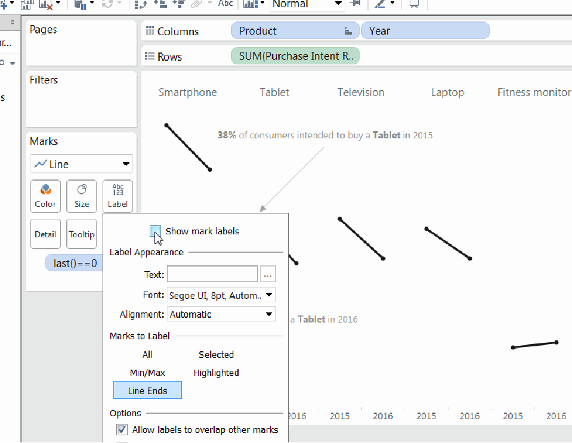

# **Introduction to Tableau**

Tableau is a leading data visualization tool that enables users to create insightful and interactive visualizations, reports, and dashboards from a wide variety of data sources. It is widely used by professionals in industries such as business intelligence, marketing, finance, and more for its powerful analytical capabilities and user-friendly interface.

Here’s a breakdown of its key features:

1. **Data Connection**:
   - Tableau can connect to a wide range of data sources such as databases (SQL, MySQL, etc.), cloud services, spreadsheets (Excel), big data platforms, and more.
   - This ability to pull data from multiple sources helps in performing in-depth analysis and combining diverse datasets.

2. **Data Visualization**:
   - Tableau offers an intuitive drag-and-drop interface where users can easily create charts, graphs, maps, and other visualizations.
   - It provides a variety of options to represent data effectively, making it easier to understand and analyze complex datasets.

3. **Dashboard Creation**:
   - Users can combine multiple visualizations into interactive dashboards.
   - Dashboards allow for dynamic exploration, filtering of information, and a comprehensive view of key metrics, ensuring better decision-making and insights for stakeholders.
   - Customization options are available to cater to specific needs, ensuring a tailored experience.

4. **Analytics and Calculations**:
   - Tableau allows users to perform complex calculations, statistical analysis, and predictive modeling directly within the software.
   - It offers a range of built-in functions like sum, average, trend lines, forecasting, and advanced analytics tools to extract meaningful insights from data.

5. **Sharing and Collaboration**:
   - Tableau visualizations can be shared via Tableau Server or Tableau Online, enabling seamless collaboration and ensuring that the right insights are accessible to relevant stakeholders across the organization.
   - This fosters a collaborative environment where teams can work together and make data-driven decisions.

6. **Mobile Compatibility**:
   - Tableau's responsive visualizations can be viewed on various devices, including desktops, tablets, and smartphones.
   - This ensures that decision-makers and stakeholders can access insights on the go, no matter where they are.

7. **Community and Support**:
   - Tableau has a large, active user community offering a wealth of resources such as forums, user groups, and online tutorials.
   - The company provides comprehensive support including documentation, training programs, and consulting services, helping users maximize the software’s potential.

With its ease of use, extensive data connectivity, and rich visualizations, Tableau is a go-to solution for businesses aiming to unlock the power of their data and make informed decisions.

---

**Tableau Ka Parichay**

Tableau ek powerful data visualization tool hai jo users ko apne data se interactive aur insightful visualizations, reports, aur dashboards banane ka mauka deta hai. Yeh tool kai alag-alag data sources se data ko connect karke, usko visual form mein present karta hai jisse decision-making aur analysis ka kaam asaan ho jata hai.

Tableau ka istemal business intelligence, marketing, finance, aur kai aur industries mein hota hai kyunki yeh bahut hi user-friendly hai aur analytical capabilities bhi strong hai.

Yeh kuch important features hain jo Tableau ko itna popular banate hain:

1. **Data Connection**:
   - Tableau alag-alag tarah ke data sources se connect kar sakta hai, jaise ki databases (SQL, MySQL, etc.), cloud services, Excel spreadsheets, aur big data sources.
   - Iska matlab hai ki aap multiple data sources se data le kar, unhe ek saath analyze kar sakte hain.

2. **Data Visualization**:
   - Tableau ka interface drag-and-drop based hota hai, jisme users asaani se fields ko visualize kar sakte hain.
   - Yeh charts, graphs, maps, aur aur bhi visualization types offer karta hai, jo complex data ko samajhne mein madad karte hain.

3. **Dashboard Creation**:
   - Tableau mein users apne visualizations ko ek saath combine kar sakte hain aur interactive dashboards create kar sakte hain.
   - Dashboards mein dynamic filters hote hain jisse users apne data ko explore kar sakte hain, aur specific insights nikal sakte hain.

4. **Analytics aur Calculations**:
   - Tableau aapko complex calculations, statistical analysis, aur even predictive modeling bhi perform karne ki suvidha deta hai, bina kisi external tool ki zarurat ke.
   - Isme built-in functions hain jo aapko data se insights nikaalne mein madad karte hain, jaise trends, forecasting, averages, etc.

5. **Sharing aur Collaboration**:
   - Tableau mein aap apne visualizations aur dashboards ko Tableau Server ya Tableau Online par share kar sakte hain.
   - Isse collaboration easy ho jata hai aur stakeholders ko necessary insights milte hain, jo unhe data-driven decisions lene mein madad karte hain.

6. **Mobile Compatibility**:
   - Tableau ke visualizations responsive hote hain, jo mobile, tablets, aur desktops par achhe se dikhte hain.
   - Iska matlab hai ki aap apne dashboards ko kahin bhi, kisi bhi device par access kar sakte hain.

7. **Community aur Support**:
   - Tableau ek bade aur active user community ka hissa hai, jo forums, user groups, aur tutorials ke zariye resources provide karta hai.
   - Tableau ki official website pe documentation, training programs, aur consulting services bhi milti hain jo users ko software ka best use seekhne mein madad karte hain.

**Summary**: Tableau ka use karne se aap apne data ko ek visual form mein represent kar sakte hain jo aapko aur aapke team ko insights dene mein madad karega. Yeh tool na sirf analysis ko simple banaata hai, balki decision-making ko bhi fast aur efficient banata hai.


---
---
### **Why Use Tableau?**

Tableau is widely used for data visualization and analysis because it offers a range of benefits that make it a powerful tool for both beginners and experienced professionals. Here are some key reasons why Tableau is a popular choice:

### 1. **User-Friendly Interface**
   - Tableau has a simple and intuitive drag-and-drop interface. This means you don’t need to have programming or technical knowledge to use it.
   - Even beginners can easily learn and use Tableau without requiring advanced skills.

### 2. **Quick and Interactive Visualizations**
   - Tableau allows you to quickly create interactive visualizations. You can see changes in real-time as you adjust your data.
   - It offers a variety of charts, graphs, and maps to transform raw data into visual forms, making it easier to identify patterns and trends.

### 3. **Data Connectivity**
   - Tableau can connect to a wide range of data sources like databases (SQL, MySQL), cloud services (Google Analytics, AWS), spreadsheets (Excel), and big data sources (Hadoop).
   - You can combine data from multiple sources into one analysis, allowing for a more comprehensive view of your data.

### 4. **Advanced Analytics Capabilities**
   - Tableau not only helps with visualization but also provides powerful analytics features. You can perform complex calculations, trend analysis, forecasting, and predictive modeling directly within Tableau.
   - This helps you gain deeper insights into your data and make better data-driven decisions.

### 5. **Customization and Interactivity**
   - Tableau offers extensive customization options for dashboards and reports. You can add filters, dynamic charts, drill-down features, and interactive elements.
   - This flexibility allows you to tailor your visualizations to suit specific business needs.

### 6. **Collaboration and Sharing**
   - Tableau makes it easy to share your visualizations via Tableau Server or Tableau Online, allowing other team members or stakeholders to access and interact with the data.
   - This facilitates collaboration and ensures that insights are shared across the organization for better decision-making.

### 7. **Mobile Compatibility**
   - Tableau’s visualizations are responsive, meaning they can be accessed and viewed on mobile devices such as smartphones and tablets.
   - This ensures that stakeholders can access insights anytime, anywhere, enhancing decision-making on the go.

### 8. **Scalability**
   - Tableau is scalable, meaning it can be used by both small businesses and large enterprises. As your data grows, Tableau can handle large datasets without compromising on performance.
   - This scalability makes Tableau suitable for organizations of all sizes.

### 9. **Active Community and Support**
   - Tableau has a large and active community that shares resources, forums, user groups, and tutorials.
   - The company also provides comprehensive support, including documentation, training programs, and consulting services to help you learn and use Tableau effectively.

### 10. **Data Security**
   - Tableau offers various security features such as role-based access control, encryption, and authentication protocols to ensure your data is protected.
   - This is especially important for organizations that need to comply with data privacy and security regulations.


---

**Tableau Ka Upyog Kyun Karein?**

Tableau ek popular data visualization tool hai jo kai reasons ki wajah se logon aur organizations ke liye beneficial hai. Yahaan kuch important reasons diye gaye hain ki kyun aapko Tableau ka use karna chahiye:

### 1. **User-Friendly Interface**
   - Tableau ka interface bahut hi simple aur intuitive hota hai, jisme drag-and-drop functionality hoti hai. Matlab, users ko programming ya technical knowledge ki zarurat nahi hoti, bas apne data ko visualize karna hota hai.
   - Agar aap beginner hain ya aapko complex tools ka use nahi aata, toh bhi Tableau ko asaani se seekh sakte hain.

### 2. **Quick and Interactive Visualizations**
   - Tableau se aap apne data ko jaldi aur interactive visualization mein convert kar sakte hain. Yeh tool aapko real-time mein changes dekhne ki suvidha deta hai.
   - Aap apne data ko charts, graphs, maps, aur aur bhi visualizations mein transform kar sakte hain, jisse aapke data ke patterns aur trends clear ho jate hain.

### 3. **Data Connectivity**
   - Tableau kai alag-alag data sources se connect ho sakta hai, jaise ki databases (SQL, MySQL), cloud services (Google Analytics, AWS), spreadsheets (Excel), aur big data sources (Hadoop).
   - Aap multiple sources ka data ek saath combine kar sakte hain, jo comprehensive analysis karne mein madad karta hai.

### 4. **Advanced Analytics Capabilities**
   - Tableau sirf visualization nahi, balki advanced analytics aur calculations bhi provide karta hai. Aap apne data pe complex calculations, trend analysis, forecasting, and predictive modeling kar sakte hain.
   - Isse aap deeper insights aur future predictions nikal sakte hain, jo aapko better decisions lene mein madad karte hain.

### 5. **Customization and Interactivity**
   - Tableau mein aap apne dashboards aur reports ko completely customize kar sakte hain. Aap filters, dynamic charts, drill-down options, aur interactive elements add kar sakte hain.
   - Yeh customization options users ko apne specific needs ke hisaab se visualizations banane ki freedom dete hain.

### 6. **Collaboration and Sharing**
   - Tableau aapko apne visualizations ko easily share karne ki suvidha deta hai, chaahe aap Tableau Server ya Tableau Online ka use karein.
   - Yeh collaboration ko enhance karta hai, jisme multiple stakeholders ek hi time par apne insights dekh sakte hain aur decision-making process ko improve kar sakte hain.

### 7. **Mobile Compatibility**
   - Tableau ke dashboards mobile-responsive hote hain, jo mobile devices par bhi achhe se dikhte hain. Matlab, aap apne visualizations ko kahin bhi, kisi bhi device par access kar sakte hain.
   - Yeh flexibility ensure karti hai ki aapke stakeholders ko insights mobile aur on-the-go bhi mil sake.

### 8. **Scalability**
   - Tableau ka use small businesses se lekar large enterprises tak kiya jaa sakta hai. Yeh scalable hai aur aapke data ke size ke according adapt kar sakta hai.
   - Jaise-jaise aapka data badhta hai, Tableau uske saath scale kar sakta hai, bina kisi performance issue ke.

### 9. **Active Community and Support**
   - Tableau ka ek large aur active community hai, jo forums, user groups, aur tutorials ke zariye help provide karta hai.
   - Tableau ki official website par aapko documentation, training programs, aur consulting services milti hain, jisse aap tool ko achhe se seekh sakte hain.

### 10. **Data Security**
   - Tableau aapke data ko securely store karne ke liye various security features provide karta hai, jaise role-based access control, encryption, aur authentication protocols.
   - Yeh especially large organizations ke liye important hai, jahan data privacy aur security crucial hoti hai.

---
---

**Key Features of Tableau**

Tableau is a robust data visualization tool with a wide range of features that make it powerful for data analysis and reporting. Here are some of the most important features of Tableau:

### 1. **Drag-and-Drop Interface**
   - **User-friendly Interface**: Tableau allows users to create visualizations easily by dragging and dropping fields onto the workspace. This eliminates the need for complex coding or technical expertise.
   - **Easy to Learn**: Even beginners can get started quickly with Tableau’s intuitive interface.

### 2. **Data Connectivity**
   - **Wide Range of Data Sources**: Tableau can connect to various data sources, including SQL databases, Excel spreadsheets, cloud-based sources (e.g., Google Analytics, Amazon Redshift), and big data platforms (e.g., Hadoop).
   - **Live and Extract Connections**: Tableau allows both live connections to data sources and the ability to extract data for offline use, giving flexibility depending on your needs.

### 3. **Data Blending**
   - **Combining Multiple Data Sources**: Tableau allows you to combine data from different sources in a single visualization, enabling a more comprehensive analysis of your data.
   - **Easy Data Integration**: Data from multiple systems (e.g., a CRM and an Excel spreadsheet) can be blended together seamlessly for better insights.

### 4. **Advanced Analytics**
   - **Built-in Calculations**: Tableau provides built-in functions for calculations, including basic math, statistical calculations (e.g., averages, standard deviation), and more complex ones (e.g., regression analysis, trend lines).
   - **Forecasting and Predictive Modeling**: Users can apply forecasting models and predictive analytics directly to their data to project future trends.

### 5. **Real-Time Data Analytics**
   - **Live Data Updates**: Tableau can connect to real-time data streams and update visualizations as new data arrives. This is helpful for real-time decision-making.
   - **Instant Feedback**: Users can interact with data in real time, adjusting filters and parameters to see immediate changes in their visualizations.

### 6. **Wide Range of Visualizations**
   - **Variety of Chart Types**: Tableau supports a wide variety of charts and visualizations, including bar charts, line charts, pie charts, heat maps, bubble charts, histograms, and geographical maps.
   - **Customizable Dashboards**: You can combine multiple visualizations into a single interactive dashboard that users can filter and drill down into for deeper insights.

### 7. **Interactive Dashboards**
   - **Filters and Drill-Downs**: Dashboards in Tableau are interactive, allowing users to apply filters, drill down into data, and explore insights dynamically.
   - **Actionable Insights**: Users can click on elements in the dashboard to drill into more specific data, offering a more interactive exploration of the data.

### 8. **Collaboration and Sharing**
   - **Publish and Share**: Tableau allows users to publish their visualizations and dashboards on Tableau Server or Tableau Online, making it easy to share them with others in the organization.
   - **Collaboration**: Team members can interact with the dashboards, add comments, and share insights, improving collaboration across departments.

### 9. **Mobile Support**
   - **Responsive Dashboards**: Tableau dashboards are mobile-optimized, meaning they adjust to different screen sizes and provide an optimal viewing experience on smartphones and tablets.
   - **Mobile App**: Tableau offers a mobile app that allows users to view and interact with visualizations on the go, ensuring that decision-makers have access to insights anytime, anywhere.

### 10. **Data Security**
   - **Role-Based Permissions**: Tableau provides role-based security, allowing administrators to set permissions for different users, ensuring that only authorized individuals can access or modify data.
   - **Data Encryption**: Tableau offers data encryption both at rest and in transit to ensure sensitive information is kept secure.

### 11. **Data Preparation**
   - **Data Cleaning and Transformation**: Tableau Prep, a companion tool, allows users to clean, combine, and transform data before importing it into Tableau for analysis.
   - **Data Shaping**: You can easily reshape data, remove duplicates, filter rows, and aggregate data before visualizing it.

### 12. **Geospatial Analysis**
   - **Maps and Geospatial Visualizations**: Tableau provides powerful mapping features to visualize data on geographical maps. You can plot locations, regions, and use built-in geocoding features to create location-based visualizations.
   - **Custom Geocoding**: You can also upload custom geographic data to create specialized maps and geospatial visualizations.

### 13. **Extensibility and Integration**
   - **APIs and SDKs**: Tableau provides APIs for extending functionality, allowing you to embed visualizations into websites, apps, and other platforms.
   - **Third-Party Integration**: It integrates with other software tools and platforms like R, Python, and more to enhance its capabilities.

### 14. **Automation and Scheduling**
   - **Scheduled Refreshes**: You can set up automated data refreshes so that your dashboards and reports stay up-to-date without manual intervention.
   - **Alerts**: Tableau allows users to set up data-driven alerts that notify them when certain thresholds are reached, helping them stay on top of key metrics.

---

**Tableau Features (Hinglish mein)**

Tableau ek powerful data visualization tool hai jo users ko interactive reports, dashboards, aur visualizations banane mein help karta hai. Yahan kuch key features diye gaye hain jo Tableau ko itna popular banate hain:

### 1. **Drag-and-Drop Interface**
   - **User-friendly Interface**: Tableau ka interface bahut hi simple aur intuitive hota hai. Aapko bas fields ko drag aur drop karna hota hai, bina kisi coding ke.
   - **Easy to Learn**: Agar aap beginner hain toh bhi aap easily Tableau seekh sakte hain aur use kar sakte hain.

### 2. **Data Connectivity**
   - **Wide Range of Data Sources**: Tableau multiple data sources se connect kar sakta hai, jaise SQL databases, Excel spreadsheets, cloud services (Google Analytics, Amazon Redshift), aur big data sources (Hadoop).
   - **Live and Extract Connections**: Tableau live data sources se connect kar sakta hai ya data extract kar sakta hai jo aap offline bhi use kar sakte hain.

### 3. **Data Blending**
   - **Multiple Data Sources ko Combine Karna**: Tableau aapko alag-alag data sources ko combine karne ki suvidha deta hai, jisse aap ek hi visualization mein zyada data dekh sakte hain.
   - **Easy Integration**: Alag-alag systems se data (jaise CRM aur Excel) ko easily blend kiya ja sakta hai.

### 4. **Advanced Analytics**
   - **Built-in Calculations**: Tableau mein aapko calculations karne ke liye built-in functions milte hain, jaise basic math, statistical calculations (mean, median, etc.), aur complex analysis (regression, trend lines).
   - **Forecasting and Predictive Modeling**: Aap apne data pe forecasting models apply kar sakte hain aur future trends predict kar sakte hain.

### 5. **Real-Time Data Analytics**
   - **Live Data Updates**: Tableau real-time data streams se connect hota hai aur aapke visualizations ko automatically update kar deta hai jab naya data aata hai.
   - **Instant Feedback**: Aap apne data ko real time mein explore kar sakte hain, filters aur parameters adjust karke turant results dekh sakte hain.

### 6. **Wide Range of Visualizations**
   - **Chart Types**: Tableau mein aapko bahut saare visualizations milte hain, jaise bar charts, line graphs, pie charts, maps, heat maps, bubble charts, etc.
   - **Customizable Dashboards**: Aap multiple visualizations ko combine karke ek interactive dashboard bana sakte hain, jisse users easily data ko filter aur analyze kar sakte hain.

### 7. **Interactive Dashboards**
   - **Filters and Drill-Downs**: Tableau ke dashboards interactive hote hain, jisme aap filters apply kar sakte hain aur data ko drill down karke aur detail mein dekh sakte hain.
   - **Actionable Insights**: Users dashboard pe kisi bhi element par click karke aur specific data dekhkar detailed insights nikal sakte hain.

### 8. **Collaboration and Sharing**
   - **Publish and Share**: Tableau ka use karke aap apne visualizations ko Tableau Server ya Tableau Online pe publish kar sakte hain aur baaki team members ke saath share kar sakte hain.
   - **Collaboration**: Team members dashboards pe comments add kar sakte hain aur shared insights ke through collaboration kar sakte hain.

### 9. **Mobile Support**
   - **Responsive Dashboards**: Tableau ke dashboards mobile devices pe bhi optimize hote hain, matlab aap apne smartphone ya tablet pe bhi easily data dekh sakte hain.
   - **Mobile App**: Tableau ka apna mobile app hai jisme aap apne visualizations dekh aur interact kar sakte hain jab bhi aapko zarurat ho.

### 10. **Data Security**
   - **Role-Based Permissions**: Tableau mein aap role-based security set kar sakte hain, jisme users ko specific access dena hota hai, isse sensitive data safe rehta hai.
   - **Data Encryption**: Tableau mein data ko encryption ke through secure kiya jata hai, jo aapke data ko unauthorized access se bachata hai.

### 11. **Data Preparation**
   - **Data Cleaning and Transformation**: Tableau Prep ek companion tool hai jisse aap data ko clean aur transform kar sakte hain, jaise duplicate data ko remove karna aur data ko filter karna.
   - **Shaping Data**: Aap easily data ko reshape kar sakte hain aur data ko visualizing se pehle prepare kar sakte hain.

### 12. **Geospatial Analysis**
   - **Maps and Geospatial Visualizations**: Tableau mein aap geospatial data visualize kar sakte hain, jisme aap locations ko maps pe plot kar sakte hain.
   - **Custom Geocoding**: Aap custom geographic data bhi upload kar sakte hain aur apne maps ko customize kar sakte hain.

### 13. **Extensibility and Integration**
   - **APIs and SDKs**: Tableau APIs provide karta hai jisse aap apne visualizations ko websites, apps, ya platforms mein embed kar sakte hain.
   - **Third-Party Integration**: Tableau ko aap R, Python jaise tools ke saath integrate kar sakte hain taaki aapka analysis aur advanced ho sake.

### 14. **Automation and Scheduling**
   - **Scheduled Refreshes**: Aap scheduled refreshes set kar sakte hain jisse aapke dashboards aur reports automatically updated rahte hain bina manual intervention ke.
   - **Alerts**: Tableau alerts set karne ki suvidha deta hai jo aapko notify karte hain jab specific thresholds reach hote hain.

---
---

## Values in Tableau
There are two types of values in the tableau:
1. **Dimensions**
2. **Measures**

### **Detailed Explanation of Dimensions and Measures in Tableau:**

In Tableau, there are two main types of values: **Dimensions** and **Measures**. Both serve different purposes in organizing and analyzing data, and understanding the difference between them is crucial for creating meaningful visualizations and analyses.

---

### 1. **Dimensions:**

#### **Definition:**
Dimensions are values that are **discrete** (categorical or qualitative data). They represent **attributes** or **categories** and **do not change over time**. Essentially, dimensions are used to **categorize, segment, or group data** into different categories.

#### **Nature:**
- **Discrete**: Dimensions consist of distinct categories, and these categories don't change over time. For example, cities or countries are fixed values that do not vary with time.
- Dimensions are used to provide a **descriptive** structure to the data.
- **Labels**: They describe characteristics of data.

#### **Examples:**
- **City Name**: Categories representing different cities.
- **Product Name**: Categories for each product in a store.
- **Country Name**: Geographical categorization of data.
- **Customer ID**, **Employee ID**, **Region**: Other examples of identifiers and categories.

#### **Usage:**
- **Categorization**: Dimensions help categorize or group data. For instance, you can group sales data by product or by region.
- **Filters and Grouping**: Dimensions are used to filter or group data. For example, you might want to see data for a specific country or region.

#### **How it Works in Tableau:**
- Dimensions are dragged to the **rows** or **columns** shelf in Tableau.
- Dimensions are typically **categorical** variables and are represented in your visualizations as groups or categories (e.g., bar charts, pie charts).

**Example**: If you want to display sales data for different cities, you would use **City** as a dimension and **Sales** as a measure.

---

### 2. **Measures:**

#### **Definition:**
Measures are values that are **continuous** (quantitative data) and can **change over time**. These are **numerical values** that can be aggregated or calculated and are essential for performing calculations and analysis.

#### **Nature:**
- **Continuous**: Measures consist of numerical values that can be measured on a scale (e.g., sales, profit, temperature). These values can be aggregated (summed, averaged, etc.) or analyzed.
- Measures provide the **quantitative data** necessary for numerical analysis.

#### **Examples:**
- **Sales**: Represents the total revenue generated from sales.
- **Profit**: The monetary gain or loss.
- **Discount**: A numerical value, typically a percentage or monetary amount.
- **Quantity Sold**: The number of units sold.
- **Population**: A numerical count of people in a region.

#### **Usage:**
- **Aggregation**: Measures are aggregated (summed, averaged, etc.) when used in visualizations. For example, you can see the total sales for each city or the average profit for a specific period.
- **Calculations**: Measures are used for creating calculations, comparisons, and statistical analysis.

#### **How it Works in Tableau:**
- Measures are typically placed on the **columns** or **rows** shelf in Tableau.
- Measures represent **numerical variables** and are shown in your visualizations as graphs, charts, or summary values.

**Example**: If you want to see how sales have been performing over the last few months, you would use **Sales** as a measure and **Month** as a dimension.

---

### **Key Differences Between Dimensions and Measures:**

| **Feature**                  | **Dimension**                                | **Measure**                              |
|------------------------------|----------------------------------------------|------------------------------------------|
| **Nature**                   | Discrete (Categorical)                       | Continuous (Quantitative)                |
| **Purpose**                   | Categories and grouping data                 | Numerical analysis and aggregation       |
| **Data Type**                 | Text, dates, or non-numeric data             | Numeric or quantitative data             |
| **Aggregation**               | Cannot be aggregated (sum, average, etc.)    | Can be aggregated (sum, avg, min, max)   |
| **Examples**                  | Product Name, City, Region, Customer ID      | Sales, Profit, Quantity Sold, Revenue    |
| **Use**                       | Grouping, Filtering, Segmenting              | Calculations, Summarizing, Comparing     |
| **Visual Representation**    | Axis (X, Y), Legends, Filters                | Axis (Y), Data Labels, Summaries        |
| **Type of Data**              | Categorical (e.g., product, city, country)   | Quantitative (e.g., sales, profit, quantity) |

---

### **Real-Life Example:**

**Scenario**: Let’s say you are analyzing a company's sales data. You want to see how sales perform across different cities and compare the total sales and profit in each city.

- **Dimensions**: You would use **City** as a dimension. This categorizes your data by city.
- **Measures**: You would use **Sales** and **Profit** as measures. These values are continuous and can be aggregated.

You would drag **City** to the rows shelf and **Sales** and **Profit** to the columns shelf in Tableau. Tableau would automatically aggregate the sales and profit for each city, allowing you to compare sales and profit values for each city in a bar chart or any other visualization.

---

### **Conclusion:**

- **Dimensions** help you **categorize** and **group** your data into discrete categories. They are used to break data into smaller chunks.
- **Measures** are the **numerical** values that you analyze, calculate, and aggregate. These values allow you to perform quantitative analysis on your data.

In Tableau, the key to effective visualization is understanding how to properly use dimensions and measures. Dimensions give structure to your data, while measures provide the numerical data that helps you derive insights.

---

### **Tableau mein Dimensions aur Measures ka Detailed Explanation:**

Tableau mein **Dimensions** aur **Measures** ka basic role data ko alag tareeke se organize aur analyze karna hai. In dono ka apna significance hai, aur inhe samajhna zaroori hai jab aap Tableau mein data visualization aur analysis karte hain. Chaliye in dono ko thoda aur detail mein samajhte hain.


---

### 1. **Dimensions:**

#### **Definition:**
Dimensions wo values hoti hain jo **discrete** (alag-alag categories ya attributes) hoti hain aur yeh time ke saath **change nahi hoti**. Matlab, dimensions generally categorical data hote hain jo aapke data ko categories ya groups mein divide karte hain.

#### **Nature:**
- **Discrete**: Yeh values ek specific category mein fit hoti hain aur time ke saath change nahi karti.
- Dimensions ko hum **descriptive data** ke roop mein use karte hain. Yeh data ko labels ya categories banata hai.

#### **Examples:**
- **City Name**: Data ko cities ke basis pe categorize karte hain.
- **Product Name**: Data ko products ke basis pe analyze karte hain.
- **Country Name**: Data ko countries ke hisaab se organize karte hain.
- **Employee ID**, **Customer ID**, **Order ID**: Yeh bhi dimensions hain jo har record ko uniquely identify karte hain.

#### **Usage:**
- **Categorization**: Dimensions ka use categories banane ke liye kiya jata hai. Jaise aap sales data ko city ke basis pe categorize karte hain ya product ke hisaab se analyze karte hain.
- **Filters and Grouping**: Dimensions ko filter karne ya data ko group karne mein use kiya jata hai. Jaise aap chahte hain ki sirf ek specific region ka data dikhe, toh aap region ko dimension ke roop mein use karenge.

#### **Tableau mein kaise use hota hai:**
- Dimensions ko **columns** ya **rows** shelf par drag kiya jata hai.
- Yeh **categorical variables** ko represent karta hai, jo aapko rows, columns, ya legends mein dikhayi dete hain.

**Example in Tableau**: Agar aapko product sales ko cities ke hisaab se show karna hai, toh aap **City** ko dimension ke roop mein use karenge aur sales ko measure ke roop mein.

---

### 2. **Measures:**

#### **Definition:**
Measures wo values hoti hain jo **continuous** (numerical aur quantitative) hoti hain aur **time ke saath change ho sakti hain**. Yeh values aapko data ka numerical analysis aur calculations karne mein madad karti hain.

#### **Nature:**
- **Continuous**: Yeh values ek specific numerical range mein hoti hain aur unka analysis kiya ja sakta hai.
- Measures ko hum **quantitative data** ke roop mein use karte hain. Yeh values directly count ya calculate ki ja sakti hain.

#### **Examples:**
- **Sales**: Sales ek numerical measure hai, jo kisi specific time period mein kitna revenue generate kiya gaya hai.
- **Profit**: Yeh ek measure hai jo har record ke liye monetary gain ya loss ko represent karta hai.
- **Discount**: Yeh bhi ek continuous measure hai, jo percentage ya monetary value ke form mein hota hai.
- **Quantity Sold**: Yeh measure batata hai ki ek product ne kitna quantity sell kiya.
- **Population**: Yeh measure kisi region ki population ko numerically represent karta hai.

#### **Usage:**
- **Aggregation**: Measures ko aggregate kiya jata hai, jaise sum, average, min, max, etc. Tableau automatically measures ko aggregate karta hai jab aap unhe visualization mein add karte hain.
- **Calculation**: Measures ka use aap calculations, comparisons, aur analysis mein karte hain. Jaise sales ko time ke saath compare karna, ya discount ke basis pe profit calculate karna.

#### **Tableau mein kaise use hota hai:**
- Measures ko **columns** ya **rows** shelf par drag kiya jata hai.
- Yeh **numerical variables** ko represent karta hai jo graphs, charts, aur statistical analysis mein dikhayi dete hain.

**Example in Tableau**: Agar aapko product sales ke data ko time ke hisaab se dekhna hai, toh aap **Sales** ko measure ke roop mein use karenge aur **Year** ko dimension ke roop mein.

---

### **Dimensions vs Measures: Key Differences**

| **Feature**                  | **Dimension**                                | **Measure**                              |
|------------------------------|----------------------------------------------|------------------------------------------|
| **Nature**                   | Discrete (Categorical)                       | Continuous (Quantitative)                |
| **Purpose**                   | Categories and groupings of data             | Numerical analysis and aggregation       |
| **Data Type**                 | Text, dates, or other non-numeric data       | Numeric or quantitative data             |
| **Aggregation**               | Cannot be aggregated (sum, average, etc.)    | Can be aggregated (sum, avg, min, max)   |
| **Examples**                  | Product Name, Region, Customer ID            | Sales, Profit, Quantity Sold, Revenue    |
| **Use**                       | Grouping, Filtering, Segmenting              | Calculations, Summarizing, Comparing     |
| **Visual Representation**    | Axis (X, Y), Legends, Filters                | Axis (Y), Data Labels, Summaries        |
| **Type of Data**              | Categorical (e.g., product, city, country)   | Quantitative (e.g., sales, profit, quantity) |

### **Real-Life Example:**

**Scenario**: Aap ek company ke sales data ka analysis kar rahe hain. Aapko sales data ko cities ke hisaab se dekhna hai aur saath hi har city mein total sales aur average profit dikhana hai.

- **Dimensions**: Aap **City** ko dimension ke roop mein use karenge. Yeh city ko categorically represent karega.
- **Measures**: Aap **Sales** aur **Profit** ko measures ke roop mein use karenge. Yeh values continuous hain aur unka aggregation (sum, avg) dikhayi jayega.

Aap **City** ko drag karke rows mein daalenge aur **Sales** ko drag karke columns mein daalenge. Isse Tableau apne aap cities ke hisaab se sales ko aggregate karega aur aapko har city ke liye total sales dikhayi dega.

---
---

### **Advantages of Tableau:**

1. **User-Friendly Interface:**
   - Tableau provides an intuitive and easy-to-use drag-and-drop interface. Even users with no programming experience can quickly learn and create sophisticated visualizations.
   
2. **Interactive Dashboards:**
   - It allows the creation of highly interactive dashboards where users can explore data dynamically by filtering, drilling down, and highlighting specific data points.

3. **Powerful Data Visualization:**
   - Tableau supports a wide variety of visualization options like bar charts, line charts, scatter plots, maps, and heat maps. This helps in presenting complex data in an understandable and visually appealing way.

4. **Fast Data Processing:**
   - Tableau's in-memory data engine processes data very quickly, even with large datasets, enabling users to work with real-time data and make immediate decisions.

5. **Supports Multiple Data Sources:**
   - Tableau can connect to a wide range of data sources like SQL databases, spreadsheets, cloud-based data (Google Analytics, AWS, etc.), big data platforms (Hadoop), and more. This makes it highly flexible for users working with diverse data.

6. **Real-Time Collaboration and Sharing:**
   - Tableau allows users to easily share visualizations with others via Tableau Server or Tableau Online. This promotes collaboration and ensures stakeholders have access to up-to-date insights.

7. **Mobile Compatibility:**
   - Tableau visualizations are responsive and can be accessed from mobile devices like smartphones and tablets. This ensures decision-makers can access data on the go.

8. **Comprehensive Analytics:**
   - Tableau not only allows visualization but also supports advanced analytics, including trend lines, forecasts, statistical models, and data clustering, enhancing data analysis.

9. **Extensive Community and Support:**
   - Tableau has a large, active user community that offers tutorials, forums, and user groups. Tableau also provides comprehensive documentation and customer support.

---

### **Disadvantages of Tableau:**

1. **Expensive Licensing:**
   - Tableau can be quite costly, especially for organizations that need multiple licenses. The pricing model (e.g., Tableau Desktop, Tableau Server, Tableau Online) may not be suitable for smaller businesses or individual users.

2. **Steep Learning Curve (for Advanced Features):**
   - While the basic functionalities are easy to learn, advanced features such as calculated fields, complex data blending, and dashboard interactivity may have a steeper learning curve for beginners.

3. **Limited Customization (for Some Visualizations):**
   - Although Tableau offers a wide range of visualizations, some advanced or custom visualizations may not be possible without extensive customization or use of external tools.

4. **Data Preparation:**
   - Tableau's data preparation features are limited compared to specialized data preparation tools (e.g., Alteryx or Excel). For complex data transformations or cleaning, you might need to use other software before importing data into Tableau.

5. **Limited Support for Large Datasets (Without Optimization):**
   - Although Tableau handles large datasets relatively well, performance issues can arise when working with massive datasets (billions of rows) without proper data optimization strategies such as data extracts or aggregate tables.

6. **Dependence on Data Sources:**
   - Tableau relies on the quality and structure of data from external sources. If the data source is inconsistent or unclean, it can lead to inaccurate visualizations or analysis.

7. **Limited Data Manipulation Capabilities:**
   - While Tableau offers some analytical functions, it lacks advanced scripting capabilities (e.g., Python or R integration) for complex statistical modeling and machine learning tasks, which can be an issue for users requiring deep analysis.

8. **Not Ideal for Detailed Reports:**
   - Tableau excels in creating visualizations and dashboards but may not be the best choice for creating detailed reports or written analyses, which might require more flexibility in layout and formatting (better suited for tools like Excel or Power BI).

9. **Security and Governance Concerns:**
   - For organizations using Tableau Server or Tableau Online, ensuring proper security and governance can be challenging, particularly when dealing with sensitive data or ensuring that users have the appropriate levels of access.

---

### **Tableau ke Advantages:**

1. **User-Friendly Interface:**
   - Tableau ka interface bohot simple aur intuitive hai. Drag-and-drop feature se even beginners bhi easily complex visualizations bana sakte hain bina kisi programming knowledge ke.

2. **Interactive Dashboards:**
   - Tableau mein aap interactive dashboards create kar sakte hain jisme users data ko explore kar sakte hain, filters apply kar sakte hain, aur specific data points par focus kar sakte hain.

3. **Powerful Data Visualization:**
   - Tableau mein kai tarah ke visualization options hote hain jaise bar charts, line charts, maps, heat maps, etc. Jo complex data ko easily samajhne aur present karne mein madad karte hain.

4. **Fast Data Processing:**
   - Tableau ka in-memory data engine data ko bohot fast process karta hai, chahe aapke paas large dataset ho. Real-time data ke saath kaam karke aap jaldi decisions le sakte hain.

5. **Multiple Data Sources Support:**
   - Tableau kai tarah ke data sources ke saath connect ho sakta hai jaise SQL databases, spreadsheets, cloud-based data, aur big data platforms. Yeh flexibility provide karta hai different data sources ko handle karne mein.

6. **Real-Time Collaboration and Sharing:**
   - Tableau ke through aap apne visualizations Tableau Server ya Tableau Online par easily share kar sakte hain, jisse collaboration promote hota hai aur stakeholders ko updated insights milte hain.

7. **Mobile Compatibility:**
   - Tableau ke visualizations mobile-friendly hote hain, jisse users apne smartphone ya tablet pe bhi data dekh sakte hain, aur decision-making ke liye on-the-go access milta hai.

8. **Comprehensive Analytics:**
   - Tableau sirf visualization tak limited nahi hai, yeh advanced analytics bhi support karta hai jaise trend lines, forecasts, statistical models, aur data clustering, jo data ko zyada insightful banata hai.

9. **Large Community and Support:**
   - Tableau ki ek bohot badi aur active user community hai jahan aap tutorials, forums, aur user groups ke through help le sakte hain. Saath hi, Tableau customer support aur documentation bhi provide karta hai.

---

### **Tableau ke Disadvantages:**

1. **Expensive Licensing:**
   - Tableau ka pricing model kaafi expensive ho sakta hai, especially jab aapko multiple licenses ki zarurat ho. Chhoti companies aur individual users ke liye cost-effective nahi hai.

2. **Steep Learning Curve (Advanced Features ke liye):**
   - Basic features seekhna asaan hai, lekin advanced functionalities jaise calculated fields, data blending, aur dashboard interactivity seekhne mein thoda time lag sakta hai.

3. **Limited Customization (Some Visualizations ke liye):**
   - Tableau mein kuch advanced ya custom visualizations create karna thoda mushkil ho sakta hai bina extensive customization ke ya external tools ka use karke.

4. **Data Preparation:**
   - Tableau mein data preparation ke features thode limited hain, especially jab aapko complex data transformations ya cleaning karni ho. Iske liye aapko aur tools (jaise Alteryx ya Excel) ka use karna pad sakta hai.

5. **Limited Support for Large Datasets (Without Optimization):**
   - Tableau large datasets handle kar sakta hai, lekin agar data bohot zyada hai (billions of rows), toh performance issues aa sakte hain agar aapne proper data optimization techniques use nahi ki hain.

6. **Dependence on Data Sources:**
   - Tableau ka performance data ke quality par depend karta hai. Agar aapka data inconsistent ya unclean hai, toh visualizations galat ho sakte hain.

7. **Limited Data Manipulation Capabilities:**
   - Tableau mein kuch analytical functions hain, lekin deep analysis jaise machine learning aur statistical modeling ke liye aapko Python ya R jaise scripting languages ki zarurat pad sakti hai, jo Tableau mein directly supported nahi hain.

8. **Not Ideal for Detailed Reports:**
   - Tableau zyada visualizations ke liye acha hai, lekin agar aapko detailed reports banani ho jo written analysis ke saath ho, toh shayad aapko Excel ya Power BI jese tools zyada suitable lagenge.

9. **Security and Governance Issues:**
   - Agar aap Tableau Server ya Tableau Online use kar rahe hain, toh data security aur governance manage karna challenging ho sakta hai, particularly jab sensitive data handle kar rahe ho ya users ko proper access levels assign karne hon.

---
---

### **Start Page in Tableau Desktop:**

The **Start Page** in Tableau Desktop serves as the central hub where you can quickly access various functionalities to get started with your work. It is the first thing you see when you open Tableau and helps in organizing your workflow efficiently.

The **Start Page** consists of three main panes:

1. **Connect:**
   - This pane is where you connect to your data. Tableau supports a variety of data sources, such as files (Excel, CSV), databases (SQL, MySQL, PostgreSQL), cloud data (Google Sheets, AWS), and other connectors.
   - You can select from a list of available data sources or search for a specific one to begin your analysis.
   
2. **Open:**
   - This pane shows a list of your **recently used workbooks**. It makes it easy to pick up where you left off, allowing you to quickly open the workbooks that you've worked on previously.
   - If you have multiple projects or dashboards, this feature helps in saving time by eliminating the need to browse through folders each time.
   
3. **Discover:**
   - The **Discover** pane allows you to explore **content produced by the Tableau community**. It provides access to a variety of sample workbooks, dashboards, and visualizations shared by other Tableau users, which can be useful for inspiration or learning.
   - It’s a great place to find new ideas and learn from others’ projects, especially if you’re new to Tableau or looking for new ways to visualize your data.

### **Key Points to Remember:**
- The **Start Page** provides quick access to your data sources, recent projects, and community content.
- It streamlines your workflow by offering direct paths to connect to data, open recent workbooks, and discover content.
- It is designed to enhance productivity and ease of navigation in Tableau Desktop.

---
---

### **Connect Pane in Tableau:**

The **Connect** pane in Tableau is where you can establish a connection to your data. Whether you're working with files, databases, or cloud services, the **Connect** pane makes it easy to import your data into Tableau for analysis. It also allows you to open saved data sources for quick access to previously used data.

#### **Key Features of the Connect Pane:**

1. **Connect to Data:**
   - **Under To a File:**
     - This option allows you to connect to **data stored in files** on your computer or network. Some of the supported file types include:
       - **Microsoft Excel**: (.xls, .xlsx)
       - **Text Files**: (.txt, .csv)
       - **Access Files**: (.accdb)
       - **Tableau Extract Files**: (.hyper, .tde)
       - **Statistical Files**: Files from software like SAS, SPSS, and R.
     - You can click on any of these file types to browse for your local data and import it into Tableau.
   
   - **Under To a Server:**
     - This option is for connecting to **databases and data servers**. You can connect to a variety of **relational databases and other servers** such as:
       - **Microsoft SQL Server**
       - **Oracle**
       - **Google BigQuery**
       - **PostgreSQL**
       - And many other servers, depending on the connectors available in your version of Tableau.
     - When you connect to a server, the server names you see will depend on the servers you've previously connected to, and they may also change over time based on your connection history.

2. **Open Saved Data Sources:**
   - If you’ve previously saved data sources in your **My Tableau Repository** directory, you can quickly open them from the **Connect** pane.
   - These saved data sources can include your own data sources as well as any default sample data sources that Tableau provides.
   - **Sample Data Sources**: Tableau provides sample data sources like **"Sample – Superstore"**, which is commonly used in tutorials and examples. It’s a great resource for learning Tableau’s functionality and practicing different visualization techniques.

#### **Steps to Connect to Data:**

1. **Click** on "To a File" or "To a Server" depending on your data type.
2. **Browse** for the file or enter the server connection details.
3. **Select** the specific data file or database you want to work with.
4. **Click Open** to load the data into Tableau for analysis.

#### **Key Takeaways:**
- The **Connect** pane allows you to quickly import data from local files and external servers.
- You can easily reconnect to previously used data sources for faster workflow.
- Tableau also offers sample data, such as the **Superstore dataset**, which is useful for learning and practice.

---
---
### **Open Pane in Tableau:**

The **Open** pane in Tableau helps you quickly access and manage your recently opened workbooks. It also allows you to pin workbooks for quick access and explore sample workbooks that Tableau provides.

#### **Key Features of the Open Pane:**

1. **Open Recently Opened Workbooks:**
   - When you first open Tableau Desktop, this pane will be empty. But as you create and save new workbooks, the **most recently opened workbooks** will appear here.
   - You can **click** on the workbook thumbnail to quickly open a workbook.
   - If you don't see the workbook you're looking for, you can click on the **"Open a Workbook"** link to browse for other workbooks saved on your computer.

2. **Pin Workbooks:**
   - You can **pin** your frequently used workbooks to the **Start Page** for quick access. This is especially useful if you want certain workbooks to always be available, even if they haven’t been opened recently.
   - To pin a workbook, simply **click the pin icon** in the top-left corner of the workbook thumbnail.
   - **Pinned workbooks** will always appear on the Start Page, making them easily accessible.
   - If you no longer need a workbook pinned, you can hover over the workbook thumbnail and click the **"x"** that appears to remove it.
   - The workbook will still appear in the **"recently opened"** list the next time you open Tableau Desktop.

3. **Explore Sample Workbooks:**
   - Tableau provides a collection of **sample workbooks** that you can open and explore.
   - These sample workbooks demonstrate Tableau's functionality and provide examples of how to use different features, such as creating dashboards, visualizations, and applying filters.
   - You can open these workbooks for learning purposes, experimenting with the features, or getting inspiration for your own projects.

#### **Steps to Use the Open Pane:**

1. **Open a Recent Workbook**: Click on the workbook thumbnail in the Open pane to open it.
2. **Pin a Workbook**: Hover over the workbook thumbnail and click the **pin icon** to keep it on the Start Page for easy access.
3. **Explore Sample Workbooks**: Browse through the sample workbooks provided by Tableau to learn new techniques and understand how to use Tableau features.

#### **Key Takeaways:**
- The **Open** pane provides quick access to your recently opened workbooks.
- You can **pin** important workbooks to keep them accessible at all times.
- Tableau also provides **sample workbooks** for learning and inspiration, which are great for beginners to explore the features and functionalities of the software.

---
---
## **Connecting to Excel and Text Files in Tableau:**

When you're working with Tableau, it's common to connect to different types of data sources like **Excel files** and **Text files** (e.g., .csv, .txt). Here’s a step-by-step guide on how to connect to these data sources and load them into Tableau:

---

### **Connecting to Excel Files:**

1. **Open Tableau** and click on the **"Connect"** pane located on the left side of the Tableau window.
2. **Choose "To a File"** and then select **"Microsoft Excel"** from the options.
3. **Navigate** to the location where your **Excel file** is stored and select it.
4. If your Excel file contains multiple sheets, Tableau will display them for you. **Select the sheet(s)** you want to work with.
5. **Click "Open"** to load the data into Tableau.

---

### **Connecting to Text Files (CSV, TXT):**

1. Follow the same steps as above, but instead of choosing "Microsoft Excel," **select "Text File"** from the options.
2. **Navigate** to the location of your **text file** (like .csv or .txt) and select it.
3. Tableau will automatically **detect the file's structure** and show you a preview of the data.
4. If needed, **adjust the settings**:
   - Select the correct **field separator** (e.g., comma for .csv, tab for .txt).
   - Modify **data format** settings if required.
5. **Click "Open"** to load the data into Tableau.

---

### **Optional Settings:**

#### **Adding More Data to Your Data Source:**

- **Add More Data from the Current File:**
  - You can **combine additional tables** within the same file by **dragging tables** into the canvas and using **joins or unions**.
  - For more information, check out Tableau’s documentation on **Joins** or **Unions**.

- **Add Data from a Different Database:**
  - Click **Add** next to the **Connections** section in the left pane.
  - If the connector you need is not listed, you can **choose Data > New Data Source** to connect to another data source.

#### **Using Data Interpreter:**

- Tableau provides an option called **Data Interpreter** which helps clean and optimize your data for analysis.
  - If Tableau detects formatting issues (like sub-tables), it prompts you to use **Data Interpreter**.
  - This tool can remove **unique formatting** issues that might cause problems during analysis, helping to improve the quality of your data.

---

### **Text File Settings:**

When connecting to text files, you may have additional settings for fine-tuning:

1. **First Row as Column Names:**
   - On the canvas, click the **table drop-down arrow** and ensure that the first row contains column names (this is selected by default). Alternatively, Tableau can generate column names, and you can modify them later.

2. **Text File Properties:**
   - **Column Separator**: Select the **character** used to separate the columns. For example, commas for CSV files, tabs for text files.
   - **Text Qualifier**: Select the character used to enclose text values (e.g., quotes around text in CSV files).
   - **Character Set**: Select the **encoding** of the text file (e.g., ANSI, UTF-8).
   - **Locale Settings**: Define the **locale** for parsing the file (which determines the use of decimal and thousands separators).

---

### **Key Takeaways:**

- **Excel files** are easy to connect with by selecting "Microsoft Excel" and choosing the required sheet.
- **Text files** (CSV, TXT) can also be connected, with options for setting field separators, text qualifiers, and encoding.
- You can **add additional data** from the same file or different databases using **joins** or **unions**.
- The **Data Interpreter** feature helps clean and format your data for more efficient analysis.
- For **text files**, you have several options to adjust settings like **column separator**, **text qualifiers**, and **file encoding**.

---
### **Excel aur Text Files ko Tableau mein Connect karna:**

Tableau mein data ko load karna bohot asaan hai, chahe aap **Excel files** ya **Text files** (CSV, TXT) use kar rahe ho. Yahan par step-by-step guide hai kaise aap ye files connect kar sakte ho Tableau mein:

---

### **Excel Files ko Connect Karna:**

1. **Tableau Open Karo** aur **"Connect"** pane pe click karo, jo left side mein hota hai.
2. **"To a File"** ke niche **"Microsoft Excel"** select karo.
3. Apne **Excel file** ko locate karo aur select karo.
4. Agar aapki Excel file mein multiple sheets hain, toh Tableau unko show karega. **Sheet(s)** select karo jo aap use karna chahte ho.
5. **"Open"** pe click karo, taaki data Tableau mein load ho jaaye.

---

### **Text Files (CSV, TXT) ko Connect Karna:**

1. Upar wali steps ko follow karo, lekin **"Microsoft Excel"** ke jagah **"Text File"** select karo.
2. Apne **text file** (CSV ya TXT) ko locate karo aur select karo.
3. Tableau automatically file ka structure samajh jaayega aur data ka preview show karega.
4. Agar zarurat ho, toh **settings** adjust karo:
   - **Field separator** select karo (jaise CSV ke liye comma, TXT ke liye tab).
   - **Data format** ko modify karo agar zarurat ho.
5. **"Open"** pe click karo, taaki data Tableau mein load ho jaaye.

---

### **Optional Settings:**

#### **Aur Data Add Karna:**

- **Same File se Aur Data Add Karna:**
  - Agar aapko **additional tables** add karni ho, toh aap **tables ko canvas pe drag kar sakte ho** aur **join ya union** ka use karke data ko combine kar sakte ho.
  - Tableau ki documentation mein **Joins** aur **Unions** ke baare mein padh sakte ho.

- **Alag Database se Data Add Karna:**
  - **Connections** ke section mein left pane mein **Add** pe click karo.
  - Agar connector aapko chahiye ho aur wo listed nahi hai, toh **Data > New Data Source** select karke naye data source ko connect kar sakte ho.

#### **Data Interpreter ka Use Karna:**

- Tableau mein ek option hai **Data Interpreter**, jo aapke data ko clean aur optimize karne mein madad karta hai.
  - Agar Tableau ko lagta hai ki data mein koi formatting issue hai (jaise sub-tables), toh wo aapko **Data Interpreter** use karne ke liye prompt karega.
  - Ye tool **formatting issues** ko remove karta hai jo analysis ke dauraan problems create kar sakte hain, isse aapka data analysis ke liye ready ho jaata hai.

---

### **Text File Settings:**

Text files ko connect karte waqt aapko kuch additional settings milti hain:

1. **First Row as Column Names:**
   - Canvas pe **table drop-down arrow** pe click karo aur ensure karo ki **first row** mein column names hon. Ye by default selected hota hai. Agar aap chahte ho toh Tableau column names generate kar sakta hai aur aap baad mein unhe change kar sakte ho.

2. **Text File Properties:**
   - **Column Separator**: Wo **character** select karo jo columns ko separate karta ho (jaise CSV mein comma, TXT mein tab).
   - **Text Qualifier**: Wo character select karo jo text values ko enclose karta ho (jaise CSV files mein quotes).
   - **Character Set**: Text file ka **encoding** select karo (jaise ANSI, UTF-8).
   - **Locale Settings**: File ko kaise parse karna hai, ye specify karo. Isse decimal aur thousands separators set ho jaate hain.

---

### **Key Takeaways:**

- **Excel files** ko connect karna simple hota hai. Bas **Microsoft Excel** select karo aur required sheet(s) choose karo.
- **Text files** (CSV, TXT) ko connect karne mein **field separators**, **text qualifiers**, aur **encoding** ko adjust karna padta hai.
- Aap **same file se aur data** add kar sakte ho, ya **different databases** se bhi data la sakte ho.
- **Data Interpreter** use karke aap data ko clean aur ready kar sakte ho analysis ke liye.
- **Text file settings** ko adjust kar ke aap apne data ko properly parse kar sakte ho (jaise column separator, text qualifier, aur encoding).

---
---

## **Connecting to Microsoft SQL Server in Tableau:**

1. **Click on the "Connect" pane** on the left side of the Tableau window.
2. **Select "To a Server"**, then choose **"Microsoft SQL Server"**.
3. **Enter the server name**, **username**, and **password** to connect to your SQL Server.
4. If needed, you can **select a database** or use a **custom SQL query** to extract specific data.
5. Click **"Sign In"** or **"Connect"** to establish the connection.
6. Tableau will display a list of **tables and views** available in the selected database.
7. **Select the tables/views** you want to work with or write a custom SQL query to get the specific data.
8. Click **"Update Now"** to load the data into Tableau.

Once connected to your data source, Tableau will open the data source tab where you can start building visualizations. You can drag fields from the data pane onto the canvas to create visualizations, apply filters, and customize the appearance of your charts and graphs.

---

### **Joining Tables:**

**Joining tables** is used when you have two or more tables that are related to each other through a common field. Here’s how to join tables in Tableau:

1. **Go to the Data Source Tab**: In Tableau, navigate to the **Data Source** tab where the connected tables or files are displayed.
2. **Drag and Drop Fields**: Identify the common fields (such as **Customer ID** or **Region**) that exist in both tables.
3. **Drag the Common Field**: Drag the common field from one table and drop it onto the corresponding field in the other table. Tableau will automatically detect the relationship and create the join.
4. **Select the Join Type**: You can choose from different join types (inner, left, right, or outer), which determines how Tableau combines the data from the tables:
   - **Inner Join**: Only records that are common in both tables will be included.
   - **Left Join**: All records from the left table will be included, whether or not they match records from the right table.
   - **Right Join**: All records from the right table will be included.
   - **Outer Join**: All records from both tables will be included, regardless of matching.

---

### **Data Blending:**

**Data blending** is used when you have data from different sources that cannot be directly joined but share a common dimension (such as **Date** or **Region**). Here's how you blend data in Tableau:

1. **Connect to Multiple Data Sources**: Connect to each data source individually, just as you did for Excel files, text files, or databases.
2. **Identify Common Dimensions**: Find common dimensions between the data sources, such as **Date** if both sources contain a "Date" field.
3. **Define Relationships**: Go to the **Data** menu in Tableau and select **"Edit Relationships"** to define how the data sources are related based on the common dimension(s).
4. **Blend the Data**: Once the relationships are defined, Tableau will automatically blend the data when you use fields from different data sources in your visualizations.
5. **Customize Blend Settings**: You can customize blend settings for each field, such as how null values are handled or how data is aggregated, to control how Tableau combines the data.

---

### **Example:**

Let’s say you have **sales data** in one Excel file and **customer information** in another file. You can join these tables using a common field like **Customer ID**, so you get a combined dataset containing both sales and customer data.

If you also have **regional sales data** stored in a SQL database, you can **blend** this data with the existing dataset using the **Region** field. This allows you to analyze sales performance by region.

By joining tables or blending data in Tableau, you can create more comprehensive visualizations that combine insights from multiple data sources.

---
### **Microsoft SQL Server ko Tableau mein Connect Karna:**

1. **"Connect" pane pe click karo** Tableau window ke left side mein.
2. **"To a Server"** ke under **"Microsoft SQL Server"** select karo.
3. **Server name**, **username**, aur **password** enter karo, jisse aapka connection SQL Server se establish ho sake.
4. Agar chahen, toh aap **database** select kar sakte ho ya **custom SQL query** likh sakte ho specific data extract karne ke liye.
5. **"Sign In"** ya **"Connect"** pe click karo, jisse connection establish ho jayega.
6. Tableau aapko selected database ke **tables aur views** ka list display karega.
7. Jo **tables/views** aapko kaam mein laani hain, unko select karo ya custom SQL query likh kar data extract karo.
8. **"Update Now"** pe click karo, jisse data Tableau mein load ho jayega.

Ab aap Tableau mein apne data source tab ko open kar sakte hain aur visualizations bana sakte hain. Aap data pane se fields ko canvas pe drag karke visualizations create kar sakte hain, filters apply kar sakte hain, aur charts ki appearance customize kar sakte hain.

---

### **Tables ko Join Karna:**

**Joining tables** ka use hota hai jab aapke paas ek ya zyada tables hain jo ek dusre se related hote hain (jaise common fields hote hain). Tableau mein tables ko join karna ka process kuch is tarah hai:

1. **Data Source Tab**: Tableau mein **Data Source** tab open karo, jahan aapne jo tables ya files connect ki hain wo display hoti hain.
2. **Fields ko Drag & Drop karo**: Jo common fields hain (jo dono tables mein hain), unko identify karo. Jaise **Customer ID** ya **Region**.
3. **Common Field ko Drag karo**: Ek table se common field ko drag karo aur doosre table ke corresponding field pe drop karo. Tableau automatically relationship detect karega aur join create karega.
4. **Join Type Select karo**: Aapko **inner join**, **left join**, **right join**, ya **outer join** choose karna hoga. Ye aapke data ko kaise combine karega, usko control karega. 
   - **Inner Join**: Sirf wo records include hote hain jo dono tables mein common hote hain.
   - **Left Join**: Left table ke sare records include hote hain, chahe unka match right table ke records se ho ya nahi.
   - **Right Join**: Right table ke sare records include hote hain.
   - **Outer Join**: Dono tables ke sare records include hote hain, chahe match ho ya nahi.

---

### **Data Blending:**

Agar aapke paas **different data sources** hain jo directly join nahi kiye ja sakte, lekin unmein **common dimensions** (jaise **Date**, **Region**) hain, toh aap **data blending** ka use kar sakte hain.

1. **Multiple Data Sources Connect karo**: Har ek data source ko individually connect karo, jaise aapne Excel files, text files, ya databases ko connect kiya.
2. **Common Dimensions Identify karo**: Jaise agar dono data sources mein **Date** field hai, toh usko **common dimension** bana sakte ho.
3. **Relationships Define karo**: Tableau mein **Data menu** pe jaake **"Edit Relationships"** select karo. Yahan aap common dimension(s) ke basis pe data sources ko relate kar sakte ho.
4. **Data Blend karo**: Jaise hi relationships define ho jaati hain, Tableau automatically data ko blend kar lega jab aap visualizations mein fields use karenge.
5. **Blend Settings Customize karo**: Aap blend settings ko customize kar sakte ho, jaise aggregation methods aur null handling ko control karne ke liye, taaki Tableau data ko aapke required tareeke se combine kare.

---

### **Example:**

Maan lo aapke paas ek Excel file mein **sales data** hai aur doosri file mein **customer information** hai. Aap in dono tables ko **Customer ID** field ke basis pe join kar sakte ho, taaki aapke paas ek combined dataset ho, jisme sales aur customer data ho.

Agar aapke paas **regional sales data** kisi SQL database mein hai, toh aap **Region** field ke basis pe is data ko **blend** kar sakte ho apne existing dataset ke saath. Isse aap sales performance ko region ke according analyze kar sakte ho.

By joining tables or blending data in Tableau, aap ek comprehensive analysis create kar sakte ho jo multiple data sources se insights combine karta ho.

---
---


Here’s a more detailed explanation of each chart type in Tableau with multiple use cases:

---

### 1. **Bar Chart:**

   - **Description**: Bar charts represent data with rectangular bars where the length of each bar is proportional to the value of the category it represents. They are ideal for comparing categories.
   - **Use Cases**:
     - **Sales by Region**: Comparing total sales across different geographical regions.
     - **Employee Performance**: Comparing the performance of employees across departments in terms of sales or KPIs.
     - **Product Category Comparison**: Analyzing revenue generated by each product category.
   - **When to Use**: Use bar charts when you want to compare discrete data points, such as sales, profits, or quantities across different categories.
   - **How to Create**: 
     1. Drag a categorical field (e.g., "Product Category") to the **Columns** shelf.
     2. Drag a measure (e.g., "Sales") to the **Rows** shelf.
     3. Tableau automatically generates a vertical bar chart.

---

### 2. **Line Chart:**

   - **Description**: Line charts display data points connected by straight lines. They are excellent for visualizing trends over time.
   - **Use Cases**:
     - **Sales Trend Over Time**: Visualizing sales performance by month or quarter.
     - **Stock Price Movement**: Analyzing stock prices over days, weeks, or months.
     - **Website Traffic Over Time**: Understanding how traffic varies during different times of the day or during specific marketing campaigns.
   - **When to Use**: Use line charts when tracking changes in data points over a continuous period (like time) or across ordered categories.
   - **How to Create**: 
     1. Place a **Date field** (e.g., "Order Date") on the **Columns** shelf.
     2. Drag a measure (e.g., "Sales") to the **Rows** shelf.
     3. Tableau will automatically plot a line chart connecting the data points over time.

---

### 3. **Pie Chart:**

   - **Description**: Pie charts are circular charts divided into slices to illustrate numerical proportions. Each slice represents a category’s share of the total.
   - **Use Cases**:
     - **Market Share**: Showing how much market share each company holds in a given industry.
     - **Revenue by Product**: Understanding how much each product contributes to total revenue.
     - **Survey Results**: Displaying the percentage breakdown of survey responses (e.g., satisfaction levels).
   - **When to Use**: Pie charts are best for showing proportions and percentages of a total, especially when you have only a few categories (typically 5–6).
   - **How to Create**: 
     1. Drag a dimension (e.g., "Region") to the **Columns** shelf.
     2. Drag a measure (e.g., "Sales") to the **Rows** shelf.
     3. Click the **Show Me** panel and select **Pie Chart** to change the visualization type.

---

### 4. **Scatter Plot:**

   - **Description**: Scatter plots plot individual data points on a two-dimensional axis to identify relationships between two variables. Each point represents one record in the dataset.
   - **Use Cases**:
     - **Customer Spending vs. Age**: Analyzing if there’s a correlation between customer age and spending.
     - **Product Price vs. Quantity Sold**: Identifying the relationship between product price and sales volume.
     - **Advertising Spend vs. Revenue**: Investigating how advertising spend influences revenue generation.
   - **When to Use**: Scatter plots are useful for visualizing correlations, trends, and distributions between two continuous variables.
   - **How to Create**: 
     1. Drag a measure (e.g., "Sales") to the **Columns** shelf.
     2. Drag another measure (e.g., "Profit") to the **Rows** shelf.
     3. Tableau will automatically plot a scatter plot, with each point representing a pair of values for the two variables.

---

### 5. **Heat Map:**

   - **Description**: Heat maps use color to represent the values in a matrix, highlighting high and low values through color intensity. They help to identify patterns or relationships between variables.
   - **Use Cases**:
     - **Sales Performance by Region and Product**: Visualizing sales by different regions and product categories, where darker colors represent higher sales.
     - **Customer Activity**: Identifying peak times of customer activity based on hour of the day and day of the week.
     - **Employee Attendance**: Tracking attendance patterns across different days and departments.
   - **When to Use**: Use heat maps when you want to visualize large datasets with multiple variables and identify patterns across multiple categories or periods.
   - **How to Create**: 
     1. Place a dimension (e.g., "Product Category") on the **Rows** shelf.
     2. Place another dimension (e.g., "Region") on the **Columns** shelf.
     3. Drag a measure (e.g., "Sales") to the **Color** shelf, adjusting the colors to represent the values.

---

### 6. **Histogram:**

   - **Description**: Histograms display the distribution of a single continuous variable by grouping data points into bins. It helps visualize the frequency distribution of data.
   - **Use Cases**:
     - **Age Distribution of Customers**: Visualizing the distribution of customer ages in different ranges (e.g., 20-30, 30-40).
     - **Sales Amount Distribution**: Showing how sales amounts are distributed in different ranges.
     - **Product Prices**: Understanding the distribution of product prices in various price ranges.
   - **When to Use**: Use histograms when you need to understand the distribution of a single continuous variable.
   - **How to Create**: 
     1. Drag a continuous measure (e.g., "Sales Amount") to the **Columns** shelf.
     2. Right-click the field on the Columns shelf and select "Convert to Dimension" to create bins.
     3. Tableau automatically generates the histogram by dividing the data into intervals.

---

### 7. **Tree Map:**

   - **Description**: A tree map displays hierarchical data as a set of nested rectangles. The size of each rectangle represents a measure, and colors can indicate another measure.
   - **Use Cases**:
     - **Sales by Product Category**: Visualizing the sales contribution of each product category in a proportional and hierarchical manner.
     - **Profit by Region**: Displaying profit contributions from different regions, with larger boxes for higher profits.
     - **Employee Distribution by Department**: Showing how employees are distributed across various departments within an organization.
   - **When to Use**: Tree maps are useful when you want to display hierarchical data, with each level represented by nested boxes.
   - **How to Create**: 
     1. Drag a dimension (e.g., "Product Category") to the **Rows** shelf.
     2. Drag a measure (e.g., "Sales") to the **Size** shelf and optionally to the **Color** shelf for added context.
     3. Select **Tree Map** from the **Show Me** panel.

---

### 8. **Crosstab (Pivot Table):**

   - **Description**: A crosstab is a table that shows data in rows and columns, making it easy to compare values across different dimensions. It’s essentially a pivot table in Tableau.
   - **Use Cases**:
     - **Sales Summary by Region and Product**: Displaying detailed sales numbers by region and product.
     - **Employee Attendance**: Showing attendance across different departments and months.
     - **Financial Report**: Displaying a detailed breakdown of revenue and expenses across multiple departments and months.
   - **When to Use**: Use a crosstab when you need a detailed tabular view of data, showing both categorical and numeric values in rows and columns.
   - **How to Create**: 
     1. Drag a dimension (e.g., "Product Category") to the **Rows** shelf.
     2. Drag a measure (e.g., "Sales") to the **Columns** shelf.
     3. Tableau will create a table with values corresponding to your fields.

---

### 9. **Bullet Graph:**

   - **Description**: Bullet graphs are a variation of bar charts that display performance against a target. They show progress towards a goal, with multiple ranges (like satisfactory, good, and bad).
   - **Use Cases**:
     - **Sales Performance vs. Target**: Displaying actual sales performance compared to a set target.
     - **Profit vs. Goal**: Comparing actual profits with profit goals.
     - **Employee Performance**: Showing employee performance relative to a target value.
   - **When to Use**: Use bullet graphs when you want to compare actual performance with a benchmark or target.
   - **How to Create**: 
     1. Drag a measure (e.g., "Sales") to the **Columns** shelf.
     2. Drag a reference line (e.g., "Sales Target") to the same shelf.
     3. Select **Bullet Graph** from the **Show Me** panel.

---

### 10. **Box Plot:**

   - **Description**: Box plots (also called box-and-whisker plots) visualize the distribution of data through quartiles. They show the median, upper and lower quartiles, and potential outliers.
   - **Use Cases**:
     - **Customer Age Distribution**: Displaying the distribution of customer ages across different ranges.


     - **Product Prices**: Analyzing the spread of product prices and detecting outliers.
     - **Test Scores**: Visualizing the distribution of test scores across a group of students.
   - **When to Use**: Box plots are ideal for visualizing the spread and distribution of data, especially when you want to detect outliers.
   - **How to Create**: 
     1. Drag a continuous measure (e.g., "Sales") to the **Rows** shelf.
     2. Select **Box Plot** from the **Show Me** panel.

---
Yeh rahe Tableau ke kuch common chart types ke detailed explanations aur unke use cases in **Hinglish**:

---

### 1. **Bar Chart:**
   - **Description**: Bar chart ek aisa chart hota hai jisme horizontal ya vertical bars use kiye jaate hain, jinki length value ke proportional hoti hai.
   - **Use Cases**:
     - **Sales by Region**: Har region ke sales ko compare karna.
     - **Employee Performance**: Different departments mein employees ki performance compare karna.
     - **Product Category Comparison**: Alag-alag product categories ka revenue compare karna.
   - **When to Use**: Jab aapko discrete categories ko compare karna ho, jaise ki sales, profits, ya quantities.
   - **Kaise Banaye**: 
     1. Ek categorical field (e.g., "Product Category") ko **Columns** shelf pe drag karein.
     2. Ek measure (e.g., "Sales") ko **Rows** shelf pe drag karein.
     3. Tableau automatically bar chart generate kar dega.

---

### 2. **Line Chart:**
   - **Description**: Line chart time ya kisi ordered data ke upar changes ko show karta hai, data points ko line ke saath connect karke.
   - **Use Cases**:
     - **Sales Trend Over Time**: Sales ko month ya quarter ke hisaab se dekhna.
     - **Stock Price Movement**: Stock prices ko time ke saath track karna.
     - **Website Traffic Over Time**: Traffic ko day ke specific time ya marketing campaigns ke during track karna.
   - **When to Use**: Jab aapko data ko time ke hisaab se ya kisi ordered sequence ke through dekhna ho.
   - **Kaise Banaye**: 
     1. **Date field** (e.g., "Order Date") ko **Columns** shelf pe drag karein.
     2. Measure (e.g., "Sales") ko **Rows** shelf pe drag karein.
     3. Tableau automatically line chart generate karega.

---

### 3. **Pie Chart:**
   - **Description**: Pie chart ek circular chart hota hai jisme data ko slices mein divide kiya jaata hai, aur har slice kisi category ke share ko represent karta hai.
   - **Use Cases**:
     - **Market Share**: Market mein har company ka share dikhana.
     - **Revenue by Product**: Har product ka revenue kitna hai, yeh dikhana.
     - **Survey Results**: Survey ke responses ko percentage mein dikhana.
   - **When to Use**: Jab aapko proportions ya percentages dikhani ho, especially jab categories limited hon (5–6 categories).
   - **Kaise Banaye**: 
     1. Ek dimension (e.g., "Region") ko **Columns** shelf pe drag karein.
     2. Measure (e.g., "Sales") ko **Rows** shelf pe drag karein.
     3. **Show Me** panel se **Pie Chart** select karein.

---

### 4. **Scatter Plot:**
   - **Description**: Scatter plot do variables ke beech relationship ko dikhata hai. Har point ek record ko represent karta hai.
   - **Use Cases**:
     - **Customer Spending vs. Age**: Customer ki age aur unke spending ke beech correlation dikhana.
     - **Product Price vs. Quantity Sold**: Price aur quantity ke beech relation samajhna.
     - **Advertising Spend vs. Revenue**: Advertising spend aur revenue ke beech ka relation samajhna.
   - **When to Use**: Jab aapko do continuous variables ke beech correlation ya trend dekhna ho.
   - **Kaise Banaye**: 
     1. Measure (e.g., "Sales") ko **Columns** shelf pe drag karein.
     2. Dusra measure (e.g., "Profit") ko **Rows** shelf pe drag karein.
     3. Tableau automatically scatter plot generate karega.

---

### 5. **Heat Map:**
   - **Description**: Heat maps me color ka use karke data ke values ko dikhaya jaata hai. Yeh high aur low values ko color intensity ke through show karta hai.
   - **Use Cases**:
     - **Sales Performance by Region and Product**: Region aur product ke hisaab se sales ko color se highlight karna.
     - **Customer Activity**: Specific time slots me customer activity ko dikhana.
     - **Employee Attendance**: Different departments ke attendance patterns ko samajhna.
   - **When to Use**: Jab aapko large data sets mein patterns dikhane ho across multiple dimensions.
   - **Kaise Banaye**: 
     1. Ek dimension (e.g., "Product Category") ko **Rows** shelf pe drag karein.
     2. Dusra dimension (e.g., "Region") ko **Columns** shelf pe drag karein.
     3. Measure (e.g., "Sales") ko **Color** shelf pe drag karein, jisse colors values ko represent karein.

---

### 6. **Histogram:**
   - **Description**: Histogram ek data distribution ko dikhata hai, jisme data ko different bins me group kiya jaata hai.
   - **Use Cases**:
     - **Age Distribution of Customers**: Customers ke age ko different ranges mein dikhana (e.g., 20–30, 30–40).
     - **Sales Amount Distribution**: Sales amount ko different ranges mein dekhna.
     - **Product Prices**: Products ke prices ka distribution samajhna.
   - **When to Use**: Jab aapko kisi single continuous variable ka distribution samajhna ho.
   - **Kaise Banaye**: 
     1. Continuous measure (e.g., "Sales Amount") ko **Columns** shelf pe drag karein.
     2. Field ko right-click karke "Convert to Dimension" select karein, taaki bins ban sakein.
     3. Tableau histogram generate karega.

---

### 7. **Tree Map:**
   - **Description**: Tree map hierarchical data ko nested rectangles me dikhata hai. Size har rectangle ka measure ke according hoti hai, aur color dusre measure ko represent karta hai.
   - **Use Cases**:
     - **Sales by Product Category**: Product categories ka sales ko nested rectangles mein dikhana.
     - **Profit by Region**: Region-wise profit ko rectangular areas mein represent karna.
     - **Employee Distribution by Department**: Employees ka distribution departments ke hisaab se dikhana.
   - **When to Use**: Jab aapko hierarchical data ko visualize karna ho.
   - **Kaise Banaye**: 
     1. Dimension (e.g., "Product Category") ko **Rows** shelf pe drag karein.
     2. Measure (e.g., "Sales") ko **Size** shelf pe drag karein.
     3. **Show Me** se **Tree Map** select karein.

---

### 8. **Crosstab (Pivot Table):**
   - **Description**: Crosstab ya pivot table ek detailed table hota hai jisme rows aur columns ke through data ko organize kiya jaata hai.
   - **Use Cases**:
     - **Sales Summary by Region and Product**: Region aur product ke hisaab se detailed sales summary.
     - **Employee Attendance**: Attendance ko departments aur months ke hisaab se dekhna.
     - **Financial Report**: Revenue aur expenses ko multiple departments ke hisaab se dikhana.
   - **When to Use**: Jab aapko detailed data ko rows aur columns ke through compare karna ho.
   - **Kaise Banaye**: 
     1. Dimension (e.g., "Product Category") ko **Rows** shelf pe drag karein.
     2. Measure (e.g., "Sales") ko **Columns** shelf pe drag karein.
     3. Tableau table generate karega.

---

### 9. **Bullet Graph:**
   - **Description**: Bullet graph ek bar chart ka modified version hota hai, jo performance ko target ke against show karta hai. Isme range hoti hai jaise satisfactory, good, or bad.
   - **Use Cases**:
     - **Sales Performance vs. Target**: Actual sales ko target ke against dikhana.
     - **Profit vs. Goal**: Actual profit ko profit goals ke against compare karna.
     - **Employee Performance**: Employee ki performance ko target ke against show karna.
   - **When to Use**: Jab aapko performance ko benchmark ya target ke against compare karna ho.
   - **Kaise Banaye**: 
     1. Measure (e.g., "Sales") ko **Columns** shelf pe drag karein.
     2. Reference line (e.g., "Sales Target") ko bhi **Columns** shelf pe drag karein.
     3. **Show Me** se **Bullet Graph** select karein.

---

### 10. **Box Plot:**
   - **Description**: Box plot data distribution ko dikhata hai through quartiles. Yeh median, upper aur lower quartiles, aur outliers ko dikhata hai.
   - **Use Cases**:
     - **Customer Age Distribution**: Customer ages ko distribution ke roop mein dikhana.
     - **Product Prices**: Product prices ka spread aur outliers samajhna.
     -

 **Test Scores**: Students ke test scores ka spread dikhana.
   - **When to Use**: Jab aapko data ke spread ko samajhna ho, especially outliers ko detect karne ke liye.
   - **Kaise Banaye**: 
     1. Ek continuous measure (e.g., "Sales") ko **Rows** shelf pe drag karein.
     2. **Show Me** panel se **Box Plot** select karein.

---

Yeh the Tableau ke common charts ke use cases aur unko kaise implement karein. Har chart ka apna unique use case hai jo aapke data aur analysis goals pe depend karta hai.

---
---
## What are Parameters in Tableau?


 

**Parameters** are user-defined, dynamic variables that act as placeholders for values in Tableau. These values can be used to control calculations, filters, reference lines, and other visualization components. They provide interactivity and flexibility to Tableau dashboards and reports.

---

### **Creating Parameters in Tableau**

1. **Define the Parameter:**
   - Go to the **Data Pane** > Right-click on "Parameters" > Select **Create Parameter**.
   
2. **Specify Name and Data Type:**
   - Assign a meaningful name (e.g., "Top N Filter").
   - Choose a data type (e.g., **String**, **Integer**, **Float**, **Boolean**, or **Date**).

3. **Set Allowable Values:**
   - **All**: Any value can be entered by the user.
   - **List**: Provide a list of discrete options.
   - **Range**: Specify a minimum and maximum range of values.

4. **Configure Default Value:**
   - Assign a default value for the parameter.
   
5. **Customize Display Options:**
   - Define how the parameter appears in the user interface (e.g., slider, dropdown, or input box).

---

### **Using Parameters in Tableau**

Once created, parameters can be used in:

1. **Calculations:**
   - Incorporate the parameter into calculated fields to dynamically adjust the outcome based on user input.

2. **Filters:**
   - Use parameters as dynamic filters for visualizations.

3. **Reference Lines:**
   - Add dynamic reference lines (e.g., a goal line that changes with the parameter value).

4. **Sets:**
   - Create sets that respond to parameter values.

---

### **Examples of Parameter Use Cases**

| **Use Case**             | **Description**                                                                                  |
|---------------------------|--------------------------------------------------------------------------------------------------|
| **Dynamic Filters**       | Users can select values from a parameter dropdown to filter data dynamically.                   |
| **Thresholds/Goal Lines** | Define a dynamic threshold or target, which updates visualizations interactively.               |
| **Metric Selection**      | Allow users to toggle between metrics like "Profit," "Sales," or "Quantity" in a visualization. |
| **Custom Calculations**   | Use parameters in calculated fields to perform operations based on user input.                  |
| **Top N Analysis**        | Display the top N items (e.g., Top 5 products) based on a parameter value.                      |

---

### **Parameter Actions**

**Parameter Actions** allow you to update parameter values based on user interaction with the visualization.

1. **How It Works:**
   - Example: Clicking on a region in a map updates the parameter, which filters a bar chart for that region.

2. **Steps:**
   - Go to **Dashboard** > **Actions** > **Add Action** > **Change Parameter**.
   - Specify the source sheet and field that drives the parameter update.

---

### **Benefits of Using Parameters**

| **Feature**                 | **Benefit**                                                                                     |
|-----------------------------|-------------------------------------------------------------------------------------------------|
| **Enhanced Interactivity**  | Parameters allow users to control aspects of the analysis dynamically.                         |
| **Flexibility**             | Create flexible dashboards that adapt to user inputs without duplicating visualizations.       |
| **Dynamic Calculations**    | Enable users to change metrics, thresholds, or filters dynamically.                            |
| **Reduced Complexity**      | Avoid creating multiple versions of reports for different scenarios by using parameter-driven views. |

---

### **Example: Dynamic Top N Filter**

1. **Create Parameter:**
   - Name: **Top N**
   - Data Type: **Integer**
   - Allowable Values: **Range (1–20)**
   - Default Value: **5**

2. **Create Calculated Field:**
   ```plaintext
   RANK(SUM([Sales])) <= [Top N]
   ```
   
3. **Apply as a Filter:**
   - Drag the calculated field to the **Filters** shelf.
   - Set it to `True`.

---
---

## Grouping, Sets, and Combined Sets in Tableau  


Tableau offers powerful features like grouping, sets, and combined sets, which help organize, filter, and analyze data effectively. These features enhance interactivity and enable deep insights into data by focusing on specific categories, subsets, or intersections.

---

## **1. Grouping**

### **What is Grouping?**  
Grouping allows users to combine multiple members of a dimension into a single group. This feature simplifies the data by consolidating categories, making it easier to create meaningful visualizations. Grouping is ideal for situations where analyzing individual members is not practical.

### **How to Create a Group?**
1. **Right-click** on a dimension in the **Data Pane**.  
2. Select **Create** > **Group**.  
3. In the dialog box, select the members you want to group.  
4. Assign a **name** to the group for identification.  
5. Click **OK** to create the group.  

### **How to Edit Groups?**
1. Right-click on the grouped dimension in the Data Pane.  
2. Select **Edit Groups**.  
3. Add or remove members, rename the group, or delete groups.  

---

### **Use Cases of Grouping**
| **Scenario**                  | **Description**                                                                 |
|-------------------------------|---------------------------------------------------------------------------------|
| **Sales Analysis**            | Combine related products into broader categories like "Electronics" or "Apparel". |
| **Regional Analysis**         | Group cities into regions for regional sales comparison (e.g., "North", "South"). |
| **Simplifying Data**          | Merge low-frequency members into a group like "Others" for better visualization. |
| **Customer Segmentation**     | Group customers into segments like "High Value", "Moderate Value", and "Low Value". |

---

## **2. Sets**

### **What are Sets?**  
Sets in Tableau are custom fields that define subsets of data based on conditions or manual selection. Unlike groups, sets are dynamic and can automatically update when the underlying data changes. Sets enable users to perform in-depth comparisons and focus on specific data points.  

### **Types of Sets**
1. **Static Sets**: Members are manually selected and remain fixed.  
2. **Dynamic Sets**: Members are included or excluded based on defined conditions (e.g., profit > $10,000).

### **How to Create a Set?**
1. **Right-click** on a dimension in the **Data Pane**.  
2. Select **Create** > **Set**.  
3. Define the set by manually selecting members or using a condition.  
4. Click **OK** to create the set.  

---

### **Use Cases of Sets**
| **Scenario**               | **Description**                                                                 |
|----------------------------|---------------------------------------------------------------------------------|
| **High-Value Customers**   | Create a set for customers who spent more than $10,000.                        |
| **Top N Analysis**         | Define a set for the top 10 products based on sales.                           |
| **Region-Based Analysis**  | Create a set for regions with above-average sales performance.                 |
| **Outlier Detection**      | Identify data points outside a defined threshold (e.g., Profit < $1,000).      |
| **Comparison of Metrics**  | Compare sales in one region against another using sets.                        |

---

## **3. Combined Sets**

### **What are Combined Sets?**  
Combined sets allow users to merge multiple sets into a single set using **set operations** like union, intersection, or difference. This feature is ideal for identifying overlaps, exclusions, or combining data subsets.

### **Set Operations**
- **Union**: Combines all members from both sets.  
- **Intersection**: Includes only common members from both sets.  
- **Difference**: Excludes members of one set from the other.  

### **How to Create a Combined Set?**
1. Right-click on a **Set** in the Data Pane.  
2. Select **Combined Sets**.  
3. Choose the sets to combine and apply a set operation.  
4. Click **OK** to create the combined set.

---

### **Use Cases of Combined Sets**
| **Scenario**               | **Description**                                                                 |
|----------------------------|---------------------------------------------------------------------------------|
| **Customer Segmentation**  | Identify customers who purchased "Product A" and "Product B" (Intersection).   |
| **Region Comparison**      | Compare sales performance in regions A and B (Union or Difference).            |
| **Product Overlap**         | Find products sold in both online and offline stores.                          |
| **Exclusions**             | Analyze products sold in Store A but not in Store B.                           |

---

## **Benefits of Grouping, Sets, and Combined Sets**

| **Feature**               | **Benefit**                                                                                     |
|---------------------------|-------------------------------------------------------------------------------------------------|
| **Organized Data**         | Simplifies data by consolidating dimensions or subsets into meaningful categories.              |
| **Enhanced Interactivity** | Allows users to explore specific groups or subsets dynamically in dashboards.                   |
| **Focused Analysis**       | Provides tools to drill down into relevant data for in-depth insights.                         |
| **Comparison**             | Enables quick comparisons between different subsets, groups, or metrics.                       |

---

## **Practical Example: Sales Dashboard**

### Scenario:  
You are analyzing sales data for a retail store.  

1. **Grouping**: Combine products into categories like "Electronics", "Apparel", and "Furniture".  
2. **Set**: Create a set of customers with sales above $5,000 to identify high-value customers.  
3. **Combined Sets**: Combine sets of "North Region Customers" and "High-Value Customers" to focus on top customers in the North.  

### Insights Achieved:
- The dashboard highlights high-performing product categories.  
- You can visualize sales trends for top customers.  
- It becomes easier to focus on overlapping metrics, like top customers and their preferred product categories.  

By effectively utilizing grouping, sets, and combined sets in Tableau, you can transform raw data into actionable insights, making your visualizations more dynamic and interactive. These tools enhance your ability to perform targeted analysis and improve decision-making.

---
---

# Data Labels in Tableau

Data labels in Tableau add clarity and precision to visualizations by directly showing the values represented in charts. They make it easier for users to quickly interpret metrics, identify trends, and focus on key data points without needing to cross-reference axes or legends.

---

## **Objectives of Using Data Labels**

1. **Understand the Role of Data Labels:**
   - To display precise values on visualizations, making data insights more accessible.
   - Highlight trends or comparisons clearly for the audience.

2. **Add Data Labels to Charts:**
   - Learn to enable and display data labels across different types of charts in Tableau.

3. **Customize Data Labels:**
   - Format labels for readability and position them appropriately for better visibility.

4. **Create Dynamic Data Labels:**
   - Use calculated fields or parameters to make labels context-sensitive and adaptable.

5. **Apply Best Practices:**
   - Use labels effectively without overloading charts, ensuring simplicity and impact.

---

## **How to Add and Customize Data Labels**

### **Step 1: Adding Data Labels**
- Open Tableau and load your data source.
- Create a visualization (e.g., bar chart, pie chart, line chart).
- On the **Marks Card**, locate and click the **Label** shelf.
- Check the **"Show Mark Labels"** box to display data labels on the visualization.

**Example:**  
- If you're analyzing **sales by region** in a bar chart, enabling data labels will show the exact sales values on top of or inside the bars.

---

### **Step 2: Customizing Data Labels**

#### **a. Formatting Data Labels**
- **How to Format:**
  1. Click on the **Label** shelf in the Marks card.
  2. Select **"Text"** to open the Label editor.
  3. Customize:
     - **Font**: Choose a font type and size that matches your dashboard style.
     - **Color**: Use contrasting colors to make labels stand out.
     - **Number Format**: Adjust to show currency symbols, percentages, or specific decimal points.

**Example:**
- If sales are in dollars, format the label to display **$1,000.00** instead of plain numbers.

---

#### **b. Positioning Data Labels**
- **Adjust Position:**
  - Choose from default options like **center**, **top**, **left**, or **right**.
  - Use **Alignment** and **Offset** settings to fine-tune the label placement.

**Example:**  
- For a pie chart, positioning labels outside the slices with leader lines enhances clarity.

---

#### **c. Customizing Label Content**
- **Add Multiple Fields:**
  - Drag additional fields (e.g., Profit or Region) into the **Label** shelf to include them in the data label.
- **Use Calculated Fields:**
  - Create calculated fields to display dynamic information.

**Example Formula:**
```plaintext
[Sales] + " (" + STR([Profit Margin]) + "%)"
```
- This formula combines **Sales** and **Profit Margin** into one label.

---

### **Step 3: Creating Dynamic Data Labels**

Dynamic data labels change based on user input or calculated values. This increases interactivity and flexibility.

#### **a. Using Calculated Fields**
- Combine multiple fields into one to display context-relevant labels.
- Example:
  - In a scatter plot of **Products by Sales and Profit**, use a calculated field:
    ```plaintext
    [Product Name] + ": " + STR([Profit])
    ```
  - This shows the product name along with its profit directly on the chart.

#### **b. Using Parameters**
- **Steps:**
  1. Create a parameter (e.g., "Select Metric") to allow users to toggle between metrics like Sales, Profit, or Revenue.
  2. Create a calculated field using the parameter:
     ```plaintext
     IF [Select Metric] = "Sales" THEN [Sales]
     ELSEIF [Select Metric] = "Profit" THEN [Profit]
     ELSE [Revenue]
     END
     ```
  3. Drag the calculated field to the Label shelf.

---

## **Best Practices for Using Data Labels**

| **Practice**              | **Details**                                                                 |
|---------------------------|-----------------------------------------------------------------------------|
| **Keep It Simple**         | Use labels sparingly to avoid clutter. Highlight key metrics only.          |
| **Ensure Consistency**     | Maintain uniform fonts, sizes, and formats for a polished appearance.       |
| **Position Thoughtfully**  | Place labels to avoid overlap and improve visibility.                      |
| **Use Color Wisely**       | Use contrasting colors to make labels distinct against the chart background.|
| **Highlight Key Values**   | Use labels to emphasize trends, peaks, or important comparisons.            |

---

## **Examples of Data Labels in Action**

### **1. Sales Performance Report**
- **Visualization:** Bar chart showing sales by region.
- **Labels:**
  - Display exact sales values on each bar.
  - Format as currency and center-align within the bars for readability.
- **Result:** Stakeholders quickly see sales figures for each region.

---

### **2. Monthly Revenue Trend**
- **Visualization:** Line chart showing revenue over time.
- **Labels:**
  - Display revenue at each data point along the line.
  - Use bold text and position above the points to avoid overlapping with the line.
- **Result:** Clearly communicates revenue fluctuations over months.

---

### **3. Product Profitability Analysis**
- **Visualization:** Scatter plot showing products based on sales and profit.
- **Labels:**
  - Use calculated fields to combine product names and profit margins.
  - Position labels near data points for clarity.
- **Result:** Allows quick identification of high-performing products.

---

## **Benefits of Using Data Labels**

| **Benefit**              | **Explanation**                                                               |
|--------------------------|-------------------------------------------------------------------------------|
| **Improved Readability**  | Users can directly interpret values without referencing axes or legends.      |
| **Enhanced Insights**     | Key metrics are immediately visible, aiding faster decision-making.           |
| **Better Communication**  | Makes it easier for stakeholders to grasp insights without additional explanations. |

By mastering the use of data labels in Tableau, you can significantly enhance the quality and impact of your visualizations, making them both informative and visually appealing.

---
### **Data Labels in Tableau (Hinglish Explanation)**

**Data Labels** ka use Tableau me visualizations ko zyada readable aur clear banane ke liye kiya jata hai. Ye directly charts ke upar values dikhate hain, jisse users ko trends aur comparisons samajhne me help milti hai bina axis ya legends ko dekhne ki zarurat ke.

---

## **Objectives of Using Data Labels**

1. **Data Labels ka Role Samajhna:**
   - Visualizations ko clear aur precise banane ke liye labels ka use hota hai.
   - Key trends aur comparisons ko highlight karna.

2. **Charts me Data Labels Add Karna:**
   - Labels ko enable karna aur different chart types me dikhana.

3. **Labels Customize Karna:**
   - Fonts, colors, aur placement ko adjust karna for better readability.

4. **Dynamic Labels Banana:**
   - Calculated fields ya parameters ka use karke context-specific labels create karna.

5. **Best Practices Apply Karna:**
   - Labels ko effective aur clutter-free rakhna.

---

## **Kaise Add Aur Customize Karein Data Labels**

### **Step 1: Data Labels Add Karna**
- Tableau me apna data source load karein.
- Ek chart banayein (e.g., bar chart, pie chart, ya line chart).
- **Marks Card** par **Label** shelf ko click karein.
- **"Show Mark Labels"** box check karein to labels chart me visible ho jayein.

**Example:**  
- Agar **sales by region** ka bar chart hai, labels enable karne par har bar ke upar sales values dikhengi.

---

### **Step 2: Data Labels Customize Karna**

#### **a. Formatting Data Labels**
- **Kaise Karein:**
  1. Marks card me **Label** shelf ko click karein.
  2. **"Text"** option select karein.
  3. Yahan customize karein:
     - **Font**: Stylish aur readable font choose karein.
     - **Color**: Labels ko highlight karne ke liye contrasting colors use karein.
     - **Number Format**: Currency symbol ya percentage add karein.

**Example:**
- Agar sales data dollars me hai, to format karein **$1,000.00** dikhane ke liye.

---

#### **b. Positioning Data Labels**
- **Position Adjust Karein:**
  - Options use karein jaise **center**, **top**, **left**, ya **right**.
  - **Alignment** aur **Offset** se placement fine-tune karein.

**Example:**  
- Pie chart ke liye labels ko slices ke bahar dikhayein leader lines ke saath.

---

#### **c. Customizing Label Content**
- **Multiple Fields Add Karein:**
  - Additional fields (e.g., Profit ya Region) ko Label shelf me drag karein.
- **Calculated Fields Use Karein:**
  - Dynamic information dikhane ke liye calculated fields banayein.

**Example Formula:**
```plaintext
[Sales] + " (" + STR([Profit Margin]) + "%)"
```
- Is formula se **Sales** aur **Profit Margin** ek label me show hoga.

---

### **Step 3: Dynamic Data Labels**

Dynamic labels user input ya calculated values ke basis par change hote hain, jo visualization ko zyada interactive banata hai.

#### **a. Calculated Fields ka Use**
- Multiple fields ko combine karke context-relevant labels banayein.
- Example:
  - Agar scatter plot hai **Products by Sales and Profit**, to ek calculated field use karein:
    ```plaintext
    [Product Name] + ": " + STR([Profit])
    ```
  - Ye product ka naam aur uska profit ek saath dikhayega.

#### **b. Parameters Ka Use**
- **Steps:**
  1. Ek parameter banayein (e.g., "Select Metric") jisse users metrics toggle kar saken jaise Sales, Profit, ya Revenue.
  2. Ek calculated field banayein parameter ke liye:
     ```plaintext
     IF [Select Metric] = "Sales" THEN [Sales]
     ELSEIF [Select Metric] = "Profit" THEN [Profit]
     ELSE [Revenue]
     END
     ```
  3. Calculated field ko Label shelf me drag karein.

---

## **Best Practices for Data Labels**

| **Practice**              | **Details**                                                                 |
|---------------------------|-----------------------------------------------------------------------------|
| **Simple Rakhein**         | Zyada labels na use karein, clutter avoid karein.                           |
| **Consistency Rakhein**    | Fonts, sizes, aur formatting me uniformity banayein.                        |
| **Position Thoughtfully**  | Labels ko aise place karein ki woh data ko obscure na karein.               |
| **Color Wisely Use Karein**| Background ke contrast me label color choose karein.                        |
| **Key Values Highlight Karein** | Important data points ya trends ko labels ke zariye emphasize karein.  |

---

## **Examples of Data Labels in Action**

### **1. Sales Performance Report**
- **Visualization:** Bar chart showing sales by region.
- **Labels:**
  - Exact sales values dikhayein har bar ke upar.
  - Format ko currency me set karein aur labels ko center-align karein.
- **Result:** Stakeholders ko har region ke sales figures clearly dikhte hain.

---

### **2. Monthly Revenue Trend**
- **Visualization:** Line chart showing revenue over time.
- **Labels:**
  - Har data point par revenue value dikhayein.
  - Bold text aur above positioning use karein better clarity ke liye.
- **Result:** Revenue fluctuations months ke hisaab se easily samajh aati hain.

---

### **3. Product Profitability Analysis**
- **Visualization:** Scatter plot showing products based on sales and profit.
- **Labels:**
  - Calculated fields use karke product names aur profit margins combine karein.
  - Labels ko data points ke paas position karein clarity ke liye.
- **Result:** High-performing products quickly identify kiye ja sakte hain.

---

## **Benefits of Using Data Labels**

| **Benefit**              | **Explanation**                                                               |
|--------------------------|-------------------------------------------------------------------------------|
| **Improved Readability**  | Users directly values interpret kar sakte hain bina axis/legend dekhne ke.    |
| **Enhanced Insights**     | Key metrics visible hone se decision-making faster hoti hai.                 |
| **Better Communication**  | Stakeholders ko easily insights convey kiye ja sakte hain.                   |

Data labels ka effective use Tableau me aapke visualizations ko zyada meaningful aur user-friendly banata hai, jo better insights aur impactful reporting ke liye zaruri hai.

---
---


### **Tableau Basic Reports - Creating Your First Report**

Creating a report in Tableau involves connecting to a data source, preparing the data, building visualizations, and assembling these into a cohesive dashboard or story. Below is a step-by-step guide to help you create your first Tableau report.

---

## **Step 1: Understanding the Tableau Interface**

Before starting, it's essential to understand Tableau's interface and its components. Here are the primary areas:

#### **1. Start Page:**
- **What is it?** The starting point in Tableau where you can open workbooks or connect to data sources.
- **Purpose:** 
  - Open existing workbooks.
  - Connect to new data sources.  

#### **2. Data Pane:**
- **What is it?** This area displays the connected data sources and their fields.
- **Purpose:** 
  - Drag and drop dimensions and measures to create visualizations.

#### **3. Worksheet Area:**
- **What is it?** The main workspace where you create visualizations like graphs and charts.
- **Purpose:**  
  - Build and customize visualizations.

#### **4. Marks Card:**
- **What is it?** A card that lets you modify the visual aspects of your chart.
- **Purpose:**  
  - Customize **Color, Size, Shape, and Tooltip** of your charts.

#### **5. Shelves (Rows, Columns, Filters, Pages):**
- **What is it?** Predefined areas where you drag fields to build your visualizations.
- **Purpose:**  
  - **Rows and Columns Shelves:** Define the x and y axes of your chart.  
  - **Filters Shelf:** Refine the data (e.g., show data for 2023 only).  
  - **Pages Shelf:** Useful for creating animations or time-series analysis.

#### **6. Show Me Panel:**
- **What is it?** A suggestion panel that provides visualization options based on the selected fields.
- **Purpose:**  
  - Helps in choosing the best chart type for your data.

---

## **Step 2: Connecting to a Data Source**

To start working in Tableau, you need to connect it to your data.

#### **1. Select the Data Source:**
- Open Tableau and click on **"Connect"**.  
- Choose your data source (e.g., Excel, CSV, or SQL Database).

#### **2. Locate Your Data:**
- Navigate to your data file or server.  
- Select the file and click **"Open"** or **"Connect"**.

#### **3. Preview the Data:**
- Your connected data will appear in the **Data Pane**.  
- Drag tables or sheets to the canvas to preview the data.

---

## **Step 3: Preparing and Exploring the Data**

Preparing your data ensures accurate analysis and reporting. 

#### **1. Inspect the Data:**
- Go to the **Data Source** tab to review all fields.  
- Check data types (e.g., dates, numbers, text).  
- Correct data types if they are incorrect.

#### **2. Use Data Interpreter:**
- If working with Excel, use Tableau's **Data Interpreter** to clean up extra formatting.

#### **3. Adjust Data Fields:**
- Rename fields or create calculated fields as required:
  - **Example:** Calculate profit:
    ```
    Profit = Sales - Cost
    ```

---

## **Step 4: Creating Basic Visualizations**

Creating visualizations in Tableau is easy using its drag-and-drop functionality. Below are some examples:

---

#### **a. Bar Chart: Category-wise Sales**
1. Drag **Category (Dimension)** to the **Columns Shelf**.  
2. Drag **Sales (Measure)** to the **Rows Shelf**.  
3. Tableau will automatically generate a bar chart.  
4. Use the **Marks Card** to:
   - **Colors:** Assign different colors for each category.  
   - **Labels:** Display sales values on top of each bar.  

---

#### **b. Line Chart: Monthly Sales Trend**
1. Drag **Order Date (Month)** to the **Columns Shelf**.  
2. Drag **Sales** to the **Rows Shelf**.  
3. Tableau will create a line chart.  
4. Adjust date granularity (e.g., Month, Quarter, Year) as required.  

---

#### **c. Pie Chart: Sales Distribution by Region**
1. Drag **Region (Dimension)** to the **Color Shelf**.  
2. Drag **Sales (Measure)** to the **Angle Shelf**.  
3. Select "Pie" from the **Marks Card Dropdown** to create a pie chart.

---

## **Step 5: Combining Visualizations into a Dashboard**

A dashboard allows you to combine multiple visualizations into an interactive and cohesive layout.

#### **1. Create a New Dashboard:**
- Click the **"New Dashboard"** icon to open a blank canvas.

#### **2. Add Worksheets:**
- Drag your created visualizations (e.g., bar chart, line chart, pie chart) onto the dashboard canvas.

#### **3. Add Filters and Titles:**
- Add filters (e.g., for Region or Category).  
- Give the dashboard a title like **"Sales Performance Report"**.

#### **4. Adjust Layout:**
- Arrange the charts logically to ensure clarity and appeal.

---

## **Example: Creating a Sales Performance Report**

#### **1. Connect to Data:**
- Connect to an Excel file with fields like:
  - **Order Date, Region, Category, and Sales.**

#### **2. Prepare the Data:**
- Check data types:
  - Ensure **Order Date** is a date field.  
  - Ensure **Sales** is a numerical measure.

#### **3. Build Visualizations:**
- **Bar Chart:** Sales by Category  
  - **Columns:** Category  
  - **Rows:** Sales  

- **Line Chart:** Monthly Sales Trend  
  - **Columns:** Order Date (Month)  
  - **Rows:** Sales  

- **Pie Chart:** Sales Distribution by Region  
  - **Color:** Region  
  - **Angle:** Sales  

#### **4. Assemble the Dashboard:**
- Drag the bar chart, line chart, and pie chart to the dashboard.  
- Add filters and titles.

---

## **Benefits of Tableau Basic Reports**

| **Feature**              | **Advantage**                                                                 |
|--------------------------|-------------------------------------------------------------------------------|
| **Ease of Use**           | Drag-and-drop interface makes it beginner-friendly.                          |
| **Interactive Analysis**  | Filters and dashboards make data exploration intuitive.                      |
| **Professional Reporting**| Create visually stunning and shareable reports for stakeholders.             |

---

Aapke Tableau basic report creation ke guide ko aur detail me explain karte hain. Har step ko asaan shabdon me breakdown karenge aur har ek part ko achhe se samjhayenge.

---

## **Tableau Basic Reports - Creating Your First Report**

Tableau ek powerful data visualization tool hai jo aapko apne data ka analysis karne aur visually appealing reports banane me madad karta hai. Pehli report banane ke liye hum ek structured process follow karenge. 

---

### **Step 1: Tableau Interface Ko Samajhna**

Tableau ka interface use karne se pehle iska layout aur features samajhna zaruri hai. Ye kuch primary components hain:

#### **1. Start Page:**
- **Kya Hai?** Start page wo jagah hai jahan se aap kaam shuru karte hain.
- **Kaam:** 
  - Pehle se bani hui workbooks open karna.  
  - Naye data sources ke saath connect karna.  

#### **2. Data Pane:**
- **Kya Hai?** Ye area connected data sources aur unke fields ko dikhata hai.
- **Kaam:**  
  - Dimension aur Measure fields ko drag-and-drop karke visualizations banane me madad karta hai.  

#### **3. Worksheet Area:**
- **Kya Hai?** Ye main workspace hai jahan aap graphs aur charts banate hain.
- **Kaam:**  
  - Visualizations ko customize karne aur naye designs banane ka area.  

#### **4. Marks Card:**
- **Kya Hai?** Marks card ka use aap charts ke visual aspects ko modify karne ke liye karte hain.
- **Kaam:**  
  - **Color, Size, Shape, Tooltip** ka customization karna.  

#### **5. Shelves (Rows, Columns, Filters, Pages):**
- **Kya Hai?** Ye predefined areas hain jahan aap fields drag karke visualizations banate hain.  
- **Kaam:** 
  - **Rows aur Columns Shelves**: Charts ke x aur y-axis define karte hain.  
  - **Filters Shelf**: Data ko refine karta hai (e.g., sirf 2023 ka data dikhana).  
  - **Pages Shelf**: Animations ya time-series analysis ke liye useful hai.  

#### **6. Show Me Panel:**
- **Kya Hai?** Show Me ek suggestion panel hai jo aapke selected fields ke basis par chart ke options deta hai.
- **Kaam:**  
  - Agar aap unsure hain ki kaunsa chart banana hai, ye aapko options provide karta hai.  

---

### **Step 2: Data Source Connect Karna**

Tableau ke saath kaam shuru karne ke liye data load karna sabse pehla aur important step hota hai.

#### **1. Data Source Select Karein:**
- Tableau ko open karke **"Connect"** button par click karein.  
- Apna data source choose karein (e.g., Excel, CSV, SQL Database).

#### **2. Data Ko Locate Karein:**
- File explorer ka use karke apne data file ko locate karein.  
- File select karke "Open" ya "Connect" button dabayein.  

#### **3. Data Preview Karein:**
- Jo data aapne connect kiya hai, wo Data pane me dikhai dega.  
- Drag karke apne data ko canvas par laayein aur preview karein.

---

### **Step 3: Data Prepare Aur Explore Karna**

Data ko directly use karne ke bajaye, pehle usse prepare karna important hota hai. Ye ensure karta hai ki data analysis aur reporting accurate ho.

#### **1. Data Inspect Karein:**
- Data Source tab me jaake har field ka datatype check karein (e.g., dates, numbers, strings).  
- Agar koi data field galat identify ho rahi ho, to uska datatype correct karein.  

#### **2. Data Interpreter Ka Use Karein:**
- Agar Excel sheet use kar rahe hain, to **Data Interpreter** option ka use karke extra formatting hata sakte hain.

#### **3. Data Fields Ko Adjust Karein:**
- Fields ko rename karein, split karein ya calculated fields add karein:
  - **Example:** Agar Sales aur Cost diya hai, to profit calculate karein:
    ```
    Profit = Sales - Cost
    ```

---

### **Step 4: Basic Visualizations Banana**

Visualization banane ke liye Tableau ka drag-and-drop functionality ka use hota hai. Yaha kuch basic charts ka process hai:

---

#### **a. Bar Chart: Category-wise Sales**
1. **Drag Dimension** (e.g., Category) to **Columns Shelf**.  
2. **Drag Measure** (e.g., Sales) to **Rows Shelf**.  
3. Tableau automatically ek bar chart create karega.  
4. **Marks Card** ka use karke:
   - **Colors:** Alag-alag categories ke liye different colors assign karein.  
   - **Labels:** Sales values bar ke upar dikhayein.  

---

#### **b. Line Chart: Monthly Sales Trend**
1. Drag **Order Date** (Month) to **Columns Shelf**.  
2. Drag **Sales** to **Rows Shelf**.  
3. Tableau automatically ek line chart create karega.  
4. Line chart me granularity adjust karein (Month, Quarter, Year).  

---

#### **c. Pie Chart: Sales Distribution by Region**
1. Drag **Region** (Dimension) to **Color Shelf**.  
2. Drag **Sales** (Measure) to **Angle Shelf**.  
3. Marks card dropdown se "Pie" select karein.  

---

### **Step 5: Dashboard Banana**

Dashboard ek interactive page hota hai jisme multiple visualizations combine hote hain.

#### **1. New Dashboard Create Karein:**
- **New Dashboard** icon par click karke ek blank canvas open karein.

#### **2. Worksheets Add Karein:**
- Jo worksheets banayi hain (bar chart, line chart, pie chart), unhe dashboard canvas par drag karein.  

#### **3. Filters Aur Titles Add Karein:**
- Filters add karein (e.g., Region aur Category ke liye).  
- Dashboard ko ek title dein: **"Sales Performance Report"**.  

#### **4. Layout Adjust Karein:**
- Charts ko logically arrange karein taki wo readable aur visually appealing bane.

---

### **Example: Sales Performance Report**

#### **1. Data Connect Karein**
- Ek Excel sheet load karein jo fields contain kare:
  - **Order Date, Region, Category, Sales**  

#### **2. Data Prepare Karein**
- Ensure karein ki **Order Date** date field hai aur **Sales** numerical measure.

#### **3. Visualizations Banayein**
- **Bar Chart:** Sales by Category  
  - **Columns:** Category  
  - **Rows:** Sales  

- **Line Chart:** Monthly Sales Trend  
  - **Columns:** Order Date (Month)  
  - **Rows:** Sales  

- **Pie Chart:** Sales Distribution by Region  
  - **Color:** Region  
  - **Angle:** Sales  

#### **4. Dashboard Assemble Karein**
- Bar chart, line chart aur pie chart ko dashboard me drag karein.  
- Filters aur titles add karein.  

---

### **Benefits of Tableau Basic Reports**

| **Feature**              | **Advantage**                                                                 |
|--------------------------|-------------------------------------------------------------------------------|
| **Ease of Use**           | Drag-and-drop interface beginners ke liye easy banata hai.                   |
| **Interactive Analysis**  | Filters aur dashboards data analysis ko interactive banate hain.             |
| **Professional Reporting**| Visually stunning reports banayein jo stakeholders ke liye impactful hote hain.|

---
---

## **Tableau Basic Reports - Adding Totals and Subtotals (Detailed Explanation)**

In Tableau, **totals** and **subtotals** are important tools that help provide a quick summary of the data. These features help users understand overall trends and performance across different categories or groups in a report. Let's break down the entire process in detail, along with some best practices for formatting and utilizing these features.

---

## **Understanding Totals and Subtotals**

### **1. Totals:**
- **What are Totals?**
  - Totals represent the sum or aggregate value of the entire dataset. They can either be **grand totals** (for the whole report) or **column/row totals** (for a specific set of columns or rows).
  - **Use case:** If you're analyzing sales data, the total sales figure at the bottom of a report gives a quick overview of the total sales for the dataset.

- **Why use Totals?**
  - **Quick Overview:** They provide a clear summary of the entire dataset, helping viewers understand the bigger picture quickly.
  - **Ease of Decision-Making:** Totals are especially useful for executives or stakeholders who need an overall summary of performance.

### **2. Subtotals:**
- **What are Subtotals?**
  - Subtotals break down the data by specific dimensions (categories or groups). For example, if you have sales data by region and category, a subtotal would give the total sales per region or per category.
  - **Use case:** A report showing sales by region and category, with subtotals, can help you see the total sales for each region as well as the total sales for each category.

- **Why use Subtotals?**
  - **Data Segmentation:** They allow viewers to focus on individual sections or groups within the data, offering a more detailed analysis.
  - **Insight into Group Performance:** Subtotals help in comparing performance between categories or regions, revealing more granular insights.

---

## **Steps to Add Totals and Subtotals in Tableau**

### **1. Creating a Basic Report**

Before adding totals and subtotals, you'll first need to create a basic report.

1. **Open Tableau and Connect to Your Data Source:**
   - Choose your data source (Excel, CSV, SQL, etc.) and load it into Tableau.

2. **Create a Basic Visualization:**
   - For instance, create a **bar chart** showing **sales by category** and **region**.
     - **Drag "Category"** to the **Columns Shelf**.
     - **Drag "Sales"** to the **Rows Shelf**.
     - **Drag "Region"** to the **Rows Shelf** if needed to break down the sales by region.

---

### **2. Adding Totals in Tableau**

#### **Steps:**
1. **Click on the "Analytics" Tab:**
   - On the left-hand side of the screen, you'll see a tab labeled **"Analytics."** This is where you can find different analytic features like **totals**, **subtotals**, and **reference lines**.

2. **Drag the "Totals" Option:**
   - In the Analytics pane, drag the **"Totals"** option to your report.
   - You’ll see options to choose **Column Grand Totals** or **Row Grand Totals** depending on your report’s structure.
   
3. **Choose Grand Totals:**
   - After dragging the "Totals" option, Tableau will ask if you want to show the **grand totals** either for the **columns** or **rows**. Choose as per your report's requirement.
   - For example, for a report showing sales by category and region, you can add **Grand Totals** to the right side of the report to show total sales for all regions combined.

---

### **3. Adding Subtotals in Tableau**

#### **Steps:**
1. **Ensure Multiple Dimensions:**
   - To add **subtotals**, make sure your visualization includes multiple **dimensions**.
   - For example, your report should have **Category** and **Region** as dimensions, as subtotals will be applied to these groups.

2. **Add Subtotals:**
   - In the **Rows** or **Columns shelf**, click the **drop-down arrow** of the dimension you want to add subtotals for (e.g., **Region**).
   - Select **"Add Subtotals"** from the menu.
   
3. **Customize Subtotals:**
   - Subtotals will now appear under each group (e.g., total sales for each region). You can also customize which dimensions show subtotals by **right-clicking** on the dimension and selecting or deselecting the **"Add Subtotals"** option.

---

### **4. Formatting Totals and Subtotals**

Once you've added totals and subtotals to your report, formatting them properly is essential to enhance readability and make the report more professional.

#### **Steps:**
1. **Right-click on Grand Total or Subtotal:**
   - Right-click on the **Grand Total** or **Subtotal** value in the visualization.
   
2. **Select "Format…":**
   - From the context menu, select **"Format…"**. This opens the Format pane, where you can adjust the appearance of totals and subtotals.
   
3. **Adjust Font, Color, and Alignment:**
   - **Font:** Change the font size, style, and color to make totals and subtotals stand out.
   - **Number Format:** If needed, adjust the number formatting (e.g., currency, percentage, etc.).
   - **Alignment:** Align the totals and subtotals for clarity.

4. **Customizing Appearance:**
   - You can also **apply a border** around the totals to make them distinct from other data values.
   - Keep the formatting consistent with the rest of the report to ensure the report looks professional and easy to read.

---

## **Benefits of Adding Totals and Subtotals**

### **1. Enhanced Summarization:**
   - **Totals and subtotals** offer a quick summary of the data. They help the user see both the **overall performance** (grand totals) and the **group performance** (subtotals) at a glance.

### **2. Improved Data Insights:**
   - These tools help users quickly identify **key figures** and **trends** within the data. For example, you can identify which region has the highest sales total or which category is performing better.
   
### **3. Clarity and Readability:**
   - By highlighting key summary values, **totals** and **subtotals** improve the readability of your report. They allow viewers to easily navigate the information without having to analyze every single data point.

---

## **Best Practices for Using Totals and Subtotals**

### **1. Consistency:**
   - Ensure that the **formatting of totals and subtotals** is consistent across your report. This includes font size, color, and number format. Consistent formatting makes the report visually appealing and easy to follow.

### **2. Clarity:**
   - Use **different colors or fonts** to distinguish totals and subtotals from the regular data points. For example, use **bold font** or a **different color** for grand totals to make them stand out.
   
### **3. Relevance:**
   - Only add totals and subtotals when they **add value** to the report. For example, if subtotals for a particular category don't offer meaningful insights, avoid adding them to prevent cluttering the report.

### **4. Labeling:**
   - Clearly **label** the totals and subtotals, such as **“Total Sales”** or **“Subtotal by Region”**, so that viewers can easily understand what each value represents.
---

### **Tableau Basic Reports - Adding Totals and Subtotals (Hinglish me Explanation)**

Tableau me **totals** aur **subtotals** use karna bahut zaroori hai, kyunki yeh aapko data ko summarize karne aur samajhne me madad karte hain. Yeh features especially tab kaam aate hain jab aapko ek large dataset ko easily samajhna ho aur kisi report me overall performance ya specific categories ka analysis karna ho.

---

## **1. Totals Samajhna (What are Totals?)**

### **Totally Ka Matlab Kya Hai?**
- **Totals** ek aise summary hote hain jo poore dataset ka aggregate value dikhate hain. Yeh **grand totals** ho sakte hain (jo puri report ka total hai) ya **column/row totals** (jo ek particular column ya row ka total hai).
  - **Example:** Agar aap sales data dekh rahe ho, to total sales value report ke end me dekhna aapko poori performance ka quick overview dega.

### **Totals Kyun Use Karna?**
- **Quick Overview:** Totals aapko puri dataset ka ek clear summary dete hain, jisse aap jaldi se samajh sakte hain ki overall performance kya hai.
- **Decision Making:** Totals stakeholders ke liye bhi useful hote hain jo sirf high-level summary chahte hain.

---

## **2. Subtotals Samajhna (What are Subtotals?)**

### **Subtotals Ka Matlab Kya Hai?**
- **Subtotals** aapko specific groups ya categories ka summary dekhne ka option dete hain. Jaise agar aapke paas **sales data** hai jo **region** aur **category** ke basis pe hai, to aapko har ek region aur category ka subtotal dekhne ko milega.
  - **Example:** Agar aapke paas sales data hai jo region-wise hai, to subtotals se aap har ek region ka total sales dekh sakte ho.

### **Subtotals Kyun Use Karna?**
- **Data Breakdown:** Yeh aapko har group ya category ka performance detail me samajhne me madad karta hai.
- **In-depth Insight:** Subtotals aapko specific region ya category ka comparison karne me madad karte hain.

---

## **Totales Aur Subtotals Add Karne Ki Steps**

### **1. Basic Report Banana**

**Data Load Karke Visualization Banana:**
- Sabse pehle, Tableau open kar ke apne data source ko load karo (jaise Excel, CSV, etc.).
- Ab ek basic **bar chart** bana lo jo **sales by category** aur **region** dikhata ho.
  - **Category ko Columns Shelf** pe drag karo.
  - **Sales ko Rows Shelf** pe drag karo.
  - Agar region bhi chahiye to **Region ko Rows Shelf** pe drag karo.

---

### **2. Totals Add Karna**

#### **Steps:**
1. **Analytics Tab Pe Click Karo:**
   - Tableau me **"Analytics"** tab left side me hota hai. Isme aapko analytics features milte hain jaise **totals**, **subtotals**, aur **reference lines**.

2. **"Totals" Option Ko Drag Karo:**
   - Analytics pane me **"Totals"** option ko drag karo aur apne report pe drop karo.
   - Yahan aapko **"Show Column Grand Totals"** ya **"Show Row Grand Totals"** ka option milega.

3. **Grand Totals Choose Karo:**
   - Ab aap **Grand Totals** ko choose kar sakte ho for rows ya columns. Jaise agar sales ka grand total chahiye, to column ya row ke end me total dikhana chahenge.

---

### **3. Subtotals Add Karna**

#### **Steps:**
1. **Multiple Dimensions Ko Use Karo:**
   - Subtotals add karne ke liye **multiple dimensions** honi chahiye. For example, agar aap **Category** aur **Region** dono ka analysis kar rahe ho, to subtotals region ke liye show honge.

2. **Subtotals Ko Add Karo:**
   - Ab **Rows** ya **Columns shelf** me, jo bhi dimension hai uske **drop-down arrow** pe click karo (jaise **Region**).
   - Wahan se **"Add Subtotals"** option ko select karo.

3. **Subtotals Ko Customize Karo:**
   - Subtotals ab har dimension ke niche dikhne lagenge. Agar aap chahte ho ki kisi specific dimension ka subtotal na dikhe, to us dimension ko right-click karke **"Add Subtotals"** ko deselect kar sakte ho.

---

### **4. Formatting Totals Aur Subtotals**

Jab aap totals aur subtotals add kar lo, to unko **properly format karna** zaroori hai taaki report achhi dikhe aur easily readable ho.

#### **Steps:**
1. **Right-click on Totals/Subtotals:**
   - Grand Total ya Subtotal value pe right-click karo.

2. **"Format…" Select Karo:**
   - Context menu me **"Format…"** option select karo.

3. **Font, Color, Number Format, Aur Alignment Adjust Karo:**
   - **Font**: Font size, style, aur color ko adjust karo.
   - **Number Format**: Currency ya percentage format select karo.
   - **Alignment**: Alignment ko thoda change kar sakte ho taaki totals aur subtotals clearly visible ho.

4. **Appearance Ko Customize Karo:**
   - Aap **border** bhi apply kar sakte ho total values ke around taaki woh alag se highlight ho.

---

## **Benefits of Adding Totals Aur Subtotals**

### **1. Enhanced Summarization:**
   - Totals aur subtotals aapko data ka ek quick summary de dete hain. **Grand totals** puri report ka overview dete hain aur **subtotals** specific categories ka.

### **2. Improved Data Insights:**
   - Yeh aapko trends aur key figures easily identify karne me madad karte hain. Jaise aap easily dekh sakte ho kaunse region me sales sabse zyada hai ya kaunsa category sabse accha perform kar raha hai.

### **3. Clarity Aur Readability:**
   - Totals aur subtotals ko properly format karne se report zyada readable ho jaati hai aur kisi ko bhi data samajhne me asaani hoti hai.

---

## **Best Practices for Using Totals Aur Subtotals**

### **1. Consistency:**
   - **Formatting consistency** rakho. Agar aapne ek total ko bold kiya hai to sabhi totals ko bold karo. Same cheez fonts, colors, aur number format pe apply karo.

### **2. Clarity:**
   - Totals aur subtotals ko **different colors** ya **fonts** se distinguish karo taaki woh easily highlight ho jayein. Jaise **bold** ya **highlighted color** use karke aap unhe alag bana sakte ho.

### **3. Relevance:**
   - Totals aur subtotals tabhi add karo jab woh **meaningful insights** dene wale ho. Agar aap unnecessary totals ya subtotals daalenge, to report clutter ho sakta hai.

### **4. Labeling:**
   - **Clear labels** de do jise viewers easily samajh sakein. Jaise **"Total Sales"** ya **"Subtotal by Region"**, isse confusion nahi hoga.

---
---

# **Tableau Dashboard Creation: A Comprehensive Guide**

A **Tableau dashboard** is a tool that combines multiple visualizations (charts, graphs, etc.) into a single interface, providing a holistic view of the data. This dashboard allows users to see **multiple views** of the data, helping them analyze **data trends**, **outliers**, and **key metrics** more easily. Dashboards aid in clearer decision-making by offering valuable insights in one place.

---

### **Objectives:**
- **Understand the Purpose of Dashboards:** Learn about the importance of dashboards and how they are used in data analysis.
- **Create a Basic Dashboard:** Learn how to create a basic dashboard in Tableau.
- **Enhance Dashboard Interactivity:** Add interactivity to dashboards, such as filters and actions.
- **Design Effective Layouts:** Learn how to design visually appealing and easy-to-use layouts for dashboards.
- **Share and Publish Dashboards:** Understand how to share and publish dashboards.

---

### **Steps to Create a Tableau Dashboard**

#### **1. Understand the Purpose of Dashboards:**
- The purpose of a **dashboard** is to bring together multiple visualizations in one place to provide a summary of the data. It helps **quickly compare**, **analyze**, and **identify trends** in the data.
- Dashboards provide **insights** that aid in decision-making. For example, you can compare **sales** across different **regions** in a single dashboard.

#### **2. Create a Basic Dashboard:**

**Step 1:** **Create Individual Worksheets:**
- Start by creating your visualizations in separate worksheets. For example, if you want to show sales data, create a **sales chart** in one worksheet and **category-wise sales** in another.

**Step 2:** **Create a New Dashboard:**
- In Tableau, you’ll find a **"New Dashboard"** icon at the bottom. Click on it to create a new dashboard.

**Step 3:** **Drag Worksheets to the Dashboard Canvas:**
- From the left pane, drag the worksheets to the dashboard canvas. You can arrange these visualizations in a way that makes your dashboard visually appealing.

#### **3. Add Filters and Interactivity:**

**Adding Filters:**
- If you want users to filter by specific dimensions, you can drag filters from the worksheet to the **Filters shelf**.
- Ensure the filter applies to **all worksheets** in the dashboard.

**Adding Actions:**
- **Actions** add interactivity to the dashboard. For example, if you want a region selected on one chart to update the others, follow these steps:
  - Go to **Dashboard > Actions** and add an action.
  - You can add **Filter Action**, **Highlight Action**, or **URL Action**.

#### **4. Design Effective Layouts:**

**Arrange Visualizations:**
- Use **containers** (horizontal and vertical) to group related charts. This helps maintain a clean and organized layout.
- Adjust the size and position of visualizations for optimal readability.

**Add Titles and Descriptions:**
- Every visualization should have a clear **title**. You can also add a **dashboard title** at the top.
- Add **descriptions** or **tooltips** to give context to the data.

**Use Color and Formatting:**
- Ensure that **color schemes** and **formatting** are consistent across visualizations to maintain a professional look.
- Use contrasting colors to highlight key metrics.

#### **5. Enhance the Dashboard with Additional Elements:**

**Add Images and Web Content:**
- You can add logos, images, or web-based content to your dashboard.
  - For example, use the **"Image"** object to add branding elements like a logo.

**Include Text and Annotations:**
- You can add **text boxes** with extra notes or instructions to help users understand the dashboard.
- Use **annotations** to highlight important data points or trends.

#### **6. Share and Publish Dashboards:**

**Save and Publish:**
- Once the dashboard is ready, you can save it locally or **publish it on Tableau Server** or **Tableau Online** for others to access.

**Export Options:**
- You can export the dashboard as a **PDF** or **Image** file to share via email or print.

**Embed Dashboard:**
- If you want to display your dashboard on a website or application, Tableau provides **embed code** that allows you to easily embed the dashboard.

---

### **Best Practices for Tableau Dashboards**

1. **Simplify the Layout:** 
   - Keep the dashboard clutter-free. Place each chart and visualization logically to ensure it’s easy for users to understand.

2. **Maintain Consistency:** 
   - Keep **color schemes**, **fonts**, and **formatting** consistent to provide a unified look across the dashboard.
   
3. **Focus on Key Metrics:** 
   - Only display the important metrics on the dashboard. Avoid overloading it with unnecessary data. Focus on what helps in decision-making.

4. **Use Interactive Elements:** 
   - Include filters, actions, and drill-downs to make the dashboard interactive. This helps users explore the data in more detail.

---
### **Tableau Dashboard Creation: A Comprehensive Guide (Hinglish Explanation)**

A **Tableau dashboard** ek aisa tool hai jo multiple visualizations (jaise charts, graphs, etc.) ko ek hi interface par combine karke data ka ek comprehensive aur holistic view provide karta hai. Yeh dashboard users ko **multiple views** dekhne ka mauka deta hai jisse wo **data trends**, **outliers**, aur **key metrics** ko asani se analyze kar sakte hain. Dashboards ke zariye decision-making me clarity aati hai aur aap jaldi se important insights nikaal sakte ho.

Dashboards ko design karte waqt yeh zaroori hota hai ki aap **interactive elements** aur **visual clarity** ko prioritize karein taaki users easily data ko samajh sakein aur insights derive kar sakein.

---

### **Objectives:**
- **Understand the Purpose of Dashboards:** Dashboards ke importance ko samajhna aur unka use data analysis me kaise hota hai, yeh seekhna.
- **Create a Basic Dashboard:** Tableau me basic dashboard kaise create karte hain, yeh seekhna.
- **Enhance Dashboard Interactivity:** Dashboards ko interactive banana jaise filters, actions, etc., add karna.
- **Design Effective Layouts:** Dashboard ka layout design karna taaki woh visually appealing ho aur easy to use ho.
- **Share and Publish Dashboards:** Dashboards ko kaise share karein aur publish karein, yeh samajhna.

---

### **Steps to Create a Tableau Dashboard**

#### **1. Understand the Purpose of Dashboards:**
- **Dashboard ka main purpose** hai ki multiple visualizations ko ek jagah par combine karke data ko summarize kiya jaaye. Yeh data ko **quickly compare**, **analyze** aur **identify trends** karne mein madad karta hai.
- Dashboards se **insights** milte hain jo decision-making ko easy aur fast banate hain. Example ke liye, aap **sales** aur **region** ka comparison ek dashboard par dekh sakte ho, jisse aap jaldi se identify kar sakte hain ki kis region mein sales acchi ho rahi hai.

#### **2. Create a Basic Dashboard:**

**Step 1:** **Individual Worksheets Banaana:**
- Sabse pehle, apne visualizations ko alag-alag worksheets mein create karo. Jaise, agar aap sales ka data dikhana chahte ho, toh ek worksheet mein **sales chart** banayein aur doosre mein **category-wise sales** ka chart dikhayein. Har worksheet ka apna specific focus hota hai.

**Step 2:** **New Dashboard Create Karna:**
- Tableau ke interface mein neeche ek icon milega **"New Dashboard"**, ispe click karo. Yeh option dashboard creation ko start karne ke liye hota hai.

**Step 3:** **Worksheets Ko Dashboard Canvas Pe Drag Karna:**
- Jab aap **New Dashboard** pe click karenge, toh aapke left pane mein jo worksheets hain, unhe aap simply dashboard ke canvas par drag kar sakte hain. Yeh process **drag and drop** style ka hota hai jisme aap apne visualizations ko arrange kar sakte hain. Aap in visualizations ko **resize** bhi kar sakte hain taaki woh clean aur easy-to-read ho.

#### **3. Add Filters and Interactivity:**

**Adding Filters:**
- Agar aap chahte ho ki user kisi specific dimension ko filter karke dekhe, jaise region ya time period, toh aap worksheet se filter ko **Filters shelf** pe drag kar sakte ho.
- Aap yeh ensure karo ki filter **sabhi worksheets** par apply ho jaye, jisse user ko har ek visualization ke liye ek consistent view mil sake.

**Adding Actions:**
- **Actions** ko add karna se dashboard ki interactivity improve hoti hai. Jaise, agar aap chahte ho ki ek chart me region select karne pe doosre charts update ho jaayein, toh:
  - **Dashboard > Actions** pe jaake action add karna hota hai.
  - Aap **Filter Action**, **Highlight Action**, ya **URL Action** add kar sakte ho. In actions ka use karke aap **user interaction** ko enable kar sakte ho, jaise click karne par data filter ho jaye ya highlight ho jaye.

#### **4. Design Effective Layouts:**

**Arrange Visualizations:**
- Dashboard mein **containers** (horizontal aur vertical) ka use karke related charts ko group karo. Yeh clean aur organized layout banane mein madad karta hai, aur user ko asani se data samajh mein aata hai.
- Aap visualizations ko resize, align aur arrange kar sakte ho taaki dashboard ka layout intuitive ho aur easy to use ho.

**Add Titles and Descriptions:**
- Har visualization ka ek clear aur informative **title** hona chahiye taaki user ko pata chale ki woh kis data ko dekh raha hai.
- Aap **overall dashboard title** bhi add kar sakte ho. **Descriptions** ya **tooltips** ko add karne se user ko data ke context ko samajhne mein madad milti hai.

**Use Color and Formatting:**
- **Consistent color schemes** aur **formatting** ka use karke dashboard ko visually appealing banayein. Yeh professional look deta hai aur data ko **highlight** karne mein madad karta hai.
- Key metrics ko highlight karne ke liye contrasting colors ka use karein, jisse woh easily user ke attention mein aayein.

#### **5. Enhance Dashboard with Additional Elements:**

**Add Images and Web Content:**
- Aap apne dashboard mein logos, images ya web-based content bhi add kar sakte ho. For example, aap **"Image"** object ka use karke apne branding ya logo ko add kar sakte hain.
  
**Include Text and Annotations:**
- **Text boxes** ka use karke aap extra notes ya instructions add kar sakte ho, jisse user ko dashboard samajhne mein help milegi.
- **Annotations** ka use karke aap important data points ya trends ko highlight kar sakte ho. Yeh insights ko easily point out karne mein madad karta hai.

#### **6. Share and Publish Dashboards:**

**Save and Publish:**
- Jab aapka dashboard ready ho jaye, tab aap ise apne local machine par save kar sakte ho ya **Tableau Server** ya **Tableau Online** par publish kar sakte ho taaki dusre log bhi access kar sakein.
- Publish karte waqt aap dashboard ka **security** aur **access permissions** set kar sakte ho taaki sirf authorized users hi dashboard dekh sakein.

**Export Options:**
- Aap dashboard ko **PDF** ya **Image** ke format mein export kar sakte ho, jisse aap usse email ya print ke through share kar sakein.
  
**Embed Dashboard:**
- Agar aap apne dashboard ko kisi website ya application mein embed karna chahte ho, toh Tableau aapko **embed code** provide karta hai jisse aap easily apne dashboard ko embed kar sakte ho.

---

### **Best Practices for Tableau Dashboards**

1. **Simplify the Layout:** 
   - Dashboard ko clutter-free rakho. Har chart aur visualization ko logically place karo taaki user easily samajh sake. Overcomplicated dashboards confuse karte hain, isliye simplicity ko maintain rakhein.
   
2. **Maintain Consistency:** 
   - **Color schemes**, **fonts**, aur **formatting** ko consistent rakho taaki dashboard ka ek unified look ho. Yeh user experience ko enhance karta hai aur dashboard ko professional banaata hai.

3. **Focus on Key Metrics:** 
   - Dashboard mein sirf important metrics dikhayein. Zyada data dikhane se dashboard cluttered ho sakta hai, isliye sirf woh data dikhayein jo decision-making mein helpful ho.

4. **Interactive Elements Ka Use Karein:**
   - Filters, actions aur drill-downs ka use karein taaki dashboard interactive ho aur users ko deeper insights mil sakein. Interactivity se user experience improve hota hai aur data ki understanding bhi better hoti hai.

---
---
### **Benefits of Creating a Dashboard**

Creating a dashboard offers a wide range of advantages, especially when it comes to data visualization, decision-making, and overall business performance analysis. Here are some of the key benefits:

---

#### **1. Quick and Easy Data Access**
- Dashboards provide a **centralized view** of key data and metrics, making it easy for users to quickly access and interpret information.
- Users don’t have to sift through multiple reports or databases, reducing the time spent on finding relevant data.

---

#### **2. Improved Decision-Making**
- Dashboards present data in a **visual format** (charts, graphs, etc.), making it easier to identify trends, patterns, and insights.
- By offering real-time data updates, dashboards help decision-makers stay informed and make quicker, data-driven decisions.

---

#### **3. Real-Time Monitoring**
- Dashboards can be set up to **auto-update** with real-time data, giving users the ability to monitor performance continuously.
- This is particularly useful for tracking business operations, sales, customer engagement, or website performance in real-time.

---

#### **4. Easy Identification of Trends and Patterns**
- Visualizations help in recognizing **trends** and **outliers** much faster compared to traditional methods.
- Dashboards can highlight patterns over time, helping to spot issues or opportunities that require immediate attention.

---

#### **5. Increased Efficiency and Productivity**
- With all relevant data in one place, dashboards reduce the need for manually generating reports and cross-checking different data sources.
- This leads to **greater operational efficiency** as time is saved in accessing and analyzing data.

---

#### **6. Enhanced Collaboration**
- Dashboards are often shared among team members and stakeholders, making it easier for everyone to be on the same page.
- **Collaborative decision-making** is improved, as everyone has access to the same real-time information, enhancing communication and reducing misunderstandings.

---

#### **7. Customizable Views for Different Users**
- Dashboards can be customized to display the data that is most relevant to specific users or departments (e.g., sales, marketing, operations).
- This level of personalization ensures that users only see the information they need, leading to **better focus** on their specific objectives.

---

#### **8. Better Accountability and Tracking**
- Dashboards allow businesses to track **key performance indicators (KPIs)** and measure progress towards goals.
- They provide a transparent view of **accountability**, where individuals or teams can be held responsible for specific targets and outcomes.

---

#### **9. Reduces the Need for Manual Reporting**
- By automating the data visualization process, dashboards **eliminate manual reporting**, saving time and effort.
- They also reduce the chances of human error, ensuring the data is accurate and up-to-date.

---

#### **10. Scalability**
- Dashboards are scalable, meaning they can be adapted as data grows. They can handle large amounts of data and can be easily modified to accommodate new KPIs or metrics as business needs evolve.
- This **future-proofing** allows dashboards to remain valuable even as the business or data changes.

---

#### **11. Improved Customer Insights**
- Dashboards can aggregate customer data from various sources, allowing businesses to better understand their customers' behaviors, preferences, and buying patterns.
- These insights can drive more **targeted marketing strategies** and **personalized customer experiences**.

---

#### **12. Cost-Effective**
- Dashboards reduce the need for multiple reports or manual analysis, which can be time-consuming and costly.
- They help companies **save on resources**, enabling teams to focus on high-value tasks rather than data processing and report generation.

---

#### **13. Simplifies Complex Data**
- Dashboards allow complex datasets to be presented in a simple, digestible format using visual elements like charts, graphs, and heat maps.
- This **simplifies data interpretation** for both non-technical and technical users.

---

### **Creating a Device Preview of a Dashboard in Tableau**

In this example, we will go through the steps to create a **Basic Sales Dashboard**, customize it for various device types (Desktop, Tablet, and Phone), and follow best practices to ensure it looks great across all devices.

---

### **Step 1: Create a Basic Sales Dashboard**

1. **Connect to a Sales Dataset:**
   - First, load the sales dataset into Tableau. This dataset could include fields like **Sales**, **Category**, **Region**, and **Date**.

2. **Create Visualizations:**
   - **Bar Chart (Sales by Category):**
     - Drag **Category** to the Rows shelf and **Sales** to the Columns shelf. This will create a bar chart showing sales by category.
   - **Line Chart (Monthly Sales):**
     - Drag **Date** to the Columns shelf (make sure it's set to **Month**), and **Sales** to the Rows shelf. This will create a line chart showing sales trends over time.
   - **Map (Sales by Region):**
     - Drag **Region** to the **Detail** shelf under the Marks card and **Sales** to the **Color** shelf. Tableau will automatically generate a map showing sales by region.

3. **Combine Visualizations into a Dashboard:**
   - Create a **new dashboard** by clicking the **"New Dashboard"** icon in the bottom-left corner.
   - Drag the three visualizations (Bar Chart, Line Chart, Map) onto the dashboard canvas. Arrange them to create a cohesive layout.

---

### **Step 2: Open Device Preview**

1. **Click on the “Device Preview” Button:**
   - In Tableau's toolbar, click on the **"Device Preview"** button. This opens the device preview options.

2. **Select “Tablet” from the Dropdown Menu:**
   - In the Device Preview dropdown menu, select **Tablet**. This will allow you to view how the dashboard appears on a tablet-sized screen.

3. **Adjust the Visualizations for Tablet Layout:**
   - Once the tablet layout is selected, rearrange the visualizations to ensure they fit properly on the screen. You may need to adjust sizes or move charts around.
   - Consider placing the **bar chart** and **line chart** side-by-side, with the map below them, to make the best use of the screen space.

---

### **Step 3: Adjust for Phone Layout**

1. **Select “Phone” from the Device Preview Dropdown Menu:**
   - After adjusting the tablet layout, switch to the **Phone** layout by selecting **Phone** in the Device Preview dropdown.

2. **Rearrange the Visualizations for Phone:**
   - On a smaller phone screen, you will need to arrange the visualizations vertically. The most important visualizations, like the **bar chart** or **monthly sales**, should be at the top.
   - **Hide less critical charts** if the screen space is insufficient (for example, you might hide the map view to keep the focus on sales data).

3. **Ensure Key Metrics Are Visible:**
   - Make sure that key sales metrics and visualizations are prominent and readable. Use **larger fonts** and **simpler charts** to enhance clarity.

---

### **Step 4: Customize Layouts for Different Devices**

1. **Adjust Layout Independently for Each Device:**
   - For each device type (Desktop, Tablet, Phone), adjust the layout separately to optimize the viewing experience for that specific device.
   - **Use the “Add Layout” Button** to create new layouts for different devices. This allows for a more customized and device-specific dashboard layout.

---

### **Best Practices for Dashboard Layout and Device Preview**

1. **Prioritize Information:**
   - Ensure that the most important information (e.g., total sales, trends) is easily accessible and stands out. Consider using **highlighting** or **larger fonts** for critical data.

2. **Optimize for Readability:**
   - On smaller screens (like phones), make sure the font size is large enough to read. **Clear labels** and **simplified visualizations** enhance readability.

3. **Test Interactivity:**
   - Ensure that **filters** and **actions** (like drill-downs) work seamlessly across all devices. For example, ensure that the **filtering options** for sales categories are visible and functional on mobile devices.

4. **Minimize Clutter:**
   - Avoid overcrowding the dashboard with too many visualizations. This is especially important for phone and tablet views. Keep the design clean and concise, showing only the most relevant data.

5. **Maintain Consistent Design:**
   - Consistency is key. The **color scheme**, **fonts**, and **overall design** should remain uniform across devices to ensure a cohesive user experience.

---

### **Benefits of Using Device Preview**

1. **Enhanced Accessibility:**
   - Device Preview ensures your dashboard looks good on any device, whether it's a desktop, tablet, or phone. This enhances accessibility for all users, no matter what device they use.

2. **Improved User Experience:**
   - By optimizing the dashboard layout for different screen sizes, you provide a better user experience. This is particularly important for mobile users who need dashboards that are easy to navigate on smaller screens.

3. **Wider Reach:**
   - Optimized dashboards can reach a broader audience, including mobile users who are increasingly reliant on smartphones and tablets for accessing business data.

4. **Professional Presentation:**
   - Ensuring your dashboard looks great on all devices enhances its professionalism. A well-designed, responsive dashboard gives a positive impression of your data management practices.

---
### **Tableau mein Dashboard ka Device Preview kaise banayein**

Is example mein hum **Basic Sales Dashboard** banayenge, usse alag-alag devices (Desktop, Tablet, aur Phone) ke liye customize karenge, aur best practices follow karenge taaki har device par wo sahi dikh sake.

---

### **Step 1: Basic Sales Dashboard banayein**

1. **Sales Dataset ko connect karein:**
   - Sabse pehle, sales dataset ko Tableau mein load karein. Is dataset mein fields ho sakte hain jaise **Sales**, **Category**, **Region**, aur **Date**.

2. **Visualizations banayein:**
   - **Bar Chart (Sales by Category):**
     - **Category** ko Rows shelf par drag karein aur **Sales** ko Columns shelf par. Isse ek bar chart banega jo sales ko category ke hisaab se dikhayega.
   - **Line Chart (Monthly Sales):**
     - **Date** ko Columns shelf par drag karein (make sure wo **Month** ke format mein ho), aur **Sales** ko Rows shelf par. Isse ek line chart banega jo sales trends ko time ke hisaab se dikhayega.
   - **Map (Sales by Region):**
     - **Region** ko **Detail** shelf par drag karein under the Marks card aur **Sales** ko **Color** shelf par. Tableau automatically map generate karega jo sales ko region ke hisaab se dikhayega.

3. **Visualizations ko Dashboard mein combine karein:**
   - Ek **naya dashboard** create karein by clicking the **"New Dashboard"** icon.
   - Toh apne teeno visualizations (Bar Chart, Line Chart, Map) ko dashboard canvas par drag karein aur unhe arrange karein taaki ek achha layout ban sake.

---

### **Step 2: Device Preview open karein**

1. **“Device Preview” Button par click karein:**
   - Tableau ke toolbar mein **"Device Preview"** button par click karein. Isse device preview options khulenge.

2. **Dropdown Menu se “Tablet” select karein:**
   - Device Preview dropdown menu se **Tablet** option ko select karein. Isse aap dekh sakenge ki dashboard tablet-size screen par kaise dikhega.

3. **Tablet Layout ke liye Visualizations adjust karein:**
   - Jab tablet layout select ho jaye, to visualizations ko rearrange karein taaki wo screen par properly fit ho jayein. Aapko sizes adjust karne ya charts ko move karne ki zarurat pad sakti hai.
   - **Bar chart** aur **Line chart** ko side-by-side rakh sakte hain, aur map ko unke neeche rakh sakte hain, taaki screen space ka best use ho sake.

---

### **Step 3: Phone Layout ke liye adjust karein**

1. **Device Preview Dropdown se “Phone” select karein:**
   - Tablet layout adjust karne ke baad, **Phone** layout pe switch karne ke liye **Phone** option ko select karein.

2. **Phone ke liye Visualizations ko rearrange karein:**
   - Phone screen pe, aapko visualizations ko vertically arrange karna padega. Sabse important visualizations, jaise **bar chart** ya **monthly sales**, unhe top par rakhna chahiye.
   - **Kam zaroori charts ko hide karein** agar screen space kam ho (jaise map ko chhupana, taaki focus sales data par ho).

3. **Key Metrics ko visible rakhna:**
   - Ensure karein ki key sales metrics aur visualizations prominent aur readable hon. **Badi fonts** aur **simpler charts** use karein taaki clarity bani rahe.

---

### **Step 4: Different Devices ke liye Layouts customize karein**

1. **Har device ke liye layout independently adjust karein:**
   - Har device type (Desktop, Tablet, Phone) ke liye alag layout adjust karein taaki us specific device pe viewing experience best ho.
   - **“Add Layout” Button** ka use karein taaki aap har device ke liye ek customized layout create kar sakein.

---

### **Best Practices for Dashboard Layout aur Device Preview**

1. **Information ko prioritize karein:**
   - Jo sabse important information ho (jaise total sales, trends), wo easily accessible aur prominent ho. **Highlighting** ya **badi fonts** use karein critical data ke liye.

2. **Readability ko optimize karein:**
   - Chhoti screens (jaise phones) par ensure karein ki font size itna bada ho ki wo readable ho. **Clear labels** aur **simplified visualizations** readability ko enhance karte hain.

3. **Interactivity ko test karein:**
   - Ensure karein ki **filters** aur **actions** (jaise drill-downs) har device par smoothly kaam karein. Example ke liye, ensure karein ki **sales categories ke filters** mobile devices par visible aur functional ho.

4. **Clutter ko minimize karein:**
   - Dashboard mein zyada visualizations ko overcrowd na karein. Yeh especially important hai phone aur tablet views ke liye. Design ko clean aur concise rakhein, sirf relevant data dikhayein.

5. **Consistent Design maintain karein:**
   - **Color scheme**, **fonts**, aur **overall design** consistent honi chahiye across devices taaki ek cohesive user experience mile.

---

### **Device Preview ke Benefits**

1. **Enhanced Accessibility:**
   - Device Preview ensure karta hai ki aapka dashboard har device par accha dikhe, chahe wo desktop ho, tablet ho ya phone. Isse accessibility sabhi users ke liye badh jati hai, jo bhi device use karte hain.

2. **Improved User Experience:**
   - Alag screen sizes ke liye dashboard ko optimize karke, aap apne users ko ek better experience dete hain. Yeh especially important hai mobile users ke liye, jo chhoti screens par easily navigate karna chahte hain.

3. **Wider Reach:**
   - Optimized dashboards wider audience tak pahuch sakte hain, including mobile users jo apne smartphones aur tablets pe business data access karte hain.

4. **Professional Presentation:**
   - Har device par dashboard ko achha dikhana aapki professionalism ko enhance karta hai. Ek well-designed, responsive dashboard se aapke data management practices ki achhi tasveer banti hai.

---

### **Conclusion**

Device-responsive dashboard create karke aap ensure kar sakte hain ki aapke users ko har device par ek optimized viewing experience mile. **Tableau ka Device Preview** feature aapko yeh adjustments asaani se karne ka moka deta hai, taaki aapka dashboard functional aur visually appealing ho, chahe screen size kuch bhi ho.

---
---
 

### **Use Cases of Dashboards**

Dashboards are used in various fields to provide a visual representation of important data for better decision-making. Here's how they are applied in different business areas:

---

### **1. Customer Metrics**
   - **Purpose:** Dashboards are used to track key customer-related metrics such as satisfaction, engagement, and behavior.
   - **Key Metrics:** Customer acquisition rate, churn rate, Net Promoter Score (NPS), customer lifetime value (CLV), customer feedback, support tickets.
   - **Example:** A customer service dashboard shows real-time customer complaints, average response time, and satisfaction scores.

---

### **2. Financial Information**
   - **Purpose:** Dashboards display a company’s financial performance, enabling quick assessment of financial health.
   - **Key Metrics:** Revenue, expenses, profit margins, cash flow, financial forecasts, KPIs (Key Performance Indicators).
   - **Example:** A financial dashboard shows revenue vs. expenses, profit margin, and cash flow for the finance team to assess the company's financial standing.

---

### **3. Sales Information**
   - **Purpose:** Dashboards help track sales performance and trends, ensuring effective sales strategies.
   - **Key Metrics:** Sales revenue, lead conversion rate, sales growth, sales by region, sales team performance.
   - **Example:** A sales dashboard tracks daily sales figures, compares performance to targets, and provides insights into the best-performing regions or products.

---

### **4. DevOps**
   - **Purpose:** In DevOps, dashboards are used to monitor and optimize the development and operational processes.
   - **Key Metrics:** Deployment frequency, failure rates, incident response times, system uptime, infrastructure costs.
   - **Example:** A DevOps dashboard monitors the health of servers, tracks the frequency of deployments, and identifies system downtimes.

---

### **5. Web Analytics**
   - **Purpose:** Dashboards are used for measuring website performance, user engagement, and digital marketing success.
   - **Key Metrics:** Website traffic, bounce rates, conversion rates, user engagement, traffic sources, SEO performance.
   - **Example:** A web analytics dashboard helps marketing teams track website visits, identify traffic sources, and measure the effectiveness of SEO and ad campaigns.

---

### **6. Manufacturing Information**
   - **Purpose:** Dashboards in manufacturing help track production efficiency and the status of operations.
   - **Key Metrics:** Production rate, defect rate, downtime, inventory levels, supply chain performance.
   - **Example:** A manufacturing dashboard shows the number of units produced, the defect rate, and machine status, helping managers optimize production.

---

### **7. Human Resources Data**
   - **Purpose:** HR dashboards provide insights into workforce performance, employee retention, and overall workforce management.
   - **Key Metrics:** Employee turnover, retention rate, absenteeism, performance reviews, training costs.
   - **Example:** An HR dashboard shows employee performance metrics, recruitment progress, and training costs to help HR managers improve workforce efficiency.

---

### **8. Marketing Performance**
   - **Purpose:** Dashboards track the effectiveness of marketing campaigns and monitor key performance metrics.
   - **Key Metrics:** ROI (Return on Investment), customer acquisition cost (CAC), engagement rates, email campaign performance, social media reach.
   - **Example:** A marketing dashboard tracks real-time data on campaign performance, social media engagement, and the effectiveness of paid ads.

---

### **9. Logistics Information**
   - **Purpose:** Dashboards in logistics help monitor and optimize supply chain operations, inventory, and shipments.
   - **Key Metrics:** Delivery times, shipment status, order fulfillment rate, transportation costs, stock levels.
   - **Example:** A logistics dashboard tracks the status of deliveries, inventory levels, and transportation costs to ensure timely shipments and reduce operational costs.

---

### **In Data Science and Technology**

1. **Machine Learning Operations (MLOps):**
   - Dashboards track the performance of machine learning models, monitor training progress, and display accuracy metrics.
   - **Key Metrics:** Model accuracy, precision, recall, training time, and deployment status.

2. **Data Streaming:**
   - Dashboards are used to monitor live data streams and make real-time decisions based on data.
   - **Key Metrics:** Latency, throughput, error rates, stream health.

3. **Database Management:**
   - Dashboards help database administrators monitor the performance of databases and track resource usage.
   - **Key Metrics:** Query response times, database uptime, and resource consumption.

4. **Monitoring Applications in Production:**
   - Dashboards track the performance of deployed applications, alerting teams to any issues.
   - **Key Metrics:** Application uptime, response time, error rates, user sessions.

---

### **Benefits of Dashboards**
- **Quick Decision-Making:** Dashboards allow businesses to quickly interpret data and make informed decisions.
- **Data Consolidation:** They bring together data from multiple sources into a single view, making it easier to analyze.
- **Customizable and Interactive:** Dashboards are often interactive, allowing users to drill down into specific data points for deeper insights.
- **Improved Communication:** Dashboards help teams effectively communicate key metrics and insights, ensuring everyone is aligned on business performance.

---
### **Use Cases of Dashboards (Hinglish)**

Dashboards ka use kai different fields me hota hai jahan pe important data ko visual representation ke through quickly analyze kiya jaata hai. Yeh kuch common use cases hain:

---

### **1. Customer Metrics**
   - **Purpose:** Dashboards ka use customer ke related important metrics jaise ki satisfaction, engagement, aur behavior ko track karne ke liye hota hai.
   - **Key Metrics:** Customer acquisition rate, churn rate, Net Promoter Score (NPS), customer lifetime value (CLV), customer feedback, support tickets.
   - **Example:** Customer service dashboard pe real-time complaints, average response time aur satisfaction scores dikhte hain.

---

### **2. Financial Information**
   - **Purpose:** Financial performance ko track karne ke liye dashboards use hote hain, jo financial health ko quickly assess karne me madad karte hain.
   - **Key Metrics:** Revenue, expenses, profit margins, cash flow, financial forecasts, KPIs (Key Performance Indicators).
   - **Example:** Financial dashboard pe revenue vs. expenses, profit margin aur cash flow dikhaye jaate hain, jisse finance team ko company ka financial status samajh aata hai.

---

### **3. Sales Information**
   - **Purpose:** Sales performance aur trends ko track karna, taaki sales strategies ko effectively plan kiya ja sake.
   - **Key Metrics:** Sales revenue, lead conversion rate, sales growth, sales by region, sales team performance.
   - **Example:** Sales dashboard pe daily sales figures, performance vs. targets aur best-performing regions ya products dikhaye jaate hain.

---

### **4. DevOps**
   - **Purpose:** DevOps me, dashboards ka use development aur operational processes ko monitor karne aur optimize karne ke liye hota hai.
   - **Key Metrics:** Deployment frequency, failure rates, incident response times, system uptime, infrastructure costs.
   - **Example:** DevOps dashboard pe servers ka health, deployment frequency aur system downtimes monitor kiye jaate hain.

---

### **5. Web Analytics**
   - **Purpose:** Dashboards website performance, user engagement aur digital marketing success ko measure karne ke liye use kiye jaate hain.
   - **Key Metrics:** Website traffic, bounce rates, conversion rates, user engagement, traffic sources, SEO performance.
   - **Example:** Web analytics dashboard pe website visits, traffic sources aur SEO ad campaigns ke effectiveness ko track kiya jaata hai.

---

### **6. Manufacturing Information**
   - **Purpose:** Manufacturing me dashboards ka use production efficiency aur operations ke status ko track karne ke liye hota hai.
   - **Key Metrics:** Production rate, defect rate, downtime, inventory levels, supply chain performance.
   - **Example:** Manufacturing dashboard pe number of units produced, defect rate aur machine status dikhaye jaate hain.

---

### **7. Human Resources Data**
   - **Purpose:** HR dashboards workforce performance, employee retention aur overall workforce management ko track karte hain.
   - **Key Metrics:** Employee turnover, retention rate, absenteeism, performance reviews, training costs.
   - **Example:** HR dashboard pe employee performance metrics, recruitment progress aur training costs dikhaye jaate hain.

---

### **8. Marketing Performance**
   - **Purpose:** Dashboards marketing campaigns ke effectiveness ko track karne ke liye use kiye jaate hain.
   - **Key Metrics:** ROI (Return on Investment), customer acquisition cost (CAC), engagement rates, email campaign performance, social media reach.
   - **Example:** Marketing dashboard pe campaign performance, social media engagement aur paid ads ke effectiveness ko track kiya jaata hai.

---

### **9. Logistics Information**
   - **Purpose:** Logistics me dashboards supply chain operations, inventory aur shipments ko monitor karte hain.
   - **Key Metrics:** Delivery times, shipment status, order fulfillment rate, transportation costs, stock levels.
   - **Example:** Logistics dashboard pe deliveries ka status, inventory levels aur transportation costs ko track kiya jaata hai.

---

### **In Data Science and Technology**

1. **Machine Learning Operations (MLOps):**
   - Dashboards machine learning models ke performance ko track karte hain, training progress ko monitor karte hain aur accuracy metrics ko display karte hain.
   - **Key Metrics:** Model accuracy, precision, recall, training time, aur deployment status.

2. **Data Streaming:**
   - Dashboards ka use live data streams ko monitor karne ke liye hota hai, taaki real-time decisions liye ja sake.
   - **Key Metrics:** Latency, throughput, error rates, stream health.

3. **Database Management:**
   - Dashboards database administrators ko database performance aur resource usage monitor karne me madad karte hain.
   - **Key Metrics:** Query response times, database uptime, resource consumption.

4. **Monitoring Applications in Production:**
   - Dashboards deployed applications ko monitor karte hain aur unke performance ko track karte hain.
   - **Key Metrics:** Application uptime, response time, error rates, user sessions.

---

### **Benefits of Dashboards**
- **Quick Decision-Making:** Dashboards help businesses data ko quickly interpret karke informed decisions lene mein.
- **Data Consolidation:** Multiple sources se data ko ek dashboard pe laake easily analyze karne ki facility milti hai.
- **Customizable and Interactive:** Dashboards interactive hote hain, jisme users specific data points ko explore kar sakte hain.
- **Improved Communication:** Dashboards help karte hain teams ko key metrics aur insights ko effectively communicate karne mein, taaki sab log aligned rahe.

---

Dashboards ka use karke organizations apne performance ko improve kar sakti hain, decision-making ko better bana sakti hain, aur operations ke har aspect ko samajhne mein madad milti hai.

---
---

### **Steps to Create Filters on a Dashboard**

1. **Create Individual Worksheets:**
   - Prepare the necessary visualizations in separate worksheets.
   - **Example:** Create different charts like a bar chart (Sales by Category), line chart (Monthly Sales), and a map (Sales by Region).

2. **Create a Dashboard:**
   - Click on the “New Dashboard” icon to open a blank dashboard canvas.
   - Drag and drop the prepared worksheets onto the dashboard canvas.

3. **Add Filters:**
   - **Step 1:** Drag a field (e.g., Category) from the Data pane to the Filters shelf in one of your worksheets.
   - **Step 2:** Apply the filter to the worksheet and configure its settings as needed.
   - **Step 3:** On the dashboard, click on the drop-down arrow on the worksheet’s title and select “Filters.”
   - **Step 4:** Choose the filter you want to display on the dashboard.
   - **Step 5:** To apply the filter to multiple worksheets, click the filter card’s drop-down arrow and select “Apply to Worksheets” > “Selected Worksheets” and choose the relevant worksheets.

---

### **Steps to Use Dashboard Objects**

1. **Understanding Dashboard Objects:**
   - **Text:** Add titles, descriptions, or instructions.
   - **Image:** Insert images or logos.
   - **Web Page:** Embed web content.
   - **Blank:** Add white space to the dashboard layout.
   - **Horizontal/Vertical Containers:** Group objects horizontally or vertically.
   - **Extension:** Add Tableau extensions for enhanced functionality.

2. **Add and Customize Dashboard Objects:**
   - **Step 1:** Click on the desired object in the Objects pane on the left side of the dashboard.
   - **Step 2:** Drag the object to the desired location on the dashboard.
   - **Step 3:** Customize the object’s size, position, and content as needed.

---

### **Steps to Create a Story in Tableau**

1. **Create Individual Dashboards/Worksheets:**
   - Prepare the necessary dashboards or worksheets that will be part of your story.

2. **Create a New Story:**
   - Click on the “New Story” icon to open a blank story canvas.
   - Drag and drop dashboards or worksheets onto the story points.

3. **Add Story Points:**
   - **Step 1:** Click on the “Blank” story point to create a new slide.
   - **Step 2:** Drag a dashboard or worksheet onto the story point.
   - **Step 3:** Add captions or descriptions to each story point to guide the narrative.
   - **Step 4:** Use the “Duplicate” button to create variations of a story point for comparison or progression.

4. **Customize the Story:**
   - Adjust the layout and design of each story point for consistency and clarity.
   - Add text, images, and other elements to enhance the storytelling.

---

### **Steps to Publish Tableau Dashboards and Stories**

1. **Save Your Work:**
   - Save your Tableau workbook locally before publishing.

2. **Publish to Tableau Server or Tableau Online:**
   - **Step 1:** Click on “Server” > “Publish Workbook” or “Publish Dashboard” depending on your Tableau version.
   - **Step 2:** Select Tableau Server or Tableau Online as the destination.
   - **Step 3:** Choose the project and configure publishing settings, including permissions and data refresh schedules.
   - **Step 4:** Click “Publish” to make your dashboard or story available online.

3. **Share and Embed:**
   - **Share Links:** Once published, Tableau provides a link that you can share with others.
   - **Embed Code:** Use the provided embed code to include the dashboard or story in websites or applications.
---
### **Steps to Create Filters on a Dashboard (Hinglish)**

1. **Create Individual Worksheets:**
   - Pehle alag-alag worksheets mein apne visualizations prepare karo.
   - **Example:** 
     - Bar chart (Sales by Category)
     - Line chart (Monthly Sales)
     - Map (Sales by Region)

2. **Create a Dashboard:**
   - "New Dashboard" icon pe click karo, jisse ek blank dashboard canvas open ho jayega.
   - Apne prepared worksheets ko drag aur drop karke dashboard canvas pe daalo.

3. **Add Filters:**
   - **Step 1:** Data pane se koi ek field (jaise Category) ko drag karke Filters shelf mein add karo kisi ek worksheet mein.
   - **Step 2:** Filter apply karo aur uske settings ko customize karo jaise ki specific data show karna ho.
   - **Step 3:** Dashboard par, worksheet ke title ke drop-down arrow pe click karo aur "Filters" option choose karo.
   - **Step 4:** Jo filter apne dashboard pe dikhana hai, wo select karo.
   - **Step 5:** Agar filter ko multiple worksheets pe apply karna hai, to filter card ke drop-down arrow pe click karo aur "Apply to Worksheets" > "Selected Worksheets" choose karo, phir relevant worksheets ko select karo.

---

### **Steps to Use Dashboard Objects (Hinglish)**

1. **Understanding Dashboard Objects:**
   - **Text:** Titles, descriptions, ya instructions add karne ke liye use karo.
   - **Image:** Logos ya images insert karo.
   - **Web Page:** Web content ko embed karo.
   - **Blank:** Dashboard layout mein white space add karo.
   - **Horizontal/Vertical Containers:** Objects ko horizontally ya vertically group karne ke liye use karo.
   - **Extension:** Tableau extensions ko add karke additional functionalities add karo.

2. **Add and Customize Dashboard Objects:**
   - **Step 1:** Objects pane se jo object tumhe chahiye, usse select karo.
   - **Step 2:** Us object ko dashboard pe desired location par drag karo.
   - **Step 3:** Object ke size, position aur content ko apne according customize karo.

---

### **Steps to Create a Story in Tableau (Hinglish)**

1. **Create Individual Dashboards/Worksheets:**
   - Apne story mein jo dashboards ya worksheets use karni hain, unhe pehle prepare karo.

2. **Create a New Story:**
   - "New Story" icon pe click karo, jisse ek blank story canvas open ho jayega.
   - Dashboards ya worksheets ko story points par drag aur drop karo.

3. **Add Story Points:**
   - **Step 1:** "Blank" story point par click karo taaki ek naya slide create ho sake.
   - **Step 2:** Ek dashboard ya worksheet ko story point pe drag karo.
   - **Step 3:** Har story point par captions ya descriptions add karo taaki narrative ko guide kiya ja sake.
   - **Step 4:** "Duplicate" button use karke story point ke variations banao taaki comparison ya progression dikhaya ja sake.

4. **Customize the Story:**
   - Har story point ka layout aur design consistent aur clear rakhne ke liye adjust karo.
   - Text, images aur other elements add karke storytelling ko enhance karo.

---

### **Steps to Publish Tableau Dashboards and Stories (Hinglish)**

1. **Save Your Work:**
   - Apna Tableau workbook locally save karo publishing se pehle.

2. **Publish to Tableau Server or Tableau Online:**
   - **Step 1:** "Server" pe click karo aur "Publish Workbook" ya "Publish Dashboard" select karo (version ke hisaab se).
   - **Step 2:** Tableau Server ya Tableau Online ko destination ke roop mein select karo.
   - **Step 3:** Project choose karo aur publishing settings configure karo, jaise ki permissions aur data refresh schedule.
   - **Step 4:** "Publish" pe click karo, taaki tumhara dashboard ya story online available ho jaye.

3. **Share and Embed:**
   - **Share Links:** Jab publish ho jaye, Tableau tumhe ek link dega jo tum share kar sakte ho.
   - **Embed Code:** Embed code ka use karke apne dashboard ya story ko website ya application mein include kar sakte ho.

---
----


## **Publishing Tableau Dashboards to Tableau Public**

1. **Save and Publish:**
   - To publish the dashboard, first, click on the **File** menu.
   - Then, choose the **Save to Tableau Public** option.

2. **Workbook Title:**
   - You will be prompted to enter a title for your workbook. Enter the name of your dashboard.

3. **Upload Changes:**
   - Once you save, the changes will start uploading to the public server, and this process may take a few seconds.

4. **Redirect to Online Version:**
   - After the upload is complete, you will be redirected to the online version of your dashboard.
   - **Important:** Make sure you are logged into your **Tableau Public account**, otherwise, you'll need to log in.

This is how you can publish your Tableau dashboard to the public server and share it with a broader audience.

---
### **Publishing Tableau Dashboards to Tableau Public (Hinglish)**

1. **Save and Publish:**
   - Apne dashboard ko publish karne ke liye, pehle **File** menu par click karo.
   - Uske baad **Save to Tableau Public** option choose karo.

2. **Workbook Title:**
   - Tumse workbook ka title likhne ke liye kaha jayega. Apne dashboard ka naam enter karo.
   
3. **Upload Changes:**
   - Jab tum save karoge, changes ko public server par upload karna start ho jayega, aur ye process kuch seconds le sakta hai.

4. **Redirect to Online Version:**
   - Upload hone ke baad, tumhe automatically tumhara dashboard ka online version dikhayi dega.
   - **Important:** Make sure tum apne **Tableau Public account** mein logged in ho, varna tumhe login karna padega.

Is tarah se tum apne Tableau dashboard ko public server par publish kar sakte ho aur broader audience ke saath share kar sakte ho.