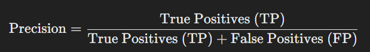

# Unit-2
## Neural Network

Hyper-parameters and validation sets, Types of Neural Networks, Multilayer Perceptron, Feed Forward Neural Networks.

## Performance Metrics
Performance Metrics, Hyper-parameters Optimization, Ensemble Neural Network, Bagging, Boosting, Performance Comparison of Deep Learning Neural Network with standard state-of-the-art classifiers. 
---
---

# Hyperparameters

Hyperparameters are parameters that are not learned by a machine learning model during training but are set before the learning process begins. These parameters control the learning process and significantly influence the performance of the model. Unlike model parameters, which are adjusted during training (e.g., weights in neural networks), hyperparameters are fixed and need to be chosen by the practitioner.


### Key Features of Hyperparameters:
1. **Fixed Before Training**: Hyperparameters are set before the model starts learning from data and do not change during training.
2. **Model-Specific**: They vary between different types of models. For example, hyperparameters in a decision tree model are different from those in a neural network.
3. **Influence on Model Performance**: The choice of hyperparameters can significantly impact the performance of a model, such as its accuracy, speed, and complexity.
4. **Require Optimization**: Hyperparameters usually need to be fine-tuned, often through techniques like grid search, random search, or Bayesian optimization.

### Types of Hyperparameters
Hyperparameters can be categorized into several types depending on the model and context. Below are some commonly used hyperparameters across various machine learning models:

#### 1. **Model-Specific Hyperparameters**
   - **Learning Rate** (`alpha`): This controls how much the model adjusts its parameters (e.g., weights) at each step during training. A high learning rate may cause the model to converge too quickly to a suboptimal solution, while a low learning rate can slow down the training process or cause the model to get stuck.
   - **Batch Size**: In stochastic gradient descent (SGD), batch size refers to the number of training examples used in one iteration. Smaller batches provide more updates but are noisier, while larger batches are more stable but may lead to slower convergence.
   - **Number of Epochs**: This is the number of times the learning algorithm will work through the entire training dataset. Too few epochs can lead to underfitting, while too many can lead to overfitting.
   - **Number of Layers/Nodes in Neural Networks**: This determines the architecture of a neural network. More layers and nodes can increase the complexity and learning capacity of the model but can also lead to overfitting if not regularized properly.
   - **Dropout Rate**: In neural networks, dropout is a regularization technique that involves randomly setting a fraction of neurons to zero during training. The dropout rate controls the proportion of neurons to be dropped out.

#### 2. **Regularization Hyperparameters**
   - **Regularization Strength** (`λ` or `alpha`): Regularization helps prevent overfitting by adding a penalty to large parameter values (e.g., weights). In models like linear regression or logistic regression, regularization can be L1 (Lasso), L2 (Ridge), or a combination (ElasticNet).
   - **Maximum Depth** (in decision trees or random forests): This controls the depth of the trees, which can prevent overfitting. Deep trees tend to fit the training data very well but may not generalize to new data.
   - **Min Samples Split/Leaf**: These hyperparameters control the minimum number of samples required to split a node or form a leaf in tree-based models. Setting them higher can reduce overfitting.

#### 3. **Optimizer-Specific Hyperparameters**
   - **Momentum**: In gradient descent optimizers like SGD with momentum, this parameter helps accelerate gradients in the right direction and smooth out fluctuations. It prevents the model from oscillating around a solution.
   - **Beta Values (Adam Optimizer)**: In the Adam optimizer, `beta1` and `beta2` are decay rates for moving averages of the gradient and squared gradient, respectively. These hyperparameters help in controlling the speed and convergence behavior of the Adam optimizer.

#### 4. **Other Common Hyperparameters**
   - **Kernel Type** (for SVM): In Support Vector Machines, the kernel function determines how the input data is transformed into higher dimensions. Different kernel types (linear, polynomial, RBF) can yield significantly different performance.
   - **C Parameter** (for SVM): This controls the trade-off between achieving a low training error and a low testing error. A small C creates a soft margin (more tolerance for misclassified points), while a larger C forces the model to classify training points more accurately but risks overfitting.
   - **K in K-Nearest Neighbors (KNN)**: This determines the number of neighbors considered when classifying a data point. A small K may lead to noise sensitivity, while a large K can smooth out predictions, potentially leading to underfitting.

### Why Hyperparameter Tuning is Important
- **Model Performance**: Proper hyperparameter tuning can significantly improve the accuracy, precision, and other performance metrics of a model.
- **Avoiding Overfitting/Underfitting**: Hyperparameters can directly control the complexity of a model, helping to avoid overfitting (learning too much from the training data) or underfitting (failing to capture underlying patterns in the data).
- **Training Time**: Some hyperparameters, like batch size or learning rate, affect the computational efficiency of the training process. Efficient tuning can help models train faster and more effectively.

### Hyperparameter Tuning Techniques
1. **Grid Search**: A brute-force approach that exhaustively searches through a manually specified subset of the hyperparameter space. It trains the model for each combination of hyperparameters and selects the one that performs best.
2. **Random Search**: Instead of checking every possible combination, random search selects random combinations of hyperparameters and evaluates them, which is often more computationally efficient than grid search.
3. **Bayesian Optimization**: Bayesian methods aim to model the objective function (e.g., model performance) and use prior evaluations to choose the next hyperparameters intelligently. This method balances exploration and exploitation.
4. **Automated Tuning (AutoML)**: Tools like AutoKeras, H2O AutoML, and Google AutoML automatically handle hyperparameter tuning by integrating sophisticated search algorithms.

### Example of Hyperparameters in Practice

```python
from sklearn.ensemble import RandomForestClassifier

# Setting hyperparameters for RandomForestClassifier
model = RandomForestClassifier(n_estimators=100, 
                               max_depth=10, 
                               min_samples_split=5, 
                               random_state=42)
                               
# Training the model
model.fit(X_train, y_train)
```

- **n_estimators**: Number of trees in the forest (a hyperparameter).
- **max_depth**: Maximum depth of the trees (a hyperparameter).
- **min_samples_split**: Minimum number of samples required to split a node (a hyperparameter).

In this example, all the values (like `n_estimators=100`, `max_depth=10`) are hyperparameters that need to be tuned based on the dataset.


## Hyperparameters(Hinglish)
Hyperparameters woh parameters hote hain jo ek machine learning model ko train karne se pehle set kiye jaate hain. Yeh parameters model ke learning process ko control karte hain aur model ki performance par bahut bada impact dalte hain. Model parameters (jaise weights) ko training ke dauraan adjust kiya jaata hai, jabki hyperparameters fix rehte hain aur training se pehle set karne hote hain.

### Hyperparameters ke Important Features:
1. **Training se pehle set kiye jaate hain**: Inko training shuru hone se pehle set kiya jaata hai aur training ke dauraan change nahi hote.
2. **Model-specific hote hain**: Alag-alag models ke liye alag hyperparameters hote hain. Jaise neural network ke hyperparameters decision tree ke hyperparameters se alag hote hain.
3. **Model Performance pe impact**: Hyperparameters ka sahi selection model ki accuracy, speed, aur complexity ko control karta hai.
4. **Optimization ki zarurat hoti hai**: Hyperparameters ko fine-tune karna padta hai, jaise grid search, random search, ya Bayesian optimization jaise techniques ke through.

### Hyperparameters ke Types

#### 1. **Model-specific Hyperparameters**
   - **Learning Rate (alpha)**: Ye control karta hai ki model har step par apne parameters (jaise weights) ko kitna adjust kare. High learning rate se model jaldi converge kar sakta hai lekin optimal solution par nahi pahuchta, aur low learning rate se training slow ho sakti hai.
   - **Batch Size**: Ye define karta hai ki har iteration mein kitne examples use kiye jayenge. Choti batch size se model jaldi seekh sakta hai lekin noisy updates milte hain, aur badi batch size stable hoti hai lekin slow hoti hai.
   - **Epochs**: Number of times model poore dataset ko pass karega during training. Kam epochs se underfitting hota hai, zyada epochs se overfitting ka risk hota hai.
   - **Number of Layers/Nodes**: Neural networks ke liye ye model ki architecture decide karta hai. Zyada layers aur nodes model ki learning capacity badhati hain, lekin overfitting ka risk bhi hota hai.
   - **Dropout Rate**: Neural networks me dropout ek regularization technique hai jo kuch neurons ko random zero kar deta hai during training. Dropout rate control karta hai kitne neurons ko drop kiya jaayega.

#### 2. **Regularization Hyperparameters**
   - **Regularization Strength (lambda ya alpha)**: Ye overfitting ko rokne ke liye parameters (jaise weights) ko constrain karta hai. Linear regression ya logistic regression me yeh L1 (Lasso), L2 (Ridge), ya ElasticNet ho sakta hai.
   - **Maximum Depth**: Decision trees ya random forests me tree ki maximum depth control karta hai. Zyada depth overfitting ka risk badha deti hai.
   - **Min Samples Split/Leaf**: Ye define karta hai ki ek node ko split karne ke liye minimum kitne samples hone chahiye. Higher values se overfitting kam hota hai.

#### 3. **Optimizer-Specific Hyperparameters**
   - **Momentum**: Gradient descent optimizers (jaise SGD) me momentum gradient ke direction me acceleration provide karta hai aur oscillations ko smooth karta hai.
   - **Beta Values (Adam Optimizer)**: Adam optimizer me beta1 aur beta2 gradients aur squared gradients ke moving averages ke decay rates hote hain. Ye speed aur convergence behavior ko control karte hain.

#### 4. **Other Common Hyperparameters**
   - **Kernel Type (SVM)**: Support Vector Machines me kernel function input data ko higher dimensions me map karta hai. Alag-alag kernel types (linear, polynomial, RBF) se model ki performance par farq padta hai.
   - **C Parameter (SVM)**: Ye training error aur testing error ke beech trade-off ko control karta hai. Chhoti C se soft margin banta hai, aur badi C se model zyada accurately training points classify karta hai lekin overfitting ka risk hota hai.
   - **K in K-Nearest Neighbors (KNN)**: Ye define karta hai ki ek data point ko classify karne ke liye kitne neighbors consider kiye jayenge. Chhota K noise sensitive hota hai, aur bada K smoothing effect laata hai.

### Hyperparameter Tuning Techniques
1. **Grid Search**: Isme manually selected hyperparameters ka exhaustive search hota hai. Sabhi combinations ko check karne ke baad best combination select kiya jaata hai.
2. **Random Search**: Ye randomly hyperparameters ke combinations ko check karta hai, jo grid search se zyada efficient hota hai.
3. **Bayesian Optimization**: Ye intelligently hyperparameter space ko explore karta hai using past evaluations to choose the next set of hyperparameters.
4. **AutoML**: Automated tools jaise AutoKeras, H2O AutoML, jo automatically hyperparameter tuning karte hain.

### Example:

```python
from sklearn.ensemble import RandomForestClassifier

# RandomForestClassifier ke hyperparameters set kar rahe hain
model = RandomForestClassifier(n_estimators=100, 
                               max_depth=10, 
                               min_samples_split=5, 
                               random_state=42)
                               
# Model ko train karna
model.fit(X_train, y_train)
```

- **n_estimators**: Number of trees in the forest (hyperparameter).
- **max_depth**: Tree ki maximum depth (hyperparameter).
- **min_samples_split**: Node ko split karne ke liye minimum samples ki zarurat (hyperparameter).


---
---
---

Hyperparameters are crucial components in machine learning models that control the learning process and significantly affect the model's performance and accuracy. They are set before training and cannot be learned from the data. Let’s go over some common hyperparameters in neural networks, support vector machines (SVMs), and XGBoost, along with additional details.

Hyperparameters har machine learning model ka ek zaroori hissa hote hain, kyunki yeh model ki performance aur accuracy ko directly impact karte hain. Har model ke alag-alag hyperparameters hote hain jo model ke learning process ko control karte hain. Ab hum neural networks, support vector machines (SVMs), aur XGBoost models ke common hyperparameters ko detail mein samjhenge.

# Hyperparameters in Neural Networks

#### **Learning Rate (α)**
- **Explanation**: The learning rate controls the step size during gradient descent optimization. It defines how much to change the model’s weights during each iteration. 
- **Impact**: A low learning rate can make the learning process slow and might never converge, while a high learning rate might cause the model to overshoot the optimal solution, leading to instability or divergence.

#### **Epochs**
- **Explanation**: An epoch refers to one complete pass through the entire training dataset. Increasing the number of epochs gives the model more chances to learn from the data.
- **Impact**: Fewer epochs may lead to underfitting, where the model doesn’t learn enough. Too many epochs can lead to overfitting, where the model learns patterns that only exist in the training data but don’t generalize to new data.

#### **Number of Layers**
- **Explanation**: This hyperparameter defines the depth of the network. More layers make the model more complex and capable of learning intricate patterns.
- **Impact**: Fewer layers can lead to underfitting, as the model may not be able to capture complex relationships. More layers can lead to better learning, but they can also increase the risk of overfitting and require more computational resources.

#### **Number of Nodes per Layer**
- **Explanation**: This defines how many neurons (or units) are in each layer. The number of nodes determines the width of the network.
- **Impact**: Fewer nodes may not give the model enough capacity to capture the data’s patterns, while too many nodes can make the model more complex, leading to overfitting.

#### **Architecture**
- **Explanation**: The architecture determines the overall structure of the network, including the number of layers, the number of neurons in each layer, and how they are connected. Different architectures, such as convolutional neural networks (CNNs) for images or recurrent neural networks (RNNs) for sequences, are suited for different tasks.
- **Impact**: The right architecture can significantly improve performance for specific tasks, but overly complex architectures can make the model more prone to overfitting.

#### **Activation Functions**
- **Additional Point**: The activation function (like ReLU, sigmoid, or tanh) defines the output of a neuron. For example, ReLU is widely used in deep networks because it allows for faster training and helps avoid the vanishing gradient problem.

---

## Hyperparameters in Neural Networks(Hinglish)

#### **Learning Rate (α)**
- **Explanation**: Learning rate ek hyperparameter hai jo batata hai ki gradient descent optimization algorithm ek iteration ke dauraan kitna step size lega. Ek chhoti learning rate se model ko converge hone mein zyada time lagta hai, lekin zyada badhi learning rate model ko unstable bana sakti hai.
- **Impact**: Bahut chhoti learning rate se convergence slow ho jaata hai, jabki bahut zyada learning rate se model diverge kar sakta hai (yaani, kabhi converge nahi hoga).
  
#### **Epochs**
- **Explanation**: Ek epoch tab hota hai jab poora training dataset ek baar model ke through pass hota hai. Zyada epochs model ko zyada training opportunities dete hain, lekin bahut zyada epochs overfitting ka risk badhate hain.
- **Impact**: Kam epochs se model underfitting (yaani, sahi se seekh nahi paata), jabki zyada epochs se overfitting (yaani, model training data ke upar fit ho jaata hai lekin unseen data par achha perform nahi karta).

#### **Number of Layers**
- **Explanation**: Neural network mein number of layers ko depth kehte hain. Zyada layers ka matlab model ki complexity zyada hogi aur woh zyada complex relationships ko seekh sakega.
- **Impact**: Kam layers se model ko complex patterns samajhne mein dikkat hoti hai, jabki zyada layers se overfitting aur zyada computational cost badh jaati hai.

#### **Number of Nodes per Layer**
- **Explanation**: Ek layer mein kitne neurons (nodes) hone chahiye, yeh hyperparameter define karta hai. Zyada neurons se model ki capacity badh jaati hai complex patterns ko seekhne ki.
- **Impact**: Kam neurons model ko underfitting karwa sakte hain, aur zyada neurons se model complex data ko achhe se samajh sakta hai, lekin overfitting ka risk badh jaata hai.

#### **Architecture**
- **Explanation**: Neural network ki overall architecture (yaani, layers ka structure aur neurons ki arrangement) task ke complexity aur dataset ke size par depend karti hai. Architecture ke andar, feedforward networks, convolutional networks (CNNs), aur recurrent neural networks (RNNs) jaise choices hoti hain.
- **Impact**: Complex architecture se model ko powerful banaya ja sakta hai, lekin task ke hisaab se over-complicated architecture model ko slow aur overfitted bana sakta hai.

#### **Activation Functions**
- **Extra Point**: Activation function ka selection ek aur important hyperparameter hota hai, jaise ReLU, sigmoid, ya tanh. Yeh neurons ke output ko control karta hai aur learning ko nonlinear banata hai. ReLU fast aur sparse activations provide karta hai, jabki sigmoid aur tanh activation nonlinear boundaries ke liye use hote hain.

---
---
# Hyperparameters in Support Vector Machines (SVM)

#### **C (Regularization Parameter)**
- **Explanation**: The C parameter controls the trade-off between maximizing the margin and minimizing classification errors. A high C will create a small margin but fewer misclassifications, while a low C will create a larger margin but allow more misclassifications.
- **Impact**: A small C allows more errors in training (soft margin), which helps prevent overfitting, while a large C focuses on getting everything right (hard margin), but may lead to overfitting.

#### **Kernel**
- **Explanation**: The kernel function transforms the input data into a higher-dimensional space, allowing the SVM to solve non-linear problems. Popular kernels include linear, polynomial, and radial basis function (RBF).
- **Impact**: Choosing the right kernel is crucial. The linear kernel works well when the data is linearly separable, while the RBF kernel is useful for capturing complex relationships in non-linear data.

#### **Gamma (for RBF Kernel)**
- **Explanation**: Gamma determines the influence of a single training example on the decision boundary. A high gamma makes the decision boundary close to the support vectors, while a low gamma means the boundary is smoother.
- **Impact**: A high gamma results in a more complex model, potentially leading to overfitting, while a low gamma creates a simpler model that may underfit.

#### **Degree (for Polynomial Kernel)**
- **Additional Point**: For polynomial kernels, the degree defines the power of the polynomial. A higher degree leads to a more complex decision boundary, capturing more intricate relationships in the data.

---
## Hyperparameters in Support Vector Machine (SVM) (Hinglish)

#### **C (Regularization Parameter)**
- **Explanation**: C parameter model ki training error aur margin ke beech trade-off ko control karta hai. Chhota C zyada training errors allow karta hai (yaani, soft margin) lekin model ko generalized rakhta hai. Bada C kam errors ko allow karta hai (yaani, hard margin) lekin overfitting ka risk badh jaata hai.
- **Impact**: Small C se model generalized hoga lekin kuch training points ko galat classify kar sakta hai, aur large C se training data par accuracy badh jaayegi lekin overfitting hoga.

#### **Kernel**
- **Explanation**: Kernel function input data ko higher-dimensional space mein map karta hai taaki nonlinear relationships ko samajha ja sake. Common kernels mein linear, polynomial, radial basis function (RBF), aur sigmoid kernels hote hain.
- **Impact**: Sahi kernel ka selection data ke nature par depend karta hai. Linear kernel simple data ke liye acha hota hai, jabki RBF kernel complex data relationships ke liye useful hota hai.

#### **Gamma (RBF Kernel)**
- **Explanation**: Gamma parameter SVM ke RBF kernel mein support vectors ke decision boundary par influence ko control karta hai. Zyada gamma se nearby points ka zyada influence hota hai, aur chhota gamma distant points ka kam influence karta hai.
- **Impact**: Large gamma model ko complex banata hai aur overfitting ka risk badh jaata hai, jabki small gamma model ko generalized rakhta hai.

#### **Degree (Polynomial Kernel)**
- **Extra Point**: Agar polynomial kernel use kiya jaa raha hai, to degree parameter polynomial ki power ko define karta hai. Zyada degree ka matlab zyada complex boundaries, jo model ko fit hone mein help kar sakti hai.

---
---
# Hyperparameters in XGBoost
XGBoost (Extreme Gradient Boosting) ek popular machine learning library hai jo boosting technique ka use karti hai, khas taur par classification aur regression tasks ke liye. Hyperparameters un settings ya configurations ko kehte hain jo model ki training process ko control karte hain. Inhe sahi tarah se set karna model ki performance ko kaafi behtar bana sakta hai.

### XGBoost ke Hyperparameters

XGBoost mein kai tarah ke hyperparameters hote hain, lekin kuch important hyperparameters ye hain:

1. **n_estimators**:
   - **Kya hai**: Yeh parameter batata hai kitne boosting rounds (ya decision trees) aap model mein add karna chahte hain.
   - **Impact**: Zyada trees se model ki performance improve ho sakti hai, lekin yeh overfitting ka bhi risk badha sakta hai.

2. **learning_rate (eta)**:
   - **Kya hai**: Yeh parameter batata hai ki har boosting round mein model kitna seekhega. Iska value 0 se 1 ke beech hona chahiye.
   - **Impact**: Chhota learning rate zyada rounds ki zaroorat padta hai, lekin isse performance achhi ho sakti hai. Bada learning rate jaldi training karta hai lekin overfitting ka risk bhi badhata hai.

3. **max_depth**:
   - **Kya hai**: Yeh parameter decision trees ki maximum depth ko control karta hai.
   - **Impact**: Agar depth zyada hai, to model complex ho sakta hai aur overfitting ka risk badh sakta hai. Agar depth chhoti hai, to model simple rahega.

4. **min_child_weight**:
   - **Kya hai**: Yeh parameter batata hai ki minimum sum of instance weight (hessian) kya hona chahiye kisi leaf node ko banane ke liye.
   - **Impact**: Zyada value se model conservative ho jata hai aur overfitting kam hota hai, lekin underfitting ka bhi risk ho sakta hai.

5. **subsample**:
   - **Kya hai**: Yeh parameter batata hai ki har boosting round mein kitne percentage training data ka use karna hai.
   - **Impact**: Chhoti value se randomness badhta hai aur overfitting kam hota hai, lekin agar value bahut kam hai to model ki performance kharab ho sakti hai.

6. **colsample_bytree**:
   - **Kya hai**: Yeh parameter batata hai ki har tree ke liye kitne features ka random sample use karna hai.
   - **Impact**: Iska chhota value randomness ko badhata hai, jo overfitting ko reduce karne mein madad karta hai.

7. **gamma (min_split_loss)**:
   - **Kya hai**: Yeh parameter batata hai ki ek node ko split karne ke liye minimum loss reduction kya honi chahiye.
   - **Impact**: Iska zyada value model ko conservative banata hai aur overfitting ko reduce karta hai.

### Summary

Hyperparameters ko tune karna ek important step hai XGBoost model ki training mein, kyunki sahi hyperparameters ke saath model ki performance kaafi improve ho sakti hai. Hyperparameter tuning ke liye techniques jaise Grid Search, Random Search ya Bayesian Optimization ka use kiya ja sakta hai.

In sab points se aapko XGBoost ke hyperparameters ka idea mil gaya hoga aur yeh samajh aaya hoga ki inhe kaise set karna hai. Agar aapko aur koi specific information chahiye to pooch sakte hain!

#### **Learning Rate**
- **Explanation**: The learning rate in XGBoost controls how quickly the model adapts to the problem. It scales the contribution of each tree added to the model during training.
- **Impact**: A high learning rate can lead to faster convergence but increases the risk of overfitting. A low learning rate leads to slower but more stable training and reduces the risk of overfitting.

#### **n_estimators**
- **Explanation**: This parameter determines the number of trees to be built. Each tree corrects the errors of the previous one, making the model stronger.
- **Impact**: More trees typically improve accuracy, but too many trees can cause overfitting and increase computational time.

#### **Max Depth**
- **Explanation**: Max depth controls the maximum depth of each tree. Deeper trees can model more complex relationships, but they also increase the risk of overfitting.
- **Impact**: A small max depth leads to simpler trees that generalize well, while a larger max depth can lead to overfitting on the training data.

#### **Min Child Weight**
- **Explanation**: This hyperparameter sets the minimum sum of instance weights required in a child node. A higher value results in more conservative splits, reducing overfitting.
- **Impact**: A small value allows the model to make more aggressive splits, which could lead to overfitting, while a large value prevents overfitting by requiring larger splits.

#### **Subsample**
- **Additional Point**: This parameter determines the fraction of data to be used for training each tree. Subsampling can help prevent overfitting by adding randomness to the trees.

---
## Hyperparameters in XGBoost(Hinglish)

#### **Learning Rate**
- **Explanation**: XGBoost mein learning rate step size ko control karta hai jo model ek iteration ke baad update karta hai. Small learning rate training ko stable banata hai lekin slow bhi, jabki large learning rate se fast convergence hota hai lekin overfitting ka risk hota hai.
- **Impact**: Zyada small learning rate se model ko converge hone mein zyada time lagta hai, aur zyada large learning rate se model jaldi converge karta hai lekin stability loose kar deta hai.

#### **n_estimators**
- **Explanation**: Ye parameter batata hai ki kitne boosting trees train kiye jayenge. Zyada trees se model ki accuracy badhti hai, lekin overfitting ka risk bhi badh jaata hai.
- **Impact**: Zyada trees model ki performance ko improve karte hain, lekin computational cost badha dete hain aur overfitting ka chance bhi.

#### **Max Depth**
- **Explanation**: Har tree ki maximum depth ko define karta hai. Zyada depth se trees complex ho jaate hain aur complex relationships ko capture kar sakte hain, lekin overfitting ka risk badha jaata hai.
- **Impact**: Chhoti depth se model underfit ho sakta hai, aur zyada depth se model zyada complex ho jaata hai, jo overfitting ka karan ban sakta hai.

#### **Min Child Weight**
- **Explanation**: Ye hyperparameter control karta hai ki ek child node ko split karne ke liye minimum sum of instance weight kitna hona chahiye. Zyada min_child_weight overfitting ko rokta hai kyunki splitting ke liye zyada data ki zarurat hoti hai.
- **Impact**: Small min_child_weight model ko zyada aggressively split karne deta hai, jo overfitting ka risk badhata hai, jabki large min_child_weight se model conservative split karta hai aur generalize kar pata hai.

#### **Subsample**
- **Extra Point**: Ye hyperparameter batata hai ki training data ka kitna percentage har tree ke liye sample kiya jaayega. Subsampling se overfitting reduce kiya jaa sakta hai.

---
---
---

## Advantages of Hyperparameters

1. **Control Over Learning Process**: Hyperparameters like the learning rate allow precise control over how fast or slow a model learns, helping to avoid convergence issues.
   
2. **Model Complexity Management**: Hyperparameters such as the number of layers or nodes help to manage the complexity of a neural network, ensuring it can capture the right level of detail from the data.

3. **Prevent Overfitting**: By adjusting parameters like regularization (C in SVM or min_child_weight in XGBoost), hyperparameters can prevent the model from fitting the noise in the data, leading to better generalization.

4. **Adaptability to Different Datasets**: Hyperparameters like kernel choice (in SVM) and architecture (in neural networks) enable models to adapt to a wide range of data types and distributions.

5. **Enhanced Performance**: Correctly tuned hyperparameters can significantly improve the accuracy and predictive power of a model, allowing it to perform optimally on complex tasks.

6. **Faster Convergence**: With optimal values for hyperparameters like learning rate or number of estimators, the model can converge faster, reducing training time.

7. **Resource Optimization**: Adjusting hyperparameters like batch size and number of epochs can help manage computational resources more effectively, balancing speed and accuracy.

8. **Flexibility**: Hyperparameters offer the flexibility to customize models for specific use cases, making them more versatile for different machine learning problems.

---

### **Advantages of Hyperparameters (Hinglish)**

1. **Learning Process Par Control**: Hyperparameters jaise learning rate ko adjust karke model ke learning speed ko control kar sakte hain, jisse convergence ke issues avoid kiye ja sakte hain.

2. **Model Complexity Ka Management**: Layers ya nodes ke number jaise hyperparameters ke through neural network ki complexity ko manage kar sakte hain, taaki model sahi level ka detail data se capture kar sake.

3. **Overfitting Ko Rokna**: Regularization jaise hyperparameters (C in SVM ya min_child_weight XGBoost mein) adjust karke model ko data ke noise ko fit karne se bacha sakte hain, jisse generalization better hoti hai.

4. **Alag-Alag Datasets Ke Liye Adaptability**: Hyperparameters jaise kernel ka choice (SVM mein) ya architecture (neural networks mein) models ko alag data types aur distributions ke liye adapt hone mein madad karte hain.

5. **Performance Mein Sudhar**: Hyperparameters ko sahi tareeke se tune karne par model ki accuracy aur predictive power mein kaafi sudhar hota hai, jisse complex tasks mein bhi acchi performance milti hai.

6. **Faster Convergence**: Agar learning rate ya number of estimators jaise hyperparameters ke sahi values ho to model jaldi converge karta hai, jisse training time kam hota hai.

7. **Resource Ka Sahi Upyog**: Hyperparameters jaise batch size ya epochs ko adjust karke computational resources ka sahi upyog kar sakte hain, taaki speed aur accuracy ke beech balance banaye rakh sakein.

8. **Flexibility**: Hyperparameters flexibility dete hain jisse models ko specific use cases ke liye customize kar sakte hain, aur unhe alag-alag machine learning problems ke liye versatile banate hain.

---

## **Disadvantages of Hyperparameters**

1. **Time-Consuming to Tune**: Finding the right combination of hyperparameters can take a lot of time, especially when using methods like grid search or random search.

2. **No Guarantee of Optimality**: Even after tuning, there’s no guarantee that the selected hyperparameters are the absolute best, as the model may still underperform.

3. **Risk of Overfitting**: If hyperparameters like learning rate or number of epochs are not set properly, the model can easily overfit the training data, reducing its ability to generalize.

4. **Computationally Expensive**: Hyperparameter tuning, especially in large datasets, can be computationally expensive, requiring significant processing power and memory.

5. **Dependence on Data Size**: Some hyperparameters may perform well on small datasets but fail on larger ones, requiring constant retuning based on the size of the dataset.

6. **Interdependency**: Hyperparameters often interact with each other, meaning that tuning one parameter might require retuning others, making the process complex.

7. **Difficulty in Automation**: Automatically optimizing hyperparameters across different models is still a challenging task, and manual tuning remains common.

8. **Limited Intuition**: For complex models, it’s often difficult to intuitively understand the effect of certain hyperparameters, which makes tuning harder without deep technical knowledge.

---

### **Disadvantages of Hyperparameters (Hinglish)**

1. **Tune Karne Mein Bahut Samay Lagta Hai**: Sahi hyperparameters ka combination dhoondhne mein bahut samay lagta hai, khaaskar jab grid search ya random search jaisi methods ka use kiya jata hai.

2. **Optimal Hone Ki Guarantee Nahi Hoti**: Tune karne ke baad bhi yeh guarantee nahi hoti ki selected hyperparameters sabse best hain, aur model ab bhi achha perform nahi kar sakta.

3. **Overfitting Ka Risk**: Agar learning rate ya epochs jaise hyperparameters ko sahi se set nahi kiya gaya, toh model training data ko overfit kar sakta hai, jisse generalization mein dikkat hoti hai.

4. **Computationally Mehenga**: Hyperparameters ko tune karna, khaaskar large datasets mein, computationally mehenga hota hai, jisme kaafi processing power aur memory ki zarurat hoti hai.

5. **Data Size Par Nirbhar**: Kuch hyperparameters chhoti datasets mein achha perform karte hain, lekin bade datasets mein fail ho jate hain, aur dataset ke size ke hisaab se baar-baar retuning ki zarurat hoti hai.

6. **Interdependency**: Kai hyperparameters ek doosre par depend karte hain, iska matlab agar ek parameter ko tune kiya gaya toh doosre parameters ko bhi retune karna padta hai, jisse process complex ban jata hai.

7. **Automation Mein Dikkat**: Different models ke liye hyperparameters ko automatically optimize karna aaj bhi challenging task hai, aur manual tuning zyada tarah common hota hai.

8. **Limited Intuition**: Complex models mein kuch hyperparameters ka effect samajhna kaafi mushkil hota hai, jisse bina gehri technical knowledge ke tuning aur zyada challenging ho jata hai.

---
---
---

# Hyperparameters in Machine Learning
In Machine Learning/Deep Learning, a model is represented by its parameters, which are learned during the training process. However, selecting the best or optimal hyperparameters is crucial, as they guide the learning algorithm to produce the best possible results. So, **what are these hyperparameters?**

The answer is: "**Hyperparameters are the parameters explicitly defined by the user to control the learning process.**" The prefix "hyper" suggests that these are top-level parameters used to control how the learning process unfolds.

The values of hyperparameters are chosen and set by the machine learning engineer before the learning algorithm begins training the model. This means hyperparameters are **external to the model**, and their values remain fixed throughout the training process—they cannot be altered once the training has started.

These hyperparameters play a vital role in controlling the training process, such as setting the learning rate, batch size, number of epochs, and more, ensuring that the model is trained efficiently and effectively.

---
Machine Learning/Deep Learning me, ek model ko uske parameters se represent kiya jata hai. Training process ke dauran, best ya optimal hyperparameters ko select karna hota hai, jo learning algorithms ko use karte hue best result dene me madad karte hain. Toh yeh **hyperparameters kya hote hain?**

Jawab yeh hai: "**Hyperparameters wo parameters hote hain jo explicitly user ke dwara define kiye jaate hain taaki learning process ko control kiya ja sake.**" Yaha prefix "hyper" yeh suggest karta hai ki yeh parameters top-level hote hain jo learning process ko control karne ke liye use hote hain.

Hyperparameters ke values ko machine learning engineer training process se pehle select aur set karta hai, matlab jab learning algorithm model ko train karna start karta hai, tab se pehle hi yeh values decide hoti hain. Isliye, yeh parameters **model ke external** hote hain, aur training process ke dauran inke values change nahi kiye ja sakte.

Yeh hyperparameters training process ko control karte hain, jaise learning rate, batch size, number of epochs, etc., taaki aapka model efficiently aur effectively train ho sake.


## Some examples of Hyperparameters in Machine Learning 

Let's dive into each of these hyperparameters in detail to understand their significance in different machine learning algorithms:
- The k in kNN or K-Nearest Neighbour algorithm
- Learning rate for training a neural network
- Train-test split ratio
- Batch Size
- Number of Epochs
- Branches in Decision Tree
- Number of clusters in Clustering Algorithm


### 1. **The 'k' in k-Nearest Neighbors (kNN) algorithm:**
   - **What it is:** In the kNN algorithm, the hyperparameter `k` refers to the number of nearest neighbors the algorithm considers when making predictions for a new data point. The algorithm calculates the distance between the new data point and all points in the training data, and it picks the `k` closest points (neighbors).
   - **Effect of k:** 
     - **Small k:** If `k` is too small (e.g., 1), the model becomes highly sensitive to noise and may overfit. It will classify a new data point based on just one neighbor, which might not be representative of the general trend.
     - **Large k:** A larger value of `k` makes the model more generalized because it takes into account more neighbors. However, if `k` is too large, the model can oversmooth and lose precision by considering irrelevant points (distant neighbors).
   - **Choosing k:** You can select an appropriate value of `k` through cross-validation by testing different values of `k` and checking the performance.

### 2. **Learning rate for training a neural network:**
   - **What it is:** The learning rate controls how much to adjust the model’s weights in response to the error at each iteration during training. It determines the step size taken by the optimizer in the direction of the minimum error (i.e., gradient descent).
   - **Effect of learning rate:** 
     - **Small learning rate:** If the learning rate is too small, the model will converge very slowly, requiring many iterations and epochs to reach a good solution. It can also get stuck in local minima.
     - **Large learning rate:** A very large learning rate can cause the model to diverge and fail to learn, as it may overshoot the minimum error or lead to unstable training.
   - **Optimal learning rate:** The right balance ensures that the model converges efficiently without overshooting or taking too long to stabilize.

### 3. **Train-test split ratio:**
   - **What it is:** This is the ratio used to split the dataset into a training set and a test set. The training set is used to build the model, while the test set evaluates the model’s performance on unseen data.
   - **Common split ratios:** Popular choices are 80:20 or 70:30, where 80% or 70% of the data is used for training and the rest for testing.
   - **Effect of split ratio:** 
     - **More training data:** A higher training proportion gives the model more data to learn from, which can improve its accuracy.
     - **Less training data:** If the training set is too small, the model might not learn enough and may underperform. However, if the test set is too small, the model’s performance might not be reliably evaluated.

### 4. **Batch Size:**
   - **What it is:** Batch size refers to the number of training examples used in one iteration (or step) of training before updating the model’s weights. In stochastic gradient descent (SGD), batch size affects how frequently the model updates its weights.
   - **Effect of batch size:**
     - **Small batch size (e.g., 1 or few):** With a smaller batch size, the model updates more frequently, which leads to noisy but faster convergence. However, it may take longer to train due to the frequent updates.
     - **Large batch size:** A larger batch size leads to more stable and accurate weight updates but requires more memory and computational resources. Too large a batch size may result in slow convergence.
   - **Choosing batch size:** It’s often selected based on a balance between computational efficiency and the noise in updates.

### 5. **Number of Epochs:**
   - **What it is:** An epoch refers to one complete pass through the entire training dataset. The number of epochs is a hyperparameter that controls how many times the learning algorithm goes over the data during training.
   - **Effect of number of epochs:** 
     - **Few epochs:** Too few epochs can lead to underfitting, where the model has not had enough time to learn from the data.
     - **Too many epochs:** Too many epochs can cause overfitting, where the model learns to memorize the training data instead of generalizing to new, unseen data.
   - **Finding the right number:** The optimal number of epochs is typically found through experimentation and by monitoring the model’s performance on a validation set.

### 6. **Branches in Decision Tree (Max Depth):**
   - **What it is:** The depth of a decision tree refers to the maximum number of splits or "branches" the tree is allowed to make before classifying a data point. This is a critical hyperparameter in decision tree algorithms.
   - **Effect of tree depth:** 
     - **Shallow tree (fewer branches):** If the tree is too shallow, it won’t capture enough complexity and may underfit, failing to correctly classify complex data.
     - **Deep tree (more branches):** If the tree is too deep, it can overfit the training data, capturing even small noise in the dataset, leading to poor performance on test data.
   - **Choosing tree depth:** Cross-validation is used to find the optimal depth that balances fitting the data well without overfitting.

### 7. **Number of Clusters in Clustering Algorithm (e.g., K-Means):**
   - **What it is:** In clustering algorithms like k-means, the number of clusters (`k`) is a key hyperparameter that determines how many groups or clusters the algorithm should form in the dataset.
   - **Effect of number of clusters:**
     - **Small k (fewer clusters):** If `k` is too small, the algorithm may combine distinct groups, leading to underfitting and poor cluster representation.
     - **Large k (many clusters):** If `k` is too large, it can lead to overfitting, where the algorithm forms too many small, insignificant clusters that don’t represent meaningful patterns.
   - **Choosing k:** Techniques like the **elbow method** or **silhouette analysis** can help determine the optimal number of clusters.

---

## (Hinglish)

### 1. **k in k-Nearest Neighbors (kNN) Algorithm:**
   - **Yeh kya hai:** kNN algorithm me, `k` ka matlab hota hai ki jab algorithm naye data point ka prediction karta hai, toh uske kitne najdiki (nearest) neighbors ko consider karta hai. Algorithm naye data point aur training data ke sabhi points ke beech distance calculate karta hai aur sabse najdiki `k` points ko select karta hai.
   - **k ka effect:**
     - **Chhota k:** Agar `k` bahut chhota hai (jaise 1), toh model noise ke liye zyada sensitive ho jata hai aur overfitting ka chance badh jata hai. Sirf ek neighbor ke basis par predict karega, jo sahi representation nahi ho sakta.
     - **Bada k:** Bada `k` model ko zyada generalized banata hai kyunki zyada neighbors consider kiye ja rahe hain. Lekin agar `k` bahut bada ho, toh irrelevant (door ke) points bhi consider hone lagte hain, jisse model ki precision kam ho sakti hai.
   - **k ka selection:** Cross-validation ka use karke aap different `k` values ko test kar sakte ho aur best performance ke liye suitable `k` choose kar sakte ho.

### 2. **Learning Rate for Neural Network:**
   - **Yeh kya hai:** Learning rate decide karta hai ki training ke dauran model ki weights ko kitna adjust karna hai har iteration ke baad. Yeh step size ko control karta hai, jisse optimizer model ka error minimize karne ke liye weights update karta hai.
   - **Learning rate ka effect:**
     - **Chhoti learning rate:** Agar learning rate bahut chhoti hai, toh model bahut slow converge karega, aur zyada epochs lagengi achhi solution tak pahunchne me. Isse model local minima me bhi atak sakta hai.
     - **Badi learning rate:** Bahut badi learning rate se model diverge kar sakta hai, jisse model unstable ho jata hai aur sahi se seekh nahi pata.
   - **Optimal learning rate:** Achi learning rate wahi hoti hai jo efficiently model ko converge kare bina overshoot ya instability ke.

### 3. **Train-Test Split Ratio:**
   - **Yeh kya hai:** Yeh ratio training aur test dataset ko split karne ke liye use hota hai. Training set ko model train karne ke liye use kiya jata hai, jabki test set ko model ki performance check karne ke liye.
   - **Common split ratios:** Popular ratios jaise 80:20 ya 70:30 use ki jati hain, jisme 80% ya 70% data training ke liye hota hai aur baaki test ke liye.
   - **Split ratio ka effect:**
     - **Zyada training data:** Agar training set bada hoga, toh model ko seekhne ke liye zyada data milega, jo accuracy improve kar sakta hai.
     - **Kam training data:** Agar training data kam hoga, toh model sahi se nahi seekh payega aur underperform kar sakta hai. Wahi agar test set kam hoga, toh model ki performance ka sahi andaza nahi lagaya ja sakta.

### 4. **Batch Size:**
   - **Yeh kya hai:** Batch size decide karta hai ki har iteration me kitne training examples model ko diye jayenge pehle weights update karne se pehle. Stochastic gradient descent (SGD) me, batch size is baat ko control karta hai ki kitni frequently model apne weights update karega.
   - **Batch size ka effect:**
     - **Chhoti batch size:** Chhoti batch size ke saath model frequently weights update karega, jisse faster lekin noisy convergence hogi.
     - **Badi batch size:** Badi batch size me weight updates stable honge lekin training time zyada lag sakta hai aur memory consumption bhi badh sakti hai.
   - **Batch size selection:** Computational efficiency aur stability ke beech balance dekh kar batch size select ki jati hai.

### 5. **Number of Epochs:**
   - **Yeh kya hai:** Ek epoch ka matlab hai ki model ne puri training dataset ko ek baar process kiya. Number of epochs decide karta hai ki model kitni baar training dataset se guzrega.
   - **Effect of epochs:**
     - **Kam epochs:** Agar epochs kam honge toh model sahi se nahi seekh payega, jisse underfitting ho sakti hai.
     - **Zyada epochs:** Zyada epochs model ko overfit karne par majboor kar sakte hain, jisse model training data ko yaad kar leta hai aur generalize nahi karta.
   - **Optimal epochs:** Best number of epochs ko validation set ke performance ko dekhkar find kiya jata hai.

### 6. **Branches in Decision Tree (Max Depth):**
   - **Yeh kya hai:** Decision tree me depth ya branches ka matlab hota hai ki model kitne splits kar sakta hai ek data point ko classify karne se pehle.
   - **Effect of tree depth:**
     - **Shallow tree:** Agar tree ki depth kam hai, toh model complex patterns ko capture nahi kar paayega aur underfitting karega.
     - **Deep tree:** Agar tree bahut deep ho, toh model overfit ho jata hai, jo ki sirf training data pe accha perform karega, lekin test data pe nahi.
   - **Depth selection:** Cross-validation ke through best depth ko find kiya jata hai, jo overfitting aur underfitting ke beech balance kare.

### 7. **Number of Clusters in Clustering Algorithm (e.g., K-Means):**
   - **Yeh kya hai:** Clustering algorithms me, jaise k-means me, number of clusters (`k`) wo hyperparameter hota hai jo decide karta hai ki algorithm kitne groups/ clusters banayega data ke andar.
   - **Effect of clusters:**
     - **Chhota k:** Agar `k` chhota hai, toh distinct groups combine ho sakte hain, jisse model underfit hoga.
     - **Bada k:** Agar `k` zyada bada hai, toh bahut zyada chhoti clusters ban jayengi jo meaningful patterns represent nahi karengi.
   - **Cluster ka selection:** Elbow method ya silhouette analysis jaise techniques se optimal clusters find kiye jate hain.

---
---
---

# Parameters vs Hyperparameters
The difference between **Parameters** and **Hyperparameters** in machine learning and deep learning is crucial to understanding how models are trained and optimized. Let’s break it down:

### Model Parameters:
These are internal variables of the model that the model learns automatically from the data during the training process.

#### Key Characteristics of Model Parameters:
1. **Learned from data**: The model automatically adjusts these parameters based on the input data during the training phase. For example, the weights in a neural network or the coefficients in linear regression.
   
2. **Used for prediction**: These parameters define how the model makes predictions. They help in transforming the input into the output based on the learned relationships.

3. **Not set manually**: You do not manually define or set the parameters; they are learned during the training process.

4. **Examples**:
   - **Linear Regression**: Coefficients (slope and intercept) learned from the training data.
   - **Neural Networks**: Weights and biases that are adjusted based on the loss function during training.
   - **Clustering (e.g., K-Means)**: Cluster centroids that are updated during the algorithm’s iterations.

### Hyperparameters:
Hyperparameters are the external variables that you manually define to control the learning process. They determine the structure of the model or how the training is performed but are not learned from the data.

#### Key Characteristics of Hyperparameters:
1. **Defined by the user**: Hyperparameters are set manually by the machine learning engineer before the model training starts.

2. **Trial and error**: The best values for hyperparameters are often determined by experimentation (trial and error) or using methods like Grid Search or Random Search. There are no precise ways to calculate the best hyperparameter values directly.

3. **Control the learning process**: Hyperparameters control aspects of the training process like the learning rate, number of epochs, batch size, and complexity of the model.

4. **Examples**:
   - **Learning Rate**: In neural networks, it controls the step size for updating the weights.
   - **K in KNN**: It defines how many nearest neighbors to consider for classification.
   - **Max Depth in Decision Trees**: It controls the depth of the decision tree and influences overfitting and underfitting.

### Summary:
| **Aspect**                | **Model Parameters**                                    | **Hyperparameters**                                         |
|---------------------------|---------------------------------------------------------|-------------------------------------------------------------|
| **Learned/Set by**         | Learned from the training data                          | Manually set by the user before training                     |
| **Examples**               | Weights (Neural Networks), Coefficients (Linear Regression), Cluster Centroids (Clustering) | Learning rate, Batch size, Number of epochs, k in kNN        |
| **Purpose**                | Help the model make predictions                         | Control how the model is trained and its structure           |
| **Optimized during training** | Yes, learned automatically through optimization        | No, must be set and adjusted manually through experimentation |
| **Impact on model**        | Defines the function of the model (what it learns)       | Defines how the model learns and trains                      |

#### In short:
- **Model Parameters**: Internal, learned during training, used for making predictions.
- **Hyperparameters**: External, set before training, control the learning process.
---

Machine Learning aur Deep Learning me **Parameters** aur **Hyperparameters** ka difference samajhna bahut zaroori hota hai, kyunki ye decide karte hain ki model kaise train hoga aur optimize hoga. Chalo ise detail me samajhte hain:

### Model Parameters:
Ye wo internal variables hote hain jo model apne aap data se training ke dauran seekhta hai.

#### Key Points for Model Parameters:
1. **Data se seekhte hain**: Model in parameters ko input data ke basis par automatically adjust karta hai jab training chal rahi hoti hai. Example: Neural network me weights ya linear regression me coefficients.

2. **Prediction ke liye use hote hain**: In parameters ka kaam hota hai ki model input ko kaise output me convert kare, yaani prediction karne me madad karte hain.

3. **Manually set nahi hote**: Aap inhe manually set nahi karte, ye model khud training ke time pe seekhta hai.

4. **Examples**:
   - **Linear Regression**: Training data se seekhe gaye coefficients (slope aur intercept).
   - **Neural Networks**: Weights aur biases jo loss function ke basis pe update hote hain.
   - **Clustering (K-Means)**: Cluster centroids jo iterations ke dauran update hote hain.

### Hyperparameters:
Hyperparameters wo external variables hote hain jo aap manually define karte ho taaki model ka learning process control ho sake. Inhe data se nahi seekha jaata.

#### Key Points for Hyperparameters:
1. **User define karta hai**: Hyperparameters ko model training ke shuru hone se pehle manually set karna padta hai.

2. **Trial and error se milta hai best value**: Hyperparameters ke best values ko experiment kar ke (trial and error), ya phir methods jaise Grid Search ya Random Search se determine kiya jaata hai.

3. **Learning process ko control karte hain**: Hyperparameters decide karte hain ki model training kaise karega, jaise learning rate, epochs, batch size, etc.

4. **Examples**:
   - **Learning Rate**: Neural networks me ye decide karta hai ki weights kitni speed se update honge.
   - **K in KNN**: Ye define karta hai ki kitne nearest neighbors consider kiye jayenge classification ke liye.
   - **Max Depth in Decision Trees**: Ye decision tree ki depth control karta hai aur overfitting/underfitting ko influence karta hai.

### Summary:
| **Aspect**                | **Model Parameters**                                    | **Hyperparameters**                                         |
|---------------------------|---------------------------------------------------------|-------------------------------------------------------------|
| **Kisne set kiya?**        | Data se automatically seekhte hain                      | User ko training se pehle manually set karna padta hai       |
| **Examples**               | Weights (Neural Networks), Coefficients (Linear Regression), Cluster Centroids (Clustering) | Learning rate, Batch size, Number of epochs, k in kNN        |
| **Purpose**                | Prediction ke liye kaam karte hain                      | Training process ko control karte hain                       |
| **Training ke dauran adjust hote hain?** | Haan, automatically optimization ke through adjust hote hain | Nahi, inhe trial and error ke through manually adjust karna padta hai |
| **Model pe impact**        | Model ka function define karte hain (model kya seekhta hai) | Model ka learning process aur structure define karte hain    |

#### Simple shabdon me:
- **Model Parameters**: Internal hote hain, training ke dauran seekhe jaate hain, prediction ke liye kaam karte hain.
- **Hyperparameters**: External hote hain, training se pehle set kiye jaate hain, learning process ko control karte hain.

---
---
---

# Categories of Hyperparameters
Broadly hyperparameters can be divided into two categories, which are given below:

1. **Hyperparameter for Optimization**
2. **Hyperparameter for Specific Models**

### 1. Hyperparameters for **Optimization**
- The process of selecting the best hyperparameters to use is known as hyperparameter tuning, and the tuning process is also known as hyperparameter optimization. Optimization parameters are used for optimizing the model.
- These hyperparameters are primarily used to control the process of optimizing the model during training. This is where the term **Hyperparameter Tuning** or **Hyperparameter Optimization** comes into play. Hyperparameter optimization refers to finding the best combination of these hyperparameters to ensure that the model performs well. Here are some key hyperparameters related to optimization:

#### Key Examples:
- **Learning Rate**: 
  - The learning rate determines the size of the steps that the optimizer will take when adjusting the model's parameters. A small learning rate leads to a more accurate but slower convergence, whereas a large learning rate speeds up convergence but may cause the model to overshoot the minimum, resulting in poor performance.
  
- **Batch Size**: 
  - This defines the number of training examples utilized in one iteration of gradient descent. Smaller batch sizes may result in noisy updates but faster convergence, while larger batch sizes lead to smoother updates but slower iterations.
  
- **Number of Epochs**: 
  - This refers to the number of times the model will see the entire training dataset. More epochs may lead to better learning, but too many epochs can cause overfitting (i.e., the model memorizes the training data rather than learning generalizable patterns).
  
- **Momentum**: 
  - Momentum helps accelerate the convergence of gradient descent by considering the past updates and smoothing out the fluctuations. This is especially useful for handling oscillations during optimization.
  
- **Weight Decay (L2 Regularization)**: 
  - It is used to prevent overfitting by adding a penalty for large weights. It helps in generalizing the model by discouraging complex, overfitted solutions.

#### Purpose:
The purpose of optimization-related hyperparameters is to **guide and regulate the learning process** in a way that the model can converge to a solution efficiently and effectively, without getting stuck in local minima or overfitting.

---
### 1. **Hyperparameters for Optimization(Hinglish)**
Yeh hyperparameters model ko train karte waqt uske performance ko optimize karne ke liye use hote hain. Is process ko **Hyperparameter Tuning** ya **Hyperparameter Optimization** kehte hain. Iska matlab hai best hyperparameters ka combination dhundhna taki model achhe se perform kare.

#### Key Examples:
- **Learning Rate**: 
  - Learning rate yeh decide karta hai ki model apni weights ko kitna quickly update karega. Agar learning rate chhota hoga toh model slowly learn karega, lekin zyada accurate hoga. Agar learning rate zyada hoga toh model fast learn karega, lekin kabhi-kabhi optimal solution ko miss kar sakta hai.
  
- **Batch Size**: 
  - Batch size decide karta hai ki kitne training examples ek iteration mein model process karega. Chhota batch size fast updates deta hai, lekin zyada noise ke sath. Bada batch size slow hota hai, lekin updates smooth hoti hain.
  
- **Number of Epochs**: 
  - Epochs ka matlab hai ki model kitni baar pura dataset dekhega. Zyada epochs model ko achha learn karne mein madad karte hain, lekin agar zyada honge toh model overfit ho sakta hai (yaani model data ko yaad kar lega, lekin generalize nahi karega).

- **Momentum**: 
  - Momentum gradient descent ko accelerate karta hai by considering past updates, aur yeh fluctuations ko smooth karne mein madad karta hai.

- **Weight Decay (L2 Regularization)**: 
  - Weight decay overfitting ko prevent karta hai by adding a penalty for large weights. Isse model generalize kar pata hai aur complex solutions avoid karta hai.

#### Purpose:
Optimization-related hyperparameters ka purpose hai model ko guide karna aur regulate karna taki wo efficiently aur effectively learn kar sake, bina local minima mein phase aur bina overfit hue.

---

### 2. Hyperparameters for **Specific Models**
These hyperparameters are specific to the structure and architecture of the model itself. They define the configuration of the model and play a crucial role in determining how complex or simple the model will be. Depending on the type of model, different hyperparameters are involved.

#### Key Examples:
- **Number of Hidden Units** (Neural Networks):
  - Hidden units refer to the neurons in the hidden layers of a neural network. These are not directly connected to the input or output layers but are part of the architecture between them. The number of hidden units is a key hyperparameter for neural networks, as it controls the model's ability to capture complex relationships in the data.
  
  - **Rule of Thumb**: Generally, the number of hidden units should be between the size of the input layer and the output layer. A common heuristic is to choose the number of hidden units as 2/3 of the input size, plus the size of the output layer.
  
  - **Impact**: More hidden units provide greater model capacity but can lead to overfitting, especially when the dataset is small. Fewer hidden units may underfit the data, meaning the model might not be complex enough to capture underlying patterns.

- **Number of Layers** (Neural Networks):
  - A neural network consists of multiple layers: an input layer, hidden layers, and an output layer. The depth of the network, defined by the number of layers, influences the network's ability to model complex data.
  
  - **Key Points**: 
    - A 3-layered neural network generally performs better than a simpler 2-layered one, as it can model more complex relationships.
    - In deep learning models, such as Convolutional Neural Networks (CNNs), adding more layers increases the model's capacity to recognize intricate patterns in data (such as in image classification tasks).
    - However, increasing the number of layers also requires more computational resources and can lead to vanishing or exploding gradient problems, which need to be handled with techniques like batch normalization or skip connections (ResNet).

- **Dropout Rate** (Neural Networks):
  - Dropout is a regularization technique where a fraction of neurons are randomly “dropped out” during training to prevent overfitting. The dropout rate is a hyperparameter that defines what fraction of neurons will be dropped.
  
- **Kernel and Gamma** (SVM):
  - In Support Vector Machines (SVM), the **kernel** defines the type of transformation used to map data into higher dimensions. The **gamma** parameter determines the influence of a single training example on the decision boundary, especially for non-linear kernels like RBF (Radial Basis Function).

#### Purpose:
The hyperparameters for specific models are directly related to the **architecture** and **structure** of the machine learning model. These hyperparameters are essential for shaping the model and determining its complexity and capability to generalize.

---

### 2. **Hyperparameters for Specific Models(Hinglish)**
Yeh hyperparameters specific models ke structure aur architecture ko define karte hain. Yeh model ki complexity ya simplicity decide karte hain.

#### Key Examples:
- **Number of Hidden Units** (Neural Networks):
  - Hidden units wo neurons hote hain jo neural network ke hidden layers mein hote hain. Inka kaam data ke complex relationships ko capture karna hota hai. Hidden units ka number model ki learning capacity ko control karta hai.
  
  - **Rule of Thumb**: Usually hidden units ka number input layer aur output layer ke size ke beech hota hai. Common heuristic yeh hota hai ki hidden units ka number input size ka 2/3 plus output layer ke size ke barabar hona chahiye.
  
  - **Impact**: Zyada hidden units se model ki capacity badhti hai, lekin overfitting ka risk bhi hota hai, especially jab dataset chhota ho. Kam hidden units model ko underfit kar sakte hain, yaani model data ke patterns ko acche se capture nahi kar payega.

- **Number of Layers** (Neural Networks):
  - Neural network layers ka set hota hai, jaise input layer, hidden layers, aur output layer. Layers ki depth yeh decide karti hai ki model kitna complex data handle kar sakta hai.
  
  - **Key Points**: 
    - 3-layered neural network usually 2-layered network se better perform karta hai, kyunki wo zyada complex relationships model kar sakta hai.
    - Deep learning models, jaise CNN (Convolutional Neural Networks), mein layers ki zyada number hone se model zyada acche patterns recognize kar pata hai (jaise image classification tasks mein).

- **Dropout Rate** (Neural Networks):
  - Dropout ek regularization technique hai jisme kuch neurons ko randomly drop kiya jata hai during training to prevent overfitting. Dropout rate define karta hai ki kitne neurons drop honge.

- **Kernel and Gamma** (SVM):
  - Support Vector Machines (SVM) mein **kernel** decide karta hai ki data ko kaise transform kiya jayega higher dimensions mein. **Gamma** parameter decide karta hai ki ek training example ka decision boundary par kitna influence hoga, especially non-linear kernels (jaise RBF) mein.

#### Purpose:
Specific model hyperparameters model ki **architecture** aur **structure** se directly related hote hain. Yeh hyperparameters model ki shape ko define karte hain aur model ki complexity aur generalization capability ko decide karte hain.

---
---
---

# Artificial Neural Networks

Artificial Neural Networks contain artificial neurons, which are called **units**. These units are arranged in a series of layers that together constitute the whole Artificial Neural Network in a system. A layer can have only a dozen units or millions of units, depending on how complex the neural networks need to be to learn the hidden patterns in the dataset. Commonly, an Artificial Neural Network has an input layer, an output layer, as well as hidden layers. 

The input layer receives data from the outside world, which the neural network needs to analyze or learn about. Then this data passes through one or multiple hidden layers that transform the input into data that is valuable for the output layer. Finally, the output layer provides an output in the form of a response of the Artificial Neural Networks to the input data provided.

In the majority of neural networks, units are interconnected from one layer to another. Each of these connections has weights that determine the influence of one unit on another unit. As the data transfers from one unit to another, the neural network learns more and more about the data, which eventually results in an output from the output layer.

The structures and operations of human neurons serve as the basis for artificial neural networks. It is also known as neural networks or neural nets. The input layer of an artificial neural network is the first layer, and it receives input from external sources and releases it to the hidden layer, which is the second layer. In the hidden layer, each neuron receives input from the previous layer's neurons, computes the weighted sum, and sends it to the neurons in the next layer. These connections are weighted, meaning the effects of the inputs from the previous layer are optimized by assigning different weights to each input, and these weights are adjusted during the training process for improved model performance.

## Artificial Neurons vs. Biological Neurons

The concept of artificial neural networks comes from biological neurons found in animal brains, so they share a lot of similarities in structure and function.

- **Structure**: The structure of artificial neural networks is inspired by biological neurons. A biological neuron has a cell body (or soma) to process the impulses, dendrites to receive them, and an axon that transfers them to other neurons. The input nodes of artificial neural networks receive input signals, the hidden layer nodes compute these input signals, and the output layer nodes compute the final output by processing the hidden layer’s results using activation functions.

- **Synapses**: Synapses are the links between biological neurons that enable the transmission of impulses from dendrites to the cell body. In artificial neurons, synapses are the weights that join one-layer nodes to the next-layer nodes. The strength of the links is determined by the weight value.

- **Learning**: In biological neurons, learning happens in the cell body nucleus or soma, which helps to process the impulses. An action potential is produced and travels through the axons if the impulses are powerful enough to reach the threshold. This is made possible by synaptic plasticity, which represents the ability of synapses to become stronger or weaker over time in response to changes in their activity. In artificial neural networks, backpropagation is a technique used for learning, which adjusts the weights between nodes according to the error or differences between predicted and actual outcomes.

- **Activation**: In biological neurons, activation is the firing rate of the neuron, which happens when the impulses are strong enough to reach the threshold. In artificial neural networks, a mathematical function known as an activation function maps the input to the output and executes activations.


---

## Artificial Neural Networks(Hinglish)

Artificial Neural Networks (ANNs) mein artificial neurons hote hain, jine **units** kaha jata hai. Ye units kai layers mein arranged hote hain, jo milkar poore ANN ka gathan karte hain. Ek layer mein sirf kuch units ho sakte hain ya phir millions of units bhi ho sakte hain, yeh is baat par nirbhar karta hai ki neural networks ko dataset ke hidden patterns seekhne ke liye kitni complexity chahiye.

**Input Layer**: 
- Input layer bahar ki duniya se data receive karta hai, jise neural network analyze ya seekhna chahta hai. 

**Hidden Layers**: 
- Ye data ek ya adhik hidden layers ke madhyam se guzarata hai, jo input ko aisa data transform karte hain jo output layer ke liye valuable hota hai.

**Output Layer**: 
- Ant mein, output layer input data ke response ke roop mein output pradaan karta hai.

Neural networks mein, units ek layer se doosri layer tak interconnected hote hain. Har connection ke paas weights hote hain jo ye tay karte hain ki ek unit ka doosre unit par kitna prabhav hai. Jab data ek unit se doosre unit tak transfer hota hai, to neural network data ke baare mein aur adhik seekhta hai, jo ant mein output layer se output milta hai.

## Artificial Neurons vs Biological Neurons

Artificial neural networks ka concept biological neurons se aata hai jo jaanwaron ke dimaag mein hote hain, isliye inke structure aur function mein bahut saari similarities hoti hain.

- **Structure**: Artificial neural networks ka structure biological neurons se inspire hota hai. Ek biological neuron mein cell body (soma) hota hai jo impulses ko process karta hai, dendrites hote hain jo unhe receive karte hain, aur axon hota hai jo impulses ko doosre neurons tak transfer karta hai. Input nodes artificial neural networks mein input signals receive karte hain, hidden layer nodes in signals ko compute karte hain, aur output layer nodes hidden layer ke results ko activation functions ka istemal karke final output pradaan karte hain.

- **Synapses**: Biological neurons mein synapses wo links hote hain jo impulses ko dendrites se cell body tak transfer karne mein madad karte hain. Artificial neurons mein, synapses wo weights hote hain jo ek layer ke nodes ko doosre layer ke nodes se jodte hain. Links ki majbooti weight value se tay hoti hai.

- **Learning**: Biological neurons mein learning cell body ke nucleus ya soma mein hoti hai, jo impulses ko process karne mein madad karta hai. Jab impulses threshold tak pahunchte hain, tab action potential produce hota hai aur axons ke madhyam se travel karta hai. Ye synaptic plasticity ke dwara sambhav hota hai, jo synapses ki samarthya ko dikhata hai ki ye time ke sath stronger ya weaker ho sakte hain. Artificial neural networks mein, backpropagation ek technique hai jo learning ke liye istemal hoti hai, jisme weights ko nodes ke beech adjust kiya jata hai taaki predicted aur actual outcomes ke beech ke error ko kam kiya ja sake.

- **Activation**: Biological neurons mein activation neuron ki firing rate hoti hai, jo tab hoti hai jab impulses threshold tak pahunchte hain. Artificial neural networks mein, activation function ek mathematical function hota hai jo input ko output par map karta hai aur activations ko execute karta hai.

---

Agar aapko aur koi clarification chahiye ya koi specific point samajhna hai, toh batayein!

# Neural Networks

Neural networks extract identifying features from data, lacking pre-programmed understanding. Network components include neurons, connections, weights, biases, propagation functions, and a learning rule. Neurons receive inputs, governed by thresholds and activation functions. Connections involve weights and biases regulating information transfer. Learning, adjusting weights and biases, occurs in three stages: input computation, output generation, and iterative refinement enhancing the network’s proficiency in diverse tasks.


### Key Stages of Neural Network:

- The neural network is simulated by a new environment.
- Then the free parameters of the neural network are changed as a result of this simulation.
- The neural network then responds in a new way to the environment because of the changes in its free parameters.

(Source: nn-Geeksforgeeks)

---

# Importance of Neural Networks

Neural networks are essential due to their ability to identify patterns, solve intricate puzzles, and adjust to changing surroundings. Their capacity to learn from data has far-reaching effects, ranging from revolutionizing technology like **natural language processing** and **self-driving cars** to **automating decision-making processes** and increasing efficiency in numerous industries. Neural networks play a major role in the development of **artificial intelligence**, driving innovation and influencing the direction of technology.

---

# How Neural Networks Work


Let's understand how a neural network works with an example:

Consider a neural network for **email classification**. The input layer takes features like **email content**, **sender information**, and **subject**. These inputs, multiplied by adjusted weights, pass through hidden layers. The network, through training, learns to recognize patterns indicating whether an email is spam or not. The output layer, with a **binary activation function**, predicts whether the email is spam (`1`) or not (`0`). As the network iteratively refines its weights through **backpropagation**, it becomes adept at distinguishing between spam and legitimate emails, showcasing the practicality of neural networks in real-world applications like **email filtering**.

---

# Working of a Neural Network

Neural networks are complex systems that mimic some features of the functioning of the **human brain**. They are composed of an input layer, one or more hidden layers, and an output layer, all made up of layers of artificial neurons that are coupled together. The basic process consists of two stages:

- **Forward Propagation**
- **Backpropagation**

(Source: nn-ar-Geeksforgeeks)

---

## Forward Propagation

1. **Input Layer**: Each feature in the input layer is represented by a node on the network, which receives input data.
2. **Weights and Connections**: The weight of each neuronal connection indicates how strong the connection is. Throughout training, these weights are changed.
3. **Hidden Layers**: Each hidden layer neuron processes inputs by multiplying them by weights, adding them up, and then passing them through an **activation function**. By doing this, non-linearity is introduced, enabling the network to recognize intricate patterns.
4. **Output**: The final result is produced by repeating the process until the output layer is reached.

---

## Backpropagation

1. **Loss Calculation**: The network’s output is evaluated against the actual target values, and a **loss function** is used to compute the difference. For a regression problem, the **Mean Squared Error (MSE)** is commonly used as the cost function.

   

2. **Gradient Descent**: Gradient descent is used by the network to reduce the loss. Weights are updated based on the derivative of the loss with respect to each weight to lower the error.
3. **Adjusting Weights**: The weights are adjusted at each connection by applying this iterative process, or **backpropagation**, across the network.
4. **Training**: During training with different data samples, the entire process of forward propagation, loss calculation, and backpropagation is done iteratively, enabling the network to adapt and learn patterns from the data.
5. **Activation Functions**: Model non-linearity is introduced by activation functions like **ReLU** (Rectified Linear Unit) or **Sigmoid**. Their decision on whether to “fire” a neuron is based on the weighted input.

---

# Learning of a Neural Network

### 1. **Supervised Learning**

In **supervised learning**, the neural network is guided by a teacher who has access to both input-output pairs. The network creates outputs based on inputs without considering the surroundings. By comparing these outputs to the teacher-known desired outputs, an **error signal** is generated. The network’s parameters are adjusted iteratively to reduce errors, and the process stops when performance reaches an acceptable level.

---

### 2. **Unsupervised Learning**

In **unsupervised learning**, there are no equivalent output variables. The main goal is to understand the underlying structure of the incoming data (**X**). There is no instructor present to offer guidance. Instead, the focus is on modeling data patterns and relationships. **Regression** and **classification** are terms associated with supervised learning, while **clustering** and **association** are linked to unsupervised learning.

---

### 3. **Reinforcement Learning**

In **reinforcement learning**, the network gains knowledge through interaction with the environment and feedback in the form of **rewards** or **penalties**. The goal is for the network to find a **policy** or **strategy** that optimizes cumulative rewards over time. This kind of learning is frequently utilized in **gaming** and **decision-making applications**.

---
Neural Networks ko Hindi-English mix me samjhate hain:

### Neural Networks kya hote hain?

Neural networks ek tarah ke algorithms hote hain jo data se features nikalte hain, bina kisi pre-programmed knowledge ke. Inke components hote hain: neurons, connections, weights, biases, propagation functions aur ek learning rule. Neurons inputs ko lete hain aur threshold aur activation functions ke through kaam karte hain. Neural network mein weights aur biases ko adjust karte hue inputs ka computation hota hai, output nikalta hai, aur phir iterative refinement ke through network ko enhance kiya jata hai takki wo different tasks me proficient ban sake.

### Neural Networks ka Kaam kaise hota hai?

Neural network me **3 main stages** hoti hain:

1. **Simulate environment**: Network ko ek naye environment me simulate kiya jata hai.
2. **Change in free parameters**: Neural network ke parameters (weights, biases) ko training ke dauran change kiya jata hai.
3. **Response to new environment**: Jab parameters change hote hain, toh network naye environment me naye tareeke se response karta hai.

Neural network ka kaam karega jaise email classification mein hota hai. Input layer me email ka content, sender ki info, aur subject ko features ke roop me diya jata hai. Yeh inputs, weights ke saath hidden layers me pass kiye jate hain, jahan network spam aur normal emails ke beech difference samajhne lagta hai. Training ke baad, output layer predict karti hai ki email spam hai ya nahi.

---

### Neural Networks ki Importance

Neural networks kaafi powerful hote hain, kyunki yeh complex patterns ko samajh sakte hain aur environments ke hisaab se adjust karte hain. Yeh technologies jaise **natural language processing (NLP)** aur **self-driving cars** mein revolution laate hain. Inka use **decision-making processes** aur multiple industries mein efficiency badhane ke liye bhi hota hai. Neural networks artificial intelligence ke development me ek badi role play karte hain, aur naye innovations laate hain.

---

### Forward Propagation kaise hota hai?

Forward propagation me:

1. **Input Layer**: Har feature ko ek node represent karta hai jo input data ko leta hai.
2. **Weights aur Connections**: Neurons ke connections ki strength weights se represent hoti hai. Training ke time yeh weights adjust hote hain.
3. **Hidden Layers**: Hidden layers me neurons inputs ko process karte hain, unhe weights se multiply karke aur activation function ke through pass karke. Yeh non-linearity introduce karta hai, jisse complex patterns recognize kiye jaa sakein.
4. **Output**: Process repeat hota hai jab tak output layer nahi aa jaata.

---

### Backpropagation kaise hota hai?

1. **Loss Calculation**: Network ka output actual target values se compare hota hai aur ek loss function use kiya jata hai (jaise MSE).
2. **Gradient Descent**: Iske baad, gradient descent loss ko kam karne ke liye use hota hai. Weights ko adjust kiya jata hai taaki error minimize ho sake.
3. **Adjusting Weights**: Backpropagation ke process me weights ko adjust kiya jata hai, aur yeh process network ke through backward hota hai.
4. **Training**: Training ke dauran, forward propagation, loss calculation aur backpropagation ka process baar baar hota hai, taaki network data se patterns seekh sake.
5. **Activation Functions**: Activation functions (jaise **ReLU** ya **Sigmoid**) neuron ko "fire" karne ka decision lete hain based on weighted inputs.

---

### Neural Networks me Learning kaise hoti hai?

1. **Supervised Learning**: Isme network ko ek "teacher" guide karta hai jise input-output pairs ka pata hota hai. Output ko teacher ke desired outputs se compare karke error signal banaya jata hai, aur parameters ko adjust kiya jata hai taaki performance improve ho.
   
2. **Unsupervised Learning**: Isme output variables nahi hote. Iska goal data ke patterns aur relationships ko samajhna hota hai, bina kisi teacher ke guidance ke. Iska use **clustering** aur **association** tasks me hota hai.

3. **Reinforcement Learning**: Isme network environment ke saath interact karta hai aur rewards ya penalties ke form me feedback leta hai. Network ka goal ek strategy develop karna hota hai jo cumulative rewards ko maximize kare. Iska use **gaming** aur **decision-making applications** me hota hai.


## **Types of neural networks**:

### 1. **Feedforward Networks**
A **Feedforward Neural Network** is the simplest type of artificial neural network. In this architecture, the data flows in one direction—from the input layer, through the hidden layers (if any), to the output layer—without any loops or feedback. 

- **Structure**: It consists of an input layer where data is fed, one or more hidden layers where the computations happen, and an output layer where the result is generated.
- **How it works**: Information moves forward only, and once the input passes through the network, the output is generated without any backtracking.
- **Usage**: Because of its simplicity, feedforward networks are used for applications like **regression** (predicting continuous outcomes) and **pattern recognition** (identifying patterns in data).
- **Limitations**: It doesn't have memory of previous inputs, making it unsuitable for sequential data or time-dependent tasks.

### 2. **Multilayer Perceptron (MLP)**
A **Multilayer Perceptron (MLP)** is an extension of the feedforward network that includes multiple hidden layers. It is the foundation of many advanced neural network architectures.

- **Structure**: An MLP consists of an **input layer**, **one or more hidden layers**, and an **output layer**. Each layer is fully connected to the next, meaning every node (neuron) in a layer is connected to every node in the following layer.
- **Activation Functions**: Non-linear activation functions like **ReLU** (Rectified Linear Unit) or **Sigmoid** are used to allow the network to learn complex patterns. Without non-linearity, the network would behave like a simple linear model.
- **Usage**: MLPs are used for tasks such as **classification** and **regression**. With the right configuration, MLPs can model more complex relationships in data than simpler networks.

### 3. **Convolutional Neural Network (CNN)**
A **Convolutional Neural Network (CNN)** is a specialized type of neural network that is especially well-suited for processing structured grid data, such as images.

- **Structure**: CNNs are built using **convolutional layers**, **pooling layers**, and **fully connected layers**.
    - **Convolutional Layers** apply a set of filters to the input image, automatically learning **spatial hierarchies** of features (edges, textures, shapes).
    - **Pooling Layers** reduce the spatial dimensions of the data, helping the network focus on the most important features and reducing computational complexity.
    - **Fully Connected Layers** perform the final classification based on the learned features.
- **How it works**: The network learns hierarchical patterns in the input, such as detecting edges in the first layer, shapes in the second layer, and more complex objects in deeper layers.
- **Usage**: CNNs are primarily used for **image-related tasks** like **image recognition**, **object detection**, and **video analysis**. They have revolutionized computer vision tasks by significantly improving the accuracy of image classification.
- **Applications**: CNNs are widely used in **autonomous vehicles**, **medical image analysis**, **facial recognition**, and **object tracking**.

### 4. **Recurrent Neural Network (RNN)**
A **Recurrent Neural Network (RNN)** is designed specifically for sequential data. It allows the network to have memory, making it suitable for tasks where the order of data is important.

- **Structure**: Unlike feedforward networks, RNNs have feedback loops where the output of a neuron is fed back into the network as input for the next step. This structure gives RNNs "memory," allowing them to retain information from previous steps in the sequence.
- **How it works**: In RNNs, the input is processed step-by-step, and the hidden state is updated after each time step. This enables the network to capture dependencies over time.
- **Usage**: RNNs are typically used for tasks like **time-series prediction**, **speech recognition**, **machine translation**, and **natural language processing (NLP)**, where the sequence of data points matters.
- **Limitations**: One major challenge with RNNs is the **vanishing gradient problem**, where gradients become too small for the network to learn effectively over long sequences.

### 5. **Long Short-Term Memory (LSTM)**
**LSTM** is a specific type of RNN designed to handle the **vanishing gradient problem**, which standard RNNs struggle with. It is particularly well-suited for long-term dependencies in sequential data.

- **Structure**: LSTM introduces special units called **memory cells** and **gates** (input, forget, and output gates) that regulate the flow of information. These gates help the network decide which information to retain, which to discard, and when to output certain information.
- **How it works**:
    - **Input Gate**: Controls how much of the new input will be passed to the memory cell.
    - **Forget Gate**: Controls how much of the old memory should be retained.
    - **Output Gate**: Controls how much of the current memory will be used as output.
- **Usage**: LSTMs are widely used in tasks where the model needs to remember information for a long time, such as **language translation**, **speech recognition**, **time-series forecasting**, and **text generation**. They are particularly useful in **NLP tasks** like **chatbots**, **text summarization**, and **language modeling**.

### Other Neural Networks (Brief Mentions)
There are other specialized neural networks, but the ones above are the most commonly used. Some additional types include:
- **Generative Adversarial Networks (GANs)**: Used for tasks like **image generation**.
- **Autoencoders**: Primarily used for **dimensionality reduction** and **unsupervised learning**.

## **Neural Networks ke Types:**

Neural networks ke kai types hote hain, har ek ka apna specific use hota hai. Yahan par 5 major types explain kiye gaye hain:

### 1. **Feedforward Networks**
**Feedforward Neural Network** ek basic type ka neural network hota hai jisme data sirf ek direction me flow karta hai — input se output tak. Isme koi feedback loops nahi hote.

- **Structure**: Input layer se data aata hai, phir hidden layers me process hota hai, aur finally output layer par result milta hai.
- **Kaise kaam karta hai**: Data ek baar input ho jata hai aur seedha output tak pahuchta hai bina kisi backtracking ke.
- **Use**: Ye simple tasks jaise **pattern recognition** aur **regression** ke liye use hota hai.
- **Limitations**: Ye past inputs ko yaad nahi rakh pata, isliye sequential ya time-dependent tasks ke liye yeh suitable nahi hota.

### 2. **Multilayer Perceptron (MLP)**
**Multilayer Perceptron (MLP)** ek advanced feedforward network hota hai jisme multiple hidden layers hoti hain. Ye zyada complex data handle kar sakta hai.

- **Structure**: Isme ek **input layer**, ek ya zyada **hidden layers**, aur ek **output layer** hoti hai. Har neuron ek doosre neuron se connected hota hai.
- **Activation Functions**: Non-linear functions jaise **ReLU** ya **Sigmoid** use hote hain jo complex patterns ko seekhne me help karte hain.
- **Use**: MLP **classification** aur **regression** jaise tasks ke liye use hota hai. Ye complex data ke patterns ko samajhne me madad karta hai.

### 3. **Convolutional Neural Network (CNN)**
**Convolutional Neural Network (CNN)** specially image processing ke liye design kiya gaya hai. Ye hierarchical patterns ko automatically detect kar leta hai.

- **Structure**: CNN me **convolutional layers**, **pooling layers**, aur **fully connected layers** hoti hain.
  - **Convolutional Layers** input image me se features (jaise edges, textures) ko detect karti hain.
  - **Pooling Layers** data ki dimensions ko reduce karti hain, taaki important information pe focus ho.
- **Use**: CNN mostly **image-related tasks** jaise **image recognition**, **object detection**, aur **video analysis** ke liye use hota hai.
- **Applications**: CNN ka use **autonomous vehicles**, **facial recognition**, aur **medical image analysis** me hota hai.

### 4. **Recurrent Neural Network (RNN)**
**Recurrent Neural Network (RNN)** sequential data ke liye banaya gaya hota hai. Isme feedback loops hote hain jo previous information ko yaad rakhne me help karte hain.

- **Structure**: RNN me neurons ka output phir se network me input ke taur pe use hota hai, jis se network ko memory milti hai.
- **Kaise kaam karta hai**: Input ko ek-ek karke process kiya jata hai aur pichle steps ki information ko bhi account me rakha jata hai.
- **Use**: RNN ko **time-series prediction**, **speech recognition**, aur **natural language processing (NLP)** ke liye use kiya jata hai.
- **Limitations**: RNNs ko **vanishing gradient problem** hoti hai, jo long sequences ko effectively learn karne me challenge create karti hai.

### 5. **Long Short-Term Memory (LSTM)**
**LSTM** ek type ka RNN hai jo **vanishing gradient problem** ko solve karne ke liye design kiya gaya hai. Ye long-term dependencies ko handle kar sakta hai.

- **Structure**: LSTM me special units hote hain jinko **memory cells** aur **gates** kehte hain (Input Gate, Forget Gate, Output Gate).
  - **Input Gate**: Naye input ko kitna memory me daalna hai, ye control karta hai.
  - **Forget Gate**: Pichle memory ko kitna bhulna hai, ye decide karta hai.
  - **Output Gate**: Current memory ka kitna output dena hai, ye control karta hai.
- **Use**: LSTM tasks jaise **language translation**, **speech recognition**, aur **text generation** me use hota hai. NLP me LSTM kaafi useful hota hai.
---

## How to Train Neural Networks

Training a neural network involves a systematic process of teaching the network to perform specific tasks by processing large sets of data. Below is a detailed explanation of the training process, particularly focusing on **supervised learning**, which is one of the most common methods used in neural network training.

#### 1. **Understanding Neural Network Training**

Neural network training is essentially about teaching the network to recognize patterns in data. Here’s a step-by-step breakdown of how this process works:

1. **Data Preparation**: 
   - **Collect Data**: The first step is to collect a large dataset. This dataset can be either labeled (where the outputs are known) or unlabeled (where the outputs are not known). In supervised learning, we specifically focus on labeled datasets.
   - **Preprocess Data**: Data needs to be preprocessed to ensure it's in a suitable format for the neural network. This can include normalization (scaling the data), data augmentation (increasing the diversity of the training set), and splitting the data into training, validation, and testing sets.

2. **Choosing a Neural Network Architecture**: 
   - Depending on the task (e.g., image classification, speech recognition), different architectures can be used, such as feedforward networks, convolutional neural networks (CNNs) for image data, or recurrent neural networks (RNNs) for sequential data.

#### 2. **Supervised Learning**

In supervised learning, neural networks learn from labeled datasets. Here’s how it works:

1. **Labeled Datasets**: 
   - Each data point in a labeled dataset comes with an associated label (the correct output). For example, in facial recognition, the dataset might consist of thousands of images of human faces, each labeled with information about ethnic origin, emotion, etc.
  
2. **Training Process**:
   - **Forward Propagation**: The training process begins with **forward propagation**, where the input data is passed through the network layer by layer. Each neuron in a layer applies a transformation to the data based on its weights and biases, which are initialized randomly at the beginning.
   - **Output Generation**: After the input data passes through the network, it produces an output. For example, in a facial recognition task, the network might output a probability distribution over various ethnic origins or emotions.

3. **Loss Calculation**: 
   - The output generated by the network is then compared to the actual label (the correct answer) using a **loss function**. The loss function quantifies how far off the network's prediction is from the actual label. Common loss functions include Mean Squared Error (for regression tasks) and Cross-Entropy Loss (for classification tasks).

4. **Backward Propagation**:
   - After calculating the loss, the network adjusts its weights and biases to minimize this loss through a process called **backpropagation**. This involves calculating the gradient of the loss function concerning each weight in the network and updating the weights using an optimization algorithm (e.g., Stochastic Gradient Descent, Adam).
   - **Learning Rate**: The learning rate is a hyperparameter that controls how much to adjust the weights during each update. A small learning rate means slower convergence, while a large learning rate can overshoot the minimum loss.

5. **Iterating the Process**:
   - The forward propagation, loss calculation, and backward propagation steps are repeated for many iterations (epochs). In each epoch, the network processes all the training data and updates its weights accordingly.

#### 3. **Validation and Testing**

- **Validation Set**: During training, a portion of the data is kept aside as a validation set. After each epoch, the network's performance on the validation set is evaluated. This helps to monitor the model’s ability to generalize to unseen data.
- **Overfitting**: If the model performs well on the training data but poorly on the validation set, it may be overfitting, meaning it has learned the noise in the training data rather than the underlying patterns. Techniques such as regularization, dropout, or early stopping can help mitigate overfitting.
  
- **Testing**: After training is complete, the final model is evaluated on a separate test set, which contains data the model has never seen before. This gives an indication of how well the model will perform in real-world applications.

#### 4. **Final Thoughts**

Training neural networks, especially using supervised learning, involves a cyclical process of learning from labeled datasets, adjusting the model based on feedback, and continuously improving the network’s performance. As a result, the trained network becomes capable of making accurate predictions or classifications on new, unseen data.

---
### Neural Networks Ko Train Karne Ka Tarika

Neural network ko train karna ek systematic process hai jisme network ko specific tasks perform karne ke liye sikhaaya jaata hai. Yahan par detailed explanation hai, khaaskar **supervised learning** par, jo neural network training ka ek common method hai.

#### 1. **Neural Network Training Ko Samjhana**

Neural network training ka matlab hai network ko data mein patterns ko samajhne ke liye sikhaana. Yahan par is process ko step-by-step samjhaya gaya hai:

1. **Data Preparation**: 
   - **Data Ikattha Karna**: Pehla step hai ek bada dataset ikattha karna. Ye dataset labeled (jahan output pata hai) ya unlabeled (jahan output nahi pata) ho sakta hai. Supervised learning mein hum specifically labeled datasets par focus karte hain.
   - **Data Preprocessing**: Data ko preprocess karna zaroori hota hai taaki wo neural network ke liye suitable format mein ho. Isme normalization (data ko scale karna), data augmentation (training set ki diversity badhana), aur data ko training, validation, aur testing sets mein split karna shamil hai.

2. **Neural Network Architecture Chunna**: 
   - Task (jaise image classification, speech recognition) ke hisaab se alag-alag architectures use kiye ja sakte hain, jaise feedforward networks, convolutional neural networks (CNNs) jo image data ke liye hoti hain, ya recurrent neural networks (RNNs) jo sequential data ke liye hoti hain.

#### 2. **Supervised Learning**

Supervised learning mein neural networks labeled datasets se seekhte hain. Yahan par kaise kaam karta hai:

1. **Labeled Datasets**: 
   - Labeled dataset mein har data point ke saath ek associated label hota hai (sahi output). Jaise, facial recognition mein dataset mein hazaron images hoti hain, jinki labels ethnic origin, emotion, etc. ke saath hoti hain.
  
2. **Training Process**:
   - **Forward Propagation**: Training process ki shuruaat **forward propagation** se hoti hai, jahan input data network ke through layer by layer pass kiya jaata hai. Har neuron ek transformation apply karta hai apne weights aur biases ke aadhar par, jo shuru mein randomly initialized hote hain.
   - **Output Generation**: Jab input data network se pass hota hai, to ye ek output generate karta hai. Jaise, facial recognition task mein network ethnic origin ya emotion ke probability distribution ko output karta hai.

3. **Loss Calculation**: 
   - Jo output network generate karta hai, use actual label (sahi answer) se compare kiya jaata hai **loss function** ka istemal karke. Loss function yeh quantifies karta hai ki network ka prediction actual label se kitna door hai. Common loss functions mein Mean Squared Error (regression tasks ke liye) aur Cross-Entropy Loss (classification tasks ke liye) shamil hain.

4. **Backward Propagation**:
   - Loss calculate karne ke baad, network apne weights aur biases ko minimize karne ke liye **backpropagation** ke process se adjust karta hai. Isme loss function ka gradient har weight ke liye calculate kiya jaata hai aur optimization algorithm (jaise Stochastic Gradient Descent, Adam) ka istemal karke weights update kiye jaate hain.
   - **Learning Rate**: Learning rate ek hyperparameter hai jo control karta hai ki har update ke dauran weights kitne adjust hone chahiye. Chhota learning rate matlab slow convergence, jabki bada learning rate overshoot kar sakta hai.

5. **Process Ko Dohrana**:
   - Forward propagation, loss calculation, aur backward propagation steps ko kai iterations (epochs) ke liye dohraaya jaata hai. Har epoch mein, network saare training data ko process karta hai aur apne weights accordingly update karta hai.

#### 3. **Validation Aur Testing**

- **Validation Set**: Training ke dauran, data ka ek portion validation set ke liye rakha jaata hai. Har epoch ke baad, network ki performance validation set par evaluate ki jaati hai. Ye model ki ability ko monitor karne mein madad karta hai ki wo unseen data par kaise perform karega.
- **Overfitting**: Agar model training data par achha perform karta hai lekin validation set par kharab, to shayad wo overfitting kar raha hai, matlab usne training data ke noise ko seekh liya hai. Isse rokne ke liye regularization, dropout, ya early stopping jaise techniques istemal kiye ja sakte hain.
  
- **Testing**: Jab training complete ho jaata hai, to final model ko ek alag test set par evaluate kiya jaata hai, jo data hai jo model ne kabhi nahi dekha hota. Ye dikhata hai ki model real-world applications mein kaise perform karega.

#### 4. **Final Thoughts**

Neural networks ko train karna, khaaskar supervised learning ka istemal karna, ek cyclical process hai jisme labeled datasets se seekhna, feedback ke aadhar par model ko adjust karna, aur network ki performance ko continuously improve karna shamil hai. Is tarah se trained network naye, unseen data par accurate predictions ya classifications karne ke kabil ban jaata hai.

---
---
---

# Neural Networks vs. Deep Learning

**Neural Networks** and **Deep Learning** are terms that are often used interchangeably, which can lead to some confusion. Here’s a detailed explanation of both concepts:

#### 1. **Basic Definitions**
   - **Neural Networks**: 
     - Neural networks are computational models inspired by biological neurons. They consist of an input layer, one or more hidden layers, and an output layer. These layers are interconnected and process information to generate an output.
     - **Layers**: A basic neural network typically has two or three layers (including input and output layers).

   - **Deep Learning**: 
     - Deep learning is an advanced form of neural networks that includes multiple hidden layers. Therefore, the term "deep" refers to the depth of the network, indicating that it has more layers, which allows it to learn complex features and patterns from the data.
     - **Depth of Layers**: A neural network with more than three layers (including input and output) is considered a deep learning algorithm.

#### 2. **Layer Structure**
   - **Neural Networks**:
     - **Shallow Architecture**: Basic neural networks, which are limited to two or three layers, are called shallow networks. They are typically used for relatively simple tasks, such as basic classification or regression problems.
     - **Limitations**: Shallow networks have limited capacity, making them less effective at understanding complex patterns.

   - **Deep Learning**:
     - **Deep Architecture**: Deep learning networks have four or more layers. The more layers there are, the more complex patterns the model can learn.
     - **Complex Feature Learning**: These layers extract features at multiple levels from the data. As the depth of layers increases, the model starts to understand complex abstractions.

#### 3. **Learning Mechanism**
   - **Neural Networks**:
     - **Feature Engineering**: These networks often require manual feature definition. The user needs to specify which features are important for the model.
     - **Limited Generalization**: Shallow networks struggle with generalizing patterns from the data.

   - **Deep Learning**:
     - **Automatic Feature Extraction**: Deep learning models can automatically learn features from raw data, which improves the model's accuracy.
     - **Better Generalization**: Deep learning networks can generalize better by understanding complex patterns and features.

#### 4. **Data Requirements**
   - **Neural Networks**:
     - **Less Data**: Shallow networks can operate on smaller datasets, but their performance may not be as high.
  
   - **Deep Learning**:
     - **Large Datasets**: Deep learning models require large datasets to effectively learn complex features. As the volume of data increases, the performance of deep learning models improves.

#### 5. **Training Time and Complexity**
   - **Neural Networks**:
     - **Faster Training**: Training shallow networks takes comparatively less time because they are simpler.
     - **Easier to Interpret**: Shallow networks are generally easier to interpret and understand.

   - **Deep Learning**:
     - **Longer Training**: Training deep learning models takes more time because they are complex and require large datasets.
     - **Harder to Interpret**: The results of deep learning models can be harder to interpret due to the multiple layers and complex features.

#### 6. **Applications**
   - **Neural Networks**: 
     - Best suited for applications where the data is relatively simple or structured, such as small dataset predictions or classification tasks.
  
   - **Deep Learning**: 
     - Ideal for complex tasks such as image classification, speech recognition, and natural language processing. Deep learning has become popular in various applications due to its effectiveness.

## Neural Networks vs. Deep Learning(Hinglish)

**Neural Networks** aur **Deep Learning** ka istemal aksar ek dusre ke liye kiya jata hai, jo kuch confusion paida kar sakta hai. Yahan par in dono concepts ko detail mein samjhaaya gaya hai:

#### 1. **Basic Definitions**
   - **Neural Networks**: Neural networks ek computational framework hain jo biological neurons se inspire hote hain. Inmein input layer, hidden layers, aur output layer hote hain. Ye layers interconnected hote hain aur information ko process karte hain taaki output generate kiya ja sake. 
     - **Layers**: Ek basic neural network mein do ya teen layers hoti hain (input aur output layers ke saath ek ya do hidden layers).
  
   - **Deep Learning**: Deep learning neural networks ka ek advanced form hai jisme kai hidden layers hote hain. Isliye, deep learning ka matlab hai ki network mein layers ki depth zyada hai, jo complex features aur patterns ko seekhne ki kshamata badhata hai.
     - **Depth of Layers**: Agar neural network mein teen se zyada layers hain (input aur output ko milaakar), to ise deep learning algorithm mana jata hai.

#### 2. **Layer Structure**
   - **Neural Networks**:
     - **Shallow Architecture**: Basic neural networks, jo sirf do ya teen layers mein simit hain, unhe shallow networks kaha jata hai. Ye relatively simple tasks ko solve karte hain, jaise basic classification aur regression problems.
     - **Limitations**: Shallow networks ki capacity limited hoti hai, jisse ye complex patterns ko samajhne mein kamzor hote hain. 

   - **Deep Learning**:
     - **Deep Architecture**: Deep learning networks mein chaar ya zyada layers hoti hain. Jitni zyada layers, utna hi complex pattern learn karne ki kshamata.
     - **Complex Feature Learning**: Ye layers data ke multiple levels par features ko extract karte hain. Jaise hi layers ki gahrayi badhti hai, model complex abstractions ko samajhne lagta hai.

#### 3. **Learning Mechanism**
   - **Neural Networks**: 
     - **Feature Engineering**: In networks ko effective hone ke liye manually features define karne ki zarurat hoti hai. User ko khud batana padta hai ki kaunse features important hain.
     - **Limited Generalization**: Shallow networks mein data ke patterns ko samajhne ki kshamata kam hoti hai, jo generalization ko prabhavit karta hai.

   - **Deep Learning**: 
     - **Automatic Feature Extraction**: Deep learning models automatically features ko seekhte hain. Ye raw data se directly features ko extract karte hain, jisse model ki accuracy badh jaati hai.
     - **Better Generalization**: Deep learning networks complex patterns aur features ko samajhkar, data ko behtar tarike se generalize karte hain.

#### 4. **Data Requirements**
   - **Neural Networks**:
     - **Less Data**: Ye networks kam data par bhi kaam kar sakte hain, lekin unki performance utni achhi nahi hoti.
  
   - **Deep Learning**:
     - **Large Datasets**: Ye networks large datasets ki zarurat hoti hai, taaki complex features ko learn kiya ja sake. Jaise jaise data ka volume badhta hai, deep learning models ki performance bhi improve hoti hai.

#### 5. **Training Time and Complexity**
   - **Neural Networks**: 
     - **Faster Training**: Inhe train karne ka samay comparatively kam hota hai kyunki ye simple hote hain.
     - **Easier to Interpret**: Shallow networks ko interpret karna aur unke results ko samajhna aasan hota hai.
  
   - **Deep Learning**:
     - **Longer Training**: Inhe train karne mein zyada samay lagta hai kyunki ye complex hote hain aur inhe large datasets ki zarurat hoti hai.
     - **Harder to Interpret**: Deep learning models ke results ko samajhna aur interpret karna mushkil hota hai kyunki unmein kai layers aur complex features hote hain.

#### 6. **Applications**
   - **Neural Networks**: Ye applications jahan data relatively simple ya structured ho, jaise small datasets ka prediction ya classification tasks mein istemal hote hain.
  
   - **Deep Learning**: Ye complex tasks, jaise image classification, speech recognition, aur natural language processing ke liye istemal hote hain. Deep learning aaj kal aise applications mein kaafi popular hai.

---
---
---

# Machine Learning vs. Deep Learning

Machine learning (ML) and deep learning (DL) are both essential components of artificial intelligence, but they differ significantly in how they process data and identify features. Here’s a detailed explanation of both:

#### 1. **Traditional Machine Learning**

**Human Input Requirement**: 
- Traditional machine learning methods rely heavily on human input. A data scientist or machine learning engineer needs to manually define the relevant features that the algorithm should analyze. 
- **Feature Engineering**: This process is critical, as it involves selecting and defining the attributes that the model will use to learn from the data. It requires substantial time and expertise.
  
  - **Example**: If you are training an ML model to identify images of pets, you would need to go through several steps:
    1. **Data Collection**: Collect thousands of images of various pets like cats, dogs, horses, etc., and label them appropriately (e.g., "cat," "dog").
    2. **Feature Selection**: You must instruct the algorithm on which features to look for in order to make identifications. For example, the algorithm might count the number of legs, check for eye shape, ear shape, tail length, fur texture, etc.
  
**Steps Involved**:
1. **Data Collection**: You gather pet images and label each one manually.
2. **Feature Definition**: You tell the algorithm what features to focus on to identify pets accurately.
3. **Model Training**: The model is trained using these predefined features to classify new images based on what it has learned.

**Limitations**:
- **Tedious Process**: The process of feature selection and engineering can be time-consuming and labor-intensive.
- **Limited Capability**: If some important features are missed, the model's performance may suffer.

#### 2. **Deep Learning**

**Self-Learning Capabilities**: 
- Deep learning algorithms require minimal human intervention. A data scientist typically provides only raw data to the model. The deep learning network autonomously derives the features from this data.
- **Complex Datasets**: Deep learning excels at analyzing unstructured data like text, audio, or images.

**How It Works**:
1. **Raw Data Input**: You provide only images to the model, without any labels or manual feature selection.
2. **Feature Extraction**: Deep learning networks, especially convolutional neural networks (CNNs) for images, automatically extract features through multiple layers. These layers learn to identify basic features (like edges) and then move on to more complex representations (like specific objects such as dogs or cats).
3. **Model Training**: During training, the network adjusts its weights to make accurate predictions, simultaneously handling both feature extraction and classification.

**Advantages**:
- **Less Human Intervention**: Deep learning systems need less manual effort since they learn directly from the data.
- **Complex Problem Solving**: They can tackle more intricate problems, such as image recognition and natural language processing, and efficiently process unstructured data.

### Example: Identifying Pet Images

When training a model to identify pet images, the approaches differ:

**Machine Learning Approach**:
1. **Find and Label Images**: You must manually collect and label thousands of pet images.
2. **Feature Definition**: You define which features the model should look for, such as the number of legs, ear shape, and so on.

**Deep Learning Approach**:
1. **Raw Data Input**: You simply provide pet images to the model without any labels or prior feature definitions.
2. **Self-Feature Extraction**: The deep learning network automatically extracts relevant features and learns to classify images based on its training.

## Machine Learning vs. Deep Learning(Hinglish)

Machine learning (ML) aur deep learning (DL) dono artificial intelligence ke important parts hain, lekin in dono mein kaafi differences hain, khaaskar kaise ye data ko process karte hain aur features ko identify karte hain. Yahan par in dono ko detail mein samjhaya gaya hai:

#### 1. **Traditional Machine Learning**

**Human Input Ki Zarurat**: 
- Traditional machine learning methods mein, data scientist ya machine learning engineer ko manually relevant features define karne hote hain. Ye features wo attributes hote hain jo algorithm ko data se kuch seekhne mein madad karte hain.
- **Feature Engineering**: Ye ek critical process hai jahan data scientist decide karta hai ki kaunse features important hain. Ismein kaafi time lagta hai aur expert knowledge ki zarurat hoti hai. 
  - **Example**: Agar aap ek ML model bana rahe hain jo pet images ko identify kare, to aapko pehle hazaron pet images ko ikattha karna hoga, jaise cats, dogs, horses, etc. In images ko label bhi karna hoga.

**Steps Involved**:
1. **Data Collection**: 
   - Aapko sabhi pet images ko ikattha karna hoga aur unhein manually label karna hoga, jaise "cat", "dog", etc.
  
2. **Feature Selection**:
   - Aapko algorithm ko batana hoga ki kaunse features ko identify karna hai. For instance, aap algorithm se keh sakte hain ki number of legs, ear shape, eye shape, tail length, fur color, etc. pe focus kare.
  
3. **Model Training**:
   - Uske baad aap model ko train karte hain jisse wo un defined features ke aadhar par classification seekhe. Is process mein model features ko manually eliminate karta hai taaki sahi pet ko identify kar sake.

**Limitations**:
- **Tedious Process**: Ye process tedious aur time-consuming hota hai kyunki har feature ko manually define karna padta hai.
- **Limited Ability**: Agar data mein kuch important features miss ho jayein, to model ki performance bhi degrade ho sakti hai.

#### 2. **Deep Learning**

**Self-Learning Capabilities**: 
- Deep learning algorithms khud se features ko extract karte hain. Ismein data scientist ko sirf raw data provide karna hota hai. Ye algorithms complex layers mein kaam karte hain jahan wo khud hi feature extraction karte hain.
- **Complex Datasets**: Ye unstructured data jaise text, audio, ya images se efficiently learn kar sakte hain.

**How It Works**:
1. **Raw Data Input**:
   - Aap sirf images ko model ko dete hain, bina kisi labels ya manual feature selection ke. Deep learning model khud hi features ko samjhta hai.
  
2. **Feature Extraction**:
   - Deep learning networks, jaise convolutional neural networks (CNNs) images ke liye, multiple layers mein features ko extract karte hain. Ye layers gradually complex features ko samjhte hain, jaise edges, shapes, aur baad mein specific objects (jaise dogs ya cats).
  
3. **Model Training**:
   - Network training ke dauran, ye apne weights ko adjust karta hai taaki sahi predictions kiya ja sake. Ye feature extraction aur classification dono ko simultaneously karta hai.

**Advantages**:
- **Less Human Intervention**: Deep learning ko less human intervention ki zarurat hoti hai kyunki ye khud se data se seekhta hai.
- **Complex Problem Solving**: Ye more complex problems ko solve karne ki kshamata rakhte hain, jaise image recognition, natural language processing, etc. Ye unstructured data ko efficiently process kar sakte hain.

### Example: Identifying Pet Images

Agar aap ek machine learning software ko pet images identify karne ke liye train kar rahe hain, to aapko ye steps lene padte hain:

**Machine Learning Approach**:
1. **Find and Label Images**: Hazaron pet images ko manually label karna hoga (cats, dogs, etc.).
2. **Feature Definition**: Aapko algorithm ko yeh batana hoga ki kaunse features ko dekhe, jaise number of legs, ear shape, etc.

**Deep Learning Approach**:
1. **Raw Data Input**: Aap sirf pet images ko model ko dete hain, bina kisi label ya feature selection ke.
2. **Self-Feature Extraction**: Deep learning network khud hi features ko extract karta hai aur train karta hai, jo complex patterns ko samajhne mein madad karta hai.

---
---
---


# Multi-Layer Perceptron (MLP)

A **Multi-Layer Perceptron** is a type of artificial neural network that consists of multiple layers of neurons. Unlike a simple perceptron, which is a single-layer neural network, an MLP can model complex relationships by using multiple layers. This capability allows it to learn non-linear functions, making it suitable for a wide range of tasks, including classification and regression.


### Structure of an MLP

An MLP is organized into three main types of layers:

1. **Input Layer**
   - **Purpose**: The input layer receives the raw data for processing. Each neuron in this layer corresponds to a feature of the input data.
   - **Neurons**: Each neuron represents one feature or variable from the dataset. For example, in an image classification task, each pixel value of the image could be an input feature.

   **Example**: If you have an image that is 28x28 pixels, the input layer would have 784 neurons (28 * 28 = 784), one for each pixel.

2. **Hidden Layers**
   - **Purpose**: Hidden layers are responsible for performing computations and extracting features from the input data. They learn representations of the input data at various levels of abstraction.
   - **Neurons**: The number of neurons and layers can vary based on the complexity of the problem. Typically, deeper networks (more hidden layers) can capture more complex patterns.
   - **Connections**: Each neuron in a hidden layer is fully connected to all neurons in the previous layer and the next layer.

   **Example**: In a network designed to classify handwritten digits, the first hidden layer might learn to detect edges, while subsequent layers might detect shapes, such as loops or curves.

3. **Output Layer**
   - **Purpose**: The output layer produces the final output of the network, which can be a prediction or classification based on the inputs.
   - **Neurons**: The number of neurons in the output layer corresponds to the number of classes in a classification problem. In a binary classification problem, there is typically one output neuron, while in multi-class problems, there can be multiple neurons (one for each class).

   **Example**: For digit classification (0-9), the output layer would have 10 neurons, with each neuron corresponding to a digit.

### Activation Functions

Activation functions are critical in neural networks as they introduce non-linearity into the model. Without activation functions, an MLP would behave like a linear model regardless of the number of layers. Here are some common activation functions:

1. **Sigmoid Function**
   - **Equation**: 

   - **Range**: (0, 1)
   - **Usage**: Often used in binary classification problems, especially in the output layer.
   - **Characteristics**: The sigmoid function squashes input values to a range between 0 and 1, which makes it useful for probability estimations.

   **Drawback**: It can cause vanishing gradients for very high or very low inputs, which slows down learning.

2. **Tanh Function (Hyperbolic Tangent)**
   - **Equation**: 

   - **Range**: (-1, 1)
   - **Usage**: Commonly used in hidden layers, especially when the data can have negative values.
   - **Characteristics**: Similar to the sigmoid but outputs values centered around zero, helping to mitigate the vanishing gradient problem somewhat.

   **Drawback**: It can still suffer from the vanishing gradient issue for extreme values.

3. **ReLU (Rectified Linear Unit)**
   - **Equation**: 

   - **Range**: [0, ∞)
   - **Usage**: Frequently used in hidden layers for deep learning models due to its simplicity and effectiveness.
   - **Characteristics**: ReLU is computationally efficient and allows for faster training compared to sigmoid and tanh functions. It helps the network to converge faster.

   **Drawback**: It can suffer from the "dying ReLU" problem, where neurons can become inactive and always output zero.

### Building an MLP from Scratch

If you're interested in building a Multi-Layer Perceptron from scratch using Numpy, here's a brief outline of the steps involved:

1. **Initialize Parameters**: Randomly initialize the weights and biases for each layer.
2. **Forward Propagation**: Implement forward propagation through each layer, applying the activation function at each layer.
3. **Calculate Loss**: Compute the loss using a suitable loss function (e.g., Mean Squared Error for regression or Cross-Entropy Loss for classification).
4. **Backward Propagation**: Implement backward propagation to compute gradients and update weights and biases.
5. **Training Loop**: Repeat the forward and backward propagation for a number of epochs, updating weights at each iteration.


### Multi-Layer Perceptron (MLP)(Hinglish)

**Multi-Layer Perceptron** ek type ka artificial neural network hai jo multiple layers ke neurons se bana hota hai. Ye ek simple perceptron se alag hai kyunki MLP complex relationships ko model kar sakta hai. Ye capability isse non-linear functions seekhne mein madad karti hai, jo ise classification aur regression jaise tasks ke liye suitable banata hai.

#### MLP ki Structure

Ek MLP teen main layers mein organized hota hai:

1. **Input Layer**
   - **Purpose**: Ye layer raw data ko process karne ke liye input leta hai. Har neuron is layer mein input data ka ek feature represent karta hai.
   - **Neurons**: Har neuron ek feature ya variable ko represent karta hai. Jaise agar tumhare paas ek image hai, to har pixel value ek input feature ho sakti hai.

   **Example**: Agar tumhare paas ek 28x28 pixel ki image hai, to input layer mein 784 neurons honge (28 * 28 = 784), ek har pixel ke liye.

2. **Hidden Layers**
   - **Purpose**: Hidden layers computations karte hain aur input data se features extract karte hain. Ye input data ki various levels of abstraction ko seekhte hain.
   - **Neurons**: Hidden layers mein neurons ki sankhya aur layers ka number complex problem par depend karta hai. Zyada hidden layers hone se complex patterns ko capture karne mein madad milti hai.
   - **Connections**: Har neuron ek hidden layer mein previous layer aur next layer ke sabhi neurons se fully connected hota hai.

   **Example**: Handwritten digits ko classify karne wale network mein, pehla hidden layer edges detect kar sakta hai, jabki aage ke layers shapes jaise loops ya curves detect karte hain.

3. **Output Layer**
   - **Purpose**: Output layer network ka final output produce karta hai, jo prediction ya classification ho sakta hai based on inputs.
   - **Neurons**: Output layer mein neurons ki sankhya classes ki sankhya ke barabar hoti hai. Binary classification mein ek output neuron hota hai, jabki multi-class problems mein multiple neurons ho sakte hain (har class ke liye ek).

   **Example**: Agar tum digit classification (0-9) kar rahe ho, to output layer mein 10 neurons honge, har neuron ek digit ko represent karega.

#### Activation Functions

Activation functions neural networks mein bahut zaroori hote hain kyunki ye model mein non-linearity introduce karte hain. Agar activation functions nahi hote, to MLP ek linear model ki tarah behave karta, chahe kitne bhi layers ho. Yahan kuch common activation functions hain:

1. **Sigmoid Function**
   - **Equation**: 

   - **Range**: (0, 1)
   - **Usage**: Binary classification problems mein istemal hota hai, especially output layer mein.
   - **Characteristics**: Ye function input values ko 0 aur 1 ke beech compress karta hai, jo probability estimation ke liye useful hai.

   **Drawback**: Ye bahut high ya low inputs ke liye vanishing gradients ka cause kar sakta hai, jo learning ko slow kar deta hai.

2. **Tanh Function (Hyperbolic Tangent)**
   - **Equation**: 

   - **Range**: (-1, 1)
   - **Usage**: Commonly hidden layers mein istemal hota hai, especially jab data negative values ka ho.
   - **Characteristics**: Ye sigmoid ki tarah hota hai par ye zero ke around centered hota hai, jo vanishing gradient problem ko thoda kam karta hai.

   **Drawback**: Ye still vanishing gradient issue se suffer kar sakta hai.

3. **ReLU (Rectified Linear Unit)**
   - **Equation**: 

   - **Range**: [0, ∞)
   - **Usage**: Deep learning models ke hidden layers mein commonly istemal hota hai, kyunki ye simple aur effective hai.
   - **Characteristics**: ReLU computationally efficient hai aur sigmoid aur tanh functions ke mukable mein faster training allow karta hai.

   **Drawback**: Isse "dying ReLU" problem ho sakta hai, jahan neurons inactive ho jate hain aur hamesha zero output dete hain.

### MLP ko Scratch Se Build Karna

Agar tum Numpy ka use karke Multi-Layer Perceptron ko scratch se banana chahte ho, to yahan kuch steps hain:

1. **Parameters Initialize Karna**: Har layer ke weights aur biases ko randomly initialize karo.
2. **Forward Propagation**: Har layer ke through forward propagation implement karo, har layer mein activation function apply karo.
3. **Loss Calculate Karna**: Suitable loss function ka use karke loss compute karo (jaise Mean Squared Error regression ke liye ya Cross-Entropy Loss classification ke liye).
4. **Backward Propagation**: Gradients compute karne ke liye backward propagation implement karo aur weights aur biases update karo.
5. **Training Loop**: Forward aur backward propagation ko multiple epochs tak repeat karo, har iteration par weights update karte hue.

---
---
## Multi-Layer Perceptrons (MLPs) Applications

### 1. **Image Recognition**
   - MLPs can be used to classify images by identifying patterns and features. They are commonly applied in tasks like facial recognition, object detection, and handwriting recognition.

### 2. **Natural Language Processing (NLP)**
   - MLPs are employed in various NLP tasks such as sentiment analysis, language translation, and text classification. They can process and understand text data to extract meaningful information.

### 3. **Medical Diagnosis**
   - MLPs are used in healthcare for diagnosing diseases by analyzing patient data, medical images, and genetic information. They help in predicting the likelihood of conditions based on input features.

### 4. **Financial Forecasting**
   - In finance, MLPs are applied for stock price prediction, credit scoring, and risk assessment. They analyze historical data to identify trends and make informed decisions.

### 5. **Speech Recognition**
   - MLPs play a significant role in converting spoken language into text. They are used in applications like virtual assistants, automated transcription services, and voice-controlled systems.

### 6. **Game Development**
   - MLPs can be used in developing intelligent agents that learn to play games through reinforcement learning. They can adapt to different strategies and improve performance over time.

### 7. **Recommendation Systems**
   - MLPs are utilized in recommendation engines to provide personalized suggestions based on user preferences and behavior. They analyze user data to recommend products, movies, or services.

### 8. **Robotics and Control Systems**
   - In robotics, MLPs are used for controlling movements, path planning, and decision-making. They help robots learn from their environment and improve their performance.

### 9. **Manufacturing and Quality Control**
   - MLPs are applied in monitoring production processes and detecting anomalies in quality control. They analyze sensor data to ensure products meet quality standards.

### 10. **Anomaly Detection**
   - MLPs can identify outliers in data, making them useful for fraud detection, network security, and fault detection in various systems.

### Summary Table of MLP Applications

| **Application**               | **Description**                                                |
|-------------------------------|---------------------------------------------------------------|
| Image Recognition             | Classifying images, facial recognition, object detection.     |
| Natural Language Processing    | Sentiment analysis, language translation, text classification. |
| Medical Diagnosis              | Analyzing patient data for disease diagnosis.                |
| Financial Forecasting          | Stock price prediction, credit scoring, risk assessment.      |
| Speech Recognition             | Converting spoken language into text.                         |
| Game Development               | Developing intelligent game agents.                           |
| Recommendation Systems         | Providing personalized product or service suggestions.        |
| Robotics and Control Systems   | Path planning and decision-making for robots.                |
| Manufacturing and Quality Control | Monitoring production processes and quality assurance.      |
| Anomaly Detection              | Identifying outliers in data for fraud detection and security. |


## Advantages of MLPs

1. **Ability to Learn Non-linear Relationships**  
   - **English**: MLPs can capture complex non-linear relationships in data, making them suitable for a wide range of applications.  
   - **Hinglish**: MLPs complex non-linear relationships ko capture kar sakte hain, jo inhe kai applications ke liye suitable banata hai.

2. **Universal Approximation**  
   - **English**: Theoretically, MLPs can approximate any continuous function, given enough neurons in the hidden layers.  
   - **Hinglish**: Theoretically, MLPs kisi bhi continuous function ko approximate kar sakte hain, agar hidden layers mein enough neurons hon.

3. **Versatility**  
   - **English**: MLPs can be applied to various tasks such as classification, regression, and even time-series forecasting.  
   - **Hinglish**: MLPs alag-alag tasks jaise classification, regression, aur time-series forecasting mein use kiye ja sakte hain.

4. **Parallel Processing**  
   - **English**: The architecture of MLPs allows them to process multiple inputs simultaneously, which speeds up computation.  
   - **Hinglish**: MLPs ki architecture unhe multiple inputs ko simultaneously process karne ki permission deti hai, jo computation ko fast karti hai.

5. **Adaptability**  
   - **English**: MLPs can learn and improve their performance as they receive more data over time, adapting to new patterns.  
   - **Hinglish**: MLPs samay ke sath zyada data milne par seekh sakte hain aur apni performance improve kar sakte hain, naye patterns ko adapt karte hue.

6. **Robustness**  
   - **English**: They can effectively handle noise and outliers in the data, maintaining performance in real-world scenarios.  
   - **Hinglish**: Ye data mein noise aur outliers ko effectively handle kar sakte hain, real-world scenarios mein performance maintain karte hue.

7. **Gradient-Based Learning**  
   - **English**: MLPs utilize the backpropagation algorithm, which allows for efficient training through gradient descent.  
   - **Hinglish**: MLPs backpropagation algorithm ka istemal karte hain, jo gradient descent ke zariye efficient training ki permission deta hai.

8. **Scalability**  
   - **English**: MLPs can be easily scaled by adding more layers or neurons, allowing them to learn more complex functions.  
   - **Hinglish**: MLPs ko asani se scale kiya ja sakta hai, zyada layers ya neurons add karke, jo unhe complex functions seekhne ki permission deta hai.

---

## Disadvantages of MLPs

1. **Overfitting**  
   - **English**: MLPs can easily overfit to training data, especially when the model is too complex or the dataset is too small.  
   - **Hinglish**: MLPs training data par asani se overfit ho sakte hain, khaas taur par jab model bahut complex ho ya dataset bahut chhota ho.

2. **Computationally Intensive**  
   - **English**: Training MLPs requires significant computational resources, which can be a barrier for some applications.  
   - **Hinglish**: MLPs ko train karna significant computational resources ki zarurat hoti hai, jo kuch applications ke liye ek barrier ho sakta hai.

3. **Lack of Interpretability**  
   - **English**: MLPs are often seen as "black boxes," making it challenging to understand how they arrive at certain predictions.  
   - **Hinglish**: MLPs aksar "black boxes" ke roop mein dekhe jaate hain, jo samajhna mushkil hota hai ki ye kuch predictions kaise arrive karte hain.

4. **Need for Hyperparameter Tuning**  
   - **English**: MLPs require careful tuning of hyperparameters (like learning rate, number of layers, etc.) to achieve optimal performance.  
   - **Hinglish**: MLPs ko hyperparameters (jaisa ki learning rate, layers ka number, etc.) ka careful tuning ki zarurat hoti hai taaki optimal performance achieve ho sake.

5. **Sensitivity to Input Data**  
   - **English**: MLP performance can be greatly affected by the scaling and distribution of input data, requiring preprocessing steps.  
   - **Hinglish**: MLP ki performance input data ki scaling aur distribution se bahut prabhavit ho sakti hai, jo preprocessing steps ki zarurat hoti hai.

6. **Long Training Times**  
   - **English**: Training can take a long time, especially for large datasets or deep networks with many layers.  
   - **Hinglish**: Training mein bahut samay lag sakta hai, khaas taur par bade datasets ya deep networks ke liye jismein bahut layers ho.

7. **Difficulty with Large Inputs**  
   - **English**: MLPs may struggle with high-dimensional input data due to the curse of dimensionality.  
   - **Hinglish**: MLPs high-dimensional input data ke saath struggle kar sakte hain, dimensionality ki curse ki wajah se.

8. **Local Minima**  
   - **English**: MLPs can get stuck in local minima during training, affecting their ability to find the global optimum.  
   - **Hinglish**: MLPs training ke dauran local minima mein stuck ho sakte hain, jo unki global optimum dhundne ki ability ko prabhavit karta hai.

---
# Forward Propagation in Neural Networks
**Forward Propagation in Neural Networks** is a fundamental process where input data is passed through a neural network to generate an output. This process is crucial for making predictions based on the learned weights and biases of the network. Here’s a detailed breakdown of how forward propagation works, along with the mathematical formulations involved:

### Overview of Forward Propagation

1. **Architecture of Neural Networks**:
   - A typical feedforward neural network consists of:
     - **Input Layer**: Receives the input data.
     - **Hidden Layers**: Processes the data. There can be one or more hidden layers.
     - **Output Layer**: Produces the final output (prediction or classification).

### Steps in Forward Propagation

1. **Input Layer**:
   - The input data is fed into the network through the input layer. For example, let’s say we have input features represented as 

2. **Hidden Layers**:
   - Each neuron in the hidden layers processes the input it receives:
     - **Weighted Sum**: Each neuron calculates a weighted sum of its inputs:
    

       Here, \( W \) is the weight matrix, \( X \) is the input vector, and \( b \) is the bias vector.
     - **Activation Function**: An activation function (like sigmoid, ReLU, etc.) is applied to introduce non-linearity:
        
        
       - Where \( \sigma \) is the activation function.
   - The output of the hidden layer becomes the input for the next layer.

3. **Output Layer**:
   - Similar to hidden layers, the output layer receives the processed data:
     - It performs a weighted sum and applies an activation function appropriate for the task:
     
        
    
     - Where \( Y \) is the final output.

4. **Prediction**:
   - The output of the network after passing through all layers is the prediction or classification result.

### Mathematical Explanation of Forward Propagation

Let's break down the forward propagation mathematically using a hypothetical example with two hidden layers:

1. **Layer 1 (Hidden Layer)**:
   - Input data \( X \) is processed by weights \( W \) and biases \( b \):


2. **Layer 2 (Hidden Layer)**:
   - The output of the first hidden layer \( a^{[1]} \) is passed to the next layer:


3. **Output Layer**:
   - The output from the second hidden layer is processed to generate the final output:


4. **Complete Equation**:
   - The final output can be expressed as:


### Steps for Forward Propagation

1. **Parameter Initialization**:
   - Initialize weight matrices and bias vectors randomly (between 0 and 1) to avoid symmetry. For example:
     

2. **Choosing Activation Function**:
   - Select appropriate activation functions for the hidden and output layers based on the specific problem requirements (e.g., ReLU for hidden layers, softmax for classification output).

3. **Feed Forward**:
   - Each neuron computes its output using the affine transformation   
    and applies the activation function 
    
       .
   - Store all intermediate outputs to use them in backpropagation.

---
### Forward Propagation in Neural Networks (Hinglish)

**Forward Propagation** ek important process hai jahan input data ko neural network ke zariye pass kiya jata hai taaki ek output generate kiya ja sake. Ye process network ke seekhe hue weights aur biases ke adhar par predictions karne ke liye crucial hai. Aayiye is process ko detail mein samjhte hain, saath hi ismein shamil mathematical formulations bhi dekhenge.

### Overview of Forward Propagation

1. **Neural Networks ki Architecture**:
   - Ek typical feedforward neural network mein ye components hote hain:
     - **Input Layer**: Ye input data ko receive karta hai.
     - **Hidden Layers**: Ye data ko process karta hai. Ek ya zyada hidden layers ho sakte hain.
     - **Output Layer**: Ye final output (prediction ya classification) produce karta hai.

### Forward Propagation ke Steps

1. **Input Layer**:
   - Input data ko network mein input layer ke through feed kiya jata hai. Maan lo humare paas input features hain:
     \[
     X = [X_{i1}, X_{i2}, X_{i3}, X_{i4}]
     \]

2. **Hidden Layers**:
   - Har neuron hidden layers mein apne input ko process karta hai:
     - **Weighted Sum**: Har neuron apne inputs ka weighted sum calculate karta hai:
       \[
       z = W \cdot X + b
       \]
       Yahan, \( W \) weight matrix hai, \( X \) input vector hai, aur \( b \) bias vector hai.
     - **Activation Function**: Iske baad activation function (jaise sigmoid, ReLU, etc.) lagaya jata hai taaki non-linearity introduce ki ja sake:
       \[
       a = \sigma(z)
       \]
       - Jahan \( \sigma \) activation function hai.
   - Hidden layer ka output agle layer ka input ban jata hai.

3. **Output Layer**:
   - Hidden layers ki tarah, output layer processed data ko receive karta hai:
     - Ye bhi weighted sum karta hai aur appropriate activation function apply karta hai:
       \[
       Y = \sigma(W \cdot a + b)
       \]
       - Jahan \( Y \) final output hai.

4. **Prediction**:
   - Network ka output sabhi layers se guzarne ke baad prediction ya classification result hota hai.

### Forward Propagation ka Mathematical Explanation

Chaliye is forward propagation ko mathematically samjhte hain ek hypothetical example ke saath jisme do hidden layers hain:

1. **Layer 1 (Hidden Layer)**:
   - Input data \( X \) ko weights \( W \) aur biases \( b \) ke zariye process kiya jata hai:
   \[
   a^{[1]} = \sigma(W^{[1]} \cdot X + b^{[1]})
   \]

2. **Layer 2 (Hidden Layer)**:
   - Pehle hidden layer ka output \( a^{[1]} \ agle layer ko pass hota hai:
   \[
   a^{[2]} = \sigma(W^{[2]} \cdot a^{[1]} + b^{[2]})
   \]

3. **Output Layer**:
   - Dusre hidden layer ka output process karke final output generate hota hai:
   \[
   Y^{i} = a^{[3]} = \sigma(W^{[3]} \cdot a^{[2]} + b^{[3]})
   \]

4. **Complete Equation**:
   - Final output ko hum aise express kar sakte hain:
   \[
   a^{[3]} = \sigma(\sigma(\sigma(X \cdot W^{[1]} + b^{[1]}) \cdot W^{[2]} + b^{[2]}) \cdot W^{[3]} + b^{[3]})
   \]

### Forward Propagation ke Steps

1. **Parameter Initialization**:
   - Weight matrices aur bias vectors ko random (0 aur 1 ke beech) initialize kiya jata hai taaki symmetry avoid ho. For example:
     - \( W^{[1]}, W^{[2]}, W^{[3]} \) aur \( b^{[1]}, b^{[2]}, b^{[3]} \).

2. **Activation Function ka Chayan**:
   - Hidden aur output layers ke liye suitable activation functions ka chayan karein, jo specific problem requirements ke adhar par ho (jaise hidden layers ke liye ReLU aur classification output ke liye softmax).

3. **Feed Forward**:
   - Har neuron apne output ko affine transformation \( z = W \cdot X + b \) ka istemal karke compute karta hai aur activation function \( a = \sigma(z) \) lagata hai.
   - Backpropagation mein istemal karne ke liye sab intermediate outputs ko store karein.

---
---


# Backpropagation in Neural Network

Backpropagation is an algorithm used in machine learning to train artificial neural networks, particularly feed-forward neural networks. It is an iterative process that helps minimize the cost function by determining how weights and biases should be adjusted. During each epoch, the model learns by adjusting the weights and biases to reduce the loss, effectively moving down toward the gradient of the error.

### How Backpropagation Works

1. **Forward Pass**: The input data is fed through the network, where calculations are performed at each layer using the weights and biases, resulting in an output.

2. **Loss Calculation**: After generating the output, the difference between the actual output and the predicted output is calculated, known as the loss or cost function.

3. **Backward Pass**: The backpropagation algorithm then starts, where the error is tracked backward through the layers of the network. The chain rule from calculus is used to calculate the gradient, indicating how much to adjust the weights to minimize the error.

4. **Weight Update**: Optimization algorithms like gradient descent or stochastic gradient descent are employed to update the weights and biases.

### Advantages of Backpropagation

Backpropagation has several key advantages:

1. **Ease of Implementation**: It is relatively easy to implement, making it accessible for beginners. No advanced knowledge of neural networks is required.

2. **Simplicity and Flexibility**: The algorithm is simple enough to apply to a wide range of problems and network architectures. It works well for both simple feedforward networks and more complex recurrent or convolutional neural networks.

3. **Efficiency**: Backpropagation accelerates the learning process by directly updating weights based on calculated error derivatives. This efficiency is particularly beneficial when training deep neural networks, where learning complex functions can be time-consuming.

4. **Generalization**: The algorithm enables neural networks to generalize well to unseen data by iteratively adjusting weights during training. This ability to generalize is crucial for developing models that can make accurate predictions on new examples.

5. **Scalability**: Backpropagation scales well with the size of the dataset and the complexity of the network, making it suitable for large-scale machine learning tasks.

Backpropagation ek algorithm hai jo machine learning me artificial neural networks, khaas kar feed-forward neural networks ko train karne ke liye use hota hai. Iska kaam hai cost function ko minimize karna aur yeh determine karna ki weights aur biases ko kaise adjust karna chahiye. Har epoch ke dauran, model learn karta hai aur weights aur biases ko is tarah se adjust karta hai ki loss kam se kam ho, yani error ke gradient ki taraf move karke.

### Backpropagation ka Process

1. **Forward Pass**: Pehle input data ko network ke through bheja jata hai, jahan har layer mein neurons ke weights aur biases ke saath calculations hoti hain, aur output generate hota hai.
   
2. **Loss Calculation**: Output ke baad, actual output aur predicted output ke beech ka difference calculate kiya jata hai, jise loss ya cost function kehte hain.

3. **Backward Pass**: Phir backpropagation algorithm start hota hai, jahan error ko network ke layers mein backtrack kiya jata hai. Chain rule ka istemal karke gradient calculate kiya jata hai, jo yeh batata hai ki weights ko kitna adjust karna hai taaki error minimize ho sake.

4. **Weight Update**: Gradient descent ya stochastic gradient descent jaisi optimization algorithms ka use karke weights aur biases ko update kiya jata hai.

### Backpropagation ke Advantages

Backpropagation algorithm ke kuch key advantages yeh hain:

1. **Implementation Me Asani**: Iska implementation aasaan hai, aur beginners ke liye yeh accessible hai. Koi advanced knowledge ki zaroorat nahi hoti.

2. **Simplicity aur Flexibility**: Yeh algorithm kai tarah ke problems aur network architectures par apply ho sakta hai. Chahe simple feedforward networks ho ya complex recurrent ya convolutional neural networks, yeh kaam karta hai.

3. **Efficiency**: Backpropagation learning process ko accelerate karta hai kyunki yeh directly weights ko error derivatives ke basis par update karta hai. Yeh deep neural networks ko train karte waqt time bachata hai.

4. **Generalization**: Backpropagation neural networks ko unseen data par achhi generalization karne ki ability deta hai. Yeh zaroori hai kyunki models ko naye data par accurate predictions karne ki zaroorat hoti hai.

5. **Scalability**: Yeh algorithm data set ke size aur network ki complexity ke sath achhe se scale karta hai. Is wajah se yeh large-scale machine learning tasks ke liye suitable hai.

## Working of Backpropagation Algorithm
The Backpropagation algorithm works by two different passes, they are:

- Forward pass
- Backward pass

### How does Forward pass work?

Let’s break down the working of the backpropagation algorithm into its two main parts: the forward pass and the backward pass.

### 1. Forward Pass

The forward pass is the first step in the backpropagation process. Here's how it works:

- **Input Layer**: The process starts by feeding the input data into the input layer of the neural network. These inputs are raw data that will be used for training the network.

- **Hidden Layers**: 
  - The input data, along with their corresponding weights, are passed to the hidden layers. 
  - If there are multiple hidden layers (for example, h1 and h2), the output of the first hidden layer (h1) serves as the input for the second hidden layer (h2).
  
- **Computation in Hidden Layers**:
  - Each hidden layer performs computations on the data it receives. 
  - Before applying the activation function, a bias is added to the weighted sum of the inputs.
  
- **Activation Function**: 
  - An activation function is applied to each neuron in the hidden layer. A common activation function used is **ReLU (Rectified Linear Unit)**. It returns the input value if it's positive; otherwise, it returns zero.
  - This introduces non-linearity into the model, allowing the network to learn complex relationships in the data.

- **Output Layer**:
  - Finally, the outputs from the last hidden layer are passed to the output layer, where the final prediction is computed.
  - The output layer may use the **softmax function**, which converts the weighted outputs into probabilities for each class.

### 2. Backward Pass

The backward pass is the second step in the backpropagation process. Here’s how it works:

- **Error Calculation**: 
  - After the forward pass, the network needs to learn from its errors. The error generated during the forward pass is calculated using a method called **Mean Squared Error (MSE)**. The formula for MSE is:


- **Error Propagation**: 
  - Once the error is calculated at the output layer, it is propagated backward through the network, layer by layer. This helps the network learn from its mistakes.

- **Gradient Calculation**:
  - A key calculation during the backward pass is determining the **gradients** for each weight and bias in the network. Gradients indicate how much each weight/bias should be adjusted to minimize the error in the next forward pass.
  - The **chain rule** from calculus is used to compute these gradients efficiently.

- **Role of Activation Function**:
  - The activation function is also crucial during the backward pass. It helps in calculating the gradients by using the **derivative** of the activation function. The derivative provides the slope of the activation function at a given point, which is essential for adjusting the weights correctly.

Bilkul! Backpropagation algorithm ka kaam samajhne ke liye, hum ise do mukhya bhaag mein baant sakte hain: **Forward Pass** aur **Backward Pass**.

### 1. Forward Pass

Forward pass ka pehla kadam hai. Yeh kaise kaam karta hai:

- **Input Layer**: Yeh process input data ko neural network ke input layer mein daal kar shuru hota hai. Ye inputs raw data hote hain, jo network ko training ke liye use hota hai.

- **Hidden Layers**: 
  - Input data aur unke corresponding weights ko hidden layers mein bheja jaata hai. 
  - Agar network mein multiple hidden layers hain (jaise h1 aur h2), to pehli hidden layer ka output (h1) dusri hidden layer (h2) ka input ban jaata hai.

- **Computation in Hidden Layers**:
  - Har hidden layer data par calculations perform karta hai. 
  - Activation function lagane se pehle, weighted sum mein ek bias add kiya jaata hai.
  
- **Activation Function**: 
  - Hidden layer ke har neuron par ek activation function lagaya jaata hai. Ek common activation function hai **ReLU (Rectified Linear Unit)**. Yeh positive input ko waapas karta hai, warna zero return karta hai.
  - Isse model mein non-linearity aati hai, jo network ko data mein complex relationships seekhne mein madad karti hai.

- **Output Layer**:
  - Aakhri hidden layer se outputs output layer ko bheje jaate hain, jahan final prediction ki calculation hoti hai.
  - Output layer mein **softmax function** ka bhi istemal ho sakta hai, jo weighted outputs ko har class ke liye probabilities mein convert karta hai.

### 2. Backward Pass

Backward pass backpropagation process ka doosra kadam hai. Yeh kaise kaam karta hai:

- **Error Calculation**: 
  - Forward pass ke baad, network ko apni galtiyon se seekhna hota hai. Jo error forward pass ke dauran generate hoti hai, uski calculation **Mean Squared Error (MSE)** method se ki jaati hai. MSE ka formula hai:


- **Error Propagation**: 
  - Jab output layer par error calculate ho jaata hai, to yeh error backward network mein propagate kiya jaata hai, layer by layer. Yeh network ko apni galtiyon se seekhne mein madad karta hai.

- **Gradient Calculation**:
  - Backward pass ke dauran ek key calculation hota hai har weight aur bias ke liye **gradients** ka pata lagana. Gradients yeh batate hain ki har weight/bias ko kitna adjust karna hai, taaki agle forward pass mein error kam ho sake.
  - Iske liye **chain rule** ka istemal kiya jaata hai, jo is calculation ko efficiently karne mein madad karta hai.

- **Activation Function ka Role**:
  - Activation function backward pass mein bhi important hota hai. Yeh gradients calculate karne mein madad karta hai, activation function ke **derivative** ka istemal karke. Derivative activation function ke kisi point par slope provide karta hai, jo weights ko sahi tarike se adjust karne ke liye zaroori hota hai.

---
---
---

### Feedforward Neural Network (FNN) Explanation in English:

Feedforward Neural Networks (FNNs) are a type of artificial neural network where connections between nodes do not form cycles. This makes them different from Recurrent Neural Networks (RNNs). The FNN structure includes an input layer, one or more hidden layers, and an output layer. Information flows in a single direction, from input to output, which is why it is called "feedforward."

#### Structure of a Feedforward Neural Network:

1. **Input Layer**:  
   - The input layer consists of neurons that receive the input data. Each neuron in this layer represents a feature of the input data.
   
2. **Hidden Layers**:  
   - Between the input and output layers, there are one or more hidden layers. These layers are responsible for learning complex patterns in the data. Each neuron in a hidden layer performs a weighted sum of inputs and applies a non-linear activation function.
   
3. **Output Layer**:  
   - The output layer provides the final output of the network. For classification problems, the number of neurons corresponds to the number of classes, and for regression tasks, it corresponds to the number of outputs.

**Connections**:  
Each connection between neurons has an associated weight that is adjusted during training to minimize the error between predicted and actual outputs.

---

#### Activation Functions:
Activation functions introduce non-linearity into the network, enabling it to learn complex data patterns.

1. **Sigmoid**: \(σ(x) = \frac{1}{1 + e^{-x}}\)  
   - The Sigmoid function maps input values to a range between 0 and 1, making it useful for probabilistic predictions.

2. **Tanh**: \(\text{tanh}(x) = \frac{e^x – e^{-x}}{e^x + e^{-x}}\)  
   - Tanh function maps values between -1 and 1, allowing both negative and positive outputs.

3. **ReLU (Rectified Linear Unit)**: \(\text{ReLU}(x) = \max(0, x)\)  
   - The ReLU function outputs the input if it is positive and 0 if it is negative, which speeds up learning.

4. **Leaky ReLU**: \(\text{Leaky ReLU}(x) = \max(0.01x, x)\)  
   - Leaky ReLU is a variation of ReLU that allows a small slope (0.01x) for negative values, addressing the "dying ReLU" problem.

---

### Training a Feedforward Neural Network:

Training involves adjusting the weights to minimize the difference between the predicted output and the actual output. This is typically done using **backpropagation** and **gradient descent**.

1. **Forward Propagation**:  
   - In this step, the input data is passed through the network, and the output is calculated.

2. **Loss Calculation**:  
   - The loss (or error) is calculated using a loss function. For regression tasks, **Mean Squared Error (MSE)** is common, while **Cross-Entropy Loss** is used for classification tasks.

3. **Backpropagation**:  
   - The error is propagated back through the network to update the weights. The gradient of the loss function with respect to each weight is calculated, and the weights are adjusted using **gradient descent**.

---

### Gradient Descent:

Gradient Descent is an optimization algorithm used to minimize the loss function by iteratively updating the weights in the direction of the negative gradient.

1. **Batch Gradient Descent**:  
   - Weights are updated after computing the gradient over the entire dataset.

2. **Stochastic Gradient Descent (SGD)**:  
   - Weights are updated after each training example, making it faster but noisier.

3. **Mini-batch Gradient Descent**:  
   - Weights are updated after computing the gradient over a small batch of training examples, balancing between efficiency and accuracy.

---

### Evaluation of Feedforward Neural Networks:

Once trained, the performance of a Feedforward Neural Network is evaluated using various metrics:

1. **Accuracy**:  
   - Measures the proportion of correctly classified instances out of the total instances.

2. **Precision**:  
   - The ratio of true positive predictions to the total predicted positives (focuses on the relevance of positive predictions).

3. **Recall**:  
   - The ratio of true positive predictions to the actual positives (focuses on capturing all actual positive instances).

4. **F1 Score**:  
   - The harmonic mean of precision and recall, offering a balance between the two.

5. **Confusion Matrix**:  
   - A table that describes the performance of a classification model, showing true positives, true negatives, false positives, and false negatives.

---
### Feedforward Neural Network (FNN) Hinglish Explanation:

Feedforward Neural Network (FNN) ek type ka artificial neural network hai jisme nodes ke beech connections koi cycle nahi banate. Yeh baat FNN ko Recurrent Neural Networks (RNNs) se alag banati hai. FNN ka basic structure hota hai input layer, hidden layer(s), aur ek output layer. Information input se lekar output tak ek hi direction mein flow karti hai, isliye isse "feedforward" kehte hain.

#### Feedforward Neural Network ka Structure:

1. **Input Layer**:  
   - **Hinglish**: Input layer mein neurons hote hain jo input data receive karte hain. Har neuron input data ke ek feature ko represent karta hai.  
   
2. **Hidden Layers**:  
   - **Hinglish**: Input aur output layers ke beech ek ya zyada hidden layers hote hain. Ye layers data ke complex patterns ko learn karte hain. Har neuron, input ka weighted sum calculate karta hai aur phir ek non-linear activation function apply karta hai.  
   
3. **Output Layer**:  
   - **Hinglish**: Output layer network ka final output deti hai. Classification problems ke liye, output layer mein neurons ki sankhya classes ke barabar hoti hai, aur regression ke liye, outputs ke hisaab se hoti hai.

**Connections**:  
- **Hinglish**: Har connection ke saath ek weight associated hota hai, jo training process ke dauran adjust hota hai taaki predictions ka error minimize kiya ja sake.

---

#### Activation Functions:
Activation functions non-linearity introduce karte hain, jo network ko complex data patterns learn karne mein help karta hai.

1. **Sigmoid**: \(σ(x) = \frac{1}{1 + e^{-x}}\)  
   - **Hinglish**: Sigmoid ek popular activation function hai jo values ko 0 se 1 ke beech map karta hai.

2. **Tanh**: \(\text{tanh}(x) = \frac{e^x – e^{-x}}{e^x + e^{-x}}\)  
   - **Hinglish**: Tanh activation function -1 se 1 tak ki range mein values return karta hai.

3. **ReLU (Rectified Linear Unit)**: \(\text{ReLU}(x) = \max(0, x)\)  
   - **Hinglish**: ReLU activation function negative values ko 0 kar deta hai aur positive values ko as it is rakhta hai.

4. **Leaky ReLU**: \(\text{Leaky ReLU}(x) = \max(0.01x, x)\)  
   - **Hinglish**: Leaky ReLU thoda improved version hai, jo negative values ke liye chhoti si slope (0.01x) allow karta hai.

---

### Feedforward Neural Network ko Train Karna:

Training ka matlab hai weights ko adjust karna taaki predicted output aur actual output ke beech ka error minimize ho. Training kaam backpropagation aur gradient descent ke through hota hai.

1. **Forward Propagation**:  
   - **Hinglish**: Input data ko network ke through pass karte hain aur output calculate hota hai.

2. **Loss Calculation**:  
   - **Hinglish**: Loss (ya error) ko calculate kiya jaata hai using loss functions jaise Mean Squared Error (MSE) for regression ya Cross-Entropy Loss for classification.

3. **Backpropagation**:  
   - **Hinglish**: Error ko network ke through reverse direction mein propagate kiya jaata hai taaki weights update ho sakein. Loss function ke gradient ke basis par har weight ko adjust kiya jaata hai using gradient descent.

---

### Gradient Descent:

Gradient Descent ek optimization algorithm hai jo loss function ko minimize karne ke liye weights ko iteratively update karta hai.

1. **Batch Gradient Descent**:  
   - **Hinglish**: Poore dataset ke gradient calculate karne ke baad weights update hota hai.

2. **Stochastic Gradient Descent (SGD)**:  
   - **Hinglish**: Har training example ke baad weights ko update kiya jaata hai.

3. **Mini-batch Gradient Descent**:  
   - **Hinglish**: Small batches of training examples ke baad weights update hote hain.

---

### Feedforward Neural Network ka Evaluation:

1. **Accuracy**:  
   - **Hinglish**: Accuracy batati hai ki kitne instances correct predict hue hain.

2. **Precision**:  
   - **Hinglish**: True positive predictions ka ratio total predicted positives ke saath.

3. **Recall**:  
   - **Hinglish**: True positive predictions ka ratio actual positives ke saath.

4. **F1 Score**:  
   - **Hinglish**: Precision aur recall ka harmonic mean hota hai, jo dono ka balance maintain karta hai.

5. **Confusion Matrix**:  
   - **Hinglish**: Classification model ki performance ko describe karne ke liye table jo true positives, true negatives, false positives, aur false negatives ko dikhata hai.

---
---
---

# Performance Metrics

Evaluating the performance of a Machine learning model is one of the important steps while building an effective ML model. To evaluate the performance or quality of the model, different metrics are used, and these metrics are known as performance metrics or evaluation metrics. These performance metrics help us understand how well our model has performed for the given data. In this way, we can improve the model's performance by tuning the hyper-parameters. Each ML model aims to generalize well on unseen/new data, and performance metrics help determine how well the model generalizes on the new dataset.

## Performance Metrics for Classification

In a classification problem, the category or classes of data is identified based on training data. The model learns from the given dataset and then classifies the new data into classes or groups based on the training. It predicts class labels as the output, such as Yes or No, 0 or 1, Spam or Not Spam, etc. To evaluate the performance of a classification model, different metrics are used, and some of them are as follows:

- Accuracy
- Confusion Matrix
- Precision
- Recall
- F-Score
- AUC(Area Under the Curve)-ROC


### 1. **Accuracy**
- **Definition**: Accuracy is the ratio of correctly predicted instances (both true positives and true negatives) to the total number of instances.
- **Formula**:

- **Explanation**: Accuracy is a basic metric that indicates how often the model's predictions are correct. However, in the case of **imbalanced datasets**, where one class significantly outnumbers the other, accuracy can be misleading. For example, if 95% of the data points belong to class A, predicting class A for every instance would give a high accuracy of 95%, even though the model is not truly effective.

### 2. **Confusion Matrix**
- **Definition**: The confusion matrix is a table that describes the performance of a classification model. It shows the counts of **true positive**, **false positive**, **true negative**, and **false negative** predictions.
- **Structure**:

  |               | **Predicted Positive** | **Predicted Negative** |
  |---------------|-----------------------|-----------------------|
  | **Actual Positive**   | True Positive (TP) | False Negative (FN) |
  | **Actual Negative**   | False Positive (FP) | True Negative (TN) |

- **Explanation**: The confusion matrix provides a more detailed view than accuracy, showing how the model is performing for each class, helping identify any biases or misclassifications.

### 3. **Precision**
- **Definition**: Precision is the ratio of correctly predicted positive observations to the total predicted positives. It focuses on the quality of positive predictions.
- **Formula**:

- **Explanation**: Precision answers the question: **Of all the instances predicted as positive, how many were actually positive?** High precision means that the model makes few false-positive errors.

### 4. **Recall (Sensitivity or True Positive Rate)**
- **Definition**: Recall is the ratio of correctly predicted positive observations to all actual positives. It measures how well the model identifies positive instances.
- **Formula**:

- **Explanation**: Recall answers the question: **Of all the actual positive instances, how many did the model correctly identify?** High recall means the model makes few false-negative errors. It's especially important when missing positive cases is costly, like in medical diagnoses.

### 5. **F1 Score**
- **Definition**: The F1 Score is the harmonic mean of precision and recall. It is a balance between the two metrics and is useful when you want to consider both false positives and false negatives.
- **Formula**:

- **Explanation**: The F1 score is particularly useful when the class distribution is uneven or when you care equally about both precision and recall. It ranges between 0 and 1, where 1 means perfect precision and recall.

### 6. **AUC-ROC (Area Under the Curve - Receiver Operating Characteristic)**
- **Definition**: The ROC curve plots the **True Positive Rate (TPR)** against the **False Positive Rate (FPR)** at various threshold settings, and the AUC represents the area under this curve.
- **Formula**:
 
- **Explanation**: 
  - **ROC Curve**: The ROC curve shows the trade-off between sensitivity (true positive rate) and specificity (false positive rate). A model with a higher area under the curve (AUC closer to 1) is better at distinguishing between the classes.
  - **AUC**: The AUC measures the degree of separability between classes. A higher AUC means the model can better differentiate between positive and negative classes.

---

### Summary of Performance Metrics:

| **Metric**      | **Description**                                                                                                                                                      | **Usefulness**                                                                                                                                                                                                                                        |
|-----------------|----------------------------------------------------------------------------------------------------------------------------------------------------------------------|-------------------------------------------------------------------------------------------------------------------------------------------------------------------------------------------------------------------------------------------------------|
| **Accuracy**    | Measures the proportion of correctly predicted instances.                                                                                                             | Useful when classes are balanced, but can be misleading in imbalanced datasets.                                                                                                                                                                       |
| **Confusion Matrix** | Shows the counts of TP, TN, FP, and FN predictions, providing a more detailed insight into the model's performance.                                                | Helps in identifying misclassifications and biases in the model.                                                                                                                                                                                      |
| **Precision**   | Proportion of correct positive predictions out of all predicted positives.                                                                                             | Important when the cost of false positives is high (e.g., in spam detection).                                                                                                                                                                         |
| **Recall**      | Proportion of actual positive instances that were correctly identified by the model.                                                                                   | Important when the cost of false negatives is high (e.g., in medical diagnoses).                                                                                                                                                                      |
| **F1 Score**    | Harmonic mean of precision and recall.                                                                                                                                 | Useful when you need a balance between precision and recall, especially in uneven class distributions.                                                                                                                                               |
| **AUC-ROC**     | Plots the true positive rate against the false positive rate, and AUC measures the area under the curve.                                                               | Provides an aggregate measure of performance across all threshold levels and is useful when you need to evaluate the model's ability to distinguish between positive and negative classes, especially in binary classification problems.                 |

---

These metrics give you various perspectives on model performance, helping you make informed decisions about model improvements, fine-tuning, and interpreting how your model performs under different circumstances.

---
### Performance Metrics (Model Performance Ko Measure Karne Ke Tarike)

Machine learning (ML) models ko evaluate karna ek important step hai jab hum ek model banate hain. Model ki performance ya quality ko evaluate karne ke liye alag-alag metrics use ki jaati hain, jo **performance metrics** ya **evaluation metrics** kehlati hain. Ye metrics hume batati hain ki model ne given data pe kitna acha perform kiya hai. Agar hum apne model ko improve karna chahein, toh hum hyper-parameters ko tune karke is performance ko aur accha kar sakte hain. Machine learning model ka goal hota hai ki wo naye (unseen) data pe accha perform kare, aur performance metrics se hum jaan paate hain ki model ne naye data pe kitna accha generalize kiya hai.

### **Classification Models ke Performance Metrics**

Classification problems me, data ko categories ya classes me divide kiya jaata hai. Model training data se seekhta hai aur fir naye data ko classes me divide karta hai, jaise **Yes or No**, **0 ya 1**, **Spam ya Not Spam**, etc. Classification model ko evaluate karne ke liye kuch important metrics hain:

- Accuracy
- Confusion Matrix
- Precision
- Recall
- F1-Score
- AUC-ROC

---

### 1. **Accuracy**
- **Definition**: Accuracy wo ratio hai jisme model kitne sahi predictions kar raha hai, yaani true positive (TP) aur true negative (TN) ko total instances se divide karke nikalte hain.
- **Formula**:
  \[
  Accuracy = \frac{\text{True Positives (TP)} + \text{True Negatives (TN)}}{\text{Total Instances}}
  \]
- **Samjhaai**: Accuracy ek simple metric hai jo batata hai ki model ne kitni baar sahi predict kiya. Lekin **imbalanced datasets** (jab ek class doosri class se bahut zyada ho) me accuracy misleading ho sakti hai. Jaise agar 95% data ek class ka ho, toh sirf us class ka prediction kar ke 95% accuracy mil sakti hai, par model effective nahi hoga.

### 2. **Confusion Matrix**
- **Definition**: Confusion matrix ek table hoti hai jo classification model ke performance ko detail me dikhati hai. Isme **True Positive (TP)**, **False Positive (FP)**, **True Negative (TN)** aur **False Negative (FN)** ko dikhaya jaata hai.
- **Structure**:

  |               | **Predicted Positive** | **Predicted Negative** |
  |---------------|-----------------------|-----------------------|
  | **Actual Positive**   | True Positive (TP) | False Negative (FN) |
  | **Actual Negative**   | False Positive (FP) | True Negative (TN) |

- **Samjhaai**: Confusion matrix hume detailed view deti hai ki model kis tarah se har class me perform kar raha hai, aur kahin pe model biased ya misclassification toh nahi kar raha.

### 3. **Precision**
- **Definition**: Precision wo ratio hai jo batata hai ki predicted positive instances me se kitne actual me positive hain.
- **Formula**:
  \[
  Precision = \frac{\text{True Positives (TP)}}{\text{True Positives (TP)} + \text{False Positives (FP)}}
  \]
- **Samjhaai**: Precision se pata chalta hai ki jitni positive predictions model ne di hain, unme se kitni sach me sahi hain. Jab false positives se nuksan zyada ho, toh precision important ho jaati hai.

### 4. **Recall (Sensitivity ya True Positive Rate)**
- **Definition**: Recall wo ratio hai jo batata hai ki kitni actual positive instances model ne sahi predict ki.
- **Formula**:
  \[
  Recall = \frac{\text{True Positives (TP)}}{\text{True Positives (TP)} + \text{False Negatives (FN)}}
  \]
- **Samjhaai**: Recall se pata chalta hai ki actual positive instances me se model ne kitne correctly identify kiye. Jab false negatives avoid karna ho, jaise medical diagnoses me, tab recall zyada important hota hai.

### 5. **F1-Score**
- **Definition**: F1-Score precision aur recall ka harmonic mean hota hai, aur jab precision aur recall dono ko balance karna ho toh F1-score use hota hai.
- **Formula**:
  \[
  F1 = 2 \times \frac{\text{Precision} \times \text{Recall}}{\text{Precision} + \text{Recall}}
  \]
- **Samjhaai**: F1-Score tab useful hota hai jab class distribution uneven ho ya precision aur recall dono important ho. Iska range 0 se 1 tak hota hai, jisme 1 ka matlab perfect precision aur recall hai.

### 6. **AUC-ROC (Area Under the Curve - Receiver Operating Characteristic)**
- **Definition**: ROC curve true positive rate (TPR) ko false positive rate (FPR) ke against plot karta hai, aur AUC us curve ke neeche ka area hota hai.
- **Formula**:
  - **TPR (Recall)**: 
    \[
    TPR = \frac{TP}{TP + FN}
    \]
  - **FPR**: 
    \[
    FPR = \frac{FP}{FP + TN}
    \]
- **Samjhaai**: ROC curve se hume sensitivity aur specificity ke beech ka trade-off dikhai deta hai. Agar AUC zyada ho (1 ke paas), toh model classes ko achhe se differentiate kar sakta hai.

---

### **Performance Metrics Ka Summary**

| **Metric**      | **Description**                                                                                                                                                      | **Kab Use Karen**                                                                                                                                                                                                                                        |
|-----------------|----------------------------------------------------------------------------------------------------------------------------------------------------------------------|---------------------------------------------------------------------------------------------------------------------------------------------------------------------------------------------------------------------------------------------------------|
| **Accuracy**    | Total sahi predictions ka ratio                                                                                                                                       | Jab classes balanced ho, lekin imbalanced datasets me misleading ho sakta hai                                                                                                                                                                           |
| **Confusion Matrix** | TP, TN, FP, FN ko detail me show karta hai                                                                                                                           | Jab aapko har class ke performance ko individually dekhna ho, aur misclassifications ko samajhna ho                                                                                                                                                     |
| **Precision**   | Correctly predicted positive instances ka ratio                                                                                                                        | Jab false positives ka cost zyada ho (jaise spam detection me)                                                                                                                                                                                          |
| **Recall**      | Actual positive instances ko sahi identify karne ka ratio                                                                                                              | Jab false negatives ka cost zyada ho (jaise medical diagnoses me)                                                                                                                                                                                       |
| **F1-Score**    | Precision aur recall ka balance                                                                                                                                       | Jab aapko precision aur recall dono important ho, aur class distribution uneven ho                                                                                                                                                                      |
| **AUC-ROC**     | ROC curve ka area, jisme true positive aur false positive ke trade-offs dikhte hain                                                                                      | Jab aapko binary classification me model ke overall performance ko evaluate karna ho aur aapko classes ke beech differentiation chahiye                                                                                                                                      |

---

Is tarah ke performance metrics use karke aap apne machine learning model ke performance ko achche se samajh sakte hain aur usme improvements laa sakte hain.

----
---
---


---

# **Hyperparameter Optimization Techniques**

### **Hyperparameters in ML**
Hyperparameters are external configurations set before training a machine learning model. They aren’t learned from the data but are fixed beforehand and control the model's training process. Examples of hyperparameters include:
- Learning rate (for gradient descent)
- Number of trees (for decision trees or random forests)
- Number of hidden layers and neurons (for neural networks)

Since these hyperparameters have a direct impact on model performance, choosing the right values is essential. This is where hyperparameter optimization comes in.

---

#### 1. **Exhaustive Search Methods:**

These methods test various hyperparameter combinations, aiming to find the best-performing set. Two popular methods are **Grid Search** and **Random Search**.

---

#### A) **Grid Search** (Full Exhaustive Search):

- **Concept**: In Grid Search, you manually define a set of possible values for each hyperparameter and then test every possible combination of these values.
  
- **Process**:
  1. Define possible values for each hyperparameter.
     - For example, if you are training a Support Vector Machine (SVM), you might define the regularization parameter `C` as {0.1, 1, 10} and kernel type as {‘linear’, ‘rbf’}.
  2. Combine all hyperparameter values using a Cartesian product.
     - This results in testing combinations such as (C=0.1, kernel=‘linear’), (C=0.1, kernel=‘rbf’), (C=1, kernel=‘linear’), and so on.
  3. Evaluate the model’s performance for each combination, typically using cross-validation on the training data.
  4. Select the combination that yields the best performance (e.g., the highest accuracy or the lowest error).

- **Example**:
  - You have two hyperparameters: `learning_rate` and `batch_size`.
  - You define `learning_rate = {0.01, 0.1, 1}` and `batch_size = {16, 32}`.
  - Grid search will evaluate 6 combinations: 
    1. (learning_rate = 0.01, batch_size = 16)
    2. (learning_rate = 0.01, batch_size = 32)
    3. (learning_rate = 0.1, batch_size = 16)
    4. (learning_rate = 0.1, batch_size = 32)
    5. (learning_rate = 1, batch_size = 16)
    6. (learning_rate = 1, batch_size = 32)
  
- **Advantages**:
  - **Comprehensive**: It explores all possible combinations, so it’s guaranteed to find the best combination in the defined space.
  - **Easy to implement**: You just need to define ranges for hyperparameters and the rest is handled by the algorithm.

- **Drawbacks**:
  - **Time-consuming**: As the number of hyperparameters increases, the number of combinations grows exponentially. This is known as the **curse of dimensionality**. For instance, with 4 hyperparameters, each having 5 possible values, grid search would need to evaluate 5^4 = 625 combinations.
  - **Inefficient**: Many combinations might not be relevant, especially if certain hyperparameters have little effect on the model’s performance.

---


#### B) **Random Search**:

- **Concept**: Random Search improves upon Grid Search by randomly sampling hyperparameter combinations from a defined search space, instead of trying every combination.

- **Process**:
  1. Define a range for each hyperparameter, as in Grid Search.
  2. Instead of testing every combination, you randomly select `n` combinations to evaluate (for example, 20 or 50 random combinations).
  3. The best-performing combination is selected based on the evaluation metric.

- **Example**:
  - Using the same hyperparameters from Grid Search (`learning_rate` and `batch_size`), Random Search might only evaluate 4 random combinations out of the 6 possible ones:
    1. (learning_rate = 0.01, batch_size = 32)
    2. (learning_rate = 0.1, batch_size = 16)
    3. (learning_rate = 1, batch_size = 32)
    4. (learning_rate = 0.1, batch_size = 32)
  
- **Advantages**:
  - **Faster**: Random Search doesn't test every possible combination, which saves time and computation. It’s particularly useful when the search space is large.
  - **Good results with fewer evaluations**: Studies have shown that Random Search often finds good combinations faster than Grid Search because it avoids the rigid grid structure.
  - **Scalable**: Adding more hyperparameters does not lead to an exponential increase in combinations, as it would in Grid Search.

- **Drawbacks**:
  - **Not exhaustive**: Since it doesn't test every combination, there's a possibility that the optimal combination might not be found.
  - **Still expensive**: For a very large search space, Random Search can still require a significant amount of computational power.

---

#### 2. **Bayesian Optimization**:

- **Concept**: Bayesian Optimization is a more intelligent and efficient method that uses previous results to inform future searches. Instead of testing hyperparameters randomly or exhaustively, it models the search space using a **probabilistic surrogate model** and focuses on the regions that are most likely to improve performance.

- **How it works**:
  1. **Surrogate model**: A probabilistic model (like a **Gaussian Process**) is built to approximate the objective function that maps hyperparameters to performance scores (like accuracy or error). The surrogate model is much easier to optimize than the true objective function.
  
  2. **Acquisition function**: The model uses an acquisition function to determine the next set of hyperparameters to try. This function balances exploration (trying new hyperparameters) and exploitation (refining known good hyperparameters).
  
  3. **Evaluation**: The selected hyperparameters are evaluated on the objective function (real model performance). The surrogate model is updated with these new results, improving its accuracy.
  
  4. **Iteration**: The process repeats—updating the surrogate model and selecting new hyperparameters—until a stopping condition is reached (e.g., a fixed number of iterations or time limit).

- **Steps in Bayesian Optimization**:
  1. Initialize by evaluating some random hyperparameters.
  2. Build a probabilistic model (surrogate) to approximate the objective function.
  3. Use an acquisition function (e.g., Expected Improvement, Upper Confidence Bound) to decide which hyperparameters to evaluate next.
  4. Evaluate the hyperparameters and update the surrogate model with new results.
  5. Repeat the process.

- **Example**:
  - Let’s say we are optimizing two hyperparameters: `learning_rate` and `max_depth`. Bayesian Optimization would:
    1. Try a few random combinations.
    2. Create a surrogate model based on these results.
    3. Predict the next best combination of `learning_rate` and `max_depth` that is likely to improve the performance.
    4. After evaluating this combination, the model is updated and the search continues.

- **Advantages**:
  - **Efficient**: Bayesian Optimization makes use of previous evaluations to make smarter guesses about which hyperparameter values are promising, rather than randomly sampling.
  - **Fewer evaluations needed**: It typically requires fewer evaluations than Grid or Random Search to find a good solution.
  - **Good for small datasets**: Since it avoids testing unnecessary combinations, it's especially beneficial when computational resources are limited.

- **Drawbacks**:
  - **Complex to implement**: Bayesian Optimization involves more advanced techniques (like Gaussian Processes), which makes it harder to set up compared to Grid or Random Search.
  - **Computational cost**: While Bayesian Optimization requires fewer evaluations, updating the surrogate model can be computationally expensive, especially with large datasets.

---

### **Summary of Techniques**:

| **Method**                 | **How It Works**                                                 | **Advantages**                                   | **Drawbacks**                                    |
|----------------------------|------------------------------------------------------------------|--------------------------------------------------|-------------------------------------------------|
| **Grid Search**             | Try every combination of hyperparameters in a predefined grid.   | Comprehensive and ensures optimal solution.      | Computationally expensive; grows exponentially.  |
| **Random Search**           | Randomly sample hyperparameter combinations.                    | Faster than Grid Search, works well in large spaces. | No guarantee of optimal solution, still costly.  |
| **Bayesian Optimization**   | Build a surrogate model and use previous evaluations to guide the search. | Efficient, requires fewer evaluations.            | Complex to implement, can be computationally expensive. |

Each method has its pros and cons, and the choice depends on the problem at hand. For smaller models or when computational resources are limited, Random Search or Bayesian Optimization might be preferred. However, if time and resources permit, Grid Search ensures a thorough exploration of hyperparameter combinations.


Sure, let’s explain hyperparameter optimization techniques in Hinglish.

---

### **Hyperparameters Kya Hain?**
Hyperparameters woh parameters hote hain jo hum model training se pehle set karte hain. Yeh parameters model ki training process ko control karte hain aur model ki performance par badi asar daal sakte hain. Jaise:

- **Learning rate**: Yeh batata hai ki gradient descent kitna jaldi update hoga.
- **Number of trees**: Decision trees ya random forests mein kitne trees use honge.
- **Number of hidden layers**: Neural networks mein hidden layers ki ginti.

Hyperparameters ka sahi selection bahut zaroori hai, isliye unhe optimize karne ke liye alag-alag techniques istemal ki jaati hain.

---

### **Hyperparameter Optimization Techniques**

#### 1. **Exhaustive Search Methods**:

Yeh methods alag-alag hyperparameter combinations ko test karte hain taaki best combination mil sake. Ismein do popular methods hain: **Grid Search** aur **Random Search**.

---

#### A) **Grid Search** (Full Exhaustive Search):

- **Concept**: Grid Search mein hum pehle se define kiye gaye hyperparameter values ke set ko use karke har combination ko test karte hain.
  
- **Process**:
  1. Hyperparameters ke possible values define karo.
     - Jaise agar aap SVM train kar rahe hain, toh `C` parameter ko {0.1, 1, 10} aur kernel type ko {‘linear’, ‘rbf’} define kar sakte hain.
  2. In values ka Cartesian product le kar saari combinations bana lo.
  3. Har combination ke liye model ki performance evaluate karo, jaise ki cross-validation ke through.
  4. Best performance wale hyperparameter combination ko select karo.

- **Example**:
  - Maan lo aap ke paas do hyperparameters hain: `learning_rate` aur `batch_size`.
  - Aap define karte hain `learning_rate = {0.01, 0.1, 1}` aur `batch_size = {16, 32}`.
  - Grid Search 6 combinations evaluate karega:
    1. (learning_rate = 0.01, batch_size = 16)
    2. (learning_rate = 0.01, batch_size = 32)
    3. (learning_rate = 0.1, batch_size = 16)
    4. (learning_rate = 0.1, batch_size = 32)
    5. (learning_rate = 1, batch_size = 16)
    6. (learning_rate = 1, batch_size = 32)
  
- **Advantages**:
  - **Comprehensive**: Yeh saare combinations ko explore karta hai, toh best combination dhundne ki guarantee hoti hai.
  - **Asaan hai implement karna**: Bas hyperparameter ranges define karo aur baaki algorithm handle karega.

- **Drawbacks**:
  - **Time-consuming**: Jab hyperparameters ki ginti badh jaati hai, toh combinations exponentially badhte hain.
  - **Inefficient**: Bahut saari combinations zaroori nahi hoti, aur kuch combinations ka model performance par asar nahi hota.

---

#### B) **Random Search**:

- **Concept**: Random Search Grid Search ka ek better version hai jo randomly hyperparameter combinations ko test karta hai.

- **Process**:
  1. Hyperparameters ka range define karo, jaise Grid Search mein.
  2. Har combination ko test karne ki jagah, `n` random combinations choose karo.
  3. Best-performing combination ko select karo.

- **Example**:
  - Pehle wale example mein aapke hyperparameters `learning_rate` aur `batch_size` hain. Random Search shayad sirf 4 random combinations evaluate karega:
    1. (learning_rate = 0.01, batch_size = 32)
    2. (learning_rate = 0.1, batch_size = 16)
    3. (learning_rate = 1, batch_size = 32)
    4. (learning_rate = 0.1, batch_size = 32)
  
- **Advantages**:
  - **Faster**: Random Search har combination ko test nahi karta, toh time aur computation bachat hai.
  - **Achhe results milte hain**: Random Search aksar Grid Search se jaldi accha combination dhund leta hai.

- **Drawbacks**:
  - **Koi guarantee nahi**: Yeh sure nahi hai ki best combination milega.
  - **Ab bhi costly**: Badi search space ke liye, Random Search ko bhi significant computational power ki zarurat hoti hai.

---

#### 2. **Bayesian Optimization**:

- **Concept**: Bayesian Optimization pehle se milay results ka istemal karta hai taaki agle search ko smartly kiya ja sake. Yeh random sampling ya exhaustive testing ki jagah probabilistic surrogate model banata hai.

- **Kaise Kaam Karta Hai**:
  1. **Surrogate model**: Yeh ek probabilistic model (jaise Gaussian Process) banata hai jo objective function ko approximate karta hai.
  2. **Acquisition function**: Yeh function decide karta hai ki kaunse hyperparameters ko next test karna hai. Yeh exploration (naye hyperparameters ko test karna) aur exploitation (pehle se ache hyperparameters ko refine karna) ka balance karta hai.
  3. **Evaluation**: Selected hyperparameters ko objective function (real model performance) par evaluate kiya jata hai. Surrogate model ko update kiya jata hai.
  4. **Iteration**: Yeh process repeat hota hai—surrogate model ko update karna aur naye hyperparameters select karna.

- **Steps in Bayesian Optimization**:
  1. Initial evaluation se kuch random hyperparameters ko test karo.
  2. Ek probabilistic model (surrogate) banao jo objective function ko approximate kare.
  3. Acquisition function ka istemal karke next best hyperparameters ka pata lagao.
  4. Hyperparameters ko evaluate karo aur naye results se surrogate model ko update karo.
  5. Yeh process repeat karo.

- **Example**:
  - Maan lo aap `learning_rate` aur `max_depth` ko optimize kar rahe hain. Bayesian Optimization:
    1. Pehle kuch random combinations ko try karega.
    2. Surrogate model banayega in results ke basis par.
    3. Best combination ko predict karega jo performance improve karega.
    4. Is combination ko evaluate karne ke baad model update hoga aur search continue rahega.

- **Advantages**:
  - **Efficient**: Bayesian Optimization pehle se milay evaluations ka istemal karta hai taaki smarter guesses ki ja sake.
  - **Fewer evaluations**: Yeh aksar kam evaluations mein achha solution dhoond leta hai.
  - **Achha chalta hai small datasets par**: Yeh unnecessary combinations ko test nahi karta, isliye jab resources limited hote hain, yeh faydemand hota hai.

- **Drawbacks**:
  - **Complexity**: Yeh implementation mein thoda complex hai kyunki Gaussian Processes jaise advanced techniques ka istemal hota hai.
  - **Computational cost**: Agar datasets bade hain, toh surrogate model ko update karna costly ho sakta hai.

---

### **Summary of Techniques**:

| **Method**                 | **Kaise Kaam Karta Hai**                                                 | **Advantages**                                   | **Drawbacks**                                    |
|----------------------------|--------------------------------------------------------------------------|--------------------------------------------------|-------------------------------------------------|
| **Grid Search**            | Har combination ko test karta hai jo pre-defined grid mein hoti hai.   | Comprehensive hai, best solution ki guarantee.  | Time-consuming; exponentially badhta hai.       |
| **Random Search**          | Randomly hyperparameter combinations ko test karta hai.                 | Faster hai, large spaces mein achha kaam karta hai. | Optimal solution ki guarantee nahi, ab bhi costly.  |
| **Bayesian Optimization**  | Surrogate model banata hai aur pehle ke evaluations ka istemal karta hai. | Efficient hai, fewer evaluations ki zarurat hoti hai. | Complex hai, kabhi kabhi costly bhi ho sakta hai. |

Yeh methods alag-alag situations mein use ki ja sakti hain. Agar aapke paas small models hain ya resources limited hain, toh Random Search ya Bayesian Optimization behtar ho sakte hain. Lekin agar aapke paas time aur resources hain, toh Grid Search best combination dhoondne ki guarantee deta hai.


---
---
---


# **Introduction to Ensemble Modeling**

**Definition**:
Ensemble modeling is a technique where multiple machine learning models (called base models or weak learners) are combined to make predictions. The main idea is to leverage the strengths of each model to create a more robust and accurate overall model. Each base model learns different aspects of the training data due to variations in training data and algorithms. By aggregating these models, we can achieve better performance and generalization.

**Key Concepts**:
- **Base Models**: These are the individual models that contribute to the ensemble. They can be any type of model (like decision trees, neural networks, etc.).
- **Combining Models**: Various methods can be used to combine the predictions from the base models, such as averaging, voting, or stacking.
- **Averaging Predictions**: This technique involves averaging the predictions of all base models, which helps stabilize predictions and reduce the impact of outliers or noise.


### **Types of Ensemble Modeling**

1. **Bagging (Bootstrap Aggregating)**:
   - **Definition**: In bagging, multiple random samples of the training dataset are created using bootstrapping (sampling with replacement). Each base model is trained on a different subset of the data.
   - **Example**: Random Forest is a well-known bagging technique where multiple decision trees are trained, and their predictions are averaged to improve accuracy.

2. **Boosting**:
   - **Definition**: Boosting involves training models sequentially, where each subsequent model focuses on the errors made by the previous model. This approach aims to correct mistakes and improve performance.
   - **Example**: AdaBoost and Gradient Boosting are popular boosting techniques, where each model learns from the mistakes of its predecessors.

3. **Stacking**:
   - **Definition**: In stacking, different models are trained on the same dataset, and their predictions are used as input for a new model (meta-learner), which makes the final prediction.
   - **Example**: If you have linear regression, decision trees, and SVMs, you can combine their predictions and train a logistic regression model on them to produce a final prediction.

---

### **Advantages of Ensemble Modeling for Neural Networks**

1. **Performance Enhancement**:
   - **Generalization**: Ensemble models are often more generalized, meaning they perform well on unseen data. This reduces the risk of overfitting, where a model performs well on training data but poorly on new data.
   - **Accuracy**: Combining predictions from multiple models typically leads to higher accuracy because if one model makes a mistake, another may correct it.

2. **Reliability Improvement**:
   - **Variance Reduction**: Ensemble models reduce the variance of predictions, leading to more stable results. If one model exhibits high variance for a specific input, other models can help balance it out.
   - **Bias Mitigation**: The biases of different models can counteract each other, leading to a lower overall bias in the ensemble model.

---

### **Why Use Ensemble Modeling for Neural Networks?**

1. **Complexity and Sensitivity**:
   - Neural networks are complex and can fit the training data well. However, this complexity can lead to high sensitivity to noise and inconsistencies in the data.
   - Ensemble modeling helps in mitigating this sensitivity by averaging the predictions from multiple networks, making the final predictions more stable.

2. **Bias-Variance Tradeoff**:
   - Ensemble methods introduce bias, which can help improve the overall model's performance by reducing the high variance seen in individual neural networks.
   - This results in a better balance between bias and variance, enhancing the model's reliability and accuracy.

3. **Robustness Against Noise**:
   - Ensemble models are generally more robust to noise. If one individual model makes a poor prediction due to noise, others can compensate, leading to a more reliable final prediction.

---

### **Procedure of Ensemble Modeling**

1. **Dataset Division**:
   - The dataset is divided into two or more subsets based on its size and nature. These subsets are typically used for training and validation.

2. **Building Base Models**:
   - Base models (such as Convolutional Neural Networks, or CNNs) are trained on these subsets. You can use models with similar architectures or completely different models.
   - Each model is given a unique name for identification.

3. **Loading the Models**:
   - The trained models are loaded into memory for making predictions.

4. **Combining Base Models**:
   - Using methods like the Keras functional API, the base models are combined. This results in an ensemble model that integrates predictions from all the base models.

5. **Generating Final Predictions**:
   - The ensemble model is used to generate final predictions. This model combines the predictions of the base models, resulting in a more accurate and reliable output.

---


## **Ensemble Modeling Kya Hai?**

**Definition**:
Ensemble modeling ek technique hai jisme multiple machine learning models ko ek saath combine kiya jata hai taaki predictions ko enhance kiya ja sake. Ye alag-alag base models ki predictive power ko istemal karta hai, jisse final prediction zyada accurate aur reliable banta hai. Is process mein, har model training data ke alag aspects ko samajhne ki koshish karta hai, isliye ye milkar ek zyada effective model bana sakte hain.

**Key Concepts**:
- **Base Models**: Ye wo models hain jo ensemble model ka hissa hote hain. Har base model ko 'weak learner' bhi kaha jata hai, kyunki ye individual tor par kabhi bhi best nahi hote, lekin milkar ye strong predictions de sakte hain.
- **Combining Models**: Base models ko combine karne ke liye alag-alag methods ka use kiya jata hai, jese ki averaging, voting, ya stacking.
- **Predictions ka Averaging**: Ye individual model predictions ko average karke final prediction nikalta hai. Isse model ki stability badh jaati hai aur noise reduce hota hai.

### **Ensemble Modeling ke Types**

1. **Bagging (Bootstrap Aggregating)**:
   - **Definition**: Bagging mein, multiple copies of the training dataset banaye jate hain using bootstrapping (random sampling with replacement). Har base model alag dataset par train hota hai.
   - **Example**: Random Forest is a popular bagging method, jismein multiple decision trees banaye jate hain aur unke predictions ko average kiya jata hai.

2. **Boosting**:
   - **Definition**: Boosting mein, models ko sequentially train kiya jata hai, jahan har next model pehle model ke errors ko target karta hai. Ye approach zyada focus karne ki koshish karta hai un data points par jahan pehle model ne galat predictions kiye.
   - **Example**: AdaBoost aur Gradient Boosting decision trees, jahan pehle model ki galtiyon par focus karne wale models bante hain.

3. **Stacking**:
   - **Definition**: Stacking mein, alag-alag models ko train kiya jata hai aur unke predictions ko ek new model (meta-learner) par feed kiya jata hai, jo final prediction banata hai.
   - **Example**: Agar aapke paas linear regression, decision tree aur SVM models hain, toh aap un sabke predictions ko combine karke ek logistic regression model train kar sakte hain.

---

### **Neural Networks ke liye Ensemble Modeling ke Fayde**

1. **Performance Enhancement**:
   - **Generalization**: Ensemble models zyada generalized hote hain, jo unseen data par achha perform karte hain. Isse model overfitting ki samasya se bacha rehta hai.
   - **Accuracy**: Ensemble models aksar higher accuracy dete hain kyunki ye alag-alag models ke predictions ko combine karte hain. Iska matlab hai ki agar ek model galat prediction karta hai, toh doosra model usse correct kar sakta hai.

2. **Reliability Ka Badhawa**:
   - **Variance Reduction**: Ensemble models variance ko reduce karte hain, jo model ke predictions mein consistency badhata hai. Agar ek model kisi particular input par high variance dikhata hai, toh doosre models uska balance kar sakte hain.
   - **Bias Mitigation**: Alag-alag models ke biases milkar ensemble model ke overall bias ko reduce karte hain, jisse model ki robustness badhti hai.

---

### **Neural Networks ke liye Ensemble Modeling Ka Istemal Kyun Kare?**

1. **Complexity aur Sensitivity**:
   - Neural networks ki complexity unhe training data ko achhe se fit karne ki koshish karne par majboor karti hai. Lekin is complexity se high variance aur overfitting ka risk badh jaata hai.
   - Ensemble modeling, multiple neural networks ko combine karke unki sensitivity ko kam karta hai aur final predictions ko zyada stable banata hai.

2. **Bias-Variance Tradeoff**:
   - Ensemble models, individual members ke high variance ko reduce karte hain aur bias ko add karte hain, jo overall model ki performance ko improve karta hai. 
   - Ye ek balanced approach hai jo model ki reliability aur accuracy ko badhata hai.

3. **Robustness Against Noise**:
   - Ensemble modeling noise se zyada resistant hota hai. Agar kisi individual model ne noise ki wajah se galat prediction kiya, toh doosra model isse correct kar sakta hai, jisse overall predictions pe zyada trust kiya ja sakta hai.

---

### **Ensemble Modeling ka Procedure**

1. **Dataset Ko Divide Karna**:
   - Dataset ko do ya do se zyada subsets mein divide kiya jata hai, jo dataset ki size aur nature par depend karta hai. Ye subsets training aur validation ke liye ho sakte hain.

2. **Base Models Banane**:
   - Har subset par base models (CNNs, decision trees, ya doosre models) banaye jate hain. Aap same architecture wale models bhi use kar sakte hain ya alag models ko combine kar sakte hain.
   - Models ko alag-alag unique naam diye jaate hain taaki inhe identify kiya ja sake.

3. **Models Ko Load Karna**:
   - Banaye gaye models ko load kiya jata hai taaki unhe predictions ke liye istemal kiya ja sake.

4. **Base Models Ko Combine Karna**:
   - Keras functional API methods ka use karke base models ko combine kiya jata hai. Isse aap ensemble model create karte hain jo alag-alag models ke predictions ko integrate karta hai.

5. **Final Prediction Generate Karna**:
   - Final predictions generate karne ke liye, aap ensemble model ka use karte hain. Ye model alag-alag base models ke predictions ko combine karta hai taaki ek zyada accurate aur reliable output mil sake.

---
---

## **Bagging (Bootstrap Aggregating)**

**Definition**:
Bagging, short for Bootstrap Aggregating, is an ensemble learning method that aims to enhance the stability and accuracy of machine learning algorithms. It's particularly effective in reducing variance and preventing overfitting, making it suitable for algorithms that are sensitive to noise in the training data, like decision trees.

**Key Concept**:
- **Variance Reduction**: Bagging decreases the variance of predictions by averaging the results from multiple models. This helps in creating a more robust final model that generalizes better to unseen data.

---

### **Description of the Technique**

1. **Data Set (D)**:
   - Let's say we have a dataset \(D\) containing \(d\) tuples (or samples). Each tuple represents an observation or data point in the dataset.

2. **Bootstrap Sampling**:
   - In each iteration \(i\), a training subset \(D_i\) is created from the original dataset \(D\) using bootstrap sampling. This means that you randomly select samples from \(D\) with replacement.
   - **With Replacement**: Some samples may be selected multiple times in a single subset, while others may not be selected at all.

3. **Training Classifiers**:
   - For each training subset \(D_i\), a separate classifier model \(M_i\) is trained. These classifiers can be of the same type (e.g., decision trees), but they are trained on different samples of the data.
   - Each classifier makes predictions based on the patterns it learned from its respective subset.

4. **Voting Mechanism**:
   - Once all classifiers \(M_i\) are trained, they make predictions for a new, unknown sample \(X\).
   - The bagged classifier \(M^*\) collects the predictions from all the individual classifiers and uses a voting mechanism to determine the final class prediction. The class with the most votes is assigned to \(X\).

---

### **Implementation Steps of Bagging**

Here are the detailed steps involved in implementing bagging:

#### **Step 1: Create Multiple Subsets**
- **Objective**: Generate several subsets from the original dataset.
- **Process**: 
  - Randomly select samples from the dataset \(D\) to form subsets \(D_1, D_2, \ldots, D_n\) (where \(n\) is the number of subsets).
  - Each subset should have the same number of tuples (\(d\)) as the original dataset.
  - Use the **sampling with replacement** method, which means after selecting a tuple, it is placed back into the dataset, allowing it to be chosen again.

#### **Step 2: Train Base Models**
- **Objective**: Create a base model for each subset.
- **Process**: 
  - For each subset \(D_i\), train a model \(M_i\). The model can be any type, but decision trees are commonly used due to their high variance.
  - Each model learns patterns specific to the subset it was trained on.

#### **Step 3: Parallel Learning**
- **Objective**: Train models independently.
- **Process**:
  - All base models \(M_i\) are trained in parallel on their respective subsets.
  - Since the models are independent, they can be trained simultaneously, making the process more efficient.

#### **Step 4: Combine Predictions**
- **Objective**: Generate final predictions for new data.
- **Process**:
  - For an unknown sample \(X\), each model \(M_i\) makes a prediction.
  - Collect all predictions and use a voting mechanism:
    - If it's a classification problem, the class that receives the majority of votes from the models is selected as the final prediction.
    - If it's a regression problem, the average of the predictions is calculated.

---

### **Advantages of Bagging**

1. **Reduces Overfitting**:
   - By averaging the predictions, bagging reduces the risk of overfitting that may occur with individual models, particularly decision trees.

2. **Increases Stability**:
   - Bagging helps create a more stable model by reducing the variance. This leads to more consistent predictions across different datasets.

3. **Works Well with Complex Models**:
   - Bagging is particularly useful for high-variance models like decision trees. It helps them generalize better by incorporating predictions from multiple models.

4. **Parallelizable**:
   - Since each model is trained independently, bagging can be easily parallelized, leading to faster training times, especially on large datasets.

### **Disadvantages of Bagging**

1. **Increased Computational Cost**:
   - Training multiple models can be computationally expensive and may require more memory.

2. **Less Interpretability**:
   - The final model is an ensemble, making it harder to interpret compared to a single model.

3. **Diminished Effect with Low-Variance Models**:
   - If the base model has low variance (like linear regression), the benefits of bagging may be minimal.

---
### **Bagging (Bootstrap Aggregating)**

**Definition**:
Bagging, jise Bootstrap Aggregating bhi kaha jata hai, ek ensemble learning method hai jo machine learning algorithms ki stability aur accuracy ko enhance karne ke liye design kiya gaya hai. Ye khas taur par variance ko kam karne aur overfitting se bachne mein madad karta hai, aur ye decision tree methods par usually apply hota hai.

**Key Concept**:
- **Variance Reduction**: Bagging multiple models ke predictions ko average karke predictions ka variance kam karta hai. Isse ek robust final model banta hai jo unseen data par better generalize karta hai.

---

### **Technique Ka Description**

1. **Data Set (D)**:
   - Sochiye ki humare paas ek dataset \(D\) hai jisme \(d\) tuples (ya samples) hain. Har tuple ek observation ya data point ko represent karta hai.

2. **Bootstrap Sampling**:
   - Har iteration \(i\) par, ek training subset \(D_i\) original dataset \(D\) se bootstrap sampling ka use karke create hota hai. Iska matlab hai ki aap randomly samples ko select karte hain \(D\) se lekin replacement ke sath.
   - **With Replacement**: Kuch samples multiple baar selected ho sakte hain kisi ek subset mein, jabki kuch samples select nahi bhi hote.

3. **Classifiers Train Karna**:
   - Har training subset \(D_i\) ke liye, ek alag classifier model \(M_i\) train kiya jata hai. Ye classifiers ek hi type ke ho sakte hain (e.g., decision trees), lekin ye data ke alag samples par train hote hain.
   - Har classifier apne respective subset se seekhe gaye patterns par predictions karta hai.

4. **Voting Mechanism**:
   - Jab sab classifiers \(M_i\) train ho jate hain, to ye ek naye unknown sample \(X\) ke liye predictions karte hain.
   - Bagged classifier \(M^*\) sab individual classifiers se predictions ko collect karta hai aur voting mechanism use karke final class prediction tay karta hai. Jo class sabse zyada votes leti hai, wahi \(X\) ko assign ki jati hai.

---

### **Bagging Ka Implementation Steps**

Yahan par bagging ke implementation ke detailed steps hain:

#### **Step 1: Multiple Subsets Create Karna**
- **Objective**: Original dataset se kai subsets generate karna.
- **Process**:
  - Randomly samples ko dataset \(D\) se select karke subsets \(D_1, D_2, \ldots, D_n\) (jahan \(n\) subsets ki number hai) banao.
  - Har subset mein same number of tuples (\(d\)) hona chahiye.
  - **Sampling with Replacement** method use karo, matlab ek tuple select hone ke baad, use wapas dataset mein daala jata hai, jisse wo phir se select ho sakta hai.

#### **Step 2: Base Models Train Karna**
- **Objective**: Har subset ke liye base model create karna.
- **Process**:
  - Har subset \(D_i\) ke liye, ek model \(M_i\) train karo. Model kisi bhi type ka ho sakta hai, lekin decision trees zyada use hote hain kyunki unka variance high hota hai.
  - Har model apne subset se seekhe gaye patterns ko samajhta hai.

#### **Step 3: Parallel Learning**
- **Objective**: Models ko independently train karna.
- **Process**:
  - Saare base models \(M_i\) apne respective subsets par parallel mein train kiye jate hain.
  - Kyunki models independent hain, ye saath mein train ho sakte hain, jo process ko efficient banata hai.

#### **Step 4: Predictions Combine Karna**
- **Objective**: Naye data ke liye final predictions generate karna.
- **Process**:
  - Ek unknown sample \(X\) ke liye, har model \(M_i\) prediction karta hai.
  - Sab predictions ko collect karo aur voting mechanism use karo:
    - Agar ye classification problem hai, to wo class jo majority votes leti hai, use final prediction ke taur par select kiya jata hai.
    - Agar ye regression problem hai, to predictions ka average nikaala jata hai.

---

### **Bagging Ke Advantages**

1. **Overfitting Ko Kam Karta Hai**:
   - Predictions ko average karke, bagging individual models ke overfitting ka risk kam karta hai, khaas taur par decision trees ke liye.

2. **Stability Badhata Hai**:
   - Bagging predictions ka variance kam karke model ko zyada stable banata hai, jo alag-alag datasets par consistent predictions de sakta hai.

3. **Complex Models Ke Liye Achha Hai**:
   - Bagging high-variance models jaise decision trees ke liye khaas taur par useful hota hai. Ye unhe better generalize karne mein madad karta hai.

4. **Parallelizable**:
   - Har model independently train hota hai, isliye bagging ko easily parallelize kiya ja sakta hai, jo training time ko reduce karta hai, khaas taur par bade datasets par.

### **Bagging Ke Disadvantages**

1. **Computational Cost Badhata Hai**:
   - Multiple models ko train karna computationally expensive ho sakta hai aur zyada memory ki zaroorat ho sakti hai.

2. **Interpretability Kam Hota Hai**:
   - Final model ek ensemble hota hai, isliye ise samajhna mushkil ho sakta hai ek single model ke comparison mein.

3. **Low-Variance Models Ke Sath Diminished Effect**:
   - Agar base model ka variance low ho (jaise linear regression), to bagging ke benefits kam ho sakte hain.

---
## **Boosting in Machine Learning**

**Definition:**
Boosting is an ensemble learning technique that aims to convert a set of weak learners into a single strong learner. The fundamental idea behind boosting is to build a model by combining multiple weak models in a sequential manner. Here’s how it works in detail:

1. **Sequential Model Building**: 
   - In boosting, models are built one after the other. The first model is trained on the dataset, and its predictions are evaluated.
   - The second model is trained to correct the errors made by the first model. This process continues, with each new model focusing on the errors of the previous ones, until the desired level of accuracy is achieved or a predefined number of models is reached.

### **How Boosting Works**

The process of boosting can be broken down into the following steps:

1. **Initialization**:
   - Start with an initial dataset and assign equal weights to each instance. This means that all data points contribute equally to the model's learning at the beginning.

2. **Model Training**:
   - Train a weak model (like a decision tree) on the weighted dataset. This model will likely misclassify some of the instances.

3. **Error Evaluation**:
   - After training the model, evaluate its performance to identify which instances were misclassified. 

4. **Weight Adjustment**:
   - Increase the weights of the misclassified instances, making them more significant for the next model. Conversely, decrease the weights of the correctly classified instances. This adjustment ensures that the next model focuses more on the previously misclassified points.

5. **Model Iteration**:
   - Repeat the process of training a new model, evaluating it, and adjusting weights until the stopping criteria are met (e.g., a specific accuracy level or a maximum number of models).

6. **Final Model Construction**:
   - The final prediction is made by combining the predictions of all the weak models. The predictions can be combined using a weighted majority vote, where models that performed better may contribute more to the final decision.

### **Boosting Algorithms**

There are several boosting algorithms, but one of the most well-known is **AdaBoost (Adaptive Boosting)**:

#### **AdaBoost Algorithm**:
- **Initialization**: Start with a set of weights assigned to each training instance.
- **Training**: Train a weak classifier and assess its errors.
- **Weight Adjustment**: Adjust weights based on misclassifications.
- **Iteration**: Continue adding classifiers to the ensemble until a stopping criterion is met.

**Steps of AdaBoost**:
1. Assign equal weights to all instances.
2. Train the first classifier and evaluate its errors.
3. Increase the weights for misclassified instances.
4. Train the next classifier on the updated weights.
5. Combine all classifiers to make final predictions.

### **Comparison: Bagging vs. Boosting**

| Feature                          | Bagging                                      | Boosting                                      |
|----------------------------------|----------------------------------------------|-----------------------------------------------|
| **Approach**                     | Parallel model training                      | Sequential model training                     |
| **Model Building**               | Multiple models are trained independently.  | Models are trained one after another.        |
| **Focus**                        | Reduces variance                             | Reduces bias                                 |
| **Weak Learners**                | Uses multiple weak learners                  | Uses a series of weak learners to create a strong learner. |
| **Prediction Combination**        | Combines predictions via averaging or voting | Combines predictions via weighted majority voting. |
| **Performance**                  | Aims for stability and accuracy              | Aims to enhance predictive performance        |
| **Overfitting Prevention**       | Reduces overfitting through averaging        | Controls overfitting by addressing high variance. |
| **Complexity**                   | Generally simpler algorithms                 | More complex and adaptive algorithms.        |

### **Advantages of Boosting**

1. **Improved Accuracy**: Boosting often results in better accuracy than individual models because it systematically reduces errors.
2. **Flexibility**: Boosting can be applied to various types of models, including decision trees, linear models, and more.
3. **Reduced Bias**: By focusing on misclassified points, boosting effectively lowers the bias of the final model.
4. **Adaptability**: Algorithms like AdaBoost can adapt to the performance of individual models and give more importance to those that perform better.
---
### **Boosting in Machine Learning**

**Definition:**
Boosting ek ensemble learning technique hai jo weak learners ke set ko ek strong learner mein badalne ki koshish karta hai. Iska main idea ye hai ki weak models ko sequential (ek ke baad ek) tareeke se combine kiya jaye. Yahan par ye process kaise kaam karta hai, detail mein samjha raha hoon:

1. **Sequential Model Building**:
   - Boosting mein models ko ek ke baad ek banaya jata hai. Pehla model dataset par train kiya jata hai aur uski predictions evaluate ki jati hain.
   - Phir dusra model train kiya jata hai jo pehle model ki galtiyon ko theek karne ki koshish karta hai. Ye process tab tak chalta hai jab tak desired accuracy nahi milti ya maximum number of models add nahi ho jate.

### **Boosting Kaise Kaam Karta Hai**

Boosting ka process in steps mein break kiya ja sakta hai:

1. **Initialization**:
   - Pehle ek dataset ko shuru kiya jata hai aur har instance ko equal weight diya jata hai. Matlab sab data points model ke learning mein shuruaat mein barabar contribution karte hain.

2. **Model Training**:
   - Weighted dataset par ek weak model (jaisa ki decision tree) train kiya jata hai. Ye model shayad kuch instances ko galat classify karega.

3. **Error Evaluation**:
   - Model train karne ke baad, uski performance evaluate ki jati hai taaki pata chale ki kaunse instances galat classify huye.

4. **Weight Adjustment**:
   - Galat classify hone wale instances ke weights ko badhaya jata hai, taaki agle model ko un par zyada focus karna pade. Saath hi, sahi classify hone wale instances ke weights ko kam kiya jata hai. Ye adjustment ensure karta hai ki agla model pehle wale model ke galtiyon par zyada focus kare.

5. **Model Iteration**:
   - Naya model train karne, evaluate karne aur weights adjust karne ka process tab tak dohraaya jata hai jab tak stopping criteria meet nahi ho jata (jaise specific accuracy level ya maximum number of models).

6. **Final Model Construction**:
   - Aakhir mein, final prediction sab weak models ki predictions ko combine karke ki jati hai. Predictions ko weighted majority vote ke zariye combine kiya ja sakta hai, jahan better performance wale models ka contribution zyada hota hai.

### **Boosting Algorithms**

Kayi boosting algorithms hain, lekin **AdaBoost (Adaptive Boosting)** sabse zyada mashhoor hai:

#### **AdaBoost Algorithm**:
- **Initialization**: Data instances ko equal weights diye jate hain.
- **Training**: Pehla classifier train kiya jata hai aur uski galtiyon ko evaluate kiya jata hai.
- **Weight Adjustment**: Misclassified instances ke weights badhaye jate hain.
- **Iteration**: Ye process tab tak dohraaya jata hai jab tak ek stopping criterion meet nahi ho jata.

**AdaBoost ke Steps**:
1. Sabhi instances ko equal weights diye jate hain.
2. Pehla classifier train kiya jata hai aur galtiyon ko evaluate kiya jata hai.
3. Misclassified instances ke weights badhaye jate hain.
4. Agla classifier updated weights par train kiya jata hai.
5. Sabhi classifiers ko final predictions banane ke liye combine kiya jata hai.

### **Comparison: Bagging vs. Boosting**

| Feature                          | Bagging                                      | Boosting                                      |
|----------------------------------|----------------------------------------------|-----------------------------------------------|
| **Approach**                     | Parallel model training                      | Sequential model training                     |
| **Model Building**               | Multiple models independently train hote hain.  | Models ek ke baad ek train hote hain.        |
| **Focus**                        | Variance ko reduce karna                     | Bias ko reduce karna                         |
| **Weak Learners**                | Multiple weak learners ka istemal             | Series mein weak learners ka istemal           |
| **Prediction Combination**        | Predictions ko averaging ya voting se combine kiya jata hai | Predictions ko weighted majority voting se combine kiya jata hai. |
| **Performance**                  | Stability aur accuracy ke liye aim karta hai  | Predictive performance ko enhance karta hai  |
| **Overfitting Prevention**       | Averaging se overfitting ko reduce karta hai   | High variance ko control karta hai             |
| **Complexity**                   | Generally simpler algorithms                 | Zyada complex aur adaptive algorithms          |

### **Boosting ke Advantages**

1. **Improved Accuracy**: Boosting aksar individual models se behtar accuracy deta hai kyunki ye systematically errors ko reduce karta hai.
2. **Flexibility**: Boosting alag-alag types ke models par lagoo kiya ja sakta hai, jaise decision trees, linear models, etc.
3. **Reduced Bias**: Misclassified points par focus karke, boosting final model ka bias kam karta hai.
4. **Adaptability**: Algorithms jaise AdaBoost individual models ki performance ko adapt kar sakta hai aur unhe zyada importance de sakta hai.

# **Deep Learning: Introduction**

**1. Definition and Context**  
Deep learning is an advanced branch of machine learning based on artificial neural networks (ANNs). It is designed to learn complex patterns and data representations. The primary aim of deep learning is to extract meaningful insights from large datasets, which is often challenging for traditional machine learning techniques. This technology is widely used across various domains, including image recognition, natural language processing, speech recognition, and autonomous vehicles.

**2. Evolution and Significance**  
The concept of deep learning began in the 1980s, but its popularity surged when large datasets and powerful computing resources became available. The successful use of AlexNet in 2012 made deep learning mainstream. Since then, deep learning has made significant progress and has been increasingly adopted in both research and industrial applications.

**3. Structure of Deep Learning Models** 

Deep learning models use layers of neural networks, which typically consist of an input layer, hidden layers, and an output layer.

- **Input Layer**: This layer accepts raw data, such as images, text, or numerical data.

- **Hidden Layers**: These layers contain neurons that process data using weights and activation functions. The number and structure of hidden layers influence the model's performance. More hidden layers allow the model to learn complex patterns, but they also increase the risk of overfitting.

- **Output Layer**: This layer generates the final output of the model, which depends on the specific task (classification or regression).

**4. How Deep Learning Mimics the Human Brain**  
The main idea behind deep learning is inspired by the functioning of the human brain. Just as the human brain uses neurons to process information, deep learning models utilize artificial neurons. These interconnected neurons process information, enabling the model to solve complex problems.

**5. Advantages of Deep Learning**  
- **Feature Learning**: Traditional machine learning techniques often require feature engineering, while deep learning models can automatically extract features. This allows them to derive high-level representations from raw data.

- **Scalability**: Deep learning models can easily scale to process large datasets. Their performance improves with more data.

- **Versatility**: Deep learning is used in various applications, including image processing, speech recognition, natural language processing, and even in games like AlphaGo.

**6. Popular Deep Learning Architectures**  
Some common architectures in deep learning include:

- **Convolutional Neural Networks (CNNs)**: Designed primarily for image data, CNNs effectively capture spatial hierarchies and are used in computer vision tasks.

- **Recurrent Neural Networks (RNNs)**: Best suited for sequential data (like time series or language data), RNNs have feedback loops that allow them to retain previous information.

- **Long Short-Term Memory Networks (LSTMs)**: These are an advanced version of RNNs designed to handle long-term dependencies, using gates to control input.

- **Generative Adversarial Networks (GANs)**: These consist of two networks—a generator and a discriminator—that compete against each other. GANs are used to generate realistic data.

- **Transformers**: Effective for natural language processing tasks, transformers use self-attention mechanisms to capture long-range dependencies.

### **Performance Metrics**

Evaluating models involves several key metrics:

- **Accuracy**: The ratio of correct predictions to total predictions.
- **Precision, Recall, and F1 Score**: These metrics measure performance by balancing false positives and false negatives.
- **ROC-AUC**: Evaluates the ability of the model to classify.
- **Loss Functions**: Quantify errors and guide optimization.
- **Training Time and Efficiency**: Important for practical use, affected by hardware (like GPUs and TPUs) and software efficiency.

### **Factors Affecting Performance**

Several key factors influence the performance of deep learning models:

1. **Data Quality and Quantity**: 
   - High-quality and large datasets enhance model performance. A diverse training dataset allows the model to learn better.

2. **Model Architecture**: 
   - The architecture and complexity of the model also impact performance. Choosing the right architecture can lead to better results.

3. **Hyperparameters**: 
   - Tuning hyperparameters such as learning rate, batch size, and the number of epochs can significantly improve model performance.

4. **Computational Resources**: 
   - Efficient hardware, such as GPUs or TPUs, is essential for training deep learning models. Utilizing more resources reduces training time and improves performance.

5. **Regularization Techniques**: 
   - Implementing regularization techniques (like dropout and weight decay) is important to avoid overfitting. These techniques help enhance the model's generalization capabilities.

### **Challenges and Future Directions**

1. **Interpretability**: 
   - The complex nature of deep learning models makes them difficult to interpret. Research is focused on improving model interpretability so that users can understand how decisions are made.

2. **Data Privacy and Security**: 
   - Data privacy issues pose significant challenges as deep learning models process large amounts of data. Techniques like federated learning aim to address these challenges.

3. **Adversarial Attacks**: 
   - Deep learning models are vulnerable to adversarial attacks, where slight modifications to input data lead to incorrect predictions. Robust models are needed to defend against such attacks.

4. **Integration with Other Technologies**: 
   - The integration of deep learning with emerging technologies, such as edge computing and the Internet of Things (IoT), is creating new applications and opportunities.

5. **Ethical Considerations**: 
   - There is increasing focus on the ethical implications of deep learning models, emphasizing the need for fairness, accountability, and transparency.

---
## **Deep Learning: Introduction**
**1. Definition and Context**  
Deep learning machine learning ka ek advanced branch hai jo artificial neural networks (ANNs) par adharit hai. Yeh ek aisi technique hai jo complex patterns aur data representations ko learn karne ke liye designed hai. Deep learning ka main aim hai large datasets se meaningful insights nikaalna, jo traditional machine learning techniques se mushkil hota hai. Yeh technology aaj kal kai domains mein istemal hoti hai, jaise image recognition, natural language processing, speech recognition, aur autonomous vehicles.

**2. Evolution and Significance**  
Deep learning ka concept 1980s se shuru hua, lekin iski popularity tab badhi jab large datasets aur powerful computing resources available hue. 2012 mein AlexNet ke successful use ne deep learning ko mainstream bana diya. Iske baad se, deep learning ne kaafi progress kiya hai aur research aur industrial applications mein iska istemal badh gaya hai.

**3. Structure of Deep Learning Models**  
Deep learning models neural networks ki layers ka istemal karte hain, jisme input layer, hidden layers, aur output layer shamil hoti hain. 

- **Input Layer**: Yeh layer raw data ko accept karti hai, jaise images, text, ya numerical data.
  
- **Hidden Layers**: In layers mein neurons hoti hain jo weights aur activation functions ka istemal karke data ko process karte hain. Hidden layers ki ginti aur unka structure model ki performance ko influence karte hain. Zyada hidden layers hone se model complex patterns ko seekh sakta hai, lekin isse overfitting ka bhi khatra hota hai.

- **Output Layer**: Yeh layer model ka final output generate karti hai, jo ki classification ya regression task par depend karta hai.

**4. How Deep Learning Mimics the Human Brain**  
Deep learning ka main idea insani dimaag ke functioning se inspired hai. Jaise insani dimaag neurons ka istemal karta hai information ko process karne ke liye, waise hi deep learning models bhi artificial neurons ka istemal karte hain. Yeh neurons interconnected hote hain aur information ko process karte hain, jisse complex problems ko solve karna possible hota hai.

**5. Advantages of Deep Learning**  
- **Feature Learning**: Traditional machine learning techniques mein feature engineering ki zarurat hoti hai, lekin deep learning models automatically features ko extract kar sakte hain. Yeh unhe raw data se high-level representations nikaalne mein madad karte hain.

- **Scalability**: Deep learning models easily scale ho sakte hain jab large datasets ko process karna ho. Inka performance zyada data ke sath better hota hai.

- **Versatility**: Deep learning ka istemal alag-alag applications mein hota hai, jaise image processing, speech recognition, natural language processing, aur even in games (jaise AlphaGo).

**6. Popular Deep Learning Architectures**  
Deep learning ke kuch common architectures hain:

- **Convolutional Neural Networks (CNNs)**: Yeh mainly image data ke liye design kiye gaye hain. CNNs spatial hierarchies ko capture karne mein kaafi effective hain aur computer vision tasks mein kaam aate hain.

- **Recurrent Neural Networks (RNNs)**: Yeh sequential data (jaise time series ya language data) ke liye best hain. RNNs ke andar feedback loops hote hain jo previous information ko yaad rakhte hain.

- **Long Short-Term Memory Networks (LSTMs)**: Yeh RNNs ka advanced version hain jo long-term dependencies ko handle karne mein madad karte hain. Yeh input ko control karne ke liye gates ka istemal karte hain.

- **Generative Adversarial Networks (GANs)**: Yeh do networks ko istemal karte hain – generator aur discriminator – jo ek dusre se compete karte hain. GANs realistic data generate karne ke liye istemal hote hain.

- **Transformers**: Yeh architecture natural language processing tasks ke liye kaafi effective hai. Yeh self-attention mechanisms ka istemal karte hain, jisse long-range dependencies ko capture karna aasaan hota hai.

### Performance Metrics
Evaluating models involves metrics like:
Accuracy: Correct predictions ratio.
Precision, Recall, F1 Score: Measure performance by balancing false positives and negatives.
ROC-AUC: Evaluates classification ability.
Loss Functions: Guide optimization by quantifying errors.
Training Time and Efficiency: Important for practical use, affected by hardware (GPUs, TPUs) and software.


### **Factors Affecting Performance**

Deep learning models ki performance ko influence karne wale kuch key factors hain:

1. **Data Quality and Quantity**:
   - High-quality aur large datasets models ki performance ko enhance karte hain. Training data jitna zyada diverse hoga, model utna hi achha seekhega.

2. **Model Architecture**:
   - Model ki architecture aur complexity bhi performance par asar dalti hai. Sahi architecture ka selection karke better performance achieve kiya ja sakta hai.

3. **Hyperparameters**:
   - Learning rate, batch size, number of epochs, aur regularization techniques jaise hyperparameters tuning karne se model ki performance ko significantly improve kiya ja sakta hai.

4. **Computational Resources**:
   - Efficient hardware, jaise GPUs ya TPUs, deep learning models ko train karne mein madadgar hote hain. Zyada resources ka istemal karne se training time kam hota hai aur performance improve hoti hai.

5. **Regularization Techniques**:
   - Overfitting se bachne ke liye regularization techniques (like dropout, weight decay) ka istemal karna zaroori hai. Yeh techniques model ko generalization capabilities enhance karne mein madad karti hain.

### **Challenges and Future Directions**

1. **Interpretability**:
   - Deep learning models ka complex nature inhe interpret karna mushkil banata hai. Research mein model interpretability par focus kiya ja raha hai taaki log samajh saken ki model decisions kaise le raha hai.

2. **Data Privacy and Security**:
   - Data privacy issues bhi ek badi challenge hain, kyunki deep learning models large amounts of data ko process karte hain. Techniques jaise federated learning in challenges ko address karne ki koshish karte hain.

3. **Adversarial Attacks**:
   - Deep learning models adversarial attacks se vulnerable hote hain, jahan slight modifications input data mein kiye jaate hain, jo model ko galat predictions dene par majboor karte hain. Isse bachne ke liye robust models ki zaroorat hai.

4. **Integration with Other Technologies**:
   - Deep learning ka integration dusre emerging technologies jaise edge computing aur Internet of Things (IoT) ke saath ho raha hai, jo naye applications aur opportunities ka srijan karta hai.

5. **Ethical Considerations**:
   - Deep learning models ke ethical implications par bhi focus kiya ja raha hai, jisme fairness, accountability, aur transparency ki zaroorat hai.

---

## State-of-the-Art Classifiers

"State-of-the-Art Classifiers" ka matlab hai aise classifiers (jaise machine learning models) jo apne field mein sabse advanced aur effective hain. Yeh classifiers latest research aur technology ke according design kiye gaye hain, aur yeh highest accuracy aur performance dete hain. 

Is term ka istemal un classifiers ke liye hota hai jo:

1. **Performance**: Dusre models ke comparison mein behtar results dete hain.
2. **Techniques**: Latest algorithms aur techniques ka istemal karte hain, jaise deep learning, ensemble methods, ya boosting.
3. **Application**: Real-world applications mein successful hain, jaise image recognition, natural language processing, aur more.

In short, "state-of-the-art classifiers" un models ko refer karta hai jo kisi bhi task ke liye sabse acchi performance dete hain aur cutting-edge techniques ka istemal karte hain.

Here's a detailed explanation of the three state-of-the-art classifiers: Support Vector Machines (SVMs), Random Forests, and Gradient Boosting Machines (GBMs).

### 1. **Support Vector Machines (SVMs)**

**Definition**:  
Support Vector Machines are supervised learning models used for classification and regression tasks. The main goal of SVMs is to find a hyperplane that best divides a dataset into two classes.

**Strengths**:
- **Effective in High-Dimensional Spaces**: SVMs perform well when the number of features (dimensions) is greater than the number of samples, which is often the case in text classification and image data.
- **Robust to Overfitting**: With the right choice of regularization parameters, SVMs can effectively prevent overfitting, making them suitable for datasets that might otherwise cause problems for simpler models.

**Weaknesses**:
- **Computationally Intensive**: Training an SVM can be slow, especially with large datasets because it involves complex optimization techniques.
- **Not Suitable for Very Large Datasets**: As the dataset grows, the time taken to train the SVM increases significantly, which can be a limitation in practical applications.

**Use Cases**:
- **Text Classification**: Commonly used in spam detection and sentiment analysis, where high-dimensional data is prevalent.
- **Image Recognition**: Suitable for smaller to moderate-sized image datasets, where features can be extracted efficiently.

---

### 2. **Random Forests**

**Definition**:  
Random Forest is an ensemble learning method that constructs multiple decision trees during training and outputs the mode of the classes (classification) or mean prediction (regression) of the individual trees.

**Strengths**:
- **Improves Robustness and Accuracy**: By averaging multiple trees, Random Forest reduces the risk of overfitting and increases accuracy compared to individual decision trees.
- **Handles Missing Values Well**: Random Forest can maintain accuracy even when a significant portion of the data is missing, making it practical for real-world datasets.

**Weaknesses**:
- **Slow to Train**: Training a Random Forest can be time-consuming, especially when the number of trees is high. Each tree is trained on a subset of the data, which can take time.
- **Performance on Noisy Datasets**: If the dataset contains a lot of noise, Random Forests might not perform optimally, as they can get confused by irrelevant features.

**Use Cases**:
- **Classification and Regression Tasks**: Random Forest is widely used in various applications, including fraud detection, customer segmentation, and stock market prediction.
- **Structured/Tabular Data**: Particularly effective with structured data, where relationships between features are relatively clear.

---

### 3. **Gradient Boosting Machines (GBMs)**

**Definition**:  
Gradient Boosting Machines are a type of boosting algorithm that builds models in a stage-wise fashion. Each new model attempts to correct the errors made by the previous models, thereby improving the overall predictive accuracy.

**Strengths**:
- **High Predictive Accuracy**: GBMs can provide excellent predictive performance due to their iterative learning process, making them a popular choice in many competitions.
- **Effective Handling of Various Data Types**: They can work well with different types of features, including numerical and categorical variables.

**Weaknesses**:
- **Prone to Overfitting**: If hyperparameters are not properly tuned, GBMs can easily overfit the training data, leading to poor generalization to unseen data.
- **Computationally Expensive**: Training GBMs can be resource-intensive and time-consuming, especially for large datasets and when using many boosting rounds.

**Use Cases**:
- **Machine Learning Competitions**: Often the go-to algorithm for winning solutions in Kaggle competitions and similar platforms due to their high performance.
- **Regression and Classification**: Effective for both types of tasks, GBMs are commonly used in finance (e.g., credit scoring) and marketing (e.g., customer lifetime value prediction).

---

### Summary Table

| Classifier                 | Strengths                                             | Weaknesses                                    | Use Cases                                      |
|---------------------------|------------------------------------------------------|-----------------------------------------------|------------------------------------------------|
| **Support Vector Machines**| - Effective in high-dimensional spaces<br>- Robust to overfitting | - Computationally intensive for large datasets<br>- Not suitable for very large datasets | - Text classification<br>- Image recognition    |
| **Random Forests**        | - Improves robustness and accuracy<br>- Handles missing values well | - Slow to train with many trees<br>- May not perform well on noisy datasets | - Classification and regression tasks<br>- Structured/tabular data |
| **Gradient Boosting Machines** | - High predictive accuracy<br>- Effective for various data types | - Prone to overfitting if not tuned<br>- Computationally expensive | - Winning solutions in competitions<br>- Regression and classification tasks |

These classifiers are fundamental in machine learning and are used across various applications. Understanding their strengths and weaknesses helps in selecting the right model for specific tasks and datasets.


### 1. **Support Vector Machines (SVMs)**

**Definition**:  
SVM ek supervised learning model hai jo classification aur regression tasks ke liye use hota hai. Iska main goal ek hyperplane dhundhna hai jo dataset ko do classes mein best divide kare.

**Strengths**:
- **High-Dimensional Spaces mein Effective**: SVMs tab accha kaam karte hain jab features (dimensions) ki sankhya samples se zyada hoti hai, jaise text classification aur image data mein.
- **Robust to Overfitting**: Sahi regularization parameters ke saath, SVMs overfitting ko rok sakte hain, jo un datasets ke liye achha hai jo simple models ke liye problematic ho sakte hain.

**Weaknesses**:
- **Computationally Intensive**: SVM ko train karna time-consuming ho sakta hai, khas taur par bade datasets ke liye kyunki isme complex optimization techniques ka istemal hota hai.
- **Very Large Datasets ke liye Suitable Nahi**: Jaise-jaise dataset bada hota hai, SVM ko train karne mein zyada time lagta hai, jo practical applications mein limitation ban sakta hai.

**Use Cases**:
- **Text Classification**: SVMs spam detection aur sentiment analysis mein commonly use hote hain, jahan high-dimensional data hota hai.
- **Image Recognition**: Yeh chhote se moderate-sized image datasets ke liye suitable hain.

---

### 2. **Random Forests**

**Definition**:  
Random Forest ek ensemble learning method hai jo training ke dauran multiple decision trees banata hai aur output deta hai un trees ka mode (classification) ya mean prediction (regression).

**Strengths**:
- **Robustness aur Accuracy Improve karta hai**: Multiple trees ko average karke, Random Forest overfitting ka risk kam karta hai aur individual decision trees se zyada accuracy deta hai.
- **Missing Values ko Achhe Se Handle Karta hai**: Random Forest missing values hone par bhi accuracy maintain kar sakta hai, jo real-world datasets ke liye practical hai.

**Weaknesses**:
- **Train karne mein Slow**: Random Forest ko train karna time-consuming ho sakta hai, khas taur par jab trees ki sankhya zyada ho.
- **Noisy Datasets par Performance**: Agar dataset mein zyada noise hai, to Random Forests achha perform nahi kar sakte, kyunki ye irrelevant features se confused ho sakte hain.

**Use Cases**:
- **Classification aur Regression Tasks**: Random Forest ka use fraud detection, customer segmentation, aur stock market prediction jaisi applications mein hota hai.
- **Structured/Tabular Data**: Yeh structured data ke liye khaas taur par effective hain, jahan features ke beech ke relationships clear hote hain.

---

### 3. **Gradient Boosting Machines (GBMs)**

**Definition**:  
Gradient Boosting Machines ek type ki boosting algorithm hain jo models ko stage-wise fashion mein build karti hain. Har naye model ka aim previous models ke errors ko correct karna hota hai, jisse overall predictive accuracy improve hoti hai.

**Strengths**:
- **High Predictive Accuracy**: GBMs iterative learning process ki wajah se excellent predictive performance deti hain, isliye yeh competitions mein popular hain.
- **Various Data Types ko Handle karne mein Effective**: Yeh numerical aur categorical variables dono ke saath achha kaam karte hain.

**Weaknesses**:
- **Overfitting ke liye Prone**: Agar hyperparameters ko sahi se tune nahi kiya gaya, to GBMs training data ko easily overfit kar sakte hain, jisse unseen data par poor generalization hota hai.
- **Computationally Expensive**: GBMs ko train karna resource-intensive aur time-consuming hota hai, khas taur par bade datasets ke liye aur jab boosing rounds zyada ho.

**Use Cases**:
- **Machine Learning Competitions**: GBMs aksar Kaggle competitions aur similar platforms par winning solutions ke liye use hoti hain due to unki high performance.
- **Regression aur Classification**: Yeh dono tarah ke tasks ke liye effective hain, jaise finance (credit scoring) aur marketing (customer lifetime value prediction) mein use hoti hain.

---

### Summary Table

| Classifier                  | Strengths                                             | Weaknesses                                     | Use Cases                                        |
|----------------------------|------------------------------------------------------|------------------------------------------------|--------------------------------------------------|
| **Support Vector Machines** | - High-dimensional spaces mein effective<br>- Overfitting se robust | - Computationally intensive<br>- Very large datasets ke liye suitable nahi | - Text classification<br>- Image recognition      |
| **Random Forests**         | - Robustness aur accuracy improve karta hai<br>- Missing values ko achhe se handle karta hai | - Train karne mein slow<br>- Noisy datasets par performance kam ho sakta hai | - Classification aur regression tasks<br>- Structured data |
| **Gradient Boosting Machines** | - High predictive accuracy<br>- Various data types ko handle karne mein effective | - Overfitting ke liye prone<br>- Computationally expensive | - Competitions mein winning solutions<br>- Regression aur classification tasks |

Yeh classifiers machine learning mein fundamental hain aur alag-alag applications mein use hote hain. Inke strengths aur weaknesses ko samajhna aapko specific tasks aur datasets ke liye sahi model chunne mein madad karega.