# Unit-3

**Deep Learning :** Feature Selection, Linear Factor Models. Overview of Keras and Tensor Flow.

**Application of NN :** Application of NN in pattern recognition, Computer Vision and decision making. 


## Feature Selection

Feature selection is a critical process in machine learning and data analysis. It involves selecting only those features from a dataset that are most relevant for training or making predictions. By removing irrelevant and redundant features, it enhances model accuracy and performance. Let's dive deeper into this concept and explore its various aspects in detail.

---

### **What is Feature Selection?**
Feature selection is a technique used to identify and retain only meaningful features in a dataset for a specific task. The primary goal is to eliminate features that are either irrelevant (which have no impact on the target variable) or redundant (which are already represented by other features).

#### **Example:**
In text classification, if a word like "amazing" consistently appears in positive reviews, it is relevant and should be retained. However, a word like "xyz," which appears in only one or two documents, may not be meaningful and can be removed.

#### **Purpose of Feature Selection:**
1. To improve the efficiency and speed of model training.
2. To reduce computational cost and memory usage.
3. To enhance predictive accuracy by focusing on meaningful features.
4. To avoid overfitting by simplifying the model.

---

### **Benefits of Feature Selection**
The correct implementation of feature selection significantly improves the performance and interpretability of machine learning models. Key advantages include:

#### **1. Dimensionality Reduction**
- Reduces the dataset size by eliminating unnecessary features.
- Speeds up computations and reduces memory requirements.
- Lowers the risk of overfitting by reducing model complexity.

#### **2. Faster Learning**
- Models train more quickly with fewer features.
- Testing and validation processes also become faster.
- Simplifies hyperparameter tuning and optimization.

#### **3. Improved Predictive Accuracy**
- Removing irrelevant or noisy features allows the model to focus on meaningful ones.
- Enhances generalization, leading to better performance on unseen data.

#### **4. Easier Interpretability**
- Fewer and relevant features make it easier to interpret results.
- Simplifies extracting insights for domain experts and decision-makers.

---

### **Types of Feature Selection Algorithms**
Feature selection techniques can be broadly categorized into three main approaches:

#### **1. Instance-Based Approaches**
These methods calculate the importance of features based on dataset samples and select the most relevant ones.

- **Process:**
  1. Divide the dataset into smaller samples.
  2. Assign weights to features based on their importance (e.g., using information gain or chi-square scores).
  3. Select high-weighted features for the final subset.

- **Example:**
  In sentiment analysis, the word "excellent" consistently associated with positive reviews will have a high weight and will be selected. Conversely, a rarely appearing word like "groovy" might have a low weight and will be ignored.

---

#### **2. Nondeterministic Approaches**
These are optimization-based algorithms that use randomness to evaluate and improve feature subsets. Popular methods include:

- **(a) Genetic Algorithms:**  
  - Based on principles of natural selection.
  - Represent feature subsets as chromosomes.
  - **Process:**
    1. Generate random subsets.
    2. Evaluate their fitness (e.g., model accuracy).
    3. Retain the best subsets and apply crossover and mutation to improve them.
    4. Iteratively create better subsets until an optimal solution is found.

- **(b) Simulated Annealing:**  
  - A probabilistic approach for optimization.
  - Gradually refines subsets to reach the global minimum.
  - **Process:**
    1. Select a random subset and evaluate its performance.
    2. Make small changes to generate a new subset and compare performances.
    3. Probabilistically accept better subsets for further refinement.

---

#### **3. Exhaustive Complete Approaches**
These methods explore all possible feature subsets and evaluate their performance.

- **(a) Branch and Bound:**  
  - Systematically explores subsets and evaluates their performance bounds.  
  - Prunes branches where the performance bound is violated, avoiding unnecessary exploration.

- **(b) Approximate Branch and Bound (ABB):**  
  - Uses monotonic inconsistency measures to evaluate subsets.
  - Focuses on finding the optimal subset without evaluating the entire search space.


Some popular techniques of feature selection in machine learning are:
1. Filter methods
2. Wrapper methods
3. Embedded methods

---

Feature selection ek advanced process hai jo machine learning aur data analysis workflows ke liye essential hai. Yeh irrelevant aur redundant features ko remove karne mein help karta hai, jiski wajah se model ka performance aur interpretability dono improve hote hain. Is process ko samajhne ke liye, hum isko detail mein samajhte hain aur iska har aspect expand karke explore karte hain.

---

### **Feature Selection Kya Hai?**
Feature selection ek aisi technique hai jo dataset ke andar ke un features ko identify karti hai jo kisi specific machine learning task ke liye sabse zyada relevant hain. Iska main goal hota hai un features ko ignore karna jo ya to irrelevant hain (jinse target variable par koi asar nahi hota) ya redundant hain (jo already kisi aur feature ka representation hain).

#### **Example:**
Text classification mein agar kisi word, jaise "awesome", ka sentiment positive hai aur woh consistently positive reviews ke saath aata hai, toh woh ek important feature banega. Lekin agar "xyz" jaisa word ek ya do documents mein hi dikh raha hai, toh uska relevance doubtful hai aur usse remove karna better hai.  

#### **Feature Selection Ka Purpose:**
1. Model ki efficiency aur speed badhane ke liye.
2. Computational cost aur memory usage ko kam karne ke liye.
3. Predictive accuracy ko better banane ke liye by focusing on meaningful features.
4. Overfitting ko avoid karne ke liye.

---

### **Feature Selection Ke Benefits**
Feature selection ka correct implementation machine learning models aur analysis ke results ko kaafi enhance karta hai. Niche kuch major benefits explain kiye gaye hain:

#### **1. Dimensionality Reduction**
- Zyada features hone par dataset ka size barh jata hai, jo computation ko slow karta hai.
- Irrelevant features ko remove karke hum processing fast kar sakte hain aur memory bhi save hoti hai.
- Overfitting ke chances kam hote hain, kyunki model unnecessary complexity ko avoid karta hai.

#### **2. Learning Speed Improve Karna**
- Jab sirf relevant features ka use hota hai, toh machine learning model ko train hone mein kam time lagta hai.
- Testing aur validation processes bhi fast hoti hain.
- Hyperparameter tuning aur optimization jaldi complete hota hai, kyunki training simplified hoti hai.

#### **3. Predictive Accuracy Ko Enhance Karna**
- Noise aur irrelevant features ko eliminate karne se predictions accurate hoti hain.
- Model ka generalization better hota hai, jiski wajah se unseen data ke upar performance improve hoti hai.

#### **4. Results Ko Samajhna Asaan Hota Hai**
- Kam aur meaningful features hone se domain experts aur stakeholders ke liye predictions ko interpret karna easy ho jata hai.
- Decision-making aur business insights nikalna simpler aur faster hota hai.

---

### **Types of Feature Selection Algorithms**
Feature selection techniques ko broadly alag-alag approaches mein categorize kiya ja sakta hai, jo niche detail mein explain ki gayi hain:

#### **1. Instance-Based Approaches**
Yeh techniques dataset ke samples ke basis par features ka importance calculate karti hain aur high-weighted features ko select karti hain.

- **Process:**
  1. Dataset ko chhote samples mein divide karo.
  2. Har feature ke liye weight assign karo, jo yeh indicate karta hai ki woh classes ko differentiate karne mein kitna useful hai.
  3. High-weight wale features ko final subset mein select karo.
  
- **Example:**
  Sentiment analysis mein agar "excellent" consistently positive reviews ke saath link hota hai, toh iska weight high hoga aur yeh select kiya jayega. Lekin agar "normal" neutral sentiment ke saath aata hai, toh iska weight low hoga aur yeh ignore ho sakta hai.

---

#### **2. Nondeterministic Approaches**
Yeh optimization-based algorithms hain jo randomness ka use karke feature subsets ko evaluate karti hain. Popular methods niche listed hain:

- **(a) Genetic Algorithms:**  
  - Natural selection ke principles par based hain.
  - Chromosomes ke roop mein feature subsets represent kiye jate hain.
  - **Process:**
    1. Randomly kuch subsets generate karo.
    2. Fitness function ke through evaluate karo (model accuracy ke basis par).
    3. Best subsets ko retain karke crossover aur mutation ke through improve karo.
    4. Iteratively optimal subset generate hota hai.

- **(b) Simulated Annealing:**  
  - Optimization ke liye probabilistic approach hai.
  - Gradually subsets ko refine karke global minima tak pahuchti hai.
  - **Process:**
    1. Random subset select karo aur uski performance evaluate karo.
    2. Small changes karke naya subset banaye aur performance compare karo.
    3. Probabilistic acceptance ke basis par better subsets ko choose karo.

---

#### **3. Exhaustive Complete Approaches**
Yeh techniques exhaustive search karti hain aur har possible subset ko evaluate karti hain.

- **(a) Branch and Bound:**  
  - Yeh systematically subsets explore karta hai aur subsets ki performance bound ke basis par evaluate karta hai.  
  - Jahan performance bound violate hota hai, exploration wahan stop kar diya jata hai (pruning).

- **(b) Approximate Branch and Bound (ABB):**  
  - Yeh monotonic inconsistency measures ka use karta hai, jo optimal subsets ko dhoondhne mein madad karta hai bina poore search space ko evaluate kiye.

Some popular techniques of feature selection in machine learning are:
1. Filter methods
2. Wrapper methods
3. Embedded methods

---
---

## Filter Methods* for Feature Selection

Filter methods are a category of feature selection techniques used during the **pre-processing** stage. They select features based on their inherent characteristics without involving any machine learning algorithm. These methods are computationally efficient, inexpensive, and effective for eliminating **duplicated**, **correlated**, and **redundant features**. However, **multicollinearity** (interdependence among features) is not addressed by these techniques.  

One of their strengths is evaluating features **individually**, which works well when features independently influence the target. However, this approach may miss combinations of features that collectively improve model performance.

Filter methods feature selection ke liye ek pre-processing step mein use hote hain. Yeh methods kisi bhi machine learning algorithm ko bina use kiye hi dataset se features select karte hain. Yeh computationally fast aur inexpensive hote hain aur duplicate, correlated aur redundant features ko remove karte hain. Lekin, yeh methods multicollinearity ko remove nahi karte.

Filter methods har feature ko individually evaluate karte hain, jo un cases mein helpful hota hai jahan features independent ho. Lekin agar kisi combination se model ki performance improve ho sakti ho, toh yeh methods utne effective nahi hote.

---

### **Techniques in Filter Methods**

#### **1. Information Gain**
#### **2. Chi-Square Test**
#### **3. Fisher’s Score**
#### **4. Correlation Coefficient**
#### **5. Variance Threshold**
#### **6. Mean Absolute Difference (MAD)**
#### **7. Dispersion Ratio**
#### **8. Mutual Dependence**
#### **9. Relief**

### **1. Information Gain (IG) - Detail Explanation**

**Information Gain (IG)** ek important technique hai jo feature selection mein use hoti hai, particularly jab aapko **classification tasks** ke liye features choose karne hote hain. Ye measure karta hai ki ek feature target variable ko identify karne ke liye kitni **information provide** karta hai, aur yeh **entropy** ke concept par based hota hai.

#### **Entropy kya hai?**
Entropy ek measure hai jo data ke uncertainty ya randomness ko quantify karta hai. Jab data completely uncertain hota hai, toh uski entropy maximum hoti hai. Jab data predictable hota hai, toh uski entropy low hoti hai.

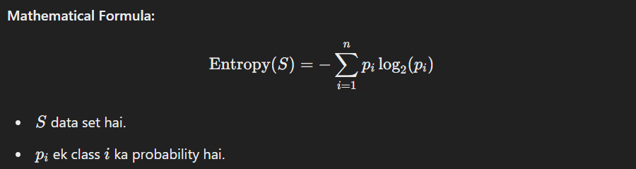

**Example:**
Agar ek dataset mein 50% samples class A ko belong karte hain aur 50% class B ko, toh entropy high hogi, matlab uncertainty zyada hogi. Lekin agar 90% samples class A ko belong karte hain aur 10% class B ko, toh entropy kam hogi, matlab data thoda predictable hai.

#### **Information Gain ka Concept**
Information Gain yeh measure karta hai ki ek feature (jaise, "Age" ya "Income") target variable (jaise, "Buy" ya "No Buy") ko predict karne ke liye kitni additional information provide karta hai. 

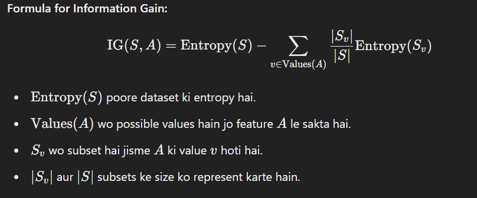

**Explanation of the Formula:**
- **Initial Entropy (\(\text{Entropy}(S)\))**: Poore dataset mein uncertainty ko represent karta hai.
- **Weighted Entropy of Subsets**: Jab hum feature \( A \) ko consider karte hain, toh dataset ko us feature ki different values ke basis par split karte hain. Har subset ki entropy calculate hoti hai aur unko unke size ke hisaab se weight kiya jata hai.
- **Information Gain (\(\text{IG}(S, A)\))**: Poore dataset ki initial entropy se subsets ki weighted entropy ko subtract karte hain. Jitna zyada IG hoga, utna hi zyada feature useful hoga target variable ko predict karne ke liye.

#### **Example for Clarity**
Maan lo ek dataset hai jisme 10 samples hain aur target variable "Play Tennis" hai, jisme 6 samples "Yes" hain aur 4 samples "No".

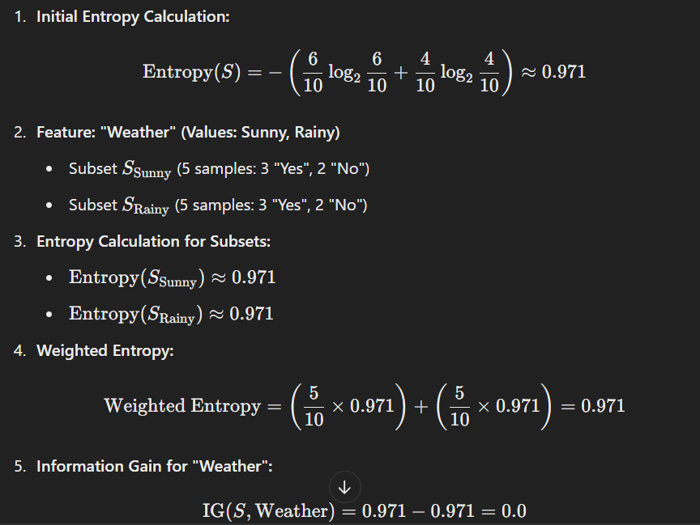

In this case, "Weather" feature ka **Information Gain** 0 hai, matlab yeh feature target variable ke prediction ke liye koi useful information provide nahi karta.

#### **Key Points to Remember**
- **High Information Gain** wale features zyada useful hote hain kyunki yeh target variable ke prediction mein significant information add karte hain.
- **Low or Zero Information Gain** wale features ko consider nahi kiya jata kyunki yeh target variable ke prediction mein koi substantial contribution nahi dete.

Information Gain ka use **Decision Trees** mein hota hai jahan features ko split karne ke liye unki information gain value ko compare kiya jata hai, aur highest information gain wala feature select kiya jata hai.

---

### **1. Information Gain (IG) - Detailed Explanation**

**Information Gain (IG)** is an important technique used in feature selection, especially when you need to choose features for **classification tasks**. It measures how much **information** a feature provides in identifying the target variable, and it is based on the concept of **entropy**.

#### **What is Entropy?**
Entropy is a measure that quantifies the uncertainty or randomness of a dataset. When the data is completely uncertain, its entropy is at its maximum. When the data is more predictable, its entropy is lower.

**Mathematical Formula:**
\[
\text{Entropy}(S) = - \sum_{i=1}^n p_i \log_2(p_i)
\]
- \( S \) is the dataset.
- \( p_i \) is the probability of class \( i \).

**Example:**
If a dataset has 50% of samples belonging to class A and 50% to class B, then the entropy will be high, indicating greater uncertainty. However, if 90% of samples belong to class A and 10% to class B, the entropy will be lower, indicating that the data is more predictable.

#### **Concept of Information Gain**
Information Gain measures how much additional information a feature (e.g., "Age" or "Income") provides in predicting the target variable (e.g., "Buy" or "No Buy").

**Formula for Information Gain:**
\[
\text{IG}(S, A) = \text{Entropy}(S) - \sum_{v \in \text{Values}(A)} \frac{|S_v|}{|S|} \text{Entropy}(S_v)
\]
- \( \text{Entropy}(S) \) is the entropy of the whole dataset.
- \( \text{Values}(A) \) are the possible values that feature \( A \) can take.
- \( S_v \) is the subset of the dataset where feature \( A \) has value \( v \).
- \( |S_v| \) and \( |S| \) represent the sizes of the subsets.

**Explanation of the Formula:**
- **Initial Entropy (\(\text{Entropy}(S)\))**: Represents the uncertainty in the entire dataset.
- **Weighted Entropy of Subsets**: When considering a feature \( A \), the dataset is split based on the different values of \( A \). The entropy of each subset is calculated and weighted by the size of each subset.
- **Information Gain (\(\text{IG}(S, A)\))**: The initial entropy of the dataset minus the weighted entropy of the subsets. The higher the IG, the more useful the feature is for predicting the target variable.

#### **Example for Clarity**
Consider a dataset with 10 samples and the target variable "Play Tennis," where 6 samples are "Yes" and 4 samples are "No."

1. **Initial Entropy Calculation:**
\[
\text{Entropy}(S) = -\left(\frac{6}{10} \log_2 \frac{6}{10} + \frac{4}{10} \log_2 \frac{4}{10}\right) \approx 0.971
\]

2. **Feature: "Weather" (Values: Sunny, Rainy)**
   - Subset \( S_{\text{Sunny}} \) (5 samples: 3 "Yes," 2 "No")
   - Subset \( S_{\text{Rainy}} \) (5 samples: 3 "Yes," 2 "No")

3. **Entropy Calculation for Subsets:**
   - \( \text{Entropy}(S_{\text{Sunny}}) \approx 0.971 \)
   - \( \text{Entropy}(S_{\text{Rainy}}) \approx 0.971 \)

4. **Weighted Entropy:**
\[
\text{Weighted Entropy} = \left(\frac{5}{10} \times 0.971\right) + \left(\frac{5}{10} \times 0.971\right) = 0.971
\]

5. **Information Gain for "Weather":**
\[
\text{IG}(S, \text{Weather}) = 0.971 - 0.971 = 0.0
\]

In this case, the **Information Gain** for the "Weather" feature is 0, meaning that this feature does not provide any useful information for predicting the target variable.

#### **Key Points to Remember**
- **Features with High Information Gain** are more useful because they contribute significant information to predict the target variable.
- **Features with Low or Zero Information Gain** are not considered useful for the target variable's prediction as they do not contribute substantially.

Information Gain is commonly used in **Decision Trees**, where the features are compared based on their information gain values, and the feature with the highest information gain is chosen for splitting the dataset.

---

### **2. Chi-Square Test - Detailed Explanation in Hinglish**

**Chi-Square Test** ek statistical test hai jo do categorical variables ke beech mein sambandh (association) ko check karne ke liye use hota hai. Ye yeh dekhne ke liye hota hai ki kya sample data ka distribution expected distribution se alag hai ya nahi.

#### **Chi-Square Test ke Types**
1. **Chi-Square Goodness of Fit Test**:
   - Ye test use hota hai jab hume yeh dekhna hota hai ki ek categorical variable ek specific distribution ko follow karta hai ya nahi.
   - Isme observed frequency distribution ko known ya hypothesized distribution ke saath compare kiya jata hai.

2. **Chi-Square Test of Independence**:
   - Ye test do categorical variables ke beech mein sambandh check karne ke liye hota hai.
   - Ye dekhta hai ki kya ek variable ka distribution dusre variable ke distribution se independent hai ya nahi.

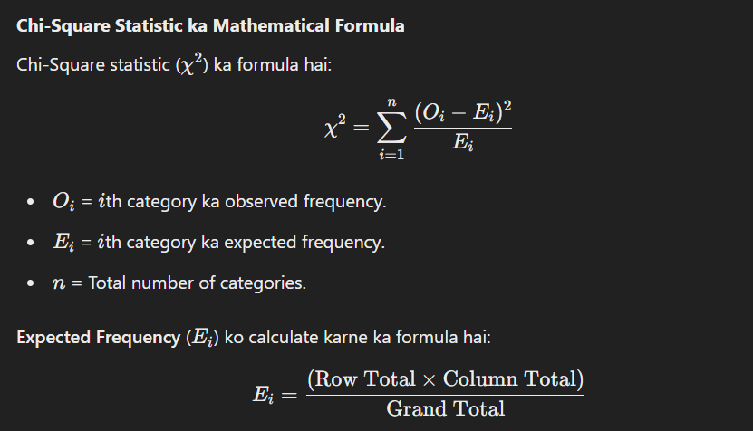

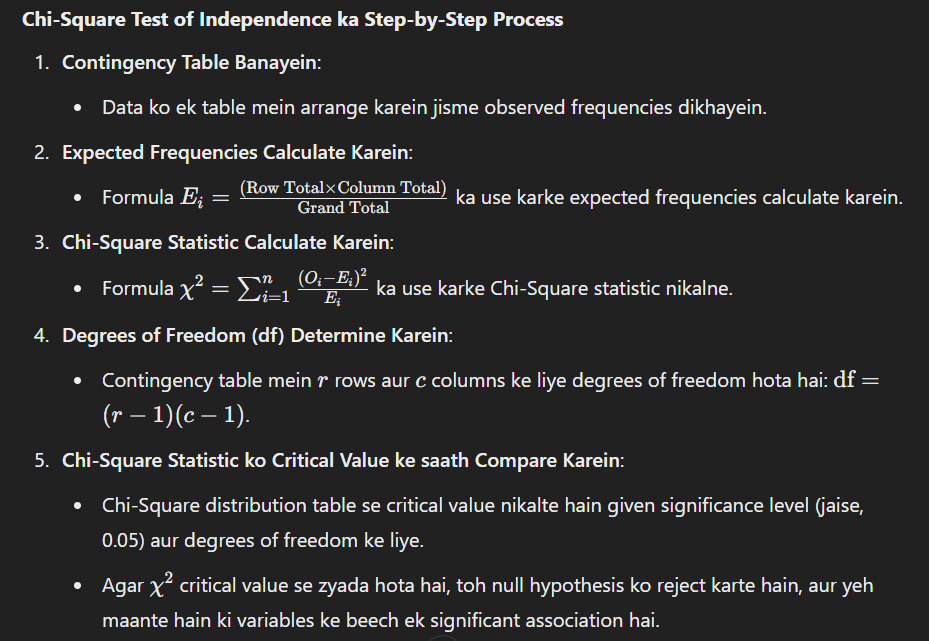

#### **Chi-Square Test of Independence ka Example**
Maan lo ek data hai jisme yeh dekha jata hai ki log coffee ya tea ko gender ke hisaab se prefer karte hain. Table kuch is tarah hai:

|       | Coffee | Tea | Row Total |
|-------|--------|-----|-----------|
| Male  |   30   | 20  |     50    |
| Female|   25   | 25  |     50    |
| Column Total | 55   | 45  |   100     |

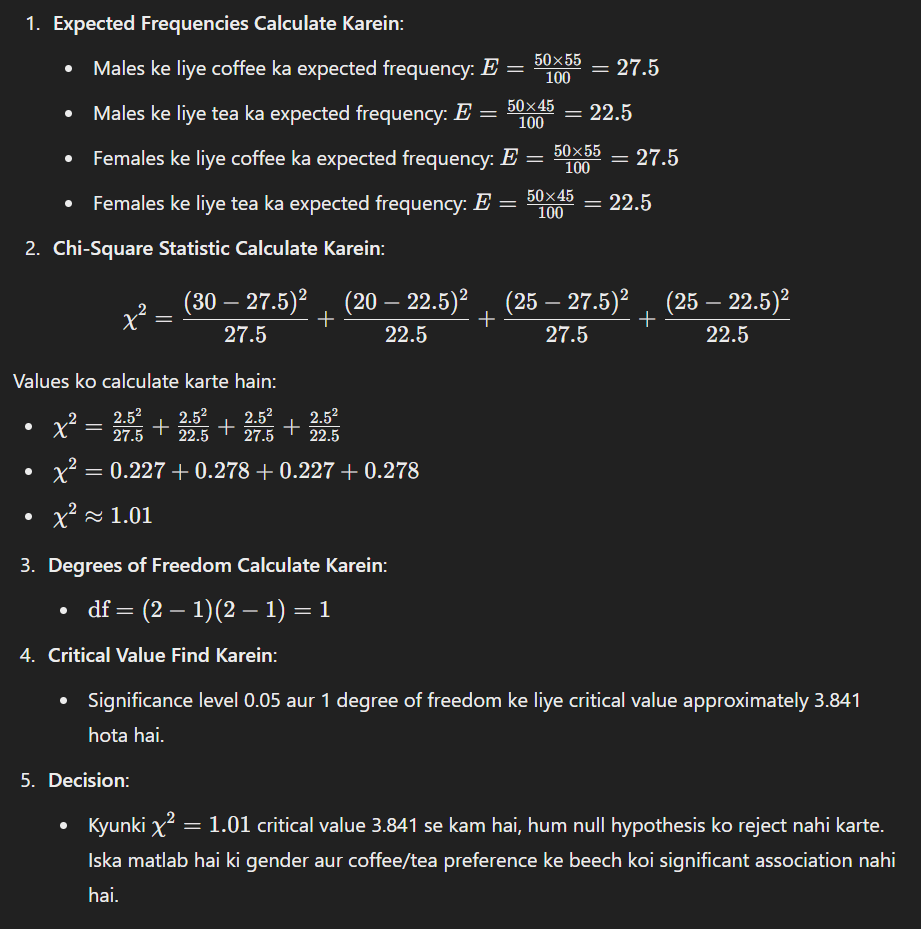

#### **Key Points to Remember**
- **Chi-Square Test** sirf categorical data ke liye use hota hai.
- Sample size kaafi bada hona chahiye (generally, har expected frequency 5 ya usse zyada honi chahiye).
- Ye test relationship ki strength ya direction nahi batata, bas ye dekhta hai ki association hai ya nahi.

**Chi-Square Test** ka use market research, social sciences, aur medical studies mein hota hai jahan categorical data ke basis par variables ke beech associations ko analyze kiya jata hai.

---
### **2. Chi-Square Test - Detailed Explanation**

The **Chi-Square Test** is a statistical test used to determine if there is a significant association between two categorical variables. It helps to test hypotheses about the distribution of sample data across different categories to see if the observed distribution differs from what would be expected by chance.

#### **Types of Chi-Square Tests**
1. **Chi-Square Goodness of Fit Test**:
   - Used to determine if a single categorical variable follows a specific distribution.
   - Compares the observed frequency distribution of a single variable to a known or hypothesized distribution.

2. **Chi-Square Test of Independence**:
   - Used to determine if there is an association between two categorical variables.
   - Analyzes if the distribution of one variable is independent of the distribution of the other.

#### **Mathematical Formula for Chi-Square Test**
The formula for the **Chi-Square statistic** (\(\chi^2\)) is:
\[
\chi^2 = \sum_{i=1}^{n} \frac{(O_i - E_i)^2}{E_i}
\]
- \( O_i \) = Observed frequency for the \( i \)th category.
- \( E_i \) = Expected frequency for the \( i \)th category.
- \( n \) = Number of categories.

**Expected Frequency** (\(E_i\)) is calculated as:
\[
E_i = \frac{(\text{Total of row} \times \text{Total of column})}{\text{Grand Total}}
\]

#### **Steps to Conduct a Chi-Square Test of Independence**
1. **Create a Contingency Table**:
   - Organize data into a table showing the observed frequencies of the variables.

2. **Calculate Expected Frequencies**:
   - Use the formula \( E_i = \frac{(\text{Row Total} \times \text{Column Total})}{\text{Grand Total}} \) for each cell.

3. **Calculate the Chi-Square Statistic**:
   - Use the formula \( \chi^2 = \sum_{i=1}^{n} \frac{(O_i - E_i)^2}{E_i} \).

4. **Determine the Degrees of Freedom (df)**:
   - For a contingency table with \( r \) rows and \( c \) columns, the degrees of freedom are \( \text{df} = (r - 1)(c - 1) \).

5. **Compare the Chi-Square Statistic to the Critical Value**:
   - Use the Chi-Square distribution table to find the critical value for the chosen significance level (e.g., 0.05) and the degrees of freedom.
   - If \( \chi^2 \) exceeds the critical value, the null hypothesis is rejected, indicating a significant association between the variables.

#### **Example of a Chi-Square Test of Independence**
Suppose we have data on whether people prefer coffee or tea based on gender, as shown in the following table:

|       | Coffee | Tea | Row Total |
|-------|--------|-----|-----------|
| Male  |   30   | 20  |     50    |
| Female|   25   | 25  |     50    |
| Column Total | 55   | 45  |   100     |

1. **Calculate Expected Frequencies**:
   - For males preferring coffee: \( E = \frac{50 \times 55}{100} = 27.5 \)
   - For males preferring tea: \( E = \frac{50 \times 45}{100} = 22.5 \)
   - For females preferring coffee: \( E = \frac{50 \times 55}{100} = 27.5 \)
   - For females preferring tea: \( E = \frac{50 \times 45}{100} = 22.5 \)

2. **Calculate the Chi-Square Statistic**:
\[
\chi^2 = \frac{(30 - 27.5)^2}{27.5} + \frac{(20 - 22.5)^2}{22.5} + \frac{(25 - 27.5)^2}{27.5} + \frac{(25 - 22.5)^2}{22.5}
\]

Calculating these values:
- \( \chi^2 = \frac{2.5^2}{27.5} + \frac{2.5^2}{22.5} + \frac{2.5^2}{27.5} + \frac{2.5^2}{22.5} \)
- \( \chi^2 = \frac{6.25}{27.5} + \frac{6.25}{22.5} + \frac{6.25}{27.5} + \frac{6.25}{22.5} \)
- \( \chi^2 = 0.227 + 0.278 + 0.227 + 0.278 \)
- \( \chi^2 \approx 1.01 \)

3. **Determine the Degrees of Freedom**:
   - \( \text{df} = (2-1)(2-1) = 1 \)

4. **Find the Critical Value**:
   - At a significance level of 0.05 and 1 degree of freedom, the critical value is approximately 3.841 (from Chi-Square distribution tables).

5. **Decision**:
   - Since \( \chi^2 = 1.01 \) is less than 3.841, we fail to reject the null hypothesis. This suggests there is no significant association between gender and preference for coffee or tea.

#### **Key Points to Remember**
- The **Chi-Square Test** is only applicable for categorical data.
- It assumes that the sample size is sufficiently large (generally each expected frequency should be 5 or more).
- It does not indicate the strength or direction of the relationship, only whether an association exists.

The **Chi-Square Test** is widely used in fields such as market research, social sciences, and medicine to analyze categorical data and draw conclusions about associations between variables.

---

### **3. Fisher’s Score - Detailed Explanation in Hinglish**

**Fisher’s Score** ek statistical method hai jo feature selection ke liye use hota hai, especially jab aapko high-dimensional data ke saath kaam karna hota hai. Iska main objective yeh hota hai ki yeh dekhna ki ek particular feature target variable ke class ke andar kitna useful hai. Yeh method supervised learning tasks mein use hota hai, jahan aapko classes ke beech discrimination karna hota hai.

#### **Fisher’s Score ka Concept**
Fisher’s Score ek feature ke liye ek numerical value nikalta hai jo yeh batata hai ki wo feature kitna discriminative hai target classes ke beech. Higher Fisher’s Score ka matlab hai ki feature zyada useful hai classes ko differentiate karne ke liye.

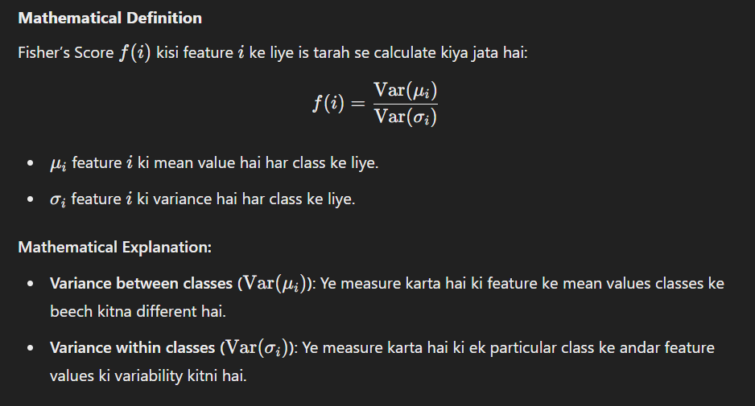

#### **Steps to Calculate Fisher’s Score**
1. **Classes ke liye Mean aur Variance Calculate Karein**:
   - Har class ke liye feature ki mean aur variance nikalna hota hai.
   
2. **Between-Class Variance aur Within-Class Variance Calculate Karein**:
   - Between-class variance calculate karna hota hai jo mean ke differences ko represent karta hai.
   - Within-class variance calculate karna hota hai jo class ke andar data points ki variability ko represent karta hai.

3. **Fisher’s Score Calculate Karein**:
   - Fisher’s Score ka formula 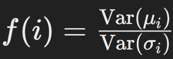 use karke score nikalte hain.

#### **Example for Clarity**
Maan lo ek dataset hai jisme do classes (Class 1 aur Class 2) hain aur ek feature \( X \) hai.

| Sample | Class   | Feature \( X \) |
|--------|---------|-----------------|
| 1      | Class 1 | 2               |
| 2      | Class 1 | 3               |
| 3      | Class 1 | 4               |
| 4      | Class 2 | 10              |
| 5      | Class 2 | 11              |
| 6      | Class 2 | 12              |

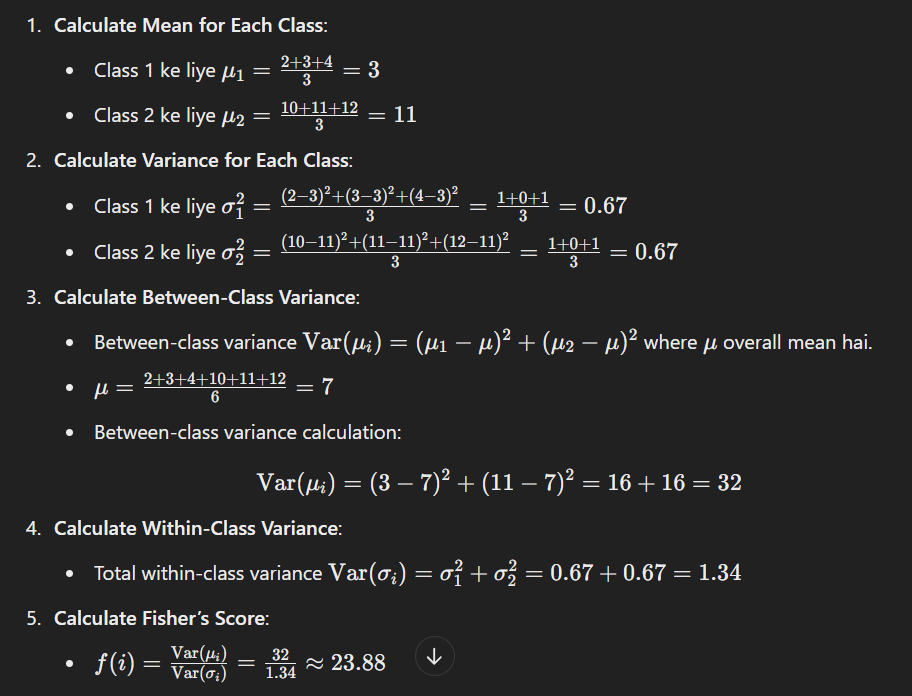

#### **Key Points to Remember**
- **High Fisher’s Score** ka matlab hai ki feature classes ke beech clear differentiation kar raha hai.
- **Low Fisher’s Score** ka matlab hai ki feature classes ko differentiate karne mein kam effective hai.
- Fisher’s Score un features ko select karne mein madad karta hai jo classification problems mein decision making ke liye useful hote hain.

#### **Applications of Fisher’s Score**
- **Feature Selection**: Feature selection ke process mein Fisher’s Score ka use karna data ko simplify karne aur model ko zyada efficient banane ke liye hota hai.
- **Classification Models**: Classification tasks mein Fisher’s Score ko use karke aise features choose kiye jate hain jo classes ke beech clear boundary banate hain.

Is tarah se, Fisher’s Score ek effective technique hai jo aapko feature selection ke process mein madad deta hai taaki aap un features ko choose kar sakein jo aapke target variable ko predict karne ke liye sabse zyada informative hain.

---
### **3. Fisher’s Score - Detailed Explanation**

**Fisher’s Score** is a statistical method used for feature selection, especially when working with high-dimensional data. Its primary objective is to evaluate how useful a particular feature is in distinguishing between classes of the target variable. This method is commonly applied in supervised learning tasks where the goal is to discriminate between different classes.

#### **Concept of Fisher’s Score**
Fisher’s Score assigns a numerical value to a feature, indicating how discriminative it is for the target classes. A higher Fisher’s Score implies that the feature is more effective in differentiating between classes.

#### **Mathematical Definition**
The Fisher’s Score \( f(i) \) for a feature \( i \) is calculated as:
\[
f(i) = \frac{\text{Var}(\mu_i)}{\text{Var}(\sigma_i)}
\]
- \( \mu_i \): Mean value of the feature \( i \) for each class.
- \( \sigma_i \): Variance of the feature \( i \) for each class.

**Explanation:**
- **Variance between classes (\(\text{Var}(\mu_i)\))**: Measures how different the mean values of the feature are between classes.
- **Variance within classes (\(\text{Var}(\sigma_i)\))**: Measures the variability of feature values within a particular class.

#### **Steps to Calculate Fisher’s Score**
1. **Calculate Mean and Variance for Each Class**:
   - Compute the mean and variance of the feature for each class.

2. **Calculate Between-Class and Within-Class Variance**:
   - Calculate the variance between the class means.
   - Calculate the variance of feature values within each class.

3. **Compute Fisher’s Score**:
   - Use the formula \( f(i) = \frac{\text{Var}(\mu_i)}{\text{Var}(\sigma_i)} \) to compute the score for each feature.

#### **Example**
Consider a dataset with two classes (Class 1 and Class 2) and a single feature \( X \):

| Sample | Class   | Feature \( X \) |
|--------|---------|-----------------|
| 1      | Class 1 | 2               |
| 2      | Class 1 | 3               |
| 3      | Class 1 | 4               |
| 4      | Class 2 | 10              |
| 5      | Class 2 | 11              |
| 6      | Class 2 | 12              |

1. **Calculate Mean for Each Class**:
   - \( \mu_1 = \frac{2 + 3 + 4}{3} = 3 \)
   - \( \mu_2 = \frac{10 + 11 + 12}{3} = 11 \)

2. **Calculate Variance for Each Class**:
   - \( \sigma_{1}^2 = \frac{(2-3)^2 + (3-3)^2 + (4-3)^2}{3} = 0.67 \)
   - \( \sigma_{2}^2 = \frac{(10-11)^2 + (11-11)^2 + (12-11)^2}{3} = 0.67 \)

3. **Calculate Between-Class Variance**:
   - Overall mean \( \mu = \frac{2 + 3 + 4 + 10 + 11 + 12}{6} = 7 \)
   - \( \text{Var}(\mu_i) = (3 - 7)^2 + (11 - 7)^2 = 16 + 16 = 32 \)

4. **Calculate Within-Class Variance**:
   - \( \text{Var}(\sigma_i) = \sigma_{1}^2 + \sigma_{2}^2 = 0.67 + 0.67 = 1.34 \)

5. **Calculate Fisher’s Score**:
   - \( f(i) = \frac{\text{Var}(\mu_i)}{\text{Var}(\sigma_i)} = \frac{32}{1.34} \approx 23.88 \)

#### **Key Points to Remember**
- **High Fisher’s Score**: Indicates that the feature is effective at differentiating between classes.
- **Low Fisher’s Score**: Indicates that the feature is less effective for classification.
- Fisher’s Score helps select features that are most useful for decision-making in classification problems.

#### **Applications of Fisher’s Score**
- **Feature Selection**: Simplifies data by selecting the most relevant features, making the model more efficient.
- **Classification Models**: Identifies features that create clear boundaries between classes, improving model performance.

Thus, Fisher’s Score is an effective technique for selecting features that are most informative for predicting the target variable.

---

### 4. **Correlation Coefficient - Hinglish Explanation**

**Correlation Coefficient** ek statistical measure hai jo do variables ke beech linear relationship ko quantify karta hai. Iska kaam yeh dekhna hota hai ki ek variable badhne (ya ghatne) par dusra variable kaise react karta hai.

---

### **Key Points**
- **Notation**: Isko \( r \) se denote karte hain.
- **Range**: \( -1 \) se \( +1 \).
  - \( r = 1 \): Perfect positive linear correlation (dono variables ek saath badhte hain).
  - \( r = -1 \): Perfect negative linear correlation (ek variable badhta hai to dusra ghatta hai).
  - \( r = 0 \): No linear relationship (koi clear pattern nahi hai).

---

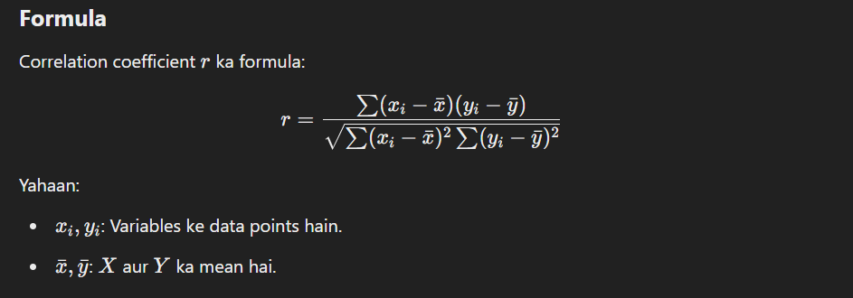

### **Interpretation**
| \( r \) Value           | **Matlab**                                   |
|-------------------------|---------------------------------------------|
| \( 1 \)                | Perfect positive linear relationship        |
| \( 0.7 \leq r < 1 \)    | Strong positive correlation                 |
| \( 0.3 \leq r < 0.7 \)  | Moderate positive correlation               |
| \( 0 < r < 0.3 \)       | Weak positive correlation                   |
| \( 0 \)                | No linear relationship                      |
| \( -0.3 < r < 0 \)      | Weak negative correlation                   |
| \( -0.7 < r \leq -0.3 \)| Moderate negative correlation               |
| \( -1 \leq r \leq -0.7 \)| Strong negative correlation                |
| \( -1 \)               | Perfect negative linear relationship        |

---

### **Calculation Steps**
1. **Mean nikaalo** \( \bar{x} \) aur \( \bar{y} \) ke liye.
2. **Har data point ka mean se difference lo**.
3. **Covariance nikaalo**:
   - Yeh \( X \) aur \( Y \) ki combined variability ko measure karta hai.
4. **Standard deviation calculate karo** \( X \) aur \( Y \) ke liye.
5. **Formula lagao** to get \( r \).

---

### **Example**

Maan lo \( X \) aur \( Y \) ke values yeh hain:

| \( X \) | \( Y \) |
|--------|--------|
| 2      | 3      |
| 4      | 5      |
| 6      | 7      |
| 8      | 9      |

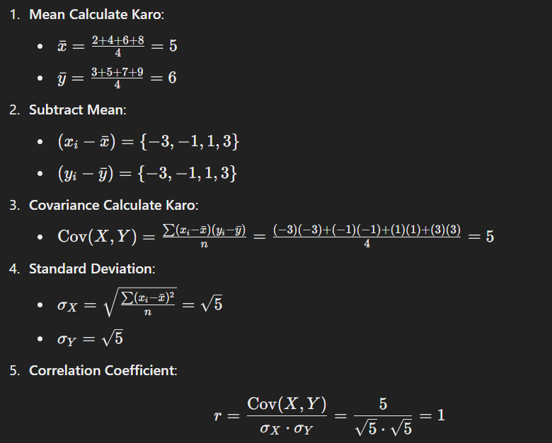


### **Applications**
1. **Data Analysis**: Variables ke relationships explore karne ke liye.
2. **Feature Selection**: Machine learning me aise features choose karne ke liye jo target variable ke saath zyada correlated hain.
3. **Finance**: Stock prices ya economic indicators ke relationships study karne ke liye.

---

### **Note**
- Agar \( r = 0 \), iska matlab yeh nahi ki dono variables independent hain, bas unka linear relation nahi hai.
- Non-linear relationships ke liye **Spearman’s correlation** ya **Kendall’s rank correlation** use karte hain.

---
### **Correlation Coefficient - Explanation**

The **Correlation Coefficient** is a statistical measure that quantifies the strength and direction of the linear relationship between two variables. It helps determine how changes in one variable are associated with changes in another.

---

### **Key Points**
- **Notation**: Represented by \( r \).
- **Range**: \( -1 \) to \( +1 \).
  - \( r = 1 \): Perfect positive linear relationship (both variables increase together).
  - \( r = -1 \): Perfect negative linear relationship (one variable increases while the other decreases).
  - \( r = 0 \): No linear relationship (no clear pattern between variables).

---

### **Formula**
The formula for the correlation coefficient \( r \):

\[
r = \frac{\sum (x_i - \bar{x})(y_i - \bar{y})}{\sqrt{\sum (x_i - \bar{x})^2 \sum (y_i - \bar{y})^2}}
\]

Where:
- \( x_i, y_i \): Individual data points of variables \( X \) and \( Y \).
- \( \bar{x}, \bar{y} \): Mean values of \( X \) and \( Y \).

---

### **Interpretation**
| \( r \) Value           | **Meaning**                               |
|-------------------------|-------------------------------------------|
| \( r = 1 \)             | Perfect positive linear relationship      |
| \( 0.7 \leq r < 1 \)    | Strong positive correlation               |
| \( 0.3 \leq r < 0.7 \)  | Moderate positive correlation             |
| \( 0 < r < 0.3 \)       | Weak positive correlation                 |
| \( r = 0 \)             | No linear relationship                    |
| \( -0.3 < r < 0 \)      | Weak negative correlation                 |
| \( -0.7 < r \leq -0.3 \)| Moderate negative correlation             |
| \( -1 \leq r \leq -0.7 \)| Strong negative correlation              |
| \( r = -1 \)            | Perfect negative linear relationship      |

---

### **Calculation Steps**
1. **Calculate Mean** for \( X \) and \( Y \): Find \( \bar{x} \) and \( \bar{y} \).
2. **Find Deviation from Mean** for each data point.
3. **Calculate Covariance**:
   - Measures the combined variability of \( X \) and \( Y \).
4. **Find Standard Deviation** of \( X \) and \( Y \).
5. **Use the Formula** to calculate \( r \).

---

### **Example**

Let’s consider two variables \( X \) and \( Y \):

| \( X \) | \( Y \) |
|--------|--------|
| 2      | 3      |
| 4      | 5      |
| 6      | 7      |
| 8      | 9      |

1. **Calculate Mean**:
   - \( \bar{x} = \frac{2 + 4 + 6 + 8}{4} = 5 \)
   - \( \bar{y} = \frac{3 + 5 + 7 + 9}{4} = 6 \)

2. **Subtract Mean**:
   - \( (x_i - \bar{x}) = \{-3, -1, 1, 3\} \)
   - \( (y_i - \bar{y}) = \{-3, -1, 1, 3\} \)

3. **Calculate Covariance**:
   - \( \text{Cov}(X, Y) = \frac{\sum (x_i - \bar{x})(y_i - \bar{y})}{n} = \frac{(-3)(-3) + (-1)(-1) + (1)(1) + (3)(3)}{4} = 5 \)

4. **Calculate Standard Deviation**:
   - \( \sigma_X = \sqrt{\frac{\sum (x_i - \bar{x})^2}{n}} = \sqrt{5} \)
   - \( \sigma_Y = \sqrt{5} \)

5. **Calculate Correlation Coefficient**:
   \[
   r = \frac{\text{Cov}(X, Y)}{\sigma_X \cdot \sigma_Y} = \frac{5}{\sqrt{5} \cdot \sqrt{5}} = 1
   \]

---

### **Applications**
1. **Data Analysis**: To explore relationships between variables.
2. **Feature Selection**: Helps in choosing features strongly correlated with the target variable in machine learning.
3. **Finance**: To analyze relationships between stock prices or economic indicators.

---

### **Note**
- If \( r = 0 \), it means no *linear* relationship, but other types of relationships (e.g., non-linear) might exist.
- For non-linear relationships, methods like **Spearman’s correlation** or **Kendall’s rank correlation** can be used.

---

### 5. **Variance Threshold - Explanation (Hinglish)**

**Variance Threshold** ek simple aur effective feature selection technique hai jo machine learning me use hoti hai. Iska purpose low variance wale features ko remove karna hai, kyunki aise features model ke liye zyada useful information nahi dete. Yeh **unsupervised feature selection** ka hissa hai, matlab yeh target variable par depend nahi karta.

---

### **Key Concept**
Variance ek feature ki data ki variability ya spread ko measure karta hai. Low variance wale features ke values zyadatar constant hote hain, aur yeh predictions ya classification ke liye informative nahi hote.

---

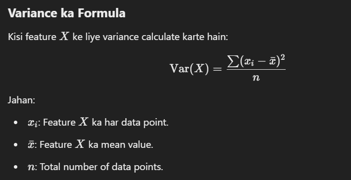

### **Variance Threshold kaise kaam karta hai**
1. Ek **threshold** define karte hain (e.g., 0.01). Jo features is threshold se kam variance rakhte hain, unko remove kar dete hain.
2. High-variance wale features ko rakhte hain, kyunki wo model ke liye zyada informative hote hain.

---

### **Steps to Apply Variance Threshold**
1. **Variance Calculate karo**:
   - Har feature ke liye variance nikalte hain.
2. **Threshold Set karo**:
   - Ek minimum variance value define karte hain (e.g., 0.01).
3. **Features Filter karo**:
   - Jo features threshold se kam variance rakhte hain, unko remove kar dete hain.
4. **Model Train karo**:
   - Filtered feature set ko use karke model train karte hain.

---

### **Example**

#### Dataset:

| Feature 1 | Feature 2 | Feature 3 | Target |
|-----------|-----------|-----------|--------|
| 1         | 10        | 0.1       | A      |
| 1         | 10        | 0.1       | B      |
| 1         | 10        | 0.1       | C      |

#### Variance Calculation:
- Feature 1: \( \text{Var} = 0 \) (no variability).
- Feature 2: \( \text{Var} = 0 \) (no variability).
- Feature 3: \( \text{Var} = 0 \) (no variability).

Agar threshold \( 0.01 \) set kiya hai, toh saare features remove ho jayenge, kyunki unka variance \( < 0.01 \) hai.

---

### **Code Implementation (Python)**

```python
from sklearn.feature_selection import VarianceThreshold

# Sample dataset
data = [[0, 2, 0.1],
        [0, 1, 0.1],
        [0, 1, 0.1]]

# Apply Variance Threshold
selector = VarianceThreshold(threshold=0.01)
reduced_data = selector.fit_transform(data)

print("Original Data:", data)
print("Reduced Data:", reduced_data)
```

---

### **Applications**
1. **Dimensionality Reduction**:
   - Zyada features ko remove karke model ko simple banata hai.
2. **Preprocessing**:
   - Irrelevant ya redundant features ko training se pehle hata deta hai.
3. **Feature Engineering**:
   - Useful aur informative features par focus karne me madad karta hai.

---

### **Key Points**
- **Low-variance features** zyadatar constant values hote hain, jo prediction ya classification ke liye faydemand nahi hote.
- Ek **custom threshold** set karna zaruri hai, jo dataset aur problem ke hisaab se sahi ho.
- **Limitation**: Yeh target variable ko consider nahi karta, toh kabhi-kabhi low-variance features ko remove kar sakta hai jo actually important ho sakte hain.

---
### 5. **Variance Threshold - Explanation**

The **Variance Threshold** is a simple and effective feature selection method used in machine learning. It removes features with low variance because such features provide minimal or no information for making predictions. It is a part of **unsupervised feature selection**, meaning it does not depend on the target variable.

---

### **Key Concept**
Variance measures the spread or variability of data. Features with low variance have almost constant values across samples, which makes them less informative for distinguishing between classes or predicting outcomes.

---

### **Formula for Variance**
For a feature \( X \), variance is calculated as:

\[
\text{Var}(X) = \frac{\sum (x_i - \bar{x})^2}{n}
\]

Where:
- \( x_i \): Individual data points of \( X \).
- \( \bar{x} \): Mean of feature \( X \).
- \( n \): Total number of data points.

---

### **Variance Threshold in Action**
1. Define a **threshold** (e.g., 0.01). Features with variance below this value are removed.
2. High-variance features are retained, as they likely carry more information for model training.

---

### **Steps to Apply Variance Threshold**
1. **Calculate Variance**:
   - Compute the variance for each feature in the dataset.
2. **Set a Threshold**:
   - Define a minimum variance value (e.g., 0.01).
3. **Filter Features**:
   - Remove features with variance below the threshold.
4. **Train the Model**:
   - Use the reduced feature set for training.

---

### **Example**

#### Dataset:

| Feature 1 | Feature 2 | Feature 3 | Target |
|-----------|-----------|-----------|--------|
| 1         | 10        | 0.1       | A      |
| 1         | 10        | 0.1       | B      |
| 1         | 10        | 0.1       | C      |

#### Variance Calculation:
- Feature 1: \( \text{Var} = 0 \) (no variability).
- Feature 2: \( \text{Var} = 0 \) (no variability).
- Feature 3: \( \text{Var} = 0 \) (no variability).

If the threshold is \( 0.01 \), all features would be removed because their variance is \( < 0.01 \).

---

### **Code Implementation (Python)**

```python
from sklearn.feature_selection import VarianceThreshold

# Sample dataset
data = [[0, 2, 0.1],
        [0, 1, 0.1],
        [0, 1, 0.1]]

# Apply Variance Threshold
selector = VarianceThreshold(threshold=0.01)
reduced_data = selector.fit_transform(data)

print("Original Data:", data)
print("Reduced Data:", reduced_data)
```

---

### **Applications**
1. **Dimensionality Reduction**:
   - Helps reduce the number of features, simplifying the model.
2. **Preprocessing**:
   - Removes redundant or irrelevant features before model training.
3. **Feature Engineering**:
   - Focuses on features that carry significant variability in data.

---

### **Key Points**
- Low-variance features often indicate near-constant values, contributing little to prediction or classification.
- A **custom threshold** should be chosen based on the dataset and problem requirements.
- **Limitation**: It doesn’t consider the target variable, so it may remove low-variance features that are actually important for predictions.

---

### **Mean Absolute Difference (MAD) - Explanation (Hinglish)**

**Mean Absolute Difference (MAD)** ek statistical measure hai jo data points ke beech ki average difference ko represent karta hai. Yeh ek aasan aur samajhne me simple measure hai jo data ki variability ya spread ko assess karta hai. MAD ka use kaafi tarikon se kiya jata hai, jaise ki data distribution ki understanding, outliers ko detect karna, aur robust statistics me.

---

### **MAD ka Concept**
MAD ko calculate karne ka basic idea yeh hai ki aap data ke har point ki mean ke sath difference lete hain aur un differences ka absolute value nikalte hain. Phir un absolute differences ka average lete hain.

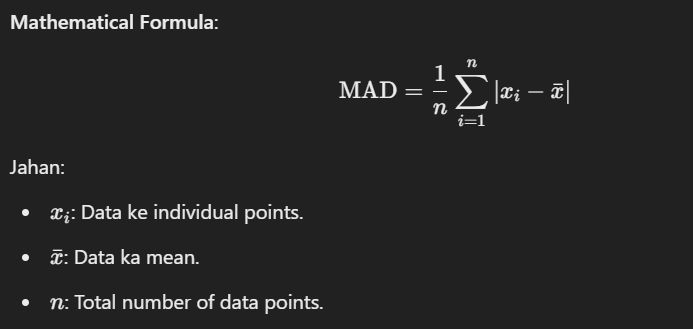

### **Step-by-Step Calculation**
1. **Mean nikalte hain**: Data set ka mean calculate karte hain.
2. **Difference nikalte hain**: Har data point ka mean ke sath difference lete hain.
3. **Absolute value lete hain**: Har difference ka absolute value nikalte hain.
4. **Average lete hain**: Absolute differences ka average lete hain.

---

### **Example for Clarity**
Maan lo ek dataset hai: [3, 7, 8, 5, 12]

1. **Mean Calculate karo**:
   \[
   \bar{x} = \frac{3 + 7 + 8 + 5 + 12}{5} = 7
   \]

2. **Absolute Differences Calculate karo**:
   - \( |3 - 7| = 4 \)
   - \( |7 - 7| = 0 \)
   - \( |8 - 7| = 1 \)
   - \( |5 - 7| = 2 \)
   - \( |12 - 7| = 5 \)

3. **Average of Absolute Differences**:
   \[
   \text{MAD} = \frac{4 + 0 + 1 + 2 + 5}{5} = \frac{12}{5} = 2.4
   \]

**Toh is dataset ka MAD hai 2.4.**

---

### **Key Points**
- **MAD** ek robust measure hai jo outliers ke influence ko kam karta hai. Yeh mean ke comparison me zyada stable hota hai jab data me outliers hote hain.
- **MAD** ka use data distribution ki understanding, data cleaning, aur anomaly detection me hota hai.
- **MAD** aur **Standard Deviation (SD)** me farq hota hai. MAD data ki central tendency ke around average absolute deviation ko measure karta hai, jabki SD square differences ka average leta hai.

---

### **Applications of MAD**
1. **Outlier Detection**: Jab data me outliers hote hain, MAD unhe detect karne me madad karta hai kyunki yeh outliers ko zyada impact nahi deta.
2. **Robust Statistics**: MAD ka use robust statistical models me hota hai jahan data ki spread ko zyada accurately measure karna hota hai.
3. **Data Cleaning**: MAD ka use data cleaning ke process me hota hai taaki un data points ko identify kiya ja sake jo mean ke around significant deviation karte hain.

---

### **Code Implementation (Python)**

```python
import numpy as np

# Sample data
data = [3, 7, 8, 5, 12]

# Calculate Mean Absolute Difference (MAD)
mean = np.mean(data)
mad = np.mean(np.abs(data - mean))

print("Mean Absolute Difference (MAD):", mad)
```

---

### **Key Takeaways**
- **MAD** ek simple aur easy-to-understand measure hai data ki variability ko quantify karne ke liye.
- **Outliers** ko handle karne me MAD ek effective tool hai kyunki yeh unka zyada influence nahi leta.
- **MAD** ko other measures ke sath use karna bhi helpful hota hai, jaise ki **Median Absolute Deviation (MedAD)**, jo median ke around absolute differences ko measure karta hai.

---

### **Mean Absolute Difference (MAD) - Explanation**

**Mean Absolute Difference (MAD)** is a statistical measure that represents the average difference between data points. It is a simple and intuitive measure that helps assess the variability or spread of data. MAD is used in various ways, such as understanding data distribution, detecting outliers, and in robust statistics.

---

### **Concept of MAD**
The basic idea behind calculating MAD is to take the difference between each data point and the mean of the dataset, then take the absolute value of those differences, and finally calculate the average of these absolute differences.

**Mathematical Formula**:
\[
\text{MAD} = \frac{1}{n} \sum_{i=1}^{n} |x_i - \bar{x}|
\]
Where:
- \( x_i \): Individual data points.
- \( \bar{x} \): Mean of the data.
- \( n \): Total number of data points.

---

### **Step-by-Step Calculation**
1. **Calculate the mean**: Find the mean of the dataset.
2. **Find the differences**: Subtract the mean from each data point.
3. **Take the absolute value**: Take the absolute value of each difference.
4. **Calculate the average**: Find the average of the absolute differences.

---

### **Example for Clarity**
Consider the dataset: [3, 7, 8, 5, 12]

1. **Calculate the mean**:
   \[
   \bar{x} = \frac{3 + 7 + 8 + 5 + 12}{5} = 7
   \]

2. **Calculate absolute differences**:
   - \( |3 - 7| = 4 \)
   - \( |7 - 7| = 0 \)
   - \( |8 - 7| = 1 \)
   - \( |5 - 7| = 2 \)
   - \( |12 - 7| = 5 \)

3. **Calculate the average of absolute differences**:
   \[
   \text{MAD} = \frac{4 + 0 + 1 + 2 + 5}{5} = \frac{12}{5} = 2.4
   \]

**So, the MAD for this dataset is 2.4.**

---

### **Key Points**
- **MAD** is a robust measure that is less affected by outliers compared to the mean.
- **MAD** is used to understand data distribution, clean data, and detect anomalies.
- **MAD** and **Standard Deviation (SD)** are different. While SD calculates the average of squared differences from the mean, MAD calculates the average of absolute differences from the mean.

---

### **Applications of MAD**
1. **Outlier Detection**: MAD helps identify outliers as it is less influenced by them.
2. **Robust Statistics**: MAD is used in robust statistical models where a more accurate measure of data spread is needed.
3. **Data Cleaning**: MAD can help identify data points that significantly deviate from the mean.

---

### **Code Implementation (Python)**

```python
import numpy as np

# Sample data
data = [3, 7, 8, 5, 12]

# Calculate Mean Absolute Difference (MAD)
mean = np.mean(data)
mad = np.mean(np.abs(data - mean))

print("Mean Absolute Difference (MAD):", mad)
```

---

### **Key Takeaways**
- **MAD** is a simple and easy-to-understand measure for quantifying data variability.
- It is an effective tool for handling **outliers** as it is less affected by them.
- **MAD** can be used alongside other measures, such as **Median Absolute Deviation (MedAD)**, which measures absolute differences from the median.


---

### 7.**Dispersion Ratio - Explanation in Hinglish**

**Dispersion Ratio** ek statistical measure hai jo dataset ke spread ya variability ko reference value ke saath compare karta hai. Isse hume yeh pata chalta hai ki data points central point (jaise ki mean ya median) ke around kitne spread hain. Yeh ratio quality control, finance, aur research fields mein use hota hai taaki dataset ki dispersion ko samjha ja sake.

---

### **Dispersion Ratio ka Concept**
**Dispersion Ratio** variance aur dataset ke average (mean) ka ratio hota hai. Iska use karke hume yeh samajhne ko milta hai ki data ka spread mean ke comparison mein kitna zyada hai. Agar ratio zyada hoga, toh iska matlab hai ki dataset mein zyada variability hai.

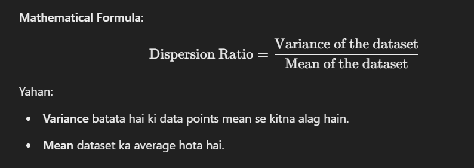

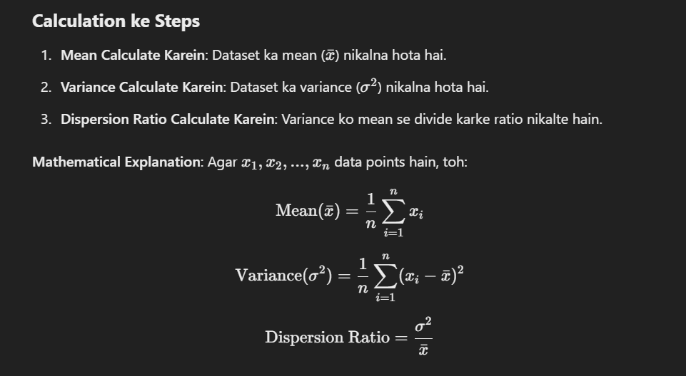

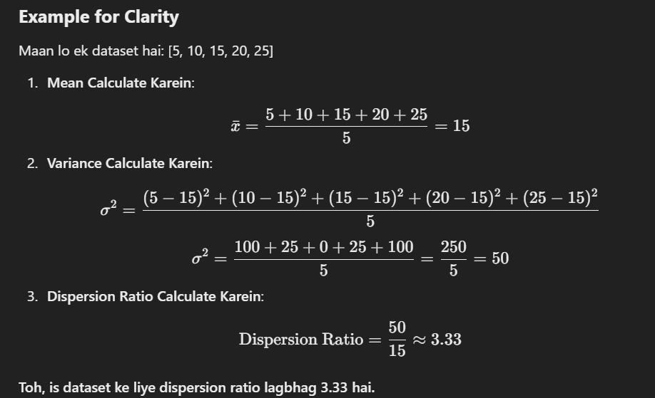
**Toh, is dataset ke liye dispersion ratio lagbhag 3.33 hai.**

---

### **Key Points**
- **High Dispersion Ratio** ka matlab hai ki data points mean se kaafi door hain, yaani dataset mein zyada variability hai.
- **Low Dispersion Ratio** ka matlab hai ki data points mean ke paas hain, yaani dataset mein kam variability hai.
- **Interpretation**: Dispersion ratio hume alag-alag datasets ke spread ko compare karne mein madad karta hai.

---

### **Dispersion Ratio ke Applications**
1. **Quality Control**: Manufacturing ya production mein, product measurements ki variability ko assess karne ke liye dispersion ratio use hota hai.
2. **Financial Analysis**: Finance mein, kisi investment ke risk ya volatility ko measure karne ke liye is ratio ka use hota hai.
3. **Data Analysis**: Data ke spread ko samajhne aur decision making mein madad milti hai.

---

### **Code Implementation (Python)**
```python
import numpy as np

# Sample data
data = [5, 10, 15, 20, 25]

# Mean aur variance calculate karein
mean = np.mean(data)
variance = np.var(data)

# Dispersion Ratio calculate karein
dispersion_ratio = variance / mean

print("Dispersion Ratio:", dispersion_ratio)
```

---

### **Key Takeaways**
- **Dispersion Ratio** hume yeh batata hai ki dataset ka spread mean ke comparison mein kitna zyada hai.
- Yeh metric alag-alag datasets ko compare karne ke liye kaafi useful hota hai.
- **High values** indicate karte hain zyada spread, jabki **low values** indicate karte hain kam spread.


---

### **Dispersion Ratio - Explanation**

**Dispersion Ratio** is a statistical measure that quantifies the spread or variability of a dataset relative to a reference value. It provides insight into how data points are distributed around a central point, such as the mean or median. This ratio is often used in quality control, finance, and various research fields to understand the degree of dispersion in a dataset.

---

### **Concept of Dispersion Ratio**
The **Dispersion Ratio** is the ratio of the variance of a dataset to the average value of the dataset. It gives an idea of how much the data varies in relation to its mean. A higher dispersion ratio indicates a higher spread of data relative to the mean, suggesting more variability in the dataset.

**Mathematical Formula**:
\[
\text{Dispersion Ratio} = \frac{\text{Variance of the dataset}}{\text{Mean of the dataset}}
\]

Where:
- **Variance** is a measure of how much the data points differ from the mean.
- **Mean** is the average of the dataset.

---

### **Step-by-Step Calculation**
1. **Calculate the mean**: Find the mean (\(\bar{x}\)) of the dataset.
2. **Calculate the variance**: Find the variance (\(\sigma^2\)) of the dataset.
3. **Calculate the dispersion ratio**: Divide the variance by the mean.

**Mathematical Explanation**:
If \(x_1, x_2, ..., x_n\) are the data points in the dataset, then:
\[
\text{Mean} (\bar{x}) = \frac{1}{n} \sum_{i=1}^{n} x_i
\]
\[
\text{Variance} (\sigma^2) = \frac{1}{n} \sum_{i=1}^{n} (x_i - \bar{x})^2
\]
\[
\text{Dispersion Ratio} = \frac{\sigma^2}{\bar{x}}
\]

---

### **Example for Clarity**
Consider the dataset: [5, 10, 15, 20, 25]

1. **Calculate the mean**:
   \[
   \bar{x} = \frac{5 + 10 + 15 + 20 + 25}{5} = 15
   \]

2. **Calculate the variance**:
   \[
   \sigma^2 = \frac{(5-15)^2 + (10-15)^2 + (15-15)^2 + (20-15)^2 + (25-15)^2}{5}
   \]
   \[
   \sigma^2 = \frac{100 + 25 + 0 + 25 + 100}{5} = \frac{250}{5} = 50
   \]

3. **Calculate the dispersion ratio**:
   \[
   \text{Dispersion Ratio} = \frac{50}{15} \approx 3.33
   \]

**So, the dispersion ratio for this dataset is approximately 3.33.**

---

### **Key Points**
- **High Dispersion Ratio**: Indicates that the data points are spread out significantly from the mean, showing high variability.
- **Low Dispersion Ratio**: Indicates that the data points are close to the mean, showing low variability.
- **Interpretation**: The dispersion ratio helps compare the degree of dispersion between different datasets.

---

### **Applications of Dispersion Ratio**
1. **Quality Control**: In manufacturing and production, the dispersion ratio can be used to assess the variability of product measurements.
2. **Financial Analysis**: In finance, it can be used to measure the risk or volatility of an investment by comparing the variance of returns to the average return.
3. **Data Analysis**: Helps in understanding the spread of data and making decisions based on the variability of the data.

---

### **Code Implementation (Python)**
```python
import numpy as np

# Sample data
data = [5, 10, 15, 20, 25]

# Calculate mean and variance
mean = np.mean(data)
variance = np.var(data)

# Calculate Dispersion Ratio
dispersion_ratio = variance / mean

print("Dispersion Ratio:", dispersion_ratio)
```

---

### **Key Takeaways**
- The **Dispersion Ratio** provides a quick assessment of how spread out a dataset is in relation to its mean.
- It's a useful metric for understanding variability and comparing different datasets.
- **High values** of the ratio indicate greater dispersion relative to the mean, while **low values** indicate less dispersion.

---

### **Mutual Dependence - Explanation in Hinglish**

**Mutual Dependence** ek concept hai jo do ya zyada variables ke beech ke relationship ko measure karta hai. Iska main objective yeh hota hai ki yeh dekha ja sake ki ek variable ke change hone par dusre variable par kya asar padta hai. Is concept ka use data analysis, probability theory, aur machine learning mein hota hai taaki variables ke beech ke interdependence ko samjha ja sake.

---

### **Mutual Dependence ka Concept**
**Mutual Dependence** ko samajhne ke liye hume **dependence** aur **independence** ke concepts samajhne honge:
- **Independent Variables** wo hote hain jinmein ek variable ka dusre par koi asar nahi hota.
- **Dependent Variables** wo hote hain jo kisi dusre variable ke change hone par effect hote hain.

**Mutual Dependence** ek aisi situation ko describe karta hai jahan do variables ek dusre ke sath interrelated hote hain. Iska matlab hai ki ek variable ke changes dusre variable par asar daal sakte hain aur vice versa.

### **Mathematical Representation**
Mutual Dependence ko formally define karne ke liye **mutual information** ka concept use hota hai, jo probability theory se aata hai. 

**Mutual Information (I(X;Y))** ka formula:
\[
I(X;Y) = \sum_{x \in X} \sum_{y \in Y} P(x, y) \log \left(\frac{P(x, y)}{P(x)P(y)}\right)
\]

- **P(x, y)**: Joint probability distribution of X and Y.
- **P(x)** aur **P(y)**: Marginal probability distributions of X and Y.

**Interpretation**:
- **High Mutual Information**: Agar mutual information ki value zyada hai, toh iska matlab hai ki do variables ke beech strong dependency hai.
- **Low Mutual Information**: Agar mutual information ki value kam hai, toh iska matlab hai ki do variables ke beech weak ya koi dependency nahi hai.

---

### **Example for Clarity**
Maan lo ek simple example hai jisme hum do variables X aur Y lete hain:
- **X**: Temperature (Celsius)
- **Y**: Ice Cream Sales

Agar temperature zyada hota hai, toh ice cream sales bhi zyada hoti hai. Iska matlab hai ki temperature aur ice cream sales ke beech ek strong mutual dependence hai. Is situation mein, mutual information high hogi, jo yeh batayegi ki temperature aur sales ek doosre se dependent hain.

---

### **Applications of Mutual Dependence**
1. **Feature Selection in Machine Learning**: Jab feature selection karte hain, toh mutual information ka use karke un features ko select kiya jata hai jo target variable ke liye zyada informative hote hain.
2. **Data Analysis**: Data ke relationship ko samajhne ke liye, mutual information ka use karke variables ke beech ke hidden patterns ko identify kiya jata hai.
3. **Communication Systems**: Mutual information ka use signal processing aur communication systems mein kiya jata hai, jahan yeh measure karta hai ki transmitter aur receiver ke beech data kitna effectively share ho raha hai.

---

### **Code Implementation (Python)**
Python mein **mutual information** calculate karne ke liye `scikit-learn` library ka use kiya ja sakta hai.

```python
from sklearn.feature_selection import mutual_info_classif
import numpy as np

# Sample data
X = np.array([[1, 2, 3], [4, 5, 6], [7, 8, 9]])  # Features
y = np.array([0, 1, 0])  # Target variable

# Mutual information calculate karein
mutual_info = mutual_info_classif(X, y, discrete_features=True)

print("Mutual Information:", mutual_info)
```

**Output**: Mutual information ki value aapko batayegi ki feature aur target variable ke beech ka mutual dependence kitna hai.

---

### **Key Points**
- **High Mutual Dependence** ka matlab hai ki do variables ek doosre ke sath strongly dependent hain.
- **Low Mutual Dependence** ka matlab hai ki do variables ke beech weak ya koi dependency nahi hai.
- **Mutual Information** ek powerful tool hai data analysis aur feature selection ke liye, kyunki yeh hidden relationships ko capture karta hai.

**Conclusion**: Mutual dependence ya mutual information ka use karke hum variables ke beech ke relationship ko samajh sakte hain aur data-driven decisions le sakte hain.

---

### **Mutual Dependence - Explanation in Hinglish**

**Mutual Dependence** ek concept hai jo do ya zyada variables ke beech ke relationship ko measure karta hai. Iska main objective yeh hota hai ki yeh dekha ja sake ki ek variable ke change hone par dusre variable par kya asar padta hai. Is concept ka use data analysis, probability theory, aur machine learning mein hota hai taaki variables ke beech ke interdependence ko samjha ja sake.

---

### **Mutual Dependence ka Concept**
**Mutual Dependence** ko samajhne ke liye hume **dependence** aur **independence** ke concepts samajhne honge:
- **Independent Variables** wo hote hain jinmein ek variable ka dusre par koi asar nahi hota.
- **Dependent Variables** wo hote hain jo kisi dusre variable ke change hone par effect hote hain.

**Mutual Dependence** ek aisi situation ko describe karta hai jahan do variables ek dusre ke sath interrelated hote hain. Iska matlab hai ki ek variable ke changes dusre variable par asar daal sakte hain aur vice versa.

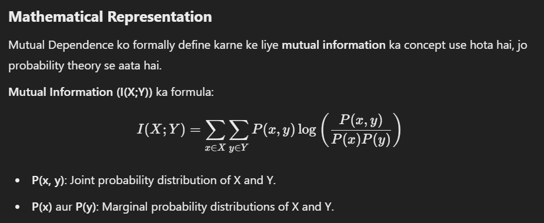

**Interpretation**:
- **High Mutual Information**: Agar mutual information ki value zyada hai, toh iska matlab hai ki do variables ke beech strong dependency hai.
- **Low Mutual Information**: Agar mutual information ki value kam hai, toh iska matlab hai ki do variables ke beech weak ya koi dependency nahi hai.

---

### **Example for Clarity**
Maan lo ek simple example hai jisme hum do variables X aur Y lete hain:
- **X**: Temperature (Celsius)
- **Y**: Ice Cream Sales

Agar temperature zyada hota hai, toh ice cream sales bhi zyada hoti hai. Iska matlab hai ki temperature aur ice cream sales ke beech ek strong mutual dependence hai. Is situation mein, mutual information high hogi, jo yeh batayegi ki temperature aur sales ek doosre se dependent hain.

---

### **Applications of Mutual Dependence**
1. **Feature Selection in Machine Learning**: Jab feature selection karte hain, toh mutual information ka use karke un features ko select kiya jata hai jo target variable ke liye zyada informative hote hain.
2. **Data Analysis**: Data ke relationship ko samajhne ke liye, mutual information ka use karke variables ke beech ke hidden patterns ko identify kiya jata hai.
3. **Communication Systems**: Mutual information ka use signal processing aur communication systems mein kiya jata hai, jahan yeh measure karta hai ki transmitter aur receiver ke beech data kitna effectively share ho raha hai.

---

### **Code Implementation (Python)**
Python mein **mutual information** calculate karne ke liye `scikit-learn` library ka use kiya ja sakta hai.

```python
from sklearn.feature_selection import mutual_info_classif
import numpy as np

# Sample data
X = np.array([[1, 2, 3], [4, 5, 6], [7, 8, 9]])  # Features
y = np.array([0, 1, 0])  # Target variable

# Mutual information calculate karein
mutual_info = mutual_info_classif(X, y, discrete_features=True)

print("Mutual Information:", mutual_info)
```

**Output**: Mutual information ki value aapko batayegi ki feature aur target variable ke beech ka mutual dependence kitna hai.

---

### **Key Points**
- **High Mutual Dependence** ka matlab hai ki do variables ek doosre ke sath strongly dependent hain.
- **Low Mutual Dependence** ka matlab hai ki do variables ke beech weak ya koi dependency nahi hai.
- **Mutual Information** ek powerful tool hai data analysis aur feature selection ke liye, kyunki yeh hidden relationships ko capture karta hai.

**Conclusion**: Mutual dependence ya mutual information ka use karke hum variables ke beech ke relationship ko samajh sakte hain aur data-driven decisions le sakte hain.

---

### **Mutual Dependence - Explanation in English**

**Mutual Dependence** is a concept that measures the relationship between two or more variables. Its primary purpose is to understand how a change in one variable affects another variable. This concept is widely used in data analysis, probability theory, and machine learning to understand the interdependence between variables.

---

### **Concept of Mutual Dependence**
To understand **Mutual Dependence**, we need to first grasp the concepts of **dependence** and **independence**:
- **Independent Variables** are those where one variable does not affect the other.
- **Dependent Variables** are those that are influenced by changes in another variable.

**Mutual Dependence** describes a situation where two variables are interrelated, meaning that a change in one variable can influence the other and vice versa.

### **Mathematical Representation**
Mutual Dependence is formally defined using the concept of **mutual information**, which comes from probability theory.

**Mutual Information (I(X;Y))** is calculated using the following formula:
\[
I(X;Y) = \sum_{x \in X} \sum_{y \in Y} P(x, y) \log \left(\frac{P(x, y)}{P(x)P(y)}\right)
\]

- **P(x, y)**: Joint probability distribution of X and Y.
- **P(x)** and **P(y)**: Marginal probability distributions of X and Y.

**Interpretation**:
- **High Mutual Information**: Indicates a strong dependency between the two variables.
- **Low Mutual Information**: Indicates a weak or no dependency between the two variables.

---

### **Example for Clarity**
Consider a simple example where we have two variables, X and Y:
- **X**: Temperature (in Celsius)
- **Y**: Ice Cream Sales

If the temperature rises, ice cream sales also increase. This implies a strong mutual dependence between temperature and ice cream sales. In this case, the mutual information would be high, indicating a significant dependency between the two variables.

---

### **Applications of Mutual Dependence**
1. **Feature Selection in Machine Learning**: Mutual information is used to select features that are most informative for the target variable.
2. **Data Analysis**: Mutual information can help identify hidden relationships between variables.
3. **Communication Systems**: In signal processing and communication systems, mutual information measures how effectively data is shared between a transmitter and receiver.

---

### **Code Implementation (Python)**
To calculate **mutual information** in Python, the `scikit-learn` library can be used.

```python
from sklearn.feature_selection import mutual_info_classif
import numpy as np

# Sample data
X = np.array([[1, 2, 3], [4, 5, 6], [7, 8, 9]])  # Features
y = np.array([0, 1, 0])  # Target variable

# Calculate mutual information
mutual_info = mutual_info_classif(X, y, discrete_features=True)

print("Mutual Information:", mutual_info)
```

**Output**: The mutual information value indicates the level of mutual dependence between the features and the target variable.

---

### **Key Points**
- **High Mutual Dependence** means that the two variables are strongly dependent on each other.
- **Low Mutual Dependence** means there is weak or no relationship between the two variables.
- **Mutual Information** is a powerful tool for data analysis and feature selection as it captures hidden relationships between variables.

**Conclusion**: Mutual dependence or mutual information helps us understand the relationships between variables and enables data-driven decision-making.

---
### **Relief Algorithm - Detailed Explanation in Hinglish**

**Relief** ek feature selection algorithm hai jo feature ke importance ko evaluate karta hai, aur yeh dekhne mein madad karta hai ki kaunsa feature instances ko ek dusre se alag karne mein kitna effective hai. Yeh algorithm un scenarios mein kaafi useful hota hai jab aapko high-dimensional data ke saath kaam karna hota hai. Yeh continuous aur discrete data types dono ko handle kar sakta hai.

### **Relief Algorithm Ka Concept**
Relief algorithm ka main idea yeh hai ki yeh measure karta hai ki ek feature instances ke beech kitna acha differentiation kar raha hai, jo same class label ke hain aur jo different class labels ke hain. Algorithm har step mein ek instance ko select karta hai aur uske nearest neighbors ke saath compare karke feature weights ko update karta hai.

### **Relief Algorithm Kaise Kaam Karta Hai**
1. **Initialization**: Dataset ke saath start karte hain aur har feature ko initial weight 0 dete hain.
2. **Random Instance Select Karein**: Dataset se ek random instance \( x \) choose karte hain.
3. **Nearest Neighbors Dhundein**:
   - **Nearest Hit**: Us instance \( x' \) ko dhundhte hain jo \( x \) ke same class label ka ho (i.e., \( x' \) similar hai \( x \) ke).
   - **Nearest Miss**: Us instance \( x'' \) ko dhundhte hain jo \( x \) ke different class label ka ho (i.e., \( x'' \) different hai \( x \) se).
4. **Feature Weights Update Karein**:
   - **Nearest Hit ke liye**: Un features ke weight ko increase karte hain jo \( x \) aur \( x' \) ke beech similar hote hain.
   - **Nearest Miss ke liye**: Un features ke weight ko decrease karte hain jo \( x \) aur \( x'' \) ke beech different hote hain.
5. **Repeat**: Ye process multiple iterations ke liye repeat karte hain ya jab tak weights converge na ho jayein.
6. **Weights Normalize Karein**: Feature weights ko normalize karte hain taaki unhe interpret karna aur compare karna asaan ho.

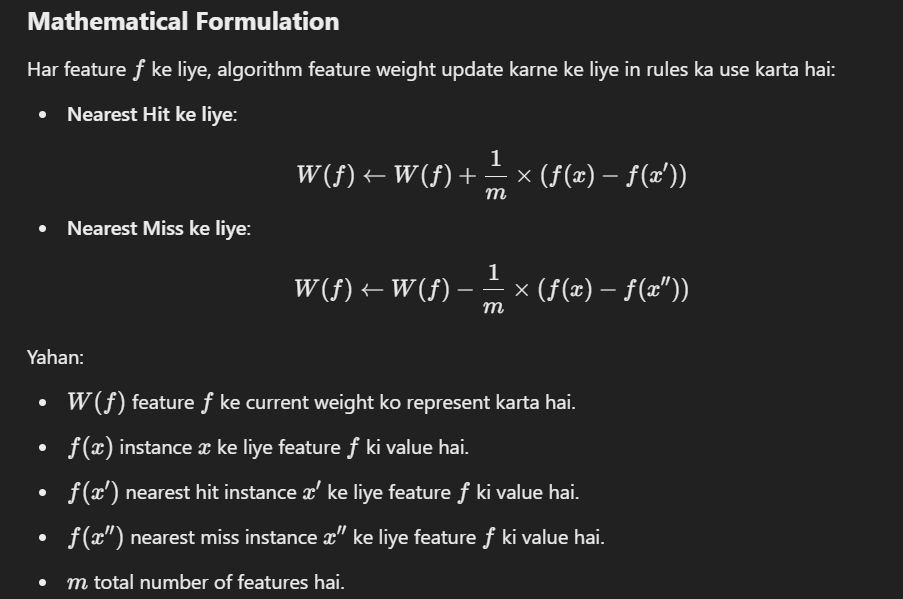

### **Important Points to Remember**
- **Relief algorithm continuous aur discrete features dono ke saath kaam kar sakta hai**, jo ise alag-alag types ke datasets ke liye suitable banata hai.
- **Algorithm ko achhe results ke liye kaafi iterations ki zarurat hoti hai**.
- **Relief algorithm noisy data ke liye thoda sensitive hota hai**, isliye data ko preprocess karna useful hota hai.

### **Relief Algorithm Ke Applications**
1. **Machine Learning Mein Feature Selection**: Relief algorithm feature selection ke process mein madad karta hai, jisse aap un features ko select kar sakte hain jo model ko improve karte hain aur computational complexity ko reduce karte hain.
2. **Classification Problems**: Classification tasks mein yeh help karta hai ki aap un features ko identify kar sakein jo instances ko alag karne mein sabse zyada effective hain.
3. **Data Preprocessing**: Feature engineering ke process mein Relief algorithm ka use hota hai taaki aap irrelevant features ko hata sakein aur important features ko retain kar sakein.

### **Code Implementation (Python)**
Python mein `skfeature` library ka use karke Relief algorithm apply kiya ja sakta hai.

```python
from skfeature.feature_selection import relief
import numpy as np

# Sample data
X = np.array([[1, 2, 3], [4, 5, 6], [7, 8, 9], [1, 3, 5], [4, 6, 8]])  # Feature matrix
y = np.array([0, 1, 0, 1, 0])  # Target variable

# Apply Relief algorithm
feature_weights = relief.relief(X, y, n_neighbors=3)

# Print feature weights
print("Feature Weights:", feature_weights)
```

**Output**: Yeh code feature weights ko print karega, jo yeh batayega ki kaunse features classification task ke liye sabse zyada informative hain.

### **Relief Algorithm Ke Key Advantages**
- **Complex datasets ke liye kaafi useful**: Relief algorithm large number of features ke saath kaam kar sakta hai.
- **Feature importance scores provide karta hai**: Yeh aapko batata hai ki kaunse features aapke classification task ke liye sabse zyada helpful hain.
- **Unsupervised versions available hain**: Relief ko unsupervised learning tasks ke liye bhi extend kiya ja sakta hai.

### **Conclusion**
**Relief algorithm** ek powerful aur intuitive method hai feature selection ke liye. Yeh instances ke beech similarity aur dissimilarity ko analyze karke important features ko highlight karta hai, jisse aapke machine learning models ki performance aur efficiency improve hoti hai.

---

### **Relief Algorithm - Detailed Explanation in English**

**Relief** is a feature selection algorithm that identifies the importance of features by evaluating how well they distinguish between instances that are similar and those that are dissimilar. It is particularly useful in scenarios where you need to identify relevant features from high-dimensional data. The algorithm can handle both continuous and discrete data types.

### **Concept of Relief**
The main idea behind the Relief algorithm is to measure how well a feature can distinguish between instances that are close to each other (i.e., instances with the same class label) and instances that are different (i.e., instances with different class labels). The algorithm works by iteratively selecting a sample and comparing it to its nearest neighbors to update the weights assigned to each feature.

### **How the Relief Algorithm Works**
1. **Initialization**: Start with a dataset and assign an initial weight of zero to each feature.
2. **Randomly Select an Instance**: Choose a random instance \( x \) from the dataset.
3. **Find Nearest Neighbors**:
   - **Nearest Hit**: Find the nearest instance \( x' \) that has the same class label as \( x \) (i.e., \( x' \) is similar to \( x \)).
   - **Nearest Miss**: Find the nearest instance \( x'' \) that has a different class label from \( x \) (i.e., \( x'' \) is dissimilar to \( x \)).
4. **Update Feature Weights**:
   - Increase the weight for features that are similar between \( x \) and \( x' \) (the nearest hit).
   - Decrease the weight for features that are different between \( x \) and \( x'' \) (the nearest miss).
5. **Repeat**: Repeat the process for a number of iterations or until convergence.
6. **Normalize Weights**: Normalize the feature weights so that they are easier to interpret and compare.

### **Mathematical Formulation**
For each feature \( f \), the algorithm updates its weight based on the following rules:

- **For nearest hits**:
  \[
  W(f) \leftarrow W(f) + \frac{1}{m} \times (f(x) - f(x'))
  \]

- **For nearest misses**:
  \[
  W(f) \leftarrow W(f) - \frac{1}{m} \times (f(x) - f(x''))
  \]

Where:
- \( W(f) \) is the current weight for feature \( f \).
- \( f(x) \) is the value of feature \( f \) for instance \( x \).
- \( f(x') \) is the value of feature \( f \) for the nearest hit instance \( x' \).
- \( f(x'') \) is the value of feature \( f \) for the nearest miss instance \( x'' \).
- \( m \) is the total number of features.

### **Key Points to Remember**
- **Relief can handle both continuous and discrete features**, making it flexible for different types of datasets.
- **The algorithm requires a sufficient number of iterations** to ensure feature weights converge to meaningful values.
- **Relief is sensitive to noisy data**, so it is often a good idea to preprocess the data to reduce noise.

### **Applications of the Relief Algorithm**
1. **Feature Selection in Machine Learning**: Relief is used to select the most relevant features that can help improve the performance of a machine learning model by reducing overfitting and computational complexity.
2. **Classification Problems**: By identifying the most discriminative features, Relief helps in building better classification models.
3. **Data Preprocessing**: Relief is used in feature engineering to identify and retain the most informative features while discarding irrelevant ones.

### **Code Implementation (Python)**
In Python, the `skfeature` library can be used to apply the Relief algorithm for feature selection.

```python
from skfeature.feature_selection import relief
import numpy as np

# Sample data
X = np.array([[1, 2, 3], [4, 5, 6], [7, 8, 9], [1, 3, 5], [4, 6, 8]])  # Feature matrix
y = np.array([0, 1, 0, 1, 0])  # Target variable

# Apply Relief algorithm
feature_weights = relief.relief(X, y, n_neighbors=3)

# Print feature weights
print("Feature Weights:", feature_weights)
```

**Output**: The output will display the weights for each feature, showing which features are the most informative for distinguishing between instances in the dataset.

### **Key Advantages of the Relief Algorithm**
- **Works well with complex datasets**: Relief can effectively handle datasets with a large number of features.
- **Provides feature importance scores**: This helps in identifying features that contribute the most to the classification task.
- **Unsupervised versions available**: Relief can be extended to unsupervised learning tasks as well.

### **Conclusion**
The **Relief algorithm** is a powerful and intuitive method for feature selection that works well in distinguishing between similar and dissimilar instances in a dataset. It helps to highlight the most relevant features for predictive modeling, which can significantly improve the performance and efficiency of machine learning models.

---
---

## Wrapper methods 

Wrapper methods, also referred to as greedy algorithms train the algorithm by using a subset of features in an iterative manner. Based on the conclusions made from training in prior to the model, addition and removal of features takes place. Stopping criteria for selecting the best subset are usually pre-defined by the person training the model such as when the performance of the model decreases or a specific number of features has been achieved. The main advantage of wrapper methods over the filter methods is that they provide an optimal set of features for training the model, thus resulting in better accuracy than the filter methods but are computationally more expensive.


### Wrapper Methods - Hinglish Mein Samjhayein

Wrapper methods ko **greedy algorithms** bhi kaha jata hai. Ye methods ek subset of features ka use karke model ko train karte hain aur har step par features ko add ya remove karte hain based on model ki performance. Is process ke liye kuch pre-defined stopping criteria hoti hain, jaise ki jab model ki performance girne lage ya jab ek specific number of features achieve kar liye jayein.

### Wrapper Methods Ke Advantages
- **Better Accuracy**: Wrapper methods filter methods ke comparison mein better accuracy provide karte hain kyunki yeh model-specific hoti hain, matlab model ki performance ko improve karne ke liye features select kiye jate hain.
- **Optimal Feature Set**: Yeh ek optimal feature subset dete hain jisse model ka performance enhance hota hai.

Lekin, **wrapper methods** computationally expensive hote hain kyunki har possible subset ka training karna padta hai, jo processing time aur resources kaafi zyada use karta hai.

### Wrapper Methods Ki Techniques
Yahan kuch common wrapper techniques hain:

1. **Forward Selection**:
   - **Process**: Is method mein initially ek empty feature set hota hai. Har iteration mein ek feature add kiya jata hai jo model ki performance sabse zyada improve karta hai.
   - **Stopping Criterion**: Jab ek feature add karne se model ki performance improve nahi hoti, tab yeh process ruk jata hai.

2. **Backward Elimination**:
   - **Process**: Is method mein initial feature set mein sabhi features included hote hain. Har iteration mein sabse kam significant feature ko remove kiya jata hai.
   - **Stopping Criterion**: Jab feature remove karne ke baad model ki performance girne lage ya improve na ho, tab process ruk jata hai.

3. **Bi-directional Elimination**:
   - **Process**: Ye method forward selection aur backward elimination dono ko ek sath use karta hai taaki ek optimal solution tak pahunch sake.
   - **Process**: Ismein features ko add bhi kiya jata hai aur remove bhi kiya jata hai simultaneously.

4. **Exhaustive Selection**:
   - **Process**: Ye ek brute force approach hai jisme saare possible feature subsets generate kiye jate hain aur har subset ke liye model train kiya jata hai. Phir wo subset choose kiya jata hai jiski performance sabse achhi hoti hai.
   - **Limitation**: Ye method kaafi time-consuming hai kyunki har possible combination ko evaluate karna padta hai.

5. **Recursive Elimination**:
   - **Process**: Ye ek greedy optimization method hai jo feature selection ko recursive way mein karta hai. Pehle ek initial feature set par model train hota hai aur `feature_importance_attribute` ka use karke features ki importance evaluate ki jati hai. Fir sabse kam important features ko remove karte hain jab tak required number of features nahi mil jate.
   - **Example**: Ye method **Recursive Feature Elimination (RFE)** ke naam se bhi jaana jata hai.

---
### Forward Selection - Detail Mein Samjhayein

**Forward Selection** ek iterative feature selection technique hai jo wrapper method ke category mein aata hai. Iska main objective yeh hota hai ki model ki performance ko improve karne ke liye best subset of features choose kiya jaye. Is method mein, aap shuru mein ek empty feature set se start karte hain aur step-by-step features ko add karte hain jo model ki accuracy ya performance ko sabse zyada improve karte hain.

#### **Forward Selection Ka Process**
1. **Initial Step**:
   - Pehle ek empty feature set hota hai (koi bhi feature nahi hota).
   - Model ko train karte hain bina kisi feature ke aur base performance note karte hain (initial model performance).

2. **Feature Addition**:
   - Har iteration mein sab available features ko evaluate karte hain.
   - Har feature ko ek-ek karke add karke model ko train kiya jata hai aur model ki performance check ki jati hai.
   - Jo feature model ki performance sabse zyada improve karta hai, usse feature set mein add kar diya jata hai.

3. **Model Evaluation**:
   - Model ko naye feature set ke sath train kiya jata hai aur performance metrics (jaise accuracy, precision, recall, F1-score) ko evaluate kiya jata hai.
   - Model ki performance ko note karte hain aur dekhte hain ki feature addition se improvement hua hai ya nahi.

4. **Stopping Criterion**:
   - Yeh process tab tak repeat hota hai jab tak model ki performance improve hoti rahe.
   - Jab kisi naye feature ko add karne se model ki performance improve nahi hoti ya ek predefined stopping criterion (jaise ek certain number of features) achieve ho jata hai, toh process ruk jata hai.

#### **Mathematical Approach**
- Forward selection mein, har step par feature ko add karne ke liye ek evaluation metric ka use hota hai (jaise ki \( R^2 \) score, adjusted \( R^2 \), accuracy, etc.).
- **Objective**: Har feature addition ke baad feature set ka performance optimize karna.

#### **Example for Better Understanding**
Maan lijiye ek dataset hai jisme 5 features hain: \( F_1, F_2, F_3, F_4, F_5 \).

1. **Initial Step**: Feature set = {} (empty set)
2. **Iteration 1**: 
   - Feature \( F_1 \) ko train karke performance evaluate karte hain.
   - Feature \( F_2 \) ko train karke performance evaluate karte hain.
   - Aur aise hi baaki features ko evaluate karte hain.
   - Jo feature sabse zyada improvement lata hai, wo add hota hai (maan lijiye \( F_1 \)).

   **Feature set** = { \( F_1 \) }

3. **Iteration 2**:
   - Ab feature set mein \( F_1 \) hai. Iske sath ab baaki features ko individually add karke evaluate karte hain.
   - Jo feature sabse zyada improve karta hai, wo add karte hain (maan lijiye \( F_3 \)).

   **Feature set** = { \( F_1, F_3 \) }

4. **Iteration 3**:
   - Phir se remaining features ko add karke evaluate karte hain aur dekhte hain ki performance improve hoti hai ya nahi.
   - Ye process tab tak chalta hai jab tak performance improve hoti rahe ya stopping criterion meet ho jaye.

#### **Advantages of Forward Selection**
- **Simple and Intuitive**: Iska process samajhne mein asaan hai.
- **Better Performance**: Model ki performance enhance karne mein madad milti hai kyunki har step par best feature add hota hai.

#### **Limitations of Forward Selection**
- **Computationally Expensive**: Large datasets par yeh method time-consuming ho sakta hai kyunki har step par model ko train karna padta hai.
- **Overfitting Risk**: Agar stopping criterion properly set na ho, toh model overfit bhi ho sakta hai.
- **Local Optima**: Yeh method local optima tak hi pahunch sakta hai aur global optimum feature set nahi milta.

#### **Conclusion**
Forward selection ek effective technique hai jab aapko feature subset choose karna ho jo aapke model ki performance ko optimize kare. Yeh method step-by-step features ko add karke best combination dhundhta hai, lekin computationally intensive hai aur large feature spaces mein thoda challenging ho sakta hai.

---
### Forward Selection - Detailed Explanation

**Forward Selection** is an iterative feature selection technique that falls under the category of wrapper methods. Its main goal is to select the best subset of features to optimize the performance of a model. In this method, you start with an empty set of features and gradually add one feature at a time that improves the model's performance the most.

#### **How Forward Selection Works**
1. **Initial Step**:
   - Start with an empty set of features (no features selected initially).
   - Train the model without any features and note the baseline performance (initial model performance).

2. **Feature Addition**:
   - Evaluate all available features one by one.
   - For each feature, train the model with that feature added and check the performance.
   - Select the feature that results in the most significant improvement in the model's performance and add it to the feature set.

3. **Model Evaluation**:
   - Train the model with the updated feature set and evaluate performance metrics (e.g., accuracy, precision, recall, F1-score).
   - Record the model's performance and check if adding the new feature has improved the performance.

4. **Stopping Criterion**:
   - Repeat the process until adding new features no longer improves model performance.
   - The process stops when a predefined stopping criterion is met, such as when the performance ceases to improve or when a specific number of features has been reached.

#### **Mathematical Perspective**
- At each step, a feature selection criterion (e.g., \( R^2 \) score, adjusted \( R^2 \), or other evaluation metrics) is used to determine the improvement in performance.
- **Objective**: Optimize the feature set at each step for the best model performance.

#### **Example for Better Understanding**
Suppose you have a dataset with 5 features: \( F_1, F_2, F_3, F_4, F_5 \).

1. **Initial Step**: Feature set = {} (empty set)
2. **Iteration 1**:
   - Train the model with \( F_1 \) and evaluate its performance.
   - Train the model with \( F_2 \) and evaluate its performance.
   - Repeat for \( F_3, F_4, \) and \( F_5 \).
   - Choose the feature that improves the model the most (e.g., \( F_1 \)) and add it to the feature set.

   **Feature set** = { \( F_1 \) }

3. **Iteration 2**:
   - Now, with \( F_1 \) in the set, evaluate the remaining features (\( F_2, F_3, F_4, F_5 \)) one by one and add them to the feature set if they improve performance.
   - Add the best feature (e.g., \( F_3 \)).

   **Feature set** = { \( F_1, F_3 \) }

4. **Iteration 3**:
   - Continue adding and evaluating the remaining features to see if the model's performance improves.
   - Stop when adding new features no longer improves performance or when the stopping criterion is met.

#### **Advantages of Forward Selection**
- **Simple and Intuitive**: The process is straightforward and easy to understand.
- **Improves Performance**: Helps enhance model performance by selecting the most useful features at each step.

#### **Limitations of Forward Selection**
- **Computationally Expensive**: The method can be time-consuming, especially for large datasets, as the model must be trained for each feature evaluation.
- **Risk of Overfitting**: If not properly managed, the model can overfit to the training data, especially when the stopping criterion isn't well-defined.
- **Local Optima**: This method can only find a local optimum and may not yield the globally optimal feature set.

#### **Conclusion**
Forward selection is an effective method for selecting a subset of features that optimizes model performance. It works by gradually adding features that improve the model's accuracy. While the process is simple and can lead to better results compared to other methods, it is computationally intensive and may not find the global best feature set for very large or complex datasets.

---

### Backward Elimination - Detail mein Samjhaayein

**Backward Elimination** ek feature selection technique hai jo wrapper methods ke category mein aata hai. Ye method forward selection ke opposite kaam karta hai, jismein pehle saare features ko shamil karke unko step-by-step remove kiya jata hai, jab tak best feature subset nahi mil jata.

#### **Backward Elimination Kaise Kaam Karta Hai**
1. **Initial Step**:
   - Shuru mein, sabhi available features ke saath model train karte hain.
   - Model ki performance evaluate karte hain sabhi features ke saath.

2. **Feature Removal**:
   - Har feature ka significance evaluate karte hain aur dekhte hain ki kaunsa feature model ki performance par sabse kam impact daalta hai.
   - Sabse kam significant feature ko identify karte hain (jaise p-values, feature importance scores ke basis par) aur us feature ko remove kar dete hain.

3. **Model Evaluation**:
   - Feature remove karne ke baad, updated feature set ke saath model ko dobara train karte hain aur evaluate karte hain.
   - Naye model ki performance ko pehle wale model ke sath compare karte hain taaki pata chale ki feature remove karne se performance mein koi significant drop to nahi aaya.

4. **Stopping Criterion**:
   - Ye process tab tak repeat karte hain jab tak koi feature aur remove karne se performance par koi improvement na ho ya predefined stopping criterion meet na ho.
   - Stopping criterion tab hota hai jab performance degrade hone lagta hai ya jab desired number of features bach jate hain.

#### **Mathematical Perspective**
- Har step par model ko evaluate karte hain performance metrics (jaise \( R^2 \), adjusted \( R^2 \)) ke basis par.
- Goal ye hota hai ki features ko remove karte rehne tak model ki performance better ho.

#### **Example ke Liye Samjhaayein**
Maan lo aapke paas ek dataset hai jisme 5 features hain: \( F_1, F_2, F_3, F_4, F_5 \).

1. **Initial Step**: Feature set = { \( F_1, F_2, F_3, F_4, F_5 \) }
   - Sabhi features ke saath model ko train karte hain aur performance check karte hain.

2. **Iteration 1**:
   - Har feature ki impact ko dekhte hain aur identify karte hain ki sabse kam significant feature kaunsa hai (jaise \( F_4 \)).
   - Is feature ko remove karte hain.

   **Feature set after iteration** = { \( F_1, F_2, F_3, F_5 \) }

3. **Iteration 2**:
   - Naye feature set ke saath model ko dobara train karte hain aur performance check karte hain.
   - Next least significant feature (jaise \( F_2 \)) ko identify karke remove karte hain.

   **Feature set after iteration** = { \( F_1, F_3, F_5 \) }

4. **Repeat Until Stopping Criterion**:
   - Ye process tab tak karte hain jab tak model ki performance improve hoti rahe ya jab tak required number of features bach jaye.

#### **Backward Elimination Ke Fayde**
- **Overfitting Kam Karta Hai**: Kam significant features ko hata kar, model zyada simple ho jata hai, jisse overfitting kam hota hai.
- **Model Parsimony**: Model ko zyada interpretable banata hai kyunki sirf important features hi bachte hain.

#### **Backward Elimination Ke Nuksan**
- **Computationally Expensive**: Agar dataset mein bahut zyada features hain, to ye method time-consuming ho sakta hai kyunki har iteration mein model ko train karna padta hai.
- **Achha Stopping Criterion Zaroori Hai**: Proper stopping criterion ki zarurat hoti hai taaki model ki performance degrade na ho aur useful features galat se na hat jaye.
- **Interactions Ko Miss Karne Ka Risk**: Kabhi-kabhi feature removal se aise interactions miss ho sakte hain jo important ho sakte hain.

#### **Conclusion**
Backward elimination ek effective feature selection technique hai jo sabhi features se shuru hota hai aur step-by-step kam significant features ko remove karta hai taaki best feature subset mil sake. Ye method simple models banane mein madad karta hai aur performance improve karne ke liye useful hota hai, lekin ye computationally expensive ho sakta hai aur bahut bade datasets ke liye time-consuming ho sakta hai. Proper evaluation aur stopping criteria ke bina, is method ka use karna mushkil ho sakta hai.


---

### Backward Elimination - Detailed Explanation

**Backward Elimination** is another iterative feature selection technique that is part of the wrapper methods category. Unlike forward selection, which starts with no features and adds them step by step, backward elimination starts with all available features and removes the least significant ones iteratively to improve the model's performance.

#### **How Backward Elimination Works**
1. **Initial Step**:
   - Begin with the full set of features (all features available in the dataset).
   - Train the model using all features and evaluate its performance.

2. **Feature Removal**:
   - Evaluate the significance of each feature by checking its impact on the model's performance.
   - Identify the feature that contributes the least to the model's performance or is the least significant (e.g., based on p-values, feature importance scores, etc.).
   - Remove that feature from the feature set.

3. **Model Evaluation**:
   - Train the model again with the updated feature set (with one feature removed) and evaluate its performance.
   - Compare the new performance with the previous model's performance to ensure that removing the feature did not significantly degrade the model's quality.

4. **Stopping Criterion**:
   - Repeat the process of evaluating and removing the least significant feature until no further improvement is observed or when removing additional features results in a decrease in model performance.
   - The process stops when the predefined stopping criterion is met, such as when a set number of features remains or performance no longer improves.

#### **Mathematical Perspective**
- The model is evaluated at each step using performance metrics like \( R^2 \), adjusted \( R^2 \), or other criteria.
- The goal is to keep removing features until adding or removing any feature no longer improves the model.

#### **Example for Better Understanding**
Suppose you have a dataset with 5 features: \( F_1, F_2, F_3, F_4, F_5 \).

1. **Initial Step**: Feature set = { \( F_1, F_2, F_3, F_4, F_5 \) }
   - Train the model with all features and evaluate its performance.

2. **Iteration 1**:
   - Assess the impact of each feature on the model's performance.
   - Identify the least significant feature (e.g., \( F_4 \)) and remove it.

   **Feature set after iteration** = { \( F_1, F_2, F_3, F_5 \) }

3. **Iteration 2**:
   - Re-train the model using the new feature set and evaluate performance.
   - Identify the next least significant feature (e.g., \( F_2 \)) and remove it.

   **Feature set after iteration** = { \( F_1, F_3, F_5 \) }

4. **Repeat Until Stopping Criterion**:
   - Continue the process until removing any feature no longer improves the model's performance or the desired number of features is reached.

#### **Advantages of Backward Elimination**
- **Reduces Overfitting**: By removing the least significant features, the model becomes simpler, which can help reduce overfitting.
- **Ensures Model Parsimony**: Helps create a more interpretable model by retaining only the most relevant features.

#### **Limitations of Backward Elimination**
- **Computationally Expensive**: For datasets with a large number of features, it can be time-consuming as the model needs to be trained repeatedly for each iteration.
- **Requires a Good Stopping Criterion**: Proper criteria are needed to prevent overfitting and to ensure that the model doesn't remove useful features.
- **Risk of Missing Interactions**: Sometimes, the removal of features may overlook interactions between features that could be important for performance.

#### **Conclusion**
Backward elimination is a powerful feature selection technique that starts with all features and iteratively removes the least significant ones to find the optimal feature subset. It works well when the initial model is comprehensive, and it helps in simplifying the model by removing non-influential features. However, it can be computationally intensive and may not be the best approach for extremely large datasets. Proper evaluation metrics and stopping criteria are crucial to achieving the best results.

---

### Bi-directional Elimination - Detail mein Samjhaayein

**Bi-directional Elimination** ek feature selection technique hai jo **forward selection** aur **backward elimination** ko combine karke kaam karti hai. Ye method iterative hoti hai aur features ko add aur remove dono karte hain ek sath taaki best subset of features mil sake. Iska aim hota hai ki optimal feature set identify kiya jaye jo model ki performance ko maximize kare.

#### **Bi-directional Elimination Kaise Kaam Karta Hai**
1. **Initial Step**:
   - Shuru mein, ek empty feature set se start kiya jata hai.
   - Pehle step mein, forward selection se ek feature add kiya jata hai jo model ki performance ko sabse zyada improve karta hai.

2. **Forward Selection**:
   - Har iteration mein, sab available features ko consider karte hain aur wo feature select karte hain jo model ki performance ko best improve kare.
   - Jab tak performance improve hota hai, naye features ko add karte hain.

3. **Backward Elimination**:
   - Jab ek point aata hai jab koi aur feature add karna model ki performance ko improve nahi karta, to backward elimination ka process shuru hota hai.
   - Isme sabhi features se current subset ko le kar least significant feature ko remove karte hain aur dekhte hain ki performance par kya effect hota hai.

4. **Iterative Process**:
   - Ye process tab tak repeat hota hai jab tak model ki performance stable ho jaye aur koi feature add ya remove karne se performance mein improvement na ho.
   - Forward selection aur backward elimination dono ko simultaneously use karte hain, isliye ye method **bi-directional** hai.

#### **Example Ke Liye Samjhaayein**
Maan lijiye aapke paas initial feature set { \( F_1, F_2, F_3, F_4, F_5 \) } hai.

1. **Initial Iteration**:
   - Start karte hain ek empty feature set se.
   - Pehle **forward selection** karte hain aur wo feature choose karte hain jo sabse zyada performance improve karta hai, maan lijiye \( F_1 \).

   **Feature set after forward selection**: { \( F_1 \) }

2. **Add Next Feature**:
   - Next iteration mein, available features mein se sabse best feature add karte hain (e.g., \( F_3 \)).

   **Feature set after adding**: { \( F_1, F_3 \) }

3. **Start Backward Elimination**:
   - Jab forward selection se add hone wala feature performance improve nahi karta, to backward elimination shuru karte hain.
   - Least significant feature (e.g., \( F_1 \)) ko remove karte hain aur performance check karte hain.

   **Feature set after backward elimination**: { \( F_3 \) }

4. **Repeat Process**:
   - Ye process tab tak repeat karte hain jab tak optimal feature set mil jaye jismein performance best ho.

#### **Bi-directional Elimination Ke Fayde**
- **Balanced Approach**: Ye method forward selection aur backward elimination dono ki strength ko combine karta hai.
- **Optimal Feature Set**: Iska aim hota hai ki best subset of features identify kiya jaye jo model ki performance ko maximize kare.
- **Flexibility**: Ye method complex data sets ke liye suitable hai kyunki ye iteratively best features ko add aur remove karti hai.

#### **Bi-directional Elimination Ke Nuksan**
- **Computational Cost**: Ye method computationally expensive ho sakti hai kyunki har iteration mein model ko train karna padta hai.
- **Time-Consuming**: Large datasets ke liye, har feature ke combination ko test karna kaafi time lagta hai.
- **Stopping Criteria**: Proper stopping criteria ki zarurat hoti hai taaki model ki performance degrade na ho aur useful features galat se na hataye.

#### **Conclusion**
Bi-directional elimination ek powerful technique hai jo feature selection ke process ko efficient aur effective banata hai. Ye method forward selection aur backward elimination dono ko combine karke best feature subset identify karta hai, jisse model ki performance enhance hoti hai. Lekin, iski computational cost aur time requirements ko dhyan me rakhte hue ise use karna chahiye, khaaskar jab dataset bahut bada ho. Proper evaluation aur stopping criteria ka dhyan rakhna bhi zaroori hai taaki model ki performance optimal ho.

---
### Bi-directional Elimination - Detailed Explanation

**Bi-directional Elimination** is a feature selection technique that combines **forward selection** and **backward elimination** to find the optimal subset of features that improves model performance. It is an iterative approach where features are added and removed simultaneously until an optimal feature set is found.

#### **How Bi-directional Elimination Works**
1. **Initial Step**:
   - Start with an empty set of features.
   - Begin with **forward selection** to add the feature that most improves the model's performance.

2. **Forward Selection**:
   - In each iteration, evaluate all available features and add the one that improves the model's performance the most.
   - Continue adding new features until adding any more features no longer improves the model's performance.

3. **Backward Elimination**:
   - Once forward selection reaches a point where adding more features doesn't improve performance, start **backward elimination**.
   - Remove the least significant feature from the current set and check if the model's performance is affected.

4. **Iterative Process**:
   - Repeat forward selection and backward elimination alternately until no further improvement can be made.
   - The process continues until the optimal set of features is determined.

#### **Example Explained**
Assume you have an initial feature set { \( F_1, F_2, F_3, F_4, F_5 \) }.

1. **Initial Iteration**:
   - Start with an empty feature set.
   - Perform **forward selection** and choose the feature that best improves the model’s performance, say \( F_1 \).

   **Feature set after forward selection**: { \( F_1 \) }

2. **Add Next Feature**:
   - In the next iteration, select the best feature that improves performance from the remaining options (e.g., \( F_3 \)).

   **Feature set after adding**: { \( F_1, F_3 \) }

3. **Start Backward Elimination**:
   - When forward selection no longer results in a performance boost, start **backward elimination**.
   - Remove the least significant feature (e.g., \( F_1 \)) and evaluate performance again.

   **Feature set after backward elimination**: { \( F_3 \) }

4. **Repeat the Process**:
   - Continue the process until you reach a point where no further addition or removal of features improves performance.

#### **Advantages of Bi-directional Elimination**
- **Balanced Approach**: Combines the strengths of both forward selection and backward elimination.
- **Optimal Feature Set**: Aims to identify the feature subset that maximizes model performance.
- **Flexibility**: Suitable for complex datasets as it iteratively adds and removes features.

#### **Disadvantages of Bi-directional Elimination**
- **Computationally Expensive**: Can be costly in terms of computation, as it involves training the model in each iteration.
- **Time-Consuming**: Can take a significant amount of time, especially for large datasets, as it evaluates many feature combinations.
- **Stopping Criteria**: Proper stopping criteria are needed to ensure that model performance does not degrade and irrelevant features are not removed mistakenly.

#### **Conclusion**
Bi-directional elimination is a powerful feature selection method that enhances the process of finding the optimal set of features. By combining forward selection and backward elimination, it can effectively improve model performance. However, its computational cost and time requirements need to be considered, particularly for large datasets. Proper evaluation and stopping criteria are essential to ensure the best performance.

---
### Exhaustive Selection - Detailed Explanation in Hinglish

**Exhaustive Selection** ek feature selection technique hai jo sabhi possible feature subsets ko evaluate karti hai taaki woh subset mil sake jo model ki performance ko maximize karta hai. Ye ek brute-force approach hoti hai jo har combination ko check karke best subset dhundhti hai.

#### **Exhaustive Selection Kaise Kaam Karta Hai**
1. **Sabhi Possible Subsets Generate Karein**:
   - Pehle full set of features ko consider kiya jata hai.
   - In features ke sabhi possible combinations banaye jate hain, jinmein empty set aur full set bhi shamil hote hain.

2. **Model Train aur Evaluate Karein**:
   - Har subset ke liye model ko train kiya jata hai aur ek evaluation metric (jaise accuracy, F1 score, etc.) ke through uski performance check ki jati hai.
   - Ye process har combination ke liye repeat hota hai taaki har feature set ka model performance pe impact dekha ja sake.

3. **Best Subset Select Karein**:
   - Wo subset select karte hain jiska performance evaluation metric ke according sabse acha hota hai.
   - Ye subset model ke liye optimal feature set hota hai.

#### **Example Ke Saath Samjhayen**
Maan lo aapke paas features \( F_1, F_2, F_3 \) hain. Toh possible subsets kuch is tarah ke honge:

- \( \emptyset \) (no features)
- \( \{F_1\} \)
- \( \{F_2\} \)
- \( \{F_3\} \)
- \( \{F_1, F_2\} \)
- \( \{F_1, F_3\} \)
- \( \{F_2, F_3\} \)
- \( \{F_1, F_2, F_3\} \)

**Steps**:
1. Har subset ke liye model ko train karein.
2. Validation set ya cross-validation ke through model ki performance evaluate karein.
3. Best performance metric wale subset ko choose karein.

#### **Exhaustive Selection Ke Fayde**
- **Optimal Solution**: Ye ensure karta hai ki jo subset select hota hai woh best model performance deta hai.
- **Thorough Analysis**: Har possible feature combination ko evaluate karta hai, jisse koi possibility chhoot nahi jati.

#### **Exhaustive Selection Ke Nuksan**
- **Computationally Intensive**: Jaise-jaise features ki sankhya badhti hai, possible subsets ki number exponential tarike se badh jati hai (\( 2^n \)). Isliye ye large datasets ke liye impractical ho jata hai.
- **Time-Consuming**: Itne saare combinations ko evaluate karna bohot time aur resources le leta hai.
- **Limited Scalability**: High-dimensional data ke liye suitable nahi hota kyunki computation bahut mushkil ho jata hai.

#### **Exhaustive Selection Ke Applications**
- **Chote Datasets**: Jab feature count kam hota hai tab ye approach feasible hoti hai.
- **Benchmarking**: Ye method ko ek baseline ke roop mein use kiya ja sakta hai taaki dusre, zyada efficient feature selection methods ke performance ka comparison kiya ja sake.
- **Optimal Feature Subset Discovery**: Jab highest accuracy chahiye ho, tab ye method kaafi useful hota hai, jaise academic studies ya critical applications mein.

#### **Conclusion**
Exhaustive selection ek powerful lekin computationally expensive feature selection method hai jo optimal feature subset dhundhta hai. Ye un cases mein best hai jab feature count chota ho, jisse computation feasible ho. High-dimensional data ke liye **forward selection, backward elimination, ya bi-directional elimination** jaise methods zyada practical hote hain kyunki unka computational cost kam hota hai.

---
### Exhaustive Selection - Detailed Explanation

**Exhaustive Selection** is a feature selection technique that involves evaluating all possible subsets of features to find the one that maximizes the model's performance. It is a brute-force approach that ensures the optimal subset of features is found by exhaustively checking every combination.

#### **How Exhaustive Selection Works**
1. **Generate All Possible Subsets**:
   - Start by considering the full set of available features.
   - Create all possible combinations of these features, including the empty set and the full set.

2. **Train and Evaluate Models**:
   - For each subset of features, train the model and evaluate its performance using a suitable metric (e.g., accuracy, F1 score, etc.).
   - This process is repeated for each combination to assess how each set of features impacts model performance.

3. **Select the Best Subset**:
   - Choose the subset that results in the highest performance based on the evaluation metric.
   - This subset is considered the optimal set of features for the model.

#### **Example Explained**
Assume you have a set of features \( F_1, F_2, F_3 \). The possible subsets would be:

- \( \emptyset \) (no features)
- \( \{F_1\} \)
- \( \{F_2\} \)
- \( \{F_3\} \)
- \( \{F_1, F_2\} \)
- \( \{F_1, F_3\} \)
- \( \{F_2, F_3\} \)
- \( \{F_1, F_2, F_3\} \)

**Steps**:
1. Train the model using each subset.
2. Evaluate model performance for each subset using a validation set or cross-validation.
3. Identify the subset with the best performance metric.

#### **Advantages of Exhaustive Selection**
- **Optimal Solution**: Guarantees that the selected subset of features will be the one that provides the best model performance.
- **Thorough Analysis**: Evaluates every possible combination of features, leaving no possibility unchecked.

#### **Disadvantages of Exhaustive Selection**
- **Computationally Intensive**: As the number of features increases, the number of possible subsets grows exponentially (\( 2^n \)). This makes it impractical for datasets with a large number of features.
- **Time-Consuming**: Due to the sheer number of combinations to be evaluated, exhaustive selection can be very time-consuming and resource-intensive.
- **Limited Scalability**: Not suitable for high-dimensional datasets where \( n \) (number of features) is large.

#### **Applications of Exhaustive Selection**
- **Small Datasets**: Best suited for cases where the number of features is relatively small, making the computation feasible.
- **Benchmarking**: Can be used as a baseline to compare the performance of other, more efficient feature selection techniques.
- **Optimal Feature Subset Discovery**: Useful when finding the absolute best subset of features is critical, such as in academic studies or for applications where the highest accuracy is paramount.

#### **Conclusion**
Exhaustive selection is a powerful but computationally expensive feature selection method that guarantees finding the optimal subset of features. It is best used in scenarios where the number of features is small enough for the process to be feasible. For high-dimensional data, alternative methods like **forward selection, backward elimination, or bi-directional elimination** are more practical due to their lower computational cost.

---

### Recursive Elimination - Detailed Explanation

**Recursive Elimination**, commonly known as **Recursive Feature Elimination (RFE)**, ek iterative feature selection technique hai jo features ko recursively remove karke model ki performance improve karne ki koshish karti hai. Is method ka main goal hai ki model ko aise features ke subset ke saath train kiya jaye jo sabse zyada important hain, taaki overall performance best ho.

#### **Recursive Elimination Kaise Kaam Karta Hai**
1. **Initial Training**: Sabse pehle, poore set of features ke saath model ko train kiya jata hai.
2. **Feature Importance Calculation**: Model ke training ke baad, har feature ki importance ya weight calculate ki jati hai. Ye importance metrics model ke basis pe vary karte hain, jaise decision trees ke liye feature importance attribute ya linear models ke liye coefficients.
3. **Least Important Feature Removal**: Model ke training ke baad, sabse kam important feature ko remove kar diya jata hai.
4. **Repeat Process**: Ab baaki bache features ke saath model ko dobara train kiya jata hai aur process fir se repeat hota hai. Ye process tab tak hota hai jab tak aapke paas required number of features na rah jaye ya model ki performance mein koi significant improvement na ho.
5. **Stop Condition**: Jab model ki performance performance metric pe based stable ho jaye ya desired number of features achieve ho jaye, tab process ruk jata hai.

#### **Example Ke Saath Samjhayen**
Maan lijiye aapke paas 5 features hain: \( F_1, F_2, F_3, F_4, F_5 \).

- **Step 1**: Pehle, sabhi features ke saath model ko train karein aur unki importance calculate karein.
- **Step 2**: Sabse kam important feature, maan lijiye \( F_5 \), ko remove karein.
- **Step 3**: Bache hue 4 features ke saath model ko fir se train karein aur unki importance ko evaluate karein.
- **Step 4**: Dubara se sabse kam important feature ko remove karein aur process ko continue karein.
- **Step 5**: Jab tak aapko required number of features mil jaye ya model ki performance mein improvement na ho, ye process continue karein.

#### **Recursive Elimination Ke Fayde**
- **Feature Importance Identification**: Ye method aapko pata lagane mein madad karta hai ki kaunse features model ke liye sabse zyada important hain.
- **Improved Model Performance**: Less irrelevant features hone par model ki performance better ho sakti hai, kyunki overfitting ka risk kam hota hai.
- **Efficiency in Training**: Kam number of features ke saath training speed improve hoti hai.

#### **Recursive Elimination Ke Nuksan**
- **Computational Cost**: Ye method computationally expensive ho sakta hai, especially jab feature count bohot zyada ho. Multiple iterations ke liye model ko train karna time-consuming hota hai.
- **Complexity**: Is process ko implement karna aur samajhna thoda complex ho sakta hai, especially agar aapko feature selection ki nuances samajh nahi hain.
- **Dependence on Model Type**: Alag-alag model types (e.g., tree-based models, linear models) ki importance calculation ki approach alag hoti hai, isliye feature elimination approach ko model ke hisaab se customize karna padta hai.

#### **Applications of Recursive Elimination**
- **Dimensionality Reduction**: Jab aapko high-dimensional data se important features select karne hote hain.
- **Preprocessing Step**: Machine learning models ko better performance dene ke liye preprocessing mein use hota hai.
- **Feature Analysis**: Jab aapko samajhna ho ki aapke data mein kaunse features model ke liye sabse zyada relevant hain.

#### **Conclusion**
Recursive Elimination ek powerful feature selection technique hai jo important features ko recursively select karke model performance ko improve karti hai. Ye method high accuracy aur overfitting reduction mein madad karta hai, lekin ye computationally expensive ho sakta hai, especially jab feature count bohot zyada ho.

---
### Recursive Elimination - Detailed Explanation

**Recursive Elimination**, often known as **Recursive Feature Elimination (RFE)**, is an iterative feature selection technique that aims to improve model performance by recursively removing the least important features. The main goal of this method is to train the model using the most relevant subset of features, enhancing overall performance.

#### How Recursive Elimination Works
1. **Initial Training**: Start by training the model with the complete set of features.
2. **Feature Importance Calculation**: After training, the importance or weight of each feature is evaluated. This importance can vary depending on the type of model used, such as feature importance in decision trees or coefficients in linear models.
3. **Remove the Least Important Feature**: The feature with the lowest importance score is removed from the feature set.
4. **Repeat the Process**: Train the model again with the remaining features and recalculate their importance. The process continues until only the desired number of features remain or until the model's performance stops improving.
5. **Stop Condition**: The process stops when the model's performance becomes stable or when the desired number of features is reached.

#### Example for Better Understanding
Suppose you have 5 features: \( F_1, F_2, F_3, F_4, F_5 \).

- **Step 1**: Train the model with all features and calculate their importance scores.
- **Step 2**: Remove the feature with the lowest importance, say \( F_5 \).
- **Step 3**: Train the model again with the remaining 4 features and evaluate their importance.
- **Step 4**: Remove the next least important feature and repeat the process.
- **Step 5**: Continue this until the required number of features is achieved or the performance no longer improves.

#### Advantages of Recursive Elimination
- **Feature Importance Identification**: Helps determine which features are most valuable for the model.
- **Improved Model Performance**: Reduces the risk of overfitting and can lead to better performance by focusing on the most relevant features.
- **Training Efficiency**: Reduces the number of features, which can speed up the training process.

#### Disadvantages of Recursive Elimination
- **Computational Cost**: This method can be computationally expensive, especially with a large number of features, as it involves multiple iterations of training the model.
- **Complexity**: The process can be complex to implement and understand, especially if you are not familiar with feature selection techniques.
- **Dependence on Model Type**: The way feature importance is calculated varies between different models (e.g., tree-based models, linear models), so the approach may need to be adapted based on the model used.

#### Applications of Recursive Elimination
- **Dimensionality Reduction**: Useful for selecting important features from high-dimensional data.
- **Preprocessing Step**: Can be used as a step in preprocessing to improve model performance.
- **Feature Analysis**: Helps identify the most relevant features in your data set.

#### Conclusion
Recursive Elimination is a powerful feature selection technique that improves model performance by recursively selecting the most important features. While it can enhance accuracy and reduce overfitting, it is computationally demanding, particularly when the number of features is large.


---
---

## Embedded methods:

In embedded methods, the feature selection algorithm is blended as part of the learning algorithm, thus having its own built-in feature selection methods. Embedded methods encounter the drawbacks of filter and wrapper methods and merge their advantages. These methods are faster like those of filter methods and more accurate than the filter methods and take into consideration a combination of features as well.


Embedded Methods Implementation

Some techniques used are:

Regularization – This method adds a penalty to different parameters of the machine learning model to avoid over-fitting of the model. This approach of feature selection uses Lasso (L1 regularization) and Elastic nets (L1 and L2 regularization). The penalty is applied over the coefficients, thus bringing down some coefficients to zero. The features having zero coefficient can be removed from the dataset.
Tree-based methods – These methods such as Random Forest, Gradient Boosting provides us feature importance as a way to select features as well. Feature importance tells us which features are more important in making an impact on the target feature.

**Embedded Methods**:

Embedded methods feature selection ka ek tarika hai jisme feature selection algorithm learning algorithm ke sath mil kar kaam karta hai. Matlab, learning algorithm ke andar hi feature selection ki technique hoti hai. Ye methods filter aur wrapper methods ke drawbacks ko address karte hain aur dono ke advantages ko combine karte hain. Embedded methods filter methods ki tarah tezi se kaam karte hain lekin wrapper methods ke mukable me zyada accurate hote hain kyun ki ye ek sath features ki combination ko consider karte hain.

### Embedded Methods ki Implementation

**Kuch popular techniques:**

1. **Regularization**:
   - Ye method model ke different parameters par penalty lagata hai jisse model overfitting se bach jata hai. Regularization feature selection ke liye Lasso (L1 regularization) aur Elastic nets (L1 aur L2 regularization) ka use karta hai.
   - Isme, model ke coefficients par penalty lagayi jati hai, jo kuch coefficients ko zero kar deti hai. Agar kisi feature ka coefficient zero hota hai, toh us feature ko dataset se hata diya jata hai.
   - **Example**: Lasso regression me L1 regularization ki wajah se kuch features automatically zero ho jate hain, jisse unhe feature selection me hata diya jata hai.

2. **Tree-based Methods**:
   - Ye methods, jaise ki **Random Forest** aur **Gradient Boosting**, feature importance provide karte hain. Iska matlab hai ki ye batate hain ki kaunse features target variable par sabse zyada impact daalte hain.
   - **Feature Importance**: Tree-based models me har feature ko ek importance score diya jata hai, jisse pata chalta hai ki kaunse features learning process me zyada helpful hain. Jitna zyada importance score hoga, utna wo feature model ke liye relevant hoga.
   - **Example**: Random Forest me, aap dekh sakte hain ki kaunse features sabse zyada contribute karte hain target variable ko predict karne me, aur unhe select karna asaan hota hai.

### Embedded Methods ke Advantages:
- **Fast Processing**: Ye filter methods ki tarah fast hote hain kyun ki ye learning algorithm ke part hote hain.
- **Better Accuracy**: Ye wrapper methods ke comparison me zyada accurate hote hain kyun ki ye feature selection aur model training ko ek sath handle karte hain.
- **Feature Combination**: Ye method ek sath multiple features ko consider karte hain, jisse ki overall model ka performance improve hota hai.

**Conclusion**: Embedded methods ek effective approach hain feature selection ke liye, kyun ki ye fast hote hain aur model ki accuracy ko bhi improve karte hain. Regularization aur tree-based methods iske common examples hain. Ye methods feature selection aur model training ko ek hi process me integrate karte hain, jisse complex data analysis me kaafi madad milti hai.

---
**Regularization**:

Regularization ek technique hai jo machine learning models me overfitting ko rokne ke liye use hoti hai. Overfitting tab hota hai jab ek model training data ke sath itna achha fit kar jata hai ki uska generalization ability (new data par achha perform karne ki capability) kam ho jata hai. Regularization model ko simple banane me madad karta hai jisse model ki complexity kam hoti hai aur generalization improve hota hai.

### Regularization Techniques

1. **L1 Regularization (Lasso Regression)**:
   - L1 regularization me loss function me ek penalty term add ki jati hai jo model ke coefficients ke absolute values ka sum hota hai.
   - Ye penalty term coefficients ko zero karne ki tendency rakhti hai, jisse kuch features automatically select ya discard ho jate hain. Iska matlab hai ki L1 regularization feature selection me bhi madadgar hota hai.
   - **Mathematical Formulation**: Loss function = Loss + λ * Σ|θ_i|
     - Jahan λ ek hyperparameter hai jo regularization ki strength ko control karta hai, aur θ_i model ke coefficients hain.

2. **L2 Regularization (Ridge Regression)**:
   - L2 regularization me loss function me ek penalty term add hota hai jo coefficients ke squares ka sum hota hai.
   - Ye penalty term coefficients ko chhota (small) karne me madad karta hai lekin unhe zero nahi banata. Isse model ki complexity kam hoti hai, lekin feature selection nahi hoti.
   - **Mathematical Formulation**: Loss function = Loss + λ * Σ(θ_i)^2

3. **Elastic Net Regularization**:
   - Ye method L1 aur L2 regularization ka combination hai, jisse Lasso aur Ridge dono ke benefits milte hain.
   - Elastic Net me L1 aur L2 ke penalties ka combination hota hai, jo model ko better feature selection aur coefficient shrinkage dono provide karta hai.
   - **Mathematical Formulation**: Loss function = Loss + λ1 * Σ|θ_i| + λ2 * Σ(θ_i)^2

### Regularization ke Benefits:
- **Prevents Overfitting**: Regularization model ko zyada complex hone se rokta hai, jisse training data ke noise se bachav hota hai.
- **Improves Generalization**: Ye model ki ability ko improve karta hai taaki wo unseen data par bhi acha perform kare.
- **Feature Selection**: L1 regularization me kuch coefficients zero ho jate hain, jisse feature selection bhi hota hai.

### Use Cases:
- **Lasso Regression (L1)**: Jab hume feature selection ki zarurat ho aur kuch features ko completely remove karna ho.
- **Ridge Regression (L2)**: Jab hume model ke coefficients ko small rakhna ho, lekin features ko completely remove nahi karna ho.
- **Elastic Net**: Jab hume dono L1 aur L2 regularization ke benefits chahiye ho, jaise ki feature selection aur coefficient shrinkage dono.

### Example:
Aapko ek linear regression model train karna hai jisme regularization apply karna hai:

```python
from sklearn.linear_model import Lasso, Ridge, ElasticNet

# Lasso Regression (L1 Regularization)
model_lasso = Lasso(alpha=0.1)  # alpha is the regularization parameter (λ)
model_lasso.fit(X_train, y_train)

# Ridge Regression (L2 Regularization)
model_ridge = Ridge(alpha=1.0)
model_ridge.fit(X_train, y_train)

# Elastic Net
model_enet = ElasticNet(alpha=0.1, l1_ratio=0.5)  # l1_ratio controls the mix of L1 and L2
model_enet.fit(X_train, y_train)
```

### Conclusion:
Regularization ek powerful technique hai jo machine learning models ki performance improve karta hai aur unhe generalize karne me madad deta hai. L1, L2, aur Elastic Net sabhi apne-apne use cases me effective hain aur aapki specific requirements ke according use kiye ja sakte hain.

---

**Regularization**:

Regularization is a technique used in machine learning to prevent overfitting, which occurs when a model learns the training data too well, including noise and details that do not generalize to new data. Regularization helps to simplify the model, reducing its complexity and improving its ability to generalize.

### Types of Regularization Techniques

1. **L1 Regularization (Lasso Regression)**:
   - L1 regularization adds a penalty to the loss function based on the absolute values of the model's coefficients.
   - This penalty encourages some coefficients to become zero, effectively selecting a subset of features and performing feature selection.
   - **Mathematical Formulation**: Loss function = Loss + λ * Σ|θ_i|
     - Where λ is a hyperparameter that controls the strength of regularization, and θ_i represents the model's coefficients.

2. **L2 Regularization (Ridge Regression)**:
   - L2 regularization adds a penalty to the loss function based on the square of the coefficients.
   - This penalty shrinks the coefficients but does not make them zero. It helps reduce the model's complexity without performing feature selection.
   - **Mathematical Formulation**: Loss function = Loss + λ * Σ(θ_i)^2

3. **Elastic Net Regularization**:
   - Elastic Net is a combination of L1 and L2 regularization, offering the benefits of both Lasso and Ridge.
   - It combines the penalties of L1 and L2, which allows for feature selection and coefficient shrinkage.
   - **Mathematical Formulation**: Loss function = Loss + λ1 * Σ|θ_i| + λ2 * Σ(θ_i)^2

### Benefits of Regularization:
- **Prevents Overfitting**: Regularization prevents the model from becoming too complex, which reduces the risk of overfitting to the training data.
- **Improves Generalization**: It helps the model perform better on unseen data.
- **Feature Selection**: L1 regularization can zero out some coefficients, effectively selecting the most important features.

### Use Cases:
- **Lasso Regression (L1)**: Useful when feature selection is needed, as it can remove unimportant features completely.
- **Ridge Regression (L2)**: Useful when you want to shrink the coefficients without removing any features.
- **Elastic Net**: Useful when you need the benefits of both L1 and L2 regularization, such as feature selection and coefficient shrinkage.

### Example:
Here's how to apply regularization in Python:

```python
from sklearn.linear_model import Lasso, Ridge, ElasticNet

# Lasso Regression (L1 Regularization)
model_lasso = Lasso(alpha=0.1)  # alpha is the regularization parameter (λ)
model_lasso.fit(X_train, y_train)

# Ridge Regression (L2 Regularization)
model_ridge = Ridge(alpha=1.0)
model_ridge.fit(X_train, y_train)

# Elastic Net
model_enet = ElasticNet(alpha=0.1, l1_ratio=0.5)  # l1_ratio controls the mix of L1 and L2
model_enet.fit(X_train, y_train)
```

### Conclusion:
Regularization is an essential tool in machine learning that helps improve model performance and generalization. L1, L2, and Elastic Net regularization techniques each have their own advantages and use cases, and they can be chosen based on specific needs for your model.

---

**Tree-based Methods**:

Tree-based methods ek type ka machine learning algorithm hote hain jo decision trees ko use karte hain as building blocks. Ye methods feature selection ke liye kaafi popular hain kyunki ye training process ke dauraan feature importance ko naturally evaluate karte hain. Ye method hume batata hai ki kaunse features model ke predictions par zyada impact daalte hain, jisse hum important features ko identify karke select kar sakte hain.

### Key Tree-Based Methods:

1. **Decision Trees**:
   - Decision tree ek flowchart-jaisa structure hota hai jahan har node ek feature ke basis par decision represent karta hai, har branch us decision ka outcome hota hai, aur har leaf node ek final prediction ya outcome hota hai.
   - Algorithm data ko har node par feature ke basis par split karta hai, jo model performance ko maximize karta hai (jaise Gini impurity ya entropy classification ke liye, aur variance regression ke liye).

2. **Random Forest**:
   - Random Forest ek ensemble method hai jo multiple decision trees ko combine karta hai taaki ek stronger aur stable model ban sake. Har tree ko data aur features ke ek random subset ke saath train kiya jata hai, jo overfitting ko reduce karta hai aur generalization ko improve karta hai.
   - Random Forest hume har feature ka importance score deta hai, jisse hume features ko unke contribution ke basis par rank karne mein madad milti hai.

3. **Gradient Boosting Machines (GBM)**:
   - Gradient Boosting ek technique hai jo trees ko sequentially build karti hai, jahan har naya tree pehle wale trees ke errors ko correct karta hai. Ye un parts par focus karta hai jo predict karna mushkil hota hai, jis se model ki accuracy improve hoti hai.
   - Popular implementations mein **XGBoost**, **LightGBM**, aur **CatBoost** shamil hain. Ye algorithms bhi training process ke dauraan feature importance scores provide karte hain.

### Tree-Based Methods ka Feature Selection ke Liye Kaise Kaam Karta Hai:

- **Feature Importance**: Tree-based algorithms feature importance calculate karte hain based on kitni baar ek feature data ko split karne ke liye use hota hai aur wo model ke performance ko kitna improve karta hai. Jo feature zyada contribution deta hai, wo zyada important hota hai.
- **Ranking Features**: High importance scores wale features ko sabse zyada relevant mana jata hai.
- **Feature Reduction**: Ek threshold set karke sirf un features ko rakh sakte hain jo importance score ke upar hote hain, jis se feature space reduce hota hai aur model simple aur fast hota hai.

### Tree-Based Methods ke Advantages:

- **Automatic Feature Selection**: Ye naturally important features ko identify karte hain, jisse manual feature selection ki zarurat nahi padti.
- **Non-linear Relationships Handle Karna**: Trees non-linear relationships ko achhe se capture karte hain.
- **Outliers ke Liye Robust**: Decision trees outliers ke liye zyada sensitive nahi hote.
- **Interpretability**: Decision trees ko samajhna aasan hota hai, isliye ye feature importance aur model behavior ko samjhne ke liye achhe hote hain.

### Limitations:

- **Overfitting**: Individual decision trees overfit ho sakte hain, especially jab wo deep hote hain. Random Forest aur Gradient Boosting is problem ko mitigate karte hain lekin tuning ki zarurat hoti hai.
- **Bias-Variance Trade-off**: Decision Trees high variance ka shikar ho sakte hain agar unhe properly prune na kiya jaye. Pruning, ensemble methods, ya hyperparameters (jaise max depth) se isko control kiya ja sakta hai.
- **Complexity for Interpretation**: Ek single decision tree ko samjhna aasan hai, lekin ensemble methods jaise Random Forest aur Gradient Boosting thode complex hote hain aur unhe interpret karna mushkil ho sakta hai.

### Python Mein Feature Importance Ka Example:

```python
from sklearn.ensemble import RandomForestClassifier

# Random Forest Classifier ko fit karte hain
model = RandomForestClassifier(n_estimators=100, random_state=42)
model.fit(X_train, y_train)

# Feature importances ko get karte hain
feature_importances = model.feature_importances_

# Feature importances ko print karte hain
for feature, importance in zip(X_train.columns, feature_importances):
    print(f"Feature: {feature}, Importance: {importance:.4f}")
```

### Conclusion:

Tree-based methods jaise Decision Trees, Random Forest, aur Gradient Boosting powerful hote hain feature selection ke liye kyunki ye apne aap feature importance ko evaluate karte hain training ke dauraan. Ye methods na sirf predictive power provide karte hain, balki most relevant features ko bhi select karne mein madad karte hain.

---
**Tree-based Methods**:

Tree-based methods are a type of machine learning algorithm that use decision trees as their building blocks. These methods are particularly popular for feature selection because they inherently evaluate feature importance during the training process. By assessing which features are most influential in making predictions, these methods can help identify and select the most relevant features for the model. This is a significant advantage in feature selection because it combines predictive power with the ability to assess feature relevance.

### Key Tree-Based Methods:

1. **Decision Trees**:
   - A decision tree is a flowchart-like structure where each node represents a decision based on a feature, each branch represents the outcome of that decision, and each leaf node represents a final prediction or outcome.
   - The algorithm splits the data at each node based on the feature that maximizes a certain criterion (e.g., Gini impurity or entropy for classification, variance for regression).

2. **Random Forest**:
   - Random Forest is an ensemble method that combines multiple decision trees to create a stronger, more stable model. Each tree is built using a random subset of the data and features, which helps reduce overfitting and improves generalization.
   - Random Forest provides a feature importance score for each feature, allowing you to rank them based on their contribution to the model's predictions.

3. **Gradient Boosting Machines (GBM)**:
   - Gradient Boosting is a technique that builds trees sequentially, with each new tree correcting the errors of the previous ones. It focuses on areas of the data that are hard to predict, improving accuracy.
   - Popular implementations include **XGBoost**, **LightGBM**, and **CatBoost**. These algorithms also provide feature importance scores as part of their training process.

### How Tree-Based Methods Work for Feature Selection:

- **Feature Importance**: Tree-based algorithms calculate feature importance based on how often a feature is used for splitting the data and how much it improves the model's performance. The higher the feature's contribution, the more important it is considered.
- **Ranking Features**: Features with the highest importance scores are often selected as the most relevant for the predictive model.
- **Feature Reduction**: You can set a threshold to only keep features with an importance score above a certain value, which helps in reducing the feature space and making the model simpler and faster.

### Advantages of Tree-Based Methods:

- **Automatic Feature Selection**: They naturally identify the most relevant features, reducing the need for manual feature selection.
- **Handling Non-linear Relationships**: Trees can capture non-linear relationships between features and target variables.
- **Robust to Outliers**: Decision trees are less sensitive to outliers compared to some other algorithms.
- **Interpretability**: Decision trees are easier to interpret, making them a good option for understanding feature importance and model behavior.

### Limitations:

- **Overfitting**: Individual decision trees are prone to overfitting, especially when they are deep. Random Forest and Gradient Boosting help mitigate this but still require tuning.
- **Bias-Variance Trade-off**: Tree-based models like Decision Trees can have high variance if not pruned properly. Techniques like pruning, ensemble methods, or using hyperparameters (e.g., max depth) help control this.
- **Complexity for Interpretation**: While a single decision tree is interpretable, ensemble methods such as Random Forest and Gradient Boosting can be more challenging to interpret due to their complex structure.

### Example of Feature Importance in Python:

```python
from sklearn.ensemble import RandomForestClassifier

# Fit a Random Forest Classifier
model = RandomForestClassifier(n_estimators=100, random_state=42)
model.fit(X_train, y_train)

# Get feature importances
feature_importances = model.feature_importances_

# Print feature importances
for feature, importance in zip(X_train.columns, feature_importances):
    print(f"Feature: {feature}, Importance: {importance:.4f}")
```

### Conclusion:

Tree-based methods like Decision Trees, Random Forest, and Gradient Boosting are powerful for feature selection due to their inherent ability to evaluate and rank the importance of features during model training. They can be an effective tool for selecting the most relevant features while also providing predictive capabilities.

---
---

## Linear factor models

Linear factor models kaafi important tools hain statistical learning mein, aur yeh deep learning mein bhi use hote hain. In models ka main idea yeh hota hai ki observed data ko unobserved factors ki linear combination ke through explain kiya jaa sakta hai. Yeh models dimensionality reduction, feature extraction, aur representation learning ke liye use kiye jaate hain.

### Linear Factor Models Kya Hote Hain?

Linear factor models ek dataset ko factors ya components mein decompose karte hain jo linear combination ke through data ko represent karte hain. Mathematically, agar hum observed data ko \( X \), latent factors ko \( Z \), aur factor loadings ko \( W \) denote karte hain, toh model ko is tarah likha jaa sakta hai:

\[
X = WZ + \epsilon
\]

yahan \( \epsilon \) ek noise term hai, jo wo variability represent karta hai jo data ke factors ke through explain nahi hoti. In models ka goal yeh hota hai ki aise latent factors \( Z \) ko find kiya jaye jo data ko best explain kare.

### Linear Factor Models Ke Types

Linear factor models ke kuch common types hain:

#### 1. **Principal Component Analysis (PCA)**

- **Kya Hai**: PCA ek statistical technique hai jo data ke principal components ko identify karti hai. Ye components wo directions hote hain jahan data ka variance maximum hota hai. PCA data ko un directions par project karta hai aur feature space ko reduce karta hai.
- **Mathematics**: PCA covariance matrix ke eigenvalues aur eigenvectors ka use karta hai. Eigenvectors principal components banate hain aur eigenvalues batate hain ki har component kitna variance explain karta hai.
- **Applications**: PCA ko dimensionality reduction, data visualization, aur noise reduction ke liye use kiya jata hai. Ye other machine learning algorithms ke liye preprocessing step ke tarah bhi kaam karta hai.

#### 2. **Factor Analysis (FA)**

- **Kya Hai**: Factor analysis ye maan ke chalta hai ki observed variables kuch latent factors se influenced hote hain aur unke beech ki correlation ko model karta hai.
- **Mathematics**: Factor analysis ka model PCA ke similar hota hai, lekin isme unique variance ka concept hota hai. Observed data ko is tarah represent kiya jata hai:
\[
X = WZ + \epsilon
\]
yahan \( \epsilon \) unique variance hai jo har observed variable ke liye specific hota hai.
- **Applications**: FA ko psychology, marketing research, aur social sciences mein use kiya jata hai jab hume data ke beech hidden patterns ko samjhna ho.

#### 3. **Independent Component Analysis (ICA)**

- **Kya Hai**: ICA aise components find karta hai jo statistically independent hote hain. Ye signal processing problems mein use hota hai, jaise ki mixed signals ko unke original sources mein separate karna (e.g., multiple speakers ke audio ko alag karna).
- **Mathematics**: ICA observed data ko is tarah transform karta hai ki components independent banein. Ye non-Gaussianity ko maximize karne ya mutual information minimization approach ka use karta hai.
- **Applications**: ICA ko brain signal analysis (e.g., EEG), medical imaging, aur financial data analysis mein use kiya jata hai.

#### 4. **Matrix Factorization**

- **Kya Hai**: Matrix factorization ek matrix ko do ya zyada smaller matrices ke products mein decompose karta hai. Ye data mein hidden structures ko discover karne ke liye use hota hai, jaise ki recommendation systems mein user-item interactions.
- **Mathematics**: Isme matrix \( M \) ko \( U \) aur \( V \) ke products ke roop mein likha jata hai:
\[
M \approx UV^T
\]
jahan \( M \) original matrix hai, aur \( U \) aur \( V \) latent features ko represent karte hain.
- **Applications**: Matrix factorization ko recommendation systems (e.g., Netflix, Amazon) mein use kiya jata hai. Isse user preferences predict kiye jate hain aur data mein hidden patterns samjhe jaate hain.

### Summary Aur Applications

- **Dimensionality Reduction**: Linear factor models high-dimensional data ko reduce karne mein madad karte hain, jisse data analysis aur visualization aasan hota hai.
- **Feature Extraction**: Ye models important features ko extract karte hain jo data ko effectively represent karte hain, jo machine learning models ki performance ko improve karte hain.
- **Representation Learning**: Ye data ke underlying structure ko discover karte hain, jisse data ka better understanding hota hai.

### Conclusion

Linear factor models data analysis aur machine learning ke liye kaafi powerful tools hain. Har type ki model ki apni properties aur applications hoti hain. PCA dimensionality reduction ke liye, FA hidden variables ko samjhne ke liye, ICA independent signal separation ke liye, aur matrix factorization recommendation systems mein use hota hai. In models ko samajhna aur unki applications ka knowledge data analysis aur modeling ko enhance kar sakta hai.

---
Linear factor models are powerful statistical tools used for data analysis and feature extraction in machine learning and deep learning. These models are especially useful when dealing with high-dimensional data by reducing the dimensionality and uncovering the underlying structure. Let's explore linear factor models in more detail, covering what they are, their types, and their applications.

### What are Linear Factor Models?

Linear factor models aim to explain observed data by a linear combination of underlying unobserved variables called factors. These factors are assumed to represent the true underlying structure of the data, capturing its essential characteristics. Mathematically, a linear factor model can be expressed using the equation:

\[
X = WZ + \epsilon
\]

where:

- \( X \) is the observed data matrix.
- \( W \) is the matrix of factor loadings, representing how each factor contributes to the observed data.
- \( Z \) is the matrix of latent (unobserved) factors.
- \( \epsilon \) is the noise or error term, which captures the variability in the data that is not explained by the factors.

The objective of these models is to find the matrix \( Z \) of latent factors that best explains the variation in the observed data \( X \), typically by minimizing the noise term \( \epsilon \).

### Types of Linear Factor Models

Several types of linear factor models are used depending on the problem at hand. Each type has its unique properties and applications:

#### 1. **Principal Component Analysis (PCA)**

- **Concept**: PCA is a statistical technique that identifies the principal components of the data, which are the directions in the feature space that maximize the variance of the data. It transforms the original data into a set of orthogonal components, where the first principal component explains the most variance, the second explains the second most, and so on.
- **Mathematics**: PCA involves finding the eigenvalues and eigenvectors of the covariance matrix of the data. The eigenvectors form the principal components, and the corresponding eigenvalues indicate the amount of variance explained by each principal component.
- **Applications**: PCA is widely used for dimensionality reduction, visualization of high-dimensional data, and noise reduction. It helps identify the most significant features in the data and can be used as a preprocessing step for other machine learning models.

#### 2. **Factor Analysis (FA)**

- **Concept**: Factor analysis extends the idea of PCA by modeling the correlation between observed variables through underlying latent factors. It assumes that the observed data \( X \) is generated by a smaller number of unobserved factors, which can explain the correlations among the observed variables.
- **Mathematics**: The model for factor analysis is similar to that of PCA, but it introduces the concept of unique variances for each observed variable. The observed data can be expressed as:
\[
X = WZ + \epsilon
\]
where \( \epsilon \) is the unique variance specific to each observed variable.
- **Applications**: FA is used for understanding the relationships between observed variables and for identifying hidden patterns or structures in data. It's common in psychology, marketing research, and social sciences to find common factors influencing a set of variables.

#### 3. **Independent Component Analysis (ICA)**

- **Concept**: ICA is used to find components that are statistically independent from each other. It is often applied in problems where the goal is to separate mixed signals into their original sources (e.g., separating audio sources from a recording of multiple speakers).
- **Mathematics**: ICA aims to find a linear transformation of the observed data such that the components are as independent as possible. This is done using techniques such as maximizing non-Gaussianity or using the mutual information minimization approach.
- **Applications**: ICA is commonly used in signal processing, such as blind source separation, where the goal is to extract independent signals from mixed data. It is used in medical imaging, brain signal analysis (e.g., EEG), and financial analysis to identify independent factors driving data.

#### 4. **Matrix Factorization**

- **Concept**: Matrix factorization decomposes a matrix into products of two or more smaller matrices. It is particularly useful in finding hidden structures in data, such as patterns in user-item interactions in recommendation systems.
- **Mathematics**: The factorization can be represented as:
\[
M \approx UV^T
\]
where \( M \) is the original matrix (e.g., user-item interaction matrix), \( U \) and \( V \) are the factor matrices that represent the latent features of users and items, respectively.
- **Applications**: Matrix factorization is widely used in collaborative filtering for recommendation systems (e.g., Netflix, Amazon) to predict user preferences by identifying latent features that explain the observed ratings or interactions. It can also be applied in image compression and anomaly detection.

### Summary and Applications of Linear Factor Models

- **Dimensionality Reduction**: By reducing the number of variables into fewer factors, linear factor models make it easier to analyze and visualize high-dimensional data.
- **Feature Extraction**: These models help in extracting meaningful features that represent the data effectively, which can improve the performance of other machine learning algorithms.
- **Representation Learning**: Linear factor models can be used to discover the underlying structure of the data, enabling better understanding and interpretation of complex datasets.

### Conclusion

Linear factor models are powerful tools in data analysis and machine learning. Depending on the type and the application, these models can provide different insights into the data. PCA is ideal for dimensionality reduction, FA helps identify latent variables affecting the observed data, ICA is used for independent signal separation, and matrix factorization is great for discovering patterns in recommendation systems. Understanding these models and their applications can significantly enhance the analysis and modeling of complex datasets.

---

### Applications : 

### 1. **Dimensionality Reduction**
   - **Application**: Linear factor models jaise **Principal Component Analysis (PCA)** ko data ke features ki sankhya kam karne ke liye use kiya jata hai, taaki zyada se zyada variance retain ho sake. Isse data simple hota hai aur machine learning algorithms ki performance improve hoti hai.
   - **Example**: High-dimensional image data ko chhote feature set mein convert karna taaki processing aur analysis fast ho sake.

### 2. **Feature Extraction**
   - **Application**: Linear factor models raw data se meaningful features identify karne aur extract karne mein madad karte hain, jo baad mein analysis ya machine learning models ke input ke liye use kiye ja sakte hain.
   - **Example**: **Factor Analysis (FA)** ka use customer behavior data mein patterns ko identify karne ke liye hota hai, jo targeted marketing mein help karta hai.

### 3. **Data Compression**
   - **Application**: **Matrix Factorization** jaise techniques ko data compression ke liye use kiya jata hai, jisse storage space kam hota hai aur computations fast hoti hain.
   - **Example**: Collaborative filtering mein large-scale recommendation datasets ko compress karna taaki processing tezi se ho sake.

### 4. **Anomaly Detection**
   - **Application**: Linear factor models ko train karke anomalies ko detect kiya ja sakta hai, data ke compressed representation se original data ke reconstruction ko compare karke.
   - **Example**: **Autoencoders** ka use financial data mein fraudulent transactions ko detect karne ke liye hota hai.

### 5. **Recommendation Systems**
   - **Application**: **Matrix Factorization** aur **Neural Collaborative Filtering (NCF)** user-item interaction data ko decompose karke better recommendations dete hain, jo user ke preferences par based hoti hain.
   - **Example**: Movie recommendation engines jo user ke previous ratings aur interactions ke basis par movies suggest karte hain.

### 6. **Noise Reduction**
   - **Application**: **Linear Autoencoders** ko data ke underlying clean representation ko learn karne aur input ko noise-free reconstruct karne ke liye use kiya jata hai.
   - **Example**: Audio signals ki quality ko enhance karna aur background noise ko remove karna.

### 7. **Image Processing**
   - **Application**: **Principal Component Analysis (PCA)** image compression, enhancement, aur face recognition applications mein use hoti hai, jahan image data ki dimensionality reduce karke processing fast hoti hai.
   - **Example**: Facial recognition systems jo PCA ka use feature extraction aur matching ke liye karte hain.

### 8. **Data Preprocessing in Deep Learning**
   - **Application**: Linear factor models aksar preprocessing steps ke roop mein use kiye jate hain taaki data ko complex deep learning models mein feed karne se pehle transform kiya ja sake.
   - **Example**: **Factor Analysis** ka use data ko lower-dimensional space mein transform karne ke liye hota hai, jisse neural network training ke liye data handle karna asaan hota hai.

Yeh applications dikhate hain ki linear factor models data se valuable insights nikalne, data efficiency improve karne, aur alag-alag domains mein complex analysis enable karne mein kitne important hote hain.

---
Here are 8 applications of linear factor models, particularly in the context of deep learning and data analysis:

### 1. **Dimensionality Reduction**
   - **Application**: Linear factor models like **Principal Component Analysis (PCA)** are widely used to reduce the number of features in a dataset while retaining as much variance as possible. This simplifies the data and helps improve the performance of machine learning algorithms.
   - **Example**: Reducing high-dimensional image data into a smaller set of features for faster processing and analysis.

### 2. **Feature Extraction**
   - **Application**: Linear factor models help identify and extract meaningful features from raw data, which can then be used for further analysis or as input to machine learning models.
   - **Example**: Using **Factor Analysis (FA)** to identify underlying patterns in customer behavior data for targeted marketing.

### 3. **Data Compression**
   - **Application**: Techniques such as **Matrix Factorization** are used for data compression, which is beneficial for reducing storage space and speeding up computations.
   - **Example**: Compressing large-scale recommendation datasets in collaborative filtering for quicker processing.

### 4. **Anomaly Detection**
   - **Application**: Linear factor models can be trained to detect anomalies by comparing the reconstruction of data from a compressed representation to the original data.
   - **Example**: Using **autoencoders** for detecting fraudulent transactions in financial data.

### 5. **Recommendation Systems**
   - **Application**: **Matrix Factorization** and **Neural Collaborative Filtering (NCF)** utilize linear factor models to decompose user-item interaction data, providing better recommendations based on user preferences.
   - **Example**: Movie recommendation engines that suggest films based on previous user ratings and interactions.

### 6. **Noise Reduction**
   - **Application**: **Linear Autoencoders** can be used for denoising data by learning the underlying clean representation and reconstructing the input without noise.
   - **Example**: Enhancing the quality of audio signals by removing background noise.

### 7. **Image Processing**
   - **Application**: **Principal Component Analysis (PCA)** is commonly used in image compression, enhancement, and face recognition applications, where reducing the dimensionality of image data helps in faster processing.
   - **Example**: Facial recognition systems that use PCA for feature extraction and matching.

### 8. **Data Preprocessing in Deep Learning**
   - **Application**: Linear factor models are often used as preprocessing steps to prepare and transform data before feeding it into complex deep learning models.
   - **Example**: Using **Factor Analysis** to transform large datasets into a lower-dimensional space, making them easier to handle for neural network training.

These applications highlight the importance of linear factor models in extracting meaningful insights, improving data efficiency, and enabling complex analyses across different domains.

---

### Deep Learning Mein Applications

Linear factor models deep learning mein ek important role play karte hain, kyunki yeh data representation aur feature extraction ke liye efficient methods provide karte hain. Yahan hum do main applications discuss karte hain: **Autoencoders** aur **Neural Collaborative Filtering (NCF)**.

#### 1. **Autoencoders**

**Autoencoders Kya Hain?**
Autoencoders ek tarah ke artificial neural network hote hain jo unsupervised learning ke liye use kiye jate hain. Inka main goal input data ka compressed representation seekhna hota hai, jiska use alag-alag purposes ke liye hota hai, jaise feature extraction, dimensionality reduction, aur denoising. Autoencoder do main parts mein divide hota hai:
- **Encoder**: Input data ko lower-dimensional latent space representation mein compress karta hai.
- **Decoder**: Latent space se original input data ko reconstruct karta hai.

**Linear Autoencoders**:
- **Definition**: Ye ek special type ke autoencoders hote hain jo linear activation functions ka use karte hain. Jab train kiya jata hai, linear autoencoder PCA jaisa operation perform karta hai, kyunki yeh data ko represent karne ke liye best linear transformation find karta hai.
- **Mathematics**: Yeh process kuch is tarah express kiya jata hai:
\[
\text{Input} \rightarrow \text{Encoder (Linear transformation)} \rightarrow \text{Latent representation} \rightarrow \text{Decoder (Reconstruction)}
\]

**Applications**:
- **Dimensionality Reduction**: Linear autoencoders data ke dimensionality ko kam karne ke liye use kiye jate hain, jabki important features ko retain karte hain, bilkul PCA ki tarah lekin ek flexible framework mein.
- **Denoising**: Autoencoders ko train kiya jata hai taaki noisy data ko clean kar sake, jisse data quality improve hoti hai.
- **Anomaly Detection**: Reconstructed data ko original input se compare karke autoencoders anomalies ko detect kar sakte hain. Agar reconstruction error high hai, toh data ek anomaly ho sakta hai.

**Advantages**:
- Unsupervised feature learning ke liye simple aur effective.
- Complex architectures ke saath combine kiya ja sakta hai (e.g., convolutional autoencoders for images).

**Challenges and Limitations**:
- **Linear Relationships**: Linear autoencoders complex, non-linear relationships ko achhe se capture nahi karte.
- **Training Complexity**: Training straightforward hai lekin architecture aur hyperparameters ko tune karna thoda challenging ho sakta hai.
- **Overfitting**: Agar latent space bohot bada ho ya network properly regularized na ho, toh overfitting ka risk hota hai.

---

#### 2. **Neural Collaborative Filtering (NCF)**

**Neural Collaborative Filtering Kya Hai?**
NCF ek advanced approach hai recommendation systems banane ke liye. Ye traditional matrix factorization ko enhance karta hai by using neural networks to model complex, non-linear user-item interactions. Deep learning ki power ka use karke, NCF user-item preferences mein zyada sophisticated patterns seekhta hai.

**Architecture**:
- **Embedding Layer**: Matrix factorization ki tarah, user aur item IDs ko low-dimensional embeddings ke roop mein represent kiya jata hai. Ye embeddings user aur item ke beech basic relationships ko capture karte hain.
- **Nonlinear Transformations**: Embeddings ko deep neural network layers se pass kiya jata hai jo non-linear transformations allow karte hain. Isse model complex user-item interactions ko capture kar sakta hai.
- **Output Layer**: User-item pair ke liye predicted score ya preference generate karta hai.

**Applications**:
- **Recommendation Systems**: NCF personalized recommendations provide karne ke liye use kiya jata hai streaming services (e.g., Netflix par movies, Spotify par songs) ya e-commerce platforms (e.g., Amazon par products) mein.
- **User Personalization**: Non-linear interactions ko seekhne ke zariye, NCF user behavior ke subtle patterns ko capture karke personalized experience create kar sakta hai.

**Advantages**:
- **Better Performance**: Complex relationships ko capture karne mein traditional matrix factorization se better perform karta hai.
- **Flexible**: Alag-alag types ke data ke liye adapt kiya ja sakta hai aur advanced capabilities ke liye other neural network architectures (e.g., convolutional or recurrent layers) ke saath combine kiya ja sakta hai.

**Challenges and Limitations**:
- **Computationally Expensive**: Deep architectures ke saath NCF models ko train karna significant computational resources ki zaroorat hoti hai aur zyada time lagta hai.
- **Data Sparsity**: Jaise traditional collaborative filtering, NCF bhi data sparsity issues ka samna kar sakta hai, jahan user-item interactions limited hote hain.
- **Overfitting**: Small datasets ke sath NCF models overfitting ke prone hote hain. Regularization techniques aur careful tuning zaroori hote hain.
- **Cold Start Problem**: NCF un items ya users ko recommend karne mein struggle karta hai jinmein past mein kam interactions hote hain, kyunki unke liye limited data available hota hai.

### Challenges and Limitations ka Summary

- **Complexity**: Autoencoders aur NCF models complex ho sakte hain aur inhe design aur tune karne mein kaafi effort lagta hai.
- **Training Time**: Deep models, especially neural networks ka training time-consuming aur computationally expensive ho sakta hai.
- **Overfitting**: Deep learning models mein overfitting ka risk high hota hai, isliye regularization aur cross-validation techniques ka use karna zaroori hai.
- **Data Issues**: Data sparsity aur cold start problem recommendation systems mein common hoti hain, jo NCF ke performance ko impact kar sakti hain.

### Conclusion

Linear factor models, jab deep learning frameworks jese autoencoders aur NCF ke sath integrate kiye jate hain, toh yeh data representation aur feature extraction ke liye powerful tools ban jate hain. Yeh dimensionality reduction, denoising, anomaly detection, aur personalized recommendations jese advanced applications enable karte hain. Lekin, challenges jese training complexity, computational requirements, aur overfitting ko manage karna zaroori hai taaki optimal performance mil sake.


### Challenges and Limitations of Linear Factor Models in Deep Learning (Hinglish)

1. **Design aur Tuning ka Complexity**:
   - Deep learning models jaise autoencoders aur NCF ko design aur tune karna kaafi mushkil hota hai. Sahi architecture choose karna, hyperparameters set karna, aur complexity aur performance ke beech balance banana sabko samajhna zaroori hota hai.

2. **High Computational Costs**:
   - Deep models, especially jo multiple layers aur non-linear transformations use karte hain, unhe train karne ke liye powerful hardware ki zaroorat hoti hai. Isse training time badh jata hai aur choti projects ya organizations ke liye yeh accessible nahi hota.

3. **Overfitting**:
   - Deep learning models chhoti datasets ya complex architectures ke sath overfit hone ka risk rakhte hain. Isse bachne ke liye proper regularization techniques (jaise dropout, L1/L2 regularization) aur cross-validation ki zaroorat hoti hai taaki model generalize ho sake.

4. **Data Sparsity**:
   - Neural Collaborative Filtering (NCF) jese recommendation systems mein data sparsity ek common issue hota hai. Jab user-item interactions limited hote hain, toh model ke liye meaningful patterns seekhna mushkil hota hai, aur isse predictions ya recommendations ki accuracy kam ho sakti hai.

5. **Cold Start Problem**:
   - Recommendation systems mein cold start problem tab hota hai jab naye users ya items ke paas thoda ya bilkul bhi interaction data nahi hota. Is wajah se NCF models in users ya items ke liye accurate recommendations dene mein fail ho sakte hain.

6. **Linear Relationships tak Limited (Linear Autoencoders mein)**:
   - Linear autoencoders, kyunki yeh linear activation functions use karte hain, sirf linear relationships ko hi capture kar sakte hain. Yeh complex, non-linear data patterns ke liye suitable nahi hote, jo real-world applications mein aam hote hain.

7. **Training Time aur Resource Constraints**:
   - Deep learning models ko train karne mein kaafi time lagta hai, especially jab large datasets ya complex architectures ka use hota hai. Isse model ka scalability aur practical deployment affect hota hai.

8. **Lack of Interpretability**:
   - Deep learning models, including linear factorization wale models, kaafi baar "black boxes" ki tarah hote hain. Matlab, yeh samajhna mushkil hota hai ki input features output ko kaise influence karte hain. Yeh limitation un applications ke liye problematic ho sakta hai jahan transparency ki zaroorat hoti hai, jaise healthcare ya finance mein, jahan explainable models ki bahut importance hoti hai.

   ---

###  Challenges and Limitations of Linear Factor Models in Deep Learning

1. **Complexity in Design and Tuning**:
   - Designing and tuning deep learning models like autoencoders and NCF requires significant expertise. Choosing the right architecture, setting hyperparameters, and ensuring the correct balance between complexity and performance can be challenging.

2. **High Computational Costs**:
   - Training deep models, especially those involving multiple layers and non-linear transformations, requires substantial computational resources. This can lead to long training times and the need for powerful hardware or distributed systems, making it less accessible for smaller projects or organizations.

3. **Overfitting**:
   - Deep learning models are prone to overfitting, especially when dealing with small datasets or complex architectures. Proper regularization techniques (e.g., dropout, L1/L2 regularization) and cross-validation are necessary to avoid overfitting and ensure good generalization to unseen data.

4. **Data Sparsity**:
   - In applications like Neural Collaborative Filtering (NCF), data sparsity is a common issue where user-item interactions are limited. This makes it difficult for the model to learn meaningful patterns, potentially leading to less accurate recommendations or predictions.

5. **Cold Start Problem**:
   - In recommendation systems, the cold start problem arises when new users or items with little to no interaction history are introduced. NCF models struggle to recommend items for these users or items due to insufficient data, impacting the model’s effectiveness.

6. **Limited to Linear Relationships (in Linear Autoencoders)**:
   - Linear autoencoders, due to their linear activation functions, can only capture linear relationships in the data. This makes them unsuitable for more complex, non-linear data patterns that are often present in real-world applications.

7. **Training Time and Resource Constraints**:
   - The training time for deep learning models can be extensive, especially when working with large datasets or complex network architectures. This not only requires significant time but also affects the model's scalability and practical deployment.

8. **Lack of Interpretability**:
   - Deep learning models, including those that use linear factorization, are often seen as "black boxes" where understanding how input features contribute to the output is difficult. This lack of interpretability can be a limitation in applications requiring transparency, such as in healthcare or finance, where explainable models are crucial.

---
---

## TensorFlow Kya Hai?
TensorFlow ek open-source machine learning (ML) aur deep learning framework hai jo Google ne develop kiya hai. Ye machine learning models ko build, train, aur deploy karne ke liye use hota hai, jo ise research aur industry dono ke liye ek important tool banata hai. TensorFlow ko numerical computations aur data analysis efficiently karne ke liye design kiya gaya hai, aur ye simple linear regression se lekar complex deep learning models tak, har type ke ML tasks ko support karta hai.

Yahan ek simple TensorFlow code example diya gaya hai, jo ek basic neural network model create karta hai aur usko train karta hai:

```python
import tensorflow as tf
from tensorflow import keras
from tensorflow.keras import layers

# Model create karna
model = keras.Sequential([
    layers.Dense(10, activation='relu', input_shape=(4,)),  # Input layer with 4 features
    layers.Dense(8, activation='relu'),                      # Hidden layer with 8 units
    layers.Dense(3, activation='softmax')                     # Output layer for 3 classes
])

# Model compile karna
model.compile(optimizer='adam',
              loss='sparse_categorical_crossentropy',
              metrics=['accuracy'])

# Dummy data create karna (4 features, 100 samples)
import numpy as np
X = np.random.rand(100, 4)
y = np.random.randint(0, 3, 100)  # Random labels for 3 classes

# Model ko train karna
model.fit(X, y, epochs=10)

# Model ko evaluate karna
loss, accuracy = model.evaluate(X, y)
print(f"Loss: {loss}, Accuracy: {accuracy}")
```

### Code Explanation:
1. **Libraries Import**: TensorFlow aur Keras modules ko import kiya gaya hai.
2. **Model Creation**: Sequential model banaya gaya hai, jisme ek input layer, ek hidden layer, aur ek output layer hai.
3. **Compilation**: Model ko `adam` optimizer, `sparse_categorical_crossentropy` loss function, aur `accuracy` metric ke saath compile kiya gaya hai.
4. **Dummy Data**: Random data generate kiya gaya hai training ke liye (100 samples, 4 features).
5. **Training**: `fit()` method ke through model ko 10 epochs tak train kiya gaya hai.
6. **Evaluation**: `evaluate()` method se model ka loss aur accuracy print kiya gaya hai.


### TensorFlow Ke Core Components
**TensorFlow Core API:**
- **Low-Level Control**: Ye foundational API hai jo developers ko Python ka use karke models khud se banana ki suvidha deta hai. Isme model ke architecture, computation, aur optimization process par detailed control hota hai.
- **Use Case**: Ye un researchers ya developers ke liye best hai jo naye architectures ke saath experiment karna chahte hain ya custom operations implement karna chahte hain.
- **Advantages**:
  - High flexibility aur customization ki suvidha deta hai.
  - Unique data flow aur computation ke sath complex models create kar sakte hain.
- **Disadvantages**:
  - Steeper learning curve hota hai kyunki isme detailed aur verbose code likhna padta hai.
  - Zyada code likhna padta hai aur manual configuration time-consuming ho sakta hai.

**Keras API (Integrated in TensorFlow)**:
- **High-Level API**: Keras ek high-level API hai jo model banana aur train karne ki complexities ko kaafi had tak simplify kar deta hai. TensorFlow version 2.x se Keras ko `tf.keras` ke naam se core framework ka hissa bana diya gaya hai.
- **Use Case**: Ye un logon ke liye best hai jo beginner hain ya jaldi se models prototype karna chahte hain.
- **Advantages**:
  - Easy-to-understand syntax aur kam boilerplate code ki zaroorat hoti hai.
  - Model design ko simple banane ke liye intuitive API provide karta hai.
  - Layers, models, aur optimizers ko banane ke liye modular aur composable hai.
- **Disadvantages**:
  - TensorFlow Core ke comparison mein limited control deta hai, jo highly customized models create karne ke liye zaroori hota hai.
  - Standard use cases ke liye to powerful hai, lekin complex operations ke liye low-level APIs ki zaroorat pad sakti hai.

---

Here's a comprehensive breakdown of TensorFlow, its features, use cases, and more:

### What is TensorFlow?
TensorFlow is an open-source machine learning (ML) and deep learning framework developed by Google. It is used for building, training, and deploying machine learning models, making it a vital tool in both research and industry. TensorFlow is designed to perform numerical computations and data analysis efficiently, supporting a range of ML tasks from simple linear regression to complex deep learning models.

### Core Components of TensorFlow

1. **TensorFlow Core API**:
   - **Low-Level Control**: This is the foundational API that allows developers to create models from scratch using Python. It provides detailed control over the architecture, computation, and optimization process of a model. 
   - **Use Case**: Ideal for researchers or developers who need to experiment with novel architectures or implement custom operations.
   - **Advantages**:
     - Offers high flexibility and customization.
     - Allows creation of complex models with unique data flow and computation.
   - **Disadvantages**:
     - Steeper learning curve due to its detailed and verbose nature.
     - Requires more code and manual configuration, which can be time-consuming.

2. **Keras API (Integrated in TensorFlow)**:
   - **High-Level API**: Keras is a high-level API that abstracts away many of the complexities involved in building and training models. It was integrated into TensorFlow starting with version 2.x as `tf.keras`, making it part of the core framework.
   - **Use Case**: Best suited for beginners and developers looking for rapid prototyping.
   - **Advantages**:
     - Easy-to-understand syntax and less boilerplate code.
     - Simplified model design with intuitive API for building, compiling, and training models.
     - Modular and composable, making it easy to create layers, models, and optimizers.
   - **Disadvantages**:
     - Limited control compared to TensorFlow Core for creating highly customized models.
     - Although powerful for standard use cases, complex operations may require switching to lower-level APIs.

---
### TensorFlow ke Features:

1. **Open-Source Framework**:
   - TensorFlow ek open-source library hai, jiska matlab hai ki aap isse free mein use kar sakte hain aur iske code ko modify bhi kar sakte hain. Isse community contributions bhi hote hain, jo library ko continuously improve karte hain.

2. **Flexible Architecture**:
   - TensorFlow flexible hai aur aapko custom ML models banane ki suvidha deta hai. Aap simple models se le kar complex, custom deep learning architectures tak design kar sakte hain. Iski flexibility ki wajah se yeh research aur production dono ke liye ideal hai.

3. **Cross-Platform Support**:
   - TensorFlow Windows, macOS, aur Linux par work karta hai. Iske alawa, mobile devices par bhi TensorFlow Lite aur embedded devices par TensorFlow Nano use kiya ja sakta hai, jisse aap applications ko alag-alag platforms par deploy kar sakte hain.

4. **GPU and TPU Acceleration**:
   - TensorFlow GPU (Graphics Processing Unit) aur TPU (Tensor Processing Unit) ka support deta hai, jisse large-scale data processing aur model training bahut tezi se hota hai. Yeh feature deep learning tasks ko efficiently run karne mein madad karta hai.

5. **Keras Integration**:
   - TensorFlow 2.x se Keras ko `tf.keras` ke naam se integrate kiya gaya hai, jo ek high-level API hai. Isse beginners aur rapid prototyping ke liye model design karna bahut aasan ho jata hai.

6. **TensorBoard Visualization**:
   - TensorBoard ek powerful visualization tool hai jo model training process ko monitor karne aur performance metrics analyze karne mein madad karta hai. Isse aap graphs, histograms, aur scalars dekh kar apne model ki performance ko samajh sakte hain.

7. **Built-In Support for Deep Learning Models**:
   - TensorFlow aapko pre-built models aur algorithms provide karta hai, jisse aap easily image recognition, NLP (Natural Language Processing), object detection, aur recommendation systems jese applications bana sakte hain.

8. **Deployment Options**:
   - TensorFlow models ko alag-alag platforms par deploy kiya ja sakta hai, jaise ki cloud (TensorFlow Serving), mobile (TensorFlow Lite), aur web applications (TensorFlow.js). Isse aap apne models ko wide range of devices aur platforms par use karne ke liye deploy kar sakte hain.

9. **Extensive Documentation and Tutorials**:
   - TensorFlow ka ek strong community aur detailed documentation hai, jisse learning aur implementation mein koi bhi problem solve karna asaan hota hai. Tutorials, guides, aur sample projects bhi available hain, jo learning ko simplify karte hain.

10. **High-Level Abstractions**:
    - TensorFlow high-level APIs (jaise `tf.keras`) ke sath aata hai, jo model building aur training ko simple aur user-friendly banate hain. Yeh abstractions aapko complex operations ko easily implement karne mein madad deti hain.

11. **Support for Multiple Languages**:
    - TensorFlow primarily Python mein use hota hai, lekin iske alawa aap C++, JavaScript, aur Java mein bhi TensorFlow ke APIs ko use kar sakte hain, jisse aap alag-alag languages mein applications develop kar sakte hain.

12. **Custom Layers and Operations**:
    - TensorFlow aapko custom layers aur operations define karne ki suvidha deta hai, jo aapke specific requirements ke liye useful hota hai. Isse aapko ek unique approach adopt karne ki flexibility milti hai.

13. **High Scalability**:
    - TensorFlow large-scale ML applications ke liye scalable hai. Aap easily large datasets ko handle kar sakte hain aur distributed computing ki madad se multiple machines par training ko scale kar sakte hain.

Yeh features TensorFlow ko ek powerful aur versatile framework banate hain, jo research, development, aur industry applications ke liye ideal hai.

---

### Features of TensorFlow:

1. **Open-Source Framework**:
   - TensorFlow is an open-source library, which means you can use it for free and modify its code as needed. This also allows for community contributions, which continuously enhance the library.

2. **Flexible Architecture**:
   - TensorFlow is flexible and allows you to create custom ML models. You can design everything from simple models to complex, custom deep learning architectures, making it suitable for both research and production.

3. **Cross-Platform Support**:
   - TensorFlow works on Windows, macOS, and Linux. Additionally, TensorFlow Lite can be used for mobile devices, and TensorFlow Nano is designed for embedded systems, allowing deployment across various platforms.

4. **GPU and TPU Acceleration**:
   - TensorFlow supports GPU (Graphics Processing Unit) and TPU (Tensor Processing Unit) acceleration, enabling fast processing of large-scale data and training of models. This feature is essential for efficiently running deep learning tasks.

5. **Keras Integration**:
   - From TensorFlow 2.x onward, Keras is integrated as `tf.keras`, providing a high-level API that makes it easier for beginners and for rapid prototyping to design and train models.

6. **TensorBoard Visualization**:
   - TensorBoard is a powerful built-in visualization tool that helps in monitoring the training process and analyzing performance metrics. You can view graphs, histograms, and scalars to understand and debug your model's performance.

7. **Built-In Support for Deep Learning Models**:
   - TensorFlow provides pre-built models and algorithms, making it easy to create applications like image recognition, NLP (Natural Language Processing), object detection, and recommendation systems.

8. **Deployment Options**:
   - TensorFlow models can be deployed on various platforms, including the cloud (using TensorFlow Serving), mobile devices (with TensorFlow Lite), and web applications (using TensorFlow.js). This broadens the usability and accessibility of your models.

9. **Extensive Documentation and Tutorials**:
   - TensorFlow has a strong community and detailed documentation, making it easy to solve problems and implement solutions. It also offers tutorials, guides, and sample projects to simplify the learning process.

10. **High-Level Abstractions**:
    - TensorFlow comes with high-level APIs (such as `tf.keras`), which simplify model building and training. These abstractions make it easier to implement complex operations.

11. **Support for Multiple Languages**:
    - While TensorFlow is primarily used with Python, it also offers APIs for C++, JavaScript, and Java, allowing you to build applications in various programming languages.

12. **Custom Layers and Operations**:
    - TensorFlow allows you to define custom layers and operations, which can be useful for meeting specific requirements. This provides flexibility to adopt unique approaches for your ML projects.

13. **High Scalability**:
    - TensorFlow is highly scalable for large-scale ML applications. It can handle large datasets and train models across multiple machines using distributed computing, making it suitable for big data applications.

These features make TensorFlow a powerful and versatile framework, ideal for research, development, and industry applications.

---

### Applications of TensorFlow:

1. **Image Recognition**:
   - TensorFlow is widely used for building models that can recognize objects in images, detect faces, and classify images. It powers applications like Google Photos for image tagging and object detection in autonomous vehicles.

2. **Natural Language Processing (NLP)**:
   - With TensorFlow, developers can create applications for text analysis, sentiment analysis, machine translation, and chatbot development. It is used in applications like Google's Translate, sentiment analysis tools, and voice assistants.

3. **Speech Recognition**:
   - TensorFlow enables the development of models that can understand and process human speech. This is applied in virtual assistants like Google Assistant, Siri, and speech-to-text applications.

4. **Recommender Systems**:
   - TensorFlow can be used to build recommendation engines that personalize user experiences, such as recommending movies, music, or products. Examples include Netflix's movie recommendations and Amazon's product suggestions.

5. **Predictive Analytics**:
   - TensorFlow can be applied for building models that predict future trends based on historical data, such as forecasting stock prices, sales prediction, and analyzing customer behavior for better marketing strategies.

6. **Healthcare Applications**:
   - In the medical field, TensorFlow is used to develop models for early disease detection, analyzing medical images (like X-rays and MRIs), predicting patient outcomes, and drug discovery.

7. **Autonomous Vehicles**:
   - TensorFlow is used in developing self-driving car systems. It can process and analyze the vast amount of data from sensors, cameras, and LiDAR to make real-time decisions for autonomous vehicles.

8. **Robotics**:
   - TensorFlow is applied in building intelligent robots capable of learning tasks, navigating environments, and performing complex interactions with their surroundings.

9. **Gaming**:
   - TensorFlow can be used in game development for AI-driven non-player characters (NPCs), gameplay optimization, and training game AI using reinforcement learning.

10. **Fraud Detection**:
    - TensorFlow is used in the financial industry to develop models that detect fraud in real-time by analyzing transaction patterns and identifying anomalies.

11. **Generative Models**:
    - TensorFlow can be used to build generative models like Generative Adversarial Networks (GANs) for creating realistic images, videos, and synthetic data. This is useful for creative arts, video game design, and simulations.

12. **Sentiment Analysis**:
    - TensorFlow is used in analyzing social media content, customer reviews, and surveys to gauge public sentiment and understand opinions on products, services, or events.

13. **Augmented Reality (AR) and Virtual Reality (VR)**:
    - TensorFlow supports the development of AR and VR applications by enabling image processing and real-time object detection to create immersive experiences.

14. **Time Series Analysis**:
    - TensorFlow can be used to analyze time series data for applications like weather forecasting, stock market prediction, and monitoring industrial equipment for predictive maintenance.

15. **Image Style Transfer and Art Generation**:
    - TensorFlow can power applications that apply artistic styles to images, create deep learning-powered art, and even enhance the quality of old or low-resolution images using super-resolution techniques.

16. **Chatbots and Conversational AI**:
    - TensorFlow is used to create advanced chatbots capable of holding meaningful conversations and providing personalized support in customer service or as virtual assistants.

These applications showcase TensorFlow’s flexibility and capability to solve complex problems across various industries, making it a cornerstone for modern AI and ML projects.

---

### TensorFlow ke Advantages

1. **Open-Source**: TensorFlow ek open-source framework hai, jo free hai aur isme ek badi community hai jo continuously isko improve karti rehti hai.
2. **Flexibility**: Ye simple se le kar complex ML models tak ko support karta hai aur deep learning, machine learning, aur reinforcement learning ke liye use hota hai.
3. **Scalability**: TensorFlow bade data ko handle kar sakta hai aur multiple CPUs aur GPUs par run kar sakta hai. Ye distributed computing ko bhi support karta hai, jo large models ke training ke liye useful hai.
4. **Production Integration**: Ye easily production environments mein deploy kiya ja sakta hai, chahe wo server ho, mobile device ho, ya edge device ho, jo research se production tak seamless transition allow karta hai.
5. **Comprehensive Tools**: TensorBoard jese tools visualization ke liye, TensorFlow Serving model serving ke liye, aur TensorFlow Lite mobile devices ke liye bahut helpful hote hain.
6. **Cross-Platform Compatibility**: Ye Windows, macOS, aur Linux par run kar sakta hai aur cloud-based systems se le kar on-premise servers tak use hota hai.
7. **High Performance**: Ye speed ke liye optimized hai aur hardware accelerators jese GPU aur TPU ka use karke training aur inference ko fast banata hai.
8. **Extensive Documentation and Community Support**: TensorFlow ke paas achhi documentation, tutorials, aur ek strong community hai jo help karti hai learning aur troubleshooting mein.

### TensorFlow ke Disadvantages

1. **Steep Learning Curve**: TensorFlow ki flexibility aur features beginners ke liye samajhna mushkil ho sakta hai, especially low-level APIs ke saath.
2. **Verbose Code**: TensorFlow Core API ka use karte time code likhna zyada complex aur verbose ho sakta hai, jis se development slow ho sakta hai aur errors hone ki sambhavana badh sakti hai.
3. **Debugging Challenges**: Complex models ya low-level APIs ke saath debugging thoda mushkil ho sakta hai, kyunki error messages hamesha clear nahi hote.
4. **Memory Consumption**: Bahut bade models train karte waqt TensorFlow ki memory management issue create kar sakti hai, jo system ki performance par asar daal sakta hai.
5. **Limited Support for Certain ML Models**: Halanki TensorFlow kaafi versatile hai, lekin kuch specialized ML models ya algorithms ke liye native support nahi hota, isliye custom implementation ki jarurat hoti hai.
6. **Slower Deployment for Simple Models**: Simple models ke liye TensorFlow setup karna Keras jese high-level frameworks se thoda slow ho sakta hai, jo development time ko badha sakta hai.
7. **Complex API**: TensorFlow ki wide range of functions aur flexibility ke karan API ko samajhna complex ho sakta hai, especially agar aap doosre simple frameworks se aa rahe ho.
8. **Compatibility Issues**: TensorFlow ki updates frequently hoti hain, jo kabhi-kabhi backward compatibility issues create karti hain, jo purane projects ko maintain karne ya codebase migrate karne mein problem de sakta hai.

Ye points TensorFlow ke strengths aur weaknesses ko highlight karte hain, jisse developers ko decide karne mein madad milti hai ki kya ye unke project ke liye suitable hai.

---

### Advantages of TensorFlow

1. **Open-Source**: TensorFlow is open-source, meaning it is free to use and has a large community of developers and contributors who continuously improve the framework.
2. **Flexibility**: It supports a range of ML models, from simple to complex architectures, and can be used for deep learning, machine learning, and even reinforcement learning.
3. **Scalability**: TensorFlow is built to handle large-scale data and can run on multiple CPUs and GPUs. It also supports distributed computing, making it suitable for training large models.
4. **Integration with Production Systems**: TensorFlow is designed to be easily deployable in production environments, whether on servers, mobile devices, or edge devices, allowing seamless transition from research to production.
5. **Comprehensive Tools**: With tools like TensorBoard for visualization, TensorFlow Serving for model serving, and TensorFlow Lite for mobile, developers have a wide range of resources to aid in development, training, and deployment.
6. **Cross-Platform Compatibility**: It supports multiple platforms, including Windows, macOS, and Linux, and can run on both cloud-based systems and on-premise servers.
7. **High Performance**: TensorFlow is optimized for speed and can leverage hardware accelerators like GPUs and TPUs for faster training and inference.
8. **Extensive Documentation and Community Support**: Being a widely-used framework, TensorFlow has robust documentation, tutorials, and a strong community that helps with troubleshooting and learning.

### Disadvantages of TensorFlow

1. **Steep Learning Curve**: TensorFlow's flexibility and extensive features can make it difficult for beginners to learn and understand its core concepts, especially the low-level APIs.
2. **Verbose Code**: Writing code using TensorFlow Core API can be more verbose and complex compared to higher-level APIs like Keras, making development slower and more prone to errors.
3. **Debugging Challenges**: Debugging in TensorFlow can be tricky, especially with complex models or when using low-level APIs, as the error messages may not always be clear or intuitive.
4. **Memory Consumption**: TensorFlow's memory management can be a concern when training very large models, which may require high GPU memory and can lead to issues with system performance.
5. **Limited Support for Certain ML Models**: Although TensorFlow is highly versatile, it may not have native support for certain specialized ML models or algorithms, requiring custom implementations.
6. **Slower Deployment for Simple Models**: For quick prototyping or simpler models, TensorFlow may be slower to set up compared to high-level frameworks like Keras, leading to longer development times.
7. **Complex API**: The wide range of functions and extensive flexibility of TensorFlow can make the API complex to navigate, especially when transitioning from other simpler frameworks.
8. **Compatibility Issues**: TensorFlow updates frequently, which can sometimes lead to backward compatibility issues, making it challenging to maintain older projects or migrate codebases smoothly.

These points highlight TensorFlow's strengths and potential drawbacks, helping developers make informed decisions on whether it fits their specific project needs.

---
---

Keras ek high-level, user-friendly API hai jo deep learning models ko build aur train karne ke liye use hota hai. Ye Python mein likha gaya hai aur TensorFlow ke upar ek wrapper ke roop mein kaam karta hai, lekin ab ye TensorFlow 2.x ke sath `tf.keras` ke roop mein integrated hai. Keras ka main goal simple aur fast prototyping hai, taaki developers bina kisi complex code ke jaldi se apne ideas ko implement kar sake.

### Keras ki Features

1. **User-Friendly API**:
   - Keras ka API bahut hi simple aur intuitive hai, jise beginners bhi asani se samajh sakte hain. Isme model ko define karne ke liye kam code ki zaroorat hoti hai, jo ki user-friendly aur readable hai.
   
2. **Modular and Composable**:
   - Keras modules (layers, optimizers, loss functions, etc.) ko combine karne ke liye ek modular approach use karta hai. Aap asani se different layers aur components ko jod kar ek complex model bana sakte hain.
   
3. **Multiple Backend Support**:
   - Keras originally Theano aur Microsoft Cognitive Toolkit (CNTK) ke saath bhi kaam karta tha, lekin ab ye TensorFlow ke sath tightly integrated hai. TensorFlow ke saath Keras ka use karne se development process aur bhi aasan ho gaya hai.
   
4. **Pre-trained Models**:
   - Keras mein kai popular pre-trained models available hote hain, jise aap apne use case ke liye fine-tune ya transfer learning ke liye use kar sakte hain (e.g., VGG16, ResNet, MobileNet).
   
5. **Easy Debugging**:
   - Simple syntax ki wajah se debugging bhi kaafi aasan hoti hai. Aap easily code ko debug kar sakte hain aur errors ko samajhne mein koi problem nahi hoti.

### Keras ka Architecture

Keras mein 3 main types ke APIs hote hain:

1. **Sequential API**:
   - Ye ek simple aur linear stack of layers ka use karta hai. Jab aapko ek straightforward feedforward model banana ho, to `Sequential API` best choice hota hai.
   ```python
   from tensorflow.keras import Sequential
   from tensorflow.keras.layers import Dense

   model = Sequential([
       Dense(64, activation='relu', input_shape=(32,)),
       Dense(10, activation='softmax')
   ])
   ```

2. **Functional API**:
   - Ye zyada flexible aur complex models banane ke liye use hota hai. Isme aap layers ko kisi bhi tarah ka connection create karne ke liye use kar sakte hain, jaise multiple inputs, outputs, aur non-linear architectures.
   ```python
   from tensorflow.keras import Model
   from tensorflow.keras.layers import Input, Dense

   inputs = Input(shape=(32,))
   x = Dense(64, activation='relu')(inputs)
   outputs = Dense(10, activation='softmax')(x)
   model = Model(inputs, outputs)
   ```

3. **Subclassing API**:
   - Ye ek object-oriented approach hai, jisme aap `Model` class ko subclass karke custom models bana sakte hain. Isse aapko zyada control milta hai aur complex models ko define karna asaan hota hai.
   ```python
   from tensorflow.keras import Model
   from tensorflow.keras.layers import Dense

   class MyModel(Model):
       def __init__(self):
           super(MyModel, self).__init__()
           self.dense1 = Dense(64, activation='relu')
           self.dense2 = Dense(10, activation='softmax')

       def call(self, inputs):
           x = self.dense1(inputs)
           return self.dense2(x)

   model = MyModel()
   ```
---

Keras is a high-level, user-friendly API used for building and training deep learning models. It is written in Python and originally designed as an independent library, but it is now integrated with TensorFlow as `tf.keras`, making it an essential part of the TensorFlow ecosystem. Keras aims to provide an easy and fast way to prototype deep learning models, allowing developers to experiment with their ideas quickly and efficiently.

### Features of Keras

1. **User-Friendly API**:
   - Keras is known for its simple and intuitive API that makes it easy for beginners to learn and use. It requires minimal code to build models, making the development process straightforward and readable.
   
2. **Modular and Composable**:
   - Keras follows a modular approach, allowing developers to combine different layers, optimizers, and loss functions seamlessly. This modular design makes it easy to create complex models by stacking components together.
   
3. **Multiple Backend Support**:
   - Initially, Keras supported multiple backends like Theano and Microsoft Cognitive Toolkit (CNTK), but now it is tightly integrated with TensorFlow. Using Keras with TensorFlow provides a powerful and well-supported development environment.
   
4. **Pre-trained Models**:
   - Keras includes several popular pre-trained models that can be used for transfer learning or fine-tuning for specific tasks (e.g., VGG16, ResNet, MobileNet).
   
5. **Easy Debugging**:
   - Due to its simple syntax, debugging in Keras is easy. The straightforward code structure makes it simple to trace and fix issues during the development process.

### Keras Architecture

Keras provides three main types of APIs for building models:

1. **Sequential API**:
   - The Sequential API is used for creating simple, linear stacks of layers. It is best suited for building models where each layer has exactly one input tensor and one output tensor.
   ```python
   from tensorflow.keras import Sequential
   from tensorflow.keras.layers import Dense

   model = Sequential([
       Dense(64, activation='relu', input_shape=(32,)),
       Dense(10, activation='softmax')
   ])
   ```

2. **Functional API**:
   - The Functional API provides more flexibility and allows the creation of complex models with multiple inputs and outputs. This is useful when you need to build non-linear architectures or models with shared layers.
   ```python
   from tensorflow.keras import Model
   from tensorflow.keras.layers import Input, Dense

   inputs = Input(shape=(32,))
   x = Dense(64, activation='relu')(inputs)
   outputs = Dense(10, activation='softmax')(x)
   model = Model(inputs, outputs)
   ```

3. **Subclassing API**:
   - This is an object-oriented approach that involves subclassing the `Model` class to create custom models. This API provides full control over the model's behavior and is used when you need to build complex models that require custom layers and logic.
   ```python
   from tensorflow.keras import Model
   from tensorflow.keras.layers import Dense

   class MyModel(Model):
       def __init__(self):
           super(MyModel, self).__init__()
           self.dense1 = Dense(64, activation='relu')
           self.dense2 = Dense(10, activation='softmax')

       def call(self, inputs):
           x = self.dense1(inputs)
           return self.dense2(x)

   model = MyModel()
   ```

---

Here are eight key applications of Keras in various domains:

### 1. **Image Classification**
   - **Application**: Building Convolutional Neural Networks (CNNs) to classify images into different categories (e.g., identifying objects in photos, facial recognition).
   - **Example**: Using Keras to create models like ResNet, VGG, and MobileNet for classifying images into predefined classes, such as distinguishing between different types of animals or medical images for disease diagnosis.

### 2. **Natural Language Processing (NLP)**
   - **Application**: Constructing models for text analysis, sentiment analysis, language translation, and chatbot development using Recurrent Neural Networks (RNNs) and Long Short-Term Memory (LSTM) networks.
   - **Example**: Implementing text sentiment analysis models that can classify reviews or social media posts as positive, negative, or neutral.

### 3. **Time-Series Forecasting**
   - **Application**: Creating models that predict future values based on past data for applications in finance, weather forecasting, stock market prediction, and energy usage analysis.
   - **Example**: Using LSTM networks to predict stock prices or forecast sales figures based on historical data.

### 4. **Object Detection**
   - **Application**: Developing models that identify and locate objects within an image. This is commonly used in security systems, autonomous vehicles, and robotics.
   - **Example**: Implementing object detection algorithms such as YOLO (You Only Look Once) or SSD (Single Shot MultiBox Detector) using Keras.

### 5. **Voice Recognition and Processing**
   - **Application**: Building speech-to-text models and voice recognition systems for applications like virtual assistants, voice-controlled devices, and transcription services.
   - **Example**: Creating an LSTM-based model to recognize and transcribe spoken words or commands in real-time.

### 6. **Anomaly Detection**
   - **Application**: Detecting unusual patterns or outliers in data, which can be used for fraud detection in financial services, network security, or monitoring industrial equipment.
   - **Example**: Using autoencoders to identify anomalies in network traffic, detecting fraudulent transactions, or identifying defects in manufacturing processes.

### 7. **Generative Models**
   - **Application**: Training generative models such as Generative Adversarial Networks (GANs) for creating new images, videos, or music compositions.
   - **Example**: Using Keras to implement GANs for generating realistic images, creating synthetic data for training other models, or developing art and media content.

### 8. **Medical Image Analysis**
   - **Application**: Applying deep learning to analyze medical images for disease detection, organ segmentation, and tumor classification.
   - **Example**: Using CNNs built with Keras for classifying X-rays or MRI scans to detect signs of diseases such as cancer or identifying different types of tissues for diagnosis.

These applications showcase the versatility and effectiveness of Keras for building a variety of deep learning models across different industries and research fields.

---

### Keras ke Advantages

1. **Use karne me Aasan aur Samajhne me Asaan**:
   - **Advantage**: Keras ka API bahut hi simple aur user-friendly hai, isliye yeh beginners aur jaldi prototype karne walon ke liye ideal hai.
   - **Example**: Ek deep learning model sirf kuch lineon me likha ja sakta hai.

2. **Rapid Prototyping**:
   - **Advantage**: Yeh deep learning models ko fast develop aur test karne me help karta hai, jisse jaldi iteration possible hota hai.
   - **Example**: Naye model architectures ko bina zyada coding ke bana aur test kar sakte hain.

3. **TensorFlow ke saath Integration**:
   - **Advantage**: Keras, TensorFlow ke saath tightly integrated hota hai, jisse TensorFlow ki powerful capabilities ka istemal easily kiya ja sakta hai.
   - **Example**: TensorFlow ke advanced features (jaise TPU support) ko Keras models me bina kisi problem ke use karna.

4. **Modular aur Composable**:
   - **Advantage**: Keras ka API modular hai, jisse simple components (layers, optimizers, etc.) se complex models banana aasan hota hai.
   - **Example**: Dense, convolutional, aur recurrent layers ko asani se combine karna.

5. **Multiple Backends ka Support**:
   - **Advantage**: Keras ko TensorFlow ke alawa Theano aur Microsoft Cognitive Toolkit (CNTK) jaise dusre backends pe bhi run kiya ja sakta hai, jisse flexibility milti hai.
   - **Example**: Performance optimization ke liye backend switch karna.

6. **Bada Community aur Documentation**:
   - **Advantage**: Keras ki ek strong community aur comprehensive documentation hai, jo learning aur troubleshooting me help karti hai.
   - **Example**: Tutorials, guides, aur forums pe support milna.

7. **Pre-trained Models aur Transfer Learning**:
   - **Advantage**: Keras me kaafi pre-trained models available hote hain jinka use transfer learning me kiya ja sakta hai, jisse training process fast hota hai.
   - **Example**: Image classification ke tasks ke liye pre-trained VGG ya ResNet models ka use karna.

8. **Research aur Development ke liye Flexible**:
   - **Advantage**: Yeh simple aur complex models dono ke liye ek achha balance provide karta hai, jo research aur production use ke liye suitable hai.
   - **Example**: Custom loss functions ko asani se implement karna.

### Keras ke Disadvantages

1. **Limited Low-Level Customization**:
   - **Disadvantage**: Keras ka high-level nature kabhi-kabhi developers ko detailed control nahi deta, jo complex models ke liye zaroori hota hai.
   - **Example**: Advanced custom operations ke liye TensorFlow Core ka use karna padta hai.

2. **Large Models ke liye Performance Issues**:
   - **Disadvantage**: Jab bahut bade models train karte hain toh Keras thoda inefficient ho sakta hai.
   - **Example**: Large-scale neural networks training me slow ho sakta hai.

3. **TensorFlow pe Dependency**:
   - **Disadvantage**: Keras ko TensorFlow ke saath tightly integrate kiya gaya hai, isliye kuch advanced TensorFlow features ko directly use karna mushkil hota hai.
   - **Example**: TensorFlow ke advanced functions jo Keras me directly accessible nahi hote.

4. **Memory Usage**:
   - **Disadvantage**: Keras thoda memory-intensive ho sakta hai, especially large models aur datasets ke saath.
   - **Example**: Limited VRAM wale GPU pe large model run karne me out-of-memory errors aa sakte hain.

5. **Small Projects ke liye Overhead**:
   - **Disadvantage**: Chote models ke liye Keras ki abstraction thodi zyada ho sakti hai.
   - **Example**: Simple linear regression ke liye basic Python libraries like NumPy jyada suitable hoti hain.

6. **Expert Users ke liye Less Control**:
   - **Disadvantage**: Keras ka high-level nature expert developers ko utna control nahi deta jitna wo chahte hain.
   - **Example**: Custom gradient functions implement karne ke liye lower-level APIs ki zaroorat pad sakti hai.

7. **Debugging Challenges**:
   - **Disadvantage**: Keras ki abstraction ki wajah se debugging aur error tracing thoda mushkil ho sakta hai.
   - **Example**: Complex model me error trace karna mushkil ho sakta hai.

8. **Advanced Features ka Limited Support**:
   - **Disadvantage**: Keras me kuch naye ya specialized features TensorFlow ke direct use ke comparison me accessible nahi hote.
   - **Example**: Custom operations ya experimental models ko implement karna mushkil ho sakta hai.

Yeh advantages aur disadvantages hume yeh samjhate hain ki Keras kab aur kyun best tool ho sakta hai, aur kab yeh complex use cases me limit ho sakta hai.

----
### Advantages of Using Keras

1. **Easy to Use and Understand**:
   - **Advantage**: Keras has a simple and user-friendly API, making it ideal for beginners and those who want to quickly prototype models.
   - **Example**: Writing a deep learning model in just a few lines of code.

2. **Rapid Prototyping**:
   - **Advantage**: It enables fast development and experimentation with deep learning models, allowing for quick iteration.
   - **Example**: Building and testing new model architectures without extensive coding.

3. **Integration with TensorFlow**:
   - **Advantage**: Keras is tightly integrated with TensorFlow, which means you can leverage the robust capabilities of TensorFlow while using Keras for simplicity.
   - **Example**: Using TensorFlow’s advanced features (like TPU support) seamlessly in Keras models.

4. **Modular and Composable**:
   - **Advantage**: The API is designed to be modular, making it easy to build complex models from simple components like layers, optimizers, and activation functions.
   - **Example**: Easily combining different types of layers such as dense, convolutional, and recurrent layers.

5. **Supports Multiple Backends**:
   - **Advantage**: Although Keras is integrated with TensorFlow, it can also run on other backends like Theano and Microsoft Cognitive Toolkit (CNTK), giving flexibility to developers.
   - **Example**: Switching to a different backend for performance optimization or personal preference.

6. **Extensive Community and Documentation**:
   - **Advantage**: Keras has a strong, active community and comprehensive documentation, making it easier to learn and troubleshoot issues.
   - **Example**: Accessing a wealth of tutorials, guides, and Q&A on forums for learning and support.

7. **Pre-trained Models and Transfer Learning**:
   - **Advantage**: Keras provides easy access to many pre-trained models that can be used for transfer learning, speeding up the training process and improving performance.
   - **Example**: Using pre-trained VGG or ResNet models for image classification tasks.

8. **Flexible for Research and Development**:
   - **Advantage**: It offers a good balance between simplicity and the ability to create custom models, making it suitable for both research and production use.
   - **Example**: Easily implementing custom loss functions or building experimental model architectures.

### Disadvantages of Using Keras

1. **Limited Low-Level Customization**:
   - **Disadvantage**: While Keras is easy to use, it can be less flexible for developers who need fine-grained control over the model and training process.
   - **Example**: Advanced custom operations may require using TensorFlow Core instead.

2. **Performance Issues for Large Models**:
   - **Disadvantage**: Keras might not be as efficient as lower-level frameworks when it comes to training very large models with complex computation needs.
   - **Example**: Training large-scale neural networks might run slower compared to more optimized lower-level code.

3. **Dependency on TensorFlow**:
   - **Disadvantage**: Since Keras is now tightly integrated with TensorFlow, some of the advanced features in TensorFlow may be harder to access or implement through Keras alone.
   - **Example**: Using advanced TensorFlow functions that are not fully exposed through Keras might require coding in pure TensorFlow.

4. **Memory Usage**:
   - **Disadvantage**: Keras can be memory-intensive, especially with large models and datasets, which may lead to out-of-memory errors if not managed properly.
   - **Example**: Running a large model on a GPU with limited VRAM may require model simplification or batching strategies.

5. **Overhead for Small Projects**:
   - **Disadvantage**: For very simple models or projects, the abstraction of Keras can add unnecessary complexity and overhead.
   - **Example**: A simple linear regression task might be easier to implement using basic Python libraries like NumPy.

6. **Less Control for Expert Users**:
   - **Disadvantage**: Keras’ high-level nature can limit the level of customization and optimization that expert developers might seek.
   - **Example**: Implementing advanced operations like custom activation functions may require writing custom code or using lower-level APIs.

7. **Debugging Challenges**:
   - **Disadvantage**: Due to its abstraction, debugging and error tracing in Keras can be less straightforward compared to pure TensorFlow or other lower-level libraries.
   - **Example**: Debugging an error in a complex Keras model may not provide as detailed a traceback as when using TensorFlow directly.

8. **Support for Certain Advanced Features**:
   - **Disadvantage**: While Keras supports many standard deep learning features, some of the newest or most specialized features in TensorFlow might not be immediately accessible.
   - **Example**: Implementing specific operations like custom gradient computation or experimental research models may require TensorFlow Core.

These advantages and disadvantages provide a clear view of when and why Keras can be a great tool, and where it might fall short in more complex use cases.

---

### TensorFlow aur Keras ke Beech Difference

1. **Level of Abstraction**:
   - **TensorFlow**: Yeh ek low-level framework hai, jo aapko detailed control deta hai model ki architecture, computation, aur optimization par. Isme aapko zyada code likhna padta hai aur manual configuration ki zaroorat hoti hai.
   - **Keras**: Yeh ek high-level API hai jo TensorFlow ke upar kaam karti hai. Iska main goal hai coding ko simple aur user-friendly banana. Aap easily models create kar sakte hain bina zyada detailed coding ke.

2. **Ease of Use**:
   - **TensorFlow**: Thoda complex hota hai aur learning curve zyada hai, kyun ki yeh aapko har cheez ka manual control deta hai.
   - **Keras**: Bahut hi user-friendly aur easy-to-understand hai. Yeh beginners ke liye ideal hai kyunki aapko simple syntax milta hai aur code likhne me bahut kam time lagta hai.

3. **Flexibility**:
   - **TensorFlow**: Zyada flexible hai aur custom operations aur complex models banane me madad karta hai. Advanced users ke liye yeh better hai kyunki yeh aapko low-level control deta hai.
   - **Keras**: Simple aur modular hai, lekin kabhi-kabhi complex operations ke liye yeh limited ho sakta hai. Advanced features ke liye aapko TensorFlow Core ya lower-level APIs ki zaroorat pad sakti hai.

4. **Integration**:
   - **TensorFlow**: Yeh standalone framework hai aur aap iske various components (TensorFlow Lite, TensorFlow Serving, TensorFlow.js, etc.) ka use kar sakte hain.
   - **Keras**: TensorFlow ke saath integrated hai (tf.keras) aur TensorFlow ka hi part ban chuka hai. Iske alawa, Keras ko Theano aur CNTK jese other backends ke saath bhi use kiya ja sakta hai, lekin aaj kal TensorFlow hi preferred backend hai.

5. **Performance**:
   - **TensorFlow**: Large-scale aur complex models ke liye performance better hoti hai, kyunki aapko low-level optimization ka control milta hai.
   - **Keras**: Basic aur medium-scale models ke liye efficient hai, lekin jab large models ki baat hoti hai, toh Keras ke performance limitations aa sakte hain.

6. **Development Speed**:
   - **TensorFlow**: Development thoda slow ho sakta hai kyunki aapko zyada manual code likhna padta hai aur debugging bhi mushkil hota hai.
   - **Keras**: Rapid prototyping ke liye ideal hai. Yeh jaldi se models develop karne me help karta hai aur syntax simple hone ki wajah se development speed zyada hoti hai.

7. **Debugging and Error Tracking**:
   - **TensorFlow**: Detailed error messages aur debug tools provide karta hai, jo complex models me help karte hain.
   - **Keras**: High-level abstraction ke wajah se debugging thoda mushkil ho sakta hai, aur errors ko track karna thoda time-consuming hota hai.

8. **Learning Curve**:
   - **TensorFlow**: Steep learning curve hai kyunki yeh detailed aur low-level hai.
   - **Keras**: Easy learning curve hai aur beginners ke liye perfect hai.

### Conclusion
- **TensorFlow** ko use karne ki zaroorat tab hoti hai jab aapko full control chahiye aur complex aur custom models banana hai.
- **Keras** ko use karna un logon ke liye best hai jo jaldi se model banana chahte hain aur unhe simplicity aur ease of use chahiye.

**Example**: Ek simple neural network banane ke liye Keras code:
```python
from tensorflow import keras
from tensorflow.keras import layers

model = keras.Sequential([
    layers.Dense(64, activation='relu', input_shape=(input_dim,)),
    layers.Dense(10, activation='softmax')
])

model.compile(optimizer='adam', loss='sparse_categorical_crossentropy', metrics=['accuracy'])
model.fit(x_train, y_train, epochs=10)
```

Agar aapko complex aur custom operations chahiye toh TensorFlow ka lower-level code use karna padhega.

---

### Differences Between TensorFlow and Keras

1. **Level of Abstraction**:
   - **TensorFlow**: It is a low-level framework that provides detailed control over the model architecture, computation, and optimization process. You need to write more code and manually configure many aspects of your model.
   - **Keras**: A high-level API that operates on top of TensorFlow. Its main goal is to simplify coding and make it more user-friendly. You can create models quickly and with less code.

2. **Ease of Use**:
   - **TensorFlow**: More complex and has a steeper learning curve due to its detailed and verbose nature.
   - **Keras**: User-friendly and easy to understand. Its simple syntax makes it ideal for beginners and those looking to build prototypes quickly.

3. **Flexibility**:
   - **TensorFlow**: Offers greater flexibility for custom operations and complex model architectures. It is better for advanced users who need low-level control.
   - **Keras**: More limited when it comes to creating highly customized models. For advanced operations, you may need to switch to TensorFlow Core or other lower-level APIs.

4. **Integration**:
   - **TensorFlow**: A standalone framework that offers various components, including TensorFlow Lite, TensorFlow Serving, and TensorFlow.js, which extend its capabilities.
   - **Keras**: Integrated with TensorFlow as `tf.keras`, making it part of the core framework. It can also be used with other backends like Theano and CNTK, though TensorFlow is now the preferred backend.

5. **Performance**:
   - **TensorFlow**: Better performance for large-scale and complex models due to its low-level optimization capabilities.
   - **Keras**: Efficient for basic and medium-scale models, but performance limitations may arise with very large or complex models.

6. **Development Speed**:
   - **TensorFlow**: Development can be slower due to the need for more manual coding and detailed configuration.
   - **Keras**: Ideal for rapid prototyping. Its simplified syntax speeds up the development process.

7. **Debugging and Error Tracking**:
   - **TensorFlow**: Provides detailed error messages and debugging tools, making it easier to track down issues in complex models.
   - **Keras**: Debugging can be more challenging due to its higher level of abstraction, and tracking errors may be more time-consuming.

8. **Learning Curve**:
   - **TensorFlow**: Steeper learning curve because it is more detailed and requires a deeper understanding of the underlying concepts.
   - **Keras**: Easier learning curve and better for beginners who want to start building models quickly.

### Conclusion
- **TensorFlow** is ideal when you need full control over your models, custom operations, or complex architectures.
- **Keras** is best suited for those who want simplicity, rapid prototyping, and a more user-friendly approach.

**Example**: Simple neural network creation using Keras:
```python
from tensorflow import keras
from tensorflow.keras import layers

model = keras.Sequential([
    layers.Dense(64, activation='relu', input_shape=(input_dim,)),
    layers.Dense(10, activation='softmax')
])

model.compile(optimizer='adam', loss='sparse_categorical_crossentropy', metrics=['accuracy'])
model.fit(x_train, y_train, epochs=10)
```

If you need to perform complex operations or have more control, you would need to use TensorFlow’s lower-level code.

---
---
## Pattern recognition

Pattern recognition ek aisi technology hai jo machines ko data me se patterns aur features identify karne ki ability deti hai. Ye technology machine learning aur artificial intelligence me bahut important hai, kyunki yeh data analysis aur decision-making processes ko automate karti hai. Human brain ki tarah, jo objects aur situations ke patterns ko recognize karke unhe samajhta hai, waise hi pattern recognition algorithms bhi data ke andar hidden patterns ko detect karte hain.

### Pattern Recognition Kya Hota Hai?
Pattern recognition ek process hai jisme machines data me se specific features ya patterns ko identify karti hain. Isme data ke characteristics ko analyze karke uske structure ko samjhna hota hai. Yeh technology computers ko un cheezon ko pehchanne me madad karti hai jo pehle se defined hoti hain, aur machine ko data ke structure ke basis par decisions lene ki ability deti hai.

### Ye Kaise Kaam Karta Hai?
Pattern recognition ka kaam karne ka tareeka step-by-step hota hai:

1. **Data Collection**: Sabse pehle, data ko collect kiya jata hai. Ye data kisi bhi form me ho sakta hai — images, audio recordings, text documents, ya time-series data.
2. **Data Preprocessing**: Raw data ko clean kiya jata hai, noise ko remove kiya jata hai, aur uski quality ko improve kiya jata hai. Preprocessing me data normalization, scaling, aur missing values ko handle karna shamil hota hai.
3. **Feature Extraction**: Data se un parts ko identify kiya jata hai jo pattern recognition ke liye relevant hote hain. Ye features data ke specific attributes hote hain, jaise image me edges aur corners ya audio me frequency peaks.
4. **Classification**: Extract kiye gaye features ko classify karne ke liye machine learning algorithms ka use kiya jata hai. Classification algorithms me decision trees, support vector machines (SVM), random forests, aur neural networks shamil hain.
5. **Model Training and Testing**: Algorithm ko training data ke sath train kiya jata hai, jisse wo data ke patterns ko samajh sake. Iske baad model ko test data par test kiya jata hai taaki uski accuracy aur performance evaluate kiya ja sake.
6. **Post-Processing and Analysis**: Classification ke baad output ka analysis hota hai taaki uski accuracy check ki ja sake aur model ko improve kiya ja sake.

### Pattern Recognition Ke Features:
1. **Automatic Learning**: Machine learning algorithms automatically data se patterns seekhte hain aur naye data ke liye predictions karte hain.
2. **High Accuracy**: Achhi tarah trained pattern recognition algorithms high accuracy ke sath data ko identify karte hain.
3. **Real-Time Processing**: Advanced pattern recognition algorithms real-time data processing me capable hote hain, jo immediate decisions ko enable karta hai.
4. **Adaptability**: Ye systems naye data ke sath adapt karne me capable hote hain, jisse unki performance over time improve hoti hai.
5. **Scalability**: Large datasets ke sath bhi kaam karna possible hota hai, jo business aur industrial applications ke liye useful hai.
6. **Flexibility**: Ye alag-alag types ke data (e.g., text, audio, images) par kaam kar sakte hain.
7. **Noise Tolerance**: Pattern recognition algorithms thode noise ya errors ko tolerate kar sakte hain aur phir bhi accurate results nikalte hain.
8. **Customizability**: Developers custom features aur algorithms design kar sakte hain, jo specific use cases ke liye tailored hote hain.

### Pattern Recognition Ka Example:
Maan lijiye ki ek machine ko images me se cats aur dogs ko differentiate karna hai. Iske liye, machine pehle images ko analyze karegi aur features extract karegi, jaise cat ke ears ki shape ya dog ke snout ka size. Uske baad, ek machine learning algorithm (jaise CNN - Convolutional Neural Network) use karke us data ko train karegi aur alag-alag images me se patterns ko recognize karne ki ability develop karegi. Training ke baad, jab ek new image diya jata hai, to model us image me cat ya dog hone ka prediction karega.

### Applications of Pattern Recognition:
1. **Image and Facial Recognition**: Security systems me use hota hai taaki face ko identify kiya ja sake. Ye biometric systems, surveillance cameras, aur access control systems me hota hai.
2. **Speech Recognition**: Virtual assistants jaise Siri, Alexa, aur Google Assistant me use hota hai, jahan voice commands ko text me convert kiya jata hai aur uske response generate kiye jate hain.
3. **Medical Diagnosis**: Medical imaging (CT scans, X-rays, MRI) me diseases ki pehchan ke liye use hota hai. Ye automated systems doctor ko assist karte hain in detecting anomalies.
4. **Financial Fraud Detection**: Banking aur financial transactions me fraud detection ke liye algorithms use kiye jate hain, jo suspicious activities ko identify karte hain.
5. **Handwriting Recognition**: Automatic signature verification aur handwriting analysis me kaam aata hai. Ye technology cheques aur documents verification me use hoti hai.
6. **Spam Filtering**: Emails ko spam ya non-spam me classify karne me use hota hai, jisse inbox ko clean aur organized rakha ja sakta hai.
7. **Anomaly Detection**: Industrial systems me abnormal patterns ko detect karne ke liye use hota hai, jaise manufacturing defects ya equipment failure predictions.
8. **Credit Scoring and Risk Assessment**: Financial institutions me customers ki creditworthiness assess karne ke liye pattern recognition algorithms use kiye jate hain.
9. **Customer Segmentation**: Marketing aur business strategies me, customer data ko analyze karke unhe different segments me divide kiya jata hai taaki targeted campaigns run kiye ja sakein.

### Conclusion:
Pattern recognition ek powerful tool hai jo data ke andar se meaningful information nikalne me madad karta hai. Iska use har tarah ke industries me hota hai — from healthcare to security and finance. Ye technology ek efficient aur accurate method hai complex data ko process karne ka, jo real-world problems ke solutions me valuable hoti hai. Iska future growth potential bhi kaafi promising hai, especially AI aur machine learning ke advancements ke sath.

---
**Pattern recognition** ek aisi technology hai jo machine learning aur artificial intelligence me use hoti hai. Iska main kaam hota hai data me se hidden patterns ko identify karna aur unhe classify karna. Ye human brain ki tarah hota hai, jahan hum alag-alag cheezon ke patterns ko dekh kar unhe pehchante hain. Machine me bhi ye process automate hota hai taaki wo data se meaningful information nikal sake.

### Pattern Recognition Kya Hota Hai?
Pattern recognition ka matlab hai data ke andar se kuch specific patterns ya features ko identify karna. Ye process computers ko data me se woh cheezen pehchanne me madad karta hai jo pehle se define ki gayi hoti hain. Isme mathematical aur statistical techniques ka use hota hai jo data ko analyze karte hain aur usme se insights nikalte hain.

### Ye Kaise Kaam Karta Hai?
Pattern recognition ka process kuch basic steps me hota hai:

1. **Data Collection**: Sabse pehle data collect kiya jata hai, jo images, audio, text, ya kisi aur form me ho sakta hai.
2. **Preprocessing**: Raw data ko process kiya jata hai taaki usme se noise aur unnecessary information ko hata sake aur uski quality improve ho sake.
3. **Feature Extraction**: Data ke aise parts ko identify kiya jata hai jo pattern recognition ke liye important hote hain, jaise edges, corners, shapes, etc.
4. **Classification**: Feature extracted data ko ek algorithm ke through classify kiya jata hai. Ye classification algorithms machine learning ke hote hain, jaise decision trees, support vector machines (SVM), aur neural networks.
5. **Post-Processing and Analysis**: Classification ke baad output ka analysis kiya jata hai taaki uska accuracy check kiya ja sake aur results ko interpret kiya ja sake.

### Pattern Recognition Ke Features:
1. **Automatic Learning**: Pattern recognition algorithms automatically data se seekhte hain aur naye data ke liye predictions karte hain.
2. **Flexibility**: Ye alag-alag types ke data (images, text, speech, etc.) par kaam kar sakta hai.
3. **Accuracy and Efficiency**: Proper training ke sath, pattern recognition algorithms high accuracy ke sath data ko identify kar sakte hain.
4. **Real-Time Processing**: Advanced algorithms real-time data processing me bhi kaam karte hain, jisse immediate feedback milta hai.
5. **Noise Tolerance**: Ye system thoda noise ya errors ko tolerate kar sakta hai aur phir bhi accurate results nikalta hai.
6. **Adaptability**: Pattern recognition systems apne aap ko naye data ke sath adapt karte hain, jisse unki performance improve hoti hai.
7. **Scalability**: Ye large datasets ke sath bhi kaam kar sakta hai, jo ki business applications me kaafi useful hota hai.
8. **Customizability**: Developers custom features aur algorithms design kar sakte hain, jo specific use cases ke liye tailored hote hain.

### Pattern Recognition Ka Example:
Maan lijiye ki ek machine ko images me se cats aur dogs ko differentiate karna hai. Iske liye, machine pehle images ko analyze karegi aur features extract karegi, jaise cat ke ears ki shape ya dog ke snout ka size. Uske baad, ek machine learning algorithm (jaise CNN - Convolutional Neural Network) use karke us data ko train karegi aur alag-alag images me se patterns ko recognize karne ki ability develop karegi. Training ke baad, jab ek new image diya jata hai, to model us image me cat ya dog hone ka prediction karega.

### Pattern Recognition Ke Applications:
1. **Image and Facial Recognition**: Security systems me use hota hai taaki face ko identify kar sake.
2. **Speech Recognition**: Virtual assistants jaise Siri aur Alexa me use hota hai, jahan wo speech ko text me convert karte hain.
3. **Medical Diagnosis**: Medical imaging me diseases ki pehchan ke liye use hota hai.
4. **Financial Fraud Detection**: Banking aur financial transactions me fraud detect karne ke liye use hota hai.
5. **Handwriting Recognition**: Automatic signature verification ya handwriting analysis me kaam aata hai.
6. **Spam Filtering**: Emails ko spam ya non-spam me classify karne me use hota hai.
7. **Anomaly Detection**: Industrial systems me abnormal patterns ko detect karne ke liye use hota hai, jaise manufacturing defects.
8. **Customer Segmentation**: Marketing aur business strategies me, customer data ko analyze karke unhe different segments me divide karne ke liye use hota hai.

### Conclusion:
Pattern recognition ek powerful tool hai jo data me se meaningful patterns nikalne me madad karta hai. Iska use kaafi versatile hai aur isse aapko real-world applications me accurate aur efficient solutions milte hain. Ye technology har tarah ke data processing tasks, from simple to complex, me valuable hoti hai.

---

### Advantages of Pattern Recognition:
1. **Automatic Learning**: Algorithms automatically learn patterns from data and improve their predictions with more training data.
2. **High Accuracy**: With proper training and tuning, pattern recognition systems can achieve high levels of accuracy in identifying patterns and making predictions.
3. **Real-Time Processing**: Advanced algorithms can process data in real-time, providing immediate insights or actions.
4. **Scalability**: Pattern recognition can handle large datasets efficiently, which is crucial for applications like image recognition, speech processing, and big data analysis.
5. **Versatility**: It can be applied to a wide range of data types such as images, text, audio, and video, making it useful in diverse industries.
6. **Noise Tolerance**: Pattern recognition systems can often still identify patterns even in the presence of noise or partial data, improving robustness.
7. **Adaptability**: Systems can adapt to new data over time and improve performance through continuous learning.
8. **Customizability**: Developers can create specialized models and algorithms tailored to specific needs or applications.

### Disadvantages of Pattern Recognition:
1. **High Computational Cost**: Training complex models, especially deep learning models, can be computationally expensive and require significant processing power.
2. **Data Dependency**: The accuracy and effectiveness of pattern recognition algorithms depend heavily on the quality and quantity of the training data.
3. **Complexity in Model Design**: Designing, tuning, and optimizing models can be complex, requiring advanced knowledge of machine learning and domain expertise.
4. **Overfitting**: Models trained on limited data may learn to identify specific patterns that do not generalize well to new, unseen data.
5. **Lack of Transparency**: Some algorithms, especially deep learning models, act as "black boxes," making it hard to understand or interpret how decisions are made.
6. **Sensitive to Data Preprocessing**: The performance of pattern recognition systems can be significantly affected by data preprocessing methods, which need to be done carefully.
7. **High Initial Investment**: Implementing pattern recognition systems may require a significant initial investment in terms of hardware, software, and skilled personnel.
8. **Ethical Concerns**: In certain applications, such as surveillance and facial recognition, there can be privacy and ethical concerns related to data use and potential biases in the algorithms.

These advantages and disadvantages highlight the potential and limitations of using pattern recognition technology in real-world applications.

---
---

## Application of NN in pattern recognition

Neural Networks (NN) ka use pattern recognition mein bahut hota hai kyunki ye data se complex patterns aur representations seekh sakte hain. Yahan par 10 main applications of neural networks in pattern recognition diye gaye hain, saath hi har ek ka example bhi diya hai:

### 1. **Image Recognition**
**Explanation**: Convolutional Neural Networks (CNNs) ka use images mein objects ko identify aur classify karne ke liye hota hai. Ye multiple layers ke through data ko process karte hain aur complex features extract karte hain, jo object detection ke liye kaafi helpful hote hain.
**Example**: **Facial recognition systems** jaise security cameras mein CNNs ka use hota hai, jahan pe yeh faces ko database ke against match karte hain. **Autonomous vehicles** bhi CNNs ka use karte hain taaki pedestrians, vehicles, aur road signs ko detect kar sakein.

### 2. **Speech Recognition**
**Explanation**: Recurrent Neural Networks (RNNs), specially Long Short-Term Memory (LSTM) networks, audio data ko process karne ke liye best hote hain. Inka use bolne ki language ko text mein convert karne ke liye hota hai.
**Example**: **Virtual assistants** jaise Siri aur Alexa LSTM networks ka use karte hain taaki aapki boli gayi language ko samjha ja sake aur uske hisaab se actions kiye ja sakein, jaise reminders set karna ya smart home devices ko control karna.

### 3. **Handwriting Recognition**
**Explanation**: Neural networks Optical Character Recognition (OCR) ke liye use kiye jaate hain, jisse handwritten text ko digital form mein convert kiya ja sakta hai. Yeh documents ko scan karke unmein likhe gaye characters ko identify karte hain.
**Example**: **Google ka OCR tool** handwritten notes ko digitize karne mein madad karta hai, jisse unhe search aur edit kiya ja sakta hai. **Postal services** bhi handwritten addresses ko read karne ke liye OCR ka use karti hain.

### 4. **Natural Language Processing (NLP)**
**Explanation**: Neural networks NLP mein human language ko samjhne aur process karne ke liye use hote hain. Isme text classification, language translation, aur sentiment analysis jese tasks shamil hain.
**Example**: **Chatbots** jo websites par ya customer service platforms par aap se interact karte hain, unmein NLP models hote hain jo user ke questions ka jawab dete hain. **Google Translate** bhi neural networks ka use karke text ko ek language se doosri language mein translate karta hai.

### 5. **Medical Diagnosis**
**Explanation**: Neural networks medical imaging mein use kiye jaate hain taaki diseases se related patterns identify kiye ja sakein. Yeh radiologists ko help karte hain X-rays, MRIs, aur CT scans ko analyze karne mein.
**Example**: **DeepMind ka AI** eye diseases ko retinal scans se detect karta hai aur radiologists ko early diagnosis mein madad deta hai. Isse conditions jaise diabetic retinopathy ka early stage par pata lagaya ja sakta hai.

### 6. **Financial Fraud Detection**
**Explanation**: Neural networks transactions ka analysis karke fraud detect karte hain aur unusual activities ko flag karte hain. Yeh banking aur finance mein unauthorized activities rokne ke liye important hai.
**Example**: **Credit card companies** neural networks ka use transactions ko monitor karne ke liye karte hain aur agar koi suspicious activity hoti hai toh alert karte hain taaki verification ho sake.

### 7. **Voice and Sound Recognition**
**Explanation**: Neural networks sound classification tasks ke liye use kiye jaate hain, jaise music genre identification, speech-to-text conversion, aur environmental sounds ki classification.
**Example**: **Spotify** apne music playlists ko personalize karne ke liye neural networks ka use karta hai. **Voice-to-text applications**, jaise Google ka Voice Typing, bolne ki language ko text mein convert karte hain.

### 8. **Anomaly Detection**
**Explanation**: Neural networks data mein unusual patterns ya outliers ko detect karte hain, jo errors, fraud, ya malfunction ko indicate kar sakte hain. Yeh cybersecurity aur manufacturing mein kaafi useful hai.
**Example**: **Cybersecurity systems** network activity ko monitor karte hain aur jab kuch unusual detect hota hai toh security breach ke liye alert karte hain. **Manufacturing** mein neural networks production process mein defects ko detect karne ke liye use hote hain.

### 9. **Recommender Systems**
**Explanation**: Neural networks personalized recommendation engines banane ke liye use kiye jaate hain jo user ke behavior patterns ko analyze karte hain aur relevant content ya products suggest karte hain.
**Example**: **Netflix** apne users ko movies aur TV shows recommend karne ke liye neural networks ka use karta hai. **Amazon** bhi customer ke previous purchases aur browsing patterns ke basis par products suggest karta hai.

### 10. **Predictive Maintenance**
**Explanation**: Neural networks industries mein equipment ke sensor data ko analyze karne ke liye use kiye jaate hain taaki yeh predict kiya ja sake ki kab equipment fail ho sakta hai. Isse timely maintenance schedule hota hai, jo downtime aur costs ko reduce karta hai.
**Example**: **Manufacturing plants** machines ki health ko monitor karte hain aur fail hone se pehle maintenance ki planning karte hain. Isse unexpected breakdowns kam hote hain aur production efficiency badhti hai.

Yeh examples dikhate hain ki neural networks kitne versatile aur powerful hain different domains mein complex patterns ko recognize karne aur solutions dene ke liye.

---

Neural Networks (NN) are powerful tools used in pattern recognition, enabling machines to learn complex data patterns and make predictions. Here, we explain 10 key applications of neural networks in pattern recognition and provide examples for each:

### 1. **Image Recognition**
**Explanation**: Convolutional Neural Networks (CNNs) excel at identifying and classifying objects within images. By processing data through multiple layers, CNNs can extract features and identify complex patterns that are useful for tasks such as facial recognition and medical imaging.
**Example**: **Facial recognition systems** used in security cameras rely on CNNs to match faces against a database of known individuals. Another example is **autonomous vehicles** using CNNs to detect pedestrians, other vehicles, and road signs to navigate safely.

### 2. **Speech Recognition**
**Explanation**: Recurrent Neural Networks (RNNs), particularly Long Short-Term Memory (LSTM) networks, are well-suited for processing sequential data like audio. They are used to convert spoken language into written text and understand spoken commands.
**Example**: **Virtual assistants** like Apple's Siri and Amazon's Alexa use LSTMs to understand spoken language and convert it into actions, such as setting reminders or controlling smart home devices.

### 3. **Handwriting Recognition**
**Explanation**: Neural networks are used for Optical Character Recognition (OCR) to transform handwritten text into digital form. This technology identifies individual characters in scanned documents and converts them into machine-readable text.
**Example**: **Google's OCR tool** helps digitize handwritten notes and documents, making them searchable and editable. **Postal services** use OCR to read handwritten addresses on mail items.

### 4. **Natural Language Processing (NLP)**
**Explanation**: Neural networks are utilized in NLP to understand and generate human language. This includes tasks like language translation, sentiment analysis, and text classification.
**Example**: **Chatbots** on websites or customer service platforms use NLP models powered by neural networks to interact with users and provide answers to frequently asked questions. **Google Translate** uses neural network models to translate text across multiple languages accurately.

### 5. **Medical Diagnosis**
**Explanation**: Neural networks can analyze medical images and detect patterns associated with diseases. They help radiologists by automating the identification of abnormalities in X-rays, MRIs, and CT scans.
**Example**: **DeepMind's AI** has been used to identify eye diseases from retinal scans with accuracy comparable to human experts. This helps doctors diagnose conditions like diabetic retinopathy earlier and more effectively.

### 6. **Financial Fraud Detection**
**Explanation**: Neural networks can identify patterns in financial transactions that indicate potential fraud. By training on large datasets of transaction history, these models can flag unusual activities that may be indicative of fraud.
**Example**: **Credit card companies** use neural networks to analyze transaction data and detect fraudulent purchases. If an anomaly is detected, the system triggers an alert for further verification.

### 7. **Voice and Sound Recognition**
**Explanation**: Neural networks are employed for classifying different types of sounds, including music, speech, and environmental noises. This enables applications like voice-to-text services and sound identification.
**Example**: **Spotify** uses neural networks to classify music into genres and create personalized playlists for users based on their listening habits. **Voice-to-text applications**, like Google's Voice Typing, use deep learning models to transcribe spoken words into text.

### 8. **Anomaly Detection**
**Explanation**: Neural networks can identify unusual patterns or outliers in data, which can indicate potential errors, fraud, or malfunctioning equipment. This is crucial for quality control and cybersecurity.
**Example**: **Cybersecurity systems** use anomaly detection to identify unusual network activity that could signal a security breach. In **manufacturing**, neural networks can detect defects during the production process by identifying patterns that differ from standard quality benchmarks.

### 9. **Recommender Systems**
**Explanation**: Neural networks are used to build personalized recommendation engines that analyze user behavior patterns and suggest relevant content or products. This application is common in e-commerce and media streaming services.
**Example**: **Netflix** uses neural networks to recommend movies and TV shows based on your viewing history. Similarly, **Amazon** uses them to suggest products based on previous purchases and browsing patterns.

### 10. **Predictive Maintenance**
**Explanation**: Neural networks can analyze sensor data from machinery to predict when equipment is likely to fail. This allows for the scheduling of maintenance, reducing unplanned downtime and costs.
**Example**: **Manufacturing plants** use predictive maintenance to monitor the condition of machines and predict failures before they happen. This proactive approach minimizes the risk of unexpected breakdowns and optimizes maintenance schedules.

These examples demonstrate the wide range of applications where neural networks excel at recognizing complex patterns and enabling efficient, intelligent solutions across various domains.

---
---

## Computer Vision Techniques

Human beings have the incredible ability to see, process, understand, and act upon visual input, like images and videos. But how can we enable machines to do the same? This is where Computer Vision (CV) comes into play. While machines are not yet as efficient as humans in visualizing the world, advancements in CV have brought them closer to analyzing and extracting meaningful information from images and videos. In this guide, we'll cover various computer vision techniques that are widely used in many applications.

### Computer Vision Kya Hai?
Computer Vision ek AI aur machine learning ka sub-field hai jo machines ko dekhne, samajhne, aur visual data, jaise ki images aur videos, se useful information extract karne ki capability deta hai. Is technology ka istemal karke hum woh kaam kar sakte hain jo bina CV ke mushkil hote hain, jaise Self-Driving Cars.

### Computer Vision Process
Computer Vision ka process typically teen main steps mein hota hai:
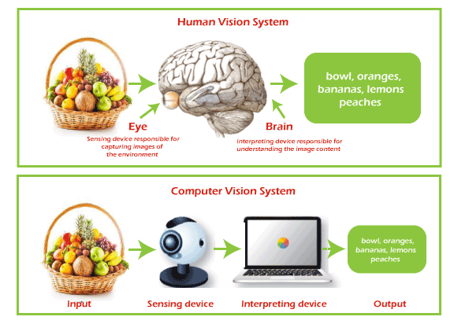
1. **Image Capture Karna**
   Sabse pehle, ek digital camera ya CCTV ke zariye image capture kiya jata hai aur us image ko digital format mein convert kiya jata hai, jo zero aur one ki form mein hota hai.

2. **Image Processing Karna**
   Dusre step mein, alag-alag CV algorithms ka use karke digital data ko process kiya jata hai. Ye algorithms image ke basic geometric elements ko identify karte hain aur stored data ke basis pe image generate karte hain.

3. **Analyze Karke Action Lena**
   Ant mein, CV data ko analyze karta hai aur is analysis ke basis pe required action perform karta hai.

### Top Computer Vision Techniques

1. **Image Classification**
   Ye ek basic aur simple CV technique hai jisme ek image ko ek ya zyada categories mein classify kiya jata hai. Image classifier ek image ko input ke roop mein leta hai aur uske andar ke objects ko identify karta hai, jaise ek person, dog, tree, etc. Lekin, ye image ke baare mein detailed information nahi deta, jaise kitne log hain, unka position kya hai, etc. Iske liye humein dusri techniques ki zarurat hoti hai.

   **Types**:
   - **Binary Classification**: Image mein ek specific object ko detect karta hai (jaise skin cancer hai ya nahi).
   - **Multi-class Classification**: Multiple classes ko detect karta hai ek hi image mein.

2. **Object Detection**
   Ye technique image classification ke baad ya uske sath use hoti hai. Isme object ko image mein boundary boxes ke sath locate kiya jata hai. Ye deep learning aur machine learning algorithms ka use karke kiya jata hai. Object detection ke applications mein object tracking, retrieval, surveillance, aur image captioning shamil hain. Popular techniques include R-CNN aur YOLO (You Only Look Once).

3. **Semantic Segmentation**
   Isme image ke har pixel ko classify kiya jata hai taaki image ke objects ke roles ko samjha ja sake. Ye similar objects ko ek hi class mein classify karta hai, bina object instances ko differentiate kiye. Jaise agar image mein do dogs hain, to dono ko same label diya jayega.

4. **Instance Segmentation**
   Ye semantic segmentation ka advanced version hai. Isme similar objects ko alag-alag categories mein classify kiya jata hai. Example ke liye, agar ek image mein multiple cars hain, to instance segmentation unhe unki color ya shape ke basis pe alag-alag label karega. Mask R-CNN is technique ke liye ek popular CNN architecture hai.

5. **Panoptic Segmentation**
   Ye technique semantic aur instance segmentation ko combine karti hai. Isme image ke pixels ko classify kiya jata hai aur ek hi class ke alag-alag instances ko bhi identify kiya jata hai.

6. **Keypoint Detection**
   Is technique ka main focus image mein kuch key points ko detect karna hota hai. Ye humans ke body aur face key points ko identify karne ke liye use hota hai. Iska use pose estimation mein bhi hota hai, jisme body ke different parts, jaise head, arms, hands, etc., ko detect kiya jata hai.

7. **Person Segmentation**
   Is technique ka use image mein person ko background se alag karne ke liye hota hai. Ye pose estimation ke baad use hoti hai taaki person ke exact location ko aur uske pose ko identify kiya ja sake.

8. **Depth Perception**
   Ye technique machine ko 3D depth ya distance estimate karne ki ability deti hai. Ye self-driving cars, robotics, aur augmented reality mein use hoti hai. LiDAR (Light Detection and Ranging) isme popular technique hai, jo laser beams ke through object ki distance measure karti hai.

9. **Image Captioning**
   Ye ek aisi technique hai jisme input image ko ek suitable caption diya jata hai jo image ke content ko describe karta hai. Ye task computer vision aur natural language processing (NLP) dono ka part hai.

10. **3D Object Reconstruction**
    Ye technique ek 2D image se 3D object create karne ke liye hoti hai. PiFuHD ek successful paper hai jo 3D human digitization ke bare mein batata hai.

In techniques ka use alag-alag applications mein hota hai, jaise healthcare, autonomous vehicles, surveillance, aur robotics. Har technique ki apni specific strengths aur use cases hote hain.

---
## Computer Vision Techniques

As human beings, we can see, process, understand, and act on anything that we can see or any visual input; in other words, we have the ability to see and understand any visual data. But how we can implement the same thing in machines? So, here Computer Vision comes into the picture. Although there are still various limitations in machines to visualise similar to humans, they are very close to analysing, understanding, and extracting meaningful information from any visual input. Nowadays, Computer vision is one of the trending research areas with deep learning.

In this topic, we will have a deep understanding of different computer vision techniques that are currently being used in several applications. However, before starting, let's first understand the basic introduction of computer vision.

What is Computer Vision?
Computer vision is a sub-field of AI and machine learning that enables the machine to see, understand, and interpret the visuals such as images, video, etc., and extract useful information from them that can be helpful in the decision-making of AI applications. It can be considered as an eye for an AI application. With the help of computer vision technology, such tasks can be done that would be impossible without this technology, such as Self Driving Cars.

Computer Vision Process
Computer Vision Techniques
A typic process of Computer vision is illustrated in the above image. It mainly performs three steps, which are:

1. Capturing an Image

A computer vision software or application always includes a digital camera or CCTV to capture the image. So, firstly it captures the image and puts it as a digital file that consists of Zero and one's.

2. Processing the image

In the next step, different CV algorithms are used to process the digital data stored in a file. These algorithms determine the basic geometric elements and generate the image using the stored digital data.

3. Analyzing and taking required action

Finally, the CV analyses the data, and according to this analysis, the system takes the required action for which it is designed.

Top Computer Vision Techniques
1. Image Classification

Image classification is the simplest technique of Computer Vision. The main aim of image classification is to classify the image into one or more different categories. Image classifier basically takes an image as input and tells about different objects present in that image, such as a person, dog, tree, etc. However, it would not give you other more information about the image data, such as how many persons are there, tree colour, item positions, etc., and for this, we need to go for any other CV technique.

Image classification is basically of two types, Binary classification and multi-class classification. As the name suggests, binary image classification looks for a single class in the given image and provides results based on if the image has that object or not. For example, we can achieve superhuman performance in detecting skin cancer in humans by training an AI system on both images that have skin cancer and images that do not have skin cancer.

2. Object Detection

Object detection is another popular technique of computer vision that can be performed after Image classification or which uses image classification to detect the objects in visual data. It is basically used to recognize the objects within the boundary boxes and find the class of the objects in the image. Object detection makes use of deep learning and machine learning technology to generate useful results.

As human beings, whenever we see a visual or look at an image or video, we can immediately recognize and even locate the objects within a moment. So, the aim of object detection is to replicate the same human intelligence into machines to identify and locate the objects.

Object detection has several applications, including object tracking, retrieval, video surveillance, image captioning, etc.

A variety of techniques can be used to perform object detection, which includes R-CNN, YOLO v2, etc.

3. Semantic Segmentation

Semantic Segmentation is not only about detecting the classes in an image as image classification. Instead, it classifies each pixel of an image to specify what objects it has. It tries to determine the role of each pixel in the image. It basically classifies pixelS in a particular category without differentiating the object instances. Or we can say it classifies similar objects as a single class from the pixel levels. For example, if an image contains two dogs, then semantic segmentation will put both the dogs under the same label. It tries to understand the role of each pixel in an image.

4. Instance Segmentation

Instance segmentation can classify the objects in an image at pixel level as similar to semantic segmentation but with a more advanced level. It means Instance Segmentation can classify similar types of objects into different categories. For example, if visual consists of various cars, then with semantic segmentation, we can tell that there are multiple cars, but with instance segmentation, we can label them according to their colour, shape, etc.

Instance segmentation is a typical computer vision task compared to other techniques as it needs to analyse the difference within visual data with different overlapping objects and different backgrounds.

In Instance segmentation, CNN or Convolutional Neural Networks can be effectively used, where they can locate the objects at pixels level instead of just bounding the boxes. A well-known example of CNN and instance segmentation is Facebook AI. This application can detect or differentiate two colours of the same object, and the architecture of CNN used in this is known as Mask R-CNN or Mask Region-Based Convolutional Neural Network.

Using the below image, we can analyse the difference between semantic segmentation and instance segmentation, where semantic segmentation classified all the persons as singly entities, whereas instance segmentation classified all the persons as different by considering colours also.

Computer Vision Techniques
5. Panoptic Segmentation

Panoptic Segmentation is one of the most powerful computer vision techniques as it combines the Instance and Semantic Segmentation techniques. It means with Panoptic Segmentation, you can classify image objects at pixel levels and can also identify separate instances of that class.

6. Keypoint Detection

Keypoint detection tries to detect some key points in an image to give more details about a class of objects. It basically detects people and localizes their key points. There are mainly two keypoint detection areas, which are Body Keypoint Detection and Facial Keypoint Detection.

For example, Facial keypoint detection includes detecting key parts of the human face such as the nose, eyes, corners, eyebrows, etc. Keypoint detection mainly has applications, including face detection, pose detection, etc.

With Pose estimation, we can detect what pose people have in a given image, which usually includes where the head, eyes, nose, arms, shoulders, hands, and legs are in an image. This can be done for a single person or multiple people as per the need.

7. Person Segmentation

Person segmentation is a type of image segmentation technique which is used to separate the person from the background within an image. It can be used after the pose estimation, as with this, we can closely identify the exact location of the person in the image as well as the pose of that person.

8. Depth Perception

Depth perception is a computer vision technique that provides the visual ability to machines to estimate the 3D depth/distance of an object from the source. Depth Perception has wide applications, including the Reconstruction of objects in Augmented Reality, Robotics, self-driving cars, etc. LiDAR(Lights Detection and Ranging) is one of the popular techniques that is used for in-depth perception. With the help of laser beams, it measures the relative distance of an object by illuminating it with laser light and then measuring the reflections using sensors.

9. Image Captioning

Image captioning, as the name suggests, is about giving a suitable caption to the image that can describe the image. It makes use of neural networks, where when we input an image, then it generates a caption for that image that can easily describe the image. It is not only the task of Computer vision but also an NLP task.

10. 3D Object Reconstruction

As the name suggests, 3D object reconstruction is a technique that can extract 3D objects from a 2D image. Currently, it is a much-developing field of computer vision, and it can be done in different ways for different objects. On this technique, one of the most successful papers is PiFuHD, which tells about 3D human digitization.

---
---
## Applications of computer vision 

### 1. **Medical Imaging**
- **Application**: Computer vision medical field mein radiologists ki madad karta hai diseases diagnose karne mein. Ye X-rays, MRIs, aur CT scans ko analyze karke anomalies detect karta hai aur fast diagnosis deta hai.
- **Techniques Used**:
  - **Image Classification**: Ye determine karta hai ki ek image kisi specific condition ko show karti hai (e.g., mammogram mein breast cancer ka hona).
  - **Object Detection**: Scans mein tumors ya abnormal growths ko identify karke unke around boundary boxes draw karta hai.
  - **Semantic Segmentation**: Alag-alag tissues ko segment karta hai, taaki healthy aur affected areas ko distinguish kiya ja sake.
- **Example**: AI algorithms ko train karne se early-stage cancer detection mein help milti hai, jisse doctors un cases ko identify kar sakte hain jo miss ho sakte hain.
- **Benefits**: Fast diagnosis, radiologists ka workload kam, aur early detection rates mein badhawa.
- **Challenges**: High initial cost, quality training data ki requirement, aur regulatory approval.

### 2. **Self-Driving Cars**
- **Application**: Self-driving cars mein computer vision use hota hai road navigation, traffic signs ki pehchaan, pedestrians ko detect karne, aur obstacles se bachne ke liye.
- **Techniques Used**:
  - **Object Detection**: Vehicles, pedestrians, aur traffic signals ko identify karna.
  - **Depth Perception**: Sensors (jaise LiDAR, cameras) se distance measure karna.
  - **Semantic aur Instance Segmentation**: Image ke har pixel ko classify karna taaki alag-alag objects identify ho sakein.
- **Example**: Tesla ka Autopilot aur Waymo self-driving technology ka use karte hain environment ke basis par real-time decisions lene ke liye.
- **Benefits**: Human error kam, safety increase, aur traffic efficiency improve hoti hai.
- **Challenges**: Complex environments, weather conditions, aur ethical concerns.

### 3. **Facial Recognition**
- **Application**: Security systems mein identity verification, access control, aur user authentication ke liye use hota hai, aur marketing mein customer insights ke liye bhi.
- **Techniques Used**:
  - **Keypoint Detection**: Face par specific landmarks (jaise eyes, nose, mouth) identify karna aur unique facial signature banana.
  - **Instance Segmentation**: Alag-alag logon ko alag karna aur unke facial features ko analyze karna.
- **Example**: Smartphones mein facial recognition ka use device unlock karne ke liye hota hai, aur security systems real-time mein logo ko identify karte hain.
- **Benefits**: Enhanced security, convenient access control, aur personalized user experiences.
- **Challenges**: Privacy concerns, algorithms mein potential biases, aur false positives/negatives.

### 4. **Retail aur E-commerce**
- **Application**: Customer experience ko improve karne ke liye use hota hai, jaise product recognition, virtual fitting rooms, aur automated checkout systems. Computer vision shopping experiences ko personalize karta hai aur customer satisfaction increase karta hai.
- **Techniques Used**:
  - **Object Detection**: Images ya videos mein products ko identify karna.
  - **Image Classification**: Products ko type, color, size, etc. ke basis par categorize karna.
- **Example**: Amazon Go stores computer vision ka use karte hain items track karne ke liye jo customers pick karte hain, bina traditional checkout ke.
- **Benefits**: Improved user experience, higher conversion rates, aur customer convenience.
- **Challenges**: Data security aur privacy, high development costs, aur robust infrastructure ki requirement.

### 5. **Surveillance aur Security**
- **Application**: Public spaces mein safety ko monitor karna real-time. Ye crime prevention, suspicious behavior detection, aur public events ko monitor karne ke liye use hota hai.
- **Techniques Used**:
  - **Person Segmentation**: Surveillance footage mein individuals ko detect karna aur isolate karna.
  - **Object Detection aur Keypoint Detection**: Logo ko detect karna aur unki movements ko track karna.
- **Example**: AI-powered CCTV systems facial recognition aur behavior analysis ka use karte hain potential threats ko alert karne ke liye.
- **Benefits**: Increased safety, proactive threat management, aur investigation ke liye evidence collection.
- **Challenges**: Privacy issues, misuse ka potential, aur high implementation costs.

### 6. **Agriculture**
- **Application**: Farming ko revolutionize karna, crop health monitor karna, pest infestations detect karna, aur tasks jaise harvesting ko automate karna.
- **Techniques Used**:
  - **Image Classification**: Healthy aur unhealthy crops ko identify karna.
  - **Object Detection aur Instance Segmentation**: Plants mein pests ya diseases ko detect karna aur unhe differentiate karna.
- **Example**: Drones jo computer vision se equipped hote hain, fields par fly karte hain aur images capture karte hain, jisse crop health assess hoti hai aur irrigation ya pest control ke recommendations milte hain.
- **Benefits**: Crop yield increase hota hai, pesticide ka use kam hota hai, aur farming practices zyada efficient hoti hain.
- **Challenges**: Equipment ka high cost, advanced technical expertise ki requirement, aur rural areas mein limited internet connectivity.

### 7. **Augmented Reality (AR)**
- **Application**: Gaming, education, training, aur marketing mein user experiences ko enhance karna. Computer vision real world par virtual elements overlay karta hai, jisse interactive experiences create hote hain.
- **Techniques Used**:
  - **Depth Perception**: Physical space ko map karna aur virtual objects ko accurately place karna.
  - **Keypoint Detection**: Real-world objects ko track karna aur unke saath interact karna.
  - **Instance Segmentation**: Different objects ko differentiate karna aur unke saath interaction allow karna.
- **Example**: IKEA Place app users ko dekhne deta hai ki furniture unke ghar mein kaisa lagega, purchase se pehle.
- **Benefits**: Engaging experiences, improved learning, aur innovative marketing strategies.
- **Challenges**: Computationally intensive, strong hardware ki requirement, aur public spaces mein safety concerns.

### 8. **Industrial Automation aur Quality Control**
- **Application**: Production lines par quality checks automate karna taaki products standards meet karein aur human error kam ho.
- **Techniques Used**:
  - **Object Detection aur Image Classification**: Defects detect karna aur product types ko categorize karna.
  - **Semantic Segmentation**: Products mein faulty areas ko isolate karna.
- **Example**: Manufacturing mein computer vision systems cracks, misalignments, aur defects ko real-time mein spot karte hain.
- **Benefits**: Efficiency increase hoti hai, wastage kam hota hai, aur product quality improve hoti hai.
- **Challenges**: High initial cost, existing systems ke sath integration, aur potential software errors jo false negatives lead karte hain.

---

Here's a more detailed look at 8 key applications of computer vision techniques:

### 1. **Medical Imaging**
- **Application**: Computer vision is revolutionizing the medical field by assisting radiologists in diagnosing diseases. It automates the analysis of medical images like X-rays, MRIs, and CT scans to identify anomalies, detect diseases, and provide faster diagnostics.
- **Techniques Used**:
  - **Image Classification**: Identifying whether an image has a specific condition (e.g., identifying whether a mammogram shows signs of breast cancer).
  - **Object Detection**: Locating tumors or abnormal growths in scans and drawing bounding boxes around them.
  - **Semantic Segmentation**: Segmenting different tissues to distinguish between healthy and affected areas.
- **Example**: AI algorithms trained on large datasets can detect early-stage cancer, such as breast cancer in mammograms, with high accuracy, assisting doctors in diagnosing cases that might be missed otherwise.
- **Benefits**: Faster diagnosis, reduced workload for radiologists, and potentially increased early detection rates.
- **Challenges**: High initial cost for implementation, need for high-quality training data, and regulatory approval.

### 2. **Self-Driving Cars**
- **Application**: Autonomous vehicles rely on computer vision to navigate roads, recognize traffic signs, detect pedestrians, and avoid obstacles. This technology makes it possible for vehicles to drive safely without human intervention.
- **Techniques Used**:
  - **Object Detection**: Identifying and locating objects such as pedestrians, other vehicles, and traffic signals.
  - **Depth Perception**: Using sensors (e.g., LiDAR, cameras) to measure the distance to objects.
  - **Semantic and Instance Segmentation**: Classifying each pixel of an image to identify objects and distinguish between different instances of the same class.
- **Example**: Tesla’s Autopilot and Waymo use computer vision to make real-time decisions based on their environment.
- **Benefits**: Reduced human error, increased safety, and improved traffic efficiency.
- **Challenges**: Complex environments, varied weather conditions, and ethical concerns.

### 3. **Facial Recognition**
- **Application**: Used in security systems for identity verification, access control, and user authentication, as well as in marketing for customer insights.
- **Techniques Used**:
  - **Keypoint Detection**: Identifying specific landmarks on the face (e.g., eyes, nose, mouth) to create a unique facial signature.
  - **Instance Segmentation**: Differentiating between different people by analyzing facial features at the pixel level.
- **Example**: Smartphones use facial recognition to unlock devices, and security systems use it to identify individuals in real-time.
- **Benefits**: Enhanced security, convenient access control, and personalized user experiences.
- **Challenges**: Privacy concerns, potential biases in algorithms, and false positives/negatives.

### 4. **Retail and E-commerce**
- **Application**: Enhancing customer experience through features like product recognition, virtual fitting rooms, and automated checkout systems. Computer vision helps in personalizing shopping experiences and increasing customer satisfaction.
- **Techniques Used**:
  - **Object Detection**: Identifying products within images or videos to create product catalogs.
  - **Image Classification**: Categorizing items based on type, color, size, etc.
- **Example**: Amazon Go stores use computer vision to track items picked up by customers, eliminating the need for traditional checkouts.
- **Benefits**: Improved user experience, higher conversion rates, and convenience for customers.
- **Challenges**: Ensuring data security and privacy, high development costs, and the need for robust infrastructure.

### 5. **Surveillance and Security**
- **Application**: Enhancing safety in public spaces by monitoring activities in real-time. It can be used for crime prevention, detecting suspicious behavior, and monitoring public events.
- **Techniques Used**:
  - **Person Segmentation**: Detecting and isolating individuals from the background in surveillance footage.
  - **Object Detection and Keypoint Detection**: Identifying people and tracking their movements.
- **Example**: AI-powered CCTV systems equipped with facial recognition and behavior analysis can alert security personnel of potential threats.
- **Benefits**: Increased safety, proactive threat management, and evidence collection for investigations.
- **Challenges**: Privacy issues, the potential for misuse, and high implementation costs.

### 6. **Agriculture**
- **Application**: Revolutionizing farming by monitoring crop health, identifying pest infestations, and automating tasks like harvesting.
- **Techniques Used**:
  - **Image Classification**: Identifying healthy and unhealthy crops.
  - **Object Detection and Instance Segmentation**: Detecting pests or diseases in plants and distinguishing between them.
- **Example**: Drones equipped with computer vision can fly over fields, capturing images that are analyzed to assess crop health, and provide recommendations for irrigation or pest control.
- **Benefits**: Increased crop yield, reduced use of pesticides, and more efficient farming practices.
- **Challenges**: High cost of equipment, need for advanced technical expertise, and limited internet connectivity in rural areas.

### 7. **Augmented Reality (AR)**
- **Application**: Enhancing user experiences in gaming, education, training, and marketing. Computer vision enables virtual elements to be overlaid onto the real world, creating immersive interactions.
- **Techniques Used**:
  - **Depth Perception**: To map the physical space and place virtual objects accurately.
  - **Keypoint Detection**: To track and interact with real-world objects.
  - **Instance Segmentation**: To differentiate between different objects and allow interaction with them.
- **Example**: Apps like IKEA Place allow users to see how furniture would look in their homes before buying.
- **Benefits**: Engaging experiences, improved learning, and innovative marketing strategies.
- **Challenges**: Computationally intensive, needs robust hardware, and potential safety concerns when using AR in public spaces.

### 8. **Industrial Automation and Quality Control**
- **Application**: Automating quality checks on production lines to ensure that products meet specific standards and reducing human error.
- **Techniques Used**:
  - **Object Detection and Image Classification**: Detecting defects and categorizing product types.
  - **Semantic Segmentation**: Isolating faulty areas in products for further inspection or sorting.
- **Example**: Computer vision systems in manufacturing can spot cracks, misalignments, and other defects in real-time during production.
- **Benefits**: Increased efficiency, reduced wastage, and higher product quality.
- **Challenges**: High initial cost, integration with existing systems, and potential for software errors that lead to false negatives.

These applications show how computer vision is transforming various industries by automating complex tasks, improving efficiency, and providing innovative solutions to longstanding challenges.

---

Yahan par computer vision ke 8 advantages aur disadvantages ki detail di gayi hai:

### **Computer Vision ke Advantages**
1. **Zyada Efficiency aur Productivity**
   - **Faida**: Computer vision repetitive aur time-consuming tasks ko automate kar sakta hai, jisse human intervention ki zarurat kam ho jaati hai aur kaam tezi se hota hai.
   - **Udaharan**: Manufacturing lines mein automated quality control system turant defects detect kar sakta hai bina human inspection ke.

2. **Improved Accuracy aur Precision**
   - **Faida**: Computer vision systems bade data volumes ko high accuracy ke sath analyze kar sakte hain, aur aise details dekh sakte hain jo human eye se miss ho sakti hain.
   - **Udaharan**: Medical imaging mein, computer vision chhote tumors ya abnormalities ko identify karne mein madad karta hai jo radiologists miss kar sakte hain.

3. **Enhanced Safety aur Security**
   - **Faida**: Computer vision surveillance footage ko real-time mein monitor karke unusual activity detect karne mein madad karta hai, jisse crimes prevent ho sakte hain aur public safety badh sakti hai.
   - **Udaharan**: Smart CCTV systems facial recognition ke sath security team ko alert kar sakte hain agar koi known suspect restricted area mein ho.

4. **Cost Reduction**
   - **Faida**: Computer vision se processes automate hote hain, jisse labor costs aur operational expenses kam hote hain, aur long-term savings hoti hai.
   - **Udaharan**: Automated checkout systems in stores cashiers ki zarurat ko kam karte hain, jo staffing expenses ko reduce karta hai.

5. **24/7 Operation**
   - **Faida**: Computer vision systems bina rukawat ke continuously operate kar sakte hain, jo human workers ke liye mushkil hota hai. Isse non-stop surveillance aur analysis possible hota hai.
   - **Udaharan**: Airports ya large venues mein surveillance systems, jo continuous monitoring ke liye zaroori hote hain.

6. **Enhanced Customer Experience**
   - **Faida**: Computer vision se users ke liye interactive aur personalized experiences create kiye ja sakte hain, jisse customer satisfaction improve hoti hai.
   - **Udaharan**: E-commerce platforms par virtual fitting rooms, jisse users digital tarike se kapde try kar sakte hain.

7. **Real-Time Data Processing**
   - **Faida**: Computer vision systems real-time data ko process aur analyze kar sakte hain, jo quick decision-making ke liye important hai.
   - **Udaharan**: Self-driving cars ko turant object detection aur decision-making ki zarurat hoti hai taaki wo safely navigate kar sakein aur accidents se bachein.

8. **Advanced Technologies ka Support**
   - **Faida**: Computer vision AR (Augmented Reality) aur AI (Artificial Intelligence) jaise advanced technologies ko support karta hai, jisse innovative solutions milte hain.
   - **Udaharan**: AR apps jo real-world objects par information overlay karte hain, wo computer vision ka use karke un objects ko accurately track karte hain.

### **Computer Vision ke Disadvantages**
1. **High Initial Cost**
   - **Nuksan**: Computer vision systems ko implement karna mehenga ho sakta hai, kyunki specialized hardware, software, aur development ki zarurat hoti hai.
   - **Udaharan**: Fully automated quality control systems ko set up karne mein bahut zyada paisa lagta hai.

2. **Technical Limitations**
   - **Nuksan**: Complex ya dynamic environments mein computer vision systems achha perform nahi karte, jaise low-light ya foggy conditions mein.
   - **Udaharan**: Self-driving cars heavy rain ya poor visibility ke waqt mushkil mein pad sakte hain.

3. **Data Privacy Concerns**
   - **Nuksan**: Surveillance aur facial recognition ke use se privacy issues ho sakte hain aur personal data ka misuse bhi ho sakta hai.
   - **Udaharan**: Public cameras jo facial recognition use karti hain, wo individuals ki tracking bina unki permission ke kar sakte hain, jo privacy issue create karta hai.

4. **Algorithm Bias**
   - **Nuksan**: Computer vision models unke training data ke biases ko inherit kar sakte hain, jisse unfair ya inaccurate outcomes ho sakte hain.
   - **Udaharan**: Facial recognition software agar diverse dataset par train na kiya ho toh kuch ethnic groups ke liye biased results de sakta hai.

5. **Complexity aur Expertise ki Zarurat**
   - **Nuksan**: Computer vision systems ko develop aur maintain karne ke liye specialized knowledge aur expertise ki zarurat hoti hai, jo milna mushkil hota hai.
   - **Udaharan**: Companies ko skilled data scientists aur engineers ki zarurat hoti hai taaki wo AI models ko train aur update kar sakein.

6. **Quality Data ki Dependence**
   - **Nuksan**: High-quality aur well-labeled data computer vision models ki training ke liye essential hoti hai, aur poor data quality se performance affect hota hai.
   - **Udaharan**: Self-driving car systems agar low-resolution ya inconsistent labeled images se train kiye gaye ho toh road signs ko galat tarike se interpret kar sakte hain.

7. **Limited Adaptability**
   - **Nuksan**: Computer vision models unexpected changes ko adapt nahi kar sakte bina re-training ke.
   - **Udaharan**: Ek industrial quality control system agar new defect type ko detect karne ke liye train na ho toh wo usse identify nahi kar paayega.

8. **Potential for Misuse**
   - **Nuksan**: Computer vision technology ko unethical purposes ke liye bhi use kiya ja sakta hai, jaise unauthorized surveillance, identity theft, ya public opinion ko manipulate karna.
   - **Udaharan**: Deepfake technology, jo computer vision aur AI ka use karti hai, fake videos aur images create kar sakti hai, jo misinformation spread karne mein madadgar hota hai.

Ye advantages aur disadvantages computer vision ke faayde, challenges, aur ethical issues ko highlight karte hain.

---

Here's a detailed list of 8 advantages and disadvantages of computer vision technology:

### **Advantages of Computer Vision**
1. **Increased Efficiency and Productivity**
   - **Advantage**: Computer vision can automate repetitive and time-consuming tasks, reducing the need for human intervention. This leads to faster processing and greater productivity.
   - **Example**: Automated quality control in manufacturing lines ensures defects are detected instantly without human inspection delays.

2. **Improved Accuracy and Precision**
   - **Advantage**: Computer vision systems can analyze large volumes of data with high accuracy, detecting details that might be missed by human eyes.
   - **Example**: In medical imaging, computer vision can identify tiny tumors or abnormalities that radiologists might overlook.

3. **Enhanced Safety and Security**
   - **Advantage**: Computer vision can monitor surveillance footage in real-time and detect unusual activity, helping prevent crimes and ensuring public safety.
   - **Example**: Smart CCTV systems equipped with facial recognition can alert security teams if a known suspect is present in a restricted area.

4. **Cost Reduction**
   - **Advantage**: Automating processes with computer vision can reduce labor costs and improve operational efficiency, leading to long-term savings.
   - **Example**: Automated checkout systems in stores can cut down on the need for cashiers, reducing staffing expenses.

5. **24/7 Operation**
   - **Advantage**: Computer vision systems can operate continuously without breaks, unlike humans who need rest, allowing for non-stop surveillance and analysis.
   - **Example**: Surveillance systems in airports or large venues that need constant monitoring for security threats.

6. **Enhanced Customer Experiences**
   - **Advantage**: Computer vision can be used to create interactive and personalized experiences for users in areas like e-commerce and marketing.
   - **Example**: Virtual fitting rooms in online shopping platforms let users try on clothes digitally, improving the shopping experience.

7. **Real-Time Data Processing**
   - **Advantage**: Computer vision systems can process and analyze data in real-time, which is crucial for applications that require quick decision-making.
   - **Example**: Self-driving cars need instant object detection and decision-making to navigate safely and avoid accidents.

8. **Support for Advanced Technologies**
   - **Advantage**: Computer vision supports other technologies like AR (Augmented Reality) and AI (Artificial Intelligence), leading to more innovative and advanced solutions.
   - **Example**: AR apps that overlay information on real-world objects can use computer vision to track and interact with those objects accurately.

### **Disadvantages of Computer Vision**
1. **High Initial Cost**
   - **Disadvantage**: Implementing computer vision systems can be expensive due to the cost of specialized hardware, software, and development.
   - **Example**: Setting up a fully automated quality control system in a factory may require significant investment in cameras, sensors, and AI development.

2. **Technical Limitations**
   - **Disadvantage**: Computer vision systems may struggle in complex or dynamic environments where conditions change rapidly, such as low-light or foggy situations.
   - **Example**: Self-driving cars may face challenges navigating in heavy rain or poor visibility.

3. **Data Privacy Concerns**
   - **Disadvantage**: The use of computer vision, especially in surveillance and facial recognition, can lead to privacy issues and the misuse of personal data.
   - **Example**: Public cameras equipped with facial recognition may raise concerns about unauthorized tracking of individuals without their consent.

4. **Algorithm Bias**
   - **Disadvantage**: Computer vision systems can inherit biases present in training data, leading to unfair or inaccurate outcomes.
   - **Example**: Facial recognition software may show biases towards certain ethnic groups if not trained on diverse datasets.

5. **Complexity and Expertise Requirement**
   - **Disadvantage**: Developing and maintaining computer vision systems requires specialized knowledge and expertise, which may be difficult to find and maintain.
   - **Example**: Companies may need skilled data scientists and engineers to build and update AI models for accurate image processing.

6. **Dependence on Quality Data**
   - **Disadvantage**: High-quality, well-labeled data is essential for training computer vision models, and poor data quality can lead to subpar performance.
   - **Example**: A self-driving car’s system might misinterpret road signs if trained with images that have poor resolution or inconsistent labeling.

7. **Limited Adaptability**
   - **Disadvantage**: Computer vision models may not adapt well to unexpected changes in their environment without re-training or updates.
   - **Example**: An industrial quality control system trained to identify certain product defects may fail to recognize new or previously unseen defects.

8. **Potential for Misuse**
   - **Disadvantage**: Computer vision technology can be misused for unethical purposes such as unauthorized surveillance, identity theft, or manipulation of public opinion.
   - **Example**: Deepfake technology, which uses computer vision and AI, can create fake videos and images, leading to misinformation.

These advantages and disadvantages highlight the benefits of computer vision, as well as its challenges and ethical considerations.

---

